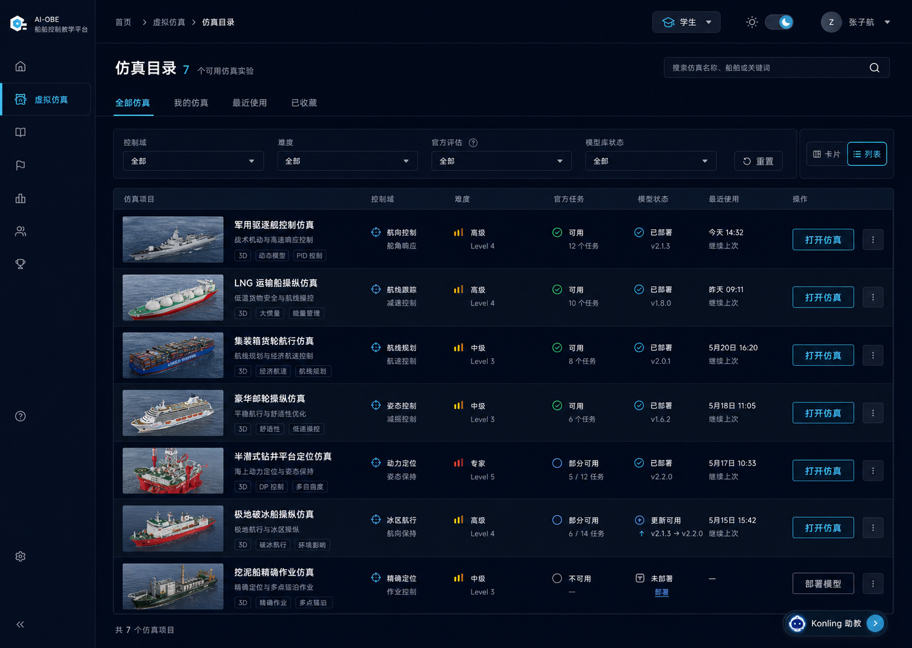
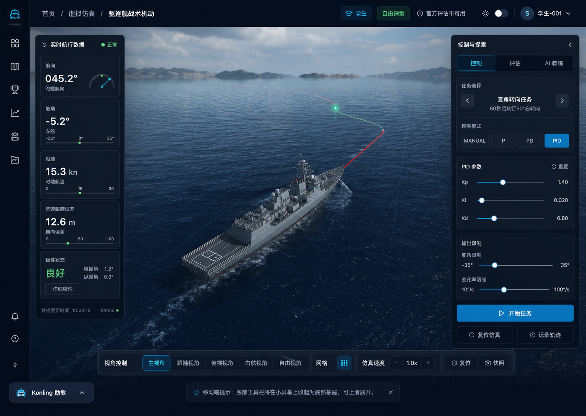
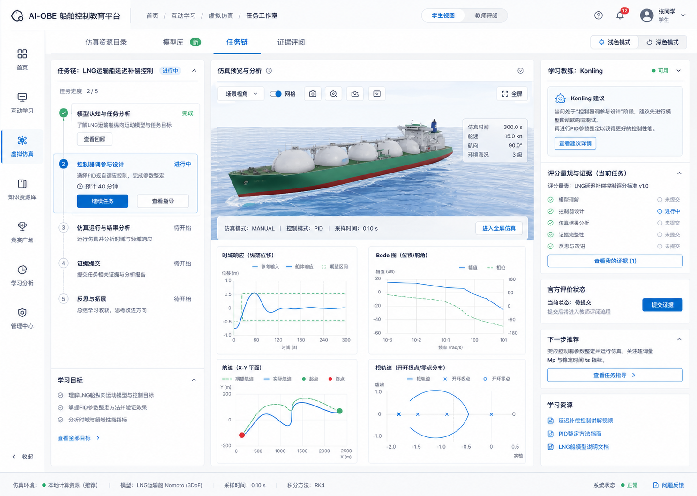

# 虚拟仿真统一体验设计 Handoff

日期: 2026-06-13  
状态: 设计方向已确认，待进入 OpenSpec 提案  
适用范围: `/simulations`、`/virtual-lab`、7 个 `/simulations/*` 仿真详情页、`/interactive-learning/control-workbench` 的虚拟仿真相关体验  
证据来源: 本目录下 `audit.md`、`screenshots/`、`concepts/`  

## 设计结论

本轮采用 `1 + 2 + 3` 的综合方向:

- 以概念 1 的统一目录和信息架构为基础。
- 以概念 2 的沉浸式 `SimulationShell` 为仿真详情页核心形态。
- 吸收概念 3 的学习任务、证据闭环和课程化工作流，但不保留其额外右侧独立控灵区域和角色切换。

生成式概念稿只作为视觉和布局参考，不作为逐像素真源。用户在本 handoff 中确认的修订意见优先级高于概念稿细节。后续实现应尽量达成概念稿中的高级商业化视觉质感、清晰层级和沉浸式仿真观感，但必须遵守本 handoff 的结构约束。

## 概念稿引用

### 概念 1: 平台连续性

参考图: `concepts/concept-1-platform-continuity.png`

可采纳:

- 虚拟仿真目录作为统一入口。
- 深色商业化平台质感。
- 列表式仿真目录、搜索、筛选、最近使用、打开仿真等效率型布局。
- 目录页应明显属于统一平台，而不是独立页面。

必须修订:

- 不需要“模型状态”列。学生默认接触最新模型，不应暴露模型部署状态或版本状态作为主信息。
- 左侧导航不能是图标和文本混杂状态。收起时是纯图标列，展开时是文本导航。
- 顶部右上角应是学生中心/用户中心，不需要角色切换。多数用户没有多个角色，角色切换会造成多余复杂度。
- 控灵助手应可展开，不能只作为小按钮。它需要能承载上下文建议、问答和学习辅助，但默认不遮挡主工作区。

### 概念 2: 指挥甲板 SimulationShell

参考图: `concepts/concept-2-command-deck-shell.png`

可采纳:

- 3D 场景作为仿真详情页第一视觉层级。
- 顶部面包屑、左侧统一导航、中央沉浸场景、左右控制面板、底部局部工具栏的基本关系。
- 局部控制与全局导航分离。
- 半透明仪表面板与高端控制台气质。

必须修订:

- 为了更强调沉浸感，顶部、侧边、控制面板和底部控制面板都应半透明化，并同时适配深浅模式。
- 底部控制栏必须贴近页面最底部，而不是悬在画面中部。
- 如果有可关闭提示条，应放在底部控制栏上方。
- 两侧控制面板必须可以收起。收起后不应遮挡画布，保留明确的展开按钮。
- 控灵助手形态和位置要与目录页、任务页统一，默认位于右下角上下文助手区域，可展开。

### 概念 3: 学习任务工作室

参考图: `concepts/concept-3-learning-mission-studio.png`

可采纳:

- 虚拟仿真与学习任务链、证据提交、分析图表、学习资源连接。
- 面向课程化场景的任务步骤、当前状态、下一步建议和证据闭环。
- 浅色模板的清晰层级和商业教学平台气质。

必须修订:

- 顶部导航、左侧导航、深浅色切换和用户中心必须与概念 1 的平台形态统一。
- 不需要学生/教师评阅切换。不同角色应进入不同路由或看到角色化内容，不应在页面顶部提供通用角色切换。
- 右侧面板不需要独立控灵区域。全平台统一使用右下角上下文感知控灵助手。

## 统一信息架构

### 入口层级

`/simulations` 是虚拟仿真目录与开放状态的唯一真源。

`/virtual-lab` 不再作为独立且过期的平行入口。后续只能选择以下一种处理方式:

1. 重定向到 `/simulations`。
2. 改造为 `/simulations` 体系下的“模型库”子页。
3. 保留路由但只作为兼容入口，视觉与数据全部复用 `/simulations` 的统一架构。

不允许再次出现 `/virtual-lab` 显示“当前开放 1”，而 `/simulations` 显示 7 个任务链开放的事实冲突。

### 顶层导航

统一使用平台 `AppShell`:

- 左侧导航有明确的收起态和展开态。
- 收起态: 一列图标。
- 展开态: 文本导航。
- 不允许出现图标和文本混杂、布局宽度不稳定、当前项表达不清的状态。
- 除首页外，具有多层结构的页面统一显示面包屑。

顶部右侧:

- 统一为用户中心/学生中心入口。
- 深浅色切换位置和形态全平台一致。
- 不提供通用角色切换控件。角色差异由路由、权限与服务端上下文决定。

## 页面模板

### 虚拟仿真目录页

目标: 让学生快速理解有哪些仿真、能做什么、从哪里继续。

应包含:

- 面包屑: 首页 / 虚拟仿真。
- 标题: 虚拟仿真。
- 统一搜索与筛选。
- 分类或标签: 全部仿真、最近使用、我的仿真、课程任务、自由探索。
- 仿真列表或列表/卡片切换。
- 每个仿真项展示船舶/平台预览图、名称、控制主题、难度、官方任务状态、最近使用、操作按钮。

不应包含:

- 模型部署状态、模型版本状态、模型是否最新等面向内部运维的信息。
- 与学生无关的模型安装或资源管线细节。
- 大型营销 hero。

### 模型库

目标: 作为虚拟仿真体系内的资源浏览能力，而不是另一个入口体系。

模型库可以展示:

- 船舶模型、平台模型、仿真对象。
- 关联课程、关联任务链。
- 适用控制问题。

模型库不应作为开放状态真源。开放状态以 `/simulations` 目录和任务链配置为准。

### SimulationShell

目标: 统一所有 `/simulations/*` 仿真详情页。

基本结构:

- 左侧: 平台 AppShell，支持收起和展开。
- 顶部: 半透明平台顶栏，包含面包屑、当前仿真名称、主题切换、用户中心。
- 中央: 3D 仿真场景，作为最大视觉区域。
- 左侧浮层: 状态/遥测面板，可收起。
- 右侧浮层: 控制与评估面板，可收起。
- 底部: 局部仿真工具栏，贴近页面最底部。
- 右下角: 统一控灵助手入口，可展开。

局部仿真工具栏应包含:

- 相机视角。
- 网格开关。
- 仿真速度。
- 开始/暂停/重置。
- 快照或记录轨迹。

底部提示:

- 可关闭提示条放在底部工具栏上方。
- 提示条不应遮挡核心控制按钮。
- 提示条默认只承载当前上下文必要提示，不展示长段解释。

两侧面板:

- 默认可见状态需根据页面复杂度决定，但必须可收起。
- 收起后保留边缘展开把手或按钮。
- 左侧状态面板与右侧控制面板不能和 AppShell 折叠区域冲突。
- 面板应使用半透明背景和明确边界，深浅模式下都要保证可读性。

### 学习任务工作室

目标: 承载课程化仿真、任务链和证据闭环。

应包含:

- 与目录页一致的 AppShell、顶部用户中心和深浅色切换。
- 任务链步骤。
- 当前任务目标。
- 仿真预览或分析主区域。
- 证据状态、提交状态、下一步建议。
- 角色化内容由路由和权限决定，不做页面内角色切换。

不应包含:

- 独立右侧控灵区域。
- 与统一控灵助手重复的问答入口。

## 控灵助手

控灵助手是全平台统一的上下文感知助手。

统一规则:

- 默认位于右下角。
- 可展开，展开后显示当前页面上下文、建议、问答输入和相关学习辅助。
- 在目录页、仿真详情页、任务工作室中保持一致形态和交互。
- 不作为页面内普通右侧卡片重复出现。
- 在沉浸仿真页中必须避让底部工具栏、右侧控制面板和全局设置按钮。
- 移动端可进入底部抽屉或右下角展开面板，但不能遮挡核心操作。

## 深浅模式

后续实现必须定义两套可验收模板。

深色模板:

- 适合沉浸仿真、指挥台和复杂控制面板。
- 背景可使用深海军蓝、近黑蓝、石墨色。
- 状态色使用克制的青蓝、绿色、橙色和红色。
- 面板半透明，但文字、边界和控件状态必须清楚。

浅色模板:

- 适合目录、任务工作室、教师审查和长时间阅读。
- 背景使用冷白、浅灰、浅蓝灰。
- 文字以深海军蓝或高对比中性色为主。
- 控制台浮层可使用浅色半透明或玻璃质感，但不能降低可读性。

共同规则:

- 不是简单反色。
- 3D 场景可以保留自然环境色，但外层导航、面板、按钮、tab、表单和工具栏必须使用平台 token。
- 所有状态色在深浅模式下都要有独立可读版本。

## 视觉品质目标

需要尽量达成概念稿体现的视觉风格:

- 高级商业化教学平台，而不是技术 demo。
- 控制台气质清晰，但不要变成游戏 HUD。
- 信息密度适合教学和仿真操作，不做营销式大图首页。
- 页面层级由布局、间距、字体、透明度和轻量分隔建立，不堆叠卡片。
- 组件圆角控制在 8px 或以下，除非既有设计系统明确要求。
- 避免一页内多套按钮、tab、卡片、浮层风格并存。

## OpenSpec 建议拆分

建议作为系列变更提出，不要做成单一大变更。

1. 虚拟仿真信息架构统一
   - 统一 `/simulations` 与 `/virtual-lab`。
   - 建立目录、模型库、任务链、自由探索的关系。

2. SimulationShell 平台壳层
   - 所有 `/simulations/*` 接入统一 AppShell、面包屑、用户中心和主题切换。
   - 定义沉浸式仿真页的全局导航与局部控制关系。

3. 仿真局部工具与面板治理
   - 统一底部工具栏、左右面板、提示条、收起/展开规则。
   - 抽象航向控制、DP/定位、舒适度/频响、冰区推进等面板模板。

4. 控灵助手统一
   - 统一右下角上下文助手。
   - 删除页面内重复控灵区域。
   - 加入避让规则和移动端抽屉规则。

5. 双主题视觉模板
   - 建立虚拟仿真目录、SimulationShell、任务工作室的深浅模式验收样例。
   - 修复当前固定浅场景加深色控制卡的混合问题。

6. 视觉治理与验收
   - 增加截图证据、路由治理、可访问性和移动端门禁。

## 验收标准

每个变更完成后必须有可查证的验收材料。

最低视觉验收:

- `/simulations` desktop dark/light。
- `/virtual-lab` 或其替代/重定向行为。
- 至少一个航向控制类仿真页，例如 `/simulations/destroyer`。
- 至少一个 DP/定位类仿真页，例如 `/simulations/drilling` 或 `/simulations/dredger`。
- `/simulations/cruise` 作为课程化仿真页参照。
- `/interactive-learning/control-workbench` 不得因统一改造退化。
- 移动端目录页。
- 移动端代表仿真页。

最低交互验收:

- 左侧导航收起/展开。
- 两侧仿真面板收起/展开。
- 底部工具栏贴底。
- 提示条在底部工具栏上方，可关闭。
- 控灵助手收起/展开，且不遮挡关键控制。
- 深浅模式切换后主要文本、状态色、按钮、面板仍可读。

最低语义验收:

- `/virtual-lab` 不再显示与 `/simulations` 冲突的开放状态。
- 目录页不展示模型状态作为学生主信息。
- 页面顶部不提供通用角色切换。
- 不出现重复控灵入口。
- 学生、教师、管理员的差异由路由和权限决定。

## 非目标

- 本轮不要求重新设计 logo。
- 本轮不要求新生成船舶 3D 模型。
- 本轮不要求改动仿真数值内核。
- 本轮不以生成图逐像素还原为目标。
- 本轮不引入独立于现有平台的新导航体系。

## 后续建议

下一步使用 `openspec-buddy propose`，以本 handoff 和 `audit.md` 为输入提出变更系列。提案应把“视觉风格尽量达成”转化为具体 spec delta、任务和验收门槛，避免实现阶段退回局部页面微调。
