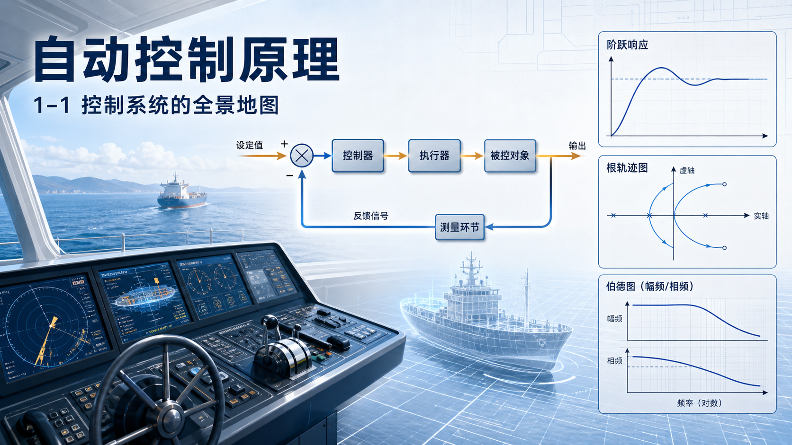
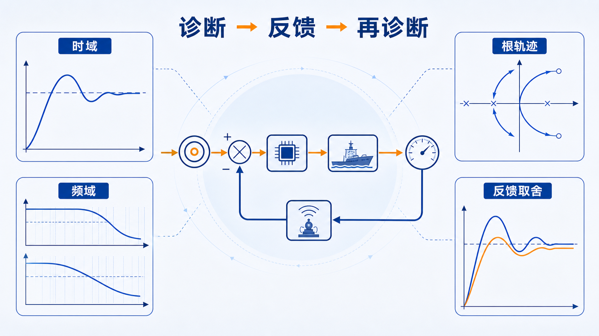

# 单元 1-1 | 看见整门课：基本概念、反馈思想与课程总图

## 课次信息

- 课程：自动控制原理
- 单元编号：1-1
- 课型：理论
- 层次：模块1 导论串讲 · 第一课
- 学时：90分钟
- 知识类型：[X] 跨域型（课程总图建立）
- 前置知识：高中物理中的平衡、变化与简单调节直觉；对机械、电气或生活系统的基本观察经验
- 讲义定位：这份讲义将帮助我们用统一的控制语言识别系统、理解反馈为何成为课程核心，并建立整门课的学习地图与学习规则。
- 后续：模型、根轨迹、时域、频域与平台体验会在模块1后续单元中依次展开

{fig-pos="H"}

---

## 一、问题引入：为什么“调一调”会成为一门课程

高速行驶中的车辆需要保持在车道中心，机舱里的温度需要稳定在设定值附近，飞行器需要沿预定姿态飞行，工业装置需要让压力、液位和流量长期保持在安全区间。表面上看，这些对象彼此差异很大；但只要我们把目光放到“目标是否达成、偏差如何修正、扰动如何处理”这条线上，就会发现它们都在回答同一个问题：

> 当环境不断变化时，我们怎样让一个真实系统持续朝着期望状态工作？

这正是自动控制原理要处理的核心问题。它研究的不是“让机器动起来”这么简单，而是让系统在扰动、参数变化和测量不完美的条件下，仍能尽量保持正确、稳定、及时的响应。

从嫦娥探月、深海装备到智能制造和交通系统，控制问题都不是零散技巧，而是一种系统性思维。我们在课程起点先看清这张总图，后续学习中的模型、曲线、根轨迹、频率响应和校正设计，才不会变成彼此割裂的公式片段。

---

## 二、前置缺口与能力目标

我们对“调节”并不陌生。日常经验告诉我们：温度偏低就加热，车头偏离就修正方向，液位偏高就减小流入量。这些经验足以提供直觉，但还不足以支撑系统分析。真正进入课程时，通常会出现三类缺口。

表1. 进入课程前的常见缺口与本单元能力目标

| 我们已有的直觉 | 当前缺口 | 本单元希望形成的能力 |
| --- | --- | --- |
| 知道很多系统需要“调节” | 不清楚哪些对象可以抽象成控制系统 | 能从真实场景中识别目标、对象、输出、误差与反馈 |
| 知道“看着结果再修正”往往更稳 | 不清楚反馈究竟改变了什么 | 能用控制语言解释开环、闭环、扰动和测量的基本差异 |
| 知道课程会讲很多方法 | 不清楚这些方法之间有什么关系 | 能读懂整门课的课程总图，知道后续学习沿哪条主线展开 |

完成本单元后，我们至少应当做到三件事：

1. 用统一术语描述一个最基本的控制过程。
2. 说清反馈思想为何成为这门课的核心线索。
3. 以课程总图为参照，知道后续方法会分别解决哪一类问题。

---

## 三、原理主线讲解：从控制现象到反馈思想

### 3.1 控制问题的最小骨架

任何控制问题都可以先从三个问题开始整理：

1. 我们希望系统达到什么状态？
2. 哪个对象正在被调节？
3. 我们如何知道它当前偏离了多少？

只要这三个问题被明确下来，一个控制问题的最小骨架就出现了。目标不是空泛愿望，而是可比较的期望输出；对象不是背景环境，而是被改变的物理过程；“偏离了多少”则要求我们把当前输出与期望状态放在同一套尺度上比较。

因此，自动控制原理首先训练的不是计算速度，而是对象表达能力。面对一个真实场景，我们需要先把“谁在被控制、控制到哪里、通过什么量判断是否偏离”说清楚，再进入后续分析。

### 3.2 控制系统的基本组成

课程中最常用的最小控制语言由以下几个对象构成：

表2. 控制系统的基本组成与作用

| 组成 | 作用 |
| --- | --- |
| 对象 | 被控制的物理过程或设备 |
| 控制器 | 根据目标与测量结果作出决策 |
| 执行器 | 把决策真正施加到对象上 |
| 传感器 | 获取对象状态或输出信息 |
| 期望输出 | 我们希望系统达到的状态 |
| 实际输出 | 系统当前真实呈现的状态 |

在这套语言里，系统不再只是“一台机器”或“一个过程”，而是一条完整的信息与作用链。控制器并不直接改变世界，它通过执行器影响对象；传感器也不直接决策，它负责把对象当前状态带回比较环节。只要这条链被看清，许多看似不同的工程问题就能进入同一分析框架。

### 3.3 反馈为何是核心思想

若系统只根据预先设定的动作工作，而不利用输出信息修正控制行为，我们称其为开环控制。若系统持续测量输出，把测量结果与目标比较，再根据偏差修正动作，我们称其为闭环控制。

闭环中的核心量是误差。用最简洁的形式表示，就是

$$
e(t) = r(t) - y_m(t)
$$

其中，$r(t)$ 表示期望输出，$y_m(t)$ 表示测量输出，$e(t)$ 表示两者之间的偏差。控制器真正关心的，不是“目标值本身”，而是“现在还差多少”。

这一步比较极其重要。现实系统几乎总会遇到扰动和不确定性：横风会改变车辆方向，外界温度会影响加热效果，负载变化会改变电机运行状态，测量环节还可能带来噪声。反馈之所以重要，不是因为它让系统结构更复杂，而是因为它把“持续比较并修正”引入了控制过程，使系统有机会在变化环境中保持目标。

### 3.4 系统观念：我们看的不是单个零件，而是整条关系链

学习控制原理时，如果只盯着某一个器件，很容易把课程误解成零件清单或公式集合。系统观念要求我们同时看三层关系：

1. 目标与输出之间的关系；
2. 信息如何被测量、比较并送回决策端；
3. 执行动作如何真正作用于对象。

因此，控制不是孤立地“调参数”，而是在结构、信息、作用和环境之间建立协调关系。这种系统视角，也是后续一切方法的共同出发点。后面我们会分别用模型、时域、根轨迹、频域和设计语言去看系统，但看的始终是同一个对象。

### 3.5 术语基线：后续整门课反复出现的关键词

表3. 本单元建立的术语基线

| 术语 | 本单元中的基本理解 |
| --- | --- |
| 控制系统 | 让对象持续朝期望状态工作的整体结构 |
| 反馈 | 把输出信息送回比较与决策环节的机制 |
| 开环 | 不利用输出修正动作 |
| 闭环 | 利用输出信息持续修正动作 |
| 误差 | 期望输出与测量输出的差值 |
| 扰动 | 来自外界或对象内部、会破坏目标实现的影响 |
| 测量噪声 | 来自传感器或测量链的附加误差 |

这些术语在当前只做第一轮建立。我们此刻不追求完整推导与复杂计算，而是先让语言统一、对象明确、关系稳定。

---

## 四、课程总图发布：这门课将沿什么主线展开

整门课并不是若干章彼此独立的内容堆叠，而是围绕“同一个系统怎样被描述、被观察、被解释、被设计”逐步展开。可以先把课程总图读成五个连续问题。

表4. 课程总图的五个连续问题

| 模块 | 课程要回答的问题 | 我们在该模块将看到什么 |
| --- | --- | --- |
| 模块1 | 这门课在学什么，为什么要这样学 | 建立总图、反馈思想、系统观念与术语基线 |
| 模块2 | 怎样把真实对象写成统一分析对象 | 模型、时域对象、频域对象和图形对象的正式建立 |
| 模块3 | 系统结构为什么会带来这些行为 | 极点、零点、型别、相位等机制如何改变稳定、动态和稳态 |
| 模块4 | 面对任务和约束，怎样形成可接受方案 | 设计起点、结构选择、优化修正与场景比较 |
| 模块5 | 经典主干方法的边界在哪里 | 非线性、复杂系统、数据驱动与前沿方法的进入条件 |

若再从学习动作上概括，整门课大致沿着下面这条线前进：

$$
\text{真实问题} \rightarrow \text{统一对象} \rightarrow \text{多种表征} \rightarrow \text{结构机理} \rightarrow \text{约束设计} \rightarrow \text{边界识别}
$$

课程总图的作用，不是要求我们现在就掌握全部方法，而是帮助我们在后续学习中始终知道：每一种方法都在回答哪一类问题，每一张图、每一个公式都属于这条主线的哪一段。

---

## 五、锚点案例：驾驶员如何把车辆拉回车道中心

想象一辆车在高速公路上保持车道中心行驶。道路并不总是理想状态，横风、路面附着变化和轻微坡度都会让车辆偏离原来的方向。如果驾驶员只在起步时打一个固定方向盘角度，车辆很快就会偏出车道；真正有效的做法是持续观察车辆位置，判断偏差，再不断修正转向。

若把这一过程翻译成控制语言，可以得到：

- **期望输出**：车辆保持在目标车道中心并维持期望行驶方向。
- **对象**：车辆的横向运动与方向变化过程。
- **控制器**：驾驶员，或自动驾驶系统中的决策模块。
- **执行器**：转向机构。
- **传感器**：驾驶员的视觉与感觉，或摄像头、惯导等测量装置。
- **实际输出**：车辆当前位置与实际行驶方向。
- **扰动**：横风、路面变化、轮胎附着差异等。

这个案例的重要性不在于细节计算，而在于它把“目标、测量、比较、修正、扰动”完整地放到同一幅图里。只要我们能够用这套语言稳定描述一个控制过程，就已经踏入了自动控制原理真正的入口。

---

## 六、最小例题：谁真正用了反馈

某烤箱有两种工作方式。

- 方式 A：设定“加热 3 分钟后停止”，全过程不测量炉内温度。
- 方式 B：实时测量炉内温度，把测量值与设定温度比较，再自动调节加热功率。

问题：哪一种方式使用了反馈？请写出对象、期望输出、测量量和控制器。

**解答**

先看是否存在“测量输出并据此修正动作”这一环节。

- 方式 A 没有测量当前温度，也没有根据偏差修正动作，因此属于开环控制。
- 方式 B 持续测量炉内温度，并根据设定值与测量值之间的偏差调节加热功率，因此属于闭环控制。

对方式 B，可进一步识别为：

- **对象**：烤箱内的加热过程。
- **期望输出**：设定温度。
- **测量量**：当前炉内温度。
- **控制器**：温控器或控制算法。

这个例题说明，反馈的判断标准不在于系统是否“看起来高级”，而在于它是否真正使用了输出信息来修正控制动作。

---

## 七、课程规范与学习规则：怎样把这门课学成可判断的能力

课程规范不是附加条款，而是学习动作的一部分。控制原理强调“有对象、有证据、有判断”，因此学习规则也应围绕这一点建立。

### 7.1 课程运行的基本规则

- 课程评价通常由作业、平时、实验和考试等环节共同构成，具体执行口径以上课通知与教学运行安排为准。
- 作业提交应保持书写或扫描清晰，推导步骤与关键结论完整；凡涉及代码或仿真结果的任务，应同步保留结果与必要说明。
- 独立完成是基本要求。抄写现成答案会直接削弱后续判断能力，也会使过程性成绩失去意义。

### 7.2 学习这门课时，我们需要形成的基本习惯

1. **先识别对象，再进入方法。** 每次遇到题目或案例，先问目标是什么、对象是什么、输出量是什么、是否存在反馈。
2. **先画结构，再谈结论。** 无论后面使用微分方程、传递函数、根轨迹还是频域图，我们都应先把系统关系说清楚。
3. **先给证据，再给判断。** 控制结论通常需要落在结构图、公式、曲线、数据或仿真现象上，不能只凭印象下结论。
4. **先独立表达，再借助工具修正。** 面对课程地图、结构判断或概念解释时，应先写出自己的理解，再利用 AI、资料或同伴讨论对照修正，而不是直接复制外部答案。
5. **保持术语统一。** 目标、输出、误差、扰动、传感器、开环、闭环这些词必须稳定使用，后续所有方法都会依赖这组基线语言。

这些规则看似朴素，却决定了我们后续能否真正把不同章节接成一门课，而不是把若干章分散地记住。

---

## 八、分层练习

### 练习 1（基础识别）

选择一个熟悉的生活系统，例如空调控温、电梯停层、液位调节或自动门控制。写出其中的期望输出、对象、控制器、执行器和传感器，并判断它更接近开环还是闭环。

### 练习 2（概念判断）

下列说法是否正确？请说明理由。

1. 只要系统里出现了回路，就一定能自动抵抗扰动。
2. 只要系统最终能够达到目标状态，就没有必要测量输出。
3. 反馈的意义在于让控制器能够依据偏差持续修正动作。

### 练习 3（综合表达）

用 150 至 200 字回答：整门自动控制原理课程为什么要先从“课程总图、反馈思想和术语基线”开始，而不是直接进入某一种具体计算方法？要求至少使用“对象、反馈、误差、课程总图”四个词。

---

## 九、总结与扩展思考

### 9.1 总结

这一单元完成了整门课的第一轮定向。我们先从真实场景中看到控制问题的共同骨架，再用对象、控制器、执行器、传感器、误差与反馈建立统一语言，最后把这些概念放回课程总图中，明确后续学习会从对象建立走向行为分析、结构机理、约束设计与边界识别。

若用一句话概括本单元的核心收获，可以写成：

> 自动控制原理研究的是系统如何在持续比较和修正中朝着目标工作，而反馈是把这种比较与修正组织起来的核心思想。

### 9.2 扩展思考

1. 选择一个你关心的工程场景，尝试回答：其中真正被控制的量是什么？最主要的扰动是什么？
2. 查找一位中国控制科学家或自动化领域奠基者，思考他所面对的问题与“系统观念”之间有什么联系。
3. 回看本单元建立的课程总图，想一想：后续若要进一步判断“系统为什么会快、会慢、会振荡、会稳定”，我们最先需要把哪一类对象写清楚？
