# 单元 1-1 | 看见整门课：从反馈思想到控制全景


---

## 模块1 导论串讲——控制系统的完整图像

模块1做一件事：在你进入正式推导之前，先让你看见整门课的全貌。五次课，每次从一个不同的角度把控制系统的骨架描一遍——第一课是最快的一遍，遍历全部主题；后续四课在模型与极点、根轨迹与时域、频域、三域联动上各深入一层。完成模块1后，你已经见过控制理论的全部核心对象至少两次。模块2再回来时，每一件工具都会从"见过"变成"会用"。

本模块包含：
- **单元 1-1**（本讲）：看见整门课——从反馈思想到控制全景
- **单元 1-2**：模型与极点——系统行为的第一张地图
- **单元 1-3**：根轨迹与时域——参数变化如何改写系统响应
- **单元 1-4**：时域与频域——同一个系统在两条时间轴上的表现
- **单元 1-5**：平台初体验——三域联动的第一次亲手操作

---

## 一、同样的问题，不同的面孔

高速行驶中的车辆需要保持在车道中心。机舱里的温度需要稳定在设定值附近。飞行器需要沿预定姿态飞行。工业装置需要让压力、液位和流量长期守在安全区间。

这些对象彼此差异很大。但如果你把目光从"它们是什么"移开，只看"它们在被怎样对待"，一条共同的线索就会出现：每个系统都在被持续地测量、比较和修正。

> 当环境不断变化时，怎样让一个真实系统持续朝着期望状态工作？

这正是自动控制原理要回答的问题。从嫦娥探月到深海装备，从智能制造到交通调度，凡是需要在变化中保持目标的工程问题，控制思想都站在背后。钱学森 1954 年出版的《工程控制论》，其核心主张可概括为：把分散在不同工程领域中的控制问题纳入一个统一的理论框架来讨论。这也恰好说明了这门课的定位——它建立的是一套能跨对象迁移的系统思维，后续学习中的模型、曲线、根轨迹、频率响应和校正设计，都在这个统一的框架里找到自己的位置。

这一讲是整门课最快的一遍遍历。我们用同一条船，把自动控制原理的全部核心主题走一遍。每个主题回答三个问题：它解决什么？核心想法是什么？如果用代码表达，一行够不够？看完之后，你不需要会推导任何一个公式，但你会知道这门课的地图长什么样。

---

## 二、一条船，八个问题——90分钟遍历控制全貌

这条船是一艘需要自动保持航向的客船。风浪推偏它，海流带偏它，舵机有延迟，传感器带着误差。我们的任务只有一个：让它的航向尽可能稳定在目标值附近。下面八个问题，就是你将在这门课上逐一学会回答的问题。

### 问题一：怎样把这条船写成可以分析的对象？

面对一艘真实的船，水动力、风浪、船体惯性、舵效——变量多到无法逐一处理。控制工程师的第一项训练是**对象表达能力**：从复杂现实中提取决定主要行为的那些关系。

描述动态系统最直接的语言是微分方程。举个例子，如果一个直流电机的输入是电压 $u(t)$，输出是转速 $y(t)$，它的运动可以写成：

$$\tau\dot{y}(t) + y(t) = Ku(t)$$

其中 $\tau$ 是电机的时间常数，$K$ 是增益。这个式子告诉你：输入电压 $u(t)$ 作用在电机上，同时驱动了转速 $y(t)$ 和转速的变化率 $\dot{y}(t)$——两者的贡献由 $\tau$ 决定权重。微分方程的好处是直观——它直接描述了"当前状态如何推向下一个状态"。

但微分方程有一个麻烦：当多个环节串在一起时，求解和分析都变得笨重。我们需要的是一种等价的、更方便串联的代数语言。**传递函数**恰好提供了这一点。对上面的电机方程做拉普拉斯变换（一个把微积分变成乘除法的数学操作），得到：

$$G(s) = \frac{Y(s)}{U(s)} = \frac{K}{\tau s + 1}$$

这就是一个一阶惯性环节的传递函数。$s$ 是复变量，$Y(s)$ 和 $U(s)$ 分别是输出和输入在变换域中的表示。传递函数把"分析一个电机"和"分析一条船"放进了同一套代数框架——只要结构相近，结论就可以迁移。

在 MATLAB/Octave 中，取 $K=1$、$\tau=0.5$，这样一行代码就能建立这个传递函数对象：

```matlab
K = 1;                    % 静态增益：稳态输出与输入的比例
tau = 0.5;                % 时间常数：数值越小，响应越快
G = tf(K, [tau 1]);       % 建立传递函数 G(s)=K/(tau*s+1)
```

### 问题二：怎样表达这条船内部的信息流？

传递函数告诉你"输入进去、输出出来"的整体关系，但它不告诉你系统**里面**长什么样——控制器在哪里？执行器在哪里？反馈从哪条路绕回来？

**方框图**弥补了这一点。它把系统的每个环节画成一个方块，用箭头连接信息流动的方向。一个典型的闭环控制系统方框图大致是这样的：

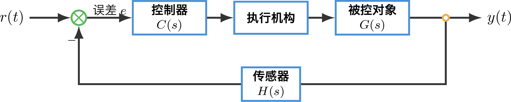{width=85%}
<p align="center"><strong>图1-1-1 闭环控制系统的基本结构</strong></p>

这张图里的几个名词以后会反复出现。**控制器**根据误差生成控制量；**执行器**把控制量变成真实物理作用，比如舵角、电压或阀门开度；**被控对象**是被作用并产生输出的过程，比如船体、电机或炉温系统；**传感器**负责测量输出，它可能带来比例变换、动态滞后或测量误差。把这些角色分清，后面的开环、闭环和校正设计才不会混在一起。

方框图让你一眼看到：谁在接收信息、谁在发出指令、反馈从哪条路绕回来。当连接关系更复杂时，**信号流图**和**梅森公式**提供了一个更系统的求解工具——不需要手动化简，直接从图上的前向通路和回路写出总传递函数。这两种工具在课程中作为补充求解器使用，在复杂结构中尤其可靠。

### 问题三：这条船被推了一下之后，会怎样运动？

有了模型，第一件想做的事是看看这个对象**自己**是什么脾气。工程上最常用的测试方法很简单：给一个突然的输入，看输出怎么响应。比如航向指令从 $0^\circ$ 跳到 $10^\circ$，观察实际航向随时间展开的全过程。这就是**时域响应**。

从数学上看，典型线性定常系统的自由响应可以由极点对应的基本模态组合描述。若某一对极点为 $p=\sigma\pm j\omega$，响应中会出现形如

$$e^{\sigma t}\sin(\omega t)$$

$\sigma$ 决定模态随时间衰减还是放大，$\omega$ 决定摆动有多密。这些 $\sigma$ 和 $\omega$ 来自传递函数分母中解出的**极点**——极点是系统行为最早的暴露者。你在后续课程中会反复看到：极点在复平面上的位置，几乎决定了系统的全部主要动态特征。

```matlab
step(G);                  % 给系统一个单位阶跃输入，观察输出随时间变化
```

执行这行代码后，你会看到一条从 $0$ 逐渐上升到稳态值的曲线。一个典型的一阶惯性环节阶跃响应如图：

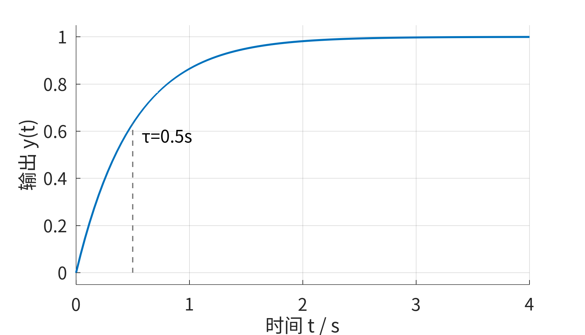{width=80%}
<p align="center"><strong>图1-1-2 一阶惯性环节的阶跃响应</strong></p>

### 问题四：怎么给系统的表现打个分？

看一眼曲线能获得直觉。但要做工程比较和设计决策，需要把"看起来还行"翻译成数字。于是有了**性能指标**：

- **超调量 $M_p$**：响应冲过目标多少——代表系统的"冒进程度"
- **调节时间 $t_s$**：多久之后稳定在目标附近——代表系统的"利落程度"
- **上升时间 $t_r$**：起步有多快——代表系统的"响应速度"

这三个指标构成了一套通用的评价语言。无论对象是船、电机还是温控系统，同一套指标可以跨对象比较。MATLAB 可以用 `stepinfo` 从阶跃响应曲线中直接提取这些数值；Octave 的 control 包通常不提供这个函数，需要先画出阶跃响应，再由脚本或人工读图计算指标：

```matlab
step(G);                  % MATLAB/Octave：先观察阶跃响应曲线
stepinfo(G);              % MATLAB：提取上升时间、调节时间、超调量等指标
```

### 问题五：这条船会不会失控？

性能指标衡量的是"好不好的程度"。但有一个更基本的问题需要先回答：系统会不会在扰动下发散？会不会越调越偏？

回顾问题三中的时域响应分解——当极点为 $p=\sigma\pm j\omega$ 时，响应中会出现 $e^{\sigma t}\sin(\omega t)$ 或同类正弦、余弦模态。这些根在控制课程中有一个专门的名称——**极点**。极点是复平面上的坐标：横轴位置 $\sigma$ 关联衰减或发散的趋势，纵轴位置 $\omega$ 关联振荡的频率。一个系统有几个极点，就有几种基本的运动方式——每一种就是你在问题三中看到的那种模态。

极点在复平面上的位置直接回答了稳定性的问题。如果全部极点都落在**左半平面**（$\sigma<0$），每个模态中的指数项都随时间衰减——系统稳定，扰动引起的偏差会逐渐消失。只要有任意一个极点跑到了右半平面（$\sigma>0$），对应模态就会随时间放大——系统失稳。

MATLAB 的 `isstable` 函数可以一键判断：

```matlab
isstable(G)               % 判断系统所有极点是否都位于稳定区域
```

对于高阶系统，直接求解全部极点很困难。**劳斯判据**提供了一种不需要求解的代数捷径——直接从特征方程的系数判断稳定性。它本质上是一个安全检查：在你动手调参数之前，先确认系统不会翻车。

### 问题六：如果拧大增益，极点会往哪儿跑？

稳定只是底线。更有趣的问题是：当调大某个参数——比如开环增益 $K$——系统的极点会怎样**连续移动**？极点移动的方向，直接决定了响应是变快还是更振荡。

把不同 $K$ 对应的闭环极点画在同一张复平面上，按 $K$ 增大的顺序连起来，就是**根轨迹**。对当前一阶对象来说，增益增大后闭环极点沿实轴继续向左移动。更复杂的二阶对象会出现分支会合、离开实轴等形态。一行代码生成这张图：

```matlab
rlocus(G);                % 绘制闭环极点随增益 K 变化的迁移路径
```

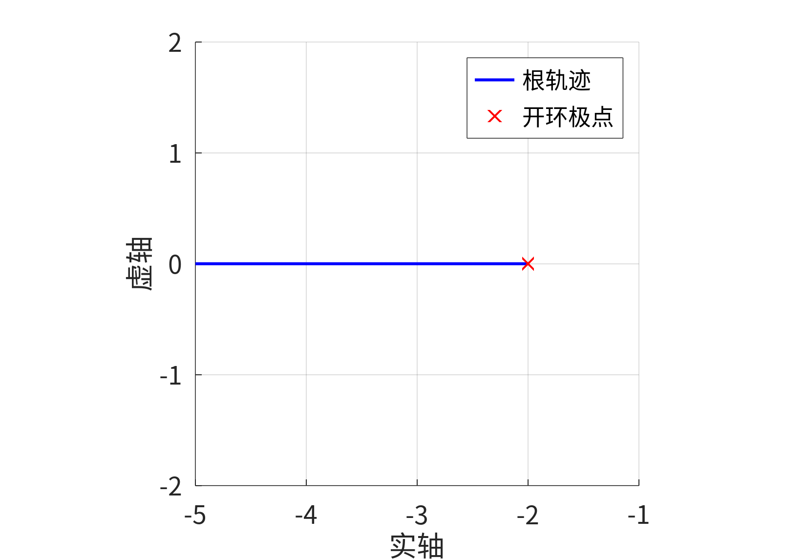{width=80%}
<p align="center"><strong>图1-1-3 一阶对象的根轨迹</strong></p>

根轨迹把"调参"这个动作变成了一张可读的地图：每条曲线代表一个极点的迁徙路径，路径上的每个点对应一个 $K$ 值和一种系统行为。你不需要现在会画它，只需要知道：后续课程中，这张图会让你看见参数变化带来的全部后果。

### 问题七：这条船对不同节奏的扰动，态度一样吗？

前面的分析都围绕"指令突然改变后系统怎么响应"。但真实海况中，扰动有节奏——风浪是周期性的，洋流是缓慢变化的。这时需要换一个视角：不是看系统在时间轴上怎么展开，而是看系统对**不同频率**的正弦输入分别做出什么反应。

直觉告诉你：慢节奏的扰动，舵机容易跟上；快节奏的扰动，舵机可能根本反应不过来——输出幅值被削弱，相位也明显滞后。把这种"对不同节律的态度"画成两张图——**幅值变化图**和**相位变化图**——就是频域分析的入口：

```matlab
bode(G);                  % 绘制幅频与相频曲线，观察不同频率下的响应
margin(G);                % 在 Bode 图上标出增益裕度和相位裕度
```

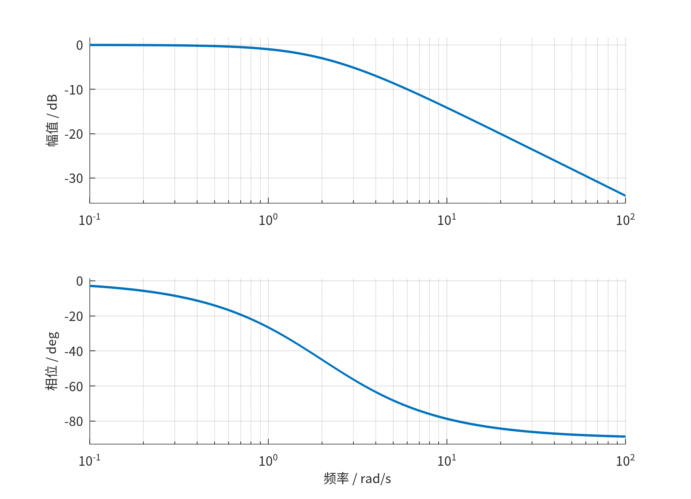{width=85%}
<p align="center"><strong>图1-1-4 一阶惯性环节的 Bode 图</strong></p>

频域分析回答的不再是"快不快、稳不稳"，而是"哪些频率的扰动会被放大，哪些会被抑制"。

### 前七个问题做完了什么

到这里，你已经看到了对一个系统进行**开环诊断**的完整流程：写出模型 → 画出结构 → 测试时域响应 → 提取性能指标 → 判断稳定性 → 扫描参数影响 → 分析频率特性。每一步都给出一行代码和一张图。

但诊断不是终点。你真正想做的是**改变系统的行为**。如果阶跃响应太慢、超调太大、或者某段频率的扰动让船晃得不可接受——你能做什么？

---

## 三、反馈与校正：从诊断到干预

前七个问题都假设系统是固定不变的——你只是在观察它、分析它。工程真正要回答的问题是：**给定一个对象和一组性能要求，怎样设计控制器让系统满足要求？**

这个从"看"到"改"的跳跃，靠的是**反馈**。

### 3.1 反馈改写系统的行为逻辑

若系统只按预设动作运行，不使用输出信息修正自己——这是**开环控制**。你告诉舵机"打 $5^\circ$ 舵角"，舵机照办。风浪把船推到哪里，舵角都不变。

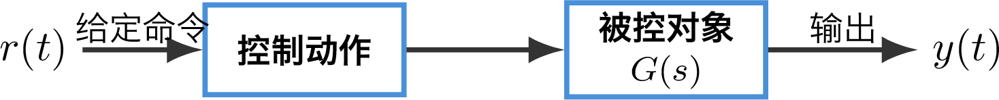{width=70%}
<p align="center"><strong>图1-1-5 开环控制结构</strong></p>

若系统持续测量输出，把测量结果送回比较端，再根据偏差修正动作——这是**闭环控制**。你每时每刻都在问"现在的航向和目标航向差多少"，然后根据这个差来决定下一步舵角。

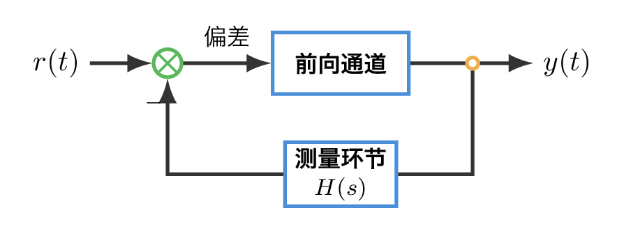{width=75%}
<p align="center"><strong>图1-1-6 闭环反馈结构</strong></p>

闭环中的核心量是误差：

$$e(t)=r(t)-y_m(t)$$

$r(t)$ 是期望输出，$y_m(t)$ 是测量输出，$e(t)$ 是两者之间的偏差。控制器真正关心的，是"现在还差多少"。

反馈把持续比较并修正这个动作**内建**到了系统的工作逻辑里。有了反馈，系统不需要提前知道所有扰动的大小和方向——每次偏差出现，就修正一次。但也正因如此，反馈是一把双刃剑。如果修正的时机、力度或方向不恰当，闭环系统可能比开环更差。这就是为什么整门课要花那么大力气去理解极点、根轨迹、频域特性和稳定判据——它们回答的都是同一个问题：**怎样让反馈正确地工作。**

### 3.2 校正：把诊断结果翻译成控制动作

诊断告诉你系统的短板——响应偏慢、超调偏大、某段频率的扰动放大太多。**校正**就是根据这些诊断结果，在回路中插入一个控制器，改写系统的整体行为。

最简单的控制器是**比例控制**——误差大时用力修正，误差小时轻点修正。控制器写成：

$$C(s) = K_p$$

其中 $K_p$ 是比例增益。把这个控制器串入回路，闭环系统就变成了：

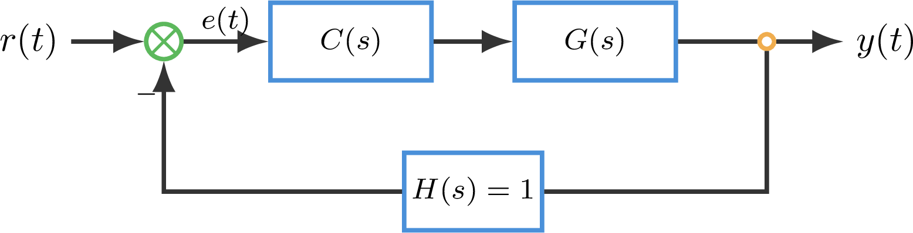{width=75%}
<p align="center"><strong>图1-1-7 单位负反馈闭环系统</strong></p>

从参考输入 $r(t)$ 到输出 $y(t)$ 的闭环传递函数通常记为 $\Phi(s)$。它由开环对象和控制器共同决定：

$$\Phi(s)=\frac{C(s)G(s)}{1+C(s)G(s)}$$

如果仍用问题一中的一阶惯性环节 $G(s)=1/(0.5s+1)$，并取 $C(s)=K_p$，则有：

$$\Phi(s)=\frac{K_p}{0.5s+1+K_p}$$

当 $K_p=2$ 时，

$$\Phi(s)=\frac{2}{0.5s+3}=\frac{4}{s+6}$$

把前七个问题中的所有分析对着 $\Phi(s)$ 重新做一遍，你会看到：增益 $K_p$ 改变了极点的位置，改变了阶跃响应的快慢和稳态增益，也改变了环路开环 Bode 图中的幅频位置。对于一阶惯性环节，这种变化主要表现为响应更快、闭环稳态值降低；对于后面更复杂的二阶对象，还会进一步表现为超调和振荡。

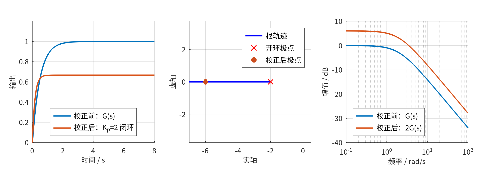{width=90%}
<p align="center"><strong>图1-1-8 比例反馈校正前后的三域对比</strong></p>

这就是控制设计的核心循环：**诊断 → 加控制器 → 重新诊断 → 比较效果 → 调整控制器 → 再次验证**。后续课程中，你会沿着这条循环一步步深入——引入积分控制来消除残余偏差，引入微分控制来预判趋势，引入更复杂的校正结构来同时兼顾速度、精度和稳定性。

### 3.3 反馈改变了什么——一个直观对比

回到我们的船。用开环控制时，给定舵角后听天由命。用闭环比例控制时，航向偏差被持续测量并反馈回舵机。将两组结果并排比较：

<p align="center"><strong>表1-1-1 开环控制与闭环比例控制对比</strong></p>

| 对比维度 | 开环控制 | 闭环比例控制（$K_p=2$） |
|------|------|------|
| 阶跃响应 | 可能存在稳态偏差，无修正机制 | 偏差持续缩小，响应主动靠近目标 |
| 抗扰动能力 | 扰动直接作用在输出上，无人修正 | 扰动产生的偏差被反馈检测到，控制器自动补偿 |
| 极点位置 | 固定（对象的固有极点） | 随 $K_p$ 移动；一阶对象中通常沿实轴移动，更复杂对象可能离开实轴并产生振荡 |
| 根轨迹 | 不存在——没有可调参数改变极点 | $K_p$ 从 0→∞，闭环极点沿固定路径迁移 |
| 环路开环 Bode 图 $L(s)$ | 固定 | 增益提高后幅频曲线整体上移，穿越频率通常右移，相位裕度可能减小 |

这组对比揭示了一条贯穿全课的判断：**反馈改变了系统的全部行为，代价是引入了新的风险——参数选择不当会让系统振荡甚至失稳。** 分析和设计的全部努力，都是在"利用反馈的好处"和"控制反馈的风险"之间找到可接受的平衡。

---

## 四、这门课的地图

把八个问题、反馈思想和校正循环合在一起，整门课可以读成五个连续追问。每个追问对应一个模块：

<p align="center"><strong>表1-1-2 课程模块追问地图</strong></p>

| 模块 | 要回答的追问 | 在闪电速通中你见过了什么 |
|:---:|------|------|
| **模块1** 建立框架（10学时） | 这门课在学什么，为什么要这样学 | 全部八个问题——用一条船做了一次全遍历 |
| **模块2** 构建语言（8学时） | 怎样把真实对象写成统一的分析对象 | 问题一到四——这次补上完整的推导和计算 |
| **模块3** 深入机理（18学时） | 系统结构为什么会带来这些行为 | 问题五到七——这次学会判据、法则和跨域翻译 |
| **模块4** 转向设计（14学时） | 面对任务和约束，怎样形成可接受方案 | 问题八——这次完整走通诊断→选型→优化→验证的设计循环 |
| **模块5** 识别边界（12学时） | 经典方法的边界在哪里，边界之外有什么 | 八个问题之外——看见非线性、数据驱动和策略学习 |

若用一句话概括：

$$\text{真实问题} \rightarrow \text{统一对象} \rightarrow \text{多种表征} \rightarrow \text{结构机理} \rightarrow \text{约束设计} \rightarrow \text{边界识别}$$

你今天不需要记住这串箭头里的每个术语。回到这条线上任何一点时，翻回这一页，你就会知道此时正在回答哪个追问。

---

## 五、几个有用的学习习惯

控制原理强调有对象、有证据、有判断。对应的学习习惯也围绕这三点建立。

**先识别对象，再进入方法。** 每次遇到新题目，先问三个问题：目标是什么？对象是什么？是否存在反馈？不要一上来就翻公式。

**先画结构，再谈结论。** 无论是传递函数、根轨迹还是频域图，先把"谁在控制谁、信息从哪里流到哪里"画清楚。一张清楚的结构图比一页公式更能暴露问题的本质。

**先给证据，再给判断。** "系统更稳定了"是一个主观印象。"相位裕度从 $37^\circ$ 升到 $52^\circ$"是一份可验证的证据。养成用数字和曲线说话的习惯。

**先独立表达，再借助工具修正。** 面对概念解释或课程地图时，先写出自己的理解，再用 AI 或同伴讨论对照修正。直接复制外部答案会在后续章节中付出代价——你失去的不是分数，是理解下一章所需的概念网络。

---

## 六、示例：从诊断到校正——一个完整的代码走通

下面用同一个对象，把前七个问题的诊断动作和第八个问题的闭环校正走一遍。对象是一条简化的船舵回路——输入是期望舵角，输出是实际舵角，它包含一个积分环节（舵角是舵速的积分）和一个惯性环节（舵机有响应延迟）：

$$G(s) = \frac{1}{s(s+2)}$$

### 6.1 开环诊断

**建立模型。** 在 MATLAB/Octave 中定义传递函数对象：

```matlab
G = tf(1, [1 2 0]);    % 建立对象 G(s)=1/(s^2+2s)=1/[s(s+2)]
```

分母 `[1 2 0]` 对应 $s^2 + 2s + 0$，即 $s(s+2)$。现在这个对象已经存在于工作空间中，后续所有分析都围绕它展开。

**时域响应。** 给它一个单位阶跃输入，看输出怎么变化：

```matlab
step(G);                % 观察开环阶跃响应是否能收敛到有限稳态值
% MATLAB 可用 stepinfo(G) 提取指标；Octave 通常需要由响应数据另行计算
```

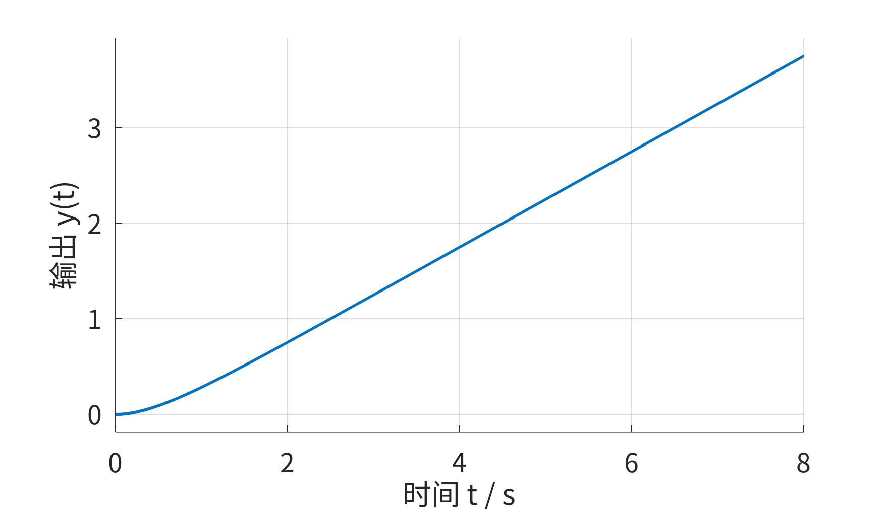{width=80%}
<p align="center"><strong>图1-1-9 示例对象的开环阶跃响应</strong></p>

开环响应没有收敛到一个稳态值——输出持续增长。这是积分环节的典型特征：只要输入还在，输出就一直往上走。一个实际的船舵当然不会真的无限转动——它会被机械限位挡住——但线性模型在远离限位的范围内准确地反映了这个趋势。

由于开环阶跃响应没有有限稳态值，基于终值定义的上升时间、调节时间和超调量都不适合直接作为评价指标。此处真正要观察的，是输出持续增长这一趋势。

**根轨迹。** 如果在这个对象前面加上一个比例控制器 $K$，闭环极点会随 $K$ 增大而迁移：

```matlab
rlocus(G);              % 查看加入比例增益 K 后，闭环极点如何移动
```

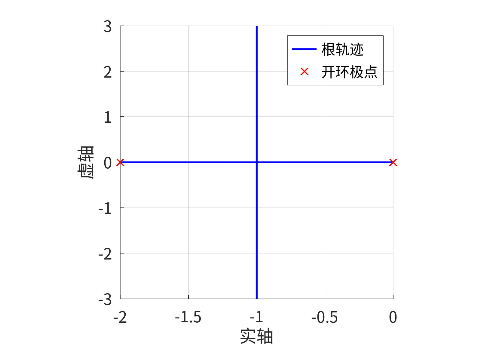{width=80%}
<p align="center"><strong>图1-1-10 示例对象的根轨迹</strong></p>

$K$ 很小时，两个闭环极点都落在负实轴上——系统单调收敛。$K$ 增大到某个值后，两个极点在 $-1$ 处会合，然后离开实轴，变成共轭复数对——系统开始出现振荡。$K$ 越大，共轭极点越远离实轴，振荡越剧烈。

**频域分析。**

```matlab
bode(G);                % 查看对象对不同频率输入的幅值和相位响应
margin(G);              % 查看当前开环对象可提供的稳定裕度
```

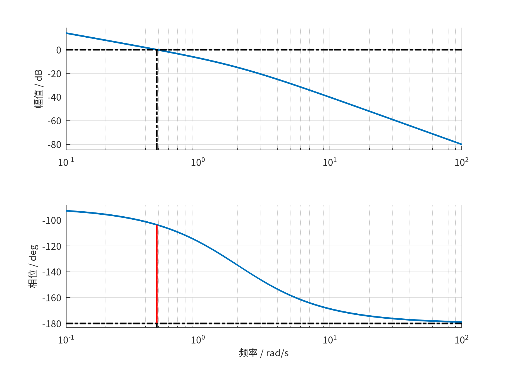{width=80%}
<p align="center"><strong>图1-1-11 示例对象的开环 Bode 图</strong></p>

开环对象有两个固有特征：积分环节贡献了低频段的高环路增益——在负反馈回路中，这通常有利于降低低频跟踪误差或抑制特定通道的低频扰动；但相角从 $-90^\circ$ 起步，随频率增加进一步滞后。比例增益继续提高时，穿越频率通常右移，相位裕度会下降，振荡风险随之增加。实际扰动能否被削弱，还取决于扰动进入的位置和闭环结构。

### 6.2 闭环校正

诊断的结论很清楚：这个对象开环时无法自己停在目标值上；加反馈后可以稳定，但增益越大振荡越强。现在加入一个比例控制器 $C(s)=K_p$，比较两种增益下的闭环表现。

```matlab
Kp2 = 2;                      % 选取一个比例增益
Phi2 = feedback(Kp2*G, 1);    % 构造闭环传递函数 Phi(s)
step(G, Phi2);                % 对比校正前对象与校正后闭环的时域响应
rlocus(G);                    % 用根轨迹解释闭环极点位置的变化
bode(G, Kp2*G);               % 对比校正前后环路开环幅频曲线的变化
```

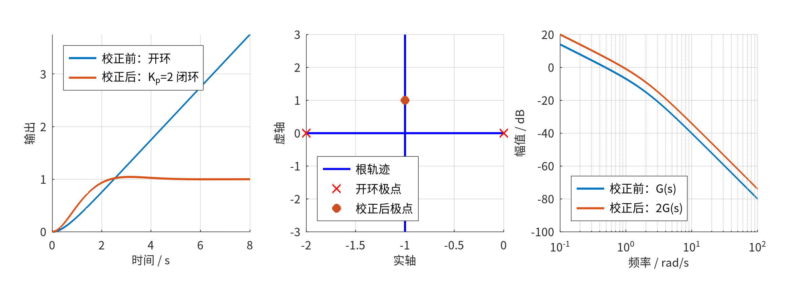{width=95%}
<p align="center"><strong>图1-1-12 示例对象校正前后的三域对比</strong></p>

加入 $K_p=2$ 的比例反馈后，开环对象原本持续增长的响应被改写为收敛响应，并出现约 4% 的超调和轻微摆动；从根轨迹中你知道，这是因为闭环极点离开了实轴，变成了共轭复数对。频域图则显示，比例增益把环路幅频曲线整体上移，也改变了穿越频率和稳定裕度。

这组对比揭示了控制设计中反复出现的一对矛盾：**响应速度和振荡倾向的此消彼长。** 整门课有将近一半的篇幅在回答一个问题：怎样在加快响应的同时控制住振荡？后续模块中你会看到的全部工具——超前校正、PID、极点配置、优化设计——本质上都是对这个问题从不同角度给出的答案。

### 6.3 完整代码

把上面的诊断和校正步骤整理为一个脚本：

```matlab
% ===== 1-1 闪电速通：完整示例 =====
% 一条简化船舵回路：舵角指令 → 舵机惯性 → 舵角积分 → 实际舵角
G = tf(1, [1 2 0]);           % G(s) = 1/(s(s+2))

% ---- 开环诊断 ----
figure(1); step(G);            % 时域：阶跃响应——看过程
figure(2); rlocus(G);          % 复域：根轨迹——看迁移
figure(3); margin(G);          % 频域：Bode图+稳定裕度——看节律

% ---- 稳定性检查 ----
isstable(G)                    % 对开环对象判断稳定（应为逻辑值）

% ---- 闭环校正 ----
Kp2 = 2;                      % 比例增益
Phi2 = feedback(Kp2*G, 1);    % Kp=2 时的闭环传递函数 Phi(s)
figure(4); step(G, Phi2);     % 时域：校正前后
figure(5); rlocus(G);         % 根轨迹：极点迁移
figure(6); bode(G, Kp2*G);    % 频域：环路增益变化
```

十余行关键代码，覆盖了建模、时域、根轨迹、频域、稳定性判断和闭环校正的全部基本动作。

现在回看这一讲开头的那句话——"用一节课了解如何做自动控制"。在过去的 90 分钟里，你确实走通了一个完整的控制设计闭环：**用传递函数描述对象 → 从时域、根轨迹、频域三个角度诊断对象的行为 → 加入反馈和控制器改变系统的表现 → 比较不同参数下的效果。** 这是一个控制工程师在面对任何一个新对象时都会执行的标准动作序列。你现在能做的还只是最粗粒度的版本——一行代码代替一页推导，一张图代替一套判据——但这已经是一个完整的、可运行的控制分析流程。

后续三十二章的任务，是把这里的每一行代码背后的原理逐一展开。你不需要现在就理解它们。你只需要知道：**你已经见过全貌，你知道每一件工具的名字和它站在哪个位置。** 从下一章开始，我们一件一件把它们拿下来。

---

## 七、章末习题

### 基础题 •

**1.** 用自己的话写出下面两组术语的含义，并各给一个生活中的例子：（a）开环控制和闭环控制；（b）期望输出、实际输出和误差。

**2.** 下面三句话分别描述的是时域分析、根轨迹分析还是频域分析？
- （a）"增益 $K$ 从 0.5 增大到 2 后，超调量从 0 增加到约 4%。"
- （b）"低频段的高增益使得慢速扰动被大幅削弱。"
- （c）"$K$ 增大后，两个闭环极点从实轴上向彼此靠近，会合后离开实轴。"

**3.** 在 MATLAB/Octave 中运行 6.3 节的完整代码。改变 $K_{p2}$ 的值（试试 1、3、5），观察闭环阶跃响应如何变化。用一句话描述你的发现。

### 进阶题 ••

**4.** 第三节的对比表列出了开环控制和闭环比例控制在五个维度上的差异。选择一个你熟悉的工程或生活系统（空调、电梯、电热水壶、自行车……），参照那个表的格式，写出这个系统在开环和闭环控制下的对比。如果这个系统目前是开环的，你会建议加上反馈吗？说明理由。

**5.** 回到问题一中的直流电机传递函数 $G(s)=K/(\tau s+1)$。取 $K=1$，$\tau=0.5$。在 MATLAB/Octave 中：
- （a）画出开环阶跃响应和 Bode 图；
- （b）加上单位负反馈，取比例增益 $K_p=3$，画出闭环阶跃响应；
- （c）比较开环和闭环的稳态值——闭环的稳态值是否到达 1？如果没有，解释原因。

### 挑战题 •••

**6.** 6.2 节的比例控制让闭环响应出现了超调。假设你希望超调不超过 5%，同时调节时间尽可能短。仅使用比例控制 $C(s)=K_p$ 能否同时满足这两个要求？结合根轨迹图说明你的判断。如果不能，你需要控制器多出什么"能力"？（本题不需要精确计算，用从根轨迹图和阶跃响应对比中获得的直觉回答即可。）

**7.** 这份讲义用"一条船，八个问题"遍历了控制全貌。现在请你换一个对象——比如一台无人机的姿态控制，或者一个温室的温度调节——仿照第二节的结构，写出属于这个对象的"八个问题"。每个问题只需 2-3 句话：这个问题问什么？控制理论用哪个工具来回答？一行代码是什么？不需要写完整答案，只需要写问题——写出好的问题，比背出答案更难。

---

## 八、总结与扩展思考

这一讲是整门课最快的一遍遍历。你不需要记住任何公式，但值得带走下面几个判断：

**反馈是控制思想的核心。** 开环系统只能执行预设的动作，闭环系统会持续把输出拉回目标。反馈把工程师从"提前预知所有扰动"的困境中解放出来——只需要在偏差出现时修正偏差。代价是修正的时机、力度和方向必须正确，否则闭环可能比开环更差。

**同一个系统可以从多个角度被阅读。** 时域告诉你在时间轴上发生了什么，根轨迹告诉你参数变化时极点往哪里走，频域告诉你系统对不同节奏的扰动态度如何。三张图看的是同一个对象，给出的是互补的证据。后续课程的核心任务之一，就是让你学会在三张图之间来回翻译。

**诊断-校正循环是设计的基本节奏。** 先看清对象的脾气（开环诊断），再给控制器（闭环校正），再比较效果，再调整——这个循环你会走几十遍。每一次循环，你对"为什么这样调"的理解都会加深一层。

**扩展思考。** 选一个你关心的工程系统——可以是一台自动驾驶的汽车、一个控温的发酵罐、或一台平衡自行车的机器人。查一下这个系统的核心控制挑战是什么，它最可能用到哪个模块的知识。记下你的猜测，学完对应模块后回来验证。


---

## 附录：部分习题简答

**习题 1（a）**：开环控制不利用输出信息修正动作——例如定时洗衣机按预设时间注水和排水，不检测衣物是否已洗净。闭环控制持续测量输出并与目标比较来修正动作——例如变频空调根据室温与设定温度的差值自动调节压缩机转速。

**习题 2**：（a）时域分析——超调量是时域性能指标。（b）频域分析——"低频段""高频段"是频域语言。（c）根轨迹分析——"极点移动""离开实轴"是根轨迹描述。

**习题 3**：$K_p$ 从 1 增大到 5 的过程中，闭环响应变快但超调量同步增大，振荡次数增加。$K_p=5$ 时超调量约为 21%。仅靠增大比例增益无法同时获得"快"和"稳"。

**习题 5（c）**：闭环稳态值未到达 1 的原因：比例控制下，闭环传递函数为 $\Phi(s)=K_pK/(\tau s+1+K_pK)$。令 $s=0$，稳态值为 $K_pK/(1+K_pK)=3/(1+3)=0.75$，不等于 1。这个残余偏差就是稳态误差——需要积分控制来消除，单元 3-7 将讨论这个问题。
