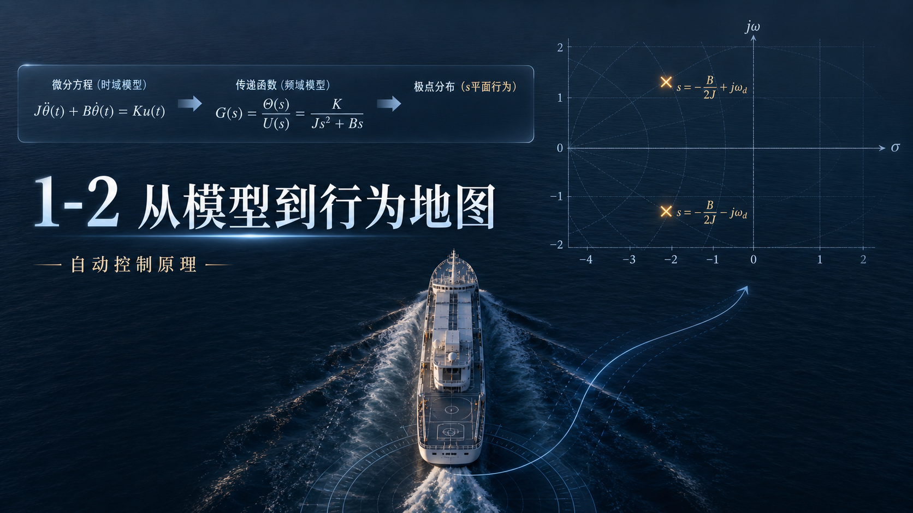
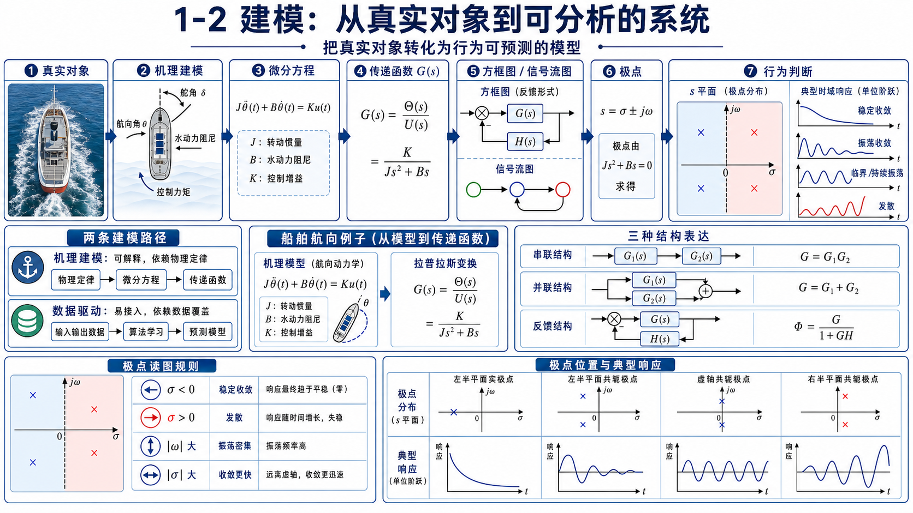

# 单元 1-2 | 建模：从真实对象到可分析的系统

---

## 一、为什么不同的对象，会有相似的行为

让一艘船从当前航向转到目标航向。在同样的指令下，不同的船、甚至同一条船在不同装载状态下，表现得可能截然不同：有的平稳靠近目标；有的先冲过头，来回摆几次才慢慢收住；还有的越调越偏。

这不是船独有的现象。电机调速、液位控制、温度调节中同样出现——对象不同，行为差异却有共同的模式。反过来，有些物理上完全不同的对象——比如一个 RC 电路和一个热水箱——在特定条件下却表现出几乎一样的动态特征。

这两种现象指向同一个结论：在工程对象的具体差异之下，存在着一套更底层的语言，能够统一描述系统的结构和行为。**建模**，就是把这套语言建立起来的过程。

完成这次课程后，你应当能够：

- 区分机理建模和数据驱动建模两条路径，说出各自的优势和适用边界
- 从一个简单物理对象出发，写出它的微分方程，并解释微分方程作为建模起点的优势和局限
- 说出传递函数的核心思想——它为什么能把微分运算变成代数运算
- 读懂一个基本的方框图和信号流图，识别串联、并联、反馈三种连接
- 把模型、极点、复平面、行为连成一条完整的判断链

---

## 二、建模的两条路径

拿到一个工程对象，怎么把它变成可以分析的系统？工程师手上有两条路。

### 2.1 机理建模：从物理定律出发

如果你知道对象的内部结构——它的物理定律、能量关系、质量平衡——你可以直接写出描述它行为的方程。这叫**机理建模**，也叫"白箱建模"。

以船舶航向控制为例。舵角变化产生力矩，力矩克服惯性和阻尼改变偏航角速度，角速度累积成航向角。每一步都有明确的物理定律支撑。把这些定律翻译成数学，就得到了系统的微分方程。

机理建模的优势是**可解释**——方程里的每一项都对应一个物理效应，你知道增益为什么是这个数，时间常数为什么在那个量级。它的局限也很明显：如果对象太复杂，或者内部机理不完全清楚，方程就会很难写、甚至写不出来。

### 2.2 数据驱动建模：从数据出发

另一条路不追问内部机理。你给对象施加一组输入，记录它的输出，然后让算法从数据中找出输入和输出之间的规律。这叫**数据驱动建模**，也叫"黑箱建模"。

这种方式的优势是**不依赖先验知识**——你不需要知道对象内部有什么物理过程。只需要足够多、足够好的数据。它的代价是模型缺乏物理可解释性：你得到了一个能预测输出的模型，但你不一定知道它为什么这样预测。当工况超出训练数据的范围时，模型的行为也可能变得不可靠。

### 2.3 本课程的定位

本课程以**机理建模**为主线。原因很简单：控制工程师不仅需要预测系统的行为，还需要理解行为背后的原因，才能做出有根据的设计决策。从物理定律出发建立微分方程和传递函数，是你在本课程中反复练习的核心技能。

与此同时，数据驱动建模作为视野保留。在模块5中，我们会回到这个话题，讨论当机理模型难以建立时，数据驱动方法如何接续控制设计的链条。

> **图1-2-1**：机理建模与数据驱动建模两条路径的对照示意图——左侧展示"物理定律→微分方程→传递函数"的机理链，右侧展示"输入输出数据→算法学习→预测模型"的数据驱动链，中间标注各自的优势与适用边界。

---

## 三、微分方程：物理对象的第一次翻译

### 3.1 从哪里开始

面对一个需要控制的工程对象，建模的第一步总是同一件事：**把对象的运动规律写成微分方程**。

以船舶航向为例。舵机施加一个控制力矩，这个力矩驱动船体转动。船体的转动惯性抵抗角加速度，水动力阻尼抵抗角速度。把这些物理关系组织起来，得到：

$$J\ddot{\theta}(t) + B\dot{\theta}(t) = K u(t)$$

其中 $\theta(t)$ 是航向角，$u(t)$ 是舵机施加的控制作用，$J$ 是转动惯量，$B$ 是阻尼系数，$K$ 是控制力矩系数。

这个方程说了三件事：控制作用 $u(t)$ 在推着船转；惯性 $J$ 在抵抗转速的变化；阻尼 $B$ 在抵抗转速本身。三者共同决定了航向角 $\theta(t)$ 如何随时间演化。

> **图1-2-2**：船舶航向控制对象的物理示意图——船体俯视图，标注舵角δ、航向角θ、水动力阻尼方向、控制力矩方向，箭头展示各物理量之间的因果关系。

### 3.2 微分方程告诉你什么，不告诉你什么

微分方程是建模最自然的起点——它直接对应物理定律，每一项的含义清楚。对于上面这艘船，你能从方程中读出：惯性大不大、阻尼强不强、控制作用的效率高不高。

但它也有明显的局限。

第一，**不方便串联**。如果控制器、执行器、传感器各自有自己的微分方程，把它们拼在一起求解会非常笨重。第二，**不方便比较**。两个物理对象——比如一个电机和一艘船——它们的微分方程在形式上可能相似，但要从微分方程中一眼认出这种相似并不容易。第三，**不方便做频域分析**。微分方程天然在时间轴上工作，而后续课程中大量工具在频率轴上工作。

我们需要一种等价的、更方便串联和比较的代数语言。这就是传递函数。

---

## 四、传递函数：从微分运算到代数运算

### 4.1 核心思想

传递函数做一件事：**把微分方程中的微分运算，变成代数运算**。

怎么做到的？借助一个数学工具叫拉氏变换。我们暂时不需要掌握拉氏变换的计算细节——那是 2-1 的任务。现在只需要理解它的效果：在零初值条件下，拉氏变换把对时间的求导 $\frac{d}{dt}$ 变成乘以复变量 $s$，把 $\frac{d^2}{dt^2}$ 变成乘以 $s^2$，以此类推。

于是，原来的微分方程——充满了 $\ddot{\theta}$、$\dot{\theta}$、$\theta$——在变换后变成了关于 $s$ 的代数方程。输出信号的变换 $Y(s)$ 与输入信号的变换 $U(s)$ 之间，只剩下一个代数比值。

这个比值就是**传递函数**，记为 $G(s)$：

$$G(s) = \frac{Y(s)}{U(s)}$$

### 4.2 传递函数的含义

传递函数告诉你的不是"某一时刻系统在干什么"，而是**系统本身固有的输入输出关系**。它把"系统是什么"和"输入是什么"分离开了——同一个 $G(s)$，配阶跃输入得阶跃响应，配正弦输入得频率响应。

回到船舶的例子。对 $J\ddot{\theta} + B\dot{\theta} = K u$ 做拉氏变换后，得到传递函数：

$$G(s) = \frac{\Theta(s)}{U(s)} = \frac{K}{Js^2 + Bs} = \frac{K/J}{s(s + B/J)}$$

这个表达式比原来的微分方程紧凑得多。更重要的是，它的结构开始暴露信息——分母中的 $s$ 意味着系统中包含积分效应，$(s + B/J)$ 意味着存在一个由阻尼决定的衰减因素。后续课程中，你会反复从传递函数的分母和分子中提取这类结构信息。

> **图1-2-3**：从微分方程到传递函数的转换示意图——上方是船舶的二阶微分方程，箭头指向下方的传递函数 $G(s) = \frac{K/J}{s(s+B/J)}$，中间标注"拉氏变换：导数→乘以s"的核心操作。

### 4.3 传递函数把不同对象放进同一个框架

一旦写成传递函数，不同物理对象之间的相似性就浮现了。一个 RC 低通滤波电路和一个热水箱的温度响应，可能共用同一个传递函数结构 $G(s) = \frac{K}{\tau s + 1}$。这不是因为它们物理上相似，而是因为它们的**主要动态关系**相似——都是一阶惯性。

正因如此，很多控制结论可以在船舶、电机、温控系统之间迁移。传递函数建立了一个"标准对象库"，后续的分析和设计都在这个库的基础上展开。

---

## 五、方框图与信号流图：系统的结构表达

传递函数告诉你输入和输出之间的整体关系。但它不告诉你系统**里面**长什么样——哪个是控制器、哪个是执行器、信息从哪里反馈回来。结构表达弥补了这个缺口。

### 5.1 方框图

方框图把系统的每一个环节画成一个方块，用带箭头的线连接信息流动的方向。一个典型的控制系统包含以下结构要素：

- **比较点**：期望输出和测量输出在这里相遇，算出误差
- **控制器**：根据误差做出控制决策
- **执行器**：把控制决策变成真实的物理作用
- **被控对象**：被控制的过程，物理输出在这里产生
- **传感器**：采集输出信息，送回比较点

> **图1-2-4**：典型闭环控制系统的方框图——从参考输入r(t)出发，经比较点产生误差e(t)，经过控制器、执行器、被控对象到达输出y(t)，传感器从y(t)取回测量信号ym(t)构成反馈回路。每个方框标注其功能名称。

三个基本连接关系构成了所有方框图的基础：

- **串联**：环节 A 的输出是环节 B 的输入——总传递函数是两个环节的乘积
- **并联**：两个环节接收同一输入，输出相加——总传递函数是两个环节的和
- **反馈**：输出通过反馈通路回到输入端，与参考输入比较——这是控制的核心结构

> **图1-2-5**：串联、并联、反馈三种基本连接的方框图——三行并排，每行左侧为连接结构图，右侧为对应的总传递函数表达式。

### 5.2 信号流图

当系统变得复杂——多个反馈回路交叉、前馈通路并存——方框图的化简可能变得繁琐。信号流图提供了另一种视角。

信号流图用**节点**表示变量（而不是元件），用**支路**表示变量之间的传递关系。它的核心概念只有几个：

- **节点**：系统中的信号变量
- **支路**：从一个节点到另一个节点的传递关系，标注传递函数
- **前向通路**：从输入节点到输出节点、不经过任何节点两次的路径
- **回路**：起点和终点是同一个节点的闭合路径

同一个系统可以用方框图表达，也可以转成信号流图。两者说的是同一件事——只是组织信息的视角不同。方框图以"谁对谁做了什么"组织，信号流图以"变量之间怎样互相决定"组织。

> **图1-2-6**：同一系统的方框图与信号流图对照——上方是方框图，下方是对应的信号流图，箭头标注两种表达之间的对应关系：方框→支路、比较点→多输入节点、引出点→多输出节点。

---

## 六、模型的核心产出：极点与复平面

模型写好了——微分方程、传递函数、方框图、信号流图，四种语言从不同角度描述了同一个系统。这些工作的最终目的是什么？是让你能够回答一个问题：**这个系统会怎么动？**

### 6.1 极点是行为的第一批暴露者

回到传递函数的分母。令分母等于零，得到特征方程；特征方程的根，称为**特征根**，也等价地称为**极点**。

为什么极点如此重要？因为一个线性系统的自由响应，可以被分解为若干基本模态的叠加，每一个模态的形状完全由对应的极点坐标决定。具体来说，如果系统有一对极点 $s = \sigma \pm j\omega$，响应中就会出现形如

$$e^{\sigma t} \sin(\omega t)$$

的成分。$\sigma$ 管包络——是衰减还是放大、快还是慢；$\omega$ 管填充——是单调还是振荡、密还是疏。极点坐标的两个维度，恰好对应了系统行为的两个最基本的问题。

**表1-2-1 极点位置与行为特征的第一轮图鉴**

| 极点位置 | $\sigma$ 符号 | $\omega$ 取值 | 行为特征 |
|---------|:---:|:---:|------|
| 左半平面，远离虚轴 | 负，绝对值大 | 零或很小 | 快速单调收敛，几乎无摆动 |
| 左半平面，靠近虚轴 | 负，绝对值小 | 零或很小 | 缓慢单调收敛，拖尾明显 |
| 左半平面，远离实轴 | 负 | 绝对值大 | 边摆边收，摆动密集 |
| 左半平面，靠近实轴 | 负 | 绝对值小 | 边摆边收，摆动稀疏 |
| 虚轴上 | 零 | 任意 | 等幅振荡，不收不放 |
| 右半平面 | 正 | 任意 | 幅度越来越大，行为失控 |

### 6.2 复平面：第一张行为地图

现在把这些极点放到一张图上。以实部 $\sigma$ 为横轴、虚部 $j\omega$ 为纵轴，构成复平面，也称 $s$ 平面。

复平面上的每一个点，都对应一组行为特征。横轴从左到右，系统从"快速收敛"过渡到"缓慢收敛"，跨过虚轴后进入"发散"。纵轴从零向上（或向下），系统从"单调"过渡到"摆动"，越远越密。

这张地图可以像真正的地区地图一样被分区命名：

- **稳定区**（左半平面，$\sigma < 0$）：所有极点在此 → 偏差最终消失
- **不稳定区**（右半平面，$\sigma > 0$）：任一极点在此 → 偏差被放大
- **振荡走廊**（远离实轴的带状区域，$\vert\omega\vert$ 大）：摆动密集
- **单调走廊**（实轴附近，$\vert\omega\vert$ 小）：接近无摆动
- **稳定边界**（虚轴本身，$\sigma = 0$）：等幅振荡，稳定与不稳定的分界线

> **图1-2-7**：复平面行为地图——完整的 $s$ 平面，横轴标注 $\sigma$（实部），纵轴标注 $j\omega$（虚部），左半平面着稳定色（蓝），右半平面着不稳定色（红），虚轴加粗标注"稳定边界"，实轴附近标注"单调走廊"，远离实轴的区域标注"振荡走廊"。标注4-6个典型极点位置及其对应的行为关键词。

### 6.3 从地图回看工程现象

有了这张地图，第一节中那些令人困惑的现象就有了统一的解释：

- 极点落在左半平面实轴上 → 过程平稳，无摆动，单调靠近目标
-  极点成共轭复数对、实部在左侧 → 边摆动边收敛，先冲过头再收回
-  极点跑到右侧 → 幅度越来越大，控制实质上失效

模型把你从工程对象带进了数学坐标。极点把数学坐标翻译回工程行为。复平面是这两次翻译的交汇点。

> **图1-2-8**：极点位置与典型时域响应形态的对照——4×2 网格布局。上排四格为复平面上四种典型极点位置（左半平面实极点、左半平面共轭复数、虚轴上共轭复数、右半平面共轭复数），下排四格为对应的时域响应曲线形态示意。箭头连接上下对应关系。

---

## 七、案例：三项航向修正任务，三种极点，三种行为

回到航向修正的场景。三艘简化模型下的试验船，极点分布不同。仅凭极点位置，预判它们的行为。

| 模型 | 极点位置 | 读图判断 |
| --- | --- | --- |
| A | $-1.5 \pm 2.2j$ | 左半平面 + 明显虚部：边摆动边收敛 |
| B | $-3.0,\ -0.8$ | 两个实极点，均在左侧：单调收敛，快慢由离虚轴近的那个主导 |
| C | $0.3 \pm 1.4j$ | 右半平面 + 明显虚部：摆动着发散 |

对模型 A，极点在左半平面保证了衰减，明显的虚部意味着可见的摆动。航向曲线大概率呈现为"先冲过目标，再边摆边收回来"。对模型 B，两个实极点没有摆动成分，但 $-0.8$ 离虚轴更近，它对应的模态衰减更慢，会拖住整个系统的收敛节奏。对模型 C，实部为正，输出幅度越来越大，航向控制实质上失效。

三组极点，三种行为。复平面上的点不是抽象的符号——它们把"平稳、摆动、失控"这些工程现象压缩进了一张统一的地图。这就是建模的目标：让不同对象的动态行为变得可以比较、可以分析、可以预判。

---

## 八、例题：从特征方程到行为判断

**例题 1-2-1 从一个二阶系统的极点读出它的行为**

设某位置控制系统的简化模型为

$$\ddot y + 2\dot y + 5y = 5r$$

其中 $r$ 是期望位置，$y$ 是实际位置。请判断这个系统的第一轮行为特征。

**解**

写出特征方程：

$$s^2 + 2s + 5 = 0$$

解出极点：

$$s_{1,2} = -1 \pm 2j$$

读图。实部 $-1$，落在左半平面——偏差会随时间衰减。虚部 $\pm 2$，不为零——过程带有摆动成分。合在一起：系统会边摆动边收敛到目标值。实际装置上，位置先越过目标一点，再边摆边收回来，几个周期内基本稳定。

这个判断目前还是粗粒度的——没有超调量的具体数字，没有调节时间精确到秒。但它已经足够让你在面对一个新系统时，先建立起方向感。精确指标在模块2中引入。

---

## 九、分层练习

### 练习 1 基础辨认

观察下列极点位置，写出第一轮行为描述。

1. $s = -2.5$
2. $s_{1,2} = -0.4 \pm 1.8j$
3. $s = 0.2$

要求：每题写出"是否有摆动倾向"和"偏差会收下去还是放大"，并说明判断依据——引用的是实部还是虚部的信息。

### 练习 2 反向读图

描述下列行为，推断极点大致落在复平面的哪个区域。

1. 系统单调收敛，但过程很慢
2. 系统快速摆动，同时幅度越来越大
3. 系统边摆边收，摆动稀疏但拖尾很长

要求：每问同时描述 $\sigma$ 和 $\omega$ 的大致特征（正/负、大/小）。

### 练习 3 迁移应用

电机转速控制、房间温度调节、船舶航向修正——三个对象在物理上没有共同点。但如果在各自的工作区间内，它们的简化模型恰好具有相近的极点分布：

1. 为什么我们仍然可以用同一套语言讨论它们的动态品质？
2. 这种"相近"主要是指哪一类行为相近？
3. 建模时省略了大量物理细节之后，模型至少需要保住什么，才有意义？

要求：用"对象 → 微分方程/传递函数 → 极点 → 行为"这条链组织回答。

---

## 十、总结：建模专题的局部地图

这一讲覆盖了控制系统建模的完整地形。从真实对象出发，两条路径分叉——机理建模走物理定律，数据驱动建模走数据学习。沿着机理建模的主干，五个地标依次展开：

**微分方程**是建模的起点。它直接翻译物理定律，每一项的含义清楚。但它在串联、比较和频域分析上显得笨重。

**传递函数**解决了这个笨重。借助拉氏变换，微分运算变成代数运算，系统被提炼为一个紧凑的 $G(s)$。从此以后，不同物理对象可以进入同一套分析语言。

**方框图**展示系统的内部结构——谁接收信息、谁发出指令、反馈从哪里闭合。串联、并联、反馈三种连接是所有结构的基础。

**信号流图**提供了另一种视角：用节点和支路表达变量之间的决定关系。与方框图说的是同一件事，组织方式不同。

**极点与复平面**是建模的最终产出。传递函数分母的根暴露系统行为的主要倾向。把它们标注在 $s$ 平面上——横轴管收放，纵轴管摆动——就得到了一张可读的行为地图。

这五个地标组成的局部地图，会在模块2中被逐一放大和深挖。微分方程会被拉氏变换正式化，传递函数会被严格推导，方框图和信号流图会配上梅森公式做系统求解，极点会被纳入完整的根轨迹法则中解释。你不需要在第一次经过时就看清每一个细节——先记住每块地标的位置、它和前后地标的连接方式，以及它最终指向的问题。深挖时，你手上已经有了一张可以随时参照的地图。

### 扩展思考

两个工程对象的物理结构差别很大，但在某个工作区间内表现出相近的极点分布。我们能否用近似相同的语言讨论它们的动态品质？在这种迁移中，哪些对象细节可以暂时省略，哪些行为特征必须被模型保留下来？尝试用不超过五句话回答，每句话对应建模链上的一个环节。

