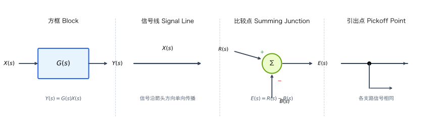
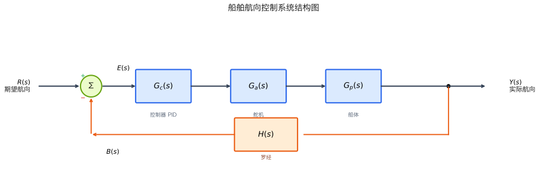
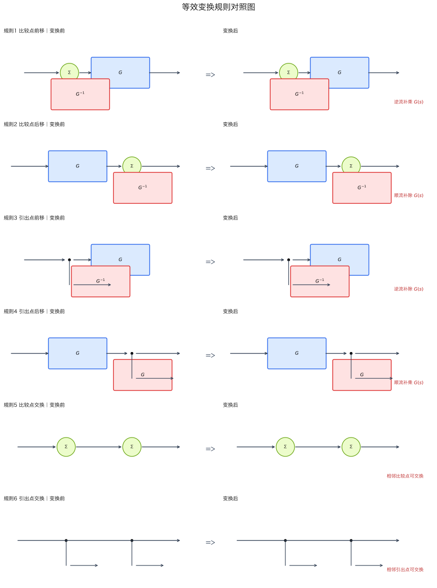
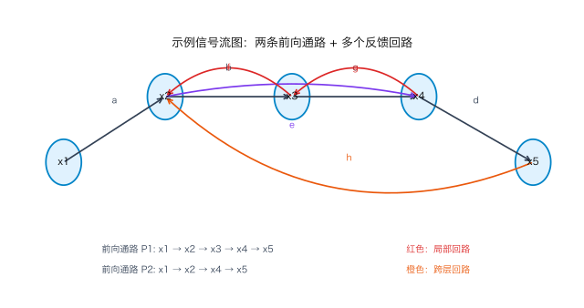

# 单元 1-2 | 系统结构图与化简——从积木块到系统蓝图

> **层次**：层1 数学语言精化 · 第二课
> **学时**：2（100 分钟）
> **知识类型**：[C] 计算型
> **前置**：1-1（传递函数与典型环节）、L-0（反馈概念直觉）、L-1（闭环系统概念）
> **后续**：1-3（时域响应分析）；习题课1（[C]型习题强化）
> **思政融入**：梅森增益公式——全局观与工程认知

---

## 一、引入案例（约 300 字）

**层次切换语**：上一课我们学会了从微分方程中提取传递函数——系统的"DNA"。我们还认识了五种典型环节，它们是构成系统的基本"积木块"。今天的问题是：**积木块怎么组装成完整的系统？**

考虑一个完整的船舶航向控制系统。它不是单个环节，而是由多个环节协同工作：

- **控制器**（PID）：根据航向偏差计算舵角指令
- **舵机**：将指令转化为实际舵角（惯性环节）
- **船体**：舵角产生偏航力矩，改变航向（积分+惯性）
- **罗经**：测量实际航向并反馈（比例环节）

这些环节如何连接？信号如何流动？偏差如何形成？我们需要一种**图形语言**来清晰地表达这些关系——这就是**系统结构图**（方框图）。

更重要的是，我们需要从结构图中求出整个系统的**总传递函数**（从期望航向到实际航向），这就是**结构图化简**。

> **承诺兑现**：1-1 中我们说"复杂系统的传递函数可以分解为典型环节的串联或并联"——今天我们反过来，学习如何从环节的连接关系**组装**出总传递函数。

---

## 二、核心内容

### 2.1 系统结构图的基本元素

系统结构图（又称方框图、框图）是用图形符号表示系统各环节之间信号传递关系的数学模型。它由四种基本元素组成：

| 元素 | 符号 | 功能 |
|:---:|:---:|:---:|
| **方框**（Block） | 矩形框，内标传递函数 $G(s)$ | 表示一个环节的输入-输出关系：$Y(s) = G(s) \cdot X(s)$ |
| **信号线**（Signal Line） | 带箭头的有向线段 | 表示信号的传递方向，箭头旁标注信号名称 |
| **比较点**（Summing Junction） | 圆圈，带 $+/-$ 号 | 对多个信号进行代数求和：$E(s) = R(s) - B(s)$ |
| **引出点**（Pickoff Point） | 信号线上的实心点 | 从同一信号引出多条支路，各支路信号相同 |



**绘制规则**：
- 信号只能沿箭头方向传递（单向性）
- 方框内只写传递函数，不写微分方程
- 比较点的输出 = 各输入信号的代数和（注意正负号）
- 引出点引出的各支路信号完全相同

**船舶航向控制系统的结构图**：

将引入案例中的各环节用结构图表示：

$$R(s) \xrightarrow{+} E(s) \to \boxed{G_c(s)} \to \boxed{G_a(s)} \to \boxed{G_p(s)} \to Y(s)$$
$$\qquad\qquad\quad\; \uparrow{-} \qquad\qquad\qquad\qquad\qquad\qquad\qquad\quad \downarrow$$
$$\qquad\qquad\quad\; B(s) \longleftarrow \boxed{H(s)} \longleftarrow\longleftarrow\longleftarrow\longleftarrow$$

其中：$G_c(s)$ 为控制器，$G_a(s)$ 为舵机，$G_p(s)$ 为船体，$H(s)$ 为罗经（反馈环节）。



> **关键观察**：结构图清晰地展示了信号流向——期望航向 $R(s)$ 与反馈信号 $B(s)$ 在比较点相减得到偏差 $E(s)$，偏差经过前向通路各环节产生输出 $Y(s)$，输出经反馈通路回到比较点。这就是**闭环控制**的图形表达。

### 2.2 三种基本连接及其传递函数运算规则

结构图中环节之间的连接方式归结为三种基本形式，每种对应一条传递函数运算规则。

#### 2.2.1 串联连接

两个环节首尾相接，前一个的输出是后一个的输入：

$$X(s) \to \boxed{G_1(s)} \to \boxed{G_2(s)} \to Y(s)$$

**等效传递函数**：

$$G(s) = G_1(s) \cdot G_2(s)$$

**推导**：$Y(s) = G_2(s) \cdot [G_1(s) \cdot X(s)] = G_1(s) G_2(s) \cdot X(s)$

> **推广**：$n$ 个环节串联，等效传递函数为各环节传递函数之积：$G(s) = \prod_{i=1}^{n} G_i(s)$

#### 2.2.2 并联连接

多个环节共享同一输入，各输出在比较点求和：

$$G(s) = G_1(s) \pm G_2(s)$$

**推导**：$Y(s) = G_1(s)X(s) \pm G_2(s)X(s) = [G_1(s) \pm G_2(s)]X(s)$

> **推广**：$n$ 个环节并联，等效传递函数为各环节传递函数之和：$G(s) = \sum_{i=1}^{n} \pm G_i(s)$

#### 2.2.3 反馈连接

这是最核心的连接方式。前向通路传递函数为 $G(s)$，反馈通路传递函数为 $H(s)$：

$$R(s) \xrightarrow{\pm} E(s) \to \boxed{G(s)} \to Y(s)$$
$$\qquad\qquad\;\; \uparrow \qquad\qquad\qquad\qquad\quad \downarrow$$
$$\qquad\qquad\;\; B(s) \leftarrow \boxed{H(s)} \leftarrow$$

**等效传递函数**（闭环传递函数）：

$$\frac{Y(s)}{R(s)} = \frac{G(s)}{1 \pm G(s)H(s)}$$

**推导**：

$$E(s) = R(s) \mp B(s) = R(s) \mp H(s)Y(s)$$

$$Y(s) = G(s)E(s) = G(s)[R(s) \mp H(s)Y(s)]$$

$$Y(s)[1 \pm G(s)H(s)] = G(s)R(s)$$

$$\frac{Y(s)}{R(s)} = \frac{G(s)}{1 \pm G(s)H(s)}$$

> **符号约定**：负反馈（最常见）取"$+$"号，正反馈取"$-$"号。口诀：**"负反馈，分母加"**。

**两个重要概念**：

- **开环传递函数**：$G_o(s) = G(s)H(s)$——将反馈回路在比较点处断开后，从断点输入到断点输出的传递函数
- **闭环传递函数**：$\Phi(s) = \dfrac{G(s)}{1 + G(s)H(s)}$——从系统输入到输出的总传递函数

> **特殊情况**：当 $H(s) = 1$（单位反馈）时，$\Phi(s) = \dfrac{G(s)}{1 + G(s)}$

**三种基本连接速记表**：

| 连接方式 | 等效传递函数 | 记忆口诀 |
|:---:|:---:|:---:|
| 串联 | $G_1 \cdot G_2$ | 串联相乘 |
| 并联 | $G_1 \pm G_2$ | 并联相加 |
| 反馈 | $\dfrac{G}{1 + GH}$ | 前向除以（1+开环） |

### 2.3 结构图等效变换规则

当结构图不能直接用三种基本连接化简时（例如引出点或比较点的位置阻碍了识别基本连接），需要先进行**等效变换**——在不改变输入-输出关系的前提下，移动引出点或比较点的位置。

**核心原则**：变换前后，被移动元素所在信号线上的信号值不变。

#### 等效变换规则表

| 序号 | 变换操作 | 变换规则 | 记忆要点 |
|:---:|:---:|:---:|:---:|
| 1 | 比较点前移（越过方框） | 移动支路**串联** $G(s)$ | 比较点前移，补乘 $G$ |
| 2 | 比较点后移（越过方框） | 移动支路**串联** $1/G(s)$ | 比较点后移，补除 $G$ |
| 3 | 引出点前移（越过方框） | 移动支路**串联** $1/G(s)$ | 引出点前移，补除 $G$ |
| 4 | 引出点后移（越过方框） | 移动支路**串联** $G(s)$ | 引出点后移，补乘 $G$ |
| 5 | 相邻比较点交换 | 可以自由交换顺序 | 加法交换律 |
| 6 | 相邻引出点交换 | 可以自由交换顺序 | 同一信号 |



**统一记忆法**：

移动方向与信号方向一致（"顺流"）→ 补**除以** $G(s)$
移动方向与信号方向相反（"逆流"）→ 补**乘以** $G(s)$

> **直觉理解**：信号经过方框 $G(s)$ 后被放大了 $G$ 倍。如果引出点从方框后移到方框前（逆流），引出的信号少了 $G$ 倍的放大，所以要在引出支路上补乘 $G$。反之亦然。

**常见错误**：
- 移动引出点或比较点时忘记在移动支路上添加补偿环节
- 将引出点移动规则与比较点移动规则混淆——记住"逆流补乘、顺流补除"即可统一

### 2.4 结构图化简方法（代数法）

**代数化简法**的基本思路：通过等效变换，将复杂结构图逐步简化为基本连接的组合，最终求出总传递函数。

**标准步骤**：

**Step 1**：识别输入和输出，明确要求的传递函数

**Step 2**：观察结构图，寻找可直接化简的基本连接（串联/并联/反馈）

**Step 3**：若存在交叉连接（引出点或比较点阻碍化简），用等效变换移动它们

**Step 4**：化简基本连接，得到更简单的结构图

**Step 5**：重复 Step 2~4，直到只剩一个方框

**完整示例**：

考虑以下结构图（船舶航向控制系统的简化版）：

$$R(s) \xrightarrow{+} E \to \boxed{G_1} \xrightarrow{} \boxed{G_2} \to Y(s)$$
$$\qquad\qquad\;\; \uparrow{-} \qquad\qquad\quad \uparrow{-}$$
$$\qquad\qquad\;\; \boxed{H_2} \leftarrow\quad \boxed{H_1}$$

其中内环反馈 $H_1$ 包围 $G_2$，外环反馈 $H_2$ 包围整个前向通路。

**化简过程**：

**Step 1**：先化简内环（$G_2$ 与 $H_1$ 构成反馈连接）：

$$G_2' = \frac{G_2}{1 + G_2 H_1}$$

**Step 2**：内环化简后，$G_1$ 与 $G_2'$ 构成串联：

$$G' = G_1 \cdot G_2' = \frac{G_1 G_2}{1 + G_2 H_1}$$

**Step 3**：$G'$ 与 $H_2$ 构成外环反馈：

$$\Phi(s) = \frac{G'}{1 + G' H_2} = \frac{\dfrac{G_1 G_2}{1 + G_2 H_1}}{1 + \dfrac{G_1 G_2}{1 + G_2 H_1} \cdot H_2}$$

**Step 4**：通分化简：

$$\Phi(s) = \frac{G_1 G_2}{1 + G_2 H_1 + G_1 G_2 H_2}$$

> **化简策略**：从最内层反馈环开始，逐层向外化简。这是处理多环系统的通用策略。

### 2.5 信号流图与梅森增益公式

当结构图较为复杂（多个交叉回路）时，代数化简法步骤繁多且容易出错。**梅森增益公式**提供了一种从图形直接写出总传递函数的方法，无需逐步化简。

#### 信号流图

信号流图是结构图的等价表示，用**节点**表示信号，用**有向支路**（带增益）表示信号传递关系。

**从结构图到信号流图的转换规则**：
- 每个信号（包括输入、输出、中间变量）对应一个节点
- 方框 $G(s)$ 对应一条从输入节点到输出节点的支路，支路增益为 $G(s)$
- 比较点的加减运算隐含在节点的信号汇聚中



#### 梅森增益公式

**公式**：

$$G(s) = \frac{Y(s)}{R(s)} = \frac{1}{\Delta} \sum_{k=1}^{N} P_k \Delta_k$$

其中：
- $P_k$：第 $k$ 条**前向通路**的传递函数（从输入到输出不重复经过任何节点的路径）
- $\Delta$：**特征式**（流图行列式）

$$\Delta = 1 - \sum L_i + \sum L_i L_j - \sum L_i L_j L_l + \cdots$$

  - $\sum L_i$：所有单独回路增益之和
  - $\sum L_i L_j$：所有两两**不接触**回路增益乘积之和
  - $\sum L_i L_j L_l$：所有三三不接触回路增益乘积之和
  - 以此类推……

- $\Delta_k$：第 $k$ 条前向通路的**余因子式**——将 $\Delta$ 中与第 $k$ 条前向通路接触的回路全部去掉后的特征式

**关键术语**：
- **前向通路**：从输入节点到输出节点，沿信号方向经过，不重复经过任何节点的路径
- **回路**：从某节点出发，沿信号方向经过若干节点后回到该节点，不重复经过任何节点的闭合路径
- **不接触**：两个回路没有公共节点

**使用步骤**：

**Step 1**：画出信号流图（或直接从结构图读取）

**Step 2**：找出所有前向通路 $P_k$

**Step 3**：找出所有回路 $L_i$

**Step 4**：判断回路之间的接触关系，计算 $\Delta$

**Step 5**：对每条前向通路，计算余因子式 $\Delta_k$

**Step 6**：代入公式求 $G(s)$

> **何时用梅森公式？** 当结构图有3个以上回路或存在复杂交叉时，梅森公式比代数化简更高效、更不易出错。对于简单结构图（1-2个回路），代数法更直观。

[AI融入点]：完成例题3的手算后，向AI提问："请用梅森增益公式验证以下信号流图的传递函数。"对比AI给出的前向通路和回路识别结果与自己的分析，特别关注是否遗漏了不接触回路对。

---

## 三、例题

### 例题1（验证型）：基本连接的传递函数求取

**题目**：某系统结构图如下，$G_1(s) = \dfrac{2}{s+1}$，$G_2(s) = \dfrac{3}{s+2}$，$H(s) = 1$（单位反馈）。$G_1$ 与 $G_2$ 串联后构成前向通路，求闭环传递函数 $\Phi(s)$。

**解**：

**Step 1**：识别基本连接——$G_1$ 与 $G_2$ 串联，整体与 $H=1$ 构成负反馈。

**Step 2**：串联等效：

$$G(s) = G_1(s) \cdot G_2(s) = \frac{2}{s+1} \cdot \frac{3}{s+2} = \frac{6}{(s+1)(s+2)}$$

**Step 3**：负反馈化简（$H=1$）：

$$\Phi(s) = \frac{G(s)}{1 + G(s)} = \frac{\dfrac{6}{(s+1)(s+2)}}{1 + \dfrac{6}{(s+1)(s+2)}}$$

**Step 4**：通分：

$$\Phi(s) = \frac{6}{(s+1)(s+2) + 6} = \frac{6}{s^2 + 3s + 2 + 6} = \frac{6}{s^2 + 3s + 8}$$

**验证**：闭环极点为 $s = \dfrac{-3 \pm \sqrt{9-32}}{2} = \dfrac{-3 \pm j\sqrt{23}}{2}$，是共轭复极点，位于左半平面——系统稳定，阶跃响应为衰减振荡（L-2a 家族2）。

### 例题2（拓展型）：含等效变换的结构图化简

**题目**：某系统结构图中，$R(s)$ 经比较点后进入 $G_1(s)$，$G_1$ 的输出同时进入 $G_2(s)$（串联）和 $G_3(s)$（并联支路）。$G_2$ 的输出为系统输出 $Y(s)$。$G_3$ 的输出从 $G_1$ 的输出引出点取信号，经 $G_3$ 后回到输入比较点（负反馈）。同时，$Y(s)$ 经 $H(s)$ 反馈到输入比较点（负反馈）。

即：内环为 $G_1$ 与 $G_3$ 的反馈连接，外环为整体与 $H$ 的反馈连接。

已知：$G_1 = \dfrac{10}{s}$，$G_2 = \dfrac{1}{s+5}$，$G_3 = 2$，$H = 0.5$。

**解**：

**Step 1**：化简内环（$G_1$ 与 $G_3$ 构成负反馈）：

$$G_1' = \frac{G_1}{1 + G_1 G_3} = \frac{\dfrac{10}{s}}{1 + \dfrac{10}{s} \cdot 2} = \frac{\dfrac{10}{s}}{\dfrac{s + 20}{s}} = \frac{10}{s + 20}$$

**Step 2**：$G_1'$ 与 $G_2$ 串联：

$$G' = G_1' \cdot G_2 = \frac{10}{s+20} \cdot \frac{1}{s+5} = \frac{10}{(s+20)(s+5)}$$

**Step 3**：$G'$ 与 $H$ 构成外环负反馈：

$$\Phi(s) = \frac{G'}{1 + G'H} = \frac{\dfrac{10}{(s+20)(s+5)}}{1 + \dfrac{10}{(s+20)(s+5)} \cdot 0.5}$$

$$= \frac{10}{(s+20)(s+5) + 5} = \frac{10}{s^2 + 25s + 105}$$

**工程意义**：内环反馈 $G_3 = 2$ 将积分环节 $10/s$ 改造为惯性环节 $10/(s+20)$，大幅提高了系统的响应速度（等效时间常数从 $\infty$ 降为 $1/20 = 0.05$ 秒）。这是工程中用**速度反馈**改善系统性能的典型手法。

### 例题3（综合型）：梅森增益公式应用

**题目**：某系统的信号流图有以下结构：

- 节点：$x_1$（输入）、$x_2$、$x_3$、$x_4$、$x_5$（输出）
- 支路增益：$x_1 \to x_2$: $a$；$x_2 \to x_3$: $b$；$x_3 \to x_4$: $c$；$x_4 \to x_5$: $d$；$x_2 \to x_4$: $e$（跨越 $x_3$）；$x_3 \to x_2$: $f$（回路1）；$x_4 \to x_3$: $g$（回路2）；$x_5 \to x_2$: $h$（回路3）

用梅森增益公式求 $G(s) = x_5/x_1$。

**解**：

**Step 1**：找前向通路

- $P_1$：$x_1 \to x_2 \to x_3 \to x_4 \to x_5$，增益 $P_1 = abcd$
- $P_2$：$x_1 \to x_2 \to x_4 \to x_5$，增益 $P_2 = aed$

**Step 2**：找所有回路

- $L_1$：$x_2 \to x_3 \to x_2$，增益 $L_1 = bf$
- $L_2$：$x_3 \to x_4 \to x_3$，增益 $L_2 = cg$
- $L_3$：$x_2 \to x_3 \to x_4 \to x_5 \to x_2$，增益 $L_3 = bcdh$
- $L_4$：$x_2 \to x_4 \to x_5 \to x_2$，增益 $L_4 = edh$
- $L_5$：$x_2 \to x_4 \to x_3 \to x_2$，增益 $L_5 = egf$

**Step 3**：判断不接触回路对

逐一检查：$L_1$ 与 $L_2$ 共享节点 $x_3$？$L_1$ 经过 $x_2, x_3$，$L_2$ 经过 $x_3, x_4$——有公共节点 $x_3$，接触。

经检查，所有回路两两之间都有公共节点（因为 $x_2$ 或 $x_3$ 几乎出现在每个回路中），故没有不接触回路对。

**Step 4**：计算特征式

$$\Delta = 1 - (L_1 + L_2 + L_3 + L_4 + L_5) = 1 - bf - cg - bcdh - edh - egf$$

**Step 5**：计算余因子式

- $P_1$ 经过 $x_2, x_3, x_4, x_5$，与所有回路都接触 → $\Delta_1 = 1$
- $P_2$ 经过 $x_2, x_4, x_5$，与所有回路都接触 → $\Delta_2 = 1$

**Step 6**：代入公式

$$G(s) = \frac{P_1 \Delta_1 + P_2 \Delta_2}{\Delta} = \frac{abcd + aed}{1 - bf - cg - bcdh - edh - egf}$$

> **对比代数法**：如果用代数法化简这个5节点系统，需要多次移动引出点和比较点，步骤远比梅森公式繁琐。这就是梅森公式在复杂系统中的优势。

---

## 四、思政融入：梅森增益公式——全局观与工程认知

塞缪尔·梅森（Samuel Mason, 1921–1974）在 1953 年发表了信号流图理论和增益公式。这个公式的革命性在于：它不需要逐步化简结构图，而是**直接从图的拓扑结构读出传递函数**。

梅森的思维方式体现了一种重要的工程认知——**全局观**。代数化简法是"局部操作、逐步推进"的思路，而梅森公式是"先看全局结构（通路和回路），再一步到位"的思路。

这两种思维方式在工程实践中都不可或缺：
- 面对简单系统，逐步化简更直观、更容易检查
- 面对复杂系统，全局视角更高效、更不易遗漏

> 梅森在 MIT 的同事回忆，他常说："好的工程师不是计算最快的人，而是最先看到问题结构的人。"这与我们课程"先见森林，再见树木"的理念不谋而合。

---

## 五、总结与框架定位

### 本课要点

1. **系统结构图**：用方框、信号线、比较点、引出点四种元素表达系统各环节的连接关系
2. **三种基本连接**：串联（相乘）、并联（相加）、反馈（$G/(1+GH)$）——结构图化简的基础
3. **等效变换规则**：引出点和比较点的移动规则（"逆流补乘、顺流补除"）——化简的操作工具
4. **代数化简法**：从最内层反馈环开始，逐层向外化简——适合简单到中等复杂度的系统
5. **梅森增益公式**：从信号流图的拓扑结构直接求总传递函数——适合复杂多回路系统

### 在课程框架中的位置

```
层1（精化）
1-1: 传递函数与典型环节（积木块）
     ↓
1-2: 结构图与化简（积木块的组装）← 本课
     ↓
1-3: 时域响应分析（闭环传函→精确响应计算）
```

本课提供了从**单个环节**到**完整系统**的桥梁。1-1 给出了积木块（典型环节），本课教会如何把积木块组装成系统并求出总传递函数。下一课（1-3）将以闭环传递函数为输入，进行精确的时域响应分析。

### 常见错误提醒

| 错误 | 正确理解 |
|:---:|:---:|
| 反馈连接公式分母总是"1+GH" | 负反馈分母为 $1+GH$，正反馈分母为 $1-GH$ |
| 移动引出点/比较点时不加补偿环节 | 必须在移动支路上添加 $G$ 或 $1/G$ 以保持信号等价 |
| 梅森公式中遗漏回路 | 系统地检查所有可能的闭合路径，特别注意跨越多个节点的大回路 |
| 混淆开环传递函数和闭环传递函数 | 开环 $G_o = GH$（断开回路），闭环 $\Phi = G/(1+GH)$（完整系统） |

---

## 六、课后反思（AI 辅助学习）

**四步反思法**：

1. **预测**：给定一个含两个反馈环的结构图，不计算，先判断：
   - 化简后传递函数的分子是什么？（提示：与前向通路有关）
   - 分母中会出现哪些项？（提示：与回路有关）

2. **AI 验证**：向 AI 提问——"请用梅森增益公式求以下信号流图的传递函数，并列出所有前向通路和回路。"

3. **对比**：你识别的前向通路和回路与 AI 一致吗？是否遗漏了某条路径？

4. **反思**：写下一句话总结"代数化简法"和"梅森公式"各自适用的场景。

> **提示**：梅森公式的分子 $\sum P_k \Delta_k$ 反映了所有从输入到输出的信号传递路径；分母 $\Delta$ 反映了系统中所有反馈回路的综合效应。理解这一点，就理解了结构图化简的本质。
