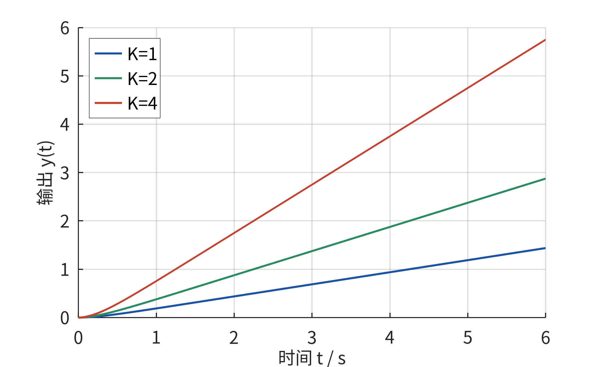
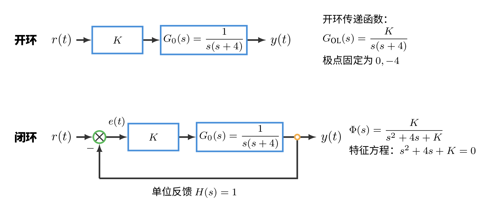
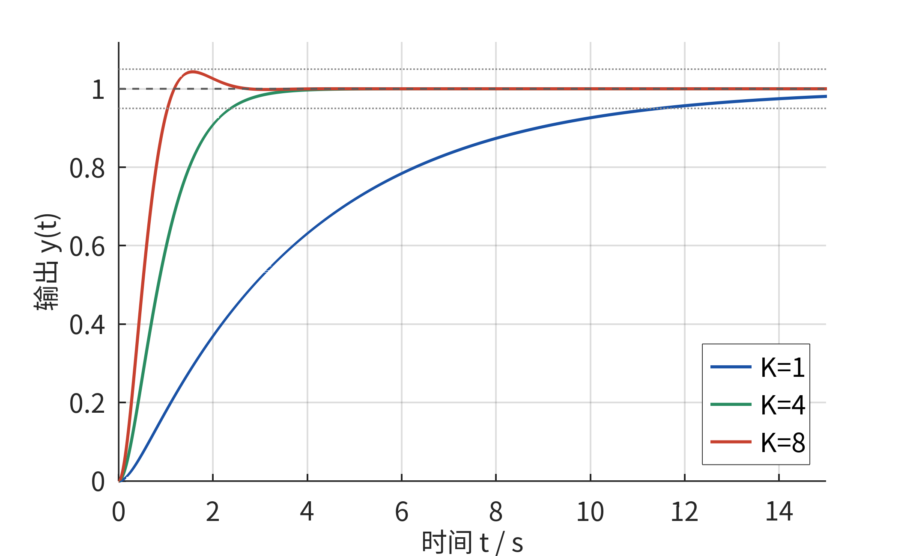
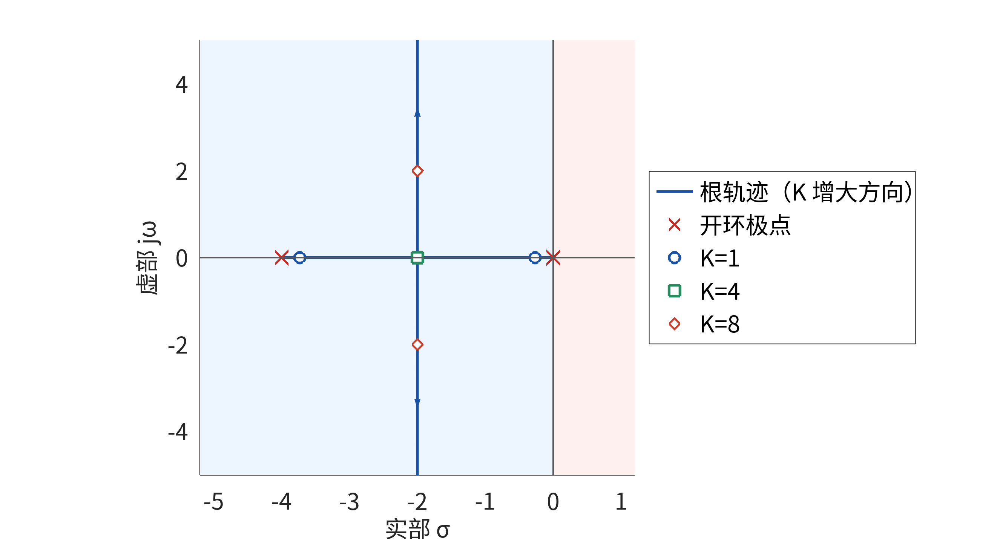
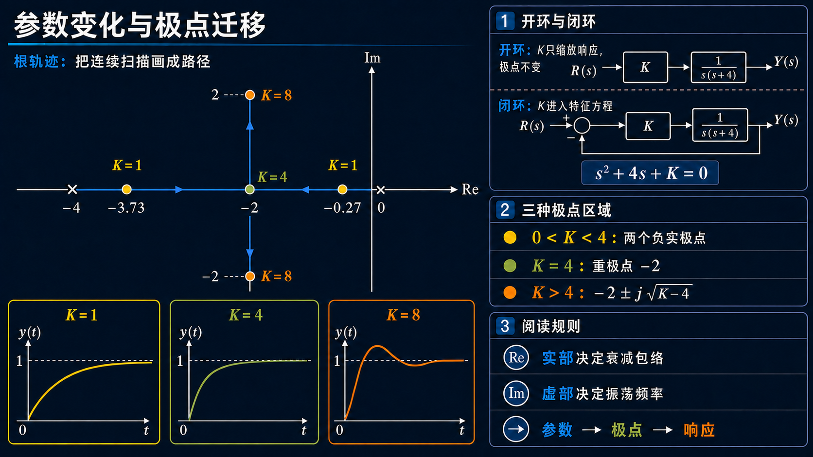

# 单元 1-3 | 参数变化与极点迁移：根轨迹的第一眼


---

## 模块1 导论串讲——控制系统的完整图像

模块1做一件事：在你进入正式推导之前，先让你看见整门课的全貌。五次课，每次从一个不同的角度把控制系统的骨架描一遍。

本模块包含：
- **单元 1-1**：看见整门课——从反馈思想到控制全景
- **单元 1-2**：建模——从真实对象到可分析的系统
- **单元 1-3**（本讲）：参数变化与极点迁移——根轨迹的第一眼
- **单元 1-4**：时域与频域——同一个系统的两种观察视角
- **单元 1-5**：平台初体验——三域联动的第一次亲手操作

在 1-2 中，我们把极点和复平面建立成了"系统行为的第一张地图"——极点在左半平面还是右半平面、靠近实轴还是远离实轴，直接决定了响应是收敛还是发散、单调还是振荡。但那是一张**静态**地图：极点的位置是固定的，你只能读一张快照。

这一讲要回答的问题是：**如果系统中有一个可调参数——比如增益——极点的位置会发生什么？响应又会跟着怎么变？** 你将看到，参数不是在直接"改曲线"，而是在"推极点"。理解了这条链，调参就不再是盲目拧旋钮——你是在复平面上推着一组坐标走，并预期每一步的后果。

---

## 一、拧一个旋钮，整条曲线就变了

自动舵上有一个增益旋钮。船还是那条船，反馈结构没有改，只把这个旋钮拧大了一点——原来偏慢、偏稳的航向修正过程，可能变得更快；再继续拧，曲线又可能开始越过目标值并出现摆动。

这不是自动舵独有的现象。任何带可调参数的控制系统——电机的转速环、温控箱的 PID、机器人的关节伺服——都会在调参时出现类似的模式：同一个结构，同一个对象，只改变一个数字，行为却显著不同。

我们已经知道，极点在复平面上的位置决定了系统的行为。但到目前为止，我们面对的极点都是不动的——一个固定的特征方程，解出一组固定的根。增益旋钮带来的变化，意味着必然有某个东西在被增益改写。那个东西是什么？

完成这次课程后，你应当能够：

- 推导单位负反馈的闭环传递函数，并指出增益在开环和闭环中扮演的角色有何根本不同
- 说出参数为什么能改变闭环极点的位置——它进入了闭环特征方程，改写了系数
- 给定一个二阶闭环特征方程和一个参数范围，描述极点的大致移动路径
- 从极点移动的方向，预判时域行为在变快还是变慢、在走向单调还是走向振荡
- 把根轨迹理解为"参数扫描下闭环极点的连续路径图"，并在一张复平面上标出关键位置

---

## 二、开环与闭环：同一个增益，两种命运

要理解增益为什么能改变系统行为，需要先看清一个根本区别：同一个增益 $K$，放在开环中和放在闭环中，扮演的角色完全不同。

### 2.1 开环：增益只按比例缩放响应

考虑一个简化的航向控制对象。舵角指令到航向角的动态关系可近似为

$$G_0(s) = \frac{1}{s(s+4)}$$

先看没有反馈的情况。在对象前面串接一个比例增益 $K$，构成开环系统。开环传递函数为

$$G_{\text{开}}(s) = \frac{K}{s(s+4)}$$

对单位阶跃输入 $r(t)=1(t)$，输出响应 $y(t)$ 可以从

$$Y(s) = G_{\text{开}}(s) \cdot \frac{1}{s}=\frac{K}{s^2(s+4)}$$

求得。单位阶跃输入固定引入一个 $1/s$，但增益 $K$ 仍只出现在分子上；因此改变 $K$ 不会改变开环传递函数 $G_{\text{开}}(s)$ 的分母和极点，只会使任意时刻的输出按比例缩放，响应的基本形态不变。

{width=60%}
<p align="center"><strong>图1-3-1 开环增益只按比例缩放响应</strong></p>

开环下调节 $K$，你只是在放大或缩小同一条响应曲线。当前对象含有原点极点，单位阶跃响应会持续增长，并不存在有限稳态值；图中的三条曲线正是同一条增长曲线的比例缩放。$K$ 没有进入特征方程，开环极点始终固定在 $s=0$ 和 $s=-4$，因此模态组成和极点位置都不随 $K$ 改变。

用 MATLAB/Octave 验证：

```matlab
G0 = tf(1, [1 4 0]);       % 对象 G0(s) = 1/[s(s+4)]

% 开环：增益串联在对象前面
K1 = 1; K2 = 2; K3 = 4;
step(K1*G0, K2*G0, K3*G0); % 三条曲线形状完全一致，仅幅度不同
legend('K=1', 'K=2', 'K=4');
```

### 2.2 闭环：增益进入了特征方程

现在加上反馈。把同一个对象和同一个增益 $K$ 放进单位负反馈结构中——输出 $y(t)$ 被测量并送回输入端，与期望 $r(t)$ 相减形成误差 $e(t)$，误差再被放大 $K$ 倍后驱动对象 $G_0(s)$。

这个结构可以用三行代数关系完整描述。先写出各信号在 $s$ 域中的关系。误差是期望与测量之差：

$$E(s) = R(s) - Y(s)$$

输出由误差放大 $K$ 倍后经对象 $G_0(s)$ 产生：

$$Y(s) = E(s) \cdot K \cdot G_0(s)$$

将第一行代入第二行，消去 $E(s)$：

$$Y(s) = \big(R(s) - Y(s)\big) \cdot K G_0(s)$$

展开：$Y(s) = R(s) \cdot K G_0(s) - Y(s) \cdot K G_0(s)$。把含 $Y(s)$ 的项移到等号左边：

$$Y(s) \cdot \big(1 + K G_0(s)\big) = R(s) \cdot K G_0(s)$$

按照传递函数的定义——输出与输入在 $s$ 域中的比值——得到闭环传递函数：

$$\Phi(s) = \frac{Y(s)}{R(s)} = \frac{K G_0(s)}{1 + K G_0(s)}$$

代入 $G_0(s) = 1/[s(s+4)]$：

$$\Phi(s) = \frac{\frac{K}{s(s+4)}}{1 + \frac{K}{s(s+4)}} = \frac{K}{s^2 + 4s + K}$$

闭环特征方程为

$$s^2 + 4s + K = 0$$

对比开环和闭环，核心差异一目了然。开环中，$K$ 是分子上的一个乘数——它只缩放输出。闭环中，$K$ 跑到了分母里——它成了特征方程的一个系数。每取一个新的 $K$ 值，特征方程就变了，它的根——也就是闭环极点——也随之改变。

这就是增益旋钮能改写系统行为的根本原因。不是增益本身有魔力，而是**闭环把增益塞进了极点所在的位置**。

{width=90%}
<p align="center"><strong>图1-3-2 开环与单位负反馈闭环中的增益作用</strong></p>

这个区别在 MATLAB/Octave 中只需两行代码就能验证：

```matlab
% 开环极点（不随 K 变化）
pole(K1*G0)                % 始终为 0 和 -4

% 闭环极点（随 K 变化）
K = 3;
Phi = feedback(K*G0, 1);   % 构造单位负反馈闭环系统
pole(Phi)                  % 极点已随 K 移动
```

---

## 三、极点移动有连续性，响应变化也有连续性

既然 $K$ 进入了特征方程 $s^2 + 4s + K = 0$，我们就可以直接求根，看看极点随 $K$ 增大到底往哪里走：

$$s_{1,2} = -2 \pm \sqrt{4 - K}$$

这个表达式已经把整个故事讲完了。按 $K$ 从小到大走一遍。

**$0 < K < 4$：两个负实极点。** 根号内 $4-K$ 为正。当 $K$ 很小、接近零时，$\sqrt{4-K} \approx 2$，极点约在 $s=0$ 和 $s=-4$。随着 $K$ 增大，根号值缩小，两个极点沿实轴相向而行——一个从 $-4$ 向右，一个从 $0$ 向左。响应始终单调，但因为更靠右的那个极点在向左移动，衰减在加快——系统在变快。

**$K = 4$：重实极点。** 根号内为零，两个极点重合在 $s = -2$。这是一个过渡位置——极点从"都在实轴上"走到"准备离开实轴"。

**$K > 4$：共轭复极点。** 根号内为负，写成虚数形式：

$$s_{1,2} = -2 \pm j\sqrt{K-4}$$

极点离开实轴，成为一对共轭复数。实部固定在 $-2$——衰减的包络不再随 $K$ 加速。虚部 $\sqrt{K-4}$ 随 $K$ 增大而增大——振荡频率在升高，摆动越来越密。时域中开始出现超调和振荡。

三条结论：

1. 极点移动是**连续的**——$K$ 连续增大，极点沿实轴滑行，会合，再平滑地离开实轴，整个过程没有跳跃。
2. 响应变化也是**连续的**——从单调到会合点到振荡，中间没有断层。
3. 参数的作用分为两个阶段：$0<K<4$ 时，主导极点向左移动，单调响应逐渐加快；$K>4$ 后，极点实部固定为 $-2$，虚部继续增大，振荡频率随之升高。速度与振荡之间的权衡来自同一特征方程，但两种变化并非在整个参数区间内同步发生。

---

## 四、从极点到曲线：三组 $K$ 值的时域全貌

第三节用极点坐标做了预判。现在把每个 $K$ 值对应的完整时域响应写出来——从 $\Phi(s)$ 到 $y(t)$，再到曲线——验证预判是否准确。

取三个典型增益：$K=1$（实极点区间）、$K=4$（会合点）、$K=8$（复极点区间）。

**$K=1$：单调慢速。** 闭环传递函数 $\Phi(s) = \frac{1}{s^2+4s+1}$。极点 $-0.27$ 和 $-3.73$ 均为负实数。对单位阶跃输入，输出为

$$y(t) = 1 - 1.07e^{-0.27t} + 0.07e^{-3.73t}$$

两项指数都在衰减。$-3.73$ 对应的项衰减极快（约 1 秒就消失），$-0.27$ 对应的项衰减很慢——它是主导整个响应速度的那一项。用完整响应计算，进入并保持在稳态值 $\pm 5\%$ 范围内的调节时间约为 $11.46$ 秒。曲线平滑单调，没有超调。

**$K=4$：临界阻尼。** $\Phi(s) = \frac{4}{s^2+4s+4} = \frac{4}{(s+2)^2}$。重极点 $-2$。

$$y(t) = 1 - e^{-2t} - 2te^{-2t}$$

多了一个 $te^{-2t}$ 项——这是重极点区别于两个分离实极点的特征。正因为存在这个多项式因子，不能直接用单一指数的 $3/2$ 估算调节时间。由完整响应计算，5% 调节时间约为 $2.37$ 秒。它是这一比例增益族中不产生超调的最快响应；继续增大 $K$，极点将离开实轴。

**$K=8$：衰减振荡。** $\Phi(s) = \frac{8}{s^2+4s+8}$。极点 $-2 \pm j2$——实部 $-2$ 决定衰减包络，虚部 $\pm 2$ 决定振荡频率。

$$y(t) = 1 - e^{-2t}(\cos 2t + \sin 2t)$$

振荡周期为 $2\pi/2 \approx 3.14$ 秒。响应在 $t=\pi/2\approx1.57$ 秒达到第一个峰值 $1+e^{-\pi}\approx1.043$，超调量约为 $4.32\%$。由于此前已经进入 5% 误差带且后续振荡快速衰减，5% 调节时间约为 $1.04$ 秒。

<p align="center"><strong>表 1-3-1 三组 $K$ 值的时域全貌</strong></p>

| $K$ | $\Phi(s)$ | 极点 | $y(t)$ 形态 | 约 95% 稳定时间 |
|:---:|------|------|------|:---:|
| 1 | $\frac{1}{s^2+4s+1}$ | $-0.27, -3.73$ | 单调，无超调 | $\sim 11.46$s |
| 4 | $\frac{4}{(s+2)^2}$ | $-2, -2$ | 单调，无超调，临界阻尼 | $\sim 2.37$s |
| 8 | $\frac{8}{s^2+4s+8}$ | $-2\pm j2$ | 衰减振荡，超调 $\sim 4.32\%$ | $\sim 1.04$s |

{width=60%}
<p align="center"><strong>图1-3-3 三组增益下的闭环阶跃响应</strong></p>

用 MATLAB/Octave 生成这三条曲线：

```matlab
G0 = tf(1, [1 4 0]);                 % 对象 G0(s) = 1/[s(s+4)]

K_vals = [1 4 8];
hold on;
for K = K_vals
    Phi = feedback(K*G0, 1);          % 闭环传递函数
    step(Phi);                        % 阶跃响应
end
legend('K=1', 'K=4', 'K=8');
```

三条曲线并排看，闭环下增益调节的后果非常直观：同一个结构，三个 $K$，三种响应。$K$ 从 1 增至 4 时，单调响应明显加快；从 4 增至 8 后，系统以少量超调换得更短的 5% 调节时间，同时进入衰减振荡区。

---

## 五、根轨迹雏形：把极点路径画在同一张图上

三组 $K$ 值给出了三张快照。但如果把 $K$ 连续增大时所有极点位置画在同一张复平面上，并按 $K$ 增大的顺序连接起来，我们就得到了根轨迹的雏形。

对 $s^2 + 4s + K = 0$ 这个二阶系统，轨迹形状用语言就可以完整描述：

1. $K$ 从接近零开始增大时，两支轨迹从实轴上的两个起点（$s=0$ 和 $s=-4$）出发。
2. 两支沿实轴相向移动，在 $s=-2$ 会合。
3. $K$ 继续增大，两支离开实轴，分别向上、向下对称展开，构成一对共轭复极点。

{width=60%}
<p align="center"><strong>图1-3-4 参数增大时的闭环极点迁移路径</strong></p>

在 MATLAB/Octave 中，一行代码就能生成这张图：

```matlab
G0 = tf(1, [1 4 0]);       % 对象 G0(s) = 1/[s(s+4)]
rlocus(G0);                 % 绘制闭环极点随 K 变化的迁移路径
```

这张图把五件事压缩进了一个画面：哪个参数在变（$K$）、极点从哪里出发（起点）、沿什么路径走（轨迹）、经过哪些关键位置（会合点）、最终往哪去（趋势）。你顺着箭头看，看到的就是系统被参数推着走的过程。这就是根轨迹——不是一套规则表，而是一张"参数变化下的极点迁徙图"。

到目前为止，我们只看了 $K$ 从 $0$ 增到 $8$ 这一段。如果继续增大 $K$，共轭极点的虚部会越来越大，但实部永远停在 $-2$。这意味着指数包络的衰减率不再提高；峰值时间、上升过程和按误差带定义的实际调节时间仍会随振荡频率改变，并不简单保持常数。$K=4$ 标记的是极点由实轴转入复平面的结构分界，而不是所有速度指标停止变化的绝对拐点。

---

## 六、例题：追踪极点迁移，预判行为变化

**例题 1-3-1 从一个新的二阶系统追踪增益的全程影响**

设某位置伺服系统的对象传递函数为

$$G_p(s) = \frac{1}{s(s+6)}$$

在该对象前串接比例增益 $K$，并构成单位负反馈闭环。请回答：

1. 写出闭环传递函数 $\Phi(s)$ 和闭环特征方程。
2. 推导闭环极点随 $K$ 变化的解析表达式，指出会合点的位置和对应的 $K$ 值。
3. 取 $K=3$、$K=9$、$K=13$ 三个值，分别计算极点位置，并预判时域行为（单调/振荡、快/慢）。
4. 描述根轨迹的大致形状：起点在哪里、会合点在哪里、会合后往哪个方向展开。

**解**

**（1）闭环传递函数与特征方程。** 将 $G_p(s)$ 代入单位反馈闭环公式：

$$\Phi(s) = \frac{K G_p(s)}{1 + K G_p(s)} = \frac{\frac{K}{s(s+6)}}{1 + \frac{K}{s(s+6)}} = \frac{K}{s^2 + 6s + K}$$

闭环特征方程为

$$s^2 + 6s + K = 0$$

**（2）极点解析表达式。** 求解特征方程：

$$s_{1,2} = -3 \pm \sqrt{9 - K}$$

会合点出现在根号内为零时：$9 - K = 0$，即 $K = 9$。此时两个极点重合在 $s = -3$。与前面的 $1/[s(s+4)]$ 系统（会合点在 $s=-2$，对应 $K=4$）相比，这个系统的会合点更靠左——这是对象极点 $-6$（而非 $-4$）在实轴上拉出的结果。

**（3）三组 $K$ 值的极点与行为预判。**

<p align="center"><strong>表 1-3-2 例题 1-3-1 的三组 $K$ 值</strong></p>

| $K$ | 根号内 $9-K$ | 极点位置 | 行为预判 |
|:---:|:---:|------|------|
| 3 | $+6$ | $-3 \pm \sqrt{6} \approx -0.55,\ -5.45$ | 两个负实极点，单调收敛；$-0.55$ 靠近虚轴，主导慢速拖尾 |
| 9 | $0$ | $-3, -3$ | 重实极点，临界阻尼，单调收敛中最快的一种 |
| 13 | $-4$ | $-3 \pm j2$ | 共轭复极点，衰减振荡；实部 $-3$ 管包络，虚部 $\pm 2$ 管摆动 |

**（4）根轨迹形状。** 两支轨迹分别从开环极点 $s=0$ 和 $s=-6$ 出发，沿实轴相向移动，在 $s=-3$ 会合（$K=9$），然后对称地向上、向下离开实轴。$K > 9$ 后，实部固定在 $-3$，虚部随 $K$ 继续增大。

对比本例题（对象极点在 $0$ 和 $-6$）与第二至五节的主示例（对象极点在 $0$ 和 $-4$），你会发现：**对象极点的位置决定了根轨迹的"骨架"——会合点恰好落在两个对象极点的中点。** 这不是巧合——在只有两个实极点且没有零点的情况下，这是一个普遍规律。模块 3 中，你会学到为什么。

验证代码：

```matlab
Gp = tf(1, [1 6 0]);             % 对象 Gp(s) = 1/[s(s+6)]

% 查看根轨迹
figure(1); rlocus(Gp);

% 验证三组 K 值下的闭环极点
for K = [3 9 13]
    Phi = feedback(K*Gp, 1);
    fprintf('K=%d: 极点 = %s\n', K, mat2str(pole(Phi)'));
    figure; step(Phi); title(sprintf('K=%d 闭环阶跃响应', K));
end
```

---

## 七、案例：自动舵增益调节的三次记录

回到自动舵的增益旋钮。同一艘船，同一个航向保持回路——这正是第二节中的 $G_0(s)=1/[s(s+4)]$ 对象——只改变比例增益 $K$。船上记录了三组试验数据，对应 $K=1$、$4$、$8$ 三个工作点。

### 7.1 三次试验记录

**$K=1$：保守设定。** 极点 $-0.27$ 和 $-3.73$。航向修正单调，没有超调，5% 调节时间约为 $11.46$ 秒。这个工作点的主要特征是过程平缓，但恢复速度较慢。

**$K=4$：临界设定。** 重极点 $-2$。5% 调节时间约为 $2.37$ 秒，仍然没有超调。极点恰好在此会合，处于单调区与振荡区的分界线上：低于 $K=4$，系统在单调区内逐渐加快；高于 $K=4$，系统进入振荡区。

**$K=8$：带少量超调的设定。** 极点 $-2 \pm j2$。船头会先越过目标航向约 $4.32\%$，再摆回来；5% 调节时间约为 $1.04$ 秒。它比 $K=4$ 更早进入 5% 误差带，但代价是出现衰减振荡。真实自动舵能否采用这一参数，还取决于未建模动态、执行器限幅、海况和舒适性约束，不能只凭当前二阶模型决定。

<p align="center"><strong>表 1-3-3 自动舵三次增益试验对比</strong></p>

| 工作点 | $K$ | 极点 | 航向行为 | 适用场景 |
|:---:|:---:|------|------|------|
| 保守 | 1 | $-0.27, -3.73$ | 单调缓慢，无超调 | 5% 调节时间约 $11.46$s |
| 临界 | 4 | $-2, -2$ | 单调快速，无超调 | 5% 调节时间约 $2.37$s |
| 少量超调 | 8 | $-2 \pm j2$ | 轻微超调后稳定 | 超调约 $4.32\%$，5% 调节时间约 $1.04$s |

### 7.2 如果再继续拧大 $K$

把 $K$ 继续增大到 16、25、36……极点表达式 $s_{1,2} = -2 \pm j\sqrt{K-4}$ 告诉我们：实部永远停在 $-2$，虚部 $\sqrt{K-4}$ 一直在涨。这意味着指数包络的衰减率固定不变，而振荡频率持续升高。由于误差带的最后一次穿越还受振荡相位影响，实际调节时间会随 $K$ 非单调变化，不能仅凭实部断言其保持不变。

这就是比例控制的**结构边界**：在对象 $G_0(s)=1/[s(s+4)]$ 的单位反馈结构中，单靠增大 $K$，你最多只能把衰减速度推到实部 $-2$ 这个上限。要突破这个上限——让衰减更快而不引起更剧烈的振荡——需要改变控制器的结构。这正是模块 3 和模块 4 的核心任务。

### 7.3 复现试验数据的代码

```matlab
% 自动舵增益调节——三次试验复现
G0 = tf(1, [1 4 0]);                % 对象：舵角指令 → 航向角

K_trials = [1 4 8];
figure(1); rlocus(G0);              % 根轨迹——全局视角
figure(2); hold on;                 % 时域响应使用独立坐标轴
for K = K_trials
    Phi = feedback(K*G0, 1);
    [y, t] = step(Phi);
    plot(t, y);                     % 时域——逐条叠加
end
legend('K=1', 'K=4', 'K=8');
title('自动舵三次增益试验：阶跃响应对比');
```

这个案例的核心结论与第四节一致，但换了一个角度来说：**参数不是在直接"改曲线"，而是在"推极点"。** 曲线变了，是因为闭环特征方程的根先变了。理解了这条链，你就不再是在盲目拧旋钮——你是在复平面上推着一组坐标走，并预期每一步的后果。

---

## 八、分层练习

### 基础题 •

**1. 补全推导。** 对对象 $G_0(s) = \frac{1}{s(s+3)}$，写出单位反馈闭环传递函数 $\Phi(s)$ 和特征方程。判断 $K=1$、$K=2.25$、$K=5$ 时闭环极点的类型（实/复），并预判行为。

**2. 读图判断。** 图 1-3-4 的根轨迹中，标注了 $K=1$、$K=4$、$K=8$ 三个点。请回答：
- （a）$K$ 从 0.5 变到 2 时，主导极点的实部是变大了还是变小了？另一支实极点向哪个方向移动？这意味着响应变快了还是变慢了？
- （b）$K$ 从 5 变到 10 时，闭环极点的虚部是变大了还是变小了？这意味着什么？
- （c）$K=4$ 这个点有什么特殊之处？

**3. 代码验证。** 对例题 1-3-1 中的对象 $G_p(s) = 1/[s(s+6)]$，在 MATLAB/Octave 中运行 `rlocus(Gp)`，在图上找出 $K=3$、$9$、$13$ 对应的极点位置，并与表 1-3-2 的计算结果对照。

### 进阶题 ••

**4. "最快的单调响应"。** 第二节和第七节反复提到：临界阻尼（$K=4$，重极点）是单调响应中最快的一种——再增大 $K$ 就会出现超调。这个说法只在"不允许超调"的前提下成立。如果允许 5% 的超调，$K=4$ 还是"最佳"选择吗？结合图 1-3-3 中三条曲线的对比，给出你的判断。

**5. 从曲线反推极点。** 某个无零点的标准二阶闭环系统，其阶跃响应有轻微超调（约 5%），按 5% 误差带计约 2 秒后基本稳定，振荡周期约 4 秒。请估算其闭环极点的大致位置（给出 $\sigma$ 和 $\omega$ 的近似值），并判断这个系统最有可能由以下哪种特征方程产生：
- （a）$s^2 + 4s + 3 = 0$
- （b）$s^2 + 3s + 4.7 = 0$
- （c）$s^2 + 6s + 5 = 0$

### 挑战题 •••

**6. "增益的回报递减"。** 对 $G_0(s)=1/[s(s+4)]$ 这个对象，$K$ 从 4 增大到任意大时，实部始终停在 $-2$。这意味着衰减包络不再加速。请思考：
- （a）如果要求"超调不超过 10% 且 5% 调节时间不超过 1 秒"，仅靠调节 $K$ 能否满足？结合极点表达式和完整阶跃响应说明理由。
- （b）如果进一步把 5% 调节时间要求缩短到 $0.8$ 秒，比例控制还能否满足？若不能，你希望控制器多出什么"能力"？用不超过三句话描述。

**7. 换一个对象重新走一遍。** 选一个你熟悉的工程系统，并把控制器比例增益作为可调参数——例如温控器比例增益、电机调速器比例增益或水箱液位控制器比例增益——仿照本讲第二至五节的结构，完成以下步骤：
- （a）写出该对象的简化传递函数（一阶或二阶），确定可调参数的位置；
- （b）分析这个参数在开环和闭环中扮演的角色有何不同；
- （c）取三组不同的参数值，描述对应行为并画出示意曲线。

---

## 九、总结与扩展思考

这一讲的核心动作只有一步——**把参数从分子移到分母里**——但这一步改写了整个故事。

在没有反馈的开环中，增益只是输出的一个倍数：拧大旋钮，曲线等比例放大，但行为模式固守不变。一旦加上反馈，增益就进入了特征方程——它开始改写极点。极点是系统行为最早的暴露者：极点的移动是连续的，行为的改变也是连续的。把这条连续的迁徙路径画在复平面上，就是根轨迹的雏形。

三个判断值得带走：

**闭环让增益成为"结构变量"。** 开环中增益只决定幅度；闭环中增益决定极点的位置——从而决定稳定与否、快慢和振荡倾向。这不是增益本身的魔力，而是反馈结构把增益推进了特征方程的分母。

**增益的作用具有清楚的阶段性。** 对于本讲考察的二阶无零点对象，$0<K<4$ 时主导极点沿实轴向左移动，响应在保持单调的同时逐渐加快；$K>4$ 后，极点实部固定，虚部继续增大，指数包络的衰减率不再提高，振荡频率和超调量却会增加。峰值时间、上升过程和实际调节时间仍受振荡相位影响，必须由完整响应判断。

**根轨迹是"参数→极点→行为"这条链的可视化。** 不需要记住绘制规则——那是模块 3 的任务。现在只需要把根轨迹当作一张地图来读：起点告诉你"零增益时系统在哪儿"，轨迹方向告诉你"参数增大时系统往哪儿走"，关键位置（会合点、与虚轴交点）告诉你"什么地方的行为会发生质变"。

**扩展思考。** 本讲全程使用比例控制 $C(s)=K$——最简单的控制器结构。如果换成 $C(s)=K/s$（积分控制）或 $C(s)=Ks$（微分控制），参数扫描下极点还会沿类似的路径移动吗？特征方程里 $K$ 所在的位置会发生什么变化？记录你的猜测，模块 3 的根轨迹法则和模块 4 的控制器选型会给出精确答案。



---

## 附录：部分习题简答

**习题 1**：闭环传递函数 $\Phi(s) = \frac{K}{s^2+3s+K}$，特征方程 $s^2+3s+K=0$，极点 $s_{1,2} = -1.5 \pm \sqrt{2.25-K}$。会合点在 $s=-1.5$（$K=2.25$）。$K=1$：$\sqrt{1.25}$ 为正，两个负实极点 $-0.38$ 和 $-2.62$，单调收敛。$K=2.25$：重实极点 $-1.5$，临界阻尼。$K=5$：$\sqrt{-2.75}$，共轭复极点 $-1.5 \pm j1.66$，衰减振荡。

**习题 2**：（a）$K$ 从 0.5 增至 2 时，主导极点由约 $-0.13$ 移至 $-0.59$，实部减小（变得更负），因此主导衰减加快；另一支极点由约 $-3.87$ 移至 $-3.41$，向右移动。决定慢过程的主导极点远离虚轴，所以总体响应变快。（b）虚部绝对值增大，振荡频率升高，摆动更密。（c）$K=4$ 处两个极点重合为 $-2$，是单调区和振荡区的分界——临界阻尼点。

**习题 3**：运行代码后，极点位置应与表 1-3-2 一致。$K=3$ 时两个实点约在 $-0.55$ 和 $-5.45$；$K=9$ 时重极点 $-3$；$K=13$ 时共轭点 $-3 \pm j2$。

**习题 4**：允许 5% 超调时，$K=4$ 不再是最快选择。从图 1-3-3 看，$K=8$ 的超调量约为 $4.32\%$，5% 调节时间约为 $1.04$ 秒；$K=4$ 无超调，但 5% 调节时间约为 $2.37$ 秒。允许少量超调后，可以用更大的比例增益换取更短的调节时间。"最佳"取决于超调、调节时间和模型不确定性等约束。

**习题 5**：按 5% 误差带的近似式 $t_s\approx3/|\sigma|$，调节时间约 2 秒对应 $\sigma\approx-1.5$；振荡周期约 4 秒对应 $\omega_d\approx2\pi/4\approx1.57\ \mathrm{rad/s}$。于是极点约为 $-1.5\pm j1.57$，相应阻尼比约为 $0.69$，预测超调量约为 $4.9\%$。对应特征多项式约为 $s^2+3s+4.7$，因此选择（b）。（a）和（c）都只有负实极点，不能产生超调和衰减振荡。上述反推以无零点的标准二阶闭环模型为前提；若系统含有零点，单凭这些时域指标不能唯一确定特征方程。

**习题 6**：（a）可以。以 5% 误差带为准，用完整阶跃响应扫描可得，$K\approx8.38$ 时超调量约为 $4.97\%$，5% 调节时间约为 $0.99$ 秒，同时满足两项要求。这里也说明 $3/|\sigma|$ 只是包络近似，不能替代对实际误差带最后穿越时刻的计算；若改用 2% 误差带，结论会不同。（b）若把 5% 调节时间进一步缩短到 $0.8$ 秒，在超调不超过 10% 的约束下，单纯调节比例增益已经无法满足。此时需要改变闭环特征方程的结构，例如引入微分作用或超前校正，把主导极点向更左侧移动，同时控制振荡倾向。

**习题 7**：此题开放，无标准答案。评判标准：（a）对象的简化模型是否抓住了主要动态关系，并明确比例增益位于控制器而不是被控对象输入中；（b）是否区分了比例增益在开环和闭环中的不同作用；（c）三组增益是否产生了可由极点变化解释的响应差异。若所选对象是一阶系统，不要求强行构造临界或振荡区域。
