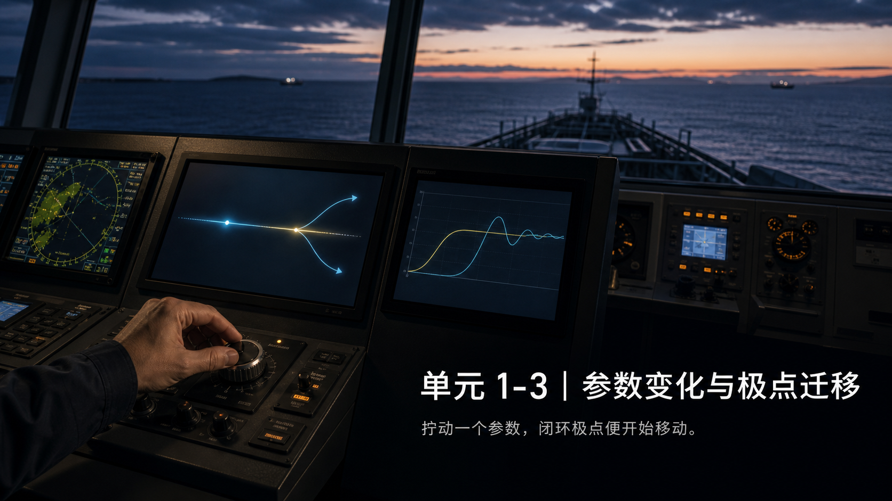

# 单元 1-3 | 参数变化与极点迁移：根轨迹的第一眼

---

## 一、拧一个旋钮，整条曲线就变了

自动舵上有一个增益旋钮。船还是那条船，反馈结构没有改，只把这个旋钮拧大了一点——原来偏慢、偏稳的航向修正过程，可能变得更快；再继续拧，曲线又可能开始越过目标值并出现摆动。

这不是自动舵独有的现象。任何带可调参数的控制系统——电机的转速环、温控箱的 PID、机器人的关节伺服——都会在调参时出现类似的模式：**同一个结构，同一个对象，只改变一个数字，行为却显著不同。**

我们已经知道，极点在复平面上的位置决定了系统的行为。但到目前为止，我们面对的极点都是不动的——一个固定的特征方程，解出一组固定的根。现在情况不同了：参数是可调的。参数一旦进入特征方程，就会改写方程的系数，进而改写方程的根。于是，每换一个参数值，极点就换一个位置。

我们现在要建立的，就是把"调参动作"和"极点迁移"连起来的那条链。

完成这次课程后，你应当能够：

- 说出参数为什么能改变闭环极点的位置——它进入了特征方程，改写了系数
- 给定一个二阶闭环特征方程和一个参数范围，描述极点的大致移动路径
- 从极点移动的方向，预判时域行为在变快还是变慢、在走向单调还是走向振荡
- 把根轨迹理解为"参数扫描下闭环极点的连续路径图"，而不是一套需要硬记的规则

---

## 二、参数进了特征方程，极点就不再是固定的

考虑一个简化的航向保持回路。设被控对象加上执行机构后的开环主体为

$$G_0(s) = \frac{1}{s(s+4)}$$

若只用一个比例增益 $K$ 来调整控制力度，单位反馈闭环下的特征方程为

$$s^2 + 4s + K = 0$$

此处最关键的不是推导特征方程的步骤，而是一件事：$K$ 进入了特征方程。这意味着 $K$ 不再是系统外面一个游离的旋钮——它成了方程系数的一部分。每取一个新的 $K$ 值，我们就得到一个新的二次方程，解出一组新的根，即一组新的闭环极点。

参数把极点的位置变成了参数本身的函数。

---

## 三、极点移动有连续性，响应变化也有连续性

对 $s^2 + 4s + K = 0$ 直接求根：

$$s_{1,2} = -2 \pm \sqrt{4 - K}$$

这个表达式已经把整个故事讲完了。我们只需要按 $K$ 从小到大走一遍。

**$0 < K < 4$：两个负实极点。** 根号内 $4-K$ 为正，两个极点都落在负实轴上。当 $K$ 很小、接近零时，$\sqrt{4-K} \approx 2$，极点约在 $s=0$ 和 $s=-4$。随着 $K$ 增大，根号值缩小，两个极点沿实轴相向而行——一个从 $-4$ 向右，一个从 $0$ 向左。响应始终单调，没有振荡；但因为"更靠右的那个极点"在向左移动，衰减在加快——系统在变快。

**$K = 4$：重实极点。** 根号内为零，两个极点重合在 $s = -2$。这是一个过渡位置——极点从"都在实轴上"走到"准备离开实轴"。极点在此会合，但不会停留。

**$K > 4$：共轭复极点。** 根号内为负，写成虚数形式：

$$s_{1,2} = -2 \pm j\sqrt{K-4}$$

极点离开实轴，成为一对共轭复数。实部固定在 $-2$——这意味着衰减的包络不再随 $K$ 加速。虚部 $\sqrt{K-4}$ 随 $K$ 增大而增大——这意味着振荡频率在升高，摆动越来越密。时域中开始出现超调和振荡。

三条结论从这三段直接得出：

1. 极点移动是**连续的**——$K$ 连续增大，极点不会"跳跃"到另一个位置。
2. 响应变化也是**连续的**——单调 → 会合点 → 振荡，中间没有断层。
3. 参数增大同时带来两种效果——更快（实部左移）和更会摆（虚部增大）。两者不是先后关系，是同步发生的。

---

## 四、根轨迹雏形：把极点路径画在同一张图上

如果把每个 $K$ 对应的极点位置都标在复平面上，并按 $K$ 从零增大的顺序连起来，我们看到的正是根轨迹的雏形。

对 $s^2 + 4s + K = 0$ 这个二阶系统，轨迹的形状用语言就可以完整描述：

1. $K$ 从接近零开始增大时，两支轨迹从实轴上的两个起点（$s=0$ 和 $s=-4$）出发。
2. 两支沿实轴相向移动，在 $s=-2$ 会合。
3. $K$ 继续增大，两支离开实轴，分别向上、向下对称展开，构成一对共轭复极点。

这张图的核心价值不在于它漂亮，而在于它把"调参动作"和"动态结果"压缩进了同一张地图。图上的每一个点，对应某个 $K$ 值下的一组闭环极点，也对应一种可能出现的时域响应。当你顺着箭头方向看这张图，你看到的就是系统被参数推着走的过程。

> **图 1-3-1**：$G_0(s)=1/[s(s+4)]$ 单位反馈闭环的根轨迹雏形——复平面上两支轨迹从 $s=0$ 和 $s=-4$ 出发，沿实轴相向移动到 $s=-2$ 会合，然后离开实轴对称展开。箭头方向为 $K$ 增大方向。背景复用复平面五区着色（稳定区蓝、不稳定区红、虚轴加粗）。

**表 1-3-1 三个典型 $K$ 值的完整对照**

| $K$ | 闭环极点 | 复平面位置 | 时域现象 |
|:---:|------|------|------|
| 1 | $-0.27,\ -3.73$ | 负实轴上，一点靠近虚轴 | 单调收敛，偏慢，无超调 |
| 4 | $-2,\ -2$ | 负实轴上会合，重根 | 明显快于 $K=1$，单调与振荡的边界 |
| 8 | $-2 \pm j2$ | 左半平面共轭复数 | 出现超调与振荡，仍衰减 |

把三条记录连起来看，判断链非常清晰：$K$ 从 1 到 4——最慢的那个极点从靠近虚轴的位置向左移动，迟缓感明显减轻。$K$ 从 4 到 8——极点离开实轴带上虚部，摆动开始出现。增益变大并不总意味着"更好"——进入复极点区域后，振荡加重往往成为新的代价。参数调节是在不同动态品质之间重新分配权重。

---

## 五、案例：自动舵增益调节的三次记录

回到自动舵的增益旋钮。同一艘船，同一个航向保持回路，只改变比例增益 $K$。特征方程仍然是 $s^2 + 4s + K = 0$。我们用三个 $K$ 值——1、4、8——观察三个不同的工作点。

**$K=1$：保守设定。** 极点 $-0.27$ 和 $-3.73$ 都在负实轴上。$-0.27$ 离虚轴很近——它是拖慢整个响应的那个极点。航向修正的过程单调，没有超调，但需要较长时间才能稳定。如果海况平静、对响应速度要求不高，这个设定是可以接受的。

**$K=4$：临界设定。** 两个极点重合在 $-2$。这是一个有趣的参考点——系统处在单调和振荡的边界上，响应速度已明显提升。但它不是一个"最佳点"——只是极点恰好在此会合。实际中很少恰好调到这里。

**$K=8$：激进设定。** 极点 $-2 \pm j2$ 已离开实轴，带上明显的虚部。航向修正开始出现可见的摆动——船头会先越过目标航向一点，再摆回来。但实部 $-2$ 保证了衰减的包络仍然有效，摆动最终会消失。

这个案例说明了根轨迹雏形最核心的工程含义：**参数不是在直接"改曲线"，而是在"推极点"。** 曲线变了，是因为极点先变了。理解了这条链，你就不再是在盲目拧旋钮——你是在复平面上推着一组坐标走，并预期每一步的后果。
