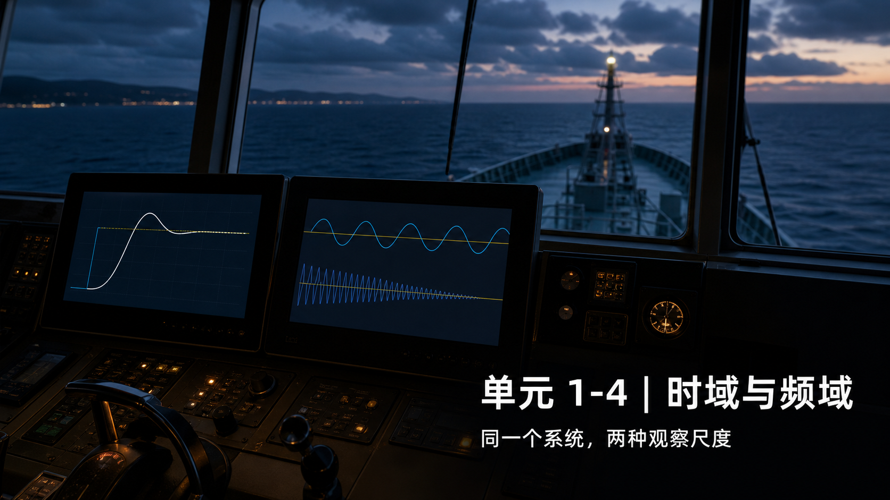
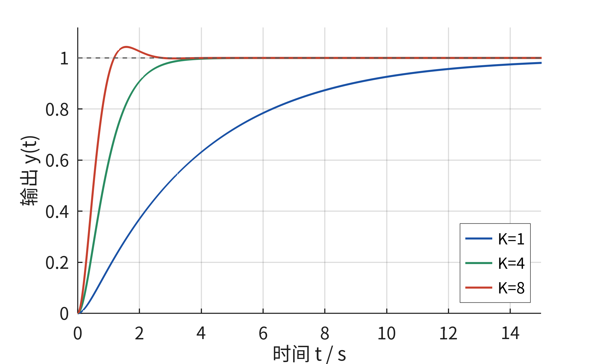
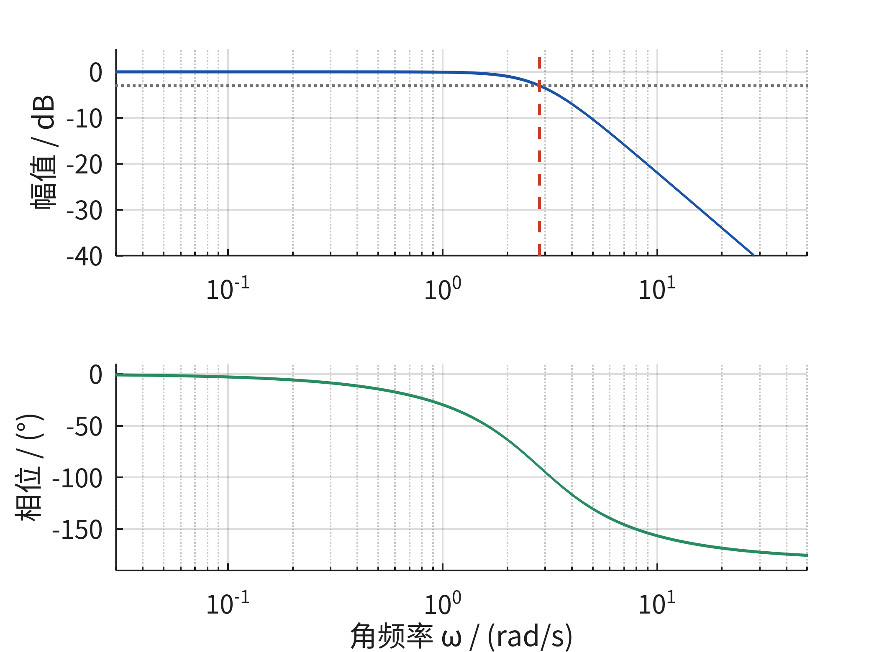
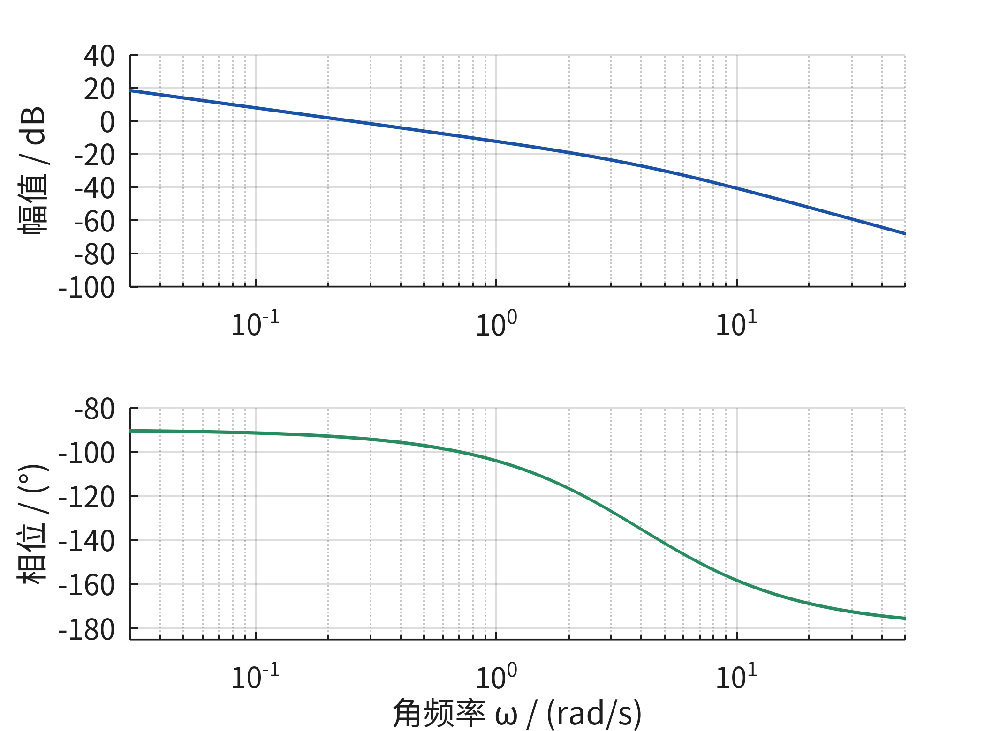
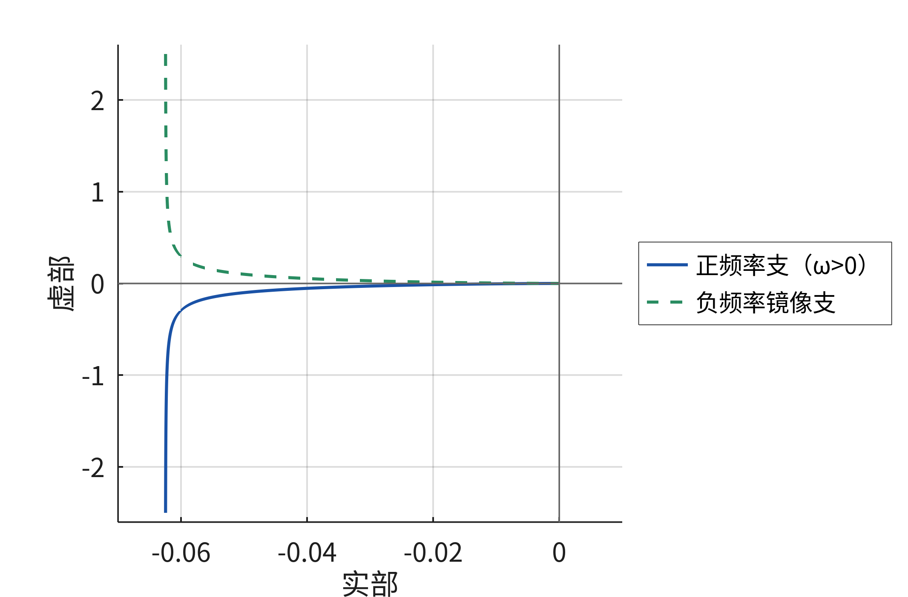
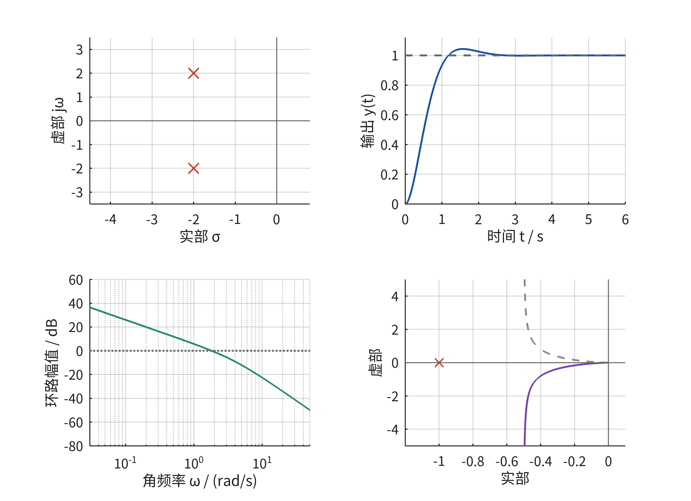
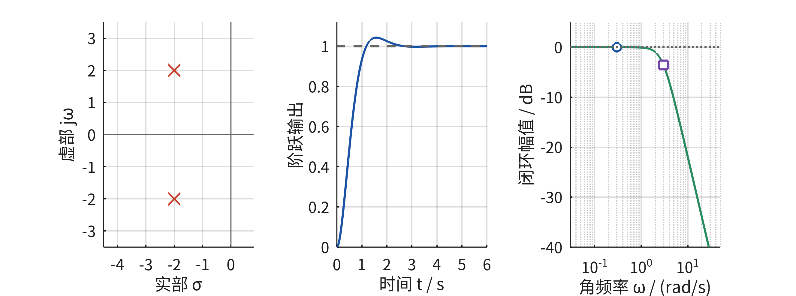
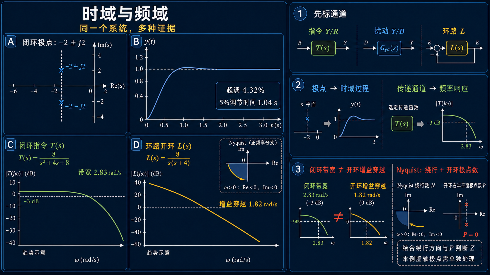

# 单元 1-4 | 时域与频域：同一个系统的两种观察视角



---

## 模块1 导论串讲——控制系统的完整图像

模块1做一件事：在你进入正式推导之前，先让你看见整门课的全貌。五次课，每次从一个不同的角度把控制系统的骨架描一遍。

本模块包含：
- **单元 1-1**：看见整门课——从反馈思想到控制全景
- **单元 1-2**：建模——从真实对象到可分析的系统
- **单元 1-3**：参数变化与极点迁移——根轨迹的第一眼
- **单元 1-4**（本讲）：时域与频域——同一个系统的两种观察视角
- **单元 1-5**：平台初体验——三域联动的第一次亲手操作

到目前为止，我们一直在用"时间轴"看系统——给一个阶跃输入，观察输出如何随时间展开。这是最自然的视角，但它不是唯一的视角。真实系统中的扰动往往带有节律——风浪是周期性的，电网波动有固定频率，机械振动在特定转速下被放大。面对这类问题，"快不快、超不超调"的回答是不够的——你需要知道系统对**不同频率**的输入分别是什么态度。

这一讲引入频域视角。我们不从头推导傅里叶变换，也不学画图规则。我们只做一件事：**把同一个系统放进时域和频域两个窗口，对比看到的景象。** 完成之后，你会拥有三域并置的第一张完整地图——复平面告诉你结构趋势，时域告诉你过程表现，频域告诉你节律敏感性。

---

## 一、同样的系统，不同的视角

设想一套船舶航向控制系统正在工作。驾驶员先发出"右转 $10^\circ$"的指令，几分钟后海浪又开始以近似周期性的方式扰动船体。面对这两个情境，自然会提出两类问题：

- 指令刚发出后，航向角是平稳靠近目标，还是先冲过头再回落？
- 面对慢节律和快节律的扰动，系统是都跟着晃，还是只对其中一类更敏感？

第一类问题关心输出随时间的全过程——这就是**时域**。第二类问题关心系统对不同频率信号的反应差别——这就是**频域**。它们看的是同一个对象，用的却不是同一把尺子。若只盯着一条阶跃响应曲线，就难以直接判断系统面对周期性扰动时的表现；若只谈"某个频率下放大多少、滞后多少"，也无法完整说明指令刚到来时的超调和收敛过程。

这门课建立的核心能力之一，就是**在同一个系统的多张图之间来回翻译**。

完成这次课程后，你应当能够：

- 区分时域问题和频域问题各自在回答什么，说出两类表征分别暴露系统的哪些侧面
- 读懂一张 Bode 图的基本信息：低频段和高频段的幅值趋势，并区分闭环带宽与环路开环增益穿越频率
- 读懂一张 Nyquist 图的基本信息：曲线在实轴和虚轴之间如何展开
- 把同一系统在复平面、时域、Bode 图、Nyquist 图上的四张图并置，说出它们之间的对应关系
- 用 MATLAB/Octave 对同一个对象分别生成时域和频域图，并从中提取第一轮定性判断

---

## 二、时域表征：看过程怎样展开

### 2.1 时域回答什么

当输入发生一次典型变化——比如单位阶跃输入——输出 $y(t)$ 随时间的变化过程称为时域响应。时域表征最直接，因为它几乎就是"系统表现"的可视化。

在时域里，我们最先看到的是这些现象：起步快不快、会不会冲过目标值、振荡是否明显、多久以后可以视为基本稳定。这些观察在模块2中会凝结为超调量、调节时间、上升时间等正式指标——此处我们先用眼睛建立直觉，不背公式。

### 2.2 用同一条船重温时域

以 1-3 中分析过的船舶航向简化模型为例。对象为

$$G_0(s) = \frac{1}{s(s+4)}$$

加上单位负反馈和比例增益 $K$，闭环传递函数为

$$\Phi(s) = \frac{K}{s^2 + 4s + K}$$

在 1-3 中，我们看了 $K=1$（单调慢速）、$K=4$（临界阻尼）、$K=8$（衰减振荡）三种情况。这些观察全部发生在时域——你在看输出随时间展开的一条曲线。生成这条曲线的代码你已经见过：

```matlab
G0 = tf(1, [1 4 0]);                 % 船舶航向简化对象
K = 8;
Phi = feedback(K*G0, 1);             % 闭环传递函数
step(Phi);                            % 时域：阶跃响应
title(sprintf('闭环阶跃响应 K=%d', K));
```

{width=60%}
<p align="center"><strong>图1-4-1 三组增益下的闭环阶跃响应</strong></p>

蓝色 $K=1$ 单调缓慢，绿色 $K=4$ 临界阻尼且保持单调，红色 $K=8$ 先超调约 $4.32\%$ 再收敛。三条曲线分别呈现了时域中的慢速、临界和衰减振荡行为。

时域给你的是"全过程"——你能看到每一秒系统在做什么。但时域不直接告诉你：如果扰动以某个特定频率持续作用，系统会有多敏感。要回答这个问题，需要换一个视角。

---

## 三、频域表征：看系统如何对待不同节律

### 3.1 频域回答什么

对于稳定的线性定常系统，若输入不再是"跳一下就停住"，而是持续摆动——例如 $r(t) = A\sin\omega t$——暂态衰减后，稳态输出仍按同一频率摆动，只是幅度和相位发生了变化：

$$y(t) = B\sin(\omega t + \varphi)$$

这里有两个最基本的频域量：

- **幅值变化**：$B$ 与 $A$ 的比值告诉我们，这个频率的输入是被明显保留还是被明显削弱。若 $B/A \approx 1$，系统几乎"完整跟随"；若 $B/A \ll 1$，系统"几乎不响应"这个频率。
- **相位变化**：$\varphi$ 反映输出相对于输入是提前还是滞后。对于实际控制系统，更常见的是滞后——输出"慢了一拍"。

从直觉上看，低频信号变化缓慢，系统往往更容易跟随；高频信号变化很快，系统往往更难完全跟上，输出幅值减小、相位滞后加重。这种"对不同节律态度不同"的现象，就是频域响应的第一层含义。

### 3.2 频域信息在工程上意味着什么

回到船舶航向控制。若某一频段的周期扰动会进入航向通道，我们真正关心的是**从该扰动作用点到航向输出**的传递函数，而不是任意一张开环曲线。这个传递函数在目标频段的幅值越小，航向摆动通常越弱；若它在某个频段出现峰值，该节律的扰动便可能被明显放大。

因此，频域判断必须先回答一个问题：**正在画的是哪一个输入到哪一个输出的传递函数？** 指令到航向、扰动到航向、测量噪声到航向是不同通道，不能用同一条 Bode 曲线替代。明确通道以后，频域分析才能预判哪些频率容易通过、哪些频率会被抑制。

---

## 四、Bode 图：频域的第一张可视化地图

### 4.1 Bode 图长什么样

把"系统对不同频率的态度"画成图，最常用的工具是 Bode 图。图 1-4-2 选取 $K=8$ 时的闭环指令传递函数

$$T(s)=\frac{Y(s)}{R(s)}=\frac{8}{s^2+4s+8}$$

作为例子。Bode 图由上下两幅子图组成：

- **幅频图**（上）：横轴是频率 $\omega$（对数刻度），纵轴是幅值比（用分贝 dB 表示，$20\log_{10}|G(j\omega)|$）。曲线告诉你——在每个频率上，输出幅值是输入的多少倍。
- **相频图**（下）：横轴同样是频率 $\omega$（对数刻度），纵轴是相位角 $\varphi$（单位：度）。曲线告诉你——在每个频率上，输出滞后（或超前）了多少。

{width=60%}
<p align="center"><strong>图1-4-2 闭环指令响应的幅频与相频特性</strong></p>

上图的低频幅值接近 $0$ dB，说明慢指令几乎等幅传到输出；频率升高后幅值下降。相频曲线则从接近 $0^\circ$ 逐渐转向更大的滞后。对这条闭环曲线，幅值相对低频水平下降 $3$ dB 的频率约为 $2.83\ \mathrm{rad/s}$，可作为闭环带宽的一个常用标志。

### 4.2 怎样"读"Bode 图（不画）

在模块1中，不需要学会画 Bode 图——那是模块2-3的任务。但你需要学会**读**：一眼看过去，能从图中提取几条基本信息。

- **先辨认传递通道**：若画的是闭环指令传递 $T(s)=Y(s)/R(s)$，低频幅值接近 $0$ dB 表示慢指令能够近似等幅跟随；若画的是环路开环 $L(s)$，低频高增益只能通过反馈关系间接说明跟踪和抗扰能力。
- **观察高频趋势**：闭环指令传递在高频远低于 $0$ dB，表示系统不会跟随快速变化的指令。至于某种扰动或噪声是否被抑制，仍需查看它到输出的专用传递函数。
- **区分两个频率标志**：闭环曲线常用相对低频水平的 $-3$ dB 点描述带宽；环路开环曲线与 $0$ dB 相交的位置称为**增益穿越频率**。两者相关，但不是同一个定义。

### 4.3 用代码看一眼 Bode 图

对 1-3 中的船舶对象，一行代码就能看到它的开环 Bode 图：

```matlab
G0 = tf(1, [1 4 0]);       % 船舶航向简化对象
bode(G0);                   % 绘制 Bode 图：幅频 + 相频
grid on;
```

{width=60%}
<p align="center"><strong>图1-4-3 对象 $G_0(s)=1/[s(s+4)]$ 的开环 Bode 图</strong></p>

幅频曲线在低频已经下降，这是原点积分环节 $1/s$ 的特征；经过 $4\ \mathrm{rad/s}$ 附近后，惯性环节 $1/(s+4)$ 进一步增加高频衰减。相位也从低频附近的 $-90^\circ$ 逐渐趋近 $-180^\circ$。

把 $K=1$、$4$、$8$ 三条环路开环 Bode 图叠在一起看：

```matlab
K_vals = [1 4 8];
figure; hold on;
for K = K_vals
    bode(K*G0);             % 不同增益下的环路开环 Bode 图
end
legend('K=1', 'K=4', 'K=8');
```

你会发现：增大 $K$ 让环路开环幅频曲线整体上移，而相频曲线不变；$0$ dB 增益穿越频率随之右移。对本例，$K=8$ 时增益穿越频率约为 $1.82\ \mathrm{rad/s}$。闭环通常因此获得更宽的指令响应频带，但相位滞后也会在新的穿越位置参与稳定性权衡。

---

## 五、Nyquist 图：频域的另一种视角

### 5.1 Nyquist 图与 Bode 图有什么不同

Bode 图把幅值和相位拆成两张图，横轴是频率。Nyquist 图换了一个组织方式：**把幅值和相位合在一起，画在复平面上**。

具体来说，对每个频率 $\omega$，计算 $G(j\omega)$——这是一个复数，包含模 $|G(j\omega)|$（离原点的距离）和相位 $\angle G(j\omega)$（与正实轴的夹角）。把这些点按频率顺序连起来，就得到频率响应轨迹。实系数系统的负频率部分与正频率部分关于实轴共轭对称；完整 Nyquist 图还需要按照规定的复平面围线处理极点等细节。

- Bode 图告诉你：**"在哪个频率上，发生了什么"**——频率是显式的横坐标。
- Nyquist 图告诉你：**"整个频率范围内，系统的复增益在复平面上走过了怎样一条轨迹"**——频率是隐式的参数，沿曲线标注。

两张图包含的是**同一套信息**，只是组织方式不同。Bode 图更适合定量读数和逐频段分析；Nyquist 图更适合做全局判断——比如系统离失稳还有多远、反馈回路中是否存在危险的频率点。

### 5.2 怎样"读"Nyquist 图（不画）

对模块1而言，你只需要从 Nyquist 图上读三件事：

1. **曲线的起点**（$\omega \to 0$）：离原点有多远、从哪个角度出发——这反映了系统在极低频率下的行为（有没有积分环节、几个积分环节）。
2. **曲线的终点**（$\omega \to \infty$）：对严格真有理系统通常趋近原点，表示高频幅值趋近零。
3. **曲线相对于临界点 $(-1,0)$ 的位置**：后续的 Nyquist 判据会把曲线绕临界点的方式与开环右半平面极点数一起使用。仅凭某一点到 $(-1,0)$ 的直线距离，不能独立给出稳定结论。

{width=60%}
<p align="center"><strong>图1-4-4 对象 $G_0(s)=1/[s(s+4)]$ 的频率响应轨迹</strong></p>

对 $\omega>0$，有

$$G_0(j\omega)=-\frac{1}{\omega^2+16}-j\frac{4}{\omega(\omega^2+16)}$$

因此正频率支的实部和虚部都为负，始终位于第三象限，并从低频处向原点逼近；负频率支关于实轴镜像，位于第二象限。由于 $G_0(s)$ 在原点有极点，图中只用于展示频率响应分支，不在此据它直接执行完整 Nyquist 稳定判定。

### 5.3 用代码生成 Nyquist 图

```matlab
G0 = tf(1, [1 4 0]);       % 船舶航向简化对象
nyquist(G0);                % 绘制 Nyquist 图
grid on;
```

把不同增益下的 Nyquist 图叠在一起，你会看到增益增大让整条曲线向外膨胀——曲线离原点更远，意味着每个频率上的幅值响应都增大了：

```matlab
K_vals = [1 4 8];
figure; hold on;
for K = K_vals
    nyquist(K*G0);
end
legend('K=1', 'K=4', 'K=8');
```

---

## 六、四图并置：同一系统的四种阅读方式

现在把同一个系统放进四个窗口，并排观察。以 $G_0(s)=1/[s(s+4)]$ 在 $K=8$ 的单位反馈闭环为例。

<p align="center"><strong>表 1-4-1 同一系统的四种阅读方式（$K=8$）</strong></p>

| 窗口 | 图类型 | 我们看什么 | 本例中看到的信息 |
|------|------|------|------|
| **复平面** | 极点分布图 | 结构趋势——极点在什么位置 | 闭环极点 $-2 \pm j2$：左半平面，已离开实轴，预示振荡收敛 |
| **时域** | 阶跃响应 | 过程表现——输出如何随时间展开 | 超调约 $4.32\%$，5% 调节时间约 $1.04$ s |
| **频域（Bode）** | 幅频 + 相频 | 节律敏感性——不同频率的通过能力 | 环路开环增益穿越频率约 $1.82\ \mathrm{rad/s}$；闭环指令带宽约 $2.83\ \mathrm{rad/s}$ |
| **频域（Nyquist）** | 复增益轨迹 | 幅值与相位如何随频率共同变化 | 正频率支位于第三象限；完整稳定判断还需结合临界点绕行与开环极点 |

这四张图来自同一个反馈系统。复平面上的极点 $-2 \pm j2$ 直接解释了时域中约 $\pi$ s 的衰减振荡周期；阶跃响应、闭环带宽与环路开环增益穿越频率则从不同通道和不同角度反映系统动态。它们受同一组系统参数影响，但不存在脱离模型的一一换算关系。此处需要建立的意识是：**先确认所画传递通道，再综合多张图下结论。**

{width=90%}
<p align="center"><strong>图1-4-5 同一反馈系统的四个观察窗口</strong></p>

左上和右上读取闭环系统：极点 $-2\pm j2$ 与带少量超调的阶跃响应彼此印证。左下和右下读取环路开环 $L(s)=8G_0(s)$：一张保留显式频率坐标，另一张把相同的复增益信息画在复平面上。

用代码生成这四张图：

```matlab
G0 = tf(1, [1 4 0]);                 % 对象
K = 8;

% 左上：复平面——闭环极点
figure(1);
Phi = feedback(K*G0, 1);
pzmap(Phi);                          % 极点-零点图
title(sprintf('复平面：闭环极点 K=%d', K));

% 右上：时域——阶跃响应
figure(2);
step(Phi);
title(sprintf('时域：闭环阶跃响应 K=%d', K));

% 左下：频域 Bode——环路开环
figure(3);
bode(K*G0); grid on;
title(sprintf('频域 Bode：环路开环 K=%d', K));

% 右下：频域 Nyquist——环路开环
figure(4);
nyquist(K*G0); grid on;
title(sprintf('频域 Nyquist：环路开环 K=%d', K));
```

这里有一个细节值得注意：复平面和时域看的是**闭环**系统（$\Phi(s)$），而用于稳定性分析的 Bode 图和 Nyquist 图通常画**环路开环**（$KG_0(s)$）。环路开环频率特性与反馈闭环特征方程 $1+KG_0(s)=0$ 相联系，因此可以用于判断闭环稳定性和稳定裕度；若要直接读取指令跟随或某个扰动通道的幅值，则应改画相应的闭环传递函数，不能把环路开环幅值直接当作输出幅值。

---

## 七、例题：从多域数据中还原系统的完整画像

### 例题 1-4-1 从三域证据拼出系统特征

某个无零点的标准二阶闭环系统为

$$T_e(s)=\frac{0.64}{s^2+0.88s+0.64}$$

数值测试得到：

- 单位阶跃输入下，输出超调约为 $12.63\%$，约 $6.62$ s 后进入并保持在 $\pm 5\%$ 误差带内；
- 对输入 $r_1(t) = \sin(0.2t)$，稳态输出近似为 $y_1(t) = 1.024\sin(0.2t - 16.35^\circ)$；
- 对输入 $r_2(t) = \sin(4t)$，稳态输出近似为 $y_2(t) = 0.0406\sin(4t - 167.09^\circ)$。

请回答：

1. 哪个输入频率更容易被系统跟随？给出判断依据。
2. 上述三条信息中，哪些属于时域观察，哪些属于频域观察？
3. 若外界扰动的节律继续加快（$\omega > 4$ rad/s），系统输出摆动幅值大概率会变大还是变小？
4. 阶跃响应超调 $12\%$ 和频域中 $\omega=4$ 时约 $167.09^\circ$ 的滞后之间，是否可能存在联系？用一句话给出你的直觉判断。

**解**

**（1）** $r_1(t) = \sin(0.2t)$ 更容易被跟随。输出幅值约为输入的 $1.024$ 倍，相位滞后约 $16.35^\circ$，说明该慢节律基本通过。相比之下，$r_2(t) = \sin(4t)$ 的输出幅值只剩输入的约 $4.06\%$，且相位接近反相，该频率被明显削弱。

**（2）** "超调约 $12\%$、约 $6$ s 后稳定"属于时域观察——它描述的是输出随时间展开的过程。两条正弦测试结果属于频域观察——它们比较的是系统对不同频率输入的幅值和相位响应。

**（3）** 对本题给出的严格真有理二阶系统，频率继续加快时，输出幅值会继续趋近于零。这个判断来自 $T_e(s)$ 的分母次数比分子高两阶；不能把它无条件推广到任意传递函数。

**（4）** 存在共同的结构来源：同一对共轭闭环极点既造成阶跃响应超调，也使频率响应在自然频率附近出现幅值和相位的快速变化。但单个频率点不能独立确定超调量，仍需结合完整模型或完整频率曲线。

验证代码：

```matlab
G = tf(0.64, [1 0.88 0.64]);

% 时域验证
step(G);
% 超调约 12.63%，5% 调节时间约 6.62s

% 频域验证
[mag, phase, w] = bode(G, {0.2, 4});
% w=0.2: mag≈1.024, phase≈-16.35°
% w=4:   mag≈0.0406, phase≈-167.09°
```

### 例题 1-4-2 Bode 图与 Nyquist 图的"翻译"

对 $G_0(s) = 1/[s(s+4)]$，在 Bode 图上读出 $\omega=2$ rad/s 处的幅值和相位，然后在 Nyquist 图上找到对应的点——验证同一个频率在两张图上的信息是否一致。

**解**

$\omega=2$ 时，$G_0(j2) = \frac{1}{j2(j2+4)} = \frac{1}{j2(4+j2)} = \frac{1}{-4 + j8}$。

计算模和相位：$|G_0(j2)| = \frac{1}{\sqrt{(-4)^2 + 8^2}} = \frac{1}{\sqrt{80}} \approx 0.112$，对应 $20\log_{10}(0.112) \approx -19$ dB。相位 $\angle G_0(j2) = -\angle(-4+j8) = -\left(180^\circ - \arctan(8/4)\right) = -(180^\circ - 63.4^\circ) \approx -116.6^\circ$。

在 Bode 图上：$\omega=2$ 处幅值约 $-19$ dB，相位约 $-117^\circ$。在 Nyquist 图上：$\omega=2$ 对应的点距原点约 $0.112$，与正实轴夹角约 $-117^\circ$。两张图说的是同一件事——这就是"同一个信息、两种组织方式"的含义。

---

## 八、案例：船舶航向控制的三域联读

回到贯穿模块1的船舶航向控制。某闭环系统在 $K=8$ 的单位反馈下，前序观察中已经知道闭环极点为 $-2 \pm j2$——这是从 1-3 带来的结论。现在补上频域测试，形成三域联读。

<p align="center"><strong>表 1-4-2 船舶航向控制的三域联读（$K=8$）</strong></p>

| 观察方式 | 具体测试 | 现象 | 说明 |
|------|------|------|------|
| 复平面 | 闭环极点分布 | $-2 \pm j2$，左半平面，虚部明显 | 结构层面预示振荡收敛 |
| 时域 | 阶跃指令：航向 $0^\circ \to 10^\circ$ | 超调约 $4.32\%$，5% 调节时间约 $1.04$ s | 过程层面验证了极点预判 |
| 频域（慢） | 闭环指令通道 $T(j0.3)$ | 幅值比约 $1.000$，相位约 $-8.63^\circ$ | 慢指令近似等幅跟随 |
| 频域（快） | 闭环指令通道 $T(j3)$ | 幅值比约 $0.664$，相位约 $-94.76^\circ$ | 较快指令被削弱且滞后明显 |

把四项合起来看，得到一条完整的判断链：

- **复平面**告诉我们，系统具备振荡模态，但振荡会收敛（实部为负）；
- **时域**告诉我们，这个振荡模态已经在阶跃响应中表现为约 $4.32\%$ 的超调和约 $\pi$ s 周期的摆动；
- **频域**告诉我们，在低频慢变指令下系统表现良好，但当频率升高到 3 rad/s 附近时，跟随能力显著下降。

{width=90%}
<p align="center"><strong>图1-4-6 航向闭环的复平面、时域与频域证据</strong></p>

左图给出闭环极点，中图给出同一闭环的阶跃响应，右图给出闭环指令传递 $T(s)$ 的幅频曲线，并标出 $0.3$ 与 $3\ \mathrm{rad/s}$ 两个测试点。三张图始终围绕同一个闭环系统，避免把环路开环幅值误当成指令输出幅值。

这个案例的结论不是数值，而是一个习惯：**工程上真正可靠的判断，来自多种证据的互相支撑。** 在后续课程中，你会反复练习这种"三域联读"——看到一张图上的异常，立刻去另外两张图上找对应证据。

---

## 九、分层练习

### 基础题 •

**1. 识别归类。** 下面三句话分别更接近复平面、时域还是频域的表述？
- （a）"主导极点向左移动后，系统收敛得更快。"
- （b）"对周期为 $200$ s 的扰动，输出几乎跟着一起摆动。"
- （c）"阶跃响应有明显超调，但最终能够稳定下来。"

请写出分类，并用一句话说明理由。

**2. Bode 图读图。** 观察图 1-4-2 中闭环指令传递 $T(s)=8/(s^2+4s+8)$ 的 Bode 图，回答：
- （a）低频段（$\omega \to 0$）的幅值约在什么水平？这说明系统对慢速输入的态度是什么？
- （b）高频段（$\omega \to \infty$）的幅值呈什么趋势？这说明系统对快速指令的跟随能力如何？
- （c）相对低频水平下降 $3$ dB 的闭环带宽大致在什么位置？它与环路开环的 $0$ dB 增益穿越频率是不是同一个定义？

**3. 代码验证。** 取 $G_0(s)=1/[s(s+4)]$，在 MATLAB/Octave 中完成：
- （a）对 $K=4$ 构造单位反馈闭环，用 `step()` 画出阶跃响应；
- （b）用 `bode(K*G0)` 和 `nyquist(K*G0)` 分别画出环路开环的 Bode 图和 Nyquist 图；
- （c）观察闭环极点（`pole(Phi)`）与时域行为之间的对应关系。

### 进阶题 ••

**4. 比较判断。** 已知系统 A 的指令阶跃响应更快，但超调较大；系统 B 的指令响应较慢，而从高频扰动作用点到输出的传递幅值更小。若任务规范把平稳性和高频抗扰放在首位，应优先考虑哪套表现？若任务规范改为优先快速转向，判断重点会怎样变化？请分别给出选择和理由，并说明还缺少哪些信息才能作最终设计决定。

**5. 从频域反推时域。** 某个无零点、单位静态增益的标准二阶闭环系统，其 Bode 幅频曲线在 $\omega_r\approx5\ \mathrm{rad/s}$ 处出现约 $+3$ dB 的共振峰。请判断阶跃响应是否会有明显超调，并估算超调量。可使用

$$M_r=\frac{1}{2\zeta\sqrt{1-\zeta^2}},\qquad M_p=e^{-\pi\zeta/\sqrt{1-\zeta^2}}$$

其中 $M_r$ 使用幅值比而不是 dB。最后说明：若系统含有零点或高阶动态，为什么不能照搬这个换算？

### 挑战题 •••

**6. 四图并置分析。** 对 $G_0(s)=1/[s(s+4)]$，分别取 $K=2$ 和 $K=8$。对每种情况，按第六节的格式生成四张图（复平面极点、阶跃响应、Bode、Nyquist），并排比较。请回答：
- （a）$K$ 从 2 增大到 8，四张图各自发生了什么变化？
- （b）这些变化之间，哪些是**互相印证**的（一张图上的变化解释了另一张图上的现象）？写出至少两组。
- （c）如果任务只关注指令瞬态，你会优先保留哪张图？若还要判断不同频率下的跟随与稳定性趋势，第二张应补充什么？

**7. 工程场景判断。** 假设某姿态控制任务给出如下设计频段：指令主要位于 $0$–$1.3\ \mathrm{rad/s}$，阵风扰动主要位于 $3$–$30\ \mathrm{rad/s}$。分别记指令到姿态输出的闭环传递为 $T_r(s)=Y(s)/R(s)$，阵风作用点到姿态输出的传递为 $T_d(s)=Y(s)/D(s)$。
- （a）希望 $|T_r(j\omega)|$ 在指令频段呈现什么特征？希望 $|T_d(j\omega)|$ 在扰动频段呈现什么特征？
- （b）仅凭本讲建立的频域直觉，哪个频率区间最可能成为两种要求之间的过渡区？为什么不能用一条未注明输入输出通道的“系统 Bode 图”同时回答两个问题？

---

## 十、总结与扩展思考

这一讲的收获不是公式，而是一张新的认知地图：**同一个系统可以、也应该从多个角度被阅读。**

三个判断值得带走：

**时域看过程，频域看节律。** 阶跃响应告诉你系统对"一次突然变化"的完整反应——快不快、冲不冲、稳不稳。频域告诉你系统对"持续周期性变化"的敏感程度——哪些频率容易通过，哪些频率被抑制。两种信息互补，缺一不可。

**三域互相印证，不要单看一张图下结论。** 复平面上的闭环极点位置直接决定自然响应中各模态的振荡频率和衰减速度；选定传递通道的频率响应则显示该输入在不同频率下如何传到输出。时域指标与频域指标共同受系统参数影响，但不能脱离具体模型直接互换。当你在后续课程中学到正式的分析和设计方法时，这种“先标通道、再多图联读”的习惯会帮助你发现矛盾并定位原因。

**对同一个传递函数，Bode 和 Nyquist 是同一套频率响应信息的两种组织方式。** Bode 把频率作为显式坐标，适合逐频段读取和定量分析；Nyquist 把频率作为隐式参数，以复平面轨迹同时呈现幅值与相位。用于反馈稳定性判断时，还必须结合完整 Nyquist 轮廓与开环极点信息。两张图会反复出现在模块 2 到模块 4 的学习中。

**扩展思考。** 如果两套系统的阶跃响应看起来都"能用"，但其中一套在周期性扰动下明显更容易被带着晃动，我们还会认为它们的性能相同吗？请用"过程表现"和"节律敏感性"这两组词，写出你自己的判断标准。模块4中讨论控制器选型时，会回到这个问题——届时你会看到，不同应用场景对"好"的定义可以完全不同。

---

## 附录：习题简答

**习题 1**：（a）复平面——"主导极点""向左移动"是极点在复平面上的位置变化。（b）频域——"周期为 200 s 的扰动"本质上是一个频率极低的输入，讨论的是系统对特定频率的响应。（c）时域——"阶跃响应""超调"是时域过程描述。

**习题 2**：（a）$T(0)=1$，所以低频幅值接近 $0$ dB，表示慢指令近似等幅传到输出。（b）高频幅值趋近于零，即 dB 值持续下降，表示闭环不会跟随快速指令；这条曲线本身不能直接回答任意扰动或测量噪声是否被抑制。（c）图中的 $-3$ dB 闭环带宽约为 $2.83\ \mathrm{rad/s}$。它描述闭环指令响应，而环路开环 $L(s)$ 的增益穿越频率由 $|L(j\omega)|=1$ 定义；两者相关但定义不同。

**习题 3**：运行代码后，$K=4$ 时闭环极点为重极点 $-2$，阶跃响应单调无超调，5% 调节时间约为 $2.37$ s。Bode 图与 Nyquist 图画的是环路开环 $L(s)=4G_0(s)$：前者显式给出各频率的幅值和相位，后者把相同复增益画在复平面上。由于 $L(s)$ 在原点有极点，不能仅凭图上某一点到 $(-1,0)$ 的距离完成严格稳定判断。

**习题 4**：若任务规范优先平稳性与高频抗扰，应先考虑系统 B；若任务规范优先快速转向，可先考虑系统 A。但这只是候选排序，最终选择还要比较超调上限、允许调节时间、扰动作用点、执行器带宽与限幅、模型不确定性以及稳定裕度等信息。题目说明的是多指标权衡，不是“快”或“抗扰”可以单独决定优劣。

**习题 5**：$+3$ dB 对应 $M_r=10^{3/20}\approx1.413$。代入标准二阶共振峰公式，取 $0<\zeta<1/\sqrt{2}$ 的解，得到 $\zeta\approx0.383$。再代入超调公式，得到 $M_p\approx27.16\%$，因此阶跃响应会有明显超调。这个定量换算依赖“无零点、单位静态增益、标准二阶闭环”三项前提；零点和高阶模态都可能改变频率峰值与阶跃超调之间的关系，此时必须回到完整传递函数计算。

**习题 6**：（a）$K=2$ 时闭环极点约为 $-0.59$ 和 $-3.41$，阶跃响应单调；$K=8$ 时闭环极点为 $-2\pm j2$，阶跃响应出现 $4.32\%$ 超调。环路开环 Bode 幅频曲线上移约 $20\log_{10}(8/2)=12.04$ dB，增益穿越频率由约 $0.50$ 移至 $1.82\ \mathrm{rad/s}$；Nyquist 频率响应轨迹按增益比例向外缩放。（b）印证组 1：极点由实轴进入复平面，对应阶跃响应由单调转为衰减振荡。印证组 2：环路增益提高、穿越频率右移，对应闭环指令响应频带扩大，同时新的穿越位置具有更大的相位滞后，解释了振荡倾向增强。（c）若任务只关注指令瞬态，优先保留阶跃响应；若还要判断不同频率的幅值、相位与反馈稳定性趋势，应补充标明通道的 Bode 图。Nyquist 图适合后续结合完整判据做全局稳定分析，但不能只凭“看起来离 $(-1,0)$ 多远”给结论。

**习题 7**：（a）在 $0$–$1.3\ \mathrm{rad/s}$ 指令频段，希望 $|T_r(j\omega)|$ 接近 $1$（约 $0$ dB）且相位滞后较小；在 $3$–$30\ \mathrm{rad/s}$ 扰动频段，希望 $|T_d(j\omega)|$ 尽可能小。（b）$1.3$–$3\ \mathrm{rad/s}$ 是两类任务之间的过渡区，闭环动态、执行器能力和滤波结构会在这里形成权衡。$T_r$ 与 $T_d$ 的输入定义不同，通常也不是同一个传递函数；不注明输入输出通道的“系统 Bode 图”无法同时证明指令跟随和阵风抑制。

---


