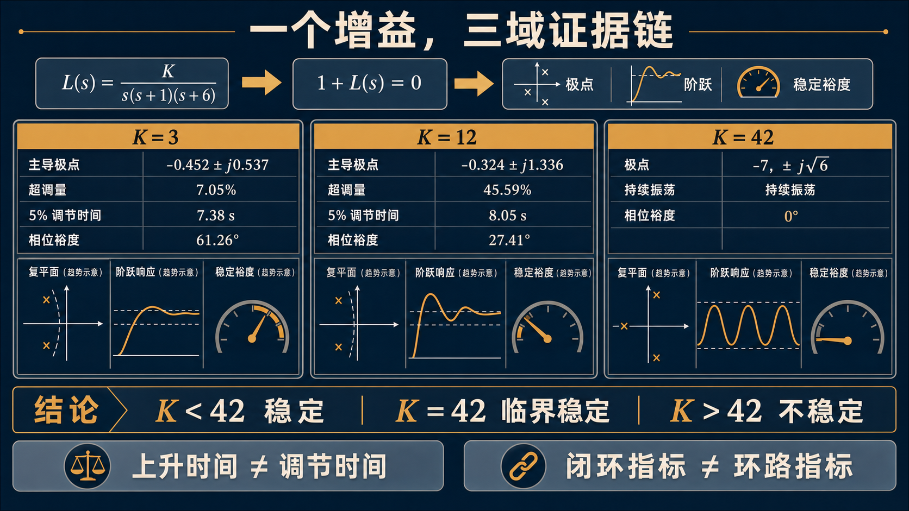

# 单元 1-5 | 平台初体验与三域联动探索

## 课次信息

- 课程：自动控制原理
- 单元编号：1-5
- 层次：模块1 实践收束课
- 课型：实践
- 学时：90分钟
- 知识类型：[X] 跨域型
- 前置知识：已完成课程总图建立，已形成模型与极点、根轨迹与时域响应、时域与频域响应的第一轮直觉联系
- 讲义定位：这份讲义将引导我们在平台上把同一控制对象的复平面、时域和频域观察连成一条判断链，完成第一次结构化的三域联动表达
- 后续：模块2会把这里看到的模型对象、时域对象和频域对象进一步正式化

{fig-pos="H" width=100%}

---

## 一、问题引入：同一个参数，为什么会牵动三张图

平台打开后，我们会同时看到根轨迹图、阶跃响应图和 Bode 图。它们看上去属于三个不同的世界：一张图落在复平面上，一张图落在时间轴上，另一张图落在频率轴上。若我们只拖动一个参数 $K$，这三张图却会同步发生变化。

这个现象正是自动控制原理最重要的直觉入口之一。控制系统并不是在三个彼此隔绝的领域里分别运行，而是在同一个闭环系统中，以三种表征方式呈现同一组变化。极点位置改变，响应曲线会跟着改变；稳定余量改变，时域振荡程度也会随之改变。平台的价值，在于把这种联动关系第一次直接摆到我们面前。

因此，我们进入平台时最值得追问的问题并不是“哪张图更重要”，而是“同一条证据链如何在三张图中同时出现”。只要把这个问题看清，模块1前四次课建立的课程地图就不再停留在分散的概念上，而会落到可观察、可比较、可表达的对象上。

## 二、前置知识缺口与能力目标

前面的速通已经让我们分别见过三类现象：极点位置会影响系统行为，参数变化会带来根轨迹迁移，系统的稳定余量还可以从频域图上读取。当前仍有一块明显缺口：这些结论大多分散出现，我们尚未在同一个对象上把它们接成一条完整判断链。

完成这次平台探索后，我们应能做到以下几件事：

1. 看到根轨迹中的闭环极点迁移时，能够同时联想到阶跃响应和稳定余量会怎样变化。
2. 在平台上辨认“稳定区、接近边界区、临界稳定点”三种状态，并说出各自的三域证据。
3. 用一张三域对照表整理观察结果，而不是只记住零散印象。
4. 用一段简洁文字说明：当增益继续增大时，系统为何会从“响应更快”走向“振荡更强、余量更小，最终逼近失稳”。

这些能力只要求我们形成第一轮结构化观察，不要求在这里完成正式推导或复杂判据计算。

## 三、原理主线讲解

### 3.1 三面板看的是同一个闭环对象

本次平台体验采用的开环对象为

$$
G_o(s)=\frac{K}{s(s+1)(s+6)},\qquad K>0
$$

在单位负反馈下，闭环特征方程可写为

$$
s^3+7s^2+6s+K=0
$$

这里的 $K$ 是唯一连续可调的参数。我们每调一次 $K$，并不是分别改动三张图，而是在改动同一个闭环系统；三张图只是从不同角度报告这次改动带来的结果。

表1. 三面板中的直接证据

| 面板 | 我们直接看到什么 | 它回答的问题 |
| --- | --- | --- |
| 根轨迹图 | 闭环极点在复平面中的位置与迁移方向 | 系统离稳定边界有多远 |
| 阶跃响应图 | 超调、振荡、收敛速度 | 系统在时间上表现得是否平稳 |
| Bode 图 | 截止频率附近的幅值变化与相位裕度 | 系统还保留多少稳定余量 |

### 3.2 一个增益如何牵动三域

当 $K$ 从较小值逐步增大时，根轨迹上的共轭极点会沿分支向虚轴靠近。极点实部的绝对值减小，意味着阻尼减弱，时域响应中的超调量通常增大，振荡更加明显，调节过程也更难快速结束。与此同时，Bode 图的幅频曲线整体上移，截止频率向更高频率移动，相位裕度逐步减小。

这三种变化并不是巧合，而是同一件事情的三种表述：

1. 复平面上，主导极点更靠近虚轴。
2. 时域中，系统更容易冲过目标值并产生长时间振荡。
3. 频域中，系统在截止频率处留下的相位余量更少。

因此，“增益增大”不能只被理解成“系统更快”。更准确的说法是：起步可能更快，但稳定余量同时被压缩，系统会朝着更强振荡甚至失稳的方向移动。

### 3.3 临界边界的第一次可见化

平台最值得反复观察的位置，是系统从稳定走向失稳的临界点。对当前对象而言，当 $K \approx 42$ 时，闭环共轭极点到达虚轴附近，系统进入临界稳定状态。此时三域会同时给出非常鲜明的信号：

1. 根轨迹图中，共轭极点贴近虚轴。
2. 阶跃响应不再明显收敛，而呈现近似等幅振荡。
3. Bode 图中，相位裕度逼近 $0^\circ$。

这一点是整次体验的核心锚点。它告诉我们，稳定边界并非抽象口号，而是可以在三张图中被同时看见的临界状态。

### 3.4 如何组织平台观察

进入平台后，我们适合按“低增益、中增益、接近临界、临界附近”四个区段逐步观察，而不必一开始就在图上来回拖动。较稳妥的观察顺序是先固定几个代表性增益值，例如 $K=3,\ 12,\ 24,\ 36$，最后再把视线推进到 $K\approx 42$ 的临界附近。

每次观察都应回答同一组问题：

1. 闭环主导极点向哪个方向移动了？
2. 阶跃响应的超调和收敛速度如何变化？
3. 相位裕度是在增大还是减小？
4. 这三条变化是否互相支持，能否组成同一条判断链？

只要坚持这四个问题，平台操作就不会停留在“拖动滑块”和“看图热闹”上，而会转化为真正的跨域观察。

## 四、锚点案例：三阶无零点对象的三域联动观察

下面把同一对象在几个代表性增益下的观察结果并排整理。这里的数值用于建立联动直觉，我们更关心变化趋势以及三域证据之间是否一致。

表2. 代表性增益下的三域对照

| 增益 $K$ | 主导极点近似位置 | 超调量 $M_p$ | 调节时间 $t_s$ | 相位裕度 | 三域判断 |
| --- | --- | --- | --- | --- | --- |
| 3 | $-0.452 \pm j0.537$ | $7.1\%$ | $8.74\,\mathrm{s}$ | $61.3^\circ$ | 稳定余量充足，响应较平稳 |
| 12 | $-0.324 \pm j1.336$ | $45.6\%$ | $12.24\,\mathrm{s}$ | $27.4^\circ$ | 振荡明显，余量已显著缩小 |
| 24 | $-0.180 \pm j1.893$ | $71.3\%$ | $20.46\,\mathrm{s}$ | $11.6^\circ$ | 已接近稳定边界 |
| 36 | $-0.056 \pm j2.286$ | $87.8\%$ | $68.9\,\mathrm{s}$ | $3.1^\circ$ | 几乎失稳，只剩极小余量 |
| 42 | $\pm j2.449$ | 近似等幅振荡 | 不再有限 | $0^\circ$ | 临界稳定点 |

这组数据揭示出一条非常清楚的主线：随着 $K$ 增大，系统先表现为“上升更快”，随后很快暴露出“超调更大、振荡更强、调节更慢、相位裕度更小”的代价。我们若只盯住响应起步速度，很容易误判系统在“变好”；把三域证据并列起来，才会看到系统其实在逼近稳定边界。

## 五、最小例题：为什么 $K=36$ 比 $K=12$ 更接近失稳边界

### 题目陈述

平台上给出两组观察结果：

- 当 $K=12$ 时，主导极点约为 $-0.324 \pm j1.336$，超调量约为 $45.6\%$，相位裕度约为 $27.4^\circ$。
- 当 $K=36$ 时，主导极点约为 $-0.056 \pm j2.286$，超调量约为 $87.8\%$，相位裕度约为 $3.1^\circ$。

试判断哪一组更接近失稳边界，并说明理由。

### 解题思路

我们按“复平面位置 → 时域表现 → 频域余量”的顺序依次判断。只要三条证据指向同一方向，结论就可靠。

### 详细求解

1. 从复平面看，$K=36$ 时主导极点的实部只有 $-0.056$，比 $K=12$ 时更接近虚轴，说明系统距离稳定边界更近。
2. 从时域看，$K=36$ 的超调量接近 $88\%$，远大于 $K=12$ 的约 $46\%$；同时它的调节时间显著变长，说明振荡衰减已经非常困难。
3. 从频域看，$K=36$ 的相位裕度只剩约 $3.1^\circ$，而 $K=12$ 仍有约 $27.4^\circ$。相位裕度越小，稳定余量越小。

三条证据完全一致，因此 $K=36$ 明显比 $K=12$ 更接近失稳边界。

### 结论与工程意义

增益继续增大，并不会单纯换来“更快”。当系统的主导极点逼近虚轴时，响应品质会迅速恶化，稳定余量也会同时缩小。三域联动观察的意义，就在于让我们不再被单一指标误导。

## 六、分层练习

### 练习1：复述型

用自己的话分别说明根轨迹图、阶跃响应图和 Bode 图各自提供了什么证据，并写出一句总括：为什么它们能够共同描述同一个闭环系统。

### 练习2：判断型

某次平台观察得到如下结果：闭环主导极点约为 $-0.08 \pm j2.20$，阶跃响应出现大幅振荡且长时间难以收敛，相位裕度约为 $5^\circ$。判断该系统处于“稳定余量充足、接近稳定边界、已经失稳”中的哪一类，并说明三域证据如何互相支持。

### 练习3：迁移型

另一个对象在增大开环增益后，幅频曲线整体上移，截止频率右移，而相频曲线形状几乎不变。仅依据这一现象，我们应预期根轨迹中的主导极点将向哪里移动，时域响应中的超调和稳定余量又会朝什么方向变化？请写出一条完整的跨域判断链。

## 七、边缘情况：为什么幅频曲线上移时，相频曲线往往变化不大

平台里还有一个容易引起误解的现象：增大 $K$ 后，幅频曲线会明显上移，但相频曲线的形状往往几乎不变。原因并不复杂。对这类对象而言，纯增益主要改变系统对各频率分量的放大倍数，却不直接改变由极点结构决定的相位分布形式。相位裕度之所以仍会减小，是因为截止频率换了位置，我们改在更高频率处读取相位差。

这个现象提醒我们，频域中的“曲线形状变化”和“读数位置变化”需要分开看。只要把两者混在一起，就容易得出错误判断。

## 八、总结与扩展思考

1. 平台中的三面板并不是三套彼此独立的结论，而是同一个闭环对象在复平面、时间域和频域中的三种呈现。
2. 增益增大后，主导极点向虚轴靠近，超调量通常增大，相位裕度通常减小，三域证据应当彼此对应。
3. 当 $K$ 逼近临界值时，根轨迹、阶跃响应和 Bode 图会同时给出“接近边界”的信号。
4. 三域对照表的价值，在于把零散观察整理成可复述、可判断、可迁移的证据链。

扩展思考：

若我们把“更快一些”与“更稳一些”同时作为目标，仅靠继续增大 $K$ 往往无法兼顾二者。接下来的学习会把今天的观察直觉进一步写成正式对象与分析语言，回答“我们究竟该调什么、怎样调、为什么这样调”。

{fig-pos="H" width=100%}
