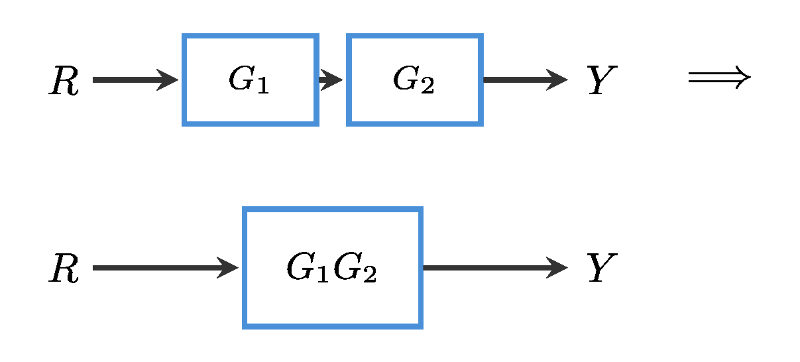
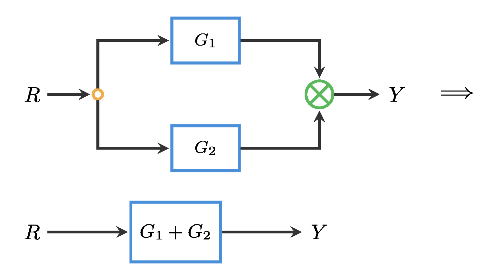
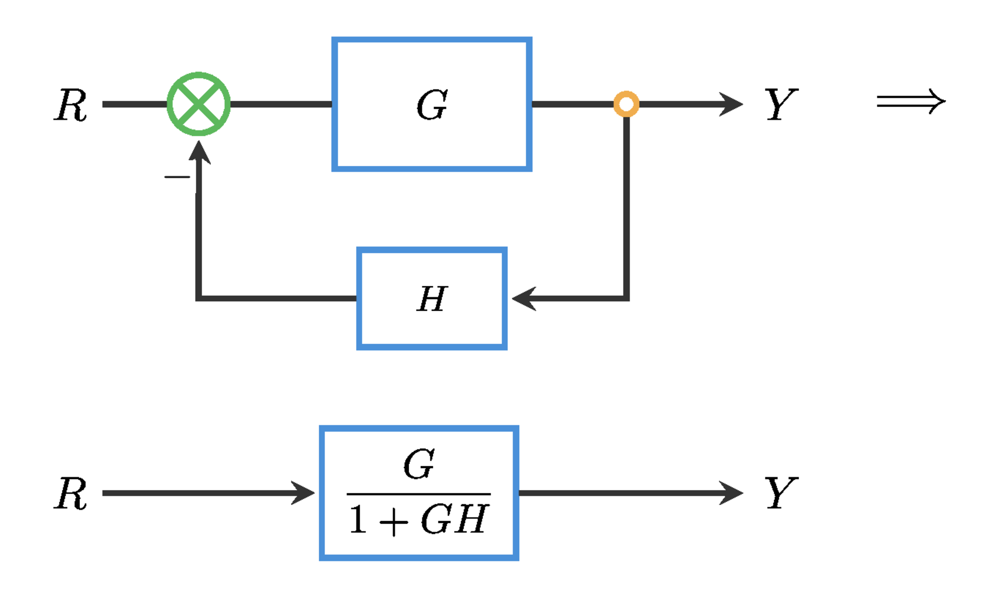
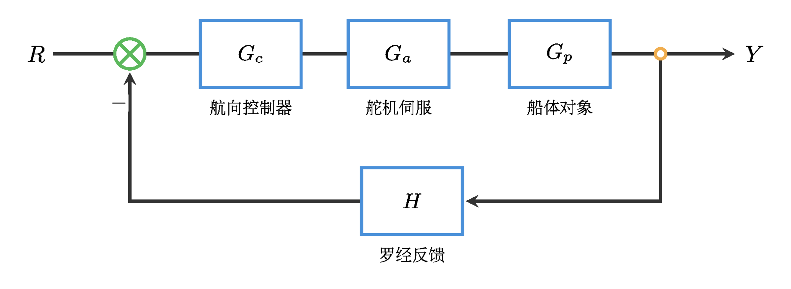
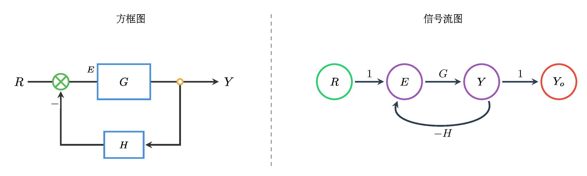
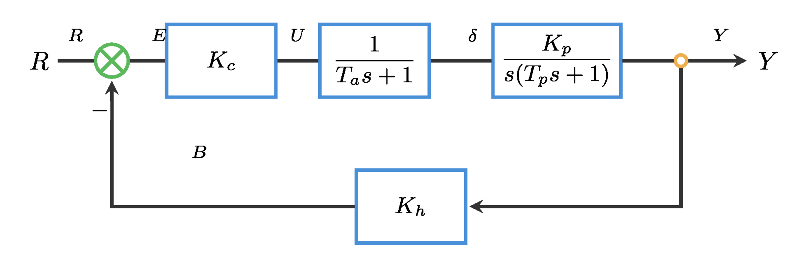
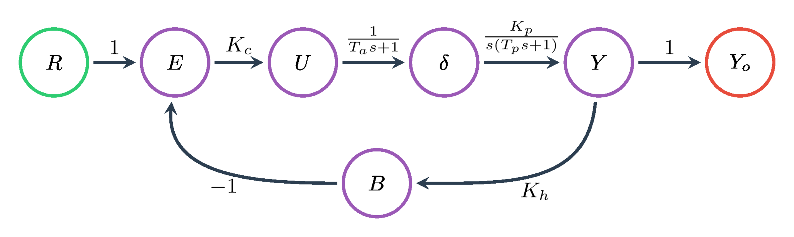
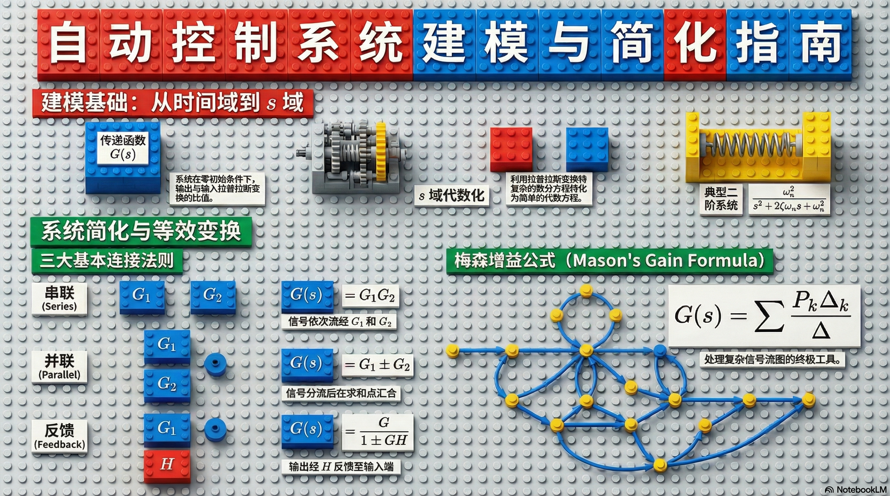

# 单元 2-1 | 建模与变换语言——从真实对象到统一分析对象

- **层次**：模块2 理论主线 · 第一课
- **学时**：90分钟
- **知识类型**：[C] 计算型
- **前置知识**：已掌握系统、反馈、极点与响应的基本概念，能够解读简单控制结构图
- **后续课程**：2-2（时域响应基础）、2-3（频率响应基础）、2-4（Bode 图与 Nyquist 图基础）、3-1（纯极点视角下的稳定与动态基础）
- **讲义定位**：本讲义将引导您将真实对象逐步转化为后续可反复调用的统一分析对象，首先建立"微分方程 → 拉氏变换 → 传递函数 → 典型环节 → 结构表达"的主线，为后续的时域、频域和稳定性分析奠定基础。

{fig-pos="H"}

图1. 单元 2-1 封面漫画：从真实对象到统一分析对象。

---

## 一、引入：为何仅有微分方程尚不足够

进入这一阶段，您已了解控制系统并非一组孤立公式，而是致力于解答一个明确的工程问题：当给定系统某个输入信号时，它将如何响应，以及其响应是否符合我们的预期。然而，在实际面对工程对象时，很快会遇到一个现实困难：

> 虽然真实系统通常首先以微分方程形式呈现，但后续分析几乎不可能始终依赖微分方程直接进行计算。

以船舶航向控制为例。舵角变化将引发船体偏航角速度变化，而偏航角速度进一步累积为航向角变化。若将此过程写成最基本的动力学方程，通常呈现为如下形式：

$$
J\ddot{\theta}(t)+B\dot{\theta}(t)=Ku(t)
$$

其中，$u(t)$ 表示控制输入，$\theta(t)$ 表示输出，$J$ 反映转动惯量，$B$ 反映阻尼系数，$K$ 反映控制作用效率。此方程虽具有明确的物理意义，但若尝试回答以下问题，过程将很快变得复杂：

- 该对象属于哪一类典型系统？
- 面对阶跃输入时，它将产生何种响应？
- 对不同频率成分，它将如何进行处理？
- 当与其他环节串联、并联或反馈连接后，整体对象如何描述？

您会发现，微分方程擅长描述"系统如何运动"，却不易直接承担"系统如何连接、如何分析、如何比较"等任务。也就是说，微分方程是分析的起点，却非后续控制分析中最便捷的工作语言。

因此，本节课首要解决的问题并非计算技巧，而是语言转换：

> 如何将一个真实工程对象，从时域的微分方程，转化为后续整门课程能够反复调用的统一分析对象？

这一统一对象即为**传递函数**。而将微分方程转化为传递函数的桥梁，则是**拉氏变换**。

从课程结构看，`2-1` 的作用十分明确：

- 它并不涵盖所有分析内容；
- 它首要负责建立后续分析所需的对象语言体系；
- 它为 `2-2` 的时域分析、`2-3` 的频域分析和 `2-4` 的图形表达提供共同起点。

因此，您可将本讲理解为模块2的"对象构建课"。从本节课开始，系统不再仅仅是某条微分方程，而将逐步转变为能够识别、比较、连接和运算的标准对象。

---

## 二、核心内容

### 2.1 为何课程需从微分方程转向变换域分析

若仅研究单一特定输入、特定初值和特定对象，直接求解微分方程固然可行。然而控制课程不止于"计算单次响应"。后续将频繁处理以下任务：

- 比较不同系统的动态特性；
- 分析同一对象在阶跃输入、正弦输入下的表现；
- 将多个环节组织成串联、并联或反馈结构；
- 基于整体结构继续判断稳定性、动态品质和频率特性。

此时，若始终停留在时域微分方程层面，每次分析都将变成"重新求解一道方程"。此种工作方式不仅繁琐，且难以揭示系统的共性结构。

拉氏变换的价值，在于将"求解方程"这一操作，转变为"先将对象改写成统一的代数形式，再在此形式下进行分析"。其最关键作用在于：将时域中的微分运算转化为复变量 $s$ 域中的代数运算。对工程分析而言，此变化意味着：

- 导数不再作为连续的运算负担出现，而是可统一表示为关于 $s$ 的多项式；
- 系统间的连接关系更易于表达；
- 输入与输出之间可浓缩为更稳定的对象关系；
- "对象本身"与"具体输入"可被分离开处理。

因此，本节最重要的不是记忆拉氏变换的积分定义，而是首先明确其在课程中的功能定位：

> 拉氏变换不是为了使数学更复杂，而是为了使系统更适于连接、比较和分析。

若记时间函数 $f(t)$ 的拉氏变换为 $F(s)$，形式上可表示为：

$$
F(s)=\mathcal{L}\{f(t)\}
$$

对控制课而言，最关键的性质是微分定理。在零初值语境下，有：

$$
\mathcal{L}\{\dot f(t)\}=sF(s)
$$

$$
\mathcal{L}\{\ddot f(t)\}=s^2F(s)
$$

这两条关系的意义重大。它们表明，原来在时间轴上层层嵌套的导数，进入变换域后将转变为关于 $s$ 的代数项。于是，线性定常系统的微分方程便有机会被改写为输入与输出间的代数关系。

此步一旦完成，系统分析的视角就会发生转变：

- 时域中，关注的是"变量如何随时间变化"；
- 变换域中，关注的是"输入信号与输出信号如何通过同一对象建立联系"。

这正是传递函数能够出现的前提。

表1. 时域微分方程语言与变换域对象语言的差异比较

| 分析语言 | 主要形式 | 适用场景 | 不足之处 |
|----------|----------|----------|----------|
| 时域语言 | 微分方程 $y,\dot y,\ddot y$ | 直接表达物理定律、阐释动力学来源 | 难以快速连接系统、统一比较对象、开展后续频域分析 |
| 变换域语言 | 代数关系 $Y(s),U(s),G(s)$ | 构建统一对象、表达连接关系、支持后续时域与频域分析 | 不易直接体现各时刻物理过程的细节 |

因此，本节的实际任务不是将拉氏变换讲授为积分技巧课，而是引导您接纳一种新的分析习惯：

> 真实对象首先在时域中建立，然后在变换域中形成可复用的统一分析对象。

### 2.2 零初值条件下传递函数的形成

基于以上目标，现在可正式回答本节的核心问题：传递函数究竟是什么？它又如何从真实对象中产生？

首先考虑一般形式的线性定常系统。设输入为 $u(t)$，输出为 $y(t)$，其关系可表示为：

$$
a_n y^{(n)}(t)+a_{n-1}y^{(n-1)}(t)+\cdots+a_1\dot y(t)+a_0 y(t)
=
b_m u^{(m)}(t)+b_{m-1}u^{(m-1)}(t)+\cdots+b_1\dot u(t)+b_0u(t)
$$

若在**零初值**条件下对两边进行拉氏变换，则各阶导数将转化为 $s$ 的幂次项，于是得到：

$$
\left(a_n s^n+a_{n-1}s^{n-1}+\cdots+a_1 s+a_0\right)Y(s)
=
\left(b_m s^m+b_{m-1}s^{m-1}+\cdots+b_1 s+b_0\right)U(s)
$$

将输出信号与输入信号分离，可得：

$$
\frac{Y(s)}{U(s)}
=
\frac{b_m s^m+b_{m-1}s^{m-1}+\cdots+b_1 s+b_0}
{a_n s^n+a_{n-1}s^{n-1}+\cdots+a_1 s+a_0}
$$

据此定义：

$$
G(s)=\frac{Y(s)}{U(s)}\bigg|_{\text{零初值}}
$$

此即为系统的**传递函数**。

此处必须特别重视"零初值"这一条件。它不是随意的附加限制，而是明确指出：传递函数所描述的是**系统本身固有的输入输出关系**，而非"系统当前带有特定历史状态时的临时表现"。若初始条件不为零，微分变换时会产生额外的初值项，输出信号与输入信号之间便不再仅由同一固定对象决定。

因此，传递函数在课程中具有两个核心含义：

1. 它将系统从"特定微分方程"提升为"可重复调用的统一对象"；
2. 它将"系统本身"与"具体输入信号"区分开来。

这两个含义将贯穿后续全部课程。因为您后续处理的几乎所有工作，本质上都围绕这两点展开：

- 在 `2-2` 中，将其与单位阶跃输入结合，获得时域响应；
- 在 `2-3` 中，将 $s$ 取为虚轴，得到频率特性 $G(j\omega)$；
- 在 `2-4` 中，将其进一步转换为 Bode 图和 Nyquist 图；
- 在模块3中，将继续从其极点、零点和结构出发，解释系统机理。

因此，传递函数绝非一道简单的"定义题"，而是后续课程分析的对象起点。

#### 2.2.1 通过具体对象完整演示转换过程

回到开头的船舶航向控制对象。设输入为舵机施加的等效控制作用 $u(t)$，输出为航向角 $\theta(t)$，系统满足：

$$
J\ddot{\theta}(t)+B\dot{\theta}(t)=Ku(t)
$$

在零初值下进行拉氏变换，得：

$$
Js^2\Theta(s)+Bs\Theta(s)=KU(s)
$$

提取 $\Theta(s)$ 项：

$$
\Theta(s)\left(Js^2+Bs\right)=KU(s)
$$

于是传递函数为：

$$
G(s)=\frac{\Theta(s)}{U(s)}=\frac{K}{Js^2+Bs}
$$

进一步整理，可写为：

$$
G(s)=\frac{K/J}{s\left(s+B/J\right)}
$$

此步骤的价值不仅在于"计算出一个表达式"，更在于您已开始能够从对象形式中识别结构信息：

- 分母中的原点极点，对应积分效应；
- 负实极点，对应阻尼带来的衰减因素；
- 系统从此不再只是"船舶动力学方程"，而是成为可与其他环节继续连接、比较和分析的标准对象。

这便是课程主线真正的推进方向。您现在不仅仅会书写动力学方程，而是开始建立"可供后续时域、频域和结构图共同调用的系统对象"。

#### 2.2.2 初次接触时应当关注的关键信息

首次接触传递函数时，许多人会将其视为不得不接受的分式形式。本节暂不急于将分子分母解释为一整套机理阐述，而仅强调两点最实用的认识：

- **分母**更多对应对象自身的动态骨架，揭示系统中保留的快慢与滞后因素；
- **分子**说明输入如何进入对象，以及整体增益如何组织。

在 `2-1` 这一层级，仅需建立一种稳定的认识：

> 传递函数并非只是将微分方程"改写为另一种形式"，而是将系统压缩成为后续可反复调用的标准对象。

至于分子、分母与极点零点间更深入的结构含义，将在后续单元中正式展开。

### 2.3 典型环节为何构成后续全课的"标准对象库"

若传递函数仅为每个系统独立的分式表达，虽统一了表达形式，但使用仍不够便利。因为后续课程不希望您每次遇到新对象时，都需从头重新识别。更高效的做法是将复杂对象进一步分解为若干种重复出现的标准部件。如此一来，您看到的将不再是"一个形式略显复杂的传递函数"，而是能够进一步识别：

- 其中是否包含比例作用；
- 是否具有积分累积效应；
- 是否存在微分型快速响应倾向；
- 是否含有一阶惯性滞后特征；
- 是否具备二阶振荡特征。

这些重复出现的标准部件，即为**典型环节**。您可将其理解为控制系统中的"标准构建模块"。后续无论是进行时域分析、频域分析，还是解析结构图、根轨迹，都是在与这些构建模块进行交互。

为说明此点，先考虑一般对象的分解思路。若一个传递函数可因式分解为：

$$
G(s)=K\cdot G_1(s)\cdot G_2(s)\cdots G_r(s)
$$

则后续分析的重点往往不是紧盯整个乘积，而是首先询问每个因子各自代表何种动态作用。每个因子可能对应一种熟悉的动态机制，而整个系统行为正是这些机制组合后的结果。

本课程中最常调用的典型环节如下所示。

不同工程对象虽出发点相异，但线性化后进入课程主线，最终往往会落到同一组标准对象之上。例如液位系统常见积分与惯性对象，电机转速系统常见比例与惯性组合，机械振动对象常见振荡环节。正因如此，典型环节才是后续全课能够跨场景复用的"标准对象库"。

表2. 五类典型环节及其基本判断特征

| 典型环节 | 传递函数形式 | 应把握的基本物理或工程含义 | 初步判断特征 |
|----------|--------------|------------------------------|------------|
| 比例环节 | $G(s)=K$ | 仅进行比例放大或缩小，不引入动态记忆 | 改变增益强弱，不改变系统阶次 |
| 积分环节 | $G(s)=\dfrac{1}{s}$ | 输出是输入随时间累积的结果 | 引入"记忆"特性，常导致系统缓慢积累 |
| 微分环节 | $G(s)=s$ | 输出对输入变化率更为敏感 | 强调变化趋势，对快速变化敏感 |
| 一阶惯性环节 | $G(s)=\dfrac{1}{Ts+1}$ | 存在滞后，响应不会瞬时达到稳态 | 不振荡，主要体现响应快慢差异 |
| 振荡环节 | $G(s)=\dfrac{\omega_n^2}{s^2+2\zeta\omega_n s+\omega_n^2}$ | 同时包含快慢与振荡特征 | 可能存在超调、振荡及再稳定过程 |

先看最简单的一类。若：

$$
G(s)=K
$$

则输出仅为输入按比例缩放。它不会自行引入新的动态过程，因此更像一个"强度调节器"而非"节奏制造者"。

再看积分环节：

$$
G(s)=\frac{1}{s}
$$

其特点不是"快"，而是"累积"。输入即使较小，只要持续存在，输出便会持续积累。因此，当后续看到系统中包含积分环节时，应立即意识到：此对象具有记忆特性，不会在达到某一特定值后便停止响应。

微分环节：

$$
G(s)=s
$$

则相反，其对输入变化率敏感。输入变化越快，其反应越显著。虽然理想微分环节在实际工程实现中需谨慎处理，但作为分析对象，它仍是至关重要的标准部件。

一阶惯性环节：

$$
G(s)=\frac{1}{Ts+1}
$$

是后续时域和频域分析中频繁出现的对象。其最显著的特征不是振荡，而是滞后与平滑。$T$ 越大，响应越慢；$T$ 越小，响应越快。您将在 `2-2` 中专门学习其阶跃响应如何受时间常数 $T$ 控制。

振荡环节：

$$
G(s)=\frac{\omega_n^2}{s^2+2\zeta\omega_n s+\omega_n^2}
$$

是二阶系统的标准形式。它首次将"整体快慢"与"振荡程度"同时整合于同一对象之中。后续将使用 $\omega_n$ 和 $\zeta$ 解释响应为何会超调、为何会摆动，以及为何有些系统稳定迅速，有些却过渡缓慢。

因此，典型环节的重要性不仅在于"记忆几个标准公式"，更在于从本节开始应逐步培养以下对象意识：

> 面对传递函数时，切勿急于进行数值运算，而应首先识别它由哪些标准对象构成。

一旦典型环节被识别，后续诸多问题便会变得更加清晰：

- `2-2` 中，您可以预期它将产生的时域响应类型；
- `2-3` 中，您可以推测其处理不同频率成分的方式；
- `2-4` 中，您可以估计其图形表现形式；
- 模块3中，您可以理解哪些结构因素真正主导系统行为。

将本节内容凝练为一句话：

> 传递函数让您拥有统一对象，典型环节让您拥有统一对象库。

### 2.4 方框图如何将多个对象连接为系统

至此，您已解决了"单一对象如何形成"的问题。然而实际控制系统几乎从不是单个环节独立工作，而是多个对象按特定关系相互连接。控制器、执行机构、被控对象、传感器之间的顺序关系、加减运算及反馈路径，若仅依赖文字表达，极容易混乱。

因此，课程需要引入第二类统一语言：**方框图**。

方框图的作用并非替代传递函数，而是清晰表达"多个传递函数之间如何连接"这一关系。它解答的是另一个问题：

> 当系统由多个对象组合而成时，信号具体如何流动？

方框图中最基本的元素并不多：

- **方框**：表示一个环节，框内标注该环节的传递函数；
- **信号线**：表示信号沿特定方向传递；
- **比较点**：表示多个信号进行加法或减法运算；
- **引出点**：表示同一信号被分送至多个位置。

若仅考虑课程最核心的连接关系，首先需掌握三类基本连接方式：串联、并联和反馈。

#### 2.4.1 串联：一个环节的输出作为下一环节的输入

若两个环节串联连接：

$$
X(s)\rightarrow G_1(s)\rightarrow G_2(s)\rightarrow Y(s)
$$

则总关系为：

$$
Y(s)=G_2(s)G_1(s)X(s)
$$

因此总传递函数为：

$$
G(s)=G_1(s)G_2(s)
$$

此规则非常直观。因为前一环节先对输入进行一次处理，后一环节继续处理，因此整体效果逐级相乘。

图2. 串联连接的方框图与等效化简结果。

#### 2.4.2 并联：同一输入分别进入多个支路，结果进行合成

若两个环节并联，且输出在比较点相加，则有：

$$
Y(s)=G_1(s)X(s)+G_2(s)X(s)
$$

因此总传递函数为：

$$
G(s)=G_1(s)+G_2(s)
$$

若其中一支路在比较点取负号，则对应减法运算。并联的关键并非"先后顺序"，而是"同一输入被分别处理后合成"。

图3. 并联连接的方框图与等效化简结果。

#### 2.4.3 反馈：系统输出被用于修正自身输入

反馈是控制系统最具代表性的结构。以最常见的负反馈为例，若前向通道为 $G(s)$，反馈通道为 $H(s)$，则有：

$$
E(s)=R(s)-B(s)
$$

$$
B(s)=H(s)Y(s)
$$

$$
Y(s)=G(s)E(s)
$$

联立此三式，可得闭环传递函数：

$$
\frac{Y(s)}{R(s)}=\frac{G(s)}{1+G(s)H(s)}
$$

此公式将在后续课程中反复出现。它表明反馈并非简单地"增加一条连接线"，而是改变了整个系统从输入到输出的总体对象。正因如此，控制课程真正关心的往往并非单纯的前向对象，而是形成反馈后的闭环对象。

图4. 负反馈连接的方框图与闭环等效结果。

表3. 三种基本连接的等效规则

| 连接方式 | 等效传递函数 | 直观含义说明 |
|----------|--------------|----------------------|
| 串联 | $G_1G_2$ | 信号逐级处理，效果相乘 |
| 并联 | $G_1\pm G_2$ | 信号分路处理，结果叠加 |
| 反馈 | $\dfrac{G}{1+GH}$ | 输出回头修正输入，整体对象被重构 |

#### 2.4.4 通过船舶航向系统理解连接关系

设一个简化的航向控制系统由四部分组成：

- **控制器**：航向控制器，根据"目标航向与实际航向之差"生成舵角指令；
- **执行机构**：舵机伺服系统，将电信号或液压指令转化为实际舵角；
- **船体对象**：船舶航向动力学对象，将舵角变化转换为偏航角速度和航向角变化；
- **传感器**：罗经或航向测量装置，将实际航向转换为反馈信号。

其结构并非"单一复杂公式"，而更接近于以下信号链：

1. 目标航向输入至比较点；
2. 罗经测得的实际航从反馈支路返回；
3. 比较点产生偏差信号；
4. 偏差信号依次通过航向控制器、舵机伺服系统和船体航向动力学对象；
5. 最终形成输出航向；
6. 输出航向再次被罗经测量并送回比较点。

此时应开始理解：方框图之所以重要，并非因其外观美观，而是因为它能够将"对象"与"连接关系"同时呈现于同一图中。传递函数解决的是"每个环节是什么"，方框图解决的是"这些环节如何构成系统"。

{fig-pos="H"}

图5. 船舶航向闭环系统的物理对象标注方框图。

从课程主线看，至此 `2-1` 的前半部分已建立了两层语言：

- 第一层：单一对象如何从微分方程转换为传递函数；
- 第二层：多个对象如何通过方框图连接为整体系统。

接下来需要补充第三层语言：当结构图不便直接处理时，为何需要信号流图与梅森公式作为补充工具。

### 2.5 为何方框图尚不充分：信号流图与梅森公式的补充作用

若系统仅有一条前向通路，或仅包含标准的串联、并联、反馈结构，方框图已足够实用。您能直观识别信号流向，并直接应用前述等效规则简化整体对象。

然而工程系统并非总是如此规整。一旦结构中开始出现以下情况，方框图的直接简化将迅速变得复杂：

- 某中间信号被引出至多个位置；
- 系统同时包含内环与外环；
- 若干反馈支路相互交叉，局部难以一步识别为标准三类连接；
- 系统结构虽未实质复杂化，但代数简化步骤却不断增加。

此时问题并非方框图"错误"，而在于其更擅长表达"模块如何连接"，不一定最适合处理"复杂信号路径如何计算"。因此，课程需要补充另一种表达方式：**信号流图**。

方框图与信号流图之间的差异可概括为：

> 方框图更强调模块与连接关系，信号流图更强调信号节点与路径关系。

在信号流图中，关注焦点不再集中于"此处是控制器、彼处是传感器"的方框，而是聚焦于：

- 信号经过哪些节点；
- 哪些路径将输入传递至输出；
- 哪些回路使信号回转；
- 哪些回路彼此互不接触。

换言之，信号流图并非新的课程主体，而是当结构关系日益复杂时，用于重新梳理路径关系的补充工具。

#### 2.5.1 信号流图的基本观察要点

信号流图包含三个最基本的观察对象：

- **节点**：表示某一信号量本身；
- **支路**：表示信号从一个节点传递至另一节点，支路上标注增益；
- **方向**：表示该传递关系的方向。

在此基础上，应用梅森公式时最重要的三个结构术语为：

- **前向通路**：从输入节点到达输出节点，且不重复经过任何节点的路径；
- **回路**：从某一节点出发，沿支路最终回到该节点的闭合路径；
- **互不接触回路**：两个回路间没有任何公共节点。

表4. 方框图与信号流图的任务分工

| 表达方式 | 擅长说明 | 学习要点 |
|----------|------------|----------|
| 方框图 | 模块功能、系统连接方式 | 串联、并联、反馈三类基本连接 |
| 信号流图 | 信号路径、回路构成 | 前向通路、回路、互不接触回路 |

因此，首次接触信号流图时，切勿将其理解为"另一套全新的图"。更准确的理解是：

> 当方框图已清晰表达系统结构，但直接简化过于复杂时，信号流图将同一结构转换为更适合进行路径计算的形式。

为避免混淆"输出变量节点"与"最终读出端"，下述对照图在信号流图最右侧单独设置了一个 $Y_o$ 节点。它仅代表"作为最终输出被读出的信号"，而非新的动态环节，亦不额外引入增益。

图6. 方框图与对应信号流图的对照示意。

#### 2.5.2 梅森公式的核心解决问题

建立信号流图后，一个自然问题随之产生：既然输入到输出间可能存在多条路径，且系统中可能同时存在多个回路，总传递函数如何从这些路径关系中直接写出？

梅森公式的价值正在于此。它并非要求您再进行一轮复杂简化，而是直接基于信号流图中的路径与回路关系写出总传递函数。其标准形式为：

$$
G(s)=\frac{Y(s)}{R(s)}=\frac{\sum_{k=1}^{N} P_k \Delta_k}{\Delta}
$$

其中：

- $P_k$ 表示第 $k$ 条前向通路的增益；
- $\Delta$ 表示全图特征式；
- $\Delta_k$ 表示与第 $k$ 条前向通路不接触部分对应的余因子式。

首次学习此公式时，不必急于记忆所有细节，也无需过分关注其符号复杂性。真正重要的是理解它完成了什么：

1. 首先找出输入至输出的所有主要"前进路线"；
2. 再识别系统中使信号回转的"回路"；
3. 最后将"路线"与"回路干扰"统一纳入最终结果。

因此，梅森公式并非凭空插入的数学技巧，而是明确回答一个关键问题：

> 当系统结构已复杂到不适合逐步代数简化时，能否直接从路径关系中写出总传递函数？

这正是其课程定位。它在 `2-1` 中出现，不是为了将您训练成回路技巧专家，而是为了让您了解：除了方框图的逐步简化之外，复杂结构另有一种更适合"观察全局路径"的求解方法。

表5. 梅森公式在本课程中的定位

| 当前需掌握 | 暂不作要求 |
|------------------|----------------|
| 了解梅森公式用于复杂结构的总体传递函数求取 | 大量复杂回路的技巧训练 |
| 能够识别前向通路、回路、互不接触回路 | 竞赛式的枚举训练 |
| 能通过代表性例题使用其写出总传递函数 | 将其视为独立章节进行题库练习 |

#### 2.5.3 为何本课程将其置于"补充工具"位置

至此，您可以重新审视 `2-1` 的组织原则。本课程并非将"方框图、信号流图、梅森公式"并列为三部分独立知识，而是阐述一条层层推进的对象主线：

1. 先将真实对象转换为传递函数；
2. 再将多个传递函数纳入方框图，表达系统连接；
3. 当连接关系过于复杂时，再引入信号流图与梅森公式进行补充求解。

此安排具有重要的学习意义：您不会误以为信号流图与梅森公式是某种必须独立崇拜的新工具，而是理解它们均服务于同一目标：

> 将复杂系统继续转换为可供后续时域、频域和结构机理分析调用的总体对象。

至此，`2-1` 的主线基本完成闭环。您已看到：

- 对象如何形成；
- 标准对象如何被识别；
- 多个对象如何连接；
- 复杂连接如何重新转换为可计算的统一对象。

此后，最合适的工作并非继续添加新定义，而是通过代表性例题完整演示此链条：从对象建立、结构表达到总体传递函数的求取。

---

## 三、例题精解

### 3.1 例题一：将一个简化的航向控制系统完整化为总体对象

**题目**

某简化船舶航向控制系统由四个环节组成：

- 航向控制器：$G_c(s)=K_c$
- 舵机伺服系统：$G_a(s)=\dfrac{1}{T_a s+1}$
- 船体航向动力学对象：$G_p(s)=\dfrac{K_p}{s(T_p s+1)}$
- 罗经反馈环节：$H(s)=K_h$

其中，目标航向为输入 $R(s)$，实际航向为输出 $Y(s)$。

1. 写出该系统的前向通道传递函数；
2. 画出其基本方框图后，求取闭环传递函数 $\Phi(s)=Y(s)/R(s)$；
3. 将该结构改写为信号流图时，指出主前向通路和主要反馈回路；
4. 用课程语言解释：为何此例题已将本节主线完整走完？

该系统的结构图如下所示。图中将信号流图可能使用的主要信号先行标注：$R,E,U,\delta,Y,B$。

图7. 代表性例题的船舶航向闭环结构图。

**解题思路**

此例题的目的非训练计算速度，而是将本课已构建的四层对象语言串联起来：

1. 首先识别每个模块属于何种对象；
2. 再观察它们如何按方框图相互连接；
3. 然后将闭环系统写为总体对象；
4. 最终认识到：若结构进一步复杂化，信号流图和梅森公式便会登场。

因此，解题顺序切莫混乱。先识别对象，再写出连接关系，最后求取总体对象，切勿一开始就紧盯最后的闭环表达式。

#### Step 1：先识别每个环节的对象类型

已知四个环节分别为：

$$
G_c(s)=K_c,\quad G_a(s)=\frac{1}{T_a s+1},\quad G_p(s)=\frac{K_p}{s(T_p s+1)},\quad H(s)=K_h
$$

当前无需急于相乘，而是进行对象识别：

- $G_c(s)=K_c$ 为**比例环节**；
- $G_a(s)=1/(T_a s+1)$ 为**一阶惯性环节**；
- $G_p(s)=K_p/[s(T_p s+1)]$ 可视为"比例环节 × 积分环节 × 一阶惯性环节"的组合；
- $H(s)=K_h$ 为反馈测量中的**比例环节**。

此步骤至关重要。它使您认识到：看似完整的船舶航向控制系统，实际上也是由我们已熟悉的标准化对象库组合而成。换言之，工程对象并未脱离典型环节语言，而是在典型环节语言中被重新组织起来。

#### Step 2：写出前向通道传递函数

从比较点到输出端，控制器、舵机和船体对象依次串联，因此前向通道传递函数为：

$$
G(s)=G_c(s)G_a(s)G_p(s)
$$

代入各环节表达式，得：

$$
G(s)=K_c\cdot \frac{1}{T_a s+1}\cdot \frac{K_p}{s(T_p s+1)}
$$

整理后可写为：

$$
G(s)=\frac{K_cK_p}{s(T_a s+1)(T_p s+1)}
$$

此步骤体现了最基本的串联规则：多个对象逐级处理同一信号，因此总体作用相互乘积。

#### Step 3：利用方框图写出闭环对象

该系统的基本结构是标准负反馈闭环。

因此由负反馈公式直接得到：

$$
\Phi(s)=\frac{Y(s)}{R(s)}=\frac{G(s)}{1+G(s)H(s)}
$$

将上一步的 $G(s)$ 与反馈环节 $H(s)=K_h$ 代入：

$$
\Phi(s)=\frac{\dfrac{K_cK_p}{s(T_a s+1)(T_p s+1)}}{1+\dfrac{K_cK_p}{s(T_a s+1)(T_p s+1)}K_h}
$$

分子分母同乘 $s(T_a s+1)(T_p s+1)$，得：

$$
\Phi(s)=\frac{K_cK_p}{s(T_a s+1)(T_p s+1)+K_cK_pK_h}
$$

此式即为从目标航向到实际航向的闭环传递函数。

此步骤之后，应特别关注以下认识：

> 闭环对象并非简单将多个环节排布完毕即可，而是在反馈作用下被整体重构为新的系统对象。

后续在时域和频域中真正用于分析的，往往是此闭环对象，而非原始的串联系统。

#### Step 4：将同一结构转换为信号流图视角

若将系统改写为信号流图，可选取如下节点：

- $R$：目标航向输入；
- $E$：偏差信号；
- $U$：控制器输出；
- $\delta$：实际舵角；
- $Y$：实际航向输出；
- $B$：反馈信号。

主要前向通路为：

$$
R \to E \to U \to \delta \to Y
$$

对应的前向通路增益为：

$$
P_1=1\cdot K_c\cdot \frac{1}{T_a s+1}\cdot \frac{K_p}{s(T_p s+1)}
=\frac{K_cK_p}{s(T_a s+1)(T_p s+1)}
$$

主要反馈回路为：

$$
E \to U \to \delta \to Y \to B \to E
$$

其回路增益为：

$$
L_1=-\,K_c\cdot \frac{1}{T_a s+1}\cdot \frac{K_p}{s(T_p s+1)}\cdot K_h
=-\frac{K_cK_pK_h}{s(T_a s+1)(T_p s+1)}
$$

负号来自比较点处的负反馈作用。

图8. 代表性例题对应的信号流图。

由于仅有一条前向通路、一个主要回路，且不存在互不接触回路，因此：

$$
\Delta=1-L_1
$$

将 $L_1$ 代入，可写为：

$$
\Delta
=1-\left(-\frac{K_cK_pK_h}{s(T_a s+1)(T_p s+1)}\right)
=1+\frac{K_cK_pK_h}{s(T_a s+1)(T_p s+1)}
$$

接下来需观察前向通路对应的**余子式** $\Delta_1$。余子式的含义为：将**所有与该前向通路接触的回路**从图中删除后，对剩余部分再写出的特征式。

在此例中，唯一主要回路 $L_1$ 明显经过前向通路中的所有节点，因此它与前向通路 $P_1$ 相互接触。删除所有与 $P_1$ 接触的回路后，图中已无剩余回路，故：

$$
\Delta_1=1
$$

现在才能将三部分完整代入梅森公式：

$$
G(s)=\frac{P_1\Delta_1}{\Delta}
$$

得到：

$$
G(s)=\frac{\dfrac{K_cK_p}{s(T_a s+1)(T_p s+1)}\cdot 1}{1+\dfrac{K_cK_pK_h}{s(T_a s+1)(T_p s+1)}}
$$

此式与方框图推算所得的闭环传递函数完全一致。

这说明一个极为重要的事实：
**方框图法与信号流图/梅森公式法并非两套相互竞争的方法，而是同一系统对象的两种求取路径。**

#### Step 5：基于本课主线重新审视此例题

现在回顾分析，此例题实质上串联了 `2-1` 整条主线：

1. 您先从每个局部对象的传递函数出发；
2. 将对象识别为典型环节的组合；
3. 利用方框图表达对象间的连接关系；
4. 应用负反馈公式求得总体闭环对象；
5. 观察到当结构转换为信号流图后，仍能回归至同一总体对象。

因此，此例题最值得您引以为鉴的，并非最终的闭环分式，而是以下课程语言表达：

> 建模的终点不是"获得若干局部环节"，而是将局部环节通过恰当的结构表达与求解工具，继续整合成为可供后续分析调用的总体对象。

**结论与工程意义**

对于该简化船舶航向系统而言，控制器、舵机、船体和罗经并非彼此分离的四部分内容，而是通过反馈闭合为新的闭环动态对象。后续关注的响应速度、稳定性、频率响应等，实际皆为此闭环对象的分析，而非原始孤立模块各自的表现。

学习提示：请独立完成上述五步，随后向 AI 提问："请验证该简化船舶航向控制系统的闭环传递函数，并分别基于方框图化简思路与梅森公式思路说明结果为何一致。" 核对时重点确认三方面：是否清晰区分前向通路增益、反馈回路增益，以及负反馈符号是否保留正确。

---

## 四、工程视角：为何真实系统必先厘清结构，再论性能

在真实工程实践中，若连控制系统的结构都未表达清晰，则几乎无法讨论性能。您甚至难以判断故障应先排查控制器、执行机构、传感器，还是对象本身。对于船舶航向控制更是如此：罗经反馈是否存在漂移、舵机动作是否迟缓、船体转向惯性大小，这些问题若未先置于结构图中审视，极易将"局部问题"误判为"整体系统性能不佳"。

因此，本节课看似在讲授传递函数、方框图与梅森公式，实质是在培养一种更基础的工程习惯：
首先清晰表达对象与结构，然后再讨论快慢、稳定、超调和频率响应。
若对象尚未建立稳固，后续分析便缺乏可靠基础。

---

## 五、本讲小结与前后衔接

### 5.1 应掌握的五个核心结论

1. 实际系统通常首先以微分方程形式出现，但后续分析需将其转化为统一对象，传递函数即为该统一对象。
2. 传递函数必须在零初值语境下理解，它描述的是系统固有的输入输出关系，而非某次带有历史状态的临时表现。
3. 典型环节构成后续全课反复调用的标准对象库，见到传递函数时，应首先识别其由哪些标准对象组成。
4. 方框图负责表达多个对象如何连接成系统，最基本的三种等效关系为串联、并联和反馈。
5. 当方框图直接简化开始变得复杂时，信号流图与梅森公式提供了从路径关系直接求取总传递函数的补充方法。

### 5.2 与前后课程的衔接关系

- 模块1已为您提供了系统、反馈和极点响应的初步直觉；
- `2-1` 现在将这些直觉正式转换为可计算、可连接、可复用的对象语言；
- `2-2` 将在此对象基础上研究单位阶跃响应，建立时域语言；
- `2-3` 将把这些对象置于频域中，探究 $G(j\omega)$；
- `2-4` 则将频域对象进一步转换为 Bode 图和 Nyquist 图。

> **核心概括**：本讲真正建立的不是若干零散公式，而是整门课后续分析所共享的系统对象语言。

---

{fig-pos="H"}

图9. 单元 2-1 信息图总结。

---

## 附录A｜为何传递函数必须强调"零初值"

首次接触传递函数时，许多人会将"零初值"视为顺手附加的技术条件。但若不将此概念彻底理解，后续极易混淆"系统本身的动态特性"与"系统当前携带的历史状态"。

设一个最简单的一阶对象满足：

$$
T\dot y(t)+y(t)=Ku(t)
$$

若直接进行拉氏变换：

$$
T[sY(s)-y(0^-)]+Y(s)=KU(s)
$$

整理后得：

$$
(Ts+1)Y(s)=KU(s)+Ty(0^-)
$$

于是：

$$
Y(s)=\frac{K}{Ts+1}U(s)+\frac{T\,y(0^-)}{Ts+1}
$$

应特别注意右边出现两部分：

1. 第一部分来自输入 $U(s)$；
2. 第二部分来自初始状态 $y(0^-)$。

这表明若初值非零，输出并不完全由输入通过某一固定对象决定，还包含"系统先前累积的状态影响"。正因如此，仅当零初值时，输入信号与输出信号之间才满足纯粹的比例关系：

$$
G(s)=\frac{Y(s)}{U(s)}
$$

因此，后续见到传递函数时，心中必须自动附加一句话：

> 它描述的是零初值语境下，系统本身固有的输入输出关系。

这并非意味着非零初值不重要，而是强调：

- 讨论系统本身为何种对象时，采用传递函数；
- 讨论系统当前携带何种历史状态时，尚需额外引入初值项。

此区分将直接影响您对时域响应及状态意义的理解。

---

## 附录B｜梅森公式速查：真正应按何种顺序操作

梅森公式最容易发生的错误不是公式无法记忆，而是顺序混乱导致前向通路、回路、特征式和余子式相互混淆。因此，此处不再展开为第二道技巧题，仅保留一套最小可操作顺序。

### B.1 梅森公式主体

$$
\frac{Y(s)}{R(s)}=\frac{\sum_{k=1}^{N}P_k\Delta_k}{\Delta}
$$

其中：

- $P_k$：第 $k$ 条前向通路的增益；
- $\Delta$：全图特征式；
- $\Delta_k$：与第 $k$ 条前向通路不接触部分对应的余子式。

### B.2 实际操作的推荐顺序

面对信号流图时，建议固定遵循以下 4 步：

1. **先找出所有前向通路**
   在不重复经过任何节点的前提下，从输入节点走到输出节点。先将路径完整列出，再进入下一步。

2. **再找出所有回路**
   从某节点出发，沿有向支路回到该节点。记录回路时，将负号一并写入增益。

3. **判断哪些回路互不接触**
   仅当回路互不接触时，才会在 $\Delta$ 中出现乘积项。

4. **逐条考察前向通路的余子式**
   并非所有 $\Delta_k$ 均等于 1。必须询问：删除所有与该前向通路接触的回路后，图中还剩哪些回路？

### B.3 本课仅额外提醒一个易错点

若系统中有两条前向通路，而某局部回路仅绕行上支路，不经过下支路，则对该下支路对应的前向通路而言，此局部回路为**不接触回路**。此时余子式不会自动等于 1，而可能保留为：

$$
\Delta_k=1-L_1
$$

此步骤提醒您的并非技巧，而是结构意义：

> 余子式正明确回答"此条前向通路未接触到哪些回路"。

---

## 附录C｜本课至少需记忆的拉普拉斯对应关系

本节课不将拉氏变换扩展为公式手册，仅保留从微分方程转向传递函数最常用的几项对应关系。

表6. 本课最少应记忆的拉氏对应关系表

| 时域表达 | 拉氏变换 | 本课用途 |
|----------|----------|----------|
| $1(t)$ | $\dfrac{1}{s}$ | 为后续单位阶跃输入做准备 |
| $\dot f(t)$ | $sF(s)-f(0^-)$ | 说明微分如何转化为代数项 |
| $\ddot f(t)$ | $s^2F(s)-sf(0^-)-\dot f(0^-)$ | 构建二阶对象时最常用 |
| $\int_0^t f(\tau)\,d\tau$ | $\dfrac{F(s)}{s}$ | 理解积分环节 $1/s$ 的来源 |

若当前仅希望掌握最核心的三条对应关系，则为：

1. 阶跃对应 $1/s$；
2. 微分在零初值下对应乘以 $s$；
3. 积分对应除以 $s$。

此几条已足够支撑本讲的传递函数推导与对象识别。拉氏变换的完整对照表将置于课程统一附录中处理，不在 `2-1` 正文继续扩展。

---

## 附录D｜本讲关键概念层级梳理

为帮助您从整体上把握本讲知识结构，以下以概念层次方式进行整理：

### D.1 基础转换层级（对象建立）
- 微分方程 → 拉氏变换 → 传递函数
- 核心约束：零初值条件
- 关键性质：将时域微分运算转化为代数运算

### D.2 对象识别层级（标准库建设）
- 基于传递函数的因式分解
- 识别比例、积分、微分、一阶惯性、振荡五大典型环节
- 建立典型环节库的跨场景复用意识

### D.3 结构表达层级（系统连接）
- 方框图基本元素（方框、信号线、比较点、引出点）
- 三类基本连接：串联、并联、反馈
- 从模块视角理解系统组合

### D.4 路径分析层级（复杂连接求解）
- 信号流图三要素：节点、支路、方向
- 关键术语：前向通路、回路、互不接触回路
- 梅森公式的逻辑定位：路径分析替代逐步化简

### D.5 学习习惯层级（工程思维）
- 先建立对象与结构，再讨论性能
- 传递函数与典型环节作为通用语言
- 不同工具服务于同一分析目标
