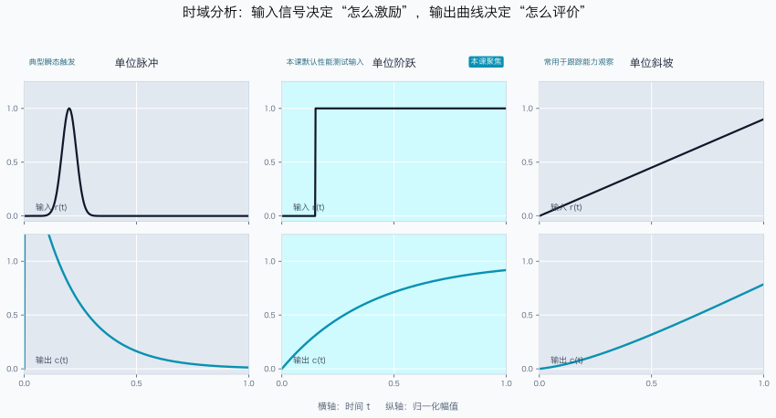
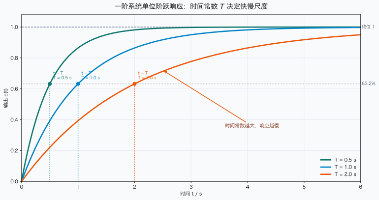
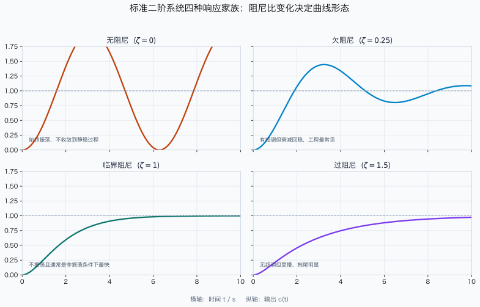
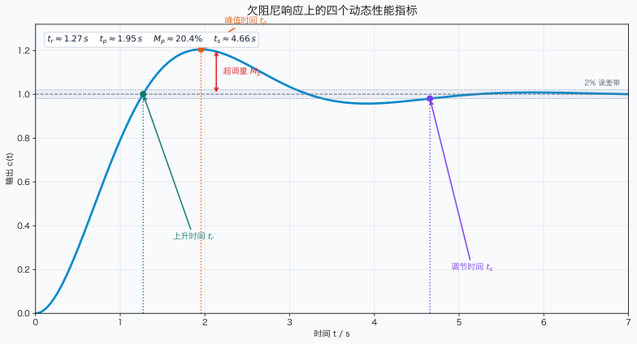
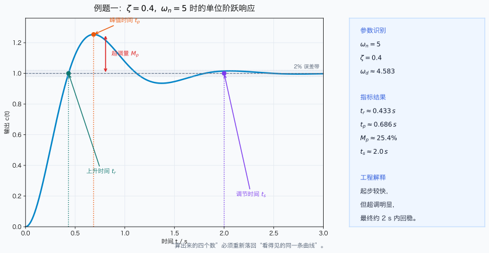
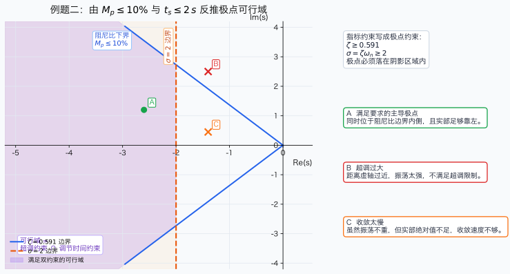

# 单元 2-2 | 时域响应基础——从响应曲线到动态性能指标

- **层次**：模块2 理论主线 · 第二课
- **学时**：90分钟
- **知识类型**：[C] + [X]
- **前置要求**：掌握拉氏变换、传递函数、典型环节与基本结构表达，能够基于标准对象描述系统输入输出关系
- **后续衔接**：2-3（频率响应基础）、2-4（Bode 图与 Nyquist 图基础）、3-1（纯极点视角下的稳定与动态基础）、3-3（根轨迹机制与基本法则）、4-1（性能指标体系、工程约束与可行域表达）
- **讲义定位**：本讲义围绕"典型输入作为标准测试对象的合理性、一阶与二阶响应如何构建标准时域语言、动态性能指标如何实现读图与轻量参数判断"这条主线展开，为后续的频域分析、极点解释和性能设计奠定基础。

{fig-pos="H"}

---

## 一、引入：为什么"稳定"仅仅是起点

上节课 `2-1` 解决了"如何描述对象"的问题。我们已经掌握将物理系统转化为传递函数的方法，并能从结构图或信号流图中获得系统总传递函数。然而，一旦这些代数工作完成，一个全新的工程问题随之浮现：

> 如果两个系统都稳定，它们的控制品质就一定相同吗？

答案显然是否定的。以船舶航向控制为例，假设驾驶台发出新的航向指令，要求船头从当前方向快速转向目标方向并稳定保持。对于驾驶员和控制工程师而言，真正关心的远不止"最终能否到达"，而是以下过程性指标：

- 系统多久开始明显转向？
- 是否会先冲过目标，再返回修正？
- 需要多长时间才能基本稳定？
- 收敛过程是平稳的，还是伴有明显振荡？

这些问题有一个共同特征：它们都只能在**时间轴**上回答。换言之，系统的"表现"不是某个静态数值，而是一条完整的输出曲线。研究这条曲线随时间演化的过程，就是**时域分析**。

在模块1和层0速通课中，我们已观察过一些直观现象：有的系统缓慢逼近目标，有的系统来回摆动，有的系统甚至逐渐偏离。前一阶段的目标是建立初步感觉；从本节课开始，我们将这种感觉提升为规范语言。具体而言，我们将以一阶系统和二阶系统的单位阶跃响应为起点，建立一套能够解答"快慢、超调、稳定时间及其机理"的时域分析框架。

本节课不追求一次性涵盖所有控制理论，而是先构建后续模块3、模块4都将反复使用的时域对象语言：标准响应、动态性能指标、阻尼比、自然频率及它们之间的对应关系。

> **本节核心问题**：给定一个闭环传递函数，我们如何从其单位阶跃响应中判断系统的快慢、振荡和稳定品质？

---

## 二、核心内容

> 本节按照"一阶系统 → 二阶系统 → 动态性能指标 → 跨域桥接"的顺序展开，确保时域分析的语言、公式与几何直觉保持统一。

### 2.1 时域分析的研究对象、任务与典型输入

如果说 `2-1` 构建了"系统对象的代数语言"，那么本节构建的则是"系统对象的时间语言"。**时域分析**指直接在时间变量 $t$ 上讨论系统输出 $c(t)$ 如何随输入和时间演化。它关注的不是分母的次数是否整齐，也不是化简过程是否优美，而是系统在实际过程中的具体表现。

对于线性定常系统，若已知传递函数 $G(s)$ 并给定输入 $r(t)$，理论上可通过：

$$
C(s)=G(s)R(s)
$$

先求得输出的拉氏像，再通过逆变换返回时域：

$$
c(t)=\mathcal{L}^{-1}\{C(s)\}
$$

因此，时域分析并非独立于建模的全新话题，而是建模结果的首次"应用"。它需完成三项任务：

1. **求响应表达式**：从 $G(s)$ 和 $R(s)$ 得到 $c(t)$；
2. **判响应形态**：判断其属于单调收敛、振荡收敛、持续振荡还是发散；
3. **提性能指标**：从曲线中提取"快慢、超调、稳定时间"等可度量信息。

为便于比较不同系统，通常采用一组标准测试输入而非随意选择。常见的有单位脉冲、单位阶跃、单位斜坡和单位加速度信号。它们各有用途，但本节重点关注最常用的一类：**单位阶跃输入**。

$$
r(t)=1(t), \qquad R(s)=\frac{1}{s}
$$

之所以选择阶跃输入，不仅因其简单，更因其最接近实际工程中的"指令突变"场景。例如，船舶航向指令从 $10^\circ$ 突变为 $20^\circ$，电机转速设定值突然提高，伺服位置突移至新目标，这些都近似为阶跃输入。

更重要的是，阶跃输入能在单条曲线上同时暴露系统的三类品质：

- 起步是否迅速；
- 过程是否平稳；
- 最终是否容易稳定。

因此，后续定义的上升时间、峰值时间、超调量和调节时间，默认均围绕**单位阶跃响应**展开。换言之，本节课真正学习的不只是"某一条漂亮曲线"，而是"如何将阶跃响应解读为一套可计算、可比较、可解释的语言"。



### 2.2 一阶系统的单位阶跃响应与时间常数

如果说阶跃响应是一门"曲线解读语言"，那么一阶系统就是这门语言的第一课。原因很简单：一阶系统既无振荡，也无超调和峰值摆动，它只保留了一件事：**系统究竟快还是慢**。因此，我们先用一阶系统建立衡量"快慢"的第一把尺子。

考虑标准一阶系统：

$$
G(s) = \frac{K}{Ts + 1}, \qquad T > 0
$$

其中 $K$ 为静态增益，决定最终稳态值的比例；$T$ 为时间常数，决定响应过程在时间轴上的展开速度。对单位阶跃输入 $R(s)=1/s$，有：

$$
C(s) = G(s)R(s) = \frac{K}{s(Ts+1)}
$$

为将其逆变换回时域，先进行部分分式展开：

$$
\frac{K}{s(Ts+1)} = \frac{A}{s} + \frac{B}{Ts+1}
$$

两边同乘 $s(Ts+1)$，得：

$$
K = A(Ts+1) + Bs
$$

比较同类项：

$$
A = K, \qquad AT + B = 0 \Rightarrow B = -KT
$$

因此：

$$
C(s) = \frac{K}{s} - \frac{KT}{Ts+1}
$$

逆变换得单位阶跃响应：

$$
c(t) = K\left(1-e^{-t/T}\right), \qquad t \ge 0
$$

这个结果值得细品。它告诉我们，一阶系统的阶跃响应由"终值 $K$"和"指数逼近过程 $e^{-t/T}$"共同构成。也就是说，响应并非瞬时跳至终点，而是从零开始，按照指数规律逐渐逼近稳态值。于是，一阶系统的基本性质可总结如下：

- 当 $t=0$ 时，$c(0)=0$，输出从零开始；
- 当 $t\to\infty$ 时，$c(t)\to K$，最终稳定到稳态值；
- 响应过程单调上升，无振荡，也无超调；
- $T$ 越大，指数衰减越慢，系统响应越慢。

最后一点最为关键。为使"快慢"的描述更具体，将 $t=T$ 代入上式：

$$
c(T) = K\left(1-e^{-1}\right) \approx 0.632K
$$

这表明：**经过一个时间常数后，一阶系统已达到终值的 63.2%**。这并非随意记忆的数字，而是时间常数真正的工程含义。它告诉我们：$T$ 不是抽象符号，而是衡量"系统推进速度"的直接刻度。

因此，工程上常将 $T$ 视作一阶系统快慢的核心参数，并进一步使用以下常用近似：

- 5% 误差带调节时间：$t_s \approx 3T$
- 2% 误差带调节时间：$t_s \approx 4T$  
- 10% 到 90% 上升时间：$t_r \approx 2.2T$

这些近似的价值不在于死记硬背，而在于帮助形成快速判断：当时间常数变为原来的 2 倍时，响应曲线不会"改变形状"，而是整体拉长；当时间常数减小时，曲线也不会突然产生振荡，而是整体加速。

换言之，一阶系统教会我们的第一课不是复杂计算，而是：

> **快慢可由一个参数稳定控制，且该参数会在整条响应曲线上留下统一的痕迹。**



若希望亲自复现上述"时间常数增大，曲线整体拉长"的对比现象，可运行附录 C 中的 `(2.2.1.first-order-step.m)`。

### 2.3 二阶系统标准型与单位阶跃响应的严格表达

一阶系统只能告诉我们"快还是慢"，却无法解释工程中更常见的另一类现象：**为何有些系统会先冲过头，再摆回？** 此时必须进入二阶系统。二阶系统之所以重要，不仅因其阶次更高，更因其首次将"快慢"与"振荡"同时纳入同一模型。

对时域分析而言，最重要的一类系统是标准二阶系统：

$$
\Phi(s) = \frac{\omega_n^2}{s^2 + 2\zeta\omega_n s + \omega_n^2}
$$

其中：

- $\omega_n$：无阻尼自然频率，主要控制时间尺度，决定"整体快慢"；
- $\zeta$：阻尼比，主要控制振荡程度，决定"是否超调、是否摆动"。

这两个参数的明确分工至关重要。后续你会发现，时域响应中最常见的判断几乎都围绕这两个量展开。对单位阶跃输入 $R(s)=1/s$，输出为：

$$
C(s) = \frac{\omega_n^2}{s\left(s^2 + 2\zeta\omega_n s + \omega_n^2\right)}
$$

正文先呈现推导主干，完整代数细节见附录。先进行分解：

$$
C(s) = \frac{1}{s} - \frac{s + 2\zeta\omega_n}{s^2 + 2\zeta\omega_n s + \omega_n^2}
$$

当 $0<\zeta<1$ 时，系统处于欠阻尼状态。此时令：

$$
\omega_d = \omega_n\sqrt{1-\zeta^2}
$$

则有：

$$
s^2 + 2\zeta\omega_n s + \omega_n^2 = (s+\zeta\omega_n)^2 + \omega_d^2
$$

再将分子改写为：

$$
s + 2\zeta\omega_n = (s+\zeta\omega_n) + \zeta\omega_n
$$

于是：

$$
C(s) = \frac{1}{s} - \frac{s+\zeta\omega_n}{(s+\zeta\omega_n)^2+\omega_d^2} - \frac{\zeta\omega_n}{(s+\zeta\omega_n)^2+\omega_d^2}
$$

逆拉普拉斯变换得：

$$
c(t) = 1 - e^{-\zeta\omega_n t}\cos(\omega_d t) - \frac{\zeta}{\sqrt{1-\zeta^2}}e^{-\zeta\omega_n t}\sin(\omega_d t)
$$

整理成更常用的形式：

$$
c(t) = 1 - e^{-\zeta\omega_n t}\left[\cos(\omega_d t) + \frac{\zeta}{\sqrt{1-\zeta^2}}\sin(\omega_d t)\right]
$$

这个公式比表面看起来更有信息量。它清晰地表明：二阶响应并非一条"神秘振荡曲线"，而是由两类因素叠加而成：

- **指数包络项** $e^{-\zeta\omega_n t}$：控制振荡衰减速度；
- **振荡项** $\sin(\omega_d t)$、$\cos(\omega_d t)$：控制波动频率。

因此：

- $\zeta\omega_n$ 决定"振荡包络压下去的速度"；
- $\omega_d$ 决定"包络内部摆动的频率"。

这正是二阶系统比一阶系统多出一层物理意义的原因：一阶系统只有"逼近终值的快慢"，二阶系统则额外拥有"围绕终值摆动的方式"。

#### 二阶系统四种典型响应形态

若进一步按阻尼比取值分类，二阶系统可分为四种典型响应形态：

1. **无阻尼**（$\zeta=0$）  
   极点位于虚轴上，响应为等幅振荡，不收敛到稳态。

2. **欠阻尼**（$0<\zeta<1$）  
   极点为左半平面共轭复根，响应振荡衰减，是控制工程中最常见的情形。

3. **临界阻尼**（$\zeta=1$）  
   极点重合于负实轴，响应无振荡，且通常是"不振荡前提下最快"的一种情形。

4. **过阻尼**（$\zeta>1$）  
   极点为两个不同的负实根，响应单调但较慢。

这四类情形正好对应层0中见过的"四种响应家族"。不同的是，当时我们仅是看图识现象；现在我们已经能将"为何出现这种图"表述为参数条件：

- 不是"它看起来会振荡"，而是"因为 $0<\zeta<1$"；
- 不是"它看起来收得较慢"，而是"因为阻尼比或自然频率落在此范围"；
- 不是"它像是最稳"，而是"因为极点结构已变为负实轴上的不同位置"。

因此，到本节为止，我们真正建立的不是一条响应公式，而是一种新的解读方式：

> **今后看到一条二阶响应曲线，不能只说它'像什么'，还要能指出其背后是哪个参数在起主导作用。**



### 2.4 动态性能指标的定义、公式与物理意义

至此，我们已经掌握了两样东西：一条响应曲线，以及决定其形状的参数语言。然而，工程设计不能停留在"这条曲线看起来不错"这样的描述层面。工程师真正需要的是一组可用于比较、计算和交流的量化语言，于是**动态性能指标**应运而生。

对于稳定系统的单位阶跃响应，最常用的四个指标是：

- 上升时间 $t_r$：起步快慢；
- 峰值时间 $t_p$：第一个波峰出现早晚；
- 超调量 $M_p$：冲过头程度；
- 调节时间 $t_s$：达到真正稳定所需时间。

换句话说，这四个指标所做的工作，就是将原本"只能观察"的响应曲线，翻译为"可计算、可比较、可设定要求"的工程语言。

为使后续推导更紧凑，先将欠阻尼二阶系统的响应改写为更便于读取指标的形式。令：

$$
\phi = \arccos \zeta, \qquad \sin\phi = \sqrt{1-\zeta^2}
$$

则原括号项可改写为：

$$
\cos(\omega_d t) + \frac{\zeta}{\sqrt{1-\zeta^2}}\sin(\omega_d t)
= \frac{1}{\sqrt{1-\zeta^2}}\sin(\omega_d t + \phi)
$$

于是响应可改写为：

$$
c(t) = 1 - \frac{e^{-\zeta\omega_n t}}{\sqrt{1-\zeta^2}}\sin(\omega_d t + \phi)
$$

这一形式极具价值，因为它将一条欠阻尼响应分解为两层：

- 外层的指数包络，负责"衰减速度"；
- 内层的正弦项，负责"摆动位置"。

后续四个指标，本质上就是从这两层结构中分别提取最有代表性的读数。

#### 2.4.1 上升时间 $t_r$

先看**上升时间**。它回答的问题最直接：系统从开始动作到"首次真正达到目标"需要多久。

严格地说，不同教材有两种常见定义：

- 对非振荡响应，常取输出从终值的 10% 上升到 90% 所需时间；
- 对欠阻尼二阶系统，也常取**输出首次达到终值**所需时间。

本课程对欠阻尼标准二阶系统采用第二种定义，因其更契合"首次触及目标值"的几何意义。由 $c(t_r)=1$ 得：

$$
\frac{e^{-\zeta\omega_n t_r}}{\sqrt{1-\zeta^2}}\sin(\omega_d t_r + \phi) = 0
$$

由于指数项恒不为零，真正决定条件的是正弦项，因此必须有：

$$
\sin(\omega_d t_r + \phi) = 0
$$

取首次达到终值的时刻，则：

$$
\omega_d t_r + \phi = \pi
$$

于是：

$$
t_r = \frac{\pi - \phi}{\omega_d} = \frac{\pi - \arccos \zeta}{\omega_n\sqrt{1-\zeta^2}}
$$

这个公式说明两点：

- $\omega_n$ 越大，整体时间尺度越短，因此 $t_r$ 通常越小；
- $\zeta$ 也会影响 $t_r$，因为阻尼会改变曲线首次到达终值的位置。

因此，上升时间不是"仅由一个量决定"的简单指标，但它非常适合回答起步灵敏度问题。

#### 2.4.2 峰值时间 $t_p$

接下来是**峰值时间**。它回答：如果系统会超调，那么第一个最高点出现在何时。

峰值点满足 $\dot c(t_p)=0$。对上式求导：

$$
\dot c(t) = \frac{\omega_n}{\sqrt{1-\zeta^2}}e^{-\zeta\omega_n t}\sin(\omega_d t)
$$

因此，峰值点满足：

$$
\sin(\omega_d t_p) = 0
$$

排除 $t=0$ 这一初始时刻，第一个正峰值对应：

$$
\omega_d t_p = \pi
$$

故：

$$
t_p = \frac{\pi}{\omega_d} = \frac{\pi}{\omega_n\sqrt{1-\zeta^2}}
$$

这一结果非常直观：系统内部摆动越快，第一个波峰出现越早。因此，$t_p$ 本质上测量的是"振荡频率"。

#### 2.4.3 超调量 $M_p$

再看工程师最常讨论的指标：**超调量**。它描述系统第一次冲过目标值时究竟超出多少。

定义为：

$$
M_p = \frac{c(t_p)-c(\infty)}{c(\infty)} \times 100\%
$$

对单位稳态值系统，$c(\infty)=1$。将 $t_p=\pi/\omega_d$ 代入响应式，注意到：

$$
\cos(\omega_d t_p) = \cos\pi = -1, \qquad \sin(\omega_d t_p) = \sin\pi = 0
$$

于是：

$$
c(t_p) = 1 - e^{-\zeta\omega_n t_p}(-1) = 1 + e^{-\zeta\omega_n t_p}
$$

从而：

$$
M_p = e^{-\zeta\omega_n t_p} \times 100\%
$$

再代入 $t_p = \pi/\omega_d$，可得：

$$
M_p = e^{-\frac{\zeta\pi}{\sqrt{1-\zeta^2}}} \times 100\%
$$

这是一个极其重要的结论：

> **超调量仅由阻尼比 $\zeta$ 决定，与 $\omega_n$ 无关。**

这句话的工程意义十分重大。它意味着：

- 想要系统"快一点"，首先考虑调整 $\omega_n$；
- 但想要系统"别冲太狠"，首先必须关注 $\zeta$。

换言之，超调量是将"振荡特性"直接量化的指标。

#### 2.4.4 调节时间 $t_s$

最后看**调节时间**。它回答：从工程角度看，这条曲线究竟何时才算"真正结束"。

调节时间是响应进入并始终保持在稳态值允许误差带内所需的最短时间。若取 2% 误差带，则要求：

$$
|c(t)-1| \le 0.02
$$

由相角形式可得误差上界：

$$
|c(t)-1| = \frac{e^{-\zeta\omega_n t}}{\sqrt{1-\zeta^2}}|\sin(\omega_d t + \phi)|
\le \frac{e^{-\zeta\omega_n t}}{\sqrt{1-\zeta^2}}
$$

因此，一个足以保证进入 2% 误差带的条件是：

$$
\frac{e^{-\zeta\omega_n t_s}}{\sqrt{1-\zeta^2}} \le 0.02
$$

解得：

$$
t_s \ge \frac{1}{\zeta\omega_n}\ln\left(\frac{1}{0.02\sqrt{1-\zeta^2}}\right)
$$

这是较严格的估计式。工程上，在常见阻尼比范围内，对数项通常可近似为 4，于是得到最常用的工程公式：

$$
t_s \approx \frac{4}{\zeta\omega_n} \qquad (2\%\text{误差带})
$$

同理，对 5% 误差带有：

$$
t_s \approx \frac{3}{\zeta\omega_n}
$$

若记极点实部绝对值为 $\sigma = \zeta\omega_n$，则可写为：

$$
t_s \approx \frac{4}{\sigma}
$$

这表明调节时间本质上反映的是"指数包络压下去需要多久"。因此它主要由极点实部控制：

> **极点越靠左，衰减越快，调节时间越短。**

将四个指标放在一起看，它们各自抓住了曲线的不同侧面：

- $t_r$ 关注"首次达到目标值的快慢"；
- $t_p$ 关注"第一个波峰何时出现"；
- $M_p$ 关注"超调程度"；
- $t_s$ 关注"工程意义上的稳定时刻"。

这四个指标协同工作，才真正将一条响应曲线翻译为可交流、可设定、可约束的时域语言。



若希望亲自比较不同阻尼比对 $M_p$、$t_p$、$t_s$ 的影响，可运行附录 C 中的 `(2.4.1.damping-ratio-scan.m)`。

### 2.5 从时域指标到参数与极点趋势：本课的轻量桥接

至此，若仍将时域分析理解为"对着曲线测量几个数值"，那本节课仅完成了一半。因为本节课真正要实现的，不仅是建立四个指标，更是引导学生形成新的认知：

> **一条时域响应曲线，本质上是在时间轴上暴露极点结构。**

换言之，前面计算出的 $t_r$、$t_p$、$M_p$、$t_s$ 并非彼此独立的四个数字。它们都在共同指向同一事实：闭环极点在复平面上的位置。

对欠阻尼二阶系统，闭环极点为：

$$
s_{1,2} = -\zeta\omega_n \pm j\omega_n\sqrt{1-\zeta^2}
$$

将此式与前面的四个指标对照，就能直接读出三类几何信息：

1. **实部** $-\zeta\omega_n$  
   决定指数包络压下去的速度，直接影响调节时间；
2. **虚部** $\omega_n\sqrt{1-\zeta^2}$  
   决定振荡角频率，直接影响峰值时间和振荡周期；
3. **极点与负实轴的夹角**  
   对应阻尼比，决定超调量和振荡强弱。

这一步至关重要，因为它将前面的"曲线语言"翻译成了"极点语言"。于是，本节最核心的三个跨域结论不再只是经验判断，而是有了明确的几何对应：

- $\zeta \uparrow \Rightarrow M_p \downarrow$：阻尼比增大，超调减小；
- $\omega_n \uparrow \Rightarrow t_p, t_r \downarrow$：自然频率增大，响应整体加快；
- $\zeta\omega_n \uparrow \Rightarrow t_s \downarrow$：极点实部左移，系统更快进入稳态。

若将这三条进一步压缩，可得本节课最值得掌握的"总图"：

- 想看系统**是否超调**，优先看阻尼比 $\zeta$；
- 想看系统**快慢程度**，优先看自然频率 $\omega_n$；
- 想看系统**稳定时长**，优先看极点实部，即 $\zeta\omega_n$。

于是，时域响应曲线不再是孤立图像，而是复平面极点结构在时间轴上的投影结果。学生若能建立这层对应，后续模块3和模块4就有了真正的抓手：

- 到 `3-1` 时，将进一步理解高阶系统为何仍能被极点主导；
- 到 `3-3` 时，将从"极点如何移动"角度重新理解根轨迹；
- 到 `4-1` 时，会将"超调不超过多少、调节时间不超过多少"正式表达为设计约束。

因此，本节的真正收束不是"背诵四个公式"，而是首先完成以下认知转变：

> **看到曲线，能联想到指标；看到指标，能联想到参数；看到参数，能联想到极点位置。**

至于如何将这些量正式转化为极点区域、根轨迹迁移和设计约束表达，将在模块3与模块4中系统展开；本节先夯实标准时域对象与指标语言。

只要这条链条建立起来，时域分析就不再是静态记忆，而成为后续分析与设计均可调用的中间语言。

至此，时域对象语言已基本构建完成。后续课程不再重复系统讲解这些定义和公式，而是将其作为已掌握工具，进入新的任务：

- 在 `2-3` 中，将时域对象推广至频率响应对象；
- 在 `2-4` 中，将频率特性转化为 Bode 图与 Nyquist 图基础；
- 在 `3-1` 和 `3-3` 中，从极点结构与极点迁移角度精化理解稳定与动态；
- 在 `4-1` 中，将时域指标正式重组为工程约束与可行域表达。

> **本节小结一句话**：时域指标表面上描述"响应曲线形态"，本质上反映"极点在复平面上的位置"。

---

## 三、例题精解

### 3.1 例题一：已知二阶系统参数，求动态性能指标

**题目**

设标准二阶闭环系统为：

$$
\Phi(s) = \frac{25}{s^2 + 4s + 25}
$$

求该系统的阻尼比 $\zeta$、自然频率 $\omega_n$、阻尼振荡频率 $\omega_d$，并进一步求出单位阶跃响应的上升时间 $t_r$、峰值时间 $t_p$、超调量 $M_p$ 和 2% 误差带下的调节时间 $t_s$。最后结合这些结果，说明该系统的动态品质。

**解题思路**

这是一道典型的"正向分析"题。处理顺序固定为：

1. 将分母与标准二阶系统形式对比，读出 $\omega_n$ 和 $\zeta$；
2. 计算 $\omega_d$，建立振荡频率；
3. 依次套用四个动态性能指标公式；
4. 将计算结果重新解释为工程语言，而非停留在代数结果上。

**详细求解**

先与标准型：

$$
\Phi(s) = \frac{\omega_n^2}{s^2 + 2\zeta\omega_n s + \omega_n^2}
$$

对比可得：

$$
\omega_n = 5, \qquad 2\zeta\omega_n = 4 \Rightarrow \zeta = 0.4
$$

进一步得到阻尼振荡频率：

$$
\omega_d = \omega_n\sqrt{1-\zeta^2} = 5\sqrt{0.84} \approx 4.583
$$

于是四个指标分别为：

$$
t_r = \frac{\pi - \arccos 0.4}{4.583} \approx 0.433\,\text{s}
$$

$$
t_p = \frac{\pi}{4.583} \approx 0.686\,\text{s}
$$

$$
M_p = e^{-\frac{0.4\pi}{\sqrt{0.84}}} \times 100\% \approx 25.4\%
$$

若使用 2% 误差带的工程近似式，则：

$$
t_s \approx \frac{4}{0.4 \times 5} = 2\,\text{s}
$$

**工程解释**

从这些数值可勾勒出一幅清晰的动态画像：

- $t_r \approx 0.433\,\text{s}$：系统起步较快；
- $t_p \approx 0.686\,\text{s}$：第一个波峰很早出现；
- $M_p \approx 25.4\%$：系统冲过头明显，振荡性较强；
- $t_s \approx 2\,\text{s}$（工程近似）：虽有较大超调，但收敛速度不慢。

因此，该系统属于典型的"反应积极、平稳性一般"的欠阻尼系统。它有助于理解一个核心事实：**响应速度与超调大小往往难以同时达到最优。**

还需特别注意：精确从响应曲线读取的 $t_s$ 与工程近似式给出的 $2\,\text{s}$ 并不完全相等。这不是推导错误，而是因为：

$$
t_s \approx \frac{4}{\zeta\omega_n}
$$

本身就是面向初步设计的经验公式，优点是快速估算，代价是引入近似误差。讲义中同时呈现两种结果，正是为了让学生明白：**公式适用于快速判断，仿真适用于精确核对。**



若希望亲自复原实例曲线并核对指标，可运行附录 C 中的 `(3.1.1.example-step-response.m)`。

### 3.2 例题二：已知性能指标要求，反推参数范围

**题目**

某闭环控制系统要求：

- 超调量不超过 10%，即 $M_p \le 10\%$；
- 2% 误差带调节时间不超过 2 秒，即 $t_s \le 2\,\text{s}$。

求欠阻尼标准二阶系统参数 $\zeta$、$\omega_n$ 应满足的基本范围。

**解题思路**

这是一道"逆向设计"题。与上一题不同，它不是已知参数求指标，而是已知指标反推参数区域。处理顺序也应固定：

1. 由超调量约束反推阻尼比下界；
2. 由调节时间约束反推 $\zeta\omega_n$ 下界；
3. 将两个条件合并为参数范围，并解释其在 $s$ 平面中的含义。

**详细求解**

#### 第一步：由超调量要求求阻尼比范围

由：

$$
M_p = e^{-\frac{\zeta\pi}{\sqrt{1-\zeta^2}}}
$$

得到：

$$
e^{-\frac{\zeta\pi}{\sqrt{1-\zeta^2}}} \le 0.1
$$

两边取自然对数：

$$
-\frac{\zeta\pi}{\sqrt{1-\zeta^2}} \le \ln 0.1 = -2.3026
$$

整理可得：

$$
\frac{\zeta\pi}{\sqrt{1-\zeta^2}} \ge 2.3026
$$

继续化简，得到常用结果：

$$
\zeta \ge \frac{|\ln 0.1|}{\sqrt{\pi^2 + (\ln 0.1)^2}} \approx 0.591
$$

这表明：若阻尼比低于约 $0.591$，系统超调必将超过 10%，因此这是一条不可突破的下界。

#### 第二步：由调节时间要求求自然频率下界

由工程近似式：

$$
t_s \approx \frac{4}{\zeta\omega_n} \le 2
$$

可得：

$$
\zeta\omega_n \ge 2
$$

由于上一步已知 $\zeta \ge 0.591$，于是至少应满足：

$$
\omega_n \ge \frac{2}{\zeta}
$$

若取满足超调约束的最小阻尼比 $\zeta = 0.591$，则：

$$
\omega_n \ge \frac{2}{0.591} \approx 3.38
$$

这说明：满足超调约束后，自然频率不能任意小，否则系统虽然"无冲"，却会"收得太慢"。

**结果解释**

因此，该系统的设计区域至少应满足：

- 阻尼比不小于约 $0.59$，以抑制超调；
- $\zeta\omega_n$ 不小于 $2$，以保证足够快的稳态进入。

这两个条件合在一起，实际上已不是单纯的"公式题"，而是最简单的设计区间问题：

- 第一条给出"不能太冲"的边界；
- 第二条给出"不能太慢"的边界。

若将这些条件映射到 $s$ 平面，就会得到"阻尼线 + 等调节时间线"共同界定的可行极点区域。这正是后续 `3-3` 根轨迹机制与 `4-1` 可行域表达将进一步使用的桥梁。

对本题的关键边界值快速核对可知：当 $\zeta = 0.591155...$ 时，由超调公式计算得 $M_p \approx 10\%$；当再取 $\omega_n \approx 3.3832$ 时，有：

$$
\frac{4}{\zeta\omega_n} \approx 2
$$

表明这组值恰好落在"超调 10%"与"2 秒调节时间"两条工程边界线上。

若将对应参数代回系统：

$$
\Phi(s)=\frac{\omega_n^2}{s^2+2\zeta\omega_n s+\omega_n^2}
$$

并观察单位阶跃响应，可以发现：

- 超调量约为 $10.0\%$；
- 2% 误差带下的数值调节时间约为 $1.752\,\text{s}$。

这再次说明：

- 超调约束公式给出的阻尼比边界相当准确；
- 调节时间的工程公式更适合作为设计保守边界，而非逐点精确值。

因此，本题的核心不是记忆两个数字，而是理解：**时域指标要求可直接转为参数约束，而参数约束又可进一步转为极点约束。**



若希望亲自复现边界参数与可行区域的对应关系，可运行附录 C 中的 `(3.2.1.spec-boundary-check.m)`。

### 3.3 例题后的方法总结

将前两道例题并列来看，本节的方法主线已形成完整闭环。学生真正需要掌握的，不是"会做这两道题"，而是以下可迁移的方法链：

- **正向分析**：已知系统参数 → 求响应指标；
- **逆向设计**：已知响应指标 → 反推参数区域；
- **跨域迁移**：将参数区域进一步转写为极点位置、根轨迹区域和频域裕度要求。

这也解释了为什么本节虽有大量公式与计算，但本质上并非"算数课"。它真正构建的是一套中间语言：

- 以曲线描述现象；
- 以指标表述要求；
- 以参数表达结构；
- 以极点阐释机理。

只要这条链条建立起来，后续进入根轨迹、频域图形或设计约束时，学生就不会感到在"换一门课"，而会意识到仍在处理同一系统，只是切换了观察坐标系。

因此，例题部分的意义不在于算出答案，而在于同时确立"正向分析"和"逆向设计"两种能力。前者教会学生如何从模型读出动态品质，后者教会学生如何将动态品质重新写回模型与极点。这恰恰是模块2向模块3、模块4输送的最重要接口。

---

## 四、工程判断：为何不能只追求"快"

在船舶控制、飞行控制、动力定位和装备伺服等场景中，"快"从来不是唯一目标。只追求快速响应而忽视超调和稳定裕度的控制系统，可能在实验台上看似敏捷，却在真实工程中埋下风险。

例如，船舶航向调整时，若系统超调过大，可能导致航向来回摆动；在狭窄航道、编队航行或恶劣海况下，这不仅影响效率，更可能直接威胁航行安全。由此可见，控制工程中的参数选择不是"将某一指标极致化"，而是在安全、稳定、快速、能耗之间寻求负责任的平衡。

从学习角度看，本节真正要训练的不仅是"会不会套公式"，更是能否据此做出合格的工程判断：

- 不能只看局部最优，而要审视系统整体行为；
- 不能只求速度，而忽视安全边界；
- 不能将公式当作机械代数，而要将其理解为工程决策的依据。

因此，学习时域性能指标，不仅仅是学习几个符号和公式，更是在练习一种面向真实系统、考虑真实后果的工程判断方式。

---

## 五、本节小结与前后衔接

### 5.1 本节必须掌握的五个结论

1. **一阶系统用时间常数 $T$ 建立"快慢"的第一把尺子**：$T$ 越小，响应越快；
2. **欠阻尼二阶系统用 $\zeta$ 与 $\omega_n$ 建立"快慢 + 振荡"的双参数语言**：前者主导振荡强弱，后者主导响应尺度；
3. **四个动态性能指标将曲线翻译为可计算、可比较、可设定的工程语言**；
4. **超调量 $M_p$ 主要取决于阻尼比 $\zeta$，调节时间 $t_s$ 主要取决于 $\zeta\omega_n$，它们最终都关联到极点位置**；
5. **时域指标本质上是极点结构的时间投影**：响应曲线不是孤立图像，而是复平面极点安排在时间轴上的表现。

### 5.2 与后续课程的衔接

- 本课已将原"时域性能指标精讲"的核心对象语言完全确立，后续课程不再重复系统性定义与推导，直接调用本课结论；
- `2-3` 将把这种"响应对象"继续推广至频率响应对象，建立正弦稳态响应、频率特性与 $G(j\omega)$ 的解释；
- `2-4` 将把频率对象进一步翻译为 Bode 图与 Nyquist 图的图形语言；
- `3-1` 将从纯极点视角解释更一般的稳定与动态问题，回答"为何高阶系统仍能由极点主导"；
- `3-3` 将转入根轨迹机制，回答"极点如何移动、性能如何随之变化"；
- `4-1` 将把本课的时域指标正式收束为工程约束和可行域表达，进入设计视角。

> **一句话总结**：本课将"会看响应曲线"提升为"会用指标和极点解释响应曲线"；从此刻起，时域分析不再仅是观察，而是开始成为设计语言。

---

{fig-pos="H"}

---

## 附录A｜动态性能指标速查表

> 用于课堂回顾与课后复习。若无特别说明，下表默认针对稳定系统的单位阶跃响应；其中峰值时间、超调量等公式主要针对欠阻尼标准二阶系统。

| 指标 | 符号 | 物理意义 | 常用定义/公式 | 主要影响因素 | 直观解释 |
|------|------|----------|---------------|----------------|----------|
| 上升时间 | $t_r$ | 输出从初始值快速逼近目标值的时间尺度 | 欠阻尼二阶系统常取 $t_r = \dfrac{\pi-\arccos\zeta}{\omega_n\sqrt{1-\zeta^2}}$ | $\omega_n$、$\zeta$ | 越小表示"起步越快" |
| 峰值时间 | $t_p$ | 输出达到第一个峰值的时刻 | $t_p = \dfrac{\pi}{\omega_n\sqrt{1-\zeta^2}}$ | $\omega_n$、$\zeta$ | 越小表示振荡峰来得越早 |
| 超调量 | $M_p$ | 输出最大值超过稳态值的百分比 | $M_p = e^{-\frac{\zeta\pi}{\sqrt{1-\zeta^2}}} \times 100\%$ | 主要由 $\zeta$ 决定 | 越小表示"冲过头"越少 |
| 调节时间 | $t_s$ | 响应进入并保持在误差带内所需时间 | 2% 误差带常取 $t_s \approx \dfrac{4}{\zeta\omega_n}$ | 主要由 $\zeta\omega_n$ 决定 | 越小表示系统越快稳定 |
| 时间常数 | $T$ | 一阶系统响应快慢的核心参数 | $c(t)=K(1-e^{-t/T})$，且 $c(T) \approx 0.632K$ | 一阶系统参数 $T$ | 越小表示一阶系统越快 |

### 复习提示

- 若只需快速判断"超调程度"，先看阻尼比 $\zeta$ 与超调量 $M_p$。
- 若只需快速判断"稳定时长"，先看极点实部大小或 $\zeta\omega_n$。
- 若需从响应曲线反推极点位置，则需结合 $t_p$、$M_p$、$t_s$ 综合判断，而非仅关注单一指标。

---

## 附录B｜欠阻尼标准响应的完整推导

> 本附录完整呈现欠阻尼标准二阶系统单位阶跃响应从拉氏像到时域表达式的全过程。正文为保持主线流畅仅保留主干，这里提供全文版本，供复习、核对和后续课程调用。

### B.1 从标准型和单位阶跃输入出发

考虑标准二阶系统：

$$
\Phi(s)=\frac{\omega_n^2}{s^2+2\zeta\omega_n s+\omega_n^2}, \qquad 0<\zeta<1
$$

对单位阶跃输入：

$$
R(s)=\frac{1}{s}
$$

有输出拉氏像：

$$
C(s)=\Phi(s)R(s)=\frac{\omega_n^2}{s\left(s^2+2\zeta\omega_n s+\omega_n^2\right)}
$$

我们的目标是将其化为若干可直接逆拉普拉斯变换的标准项。

### B.2 先作部分分式整理

观察可知，若将上式写成：

$$
C(s)=\frac{1}{s}-\frac{s+2\zeta\omega_n}{s^2+2\zeta\omega_n s+\omega_n^2}
$$

则两项通分后有：

$$
\frac{1}{s}-\frac{s+2\zeta\omega_n}{s^2+2\zeta\omega_n s+\omega_n^2}
=
\frac{s^2+2\zeta\omega_n s+\omega_n^2-s(s+2\zeta\omega_n)}{s\left(s^2+2\zeta\omega_n s+\omega_n^2\right)}
=
\frac{\omega_n^2}{s\left(s^2+2\zeta\omega_n s+\omega_n^2\right)}
$$

因此该拆分成立。

### B.3 对二次项配方

为将分母写成标准振荡形式，对二次项配方：

$$
s^2+2\zeta\omega_n s+\omega_n^2
=
(s+\zeta\omega_n)^2+\omega_n^2-\zeta^2\omega_n^2
$$

即：

$$
s^2+2\zeta\omega_n s+\omega_n^2
=
(s+\zeta\omega_n)^2+\omega_n^2(1-\zeta^2)
$$

令：

$$
\omega_d=\omega_n\sqrt{1-\zeta^2}
$$

则可写为：

$$
s^2+2\zeta\omega_n s+\omega_n^2=(s+\zeta\omega_n)^2+\omega_d^2
$$

于是：

$$
C(s)=\frac{1}{s}-\frac{s+2\zeta\omega_n}{(s+\zeta\omega_n)^2+\omega_d^2}
$$

### B.4 将分子拆为标准逆变换形式

为对应标准逆变换公式，将分子 $s+2\zeta\omega_n$ 改写为：

$$
s+2\zeta\omega_n=(s+\zeta\omega_n)+\zeta\omega_n
$$

所以：

$$
C(s)=\frac{1}{s}
-\frac{s+\zeta\omega_n}{(s+\zeta\omega_n)^2+\omega_d^2}
-\frac{\zeta\omega_n}{(s+\zeta\omega_n)^2+\omega_d^2}
$$

再将末项整理为标准正弦形式：

$$
\frac{\zeta\omega_n}{(s+\zeta\omega_n)^2+\omega_d^2}
=
\frac{\zeta\omega_n}{\omega_d}\cdot
\frac{\omega_d}{(s+\zeta\omega_n)^2+\omega_d^2}
$$

因此：

$$
C(s)=\frac{1}{s}
-\frac{s+\zeta\omega_n}{(s+\zeta\omega_n)^2+\omega_d^2}
-\frac{\zeta\omega_n}{\omega_d}\cdot
\frac{\omega_d}{(s+\zeta\omega_n)^2+\omega_d^2}
$$

### B.5 逐项逆拉普拉斯变换

利用标准公式：

$$
\mathcal{L}^{-1}\left\{\frac{1}{s}\right\}=1
$$

$$
\mathcal{L}^{-1}\left\{\frac{s+a}{(s+a)^2+b^2}\right\}=e^{-at}\cos bt
$$

$$
\mathcal{L}^{-1}\left\{\frac{b}{(s+a)^2+b^2}\right\}=e^{-at}\sin bt
$$

取：

$$
a=\zeta\omega_n,\qquad b=\omega_d
$$

则有：

$$
\mathcal{L}^{-1}\left\{
\frac{s+\zeta\omega_n}{(s+\zeta\omega_n)^2+\omega_d^2}
\right\}
=
e^{-\zeta\omega_n t}\cos(\omega_d t)
$$

以及：

$$
\mathcal{L}^{-1}\left\{
\frac{\omega_d}{(s+\zeta\omega_n)^2+\omega_d^2}
\right\}
=
e^{-\zeta\omega_n t}\sin(\omega_d t)
$$

于是时域响应为：

$$
c(t)=1-e^{-\zeta\omega_n t}\cos(\omega_d t)
-\frac{\zeta\omega_n}{\omega_d}e^{-\zeta\omega_n t}\sin(\omega_d t)
$$

由于：

$$
\frac{\zeta\omega_n}{\omega_d}
=
\frac{\zeta\omega_n}{\omega_n\sqrt{1-\zeta^2}}
=
\frac{\zeta}{\sqrt{1-\zeta^2}}
$$

故可写成熟悉形式：

$$
c(t)=1-e^{-\zeta\omega_n t}\cos(\omega_d t)
-\frac{\zeta}{\sqrt{1-\zeta^2}}e^{-\zeta\omega_n t}\sin(\omega_d t)
$$

这就是欠阻尼标准二阶系统的单位阶跃响应。

### B.6 改写为相角形式

为便于后续推导上升时间、峰值时间、超调量和调节时间，将括号中的三角组合改写为单一正弦项。

令：

$$
\phi=\arccos\zeta
$$

则有：

$$
\cos\phi=\zeta,\qquad \sin\phi=\sqrt{1-\zeta^2}
$$

利用和角公式：

$$
\sin(\omega_d t+\phi)=\sin(\omega_d t)\cos\phi+\cos(\omega_d t)\sin\phi
$$

代入上式得：

$$
\sin(\omega_d t+\phi)
=
\zeta\sin(\omega_d t)+\sqrt{1-\zeta^2}\cos(\omega_d t)
$$

两边同除以 $\sqrt{1-\zeta^2}$：

$$
\frac{1}{\sqrt{1-\zeta^2}}\sin(\omega_d t+\phi)
=
\cos(\omega_d t)+\frac{\zeta}{\sqrt{1-\zeta^2}}\sin(\omega_d t)
$$

于是响应可改写为：

$$
c(t)=1-\frac{e^{-\zeta\omega_n t}}{\sqrt{1-\zeta^2}}\sin(\omega_d t+\phi)
$$

此形式的优点在于：

- 指数包络 $e^{-\zeta\omega_n t}$ 单独控制衰减；
- 正弦项 $\sin(\omega_d t+\phi)$ 单独控制相位与峰谷位置；
- 后续四个动态性能指标均可从此表达式更直接地提取。

### B.7 本附录的作用

正文中保留推导主干，是为了不打断课程主线；本附录保留全文，是为了让学生在以下场景时可回查：

1. 忘记 $\omega_d$ 如何引入；
2. 忘记为何会出现 $\dfrac{\zeta}{\sqrt{1-\zeta^2}}$ 项；
3. 想重新核对相角形式来源；
4. 后续在 `3-1`、`3-3` 或 `4-1` 中再次调用此套公式时，需回到最初出处。

---

## 附录C｜MATLAB/Octave 复现代码

> 以下代码仅保留最基本复现逻辑，便于学生直接修改参数、重新运行并观察结果。若使用 Octave，请先确认已安装并加载 `control` 包。

### C.1 `(2.2.1.first-order-step.m)`

```matlab
% Octave users: pkg load control
s = tf('s');
G1 = 1 / (0.5*s + 1);
G2 = 1 / (1.0*s + 1);
G3 = 1 / (2.0*s + 1);

step(G1, G2, G3, 10);
grid on;
legend('T=0.5', 'T=1.0', 'T=2.0');
```

### C.2 `(2.4.1.damping-ratio-scan.m)`

```matlab
% Octave users: pkg load control
s = tf('s');
wn = 5;
zeta_list = [0.2, 0.4, 0.7];

G1 = wn^2 / (s^2 + 2*zeta_list(1)*wn*s + wn^2);
G2 = wn^2 / (s^2 + 2*zeta_list(2)*wn*s + wn^2);
G3 = wn^2 / (s^2 + 2*zeta_list(3)*wn*s + wn^2);

step(G1, G2, G3, 5);
grid on;
legend('\zeta=0.2', '\zeta=0.4', '\zeta=0.7');
```

### C.3 `(3.1.1.example-step-response.m)`

```matlab
% Octave users: pkg load control
s = tf('s');
zeta = 0.4;
wn = 5;
G = wn^2 / (s^2 + 2*zeta*wn*s + wn^2);

step(G, 5);
grid on;
```

### C.4 `(3.2.1.spec-boundary-check.m)`

```matlab
% Octave users: pkg load control
Mp = 0.10;
zeta = -log(Mp) / sqrt(pi^2 + log(Mp)^2);
wn = 4 / (2*zeta);

s = tf('s');
G = wn^2 / (s^2 + 2*zeta*wn*s + wn^2);

step(G, 5);
grid on;
```