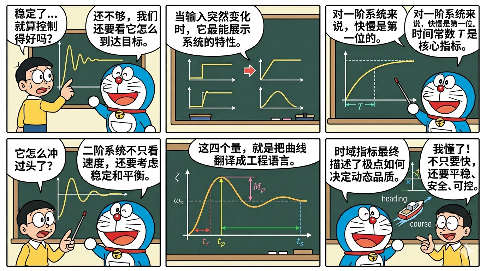
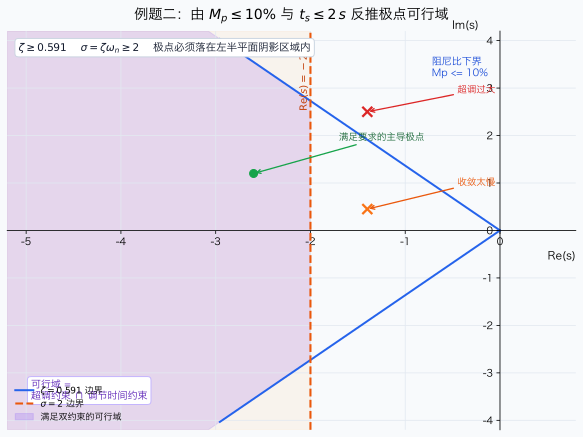
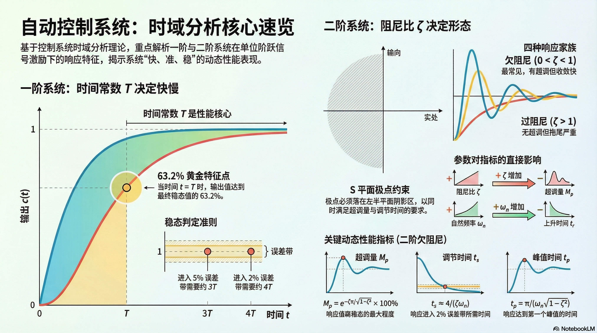

# 单元 2-2 | 时域响应基础——从响应曲线到动态性能指标

> **层次**：模块2 理论主线 · 第二课
> **学时**：2（100 分钟）
> **知识类型**：[C] + [X]
> **前置**：2-1（建模与变换语言：拉氏变换、传递函数、结构图、信号流图、梅森公式、典型环节）；legacy `L-2a/L-2b` 可作为时域直觉来源参考
> **后续**：2-3（频率响应基础）、2-4（Bode 图与 Nyquist 图基础）、3-1（纯极点视角下的稳定与动态基础）、3-3（根轨迹机制与基本法则）、4-1（性能指标体系、工程约束与可行域表达）
> **讲义定位**：本讲义承担本主题的唯一事实来源责任。正文负责把“时域响应是什么、怎么计算、怎样判断、为什么这样”讲清楚；较长但必要的代数推导转入附录，其中**欠阻尼标准响应的完整推导必须在附录中全文保留**，供后续复习与核对使用。

{fig-pos="H"}

---

## 一、引入：为什么“稳定”还不够

上一课 `2-1` 解决的是“对象怎么写出来”的问题。我们已经知道怎样把物理系统变成传递函数，也知道怎样从结构图或信号流图得到总传递函数。可一旦这些代数工作完成，一个新的工程问题会立刻出现：

> 如果两个系统都稳定，它们的控制品质就一定一样好吗？

答案显然是否定的。仍以船舶航向控制为例，假设驾驶台发出一个新的航向命令，要求船头尽快从当前方向转到目标方向并稳定保持。对于驾驶员和控制工程师来说，真正关心的从来不只是“最后能不能到”，而是下面这些过程性问题：

- 它多久开始明显转向？
- 它会不会先冲过目标，再回来修正？
- 它需要多长时间才能基本稳定下来？
- 它的收敛过程是平顺的，还是伴随明显振荡？

这几个问题有一个共同点：它们都只能在**时间轴**上回答。也就是说，系统的“表现”不是某个静态数字，而是一条完整的输出曲线。研究这条曲线如何随时间展开，就是**时域分析**。

在模块1和层0速通课中，我们已经见过一些直观现象：有的系统慢慢贴近目标，有的系统会来回摆动，有的系统甚至会越偏越远。那一阶段的任务是先建立感觉；本节课开始，我们要把这种感觉上升为正式语言。具体来说，我们要从一阶系统和二阶系统的单位阶跃响应出发，建立一套能够回答“快不快、冲不冲、多久稳、为什么这样”的时域分析框架。

这节课不追求把所有控制理论一次讲完，而是先把后续模块3、模块4都会反复调用的时域对象语言建起来：标准响应、动态性能指标、阻尼比、自然频率，以及它们之间的对应关系。

> **本节核心问题**：给定一个闭环传递函数，我们如何从单位阶跃响应中判断系统的快慢、振荡和稳定品质？

---

## 二、核心内容

> 本节按“一阶系统 -> 二阶系统 -> 动态性能指标 -> 跨域桥接”的顺序展开，确保时域分析的语言、公式与几何直觉统一起来。

### 2.1 时域分析的研究对象、任务与典型输入

如果说 `2-1` 建立的是“系统对象的代数语言”，那么本节建立的就是“系统对象的时间语言”。所谓**时域分析**，就是直接在时间变量 $t$ 上讨论系统输出 $c(t)$ 怎样随输入和时间展开。它关心的不是分母次数好不好看，也不是化简过程漂不漂亮，而是系统在现实过程中到底表现成什么样。

对于线性定常系统，只要已经知道传递函数 $G(s)$，并给定输入 $r(t)$，理论上就可以通过

$$
C(s)=G(s)R(s)
$$

先求出输出的拉氏像，再通过逆变换回到时间域：

$$
c(t)=\mathcal{L}^{-1}\{C(s)\}
$$

因此，时域分析并不是一个独立于建模之外的新话题，而是建模结果的第一轮“使用”。它要完成三件事：

1. **求响应表达式**：从 $G(s)$ 和 $R(s)$ 得到 $c(t)$；
2. **判响应形态**：判断它是单调收敛、振荡收敛、持续振荡还是发散；
3. **提性能指标**：从曲线中提取“快慢、超调、稳定时间”等可度量信息。

为了比较不同系统，人们不会随意挑输入，而是使用一组标准测试输入。常见的有单位脉冲、单位阶跃、单位斜坡和单位加速度信号。它们各自有用途，但本节只把注意力集中在最常用的一类：**单位阶跃输入**。

$$
r(t)=1(t), \qquad R(s)=\frac{1}{s}
$$

之所以选它，不是因为它最简单，而是因为它最像真实工程中的“命令突然变化”。例如，船舶航向命令从 $10^\circ$ 突然改为 $20^\circ$，电机转速设定值突然提高，伺服位置突然改到新目标，这些都可以近似看成阶跃输入。

更关键的是，阶跃输入能在一条曲线上同时暴露系统的三类品质：

- 起步是否迅速；
- 过程是否平稳；
- 最终是否容易稳定。

所以，后面定义的上升时间、峰值时间、超调量和调节时间，默认都是围绕**单位阶跃响应**展开的。换句话说，本课真正要学的不是“某一条漂亮曲线”，而是“如何把阶跃响应读成一套可以计算、可以比较、可以解释的语言”。


### 2.2 一阶系统的单位阶跃响应与时间常数

如果说阶跃响应是一门“读曲线的语言”，那么一阶系统就是这门语言的第一课。原因很简单：一阶系统没有振荡、没有超调、也没有峰值来回摆动，它只保留了一件最基础的事情：**系统到底快还是慢**。因此，我们先用一阶系统建立“快慢”的第一把尺子。

考虑标准一阶系统：

$$
G(s) = \frac{K}{Ts + 1}, \qquad T > 0
$$

其中，$K$ 为静态增益，决定最终稳态值的比例；$T$ 为时间常数，决定响应过程在时间轴上展开得快还是慢。对单位阶跃输入 $R(s)=1/s$，有：

$$
C(s) = G(s)R(s) = \frac{K}{s(Ts+1)}
$$

为了把它逆变换回时间域，对其作部分分式展开：

$$
\frac{K}{s(Ts+1)} = \frac{A}{s} + \frac{B}{Ts+1}
$$

两边同乘 $s(Ts+1)$，得：

$$
K = A(Ts+1) + Bs
$$

比较同类项：

$$
A = K, \qquad AT + B = 0 \Rightarrow B = -KT
$$

因此：

$$
C(s) = \frac{K}{s} - \frac{KT}{Ts+1}
$$

逆变换得单位阶跃响应：

$$
c(t) = K\left(1-e^{-t/T}\right), \qquad t \ge 0
$$

这个结果值得慢一点看。它告诉我们，一阶系统的阶跃响应由“终值 $K$”和“指数逼近过程 $e^{-t/T}$”共同组成。也就是说，响应不是一下跳到终点，而是从零开始，按指数规律逐渐逼近稳态值。于是，一阶系统的基本性质可以概括为：

- 当 $t=0$ 时，$c(0)=0$，输出从零开始；
- 当 $t\to\infty$ 时，$c(t)\to K$，最终稳定到稳态值；
- 响应过程单调上升，不会振荡，也不会超调；
- $T$ 越大，指数衰减越慢，系统响应越慢。

这里最关键的是最后一条。为了把“快慢”说得更具体，把 $t=T$ 代入上式：

$$
c(T) = K\left(1-e^{-1}\right) \approx 0.632K
$$

这说明：**经过一个时间常数后，一阶系统已经达到终值的 63.2\%**。这不是一个随手记忆的数字，而是时间常数真正的工程含义。它告诉我们：$T$ 不是抽象符号，而是“系统推进到多快”的直接刻度。

因此，在工程上常把 $T$ 看成一阶系统快慢的核心参数，并进一步使用几个常用近似：

- 5\% 误差带调节时间：$t_s \approx 3T$
- 2\% 误差带调节时间：$t_s \approx 4T$
- 10\% 到 90\% 上升时间：$t_r \approx 2.2T$

这些近似的价值，不在于让你死记，而在于帮助你形成快速判断：当时间常数放大为原来的 2 倍时，响应曲线不会“换形状”，而只是整体拉长；当时间常数缩小时，曲线也不会突然产生振荡，而只是整体变快。

换句话说，一阶系统教会我们的第一件事不是复杂计算，而是：

> **快慢可以被一个参数稳定地控制，而且这个参数会在整条响应曲线上留下统一痕迹。**


如果希望自己复现上面这组“时间常数变大，曲线整体拉长”的对比现象，可运行附录 C 中的 `(2.2.1.first-order-step.m)`。

### 2.3 二阶系统标准型与单位阶跃响应的严格表达

一阶系统只能告诉我们“快还是慢”，却不能解释工程上更常见的另一类现象：**为什么有些系统会先冲过头，再摆回来？** 这时就必须进入二阶系统。二阶系统之所以重要，不仅因为它比一阶系统高一阶，更因为它第一次把“快慢”和“振荡”这两件事情同时放进了同一个模型里。

对时域分析而言，最重要的一类系统是标准二阶系统：

$$
\Phi(s) = \frac{\omega_n^2}{s^2 + 2\zeta\omega_n s + \omega_n^2}
$$

其中：

- $\omega_n$：无阻尼自然频率，主要控制时间尺度，决定“整体快不快”；
- $\zeta$：阻尼比，主要控制振荡程度，决定“冲不冲、摆不摆”。

这两个参数的分工非常关键。后面你会发现，时域响应里最常见的判断，几乎都围绕这两个量展开。对单位阶跃输入 $R(s)=1/s$，输出为：

$$
C(s) = \frac{\omega_n^2}{s\left(s^2 + 2\zeta\omega_n s + \omega_n^2\right)}
$$

正文先给出推导主干，完整代数细节放入附录。先作分解：

$$
C(s) = \frac{1}{s} - \frac{s + 2\zeta\omega_n}{s^2 + 2\zeta\omega_n s + \omega_n^2}
$$

当 $0<\zeta<1$ 时，系统为欠阻尼系统。此时令：

$$
\omega_d = \omega_n\sqrt{1-\zeta^2}
$$

则有：

$$
s^2 + 2\zeta\omega_n s + \omega_n^2 = (s+\zeta\omega_n)^2 + \omega_d^2
$$

再将分子改写为：

$$
s + 2\zeta\omega_n = (s+\zeta\omega_n) + \zeta\omega_n
$$

于是：

$$
C(s) = \frac{1}{s} - \frac{s+\zeta\omega_n}{(s+\zeta\omega_n)^2+\omega_d^2} - \frac{\zeta\omega_n}{(s+\zeta\omega_n)^2+\omega_d^2}
$$

逆拉普拉斯变换得：

$$
c(t) = 1 - e^{-\zeta\omega_n t}\cos(\omega_d t) - \frac{\zeta}{\sqrt{1-\zeta^2}}e^{-\zeta\omega_n t}\sin(\omega_d t)
$$

整理成更常用的形式：

$$
c(t) = 1 - e^{-\zeta\omega_n t}\left[\cos(\omega_d t) + \frac{\zeta}{\sqrt{1-\zeta^2}}\sin(\omega_d t)\right]
$$

这个式子比看起来更有信息量。它清楚地告诉我们：二阶响应不是一条“神秘会振荡的曲线”，而是由两类因素叠加出来的。

- **指数包络项** $e^{-\zeta\omega_n t}$：控制振荡衰减速度；
- **振荡项** $\sin(\omega_d t)$、$\cos(\omega_d t)$：控制波动频率。

因此：

- $\zeta\omega_n$ 决定“振荡包络压下去有多快”；
- $\omega_d$ 决定“在包络内部摆动得有多快”。

这正是为什么二阶系统比一阶系统多出了一整层物理意义：一阶系统只有“逼近终值的快慢”，二阶系统还额外拥有“围绕终值摆动的方式”。

#### 二阶系统四种典型响应形态

如果进一步按阻尼比取值分类，二阶系统可以分成四种典型响应形态：

1. **无阻尼**（$\zeta=0$）  
   极点位于虚轴上，响应为等幅振荡，不收敛到稳态。
2. **欠阻尼**（$0<\zeta<1$）  
   极点为左半平面共轭复根，响应振荡衰减，是控制工程中最常见的情形。
3. **临界阻尼**（$\zeta=1$）  
   极点重合于负实轴，响应无振荡，且通常是“不振荡前提下最快”的一种情形。
4. **过阻尼**（$\zeta>1$）  
   极点为两个不同的负实根，响应单调但较慢。

这四类情形正好对应层0里见过的“四种响应家族”。不同的是，那时我们只是看图认现象；现在我们已经能把“为什么出现这种图”说成参数条件：

- 不是“它看起来会振荡”，而是“因为 $0<\zeta<1$”；
- 不是“它看起来收得比较慢”，而是“因为阻尼比或自然频率落在这样的范围”；
- 不是“它像是最稳”，而是“因为极点结构已经变成负实轴上的不同位置”。

所以，到这一节为止，我们真正建立起来的不是一条响应公式，而是一种新的阅读方式：

> **以后看到一条二阶响应曲线，你不能只说它‘像什么’，还要能说出它背后是哪个参数在起主导作用。**


### 2.4 动态性能指标的定义、公式与物理意义

到目前为止，我们已经有了两样东西：一条响应曲线，以及决定它形状的参数语言。但工程设计不能只停留在“这条曲线看起来不错”这样的描述上。工程师真正需要的是一组能够比较、计算、交流的量化语言，于是就有了**动态性能指标**。

对于稳定系统的单位阶跃响应，最常用的四个指标是：

- 上升时间 $t_r$：起步快不快；
- 峰值时间 $t_p$：第一个波峰来得早不早；
- 超调量 $M_p$：冲过头有多严重；
- 调节时间 $t_s$：多久才算真正稳定下来。

换句话说，这四个指标做的事，就是把原本“只能看”的响应曲线，翻译成“可以算、可以比、可以拿来定要求”的工程语言。

为了让后面的推导更紧凑，先把欠阻尼二阶系统的响应写成更适合读指标的形式。令

$$
\phi = \arccos \zeta, \qquad \sin\phi = \sqrt{1-\zeta^2}
$$

则原来的括号项可以改写为

$$
\cos(\omega_d t) + \frac{\zeta}{\sqrt{1-\zeta^2}}\sin(\omega_d t)
= \frac{1}{\sqrt{1-\zeta^2}}\sin(\omega_d t + \phi)
$$

于是响应可改写为

$$
c(t) = 1 - \frac{e^{-\zeta\omega_n t}}{\sqrt{1-\zeta^2}}\sin(\omega_d t + \phi)
$$

这个形式很有价值，因为它把一条欠阻尼响应拆成了两层：

- 外层的指数包络，负责“衰减到多快”；
- 内层的正弦项，负责“摆动到哪里”。

后面四个指标，本质上就是围绕这两层结构，从曲线上各取一个最有代表性的读数。

#### 2.4.1 上升时间 $t_r$

先看**上升时间**。它回答的问题最直接：系统从开始动作到“第一次真正到达目标”要多久。

严格地说，不同教材有两种常见定义：

- 对非振荡响应，常取输出从终值的 10\% 上升到 90\% 所需时间；
- 对欠阻尼二阶系统，也常取**输出第一次到达终值**所需时间。

本课程对欠阻尼标准二阶系统采用第二种定义，因为它更贴合“第一次摸到目标值”的几何意义。由 $c(t_r)=1$ 得：

$$
\frac{e^{-\zeta\omega_n t_r}}{\sqrt{1-\zeta^2}}\sin(\omega_d t_r + \phi) = 0
$$

由于指数项永远不为零，真正决定条件的是正弦项，因此必须有

$$
\sin(\omega_d t_r + \phi) = 0
$$

取第一次达到终值的时刻，则

$$
\omega_d t_r + \phi = \pi
$$

于是

$$
t_r = \frac{\pi - \phi}{\omega_d} = \frac{\pi - \arccos \zeta}{\omega_n\sqrt{1-\zeta^2}}
$$

这个公式说明两件事：

- $\omega_n$ 越大，整体时间尺度越短，因此 $t_r$ 往往越小；
- $\zeta$ 也会影响 $t_r$，因为阻尼会改变曲线第一次到达终值的位置。

所以，上升时间不是“只由一个量决定”的简单指标，但它非常适合回答起步灵敏度问题。

#### 2.4.2 峰值时间 $t_p$

接下来是**峰值时间**。它回答的是：如果系统会冲过头，那么第一个最高点出现在什么时候。

峰值点满足 $\dot c(t_p)=0$。对上式求导：

$$
\dot c(t) = \frac{\omega_n}{\sqrt{1-\zeta^2}}e^{-\zeta\omega_n t}\sin(\omega_d t)
$$

因此，峰值点满足

$$
\sin(\omega_d t_p) = 0
$$

除去 $t=0$ 这一初始时刻，第一个正峰值对应

$$
\omega_d t_p = \pi
$$

故

$$
t_p = \frac{\pi}{\omega_d} = \frac{\pi}{\omega_n\sqrt{1-\zeta^2}}
$$

这个结果非常直观：系统内部摆动得越快，第一个波峰出现得就越早。因此，$t_p$ 本质上是在读“振荡频率”这件事。

#### 2.4.3 超调量 $M_p$

再看最常被工程师拿来讨论的指标：**超调量**。它描述的是系统第一次冲过目标值时，究竟冲出了多少。

定义为：

$$
M_p = \frac{c(t_p)-c(\infty)}{c(\infty)} \times 100\%
$$

对单位稳态值系统，$c(\infty)=1$。把 $t_p=\pi/\omega_d$ 代入响应式，注意到

$$
\cos(\omega_d t_p) = \cos\pi = -1, \qquad \sin(\omega_d t_p) = \sin\pi = 0
$$

于是

$$
c(t_p) = 1 - e^{-\zeta\omega_n t_p}(-1) = 1 + e^{-\zeta\omega_n t_p}
$$

从而

$$
M_p = e^{-\zeta\omega_n t_p} \times 100\%
$$

再代入 $t_p = \pi/\omega_d$，可得

$$
M_p = e^{-\frac{\zeta\pi}{\sqrt{1-\zeta^2}}} \times 100\%
$$

这是一个非常重要的结论：

> **超调量仅由阻尼比 $\zeta$ 决定，与 $\omega_n$ 无关。**

这句话的工程意义非常大。它等于在说：

- 想让系统“快一点”，你首先会想到调 $\omega_n$；
- 但想让系统“别冲太狠”，你首先必须看 $\zeta$。

也就是说，超调量是把“振荡性格”直接量化出来的指标。

#### 2.4.4 调节时间 $t_s$

最后看**调节时间**。它回答的是：从工程角度看，这条曲线究竟什么时候才算“真正结束”。

调节时间是响应进入并始终保持在稳态值允许误差带内所需的最短时间。若取 2\% 误差带，则要求：

$$
|c(t)-1| \le 0.02
$$

由相角形式可得误差上界：

$$
|c(t)-1| = \frac{e^{-\zeta\omega_n t}}{\sqrt{1-\zeta^2}}|\sin(\omega_d t + \phi)|
\le \frac{e^{-\zeta\omega_n t}}{\sqrt{1-\zeta^2}}
$$

因此，一个足够保证进入 2\% 误差带的条件是

$$
\frac{e^{-\zeta\omega_n t_s}}{\sqrt{1-\zeta^2}} \le 0.02
$$

解得

$$
t_s \ge \frac{1}{\zeta\omega_n}\ln\left(\frac{1}{0.02\sqrt{1-\zeta^2}}\right)
$$

这是较严格的估计式。工程上，在常见阻尼比范围内，对数项通常可以近似为 4，于是得到最常见的工程公式：

$$
t_s \approx \frac{4}{\zeta\omega_n} \qquad (2\%\text{误差带})
$$

同理，对 5\% 误差带有

$$
t_s \approx \frac{3}{\zeta\omega_n}
$$

若记极点实部绝对值为 $\sigma = \zeta\omega_n$，则还可写为

$$
t_s \approx \frac{4}{\sigma}
$$

这说明调节时间最本质地反映的是“指数包络压下去需要多久”。因此它主要由极点实部控制：

> **极点越靠左，衰减越快，调节时间越短。**

把四个指标放在一起看，它们其实各自抓住了曲线的不同侧面：

- $t_r$ 看“第一次赶到目标值有多快”；
- $t_p$ 看“第一个波峰什么时候出现”；
- $M_p$ 看“冲过头有多厉害”；
- $t_s$ 看“从工程上何时可以认为它真的稳定了”。

这四个指标共同作用，才把一条响应曲线真正翻译成了可交流、可设定、可约束的时域语言。


如果希望自己比较不同阻尼比对 $M_p$、$t_p$、$t_s$ 的影响，可运行附录 C 中的 `(2.4.1.damping-ratio-scan.m)`。

### 2.5 从时域指标到极点参数：本课的跨域桥接

到这里，如果我们还把时域分析理解成“对着曲线量几个数”，那这节课其实只学了一半。因为本课真正要完成的，不只是建立四个指标，更重要的是把学生带到一个新的认识上来：

> **一条时域响应曲线，本质上是在时间轴上暴露极点结构。**

也就是说，前面算出来的 $t_r$、$t_p$、$M_p$、$t_s$ 并不是彼此独立的四个数字。它们其实都在共同指向同一件事：闭环极点在复平面上的位置。

对欠阻尼二阶系统，闭环极点为：

$$
s_{1,2} = -\zeta\omega_n \pm j\omega_n\sqrt{1-\zeta^2}
$$

把这个式子和前面的四个指标对照起来，就能直接读出三类几何信息：

1. **实部** $-\zeta\omega_n$  
   决定指数包络压下去的速度，因此直接影响调节时间；
2. **虚部** $\omega_n\sqrt{1-\zeta^2}$  
   决定振荡角频率，因此直接影响峰值时间和振荡周期；
3. **极点与负实轴的夹角**  
   对应阻尼比，因此决定超调量和振荡强弱。

这一步很重要，因为它把前面的“曲线语言”翻译成了“极点语言”。于是，本节最核心的三个跨域结论就不再只是经验判断，而是有明确几何对应：

- $\zeta \uparrow \Rightarrow M_p \downarrow$：阻尼比增大，超调减小；
- $\omega_n \uparrow \Rightarrow t_p, t_r \downarrow$：自然频率增大，响应整体加快；
- $\zeta\omega_n \uparrow \Rightarrow t_s \downarrow$：极点实部左移，系统更快进入稳态。

如果把这三条再压缩一步，可以得到本课最值得带走的“总图”：

- 想看系统**冲不冲**，优先看阻尼比 $\zeta$；
- 想看系统**快不快**，优先看自然频率 $\omega_n$；
- 想看系统**多久稳下来**，优先看极点实部，也就是 $\zeta\omega_n$。

于是，时域响应曲线就不再是孤立图像，而变成了复平面极点结构在时间轴上的投影结果。学生如果能建立起这层对应，后面的模块3和模块4就有了真正的抓手：

- 到 `3-1` 时，会进一步理解高阶系统为什么仍然能被极点主导；
- 到 `3-3` 时，会从“极点如何移动”重新理解根轨迹；
- 到 `4-1` 时，会把“超调不超过多少、调节时间不超过多少”正式写成设计约束。

所以，本节的真正收束不是“把四个公式背下来”，而是完成下面这个认知转变：

> **看到曲线，能想到指标；看到指标，能想到参数；看到参数，能想到极点位置。**

只要这条链条建立起来，时域分析就不再是静态记忆，而变成了后续分析与设计都能调用的中间语言。

本节到此，时域对象语言已经基本建立完成。后续课程将不再重复系统讲解这些定义和公式，而是把它们作为已掌握工具，进入新的任务：

- 在 `2-3` 中，把时域对象推广到频率响应对象；
- 在 `2-4` 中，把频率特性转成 Bode 图与 Nyquist 图基础；
- 在 `3-1` 和 `3-3` 中，从极点结构与极点迁移角度精化理解稳定与动态；
- 在 `4-1` 中，把时域指标正式重组为工程约束与可行域表达。

> **本节小结一句话**：时域指标表面上描述的是“响应曲线长什么样”，本质上反映的是“极点在复平面上放在哪里”。 

---

## 三、例题精解

### 3.1 例题一：已知二阶系统参数，求动态性能指标

**题目**

设标准二阶闭环系统为

$$
\Phi(s) = \frac{25}{s^2 + 4s + 25}
$$

求该系统的阻尼比 $\zeta$、自然频率 $\omega_n$、阻尼振荡频率 $\omega_d$，并进一步求出单位阶跃响应的上升时间 $t_r$、峰值时间 $t_p$、超调量 $M_p$ 和 2\% 误差带下的调节时间 $t_s$。最后结合这些结果，说明该系统的动态品质。

**解题思路**

这是一道典型的“正向分析”题。处理顺序固定为：

1. 先把分母与标准二阶系统形式对比，读出 $\omega_n$ 和 $\zeta$；
2. 再计算 $\omega_d$，建立振荡频率；
3. 然后依次套用四个动态性能指标公式；
4. 最后把算出来的数字重新翻译成工程语言，而不是停在代数结果上。

**详细求解**

先与标准型

$$
\Phi(s) = \frac{\omega_n^2}{s^2 + 2\zeta\omega_n s + \omega_n^2}
$$

对比可得

$$
\omega_n = 5, \qquad 2\zeta\omega_n = 4 \Rightarrow \zeta = 0.4
$$

进一步得到阻尼振荡频率

$$
\omega_d = \omega_n\sqrt{1-\zeta^2} = 5\sqrt{0.84} \approx 4.583
$$

于是四个指标分别为：

$$
t_r = \frac{\pi - \arccos 0.4}{4.583} \approx 0.433\,\text{s}
$$

$$
t_p = \frac{\pi}{4.583} \approx 0.686\,\text{s}
$$

$$
M_p = e^{-\frac{0.4\pi}{\sqrt{0.84}}} \times 100\% \approx 25.4\%
$$

若使用 2\% 误差带的工程近似式，则

$$
t_s \approx \frac{4}{0.4 \times 5} = 2\,\text{s}
$$

**工程解释**

从这些数字可以读出一幅很清楚的动态画像：

- $t_r \approx 0.433\,\text{s}$，说明系统起步较快；
- $t_p \approx 0.686\,\text{s}$，说明第一个波峰来得很早；
- $M_p \approx 25.4\%$，说明系统明显会冲过头，振荡性偏强；
- $t_s \approx 2\,\text{s}$（工程近似），说明虽然有较大超调，但收敛速度不算慢。

因此，这个系统属于典型的“反应积极、但平稳性一般”的欠阻尼系统。它适合用来理解一个核心事实：**响应速度和超调大小往往不能同时做到最好。**

这里还要特别注意：按响应曲线精确读取的 $t_s$ 与工程近似式给出的 $2\,\text{s}$ 并不完全相同。这不是推导错误，而是因为

$$
t_s \approx \frac{4}{\zeta\omega_n}
$$

本来就是面向设计初估的经验公式，优点是快，代价是会引入近似误差。讲义里保留两种结果，正是为了让学生知道：**公式适合快速判断，仿真适合精确核对。**


如果希望自己复现实例曲线并核对这些指标，可运行附录 C 中的 `(3.1.1.example-step-response.m)`。

### 3.2 例题二：已知性能指标要求，反推参数范围

**题目**

某闭环控制系统要求：

- 超调量不超过 10\%，即 $M_p \le 10\%$；
- 2\% 误差带调节时间不超过 2 秒，即 $t_s \le 2\,\text{s}$。

求欠阻尼标准二阶系统参数 $\zeta$、$\omega_n$ 应满足的基本范围。

**解题思路**

这是一道“逆向设计”题。与上一题不同，它不是已知参数去求指标，而是已知指标反推参数区域。顺序也应固定：

1. 先由超调量约束反推阻尼比下界；
2. 再由调节时间约束反推 $\zeta\omega_n$ 的下界；
3. 最后把这两个条件合并成参数范围，并解释它在 $s$ 平面里意味着什么。

**详细求解**

#### 第一步：由超调量要求求阻尼比范围

由

$$
M_p = e^{-\frac{\zeta\pi}{\sqrt{1-\zeta^2}}}
$$

得到

$$
e^{-\frac{\zeta\pi}{\sqrt{1-\zeta^2}}} \le 0.1
$$

两边取自然对数：

$$
-\frac{\zeta\pi}{\sqrt{1-\zeta^2}} \le \ln 0.1 = -2.3026
$$

整理可得

$$
\frac{\zeta\pi}{\sqrt{1-\zeta^2}} \ge 2.3026
$$

继续化简，得到常用结果

$$
\zeta \ge \frac{|\ln 0.1|}{\sqrt{\pi^2 + (\ln 0.1)^2}} \approx 0.591
$$

这说明：如果阻尼比低于约 $0.591$，系统的超调就一定会超过 10\%，因此这是一条不能突破的下界。

#### 第二步：由调节时间要求求自然频率下界

由工程近似式

$$
t_s \approx \frac{4}{\zeta\omega_n} \le 2
$$

可得

$$
\zeta\omega_n \ge 2
$$

由于上一问已知 $\zeta \ge 0.591$，于是至少应满足

$$
\omega_n \ge \frac{2}{\zeta}
$$

若取满足超调约束的最小阻尼比 $\zeta = 0.591$，则

$$
\omega_n \ge \frac{2}{0.591} \approx 3.38
$$

这说明：满足超调约束以后，自然频率不能再任意小，否则系统虽然“不冲”，却会“收得太慢”。

**结果解释**

因此，该系统的设计区域至少应满足：

- 阻尼比不小于约 $0.59$，以抑制超调；
- $\zeta\omega_n$ 不小于 $2$，以保证足够快地进入稳态。

这两个条件合在一起，实际上就已经不是单纯的“公式题”，而是最简单的设计区间问题：

- 第一条给出“不能太冲”的边界；
- 第二条给出“不能太慢”的边界。

如果把这些条件映射到 $s$ 平面，就会得到“阻尼线 + 等调节时间线”共同围出的可行极点区域。这正是后续 `3-3` 根轨迹机制与 `4-1` 可行域表达要进一步使用的桥梁。

对本题的关键边界值做快速核对可知：当 $\zeta = 0.591155...$ 时，由超调公式计算得到 $M_p \approx 10\%$；当再取 $\omega_n \approx 3.3832$ 时，有

$$
\frac{4}{\zeta\omega_n} \approx 2
$$

说明这组值正好落在“超调 10\%”与“2 秒调节时间”两条工程边界线上。

若把对应参数代回系统

$$
\Phi(s)=\frac{\omega_n^2}{s^2+2\zeta\omega_n s+\omega_n^2}
$$

并观察单位阶跃响应，可以发现：

- 超调量约为 $10.0\%$；
- 2\% 误差带下的数值调节时间约为 $1.752\,\text{s}$。

这再次说明：

- 超调约束公式给出的阻尼比边界是很准确的；
- 调节时间的工程公式更适合作为设计保守边界，而不是逐点精确值。

因此，本题的核心不是背出两个数字，而是看懂：**时域指标要求可以直接变成参数约束，而参数约束又可以继续变成极点约束。**



如果希望自己复现边界参数与可行区域的对应关系，可运行附录 C 中的 `(3.2.1.spec-boundary-check.m)`。

### 3.3 例题后的方法总结

如果把前面两道例题并排来看，本节的方法主线其实已经完整闭合了。学生需要真正带走的，不是“我会做这两道题”，而是下面这套可迁移的方法链：

- **正向分析**：已知系统参数 $\to$ 求响应指标；
- **逆向设计**：已知响应指标 $\to$ 反推参数区域；
- **跨域迁移**：把参数区域进一步转写为极点位置、根轨迹区域和频域裕度要求。

这也是为什么本课虽然有大量公式和计算，但它本质上并不是“算题课”。它真正建立的是一套中间语言：

- 用曲线说现象；
- 用指标说要求；
- 用参数说结构；
- 用极点说机理。

只要这条链条建立起来，后续无论进入根轨迹、频域图形还是设计约束，学生都不会觉得是在“换一门课”，而会知道自己仍在处理同一个系统，只是换了一种观察坐标。

因此，例题部分的意义不在于把答案算出来，而在于把“正向分析”和“逆向设计”同时立住。前者告诉学生怎样从模型读出动态品质，后者告诉学生怎样把动态品质重新写回模型与极点。这正是模块2向模块3、模块4输送的最重要接口。

---

## 四、工程判断：为什么不能只追求“快”

在船舶控制、飞行控制、动力定位和装备伺服等场景中，“快”从来不是唯一目标。一个只追求快响应而忽视超调和稳定裕度的控制系统，可能在实验台上看起来敏捷，却在真实工程中埋下风险。

例如船舶航向调整时，如果系统超调过大，就可能导致航向来回摆动；在狭窄航道、编队航行或恶劣海况下，这不仅影响效率，更可能直接影响航行安全。由此可见，控制工程中的参数选择不是“把某一个指标做到极致”，而是在安全、稳定、快速、能耗之间做负责任的平衡。

从学习角度看，这一节真正想训练的，并不只是“会不会套公式”，而是能不能据此做出像样的工程判断：

- 不能只看局部最优，而要看系统整体行为；
- 不能只追求速度，而忽视安全边界；
- 不能把公式当成机械代数，而要把它们理解为工程决策的依据。

因此，学习时域性能指标，并不仅仅是在学几个符号和公式，更是在练习一种面向真实系统、面向真实后果的工程判断方式。

---

## 五、本节小结与前后衔接

### 5.1 本节必须带走的五个结论

1. **一阶系统用时间常数 $T$ 建立“快慢”的第一把尺子**：$T$ 越小，响应越快；
2. **欠阻尼二阶系统用 $\zeta$ 与 $\omega_n$ 建立“快慢 + 振荡”的双参数语言**：前者主控振荡强弱，后者主控响应尺度；
3. **四个动态性能指标把曲线翻译成了可计算、可比较、可设定的工程语言**；
4. **超调量 $M_p$ 主要看阻尼比 $\zeta$，调节时间 $t_s$ 主要看 $\zeta\omega_n$，它们最终都回到极点位置**；
5. **时域指标本质上是极点结构的时间投影**：响应曲线不是孤立图像，而是复平面极点安排在时间轴上的表现。

### 5.2 与后续课程的衔接

- 本课已经把原“时域性能指标精讲”的核心对象语言全部立住，因此后续课程不再重复系统性定义与推导，而直接调用本课结论；
- `2-3` 将把这种“响应对象”继续推广到频率响应对象，建立正弦稳态响应、频率特性与 `G(jω)` 的解释；
- `2-4` 将把频率对象进一步翻译成 Bode 图与 Nyquist 图的图形语言；
- `3-1` 将从纯极点视角解释更一般的稳定与动态问题，回答“为什么高阶系统仍然能由极点主导”；
- `3-3` 将转入根轨迹机制，回答“极点怎样移动、性能怎样随之变化”；
- `4-1` 则把本课的时域指标正式收束为工程约束和可行域表达，进入设计视角。

> **一句话收束**：本课把“会看响应曲线”提升为“会用指标和极点解释响应曲线”；从这一刻起，时域分析不再只是观察，而是开始成为设计语言。

---

{fig-pos="H"}

---

## 附录A｜动态性能指标速查表

> 用于课堂回顾与课后复习。若无特别说明，下表默认针对稳定系统的单位阶跃响应；其中峰值时间、超调量等公式主要针对欠阻尼标准二阶系统。

| 指标 | 符号 | 物理意义 | 常用定义/公式 | 主要受什么影响 | 直观解释 |
|------|------|----------|---------------|----------------|----------|
| 上升时间 | $t_r$ | 输出从初始值快速逼近目标值的时间尺度 | 欠阻尼二阶系统常取 $t_r = \dfrac{\pi-\arccos\zeta}{\omega_n\sqrt{1-\zeta^2}}$ | $\omega_n$、$\zeta$ | 越小表示“起步越快” |
| 峰值时间 | $t_p$ | 输出达到第一个峰值的时刻 | $t_p = \dfrac{\pi}{\omega_n\sqrt{1-\zeta^2}}$ | $\omega_n$、$\zeta$ | 越小表示振荡峰来得越早 |
| 超调量 | $M_p$ | 输出最大值超过稳态值的百分比 | $M_p = e^{-\frac{\zeta\pi}{\sqrt{1-\zeta^2}}} \times 100\%$ | 主要由 $\zeta$ 决定 | 越小表示“冲过头”越少 |
| 调节时间 | $t_s$ | 响应进入并保持在误差带内所需时间 | 2\% 误差带常取 $t_s \approx \dfrac{4}{\zeta\omega_n}$ | 主要由 $\zeta\omega_n$ 决定 | 越小表示系统越快稳定下来 |
| 时间常数 | $T$ | 一阶系统响应快慢的核心参数 | $c(t)=K(1-e^{-t/T})$，且 $c(T) \approx 0.632K$ | 一阶系统参数 $T$ | 越小表示一阶系统越快 |

### 复习提示

- 若只想快速判断“冲得多不多”，先看阻尼比 $\zeta$ 与超调量 $M_p$。
- 若只想快速判断“多久稳定”，先看极点实部大小或 $\zeta\omega_n$。
- 若需要从响应曲线回推极点位置，则要把 $t_p$、$M_p$、$t_s$ 联合起来看，而不要只盯单一指标。

---

## 附录B｜欠阻尼标准响应的完整推导

> 本附录完整保留欠阻尼标准二阶系统单位阶跃响应从拉氏像到时域表达式的推导过程。正文中为了保持主线顺畅只保留主干，这里给出全文版本，供复习、核对和后续课程调用。

### B.1 从标准型和单位阶跃输入出发

考虑标准二阶系统

$$
\Phi(s)=\frac{\omega_n^2}{s^2+2\zeta\omega_n s+\omega_n^2}, \qquad 0<\zeta<1
$$

对单位阶跃输入

$$
R(s)=\frac{1}{s}
$$

有输出拉氏像

$$
C(s)=\Phi(s)R(s)=\frac{\omega_n^2}{s\left(s^2+2\zeta\omega_n s+\omega_n^2\right)}
$$

我们的目标是把它化成若干个可以直接逆拉普拉斯变换的标准项。

### B.2 先做部分分式整理

观察可知，若把上式写成

$$
C(s)=\frac{1}{s}-\frac{s+2\zeta\omega_n}{s^2+2\zeta\omega_n s+\omega_n^2}
$$

则两项通分后有

$$
\frac{1}{s}-\frac{s+2\zeta\omega_n}{s^2+2\zeta\omega_n s+\omega_n^2}
=
\frac{s^2+2\zeta\omega_n s+\omega_n^2-s(s+2\zeta\omega_n)}{s\left(s^2+2\zeta\omega_n s+\omega_n^2\right)}
=
\frac{\omega_n^2}{s\left(s^2+2\zeta\omega_n s+\omega_n^2\right)}
$$

因此该拆分成立。

### B.3 对二次项配方

为了把分母写成标准振荡形式，对二次项配方：

$$
s^2+2\zeta\omega_n s+\omega_n^2
=
(s+\zeta\omega_n)^2+\omega_n^2-\zeta^2\omega_n^2
$$

即

$$
s^2+2\zeta\omega_n s+\omega_n^2
=
(s+\zeta\omega_n)^2+\omega_n^2(1-\zeta^2)
$$

令

$$
\omega_d=\omega_n\sqrt{1-\zeta^2}
$$

则可写为

$$
s^2+2\zeta\omega_n s+\omega_n^2=(s+\zeta\omega_n)^2+\omega_d^2
$$

于是

$$
C(s)=\frac{1}{s}-\frac{s+2\zeta\omega_n}{(s+\zeta\omega_n)^2+\omega_d^2}
$$

### B.4 把分子拆成标准逆变换形式

为了对应标准逆变换公式，把分子 $s+2\zeta\omega_n$ 改写为

$$
s+2\zeta\omega_n=(s+\zeta\omega_n)+\zeta\omega_n
$$

所以

$$
C(s)=\frac{1}{s}
-\frac{s+\zeta\omega_n}{(s+\zeta\omega_n)^2+\omega_d^2}
-\frac{\zeta\omega_n}{(s+\zeta\omega_n)^2+\omega_d^2}
$$

再把最后一项整理成标准正弦形式：

$$
\frac{\zeta\omega_n}{(s+\zeta\omega_n)^2+\omega_d^2}
=
\frac{\zeta\omega_n}{\omega_d}\cdot
\frac{\omega_d}{(s+\zeta\omega_n)^2+\omega_d^2}
$$

因此

$$
C(s)=\frac{1}{s}
-\frac{s+\zeta\omega_n}{(s+\zeta\omega_n)^2+\omega_d^2}
-\frac{\zeta\omega_n}{\omega_d}\cdot
\frac{\omega_d}{(s+\zeta\omega_n)^2+\omega_d^2}
$$

### B.5 逐项逆拉普拉斯变换

利用标准公式

$$
\mathcal{L}^{-1}\left\{\frac{1}{s}\right\}=1
$$

$$
\mathcal{L}^{-1}\left\{\frac{s+a}{(s+a)^2+b^2}\right\}=e^{-at}\cos bt
$$

$$
\mathcal{L}^{-1}\left\{\frac{b}{(s+a)^2+b^2}\right\}=e^{-at}\sin bt
$$

取

$$
a=\zeta\omega_n,\qquad b=\omega_d
$$

则有

$$
\mathcal{L}^{-1}\left\{
\frac{s+\zeta\omega_n}{(s+\zeta\omega_n)^2+\omega_d^2}
\right\}
=
e^{-\zeta\omega_n t}\cos(\omega_d t)
$$

以及

$$
\mathcal{L}^{-1}\left\{
\frac{\omega_d}{(s+\zeta\omega_n)^2+\omega_d^2}
\right\}
=
e^{-\zeta\omega_n t}\sin(\omega_d t)
$$

于是时域响应为

$$
c(t)=1-e^{-\zeta\omega_n t}\cos(\omega_d t)
-\frac{\zeta\omega_n}{\omega_d}e^{-\zeta\omega_n t}\sin(\omega_d t)
$$

由于

$$
\frac{\zeta\omega_n}{\omega_d}
=
\frac{\zeta\omega_n}{\omega_n\sqrt{1-\zeta^2}}
=
\frac{\zeta}{\sqrt{1-\zeta^2}}
$$

所以可写成熟悉的形式

$$
c(t)=1-e^{-\zeta\omega_n t}\cos(\omega_d t)
-\frac{\zeta}{\sqrt{1-\zeta^2}}e^{-\zeta\omega_n t}\sin(\omega_d t)
$$

这就是欠阻尼标准二阶系统的单位阶跃响应。

### B.6 改写为相角形式

为了后续推导上升时间、峰值时间、超调量和调节时间，把括号中的三角组合改写为单一正弦项。

令

$$
\phi=\arccos\zeta
$$

则有

$$
\cos\phi=\zeta,\qquad \sin\phi=\sqrt{1-\zeta^2}
$$

利用和角公式

$$
\sin(\omega_d t+\phi)=\sin(\omega_d t)\cos\phi+\cos(\omega_d t)\sin\phi
$$

代入上式得

$$
\sin(\omega_d t+\phi)
=
\zeta\sin(\omega_d t)+\sqrt{1-\zeta^2}\cos(\omega_d t)
$$

两边同除以 $\sqrt{1-\zeta^2}$：

$$
\frac{1}{\sqrt{1-\zeta^2}}\sin(\omega_d t+\phi)
=
\cos(\omega_d t)+\frac{\zeta}{\sqrt{1-\zeta^2}}\sin(\omega_d t)
$$

于是响应可改写为

$$
c(t)=1-\frac{e^{-\zeta\omega_n t}}{\sqrt{1-\zeta^2}}\sin(\omega_d t+\phi)
$$

这个形式的优势在于：

- 指数包络 $e^{-\zeta\omega_n t}$ 单独控制衰减；
- 正弦项 $\sin(\omega_d t+\phi)$ 单独控制相位与峰谷位置；
- 后续四个动态性能指标都可以从这个表达式更直接地提取出来。

### B.7 本附录的作用

正文中保留这套推导的主干，是为了不打断全讲主线；本附录保留全文，是为了让学生在以下场景下可以回查：

1. 忘记 $\omega_d$ 是怎样引入的；
2. 忘记为什么会出现 $\dfrac{\zeta}{\sqrt{1-\zeta^2}}$ 这一项；
3. 想重新核对相角形式从哪里来；
4. 后续在 `3-1`、`3-3` 或 `4-1` 中再次调用这套公式时，需要回到最初来源。

---

## 附录C｜MATLAB/Octave 复现代码

> 以下代码只保留最基本的复现逻辑，便于学生直接修改参数、重新运行并观察结果。若使用 Octave，请先确认已安装并加载 `control` 包。

### C.1 `(2.2.1.first-order-step.m)`

```matlab
% Octave users: pkg load control
s = tf('s');
G1 = 1 / (0.5*s + 1);
G2 = 1 / (1.0*s + 1);
G3 = 1 / (2.0*s + 1);

step(G1, G2, G3, 10);
grid on;
legend('T=0.5', 'T=1.0', 'T=2.0');
```

### C.2 `(2.4.1.damping-ratio-scan.m)`

```matlab
% Octave users: pkg load control
s = tf('s');
wn = 5;
zeta_list = [0.2, 0.4, 0.7];

G1 = wn^2 / (s^2 + 2*zeta_list(1)*wn*s + wn^2);
G2 = wn^2 / (s^2 + 2*zeta_list(2)*wn*s + wn^2);
G3 = wn^2 / (s^2 + 2*zeta_list(3)*wn*s + wn^2);

step(G1, G2, G3, 5);
grid on;
legend('\zeta=0.2', '\zeta=0.4', '\zeta=0.7');
```

### C.3 `(3.1.1.example-step-response.m)`

```matlab
% Octave users: pkg load control
s = tf('s');
zeta = 0.4;
wn = 5;
G = wn^2 / (s^2 + 2*zeta*wn*s + wn^2);

step(G, 5);
grid on;
```

### C.4 `(3.2.1.spec-boundary-check.m)`

```matlab
% Octave users: pkg load control
Mp = 0.10;
zeta = -log(Mp) / sqrt(pi^2 + log(Mp)^2);
wn = 4 / (2*zeta);

s = tf('s');
G = wn^2 / (s^2 + 2*zeta*wn*s + wn^2);

step(G, 5);
grid on;
```
