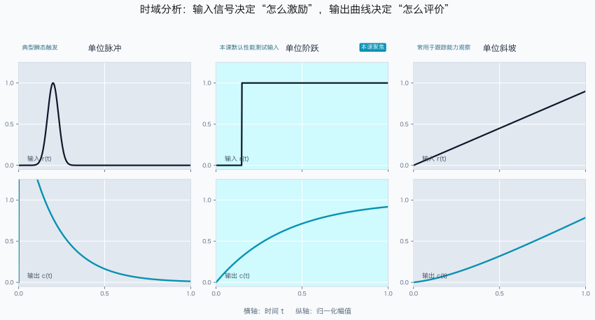
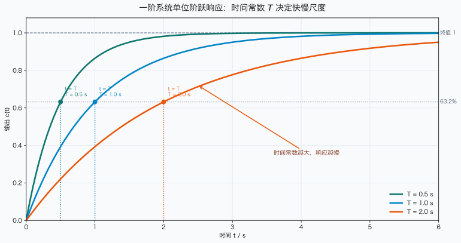
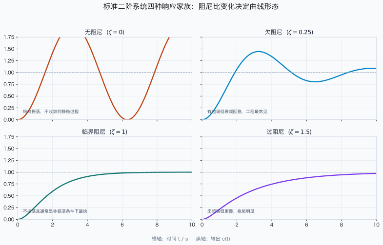
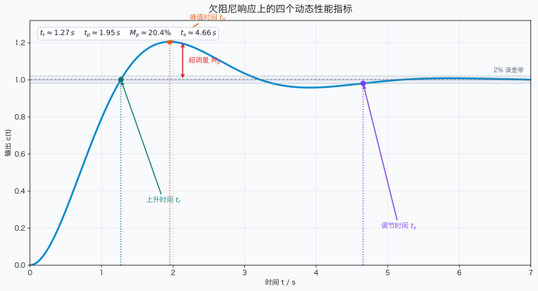
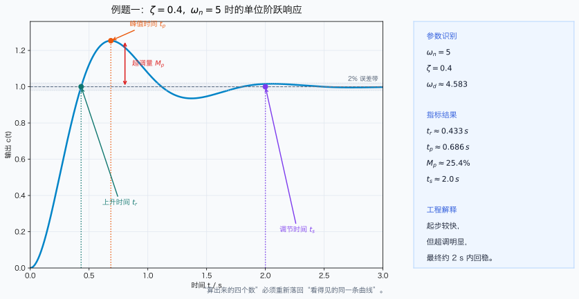

# 单元 2-2 教师课堂讲义 | 时域响应基础——90分钟课堂版

> 课时：90 分钟  
> 适用对象：教师课堂授课、板书组织、媒体调度  
> 使用方式：以现有学生讲义为知识真值来源，本稿只保留课堂主线、关键推导、板书结构与图形调用点。

## 一、课堂定位与关键衔接

### 1.1 上节课到本节课

- 上节课 `2-1` 已经完成闭环传递函数建模，学生知道“系统结构不同，传递函数不同”。
- 本节课要把“传递函数是什么”推进到“传递函数会带来怎样的响应曲线”，完成从结构表达走向动态性能表达。
- 课堂开场建议直接说清一句话：上一课解决“怎么写系统”，这一课解决“系统写出来以后，动态表现怎么判断”。

### 1.2 本节课的唯一主线

围绕以下链条展开：

$$
\text{输入信号} \rightarrow \text{输出响应曲线} \rightarrow \text{动态性能指标} \rightarrow \text{极点参数解释}
$$

教师要反复提醒学生：本节不是背四个指标，而是学会从曲线中提取信息，并把这些信息连接到参数和极点。

### 1.3 与后续课程的衔接

- 本节末尾必须收束到：$M_p$、$t_p$、$t_s$ 等量并不是孤立数字，而是在为 `2-3` 的频率响应直觉和后续根轨迹设计积累语言。
- 建议收尾语：今天我们把“曲线看起来快不快、冲不冲”变成了可计算的语言，下一步要把这种语言继续推广到更一般的分析与设计。

## 二、90分钟课堂节奏建议

| 时间 | 课堂任务 | 教师动作 | 学生任务 | 媒体/板书 |
|------|----------|----------|----------|-----------|
| 0-8 min | 桥接引入 | 回顾 `2-1`，抛出“稳定是否等于性能好” | 口头判断两条曲线谁更好 | 板书 1；典型输入与响应对比图 |
| 8-18 min | 时域分析对象与典型输入 | 说明为何聚焦单位阶跃响应 | 说出脉冲、阶跃、斜坡的差异 | 典型输入与响应对比图 |
| 18-32 min | 一阶系统阶跃响应 | 完成一阶系统核心推导 | 跟写分式展开与时间常数含义 | 板书 2；时间常数对比图 |
| 32-50 min | 二阶系统标准型与响应家族 | 解释 $\omega_n$、$\zeta$、$\omega_d$ | 归纳谁管快慢、谁管振荡 | 板书 3；二阶响应家族图 |
| 50-68 min | 四个动态性能指标 | 讲定义、给常用公式、点出适用条件 | 从图上定位四指标 | 动态性能指标标注图；板书 4 |
| 68-82 min | 标准对象例题 + 船舶对象对照 | 一题顺推，一题比较 | 完成参数识别与对象差异判断 | 顺推示例图、船舶案例对照图；板书 5 |
| 82-90 min | 总结与铺垫 | 收束成“曲线—指标—参数”三层关系 | 回答本节带走哪三句判断 | 板书 6 |

## 三、课堂核心推导与讲解重点

### 3.1 一阶系统单位阶跃响应

课堂上应完整保留这一段推导，因为它是学生第一次把“响应曲线”与显式时间表达式对应起来：

$$
G(s)=\frac{K}{Ts+1}, \qquad R(s)=\frac{1}{s}
$$

于是

$$
C(s)=\frac{K}{s(Ts+1)}
$$

做部分分式展开：

$$
\frac{K}{s(Ts+1)}=\frac{A}{s}+\frac{B}{Ts+1}
$$

比较系数得

$$
A=K, \qquad B=-KT
$$

因此

$$
C(s)=\frac{K}{s}-\frac{KT}{Ts+1}
$$

逆变换得到

$$
c(t)=K(1-e^{-t/T}), \qquad t\ge 0
$$

课堂讲解重点不是运算技巧本身，而是两句话：

- $T$ 越大，指数衰减越慢，响应越慢；
- 当 $t=T$ 时，输出达到终值的 $63.2\%$，所以时间常数是系统快慢的直接度量。

### 3.2 二阶系统标准型与欠阻尼响应

本节课堂上不宜把附录 B 的全部推导搬上黑板，但必须保留标准型和结果的来路，至少讲清：

$$
\Phi(s)=\frac{\omega_n^2}{s^2+2\zeta\omega_n s+\omega_n^2}
$$

当 $0<\zeta<1$ 时为欠阻尼情形，此时

$$
\omega_d=\omega_n\sqrt{1-\zeta^2}
$$

欠阻尼单位阶跃响应可写成

$$
c(t)=1-\frac{e^{-\zeta\omega_n t}}{\sqrt{1-\zeta^2}}
\sin(\omega_d t+\phi)
$$

其中

$$
\phi=\arccos \zeta
$$

教师要明确告诉学生：

- $\omega_n$ 决定“速度基准”；
- $\zeta$ 决定“振荡与超调倾向”；
- $\omega_d$ 决定“真正振起来时的角频率”。

如果学生问“公式怎么来的”，课堂上只回答“由部分分式分解和配方可得，完整过程见附录”，不要在主线中展开冗长代数。

### 3.3 四个动态性能指标

这部分不必逐项做最繁琐推导，但要保留公式来路与适用前提。建议课堂上统一强调：以下公式默认针对标准欠阻尼二阶系统。

$$
t_r=\frac{\pi-\arccos\zeta}{\omega_n\sqrt{1-\zeta^2}}
$$

$$
t_p=\frac{\pi}{\omega_n\sqrt{1-\zeta^2}}
$$

$$
M_p=e^{-\frac{\zeta\pi}{\sqrt{1-\zeta^2}}}\times 100\%
$$

$$
t_s \approx \frac{4}{\zeta\omega_n}
$$

课堂解释建议按“谁主要受谁控制”组织，而不是逐项孤立讲：

- $M_p$ 主要由 $\zeta$ 决定；
- $t_p$ 与 $\omega_d$ 直接相关；
- $t_s$ 主要由 $\zeta\omega_n$ 决定；
- 这些指标共同描述“快不快、冲不冲、多久稳下来”。

### 3.4 两道例题的课堂作用

#### 例题一：顺推

已知

$$
\Phi(s)=\frac{25}{s^2+4s+25}
$$

课堂目标不是机械代数，而是引导学生先识别

$$
\omega_n=5, \qquad 2\zeta\omega_n=4 \Rightarrow \zeta=0.4
$$

再带入四指标公式。这里要强调“先认标准型，再算指标”的方法顺序。

#### 例题二：逆推

给定性能要求

$$
M_p\le 10\%, \qquad t_s\le 2s
$$

要求学生意识到：这已经不是“算一个数”，而是在“约束一片参数区域”。课堂上重点突出两步：

1. 由 $M_p$ 限制阻尼比下界；
2. 由 $t_s$ 限制自然频率下界。

这一题是本节迈向设计语言的关键，必须讲到“从指标回推参数”的工程意味。

## 四、建议板书

### 板书 1：开场桥接

```text
2-1：闭环传递函数
        ↓
2-2：响应曲线怎么看？
        ↓
曲线 → 指标 → 参数
```

### 板书 2：一阶系统

```text
G(s)=K/(Ts+1), R(s)=1/s
C(s)=K/[s(Ts+1)]
c(t)=K(1-e^{-t/T})
T：时间常数，决定快慢
```

### 板书 3：二阶系统标准型

```text
Φ(s)=ω_n^2/(s^2+2ζω_ns+ω_n^2)
ω_n：快慢基准
ζ：阻尼品质
ω_d=ω_n√(1-ζ^2)
```

### 板书 4：四指标公式

```text
t_r=(π-arccosζ)/(ω_n√(1-ζ^2))
t_p=π/(ω_n√(1-ζ^2))
M_p=e^[-ζπ/√(1-ζ^2)]×100%
t_s≈4/(ζω_n)
```

### 板书 5：例题方法

```text
顺推：标准型识别 → 参数 → 指标
逆推：性能要求 → ζ, ω_n约束 → 参数区域
```

### 板书 6：结尾收束

```text
看曲线
  ↓
会算指标
  ↓
能解释参数与极点
```

## 五、课堂需调用或补画的图形

### 图形调用：典型输入信号与输出响应对比



用途：开场建立“时域分析就是直接看时间过程”的直觉。

### 图形调用：一阶系统时间常数变化对比



用途：讲时间常数时调用，不建议黑板重画全图，只需在黑板上补一个简化阶跃曲线并标出 $T$。

### 图形调用：二阶系统四种典型响应形态



用途：帮助学生把层0直觉与层1条件对应起来。教师口头点明“稳定不等于无超调”。

### 图形调用：动态性能指标标注图



用途：讲 $t_r$、$t_p$、$M_p$、$t_s$ 时调用。若需要板书补图，只画一条欠阻尼曲线并标四个量的位置，不必重复画坐标细节。

### 图形调用：已知参数求指标示例图



用途：例题一讲解时使用，帮助学生把“公式算出的量”和“曲线上看到的量”对应起来。

### 图形调用：船舶对象时域对照（资源库）

调用资源库：
- `course-content/resource-library/ship-control-cases/sections/3.1-船舶航向控制时域分析实例.md`
- `course-content/resource-library/ship-control-cases/sections/3.2-船舶横摇减摇鳍控制时域分析实例.md`
- `course-content/resource-library/ship-control-cases/sections/3.3-船载稳定平台控制系统时域分析实例.md`

用途：例题二或总结前使用，强调“同一时域语言可跨对象复用”，并帮助学生把快慢、振荡和指标适用性放回真实工程对象，而不是提前展开设计区域推导。

## 六、课堂提醒

- 不要把大量时间耗在附录 B 的长推导上，课堂只保留足够支撑公式可信度的骨架。
- 一阶系统是本节唯一建议完整板书的推导；二阶系统更适合“标准型 + 结果 + 物理解释”。
- 四指标部分要多做“从图上读义”的动作，避免学生误以为本节只是公式记忆。
- 两段例题/对照的分工要清楚：前一段负责“会算”，后一段负责“会比较、会判断”。
- 最后一两分钟务必回到主线：本节真正学会的是“从曲线到指标，再到参数解释”的分析方式。
