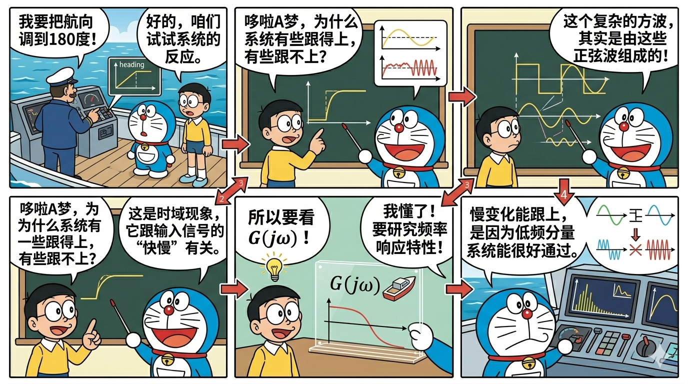
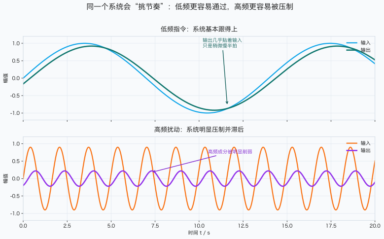
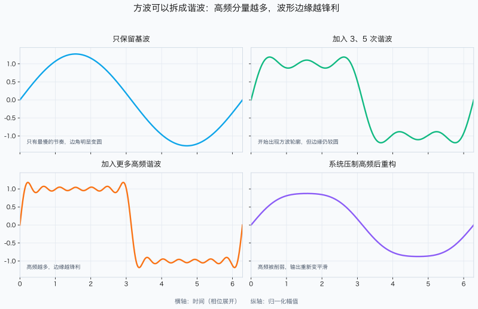
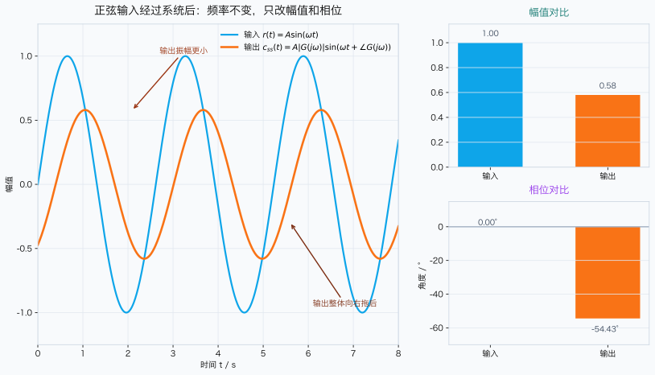
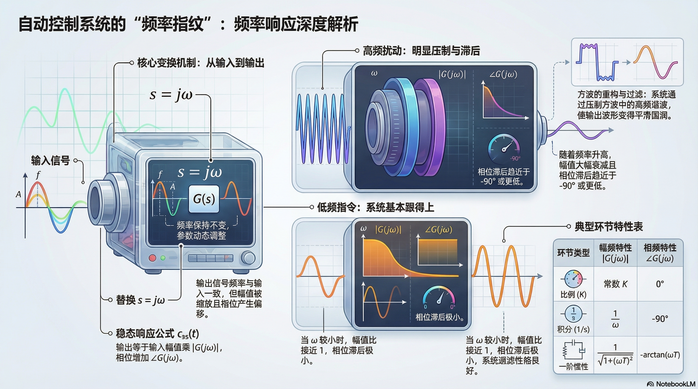

# 单元 2-3 | 频率响应基础与 Bode 图初步——从时域现象到频域图形入口

- **层级**：模块 2 理论主线 · 第三课
- **学时**：90 分钟
- **知识类型**：[X] 跨域型
- **前置基础**：已掌握传递函数、典型环节以及一/二阶系统的时域响应，能够从响应曲线提取系统动态品质
- **后续课程**：2-4（Nyquist 图与频域指标入口）、3-4（极点作用与根轨迹综合实验中的频域观察）、3-5（零点引入与动态改善）、3-8（频域判别与跨域综合语言）
- **讲义定位**：本讲义将引导你建立以下主线认知：“系统为何对输入节奏具有选择性、正弦输入的特殊性、频率特性如何形成、$G(j\omega)$ 如何将时域现象翻译为频域语言，并初步绘制典型环节 Bode 图的基本骨架”，为后续 Nyquist 图、频域指标与频域判别奠定基础。

{fig-pos="H"}
图 1. 单元 2-3 导入封面图

---

## 一、引入：系统为何具有频率选择性

在上一课 `2-2` 中，我们学习了通过阶跃响应曲线来判断系统“快不快、冲不冲、多久能稳定”的方法。这一视角直面工程结果，至关重要。然而在实际工程观察中，我们会很快注意到另一个现象：

> 同一系统对不同“节奏”的输入，响应不尽相同。

仍以船舶航向控制为例。驾驶员缓慢将目标航向从 $10^\circ$ 调整至 $15^\circ$，属于**低频变化**；海浪、传感器噪声或机械抖动产生的快速扰动，则更接近**高频变化**。工程经验表明，一个“有效”的航向控制系统通常需要兼顾两点：

- 对驾驶员缓慢而明确的操纵意图，能够准确跟随；
- 对海浪导致的高频扰动，不应过度追随而引发振荡。

这说明系统不仅具有“时间维度上的表现”，还展现出“对不同频率成分的偏好”。换言之，系统并非对所有变化一视同仁，而是如同一段具有选择性的通道：某些节奏可顺畅通过，另一些会被显著抑制，还有些虽能通过却伴随相位滞后。

上节课讨论的阶跃响应，其实也已隐含了这一现象。因阶跃信号可视为多个频率成分叠加的结果，系统呈现出特定的阶跃响应曲线，本质上源自其对不同频率成分的不同处理。

因此，下一阶段的核心问题不再仅仅是“曲线形状如何”，而是更深入一步：

> 若将输入分解为不同频率的正弦分量，系统将如何分别处理它们？这些处理结果又如何重组为我们熟悉的时域响应？

这正是**频率响应**所要解决的问题。本讲将首先建立频率域分析的基础对象与语言：正弦稳态响应、频率特性、幅值变化、相位变化与核心表达 $G(j\omega)$；继而将其翻译为典型环节的 Bode 图直觉与基础手绘骨架。

{width=100%}
图 2. 船舶航向系统对低频指令与高频扰动的不同反应示意

若想自行复现上述低频/高频对比图，请参阅附录 C 中的 `(2.1.1.command-vs-disturbance.m)` 脚本。

---

## 二、核心内容

### 2.1 从时域问题到频域问题的过渡

在 `2-2` 中，我们利用阶跃信号研究系统随时间展开的响应过程。该方法特别适用于回答“最终结果是否理想”。但若进一步追问“系统为何呈现此种表现”或“它为何能跟随慢变化而难以跟上快变化”，仅凭时域曲线便显不足。

此时，更细致的观察方式自然浮现：不必一次性地审视整条输入曲线，而先探讨一个基础问题：

> 若输入本身即为频率固定的正弦波，系统将如何响应？

之所以选择正弦波作为起点，非因其简单，而是其具备两条重要的性质：

第一，正弦波天然携带明确的频率 $\omega$，因而能清晰表达“变化快慢”。$\omega$ 小，表明变化慢；$\omega$ 大，表明变化快。  
第二，对线性定常系统，正弦输入在暂态分量消褪后，输出依然保持**同一频率**，仅幅值与相位发生改变。这使得系统对“特定频率”的处理方式可被独立考察。

因此，频域分析并非另辟蹊径，而是将时域曲线中混杂的不同节奏拆解观察。其关注的核心不再是“某一时刻的输出值”，而是：

- 该频率分量会被放大还是衰减；
- 该频率分量会超前还是滞后；
- 各频率分量经过系统处理后，叠加重构形成什么样的时域现象。

由此，你需要建立一个新的认识：  
**时域响应描述全局整体现象，频率响应则揭示系统处理不同节奏分量所遵循的规则。**  
二者非竞争关系，而是描述同一系统的两种等价视角。

表 1. 时域分析与频域分析对照

| 观察视角 | 核心问题 | 典型对象 | 最直接回答的问题 |
|----------|----------|----------|------------------|
| 时域     | 输出随时间如何展开 | 阶跃响应、脉冲响应 | 动态快慢、超调大小、稳定时间 |
| 频域     | 不同频率分量如何通过系统 | 正弦稳态响应、频率特性 | 哪些节奏易于通过、哪些被抑制、滞后程度如何 |

### 2.2 为何需要基于傅里叶思想展开

若系统仅面对单一频率的正弦输入，频域分析自然易于理解。但真实工程系统中，输入远不止纯正弦波：阶跃、方波、锯齿波、周期扰动、非周期指令等均属常见。要将频域分析方法推广应用至此类复杂信号，必须借助傅里叶思想。

对**周期信号**，傅里叶级数表明：可将其拆解为若干个不同频率的正弦或余弦分量。  
对**非周期信号**，傅里叶变换表明：可将其理解为连续频域内各频率分量的叠加积分。

该数学表述形式虽长，但在控制学课程中，关键不在于推演完整的积分过程，而是建立下述逻辑脉络：

1. 复杂信号可分解为不同频率分量；
2. 系统对每个频率分量作出独立响应；
3. 各分量响应叠加，构成最终的时域输出。

为更直观地说明此逻辑，先考察方波信号。方波虽非单一频率信号，但可以分解出基波及若干奇次谐波。若系统对高频谐波衰减明显，则方波通过系统后，尖锐边缘变得平滑，波形显得圆润。更进一步，阶跃信号亦可借助“周期趋于无穷的方波极限”来理解，这意味着在时域中观察到的“起步陡度、边缘锐利程度、响应延迟”等特性，其实都与系统如何处理高频分量密切相关。

这正是本讲最重要的跨域桥梁之一：

> 阶跃响应的特定形态，并非神秘地“自行形成”，而是源自系统对其构成频率分量所作出的差异性处理。

{width=100%}
图 3. 方波谐波分解与系统滤波后重构效果示意

若想亲身观察“谐波成分越多，波形边缘越锋利；高频分量被抑制后，波形重新变得平滑”的现象，请运行附录 C 中的 `(2.2.1.square-wave-harmonics.m)` 脚本。

表 2. 由复杂信号到频率响应的认知链

| 环节 | 需回答的问题 | 本课要求 |
|------|--------------|----------|
| 频率分解 | 复杂信号由哪些频率分量构成 | 建立概念，不要求大量推导训练 |
| 单频响应 | 特定频率正弦输入在系统下的响应 | 必须掌握 |
| 响应重构 | 各频率分量输出叠加后为何形成已知时域现象 | 必须建立直观理解 |

### 2.3 正弦输入为何导出“同频输出”

现聚焦至基本场景。设系统传递函数为 $G(s)$，输入为角频率 $\omega$ 的正弦信号：

$$
r(t)=A\sin(\omega t)
$$

对于线性定常系统，暂态分量消褪后，稳态输出可表达为

$$
c_{ss}(t)=A|G(j\omega)|\sin\bigl(\omega t+\angle G(j\omega)\bigr)
$$

此式极为重要，因它直接揭示了频率响应的本质：

- **输出频率不变**，仍为 $\omega$；
- **输出幅值受缩放**，比例因子为 $|G(j\omega)|$；
- **输出相位发生偏移**，变化量为 $\angle G(j\omega)$。

换言之，系统并未将输入频率凭空转变为另一频率，它仅执行两项操作：

1. 改变该频率分量的强度；
2. 改变该频率分量在时域中的相对时间位置。

从工程直观角度，这两点均易理解：

- 若 $|G(j\omega)|>1$，说明该频率分量被放大；
- 若 $|G(j\omega)|<1$，说明该频率分量被衰减；
- 若 $\angle G(j\omega)<0$，说明输出相对于输入滞后；
- 若 $\angle G(j\omega)>0$，说明输出相对于输入超前。

于是，“系统偏好何种节奏、抗拒何种节奏”得以具体量化。频率响应不再是抽象标语，而成为一张可按频率查阅的“规则表”。

{width=100%}
图 4. 正弦输入与正弦稳态输出的幅值/相位对比

若欲自行调整频率、幅值或时间常数，观察幅值与相位如何变化，请运行附录 C 中的 `(2.3.1.sine-steady-response.m)` 脚本。

#### 2.3.1 典型物理解释示例

将输入视为“驾驶员缓慢修正航向”的操作节奏，低频分量即为系统应密切跟随的部分；若输入视为“海浪/噪声引起的快速抖动”，高频分量则不应当同等对待。  
因此，$|G(j\omega)|$ 与 $\angle G(j\omega)$ 不仅是数学量，它们直接体现了系统面对不同频率扰动时的工程策略。

### 2.4 频率特性、幅频特性与相频特性

既然系统对每个频率 $\omega$ 均可给出“幅值缩放比 + 相位偏移量”的回应，将这些回复依频率顺序排列，便形成系统的**频率特性**。

对传递函数 $G(s)$，将 $s$ 替换为 $j\omega$，即得频率特性：

$$
G(j\omega)
$$

此为关于频率 $\omega$ 的复变函数。其模与相位对应两个关键量：

$$
M(\omega)=|G(j\omega)|
$$

$$
\varphi(\omega)=\angle G(j\omega)
$$

其中：

- $M(\omega)$ 称**幅频特性**，表征频率分量通过系统时被放大或衰减的程度；
- $\varphi(\omega)$ 称**相频特性**，表征频率分量在时间轴上被提前或滞后的程度。

此时，建议将“频率特性”视为按频率索引的规则表，同时接受一点新事实：此套规则将在本讲首次绘成 `Bode` 图的基本骨架。`2-4` 课程并非从零绘图，而是将本讲初步可见的 `Bode` 图进一步拓展至 `Nyquist` 图形式、双图对照及频域性能指标入口。

#### 2.4.1 典型例子：一阶惯性环节

考虑一阶惯性环节

$$
G(s)=\frac{1}{Ts+1}
$$

代入 $s=j\omega$，得

$$
G(j\omega)=\frac{1}{1+j\omega T}
$$

由复数模与相位可知

$$
|G(j\omega)|=\frac{1}{\sqrt{1+(\omega T)^2}}
$$

$$
\angle G(j\omega)=-\arctan(\omega T)
$$

以上两公式清晰地揭示了一阶惯性环节的频率选择性：

- 当 $\omega T \ll 1$ 时，$|G(j\omega)| \approx 1$，相位接近 $0^\circ$，系统几乎无差别地传递该频率分量；
- 当 $\omega T = 1$ 时，幅值下降为 $1/\sqrt{2}$，相位约 $-45^\circ$，系统出现显著滞后；
- 当 $\omega T \gg 1$ 时，$|G(j\omega)| \approx 1/(\omega T)$，相位趋近 $-90^\circ$，高频分量被强烈抑制。

表 3. 一阶惯性环节对不同频率的典型响应

| 频率区间 | 幅值特征 | 相位特征 | 直观解释 |
|----------|----------|----------|----------|
| $\omega T \ll 1$ | 接近 1 | 接近 $0^\circ$ | 缓慢变化几乎未受影响 |
| $\omega T \approx 1$ | 明显下降 | 明显滞后 | 系统“跟不上变化节奏” |
| $\omega T \gg 1$ | 大幅衰减 | 接近 $-90^\circ$ | 快速波动被强烈阻拦 |

AI 融入点  
先独立判断：设一阶惯性环节中 $\omega T$ 分别取值 $0.1, 1, 10$，哪一个频率最易通过？哪一个最易被抑制？写下预测理由。之后询问 AI：“针对 $G(s)=1/(Ts+1)$，若 $\omega T=0.1,1,10$，相应的 $|G(j\omega)|$ 与 $\angle G(j\omega)$ 大约是多少？这些数值如何解释系统对不同变化速率指令的跟随能力？”最后对比 AI 回答与自身预测，检验“幅值衰减”与“相位滞后”物理含义的理解程度。

#### 2.4.2 为何采用 Bode 图表达频率特性

若频率特性仅停留于公式表列，依然难以对“低频段表现、高频段趋势、转折位置”形成整体判断。故本课必须将频率特性首次图形化。最常用方法即绘制 `Bode` 图。

不采用线性频率坐标而采用对数频率坐标，理由有三：

1. 控制系统频率范围常跨越多个数量级，线性坐标系易致低频区过度拥挤、高频区过度拉伸；
2. 在对数坐标系中，每个十倍频程所占宽度相同，转折频率与斜率变化更易直观识别；
3. 幅值取对数分贝表示后：

$$
L(\omega)=20\log_{10}|G(j\omega)|
$$

则可获得额外优势：串联环节的幅值“相乘”转为分贝坐标系中的“简单相加”。这是后续推导典型环节叠加和构建手绘骨架的关键便利。

因此，`Bode` 图在本讲的地位绝非“附带参考图”，而是频率特性作为客观物理对象首次直观可见的入口。至少应能辨识以下三要素：

- 低频端幅值趋势；
- 转折（拐点）频率位置；
- 高频端整体变化方向。

#### 2.4.3 典型环节的 Bode 初步判断与基础手绘骨架

本讲不涉及复杂组合对象的精细绘制训练，但需建立典型环节的初级 `Bode` 图识别能力。暂不追求细节，仅把握最显著的首层特征：

| 典型环节 | 第一判断 |
|----------|----------|
| 比例环节 | 幅值整体平移，相位基本无变化 |
| 积分环节 | 低频端即以渐降斜率为主，相位长期保持滞后状态 |
| 微分环节 | 幅值随频率升高而增大，相位始终超前 |
| 一阶惯性环节 | 低频段基本通过，转折频率后开始明显抑制高频 |
| 振荡环节 | 在固有频率附近明显敏感，过渡区域变化比一阶环节更丰富 |

因此，本讲的基础手绘骨架仅包含四步：

1. 将传递函数表示为标准典型环节乘积形式；
2. 按从低到高排序，标注转折频率；
3. 判断最低频段的起始渐近线性质；
4. 按“过一转折点，斜率增减固定阶次”的顺序绘制首层渐近骨架。

该骨架的意义，并非替代精确数字绘图，而是让你第一次把“频率特性”从抽象的公式对象转变为可直接绘制、观察、比较的图形对象。

### 2.5 从 $G(s)$ 到 $G(j\omega)$：为何允许 $s=j\omega$ 的替换

阅读至此，可能产生一个自然疑问：  
在 `2-1` 中我们学习拉普拉斯变换，为何到了频域分析，变量忽然变为 $j\omega$？

此问题若不澄清，后续所有频域公式都可能被看作“经验性替换”。实际上，核心原因并不复杂。拉普拉斯变量可写作

$$
s=\sigma+j\omega
$$

其中：

- $\sigma$ 代表指数增长率/衰减率；
- $\omega$ 代表正弦振荡频率。

当我们关心**正弦稳态响应**时，关注对象不再是含有指数增长/衰减的指数项，而是“频率固定、幅值稳定”的纯正弦振荡成分。此时真正需要保留的是虚轴上的频率信息，故归约至

$$
s=j\omega
$$

这并不表示拉普拉斯变换被傅里叶变换替代，而是：

> 在研究正弦稳态响应时，我们将复频域（s-域）问题局限至纯虚轴上，从而获得与角频率直接对应的频率特性。

因此，$G(j\omega)$ 可理解为：  
**传递函数 $G(s)$ 在“纯正弦振荡”这一观察线上所呈现出的取值。**

这一联系务必要真正理解。它将 `2-1` 建立的传递函数对象与本章建立的频率特性对象，紧密连接为同一条主线。一旦理解此处，便不会将频域分析视为另辟蹊径，而是明白：

- `2-1` 传授我们如何描述系统对象；
- `2-2` 展示该对象在时间维度的动态行为；
- `2-3` 揭示该对象对不同频率刺激的响应规则。

### 2.6 频率分量重构：为何频域分析能解释阶跃响应

若本章仅停留于“正弦输入 → 同频正弦输出”，力度仍显不足。因最终最令人熟悉的仍是阶跃响应曲线，此处必须回接到熟悉的对象上，将两种视角重新衔接。

根据傅里叶思想，复杂信号可分解为多个频率分量。系统对各分量进行幅值缩放与相位偏移后，各分量输出再相加，构成最终时域响应。因此，时域曲线中原来看似直观却难以解析的现象，现在有了新的解释：

- 若高频分量被显著抑制，输出波形更平滑，边缘过渡更缓慢；
- 若某频率附近幅值衰减较小，系统更容易保留该节奏特征；
- 若高频分量相位滞后较大，输入中的快速变化部分将被明显拖慢；
- 若较多频率分量都能较好通过，输出将更逼近原输入。

这表示，时域中的“快慢、平滑度、延迟”并非与频域无关的孤立现象，而是频率分量处理规则在时域上的综合表现。

表 4. 从频率响应规则理解时域现象

| 频域规则 | 在时域中的常见表现 |
|----------|-------------------|
| 高频分量明显衰减 | 输出曲线边缘变钝，过渡圆滑 |
| 低频分量几乎顺利通过 | 缓慢指令能够较好跟随 |
| 相位滞后随频率增大 | 输出整体相对于输入出现延迟 |
| 不同频率对应的幅值差异显著 | 原始波形被“重新塑形” |

至此，本章的逻辑脉络已完整连贯：

> 复杂信号可分解成频率分量组合；系统对各分量执行独立处理；经处理后的分量再叠加重构为我们从时域观测的输出曲线。

此逻辑链条一旦确立，`2-4` 中的 `Nyquist` 图绘制、双图对比与频域指标计算，对你而言便不是从零开始的全新内容，而是将本章已建立的 `Bode` 图与频域特性进一步推进和深化。

---

## 三、例题精解

### 3.1 例题一：单一正弦输入下的稳态输出

**题目**

设系统传递函数为

$$
G(s)=\frac{1}{0.5s+1}
$$

输入信号为

$$
r(t)=2\sin(4t)
$$

求系统的稳态输出表达式，并解释结果反映出系统的何种频率响应特性。

**解题思路**

此题重点不在于复杂运算，而是要求你将“代入 $j\omega$”这一步骤与“幅值缩放 + 相位偏移”的物理意义对应起来。步骤固定如下：

1. 识别输入信号频率 $\omega=4$ rad/s；
2. 计算 $G(j4)$；
3. 求其模与相位角；
4. 写出稳态输出表达式；
5. 用工程术语解释“为何幅值变小、为何出现滞后”。

**详细求解**

将 $s=j\omega$ 代入传递函数：

$$
G(j\omega)=\frac{1}{1+0.5j\omega}
$$

对 $\omega=4$ rad/s：

$$
G(j4)=\frac{1}{1+2j}
$$

计算模：

$$
|G(j4)|=\frac{1}{\sqrt{1^2+2^2}}=\frac{1}{\sqrt{5}}\approx 0.447
$$

计算相位角：

$$
\angle G(j4)=-\arctan 2 \approx -63.4^\circ
$$

输入振幅为 2，故输出稳态振幅为

$$
2\times 0.447 \approx 0.894
$$

得到稳态输出表达式

$$
c_{ss}(t)=0.894\sin(4t-63.4^\circ)
$$

**结论与工程意义**

该结果明确展示两点：

- 输出频率仍为 4 rad/s，系统不改变信号节奏；
- 输出振幅被压缩至原输入约 44.7%，且相位滞后约 $63.4^\circ$。

对一阶惯性环节，$\omega =4$ rad/s（对应 $\omega T =4\times 0.5=2$）已非低频范围，系统明显无法精准跟随，故既削弱输入强度，又造成时间位置滞后。将此系统类比为航向控制对象，则意味着对较快的操纵节奏只能“部分跟随，且慢半拍”。

### 3.2 例题二：多频输入的“重塑”过程

**题目**

系统仍为

$$
G(s)=\frac{1}{s+1}
$$

输入包含两个频率成分：

$$
r(t)=\sin(0.2t)+0.5\sin(5t)
$$

求稳态输出表达式，并简述输出为何主要保留低频分量。

**解题思路**

由于系统线性，输入中各正弦分量均可独立通过系统，输出为各分量输出之和。本题旨在练习“分量独立处理、输出重构”的频域思维方式，而非引入新运算技巧。

**详细求解**

对低频分量 $\omega_1=0.2$：

$$
G(j0.2)=\frac{1}{1+0.2j}
$$

其模为

$$
|G(j0.2)|=\frac{1}{\sqrt{1+0.2^2}}\approx 0.981
$$

相位为

$$
\angle G(j0.2)=-\arctan 0.2 \approx -11.3^\circ
$$

此分量对应的稳态输出约

$$
0.981\sin(0.2t-11.3^\circ)
$$

对高频分量 $\omega_2=5$：

$$
G(j5)=\frac{1}{1+5j}
$$

其模为

$$
|G(j5)|=\frac{1}{\sqrt{26}}\approx 0.196
$$

相位为

$$
\angle G(j5)=-\arctan 5 \approx -78.7^\circ
$$

输入第二项振幅为 0.5，故其对应输出振幅约

$$
0.5\times 0.196\approx 0.098
$$

第二项输出近似

$$
0.098\sin(5t-78.7^\circ)
$$

系统整体稳态输出为

$$
c_{ss}(t)\approx 0.981\sin(0.2t-11.3^\circ)+0.098\sin(5t-78.7^\circ)
$$

**结论与工程意义**

该结果极具代表性。低频分量几乎完整通过，高频分量则被大幅衰减，且伴随显著相位滞后。故输出波形中，低频成分占据主导地位，高频抖动仅存微量残留。  
这正是“复杂信号经过系统后被重塑”的直接证据。

AI 融入点  
暂不求助 AI，自行判断：若将例题二中高频成分从 $0.5\sin(5t)$ 改为 $0.5\sin(20t)$，输出波形会更接近原信号还是更平滑？写下判断理由。之后向 AI 描述：“针对 $G(s)=1/(s+1)$，当输入信号中包含的较高频率成分从 5 rad/s 提高至 20 rad/s，为何输出信号会进一步丢失高频细节？”最后用自己的语言阐述：决定“波形平滑度”变化的主要因素，究竟是频域中的哪个量？

### 3.3 例题总结与方法归纳

并列观察上述两例，可更清晰地提炼本章所要建立的方法链：

- **单频输入**：剖析系统对某特定频率的处理；
- **多频输入**：将各频率分量分别处理后叠加；
- **回归时域**：理解原始波形为何会因系统响应而被“重新塑造”。

因此，本章虽包含较多公式，但本质上并非“套用公式的课程”，而是“构建对象语言的课程”。真正需要掌握的，并非某一组具体数值，而是一条可迁移至后续课程的思维脉络：

> 先探析输入包含哪些频率分量，再考察系统如何分别响应各分量，最后观察这些分量响应如何在时域中合成整体现象。

---

## 四、工程视角：控制系统为何不宜盲目追踪高频扰动

在真实船舶航向控制过程中，驾驶者关注的是“船舶能否按预定意图稳定转向”，而非“系统是否对每一瞬时的微小扰动都做出即时响应”。若控制系统将海浪引起的高频摆动、罗经短暂噪声或执行机构的细微抖动都视为重要指令去严格追踪，将导致舵角频繁快速改变，不仅增大能耗，加剧机械磨损，甚至恶化乘坐体验。

因此，工程上常期望系统具备“有选择性的敏感”：对低频、代表任务意图的指令分量保持充分响应；对高频、代表扰动或噪声的变化则予以适度抑制。**频率响应**恰恰是描述此类工程判断的专用语言。  
这提醒我们，控制系统设计不能简单追求“速度越快、灵敏度越高便越好”，而必须明确分辨“哪些变化值得响应、哪些扰动应当滤除”。学习频率特性，本质上是在训练这种具备边界意识的工程判断能力。

---

## 五、章节小结与课程衔接

### 5.1 核心结论整理

1. **频域分析并非替代时域分析，而是将混杂在时域整体现象中的复杂行为拆分为按频率逐一审察的规则。**
2. **正弦信号是频域分析的天然测试对象**，因线性定常系统对其稳态输出将保持同频，仅改变幅值与相位。
3. **频率特性 $G(j\omega)$ 是传递函数 $G(s)$ 在虚轴上的取值**，其模对应幅频特性，其辐角对应相频特性。
4. **复杂信号可视为多个不同频率分量的叠加**，系统对它们分别处理，各输出分量再叠加重构为最终时域信号。
5. **一阶惯性环节天生呈现“低频易过、高频易阻”的选频特性**，此特性将在本章首次以 `Bode` 图骨架形式图形化展示。

### 5.2 课程体系衔接

- `2-1` 将系统对象表达为传递函数，回答“对象如何描述”；  
- `2-2` 通过时域响应呈现“对象在时间维度如何动态演变”；  
- 本章 `2-3` 进一步说明“对象对不同频率刺激如何分别响应”；  
- `2-4` 将在现有 `Bode` 图基础上引入 `Nyquist` 图、双图对比及频域指标入口；  
- 模块 3 继续将这些频域对象应用于极点结构、零点作用、频域稳定性判别及跨域综合设计分析。

> **一句话总结**：本章关键不在于记住公式数目，而是确立如下认知：你在时域中观察到的整体响应，本质上是系统对各频率分量进行独立处理后重新组合而成的综合结果。

---

{fig-pos="H"}
图 5. 本讲频率响应对象与 Bode 首轮骨架信息图总结

---

## 附录 A | 为何正弦输入的稳态输出仍为同频正弦

本附录提供本章最关键的一项推导支撑，以论证正文的核心结论：

> 对线性定常系统，正弦输入的暂态过程结束之后，稳态输出仍保持相同频率的正弦形式。

为简洁起见，将正弦信号写作复指数形式。设输入为

$$
r(t)=\Re\bigl\{Ae^{j\omega t}\bigr\}
$$

其中 $\Re\{\cdot\}$ 表示取实部。对线性定常系统，若输入复数形式为 $Ae^{j\omega t}$，则系统输出的复数形式可表达为

$$
\tilde c(t)=G(j\omega)Ae^{j\omega t}
$$

令

$$
G(j\omega)=|G(j\omega)|e^{j\varphi(\omega)}
$$

则有

$$
\tilde c(t)=A|G(j\omega)|e^{j\bigl(\omega t+\varphi(\omega)\bigr)}
$$

取实部，得到稳态输出

$$
c_{ss}(t)=A|G(j\omega)|\cos\bigl[\omega t+\varphi(\omega)\bigr]
$$

若原输入本取正弦表达形式，仅差一个固定的 $\pi/2$ 相位偏移。故系统对该频率成分的处理最终可概括为：

- 频率保持恒定；
- 幅值缩放 $|G(j\omega)|$ 倍；
- 相位增加 $\varphi(\omega)$。

此即频率响应能够成立的数学根基，也是本课程后续所有频域“对象语言”的出发点。

---

## 附录 B | 典型环节频率特性速查表与简要计算

你在 `2-1` 已接触典型环节。本章任务是将这些传递函数对象统一翻译为频域表达式。最直接的方式：将各环节中的 $s$ 均替换为 $j\omega$，然后分别求模与相位角。

先提供速查表，再简要展示计算逻辑。

### B.1 速查表

| 典型环节 | 传递函数 $G(s)$ | 频率特性 $G(j\omega)$ | 幅频特性 $|G(j\omega)|$ | 相频特性 $\angle G(j\omega)$ | 直观判断 |
|----------|-----------------|------------------------|---------------------------|-------------------------------|----------|
| 比例环节 | $K$ | $K$ | $|K|$ | $0^\circ$（默认 $K>0$） | 所有频率等比例通过 |
| 积分环节 | $\dfrac{1}{s}$ | $\dfrac{1}{j\omega}$ | $\dfrac{1}{\omega}$ | $-90^\circ$ | 低频强，高频弱 |
| 微分环节 | $s$ | $j\omega$ | $\omega$ | $+90^\circ$ | 高频强，低频弱 |
| 一阶惯性环节 | $\dfrac{1}{Ts+1}$ | $\dfrac{1}{1+j\omega T}$ | $\dfrac{1}{\sqrt{1+(\omega T)^2}}$ | $-\arctan(\omega T)$ | 低频基本通过，高频明显抑制 |
| 振荡环节 | $\dfrac{\omega_n^2}{s^2+2\zeta\omega_n s+\omega_n^2}$ | $\dfrac{\omega_n^2}{(\omega_n^2-\omega^2)+j2\zeta\omega_n\omega}$ | $\dfrac{\omega_n^2}{\sqrt{(\omega_n^2-\omega^2)^2+(2\zeta\omega_n\omega)^2}}$ | $-\operatorname{atan2}(2\zeta\omega_n\omega,\omega_n^2-\omega^2)$ | 在固有频率附近可能出现峰值或陷落，频带选择性更复杂 |

此表并非死记硬背的“口令”，而是助你形成初步判断：何类环节更注重低频、何类环节对高频更敏感、何类环节会逐渐拖延相位。

### B.2 比例环节

比例环节传递函数形式最简单：

$$
G(s)=K
$$

替换 $s=j\omega$ 后没有任何实际变化：

$$
G(j\omega)=K
$$

故其幅值为

$$
|G(j\omega)|=|K|
$$

若通常假设 $K>0$，相位为

$$
\angle G(j\omega)=0^\circ
$$

说明比例环节**无频率选择性**。无论输入节奏快慢，仅按相同比例放大或缩小。

### B.3 积分环节

积分环节传递函数

$$
G(s)=\frac{1}{s}
$$

代入 $s=j\omega$：

$$
G(j\omega)=\frac{1}{j\omega}
$$

利用 $1/j=-j$ 可写作

$$
G(j\omega)=-\frac{j}{\omega}
$$

因此幅值为

$$
|G(j\omega)|=\frac{1}{\omega}
$$

相位为

$$
\angle G(j\omega)=-90^\circ
$$

说明频率越低，积分环节放大作用越强；频率越高，其放大作用越弱。所以**积分环节天然对低频分量更敏感**。

### B.4 微分环节

微分环节传递函数

$$
G(s)=s
$$

代入 $s=j\omega$：

$$
G(j\omega)=j\omega
$$

因此幅值为

$$
|G(j\omega)|=\omega
$$

相位为

$$
\angle G(j\omega)=+90^\circ
$$

恰与积分环节相反：频率越高，放大作用越强；频率越低，放大作用越弱。故**微分环节对高频变化更敏感**。

### B.5 一阶惯性环节

一阶惯性环节传递函数

$$
G(s)=\frac{1}{Ts+1}
$$

代入 $s=j\omega$：

$$
G(j\omega)=\frac{1}{1+j\omega T}
$$

对于复数 $1+j\omega T$，其模为

$$
\sqrt{1+(\omega T)^2}
$$

所以幅值为

$$
|G(j\omega)|=\frac{1}{\sqrt{1+(\omega T)^2}}
$$

相位等于分母复角度的负值：

$$
\angle G(j\omega)=-\arctan(\omega T)
$$

总结如下：

- 当 $\omega T \ll 1$ 时，幅值接近 1，相位接近 $0^\circ$；
- 当 $\omega T \gg 1$ 时，幅值接近 0，相位趋近 $-90^\circ$。

这正是正文所述“低频基本无阻、高频逐渐被阻”的来源。

### B.6 振荡环节

标准振荡环节表达式：

$$
G(s)=\frac{\omega_n^2}{s^2+2\zeta\omega_n s+\omega_n^2}
$$

将 $s=j\omega$ 代入后，注意 $(j\omega)^2=-\omega^2$，于是

$$
G(j\omega)=\frac{\omega_n^2}{-\omega^2+j2\zeta\omega_n\omega+\omega_n^2}
 =\frac{\omega_n^2}{(\omega_n^2-\omega^2)+j2\zeta\omega_n\omega}
$$

因此分母模为

$$
\sqrt{(\omega_n^2-\omega^2)^2+(2\zeta\omega_n\omega)^2}
$$

幅值为

$$
|G(j\omega)|=\frac{\omega_n^2}{\sqrt{(\omega_n^2-\omega^2)^2+(2\zeta\omega_n\omega)^2}}
$$

相位由分母复数辐角决定：

$$
\angle G(j\omega)=-\operatorname{atan2}\bigl(2\zeta\omega_n\omega,\omega_n^2-\omega^2\bigr)
$$

此公式蕴含以下关键信息：

- 当 $\omega$ 远低于固有频率 $\omega_n$，环节近似为“低频可顺利通过”；
- 当 $\omega$ 接近 $\omega_n$ 时，幅值可能出现明显变化，相位快速下降；
- 当 $\omega$ 远高于 $\omega_n$，幅值下降显著，系统难以跟随高频改变。

在后续课程 `2-4` 中，上述关系将进一步推进至 `Nyquist` 图形式、双图对照及频域指标量化；但本章已为这些对象语言奠定 `Bode` 图初步的图形化基础。

---

## 附录 C | MATLAB/Octave 复现代码

> 以下代码仅保留基础复现逻辑，便于你直接修改参数、重新运行以观察响应变化。如使用 Octave，请确保已安装并加载 `control` 工具包。

### C.1 `(2.1.1.command-vs-disturbance.m)`

```matlab
T = 1.2;
omega_low = 0.45;
omega_high = 3.8;
t = linspace(0, 20, 3000);

r_low = sin(omega_low * t);
r_high = 0.9 * sin(omega_high * t);

mag_low = 1 / sqrt(1 + (omega_low * T)^2);
phi_low = -atan(omega_low * T);
mag_high = 1 / sqrt(1 + (omega_high * T)^2);
phi_high = -atan(omega_high * T);

c_low = mag_low * sin(omega_low * t + phi_low);
c_high = 0.9 * mag_high * sin(omega_high * t + phi_high);

subplot(2,1,1);
plot(t, r_low, 'LineWidth', 1.4); hold on;
plot(t, c_low, 'LineWidth', 1.8);
title('低频：输入与输出');
grid on;
legend('输入', '输出');

subplot(2,1,2);
plot(t, r_high, 'LineWidth', 1.4); hold on;
plot(t, c_high, 'LineWidth', 1.8);
title('高频：输入与输出');
grid on;
legend('输入', '输出');
```

### C.2 `(2.2.1.square-wave-harmonics.m)`

```matlab
t = linspace(0, 2*pi, 3000);
base = (4/pi) * sin(t);
three = (4/pi) * (sin(t) + sin(3*t)/3 + sin(5*t)/5);
seven = (4/pi) * (sin(t) + sin(3*t)/3 + sin(5*t)/5 + sin(7*t)/7 + sin(9*t)/9 + sin(11*t)/11);
filtered = 0.95 * sin(t) + 0.18 * (4/pi/3) * sin(3*t);

subplot(2,2,1); plot(t, base, 'LineWidth', 1.8); title('只保留基波'); grid on;
subplot(2,2,2); plot(t, three, 'LineWidth', 1.8); title('加入 3、5 次谐波'); grid on;
subplot(2,2,3); plot(t, seven, 'LineWidth', 1.8); title('加入更多高频谐波'); grid on;
subplot(2,2,4); plot(t, filtered, 'LineWidth', 1.8); title('系统压制高频后重构'); grid on;
```

### C.3 `(2.3.1.sine-steady-response.m)`

```matlab
T = 0.8;
omega = 2.4;
t = linspace(0, 8, 2000);

r = sin(omega * t);
mag = 1 / sqrt(1 + (omega * T)^2);
phi = -atan(omega * T);
c = mag * sin(omega * t + phi);

plot(t, r, 'LineWidth', 1.5); hold on;
plot(t, c, 'LineWidth', 2.0);
title('正弦输入与稳态输出');
grid on;
legend('输入', '输出');
```

### C.4 `(B.1.typical-frequency-characteristics.m)`

```matlab
% Octave users: pkg load control
s = tf('s');
w = logspace(-2, 2, 800);

Gk = 2;
Gi = 1 / s;
Gd = s;
G1 = 1 / (0.5*s + 1);
G2 = 25 / (s^2 + 4*s + 25);

subplot(2,1,1);
hold on;
semilogx(w, squeeze(abs(freqresp(Gk, w))), 'LineWidth', 1.6);
semilogx(w, squeeze(abs(freqresp(Gi, w))), 'LineWidth', 1.6);
semilogx(w, squeeze(abs(freqresp(Gd, w))), 'LineWidth', 1.6);
semilogx(w, squeeze(abs(freqresp(G1, w))), 'LineWidth', 1.6);
semilogx(w, squeeze(abs(freqresp(G2, w))), 'LineWidth', 1.6);
title('典型环节幅频特性');
grid on;

subplot(2,1,2);
hold on;
semilogx(w, squeeze(angle(freqresp(Gk, w))) * 180/pi, 'LineWidth', 1.6);
semilogx(w, squeeze(angle(freqresp(Gi, w))) * 180/pi, 'LineWidth', 1.6);
semilogx(w, squeeze(angle(freqresp(Gd, w))) * 180/pi, 'LineWidth', 1.6);
semilogx(w, squeeze(angle(freqresp(G1, w))) * 180/pi, 'LineWidth', 1.6);
semilogx(w, squeeze(angle(freqresp(G2, w))) * 180/pi, 'LineWidth', 1.6);
title('典型环节相频特性');
grid on;
legend('比例', '积分', '微分', '一阶惯性', '振荡环节');
```
