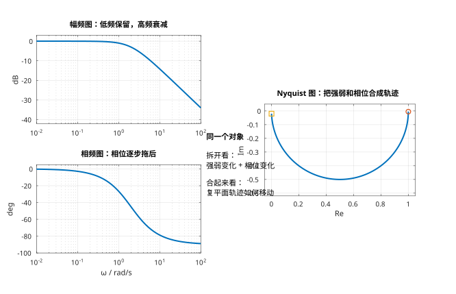
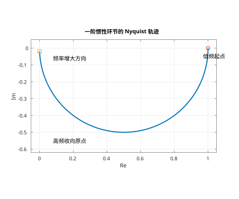
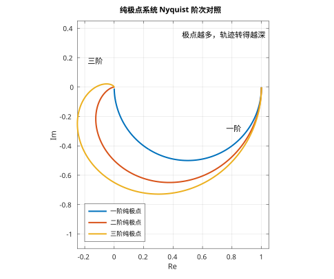
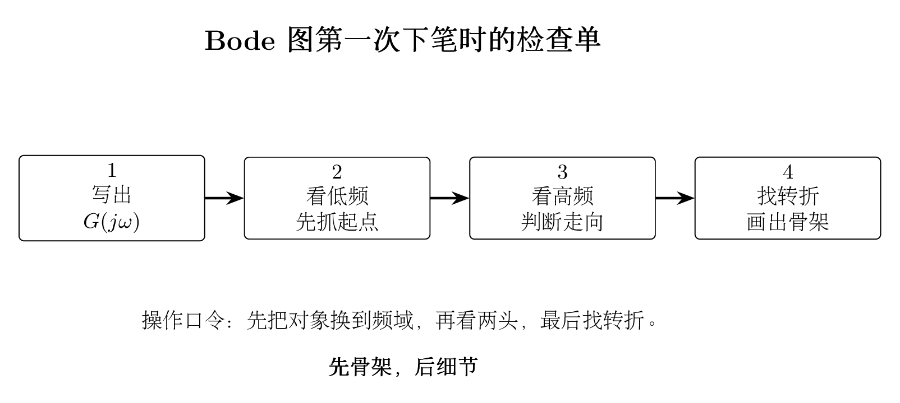
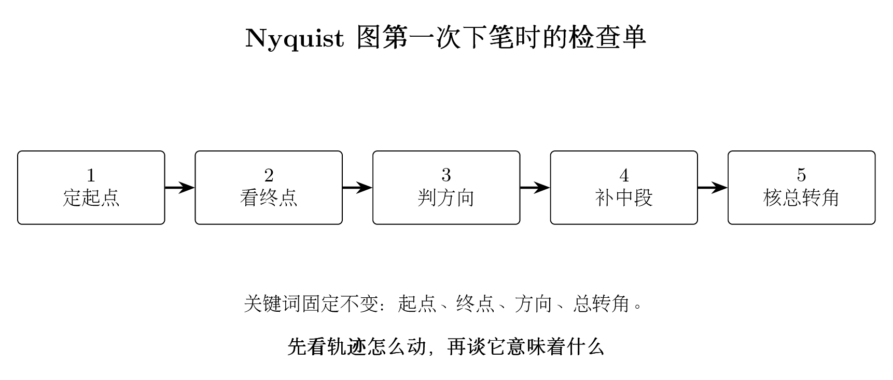

# 单元 2-4 | Nyquist 图与频域指标——将 Bode 图收敛为轨迹、裕度与反向识别

- **层次**：模块2 理论主线 · 第四课
- **学时**：90分钟
- **知识类型**：[X] 跨域型
- **前置**：已掌握传递函数、典型环节和结构图的基本概念，理解正弦稳态响应、频率特性、$G(j\omega)$ 的物理意义，以及典型环节 Bode 图的第一轮骨架
- **后续**：3-4（极点作用与根轨迹综合实验中的频域观察）、3-5（零点引入与动态改善）、3-8（频域判别与跨域综合语言）
- **讲义定位**：本讲义将引导你将上一讲建立的 Bode 图对象进一步推进到 Nyquist 轨迹、频域指标入口和基础反向识别，使"频率特性"真正成为可读、可画、可反看模型的图形对象。


---

## 一、引入：为什么已有 Bode 图，还需要 Nyquist 图

通过 `2-3` 课程，你已经完成了一项重要任务：频率特性 $G(j\omega)$ 不再只是一个抽象的复数，而是能够分解为两张图来观察：

- **幅频图**显示不同频率成分被放大或削弱的程度；
- **相频图**显示不同频率成分被滞后的相位变化。

这种方法已经足以回答许多问题，例如：
- 低频成分能否顺利通过系统？
- 高频成分是否被有效抑制？
- 转折大约从哪个频率开始？
- 典型环节的第一轮骨架应该如何绘制？

然而，随着进一步学习，很快会出现新的需求。工程师不仅关心"幅度如何变化"和"相位如何变化"这两个分离的问题，更想知道：
- 当频率从低到高扫描时，这个复数点在复平面上究竟如何移动？
- 同一套频率特性在两种图形表达下能否相互验证？
- 图形上"距离危险边界还有多远"能否用直观的量来表示？
- 面对基础的 Bode 图时，能否先识别出它类似于什么标准对象？

因此，`2-4` 的任务不是重新讲解 Bode 图，而是将上一讲的图形对象进一步推进：

> **从"分解观察频率特性"，发展到"将其合成为复平面轨迹，并首次读出频域指标"。**

所以，本讲的核心不是"再学一套新图"，而是让你认识到：
- Bode 图和 Nyquist 图观察的是同一个 $G(j\omega)$；
- 前者适合将幅值与相位分开观察；
- 后者适合将幅值与相位重新合成为轨迹观察；
- 两者共同服务于后续的频域判断，而非彼此孤立的两套知识体系。

---

## 二、明确本课程的学习边界

为避免 `2-3` 与 `2-4` 内容重叠，首先明确本课程"应学什么、不应学什么"。

**表：`2-3` 与 `2-4` 课程分工**

| 课次 | 本课负责解决的问题 | 本课不展开讨论的内容 |
|------|-------------------|----------------------|
| `2-3` | 什么是频率响应；为何正弦输入能建立频域对象；典型环节 Bode 图第一轮骨架 | Nyquist 图细节、频域指标、判稳、完整反识别 |
| `2-4` | 为何同一对象还需画成 Nyquist 轨迹；如何从双图中读出频域指标；如何进行最小反向识别 | Nyquist 判据、Bode 判稳、闭环结论、频域校正设计 |

本讲聚焦于四条主线：
1. 将 Bode 图和 Nyquist 图统一到同一频率特性对象；
2. 学会读取纯极点系统 Nyquist 图的起点、终点、方向和转角；
3. 学会在图上读出截止频率、穿越频率、带宽频率、相位裕度和增益裕度；
4. 学会进行"先识别对象轮廓，再给出参数粗略判断"的最小反向识别。

你会发现，这四条主线都服务于同一个目标：

> **模块2的"图形对象"不能仅停留在理解层面，还需推进到绘制、比较、反向识别模型的阶段。**

---

## 三、Nyquist 图：将随频率变化的复数直接描绘为轨迹

### 3.1 定义：它与 Bode 图观察的是同一对象

频率特性的数学对象保持不变，仍然是：

$$
G(j\omega)=|G(j\omega)|e^{j\phi(\omega)}
$$

**Bode 图**将其分解为两张图：
- 一张显示 $|G(j\omega)|$ 随频率的变化规律；
- 一张显示 $\phi(\omega)$ 随频率的变化规律。

**Nyquist 图**则不分解。它直接将每个频率点对应的复数值绘制在复平面上：

$$
G(j\omega)=\operatorname{Re}\{G(j\omega)\}+j\operatorname{Im}\{G(j\omega)\}
$$

当 $\omega$ 从低到高连续变化时，复数点就在复平面上连续移动，形成一条轨迹。
这条轨迹就是 **Nyquist 图**。

所以初次接触 Nyquist 图时，首先要建立的不是稳定性判据，而是以下等价关系：

**表：同一频率特性的两种图形表达**

| 图形 | 主要观察对象 | 最适合回答的问题 |
|------|------------|------------------|
| Bode 图 | 幅值、相位分别随频率的变化 | 哪个频率段开始转折？幅值和相位各自如何变化？ |
| Nyquist 图 | 复数点在复平面上的轨迹 | 幅值变化和相位变化合成后，整体轨迹走向如何？ |

{width=100%}

这组对照图中最重要的教学信息不是"多了一张图"，而是：

> **同一组低频、高频、转折和滞后信息，在 Bode 图上分开展示，在 Nyquist 图上合成展示。**

### 3.2 首次阅读 Nyquist 图：固定四个观察步骤

初次阅读 Nyquist 图时，建议按照以下四个固定步骤进行：

1. **起点**：$\omega \to 0$ 时，轨迹从哪里出发；
2. **终点**：$\omega \to \infty$ 时，轨迹收敛到什么位置；
3. **方向**：频率升高时，轨迹朝哪个方向移动；
4. **总转角**：整条轨迹大致旋转了多少角度。

这四个步骤之所以重要，是因为它们分别对应四类系统信息：

| 观察步骤 | 对应的问题 | 背后的系统信息 |
|----------|------------|----------------|
| 看起点 | 慢变化输入最初如何被系统处理 | 低频增益的大小与相位 |
| 看终点 | 高频成分最终被抑制到什么程度 | 高频衰减的极限值 |
| 看方向 | 相位整体朝哪个方向滞后 | 相位变化的总体趋势 |
| 看总转角 | 为何有些轨迹旋转幅度更大 | 极点结构导致的累计相位滞后量 |

只要稳定遵循这四步顺序，Nyquist 图就不再是"难以捉摸的曲线"，而变为一套有固定阅读方法的图形对象。

---

## 四、纯极点系统的 Nyquist 图：轨迹旋转规律

### 4.1 一阶惯性环节：从正实轴出发，向下收敛至原点

首先观察最简单的一阶惯性环节：

$$
G(s)=\frac{1}{Ts+1}
$$

其频率特性为：

$$
G(j\omega)=\frac{1}{1+j\omega T}
=\frac{1-j\omega T}{1+(\omega T)^2}
$$

因此：
- 当 $\omega \to 0$ 时，$G(j\omega)\to 1$，轨迹从实轴正向的 $1$ 附近出发；
- 当 $\omega \to \infty$ 时，$|G(j\omega)|\to 0$，轨迹最终收敛至原点；
- 相位从 $0^\circ$ 逐渐滞后至 $-90^\circ$，所以轨迹向下半平面弯曲。

{width=60%}

这张图应与上一讲的 Bode 图直觉联系起来看：
- 低频幅值接近 1，对应于起点在 $(1,0)$ 附近；
- 高频幅值趋近 0，对应于终点回到原点；
- 相位逐步滞后至 $-90^\circ$，对应于轨迹向下旋转。

也就是说：

> **Nyquist 图没有引入新的事实，它只是将 Bode 图中"幅值如何变化、相位如何变化"合成为一条运动路径。**

### 4.2 极点越多，轨迹通常旋转越深

对纯极点系统而言，随着频率升高，相位滞后会持续累积。
极点数量越多，累积滞后越大，因此在复平面上的轨迹整体旋转幅度也越大。

{width=60%}

可将图中的典型对象简化为下表：

| 对象类型 | 起点 | 高频极限 | 典型总体趋势 |
|----------|------|----------|------------|
| 一阶惯性 $\dfrac{1}{Ts+1}$ | 正实轴单位附近 | 原点 | 向下弯曲，最终收敛至原点 |
| 积分环节 $\dfrac{1}{s}$ | 负虚轴远处 | 原点 | 沿负虚轴向原点收敛 |
| 两个实极点 $\dfrac{1}{(T_1s+1)(T_2s+1)}$ | 正实轴单位附近 | 原点 | 向下半平面旋转更深，最终从负实轴附近逼近原点 |

本课程对"纯极点系统"的要求仅到此为止：
- 理解起点、终点、方向和转角；
- 建立"极点越多，总相位滞后越大，轨迹通常旋转越深"的直觉；
- **不**在此处升级为 Nyquist 稳定判据。

### 4.3 从 Bode 图反向验证 Nyquist 图：两者应能相互印证

如果某标准对象的 Bode 图显示：
- 低频能通过；
- 高频逐渐衰减；
- 相位持续变得更加滞后；

那么在 Nyquist 图上，你应该预期看到：
- 起点在正实轴一侧；
- 轨迹逐渐靠近原点；
- 随着频率升高逐步向下旋转。

这正是本课程最重要的"对照"能力：

> **同一对象在两张图上必须讲述同一件事。**

如果两张图提供的直觉相互矛盾，说明解读过程必定存在错误。

---

## 五、频域指标的初步引入：先学会读图，暂不作稳定性判断

### 5.1 为何需要"指标"

至此，你已经能够观察整体轨迹，并进行基本的双图对照。但在工程实践中，常常需要更凝练的量来回答：
- 图形距离"危险边界"还有多远？
- 哪个对象的余量更充足，哪个更紧张？
- 哪个频率是读图时最值得关注的参考点？

这就是本课程首次引入频域指标的原因。

特别要注意本课程的边界界定：

> **本节只讲解指标的定义、图上读取和基础计算，不直接将其升级为闭环系统结论、稳定性判据或校正设计准则。**

### 5.2 四个开环指标与一个闭环带宽入口

本课程先重点介绍四个开环指标：

1. **截止频率** $\omega_c$
   开环幅频图首次穿过 `0 dB` 线的频率，即：
   $$
   |G(j\omega_c)|=1
   $$

2. **穿越频率** $\omega_g$
   开环相频图达到 $-180^\circ$ 的频率，即：
   $$
   \angle G(j\omega_g)=-180^\circ
   $$

3. **相位裕度** $\gamma$
   在 $\omega_c$ 处距离 $-180^\circ$ 的相位差值：
   $$
   \gamma = 180^\circ + \angle G(j\omega_c)
   $$

4. **增益裕度** $K_g$
   在 $\omega_g$ 处，距离 `0 dB` 的增益倍数差：
   $$
   K_g = \frac{1}{|G(j\omega_g)|}
   $$
   若用 dB 表示，则为：
   $$
   K_g(\mathrm{dB}) = -20\log_{10}|G(j\omega_g)|
   $$

此外，本课程将**带宽频率** $\omega_b$ 作为系统响应速度的一个直观入口。
对于闭环频率特性 $T(j\omega)$，通常将幅值下降到低频值的 $\dfrac{1}{\sqrt{2}}$（即 `-3 dB`）处定义为带宽频率。它更侧重于"系统能跟上多快的输入变化"这类读图直觉。

**表：频域指标及其解读**

| 指标 | 图上如何查找 | 本课程仅允许达到的程度 |
|------|------------|--------------------|
| 截止频率 $\omega_c$ | 幅频图穿过 `0 dB` 线的位置 | 会读、会算、能与 Nyquist 图互相验证 |
| 穿越频率 $\omega_g$ | 相频图到达 $-180^\circ$ 线的位置 | 会读、会算、会查找增益裕度的读取点 |
| 相位裕度 $\gamma$ | 在 $\omega_c$ 处观察距离 $-180^\circ$ 的相位差值 | 能解释"余量大小"，不展开完整的闭环系统结论 |
| 增益裕度 $K_g$ | 在 $\omega_g$ 处观察距离 `0 dB` 的增益差值 | 能解释"再放大多少倍才会触及边界"，不作设计判断 |
| 带宽频率 $\omega_b$ | 闭环幅值降至 `-3 dB` 的位置 | 作为响应速度的初步入口，不展开更深入的映射关系 |

### 5.3 同一指标在 Nyquist 图上的几何意义

为什么要同时保留 Bode 图和 Nyquist 图？
因为这些指标在两种图上都能找到对应，只是表达方式不同。

**表：频域指标在双图上的解读方法**

| 指标 | 在 Bode 图上的读取方法 | 在 Nyquist 图上的几何直觉 |
|------|--------------------|----------------------------|
| $\omega_c$ | 幅值到达 `0 dB` 的频率 | 轨迹落在单位圆上的频率点 |
| $\omega_g$ | 相位到达 $-180^\circ$ 的频率 | 轨迹落在负实轴上的频率点 |
| $\gamma$ | $\omega_c$ 处距离 $-180^\circ$ 的相位差值 | 轨迹到负实轴危险方向还有多少"转角余量" |
| $K_g$ | $\omega_g$ 处距离 `0 dB` 的增益差值 | 轨迹在负实轴上距离 $(-1,0)$ 点还有多少"半径余量" |

这张表具有重要意义。它表明：

> **频域指标不是仅属于某一张图的技巧，而是同一频率特性在不同图形语言下的统一解读方法。**

---

## 六、简单组合对象的手工绘图入门

### 6.1 本课程的"手工绘图"涵盖范围

`2-3` 课程已完成典型环节 Bode 图的初步学习，因此本课程不会重复讲解"为何使用对数轴、为何使用 dB、典型环节的总体趋势"等内容。
本课程保留的手工绘图仅包含两项内容：
1. 将上一讲的典型环节骨架推进到**简单组合对象**；
2. 建立从 Bode 图过渡到 Nyquist 图的**绘图顺序**。

因此，本课程的关键词不是"高强度手绘"，而是：

> **先抓住极限与转折，再确保双图一致性。**

### 6.2 Bode 图绘图顺序：先定基线，再逐段调整斜率

对简单组合对象，首次手绘 **Bode 图**建议按照以下六步进行：

1. 将传递函数整理成标准因子乘积形式，先识别常数增益、积分环节和各个转折频率；
2. 绘制**基准线**。若存在积分环节 $\dfrac{1}{s^r}$，则先用
   $$
   L(\omega)=20\log_{10}K-20r\log_{10}\omega
   $$
   绘制第一个转折频率之前的幅频骨架。特别要记住：每个积分环节都使幅频图在 $\omega=1\ \text{rad/s}$ 处经过 `0 dB` 线，并从一开始就贡献 `-20 dB/dec` 的斜率；
3. 按从小到大的顺序标出所有转折点；
4. 每遇到一个一阶零点，斜率增加 `20 dB/dec`；每遇到一个一阶极点，斜率减少 `20 dB/dec`；
5. 再绘制相频图。原点积分首先给出固定的 $-90^\circ$ 起始相位，一阶极点在其转折频率附近再将相位往负方向滞后；
6. 最后仅在转折点附近作圆滑修正，不必一开始就追求精确曲线。



对学生而言，最容易遇到的困难不是"转折后斜率如何调整"，而是"第一笔应从哪条线开始"。因此，只要对象含有积分环节，就应先问自己：

> **我是否已经先用 $K/s^r$ 确定了 $\omega=1$ 处的基准点和初始斜率？**

### 6.3 Nyquist 图绘图顺序：先画正频率支，再标注关键点与渐近线

对 **Nyquist 图**，首次绘图建议按照以下六步进行：

1. 只先绘制正频率支 $\omega:0^+\to\infty$，不必一开始就完成全图；
2. 计算低频起点和高频终点，确认它们落入哪个象限，是有限点还是无穷远点；
3. 计算关键点：若要寻找与虚轴的交点，则令 $\operatorname{Re}\{G(j\omega)\}=0$；若要寻找与实轴的交点，则令 $\operatorname{Im}\{G(j\omega)\}=0$；
4. 将计算得到的关键频率点在图上标出，并标注对应的 $\omega$ 值；
5. 根据相位随频率的变化方向补充箭头；
6. 最后若系统包含积分环节或高阶极点，检查是否存在渐近线，避免将低频或高频端错误地画成"直接冲往原点"。



将两张检查单结合来看，你应该得到的不是两套孤立技巧，而是一个统一的工作流程：

- 先用 Bode 图弄清楚"幅值与相位各自如何变化"；
- 再用 Nyquist 图将这些变化合成为一条轨迹，并计算出关键点、标注出来；
- 最后用指标凝练出"距离边界还有多远"的信息。

若要将这两套流程真正落实到"能够独立手绘"的程度，可继续参考附录B与附录C。

---

## 八、例题精解

### 8.1 例题一：含积分环节的 Bode 图基准线绘制与骨架构建

设
$$
G_1(s)=\frac{5}{s(0.5s+1)}
$$

请手绘其 **Bode** 渐近线，并回答以下问题：

1. 幅频图的起始基线应从何处绘制；
2. 转折频率在哪个位置；
3. 转折前后斜率分别是多少；
4. 相频图的总体变化趋势应如何判断。

**解题思路**

本题的关键不在于"计算大量点"，而在于"先将基准项确定正确"。
由于对象同时包含常数增益和积分环节，不能将低频幅频图错误地画成水平线，而应先从 $K/s$ 出发建立骨架。

**详细求解**

首先整理为标准形式：
$$
G_1(j\omega)=\frac{5}{j\omega(1+j0.5\omega)}
$$

第一步观察基准项 $\dfrac{5}{j\omega}$。其幅值渐近线满足：
$$
L(\omega)=20\log_{10}5-20\log_{10}\omega
$$

因此在 $\omega=1\ \text{rad/s}$ 处，幅值大约为：
$$
20\log_{10}5\approx 14\ \text{dB}
$$
并且从一开始就具有 `-20 dB/dec` 的斜率。

第二步观察一阶极点 $(0.5s+1)$，其转折频率为：
$$
\omega_p=\frac{1}{0.5}=2\ \text{rad/s}
$$

因此幅频图应该绘制为：
- 当 $\omega<2$ 时，沿着基准线以 `-20 dB/dec` 斜率下降；
- 当 $\omega>2$ 时，再叠加一阶极点的影响，斜率变为 `-40 dB/dec`。

相频图按照"积分先提供固定相位，一阶极点再逐步滞后"的顺序思考：
- 积分环节先给出全频段约 $-90^\circ$ 的基础相位；
- 一阶极点在 $\omega=2\ \text{rad/s}$ 附近开始将相位进一步拉向 $-180^\circ$。

**结论与工程意义**

本题最重要的收获是：

> **只要对象包含积分环节，Bode 图的第一笔就必须先用 $K/s^r$ 确定基准线，而不是预先猜测"低频是否为水平线"。**

### 8.2 例题二：含积分环节时 Nyquist 图的渐近线与关键点

设
$$
G_2(s)=\frac{1}{s(s+1)^2}
$$

请手绘其正频率支 **Nyquist** 图，并回答：

1. 低频端为何不能简单地"沿虚轴向下走"，而需要先寻找渐近线；
2. 高频终点在什么位置；
3. 是否存在有限的与实轴交点；
4. 是否存在有限的与虚轴交点。

**解题思路**

本题特意选择了一个包含积分环节的对象。
目的不是将图画得非常精美，而是让你看到：一旦轨迹具有渐近线，仅观察起点和终点是不够的，必须进一步计算关键点。

**详细求解**

首先写出频率特性：
$$
G_2(j\omega)=\frac{1}{j\omega(1+j\omega)^2}
$$

将其分解为实部和虚部：
$$
\operatorname{Re}\{G_2(j\omega)\}=-\frac{2}{(1+\omega^2)^2}
$$
$$
\operatorname{Im}\{G_2(j\omega)\}=\frac{\omega^2-1}{\omega(1+\omega^2)^2}
$$

先观察低频端。对 $\omega\to 0^+$ 做近似展开：
$$
G_2(s)=\frac{1}{s}(1+s)^{-2}\approx \frac{1}{s}(1-2s)=\frac{1}{s}-2
$$

令 $s=j\omega$，得到：
$$
G_2(j\omega)\approx -2-\frac{j}{\omega}
$$

这说明当 $\omega\to 0^+$ 时，轨迹并非紧贴虚轴，而是沿着：
$$
\operatorname{Re}\{G(j\omega)\}\approx -2
$$
这条竖直渐近线，从下半平面的远处向上靠近。

再观察高频端。由于系统总阶次比分母高 `3` 阶：
$$
G_2(j\omega)\to 0
$$
轨迹最终回归原点附近。

接下来寻找与实轴的交点。令：
$$
\operatorname{Im}\{G_2(j\omega)\}=0
$$
得到：
$$
\omega^2-1=0 \Rightarrow \omega=1
$$

代入实部：
$$
\operatorname{Re}\{G_2(j1)\}=-\frac{2}{(1+1)^2}=-\frac{1}{2}
$$

因此在
$$
\left(-\frac{1}{2},\,0\right)
$$
处穿过实轴。

最后检查与虚轴的交点。令：
$$
\operatorname{Re}\{G_2(j\omega)\}=0
$$

但上述表达式对所有有限频率均恒为负值，因此**不存在有限的与虚轴交点**，整条正频率支始终停留在左半平面。

**结论与工程意义**

本题最重要的不是某个特定点，而是以下顺序：

> **存在积分环节时，先判断渐近线；要寻找与实轴交点，解 $\operatorname{Im}=0$；要寻找与虚轴交点，解 $\operatorname{Re}=0$。**

### 8.3 例题三：读取频域指标，暂不作闭环结论

设开环对象为
$$
G_3(s)=\frac{4}{s(0.5s+1)(0.2s+1)}
$$

使用图上定义和基础计算方法，读出：

- 截止频率 $\omega_c$
- 穿越频率 $\omega_g$
- 相位裕度 $\gamma$
- 增益裕度 $K_g$
- 带宽频率 $\omega_b$

**解题思路**

本题不是稳定性判断题，而是"读取指标题"。
因此仅执行两个步骤：
1. 根据定义确定应到哪张图上读取哪个量；
2. 使用标准计算公式进行最基础的数值核对。

**详细求解**

按照定义：
- $\omega_c$ 由开环幅频图过 `0 dB` 线的位置读取；
- $\omega_g$ 由开环相频图到达 $-180^\circ$ 线的位置读取；
- $\gamma$ 在 $\omega_c$ 处读取；
- $K_g$ 在 $\omega_g$ 处读取；
- $\omega_b$ 由闭环幅值下降到 `-3 dB` 线的位置读取。

对该对象使用数值计算脚本进行核对，可得到近似数值：
$$
\omega_c \approx 2.35\ \text{rad/s},\quad
\omega_g \approx 3.16\ \text{rad/s}
$$
$$
\gamma \approx 15.3^\circ,\quad
K_g \approx 1.75 \approx 4.86\ \text{dB}
$$
$$
\omega_b \approx 3.68\ \text{rad/s}
$$

**结论与工程意义**

本题在本课程允许达到的最远结论仅是：
- 这组频域指标表明该对象在当前参数下的相位裕度和增益裕度均不宽裕；
- 因此若要进行更成熟的频域稳定性判断，确实需要继续进入模块3与模块4；
- 但本课程先停止于"理解这些数值来自何处、分别表示什么"。

也就是说：

> **相位裕度和增益裕度在本节先被视为"距离边界还有多远"的初步表达语言，并非最终裁决依据。**

### 8.4 例题四：基础 Bode 图的最小化反向识别

现给定某对象的 Bode 图特征如下：

- 低频段幅频图大致平直，位置约在 `+6 dB`；
- 从 $\omega \approx 2\ \text{rad/s}$ 附近开始显著下降；
- 相频图从接近 $0^\circ$ 逐步滞后为负角；
- 无显著峰值。

请问：它最可能是哪一类标准对象？其静态增益和时间常数大约处于哪个量级？

**解题思路**

仍坚持"先识别对象，再估计量级"的原则。

**详细求解**

题目提供的四条线索已经足够：
1. 低频平直，表明低频能基本通过；
2. `+6 dB` 表明低频增益不在 `0 dB` 线，而更接近 $K \approx 2$；
3. 仅有一个明显转折，表明更像一阶惯性环节；
4. 无明显峰值，排除欠阻尼二阶对象的典型轮廓。

因此最合理的初步判断为：
$$
G(s)\approx \frac{K}{Ts+1}
$$

其中
$$
K \approx 2,\qquad T \approx \frac{1}{2}=0.5\ \text{s}
$$

**结论与工程意义**

这就是本节所述"基础反向识别"的完成标准：

- 先将对象类型识别正确；
- 再将参数量级估计正确；
- 但不在此节将其扩展为完整的系统辨识。

## 九、工程视角：为何工程师需要同时掌握两种图形方法

在实际工程中，系统不会只面对单一的理想输入信号。
例如，船舶航向控制系统既要跟随驾驶员缓慢的操舵指令，也要应对海浪、风扰和传感器噪声等复杂工况。
如果你只会逐点计算 $G(j\omega)$ 的数值，虽然也能得到结果，但很难快速回答以下更像实际工程判断的问题：

- 系统最敏感的频率段是什么？
- 哪个对象的稳定性余量明显更紧张？
- 哪个图形特征已经在提示"此处接近稳定性边界"？
- 如果只得到一张图形，你能否先识别出对象的大致类型？

这就是工程师需要同时掌握 Bode 图和 Nyquist 图的原因：

- **Bode 图**将问题分解，便于观察幅值与相位各自如何随频率变化；
- **Nyquist 图**将问题综合，便于观察整体轨迹如何靠近关键边界；
- 两者相互配合，才能使频率特性从"会计算一个点"提升为"会解读一个系统"。

所以，本讲表面上在学习绘制图形，实质上是在培养一种更成熟的观察习惯：

> **不再仅关注单个公式，而开始观察整张图形；不再仅关注单个点，而开始观察整条轨迹。**

---

## 十、本节内容总结与课程衔接

### 10.1 主要知识点总结

1. **Nyquist 图与 Bode 图观察的是同一频率特性 $G(j\omega)$。**
2. **Bode 图将幅值与相位分解观察，Nyquist 图将它们合成为轨迹观察。**
3. **首次读取纯极点系统 Nyquist 图时，应遵循"起点、终点、方向、总转角"的顺序。**
4. **本讲首次引入了截止频率、穿越频率、带宽频率、相位裕度和增益裕度等概念，但仅达到图形读取和基础计算的程度，尚未升级为稳定性判断或设计语言。**
5. **基础反向识别的完成标准是：先识别对象轮廓，再报告参数量级范围，不作完整的系统辨识。**

### 10.2 课程内容衔接

从模块2整体对象建立链的视角来看：

- `2-1` 建立控制系统的建模思想；
- `2-2` 建立控制对象的时域分析框架；
- `2-3` 建立控制对象的频域分析概念；
- `2-4` 则将频域分析真正收敛为图形表达方法。

进入模块3后，课程的关注点将从"图形如何绘制"转为更深入的问题：
- 为什么极点、零点、系统类型和相位特性会使图形呈现特定变化？
- 这些图形变化如何反过来服务于系统的结构和机理判断？

因此，`2-4` 处于"能够解读图形"与"能够运用图形"之间的重要过渡位置。

---


---

## 附录A｜本讲常用公式速查

### A.1 开环频域指标基本公式

**截止频率** $\omega_c$：
$$
|G(j\omega_c)|=1
$$

**穿越频率** $\omega_g$：
$$
\angle G(j\omega_g)=-180^\circ
$$

**相位裕度** $\gamma$：
$$
\gamma = 180^\circ + \angle G(j\omega_c)
$$

**增益裕度** $K_g$：
$$
K_g = \frac{1}{|G(j\omega_g)|}
$$
用 dB 表示时：
$$
K_g(\mathrm{dB}) = -20\log_{10}|G(j\omega_g)|
$$

### A.2 闭环带宽频率的初步定义

若闭环频率特性记为 $T(j\omega)$，则当：
$$
|T(j\omega_b)|=\frac{|T(0)|}{\sqrt{2}}
$$

时，对应的频率 $\omega_b$ 常作为带宽频率的初步入口。

> **注意：本讲仅要求理解其为"响应速度的频域读图量"，不展开更深入的映射关系。**

---

## 附录B｜Bode 图手工绘图的详细步骤与特殊情况

如果将 **Bode 图**手工绘图真正视为一个固定的工作流程，建议按以下顺序执行：

### B.1 标准绘图步骤

1. **先整理为标准形式**
   将对象写成"常数增益 × 原点因子 × 一阶因子 × 二阶因子"的连乘或连除形式。绘图前先明确：
   - 常数增益 $K$ 的数值
   - 原点零点/极点数量
   - 各个转折频率的位置
   - 是否存在欠阻尼二阶因子

2. **先确定幅频基准线**
   - 若仅包含常数增益 $K$，则幅频图起始线为一条水平线，高度为 $20\log_{10}K$
   - 若包含积分环节 $\dfrac{1}{s^r}$，则先用：
     $$
     L(\omega)=20\log_{10}K-20r\log_{10}\omega
     $$
     定出第一条骨架线
   - 这一步的关键是：先将"第一个转折点之前"的部分绘制正确

3. **将转折点按频率排序**
   绘图时必须按频率从小到大的顺序处理各转折点，不能按公式书写顺序。

4. **逐段调整斜率**
   典型影响规则如下：

   | 因子类型 | 对幅频渐近线的影响 |
   |----------|--------------------|
   | 一阶零点 $(1+s/\omega_z)$ | 过转折点后斜率增加 `20 dB/dec` |
   | 一阶极点 $\dfrac{1}{1+s/\omega_p}$ | 过转折点后斜率减少 `20 dB/dec` |
   | 二阶零点 $(1+2\zeta s/\omega_n + (s/\omega_n)^2)$ | 过转折点后斜率增加 `40 dB/dec` |
   | 二阶极点 $\dfrac{1}{1+2\zeta s/\omega_n + (s/\omega_n)^2}$ | 过转折点后斜率减少 `40 dB/dec` |
   | 原点零点 $s^m$ | 从一开始就贡献斜率，每个零点增加 `20 dB/dec` |
   | 原点极点 $\dfrac{1}{s^r}$ | 从一开始就贡献斜率，每个极点减少 `20 dB/dec` |

5. **再绘制相频图**
   - 原点积分 $1/s$：全频段先提供 $-90^\circ$ 的基础相位
   - 原点微分 $s$：全频段先提供 $+90^\circ$ 的基础相位
   - 一阶极点：在转折点附近逐步从 $0^\circ$ 过渡到 $-90^\circ$
   - 一阶零点：在转折点附近逐步从 $0^\circ$ 过渡到 $+90^\circ$
   - 二阶极点/零点：相位过渡幅度增大为 $\mp180^\circ$

6. **最后进行转折点修正**
   渐近线只是绘制骨架。实际曲线会在转折点附近圆滑过渡，一阶因子在转折点附近通常有约 `3 dB` 的偏差；欠阻尼二阶极点还可能出现明显幅值峰值。

### B.2 特别容易出现错误的三种情况

1. **含积分环节却将低频段绘制为水平线**
   这是最常见的绘图错误。只要系统包含原点极点，低频幅频图就不可能天然呈水平线。

2. **转折点频率顺序未正确排列**
   一旦转折点的先后顺序发生错误，后续斜率调整会全盘错乱。

3. **将相频图也画成"折线突变"**
   相频图应理解为"逐步过渡"的过程，不是到达转折点就骤然跳变。

### B.3 建议记忆的课堂口诀

> **先看 $K/s^r$ 确定基准线，再按转折点分段调整斜率；相位部分先放置原点因子，再让一阶、二阶因子依次叠加影响。**

---

## 附录C｜Nyquist 图手工绘图的详细步骤与特殊情况

**Nyquist 图**手工绘图最容易陷入"凭感觉描绘曲线"的误区。为避免这种情况，建议遵循以下固定步骤。

### C.1 标准绘图步骤

1. **先只处理正频率支**
   先绘制 $\omega:0^+\to\infty$ 对应的轨迹，再利用实系数系统关于实轴对称的特性补全完整图形。

2. **先计算两个端点**
   - 计算 $\omega\to 0^+$ 时的极限值
   - 计算 $\omega\to\infty$ 时的极限值
   判断它们是有限点、原点还是无穷远点。

3. **将实部和虚部分离**
   尽量整理为：
   $$
   G(j\omega)=\operatorname{Re}\{G(j\omega)\}+j\operatorname{Im}\{G(j\omega)\}
   $$
   因为后续关键点的计算都依赖这一步骤。

4. **寻找与实轴的交点**
   令：
   $$
   \operatorname{Im}\{G(j\omega)\}=0
   $$
   解出对应的频率，再将此频率代回实部求得交点坐标。

5. **寻找与虚轴的交点**
   令：
   $$
   \operatorname{Re}\{G(j\omega)\}=0
   $$
   解出对应的频率，再将此频率代回虚部求得交点坐标。

6. **判断轨迹移动方向**
   根据相位随频率增大的变化趋势为轨迹添加箭头。

7. **检查是否存在渐近线**
   若对象包含积分环节或某些高阶结构，轨迹的低频端或高频端可能沿某条直线逼近，并非简单地"冲向某个坐标轴"。

### C.2 渐近线的处理方法

当对象包含积分环节时，仅靠端点极限通常不够，需要在 $\omega\to 0^+$ 或 $\omega\to\infty$ 的区域进行近似展开。

基本思路是：

1. 先将 $G(s)$ 在对应的极限区域展开为前两项；
2. 再令 $s=j\omega$；
3. 观察展开式中常数项与主导项的组合形式，判断轨迹沿哪条直线逼近。

例如，若低频展开得到：
$$
G(j\omega)\approx a-\frac{j b}{\omega}\qquad (b>0)
$$

说明正频率支在低频端沿：
$$
\operatorname{Re}\{G(j\omega)\}\approx a
$$

这条竖直渐近线，从下方远处逼近。

若高频展开得到：
$$
G(j\omega)\approx \frac{c}{\omega^n}e^{j\theta}
$$

说明轨迹会按角度 $\theta$ 的方向收敛至原点，不一定沿实轴或虚轴靠近。

### C.3 特别容易出现错误的四种情况

1. **只会说"起点终点"，不会计算关键点**
   Nyquist 图一旦需要手绘，就不能省略与坐标轴交点的计算。

2. **将交点当作目测结果**
   与实轴的交点必须解 $\operatorname{Im}=0$，与虚轴的交点必须解 $\operatorname{Re}=0$。

3. **含积分环节时忽略渐近线**
   这会导致低频端绘制位置错误，进而使整条轨迹偏离正确走向。

4. **忽略正负频率的镜像对称关系**
   对于实系数系统，负频率支是正频率支关于实轴的镜像，无需再从头计算一遍。

### C.4 建议记忆的课堂口诀

> **先画正频率支，先计算端点，再求解交点；有积分先判断渐近线，最后利用对称性补全完整图形。**

---

## 附录D｜学生可复现的最小验证代码

若想验证例题三中的数值计算，可参考 `media/raw/2-4-fd-11-margin-entry.m` 文件，以下是其核心 **MATLAB / Octave** 代码。

```matlab
% Octave 用户若未预加载控制工具箱，请先执行：pkg load control
s = tf('s');
G = 4 / (s * (0.5 * s + 1) * (0.2 * s + 1));
T = feedback(G, 1);

[gm, pm, w_g, w_c] = margin(G);
gm_db = 20 * log10(gm);

w = logspace(-2, 2, 4000);
[mag, ~] = bode(T, w);
mag = squeeze(mag);
target = dcgain(T) / sqrt(2);
idx = find(mag <= target, 1, 'first');
w_b = w(idx);

fprintf('gm = %.6f, gm_db = %.6f dB\n', gm, gm_db);
fprintf('pm = %.6f deg\n', pm);
fprintf('w_g = %.6f rad/s\n', w_g);
fprintf('w_c = %.6f rad/s\n', w_c);
fprintf('w_b = %.6f rad/s\n', w_b);
```

这段代码的目的不是替代图形解读，而是帮助你验证：
**从图形上读取的频域指标，应与数值计算结果保持一致。**
