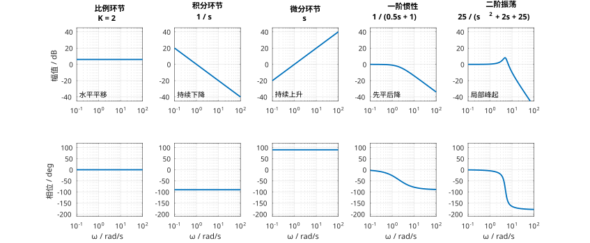
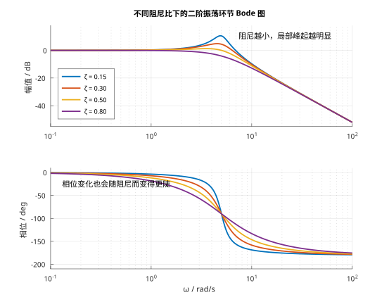

# 单元 2-4 | Nyquist图与频域指标入口——把 Bode 图收束为轨迹、裕度与反向识别

- **层次**：模块2 理论主线 · 第四课
- **学时**：90分钟
- **知识类型**：[X] 跨域型
- **前置**：已掌握传递函数、典型环节和结构图的基本含义，并理解正弦稳态响应、频率特性、$G(j\omega)$ 的物理意义以及典型环节 Bode 图的第一轮骨架
- **后续**：3-4（极点作用与根轨迹综合实验中的频域观察）、3-5（零点引入与动态改善）、3-8（频域判别与跨域综合语言）
- **讲义定位**：这份讲义将带你把上一讲已经建立的 Bode 图对象继续推进到 Nyquist 轨迹、频域指标入口和基础反向识别，使“频率特性”真正成为可读、可画、可反看模型的图形对象。


---

## 一、引入：为什么有了 Bode 图，还要再看 Nyquist 图

到 `2-3` 为止，你已经完成了一件很重要的事：
频率特性 $G(j\omega)$ 不再只是一个抽象复数，而已经能被拆成两张图来看：

- 幅频图告诉你，不同频率成分被放大还是被削弱；
- 相频图告诉你，不同频率成分被拖后了多少。

这一步已经足够回答很多问题，例如：

- 低频是不是基本能通过？
- 高频是不是被压制了？
- 转折大约从哪里开始？
- 典型环节的第一轮骨架应该怎样画？

但如果你继续往前走，很快就会遇到新的需求。工程师并不只想分别看“强弱怎么变”和“相位怎么变”，还想知道：

- 当频率从低到高扫过去时，这个复数点在复平面上到底怎么走？
- 同一套频率特性在两种图形语言下，能否互相核对？
- 图上的“离危险边界还有多远”能不能用一个直观量表示？
- 已经看到一张基础 Bode 图时，能不能反过来先认出它更像什么标准对象？

也就是说，`2-4` 的任务不是再重讲一遍 Bode 图，而是把上一讲的图形对象继续推进一步：

> **从“拆开看频率特性”，走到“把它合成一条复平面轨迹，并第一次读出频域指标”。**

所以，本讲的核心不是“又学一套新图”，而是让你意识到：

- `Bode` 图和 `Nyquist` 图看的是同一个 $G(j\omega)$；
- 前者适合把模与相位拆开看；
- 后者适合把模与相位重新合成轨迹看；
- 两者共同服务于下一步的频域判断，而不是彼此割裂的两套知识。

---

## 二、先把本课边界钉住

为了不让 `2-3` 和 `2-4` 互相重叠，先把本课“该学什么、不该学什么”说清楚。

表：`2-3` 与 `2-4` 的分工

| 课次 | 本课负责解决的问题 | 本课不负责展开的内容 |
|------|--------------------|----------------------|
| `2-3` | 什么是频率响应；为什么正弦输入能建立频域对象；典型环节 Bode 图第一轮骨架 | Nyquist 图细节、频域指标、判稳、完整反识别 |
| `2-4` | 为什么同一对象还要画成 Nyquist 轨迹；怎样从双图中读出频域指标；怎样做最小反向识别 | Nyquist 判据、Bode 判稳、闭环结论、频域校正设计 |

因此，本讲固定收束为四条主线：

1. 把 Bode 图和 Nyquist 图统一到同一个频率特性对象上；
2. 学会读纯极点系统 Nyquist 图的起点、终点、方向和转角；
3. 学会在图上读出截止频率、穿越频率、带宽频率、相位裕度和增益裕度；
4. 学会做“看图先认对象，再给粗粒度参数判断”的最小反向识别。

你会发现，这四条线都在服务同一件事：

> **模块2的“图形对象”不能只停留在会看，还要推进到会画、会比、会反看模型。**

---

## 三、Nyquist 图：把随频率变化的复数直接画成轨迹

### 3.1 定义：它和 Bode 图看的是同一个对象

频率特性的数学对象没有变化，仍然是

$$
G(j\omega)=|G(j\omega)|e^{j\phi(\omega)}
$$

`Bode` 图把它拆成两张图：

- 一张看 $|G(j\omega)|$ 随频率怎样变化；
- 一张看 $\phi(\omega)$ 随频率怎样变化。

`Nyquist` 图则不拆。它直接把每一个频率点对应的复数值画在复平面上：

$$
G(j\omega)=\operatorname{Re}\{G(j\omega)\}+j\operatorname{Im}\{G(j\omega)\}
$$

当 $\omega$ 从低到高连续变化时，复数点就在复平面上连续移动，于是形成一条轨迹。
这条轨迹就是 `Nyquist` 图。

所以第一次看 `Nyquist` 图时，你最应该先建立的不是判据，而是下面这个等价关系：

表：同一个频率特性的两种图形表达

| 图形 | 主要观察量 | 最擅长回答的问题 |
|------|------------|------------------|
| Bode 图 | 幅值、相位分别随频率变化 | 哪一段频率开始转折？幅值和相位各自怎样变化？ |
| Nyquist 图 | 复数点在复平面上的轨迹 | 幅值变化和相位变化合起来以后，整体向哪里走？ |


这组对照图最重要的教学信息不是“多了一张图”，而是：

> **同一组低频、高频、转折和拖后信息，在 Bode 图上是分开展示，在 Nyquist 图上是合成展示。**

### 3.2 第一次读 Nyquist 图，先固定四个观察动作

本课读 `Nyquist` 图时，固定先看四件事：

1. **起点**：$\omega \to 0$ 时，轨迹从哪里出发；
2. **终点**：$\omega \to \infty$ 时，轨迹向哪里收束；
3. **方向**：频率升高时，点朝哪边移动；
4. **总转角**：整条轨迹大致转了多少角度。

这四个动作之所以重要，是因为它们分别对应四类系统信息：

| 观察动作 | 对应的问题 | 背后信息 |
|----------|------------|----------|
| 看起点 | 慢变化输入最初怎样被系统处理 | 低频增益 |
| 看终点 | 高频成分最终被压到什么程度 | 高频衰减极限 |
| 看方向 | 相位整体往哪边拖后 | 相位变化方向 |
| 看总转角 | 为什么有些轨迹转得更多 | 极点结构导致的累计拖后 |

只要这四步顺序稳定下来，`Nyquist` 图就不会再是一条“奇怪曲线”，而会变成一套有固定读法的图形对象。

---

## 四、纯极点系统的 Nyquist 图，为什么会这样转

### 4.1 一阶惯性：从正实轴出发，向下方收向原点

先看最简单的一阶惯性环节：

$$
G(s)=\frac{1}{Ts+1}
$$

其频率特性为

$$
G(j\omega)=\frac{1}{1+j\omega T}
=\frac{1-j\omega T}{1+(\omega T)^2}
$$

因此：

- 当 $\omega \to 0$ 时，$G(j\omega)\to 1$，轨迹从实轴正向的 $1$ 附近出发；
- 当 $\omega \to \infty$ 时，$|G(j\omega)|\to 0$，轨迹最终收向原点；
- 相位从 $0^\circ$ 逐步拖向 $-90^\circ$，所以轨迹向下半平面弯去。


这张图最应该和上一讲的 Bode 直觉联起来看：

- 低频幅值接近 1，对应起点在 $(1,0)$ 附近；
- 高频幅值趋近 0，对应终点回到原点；
- 相位逐步拖向 $-90^\circ$，对应轨迹向下方转。

也就是说：

> **Nyquist 图没有引入新事实，它只是把 Bode 图里“幅值怎么变、相位怎么变”合成了一条运动路径。**

### 4.2 极点越多，轨迹通常转得越深

对纯极点系统而言，频率升高时，相位拖后会持续累积。
极点越多，累计拖后越大，于是复平面轨迹整体也会转得更多。


可以把图中的典型对象压缩理解为下面这张表：

| 对象类型 | 起点 | 高频极限 | 典型总趋势 |
|----------|------|----------|------------|
| 一阶惯性 $\dfrac{1}{Ts+1}$ | 正实轴单位附近 | 原点 | 向下弯，最后收向原点 |
| 积分环节 $\dfrac{1}{s}$ | 负虚轴远处 | 原点 | 沿负虚轴向原点收拢 |
| 两个实极点 $\dfrac{1}{(T_1s+1)(T_2s+1)}$ | 正实轴单位附近 | 原点 | 向下半平面转得更深，最终从负实轴附近逼近原点 |

本节课对“纯极点系统”的要求只到这里：

- 看懂起点、终点、方向和转角；
- 建立“极点越多，总拖后越多，轨迹通常也转得更深”的直觉；
- 但**不**在这里把它升级成 `Nyquist` 判据。

### 4.3 从 Bode 图反看 Nyquist 图，应当能互相核对

如果某个标准对象的 Bode 图告诉你：

- 低频能通过；
- 高频逐渐衰减；
- 相位一路变得更负；

那么在 Nyquist 图上，你就应该预期看到：

- 起点在正实轴一侧；
- 轨迹离原点越来越近；
- 随着频率升高逐步向下转。

这正是本讲最重要的“对照”能力：

> **同一个对象在两张图上必须讲同一件事。**

若两张图给你的直觉彼此矛盾，就说明读图过程一定哪里出了问题。

---

## 五、频域指标的第一入口：先会读图，不急着判稳

### 5.1 为什么要有“指标”

到这里，你已经能看整体轨迹，也能做基本双图对照。但工程上往往还需要一个更凝练的量，来回答：

- 图离“危险边界”还有多远？
- 哪个对象的余量更宽，哪个更紧？
- 哪个频率是读图时最值得盯住的锚点？

这就是本讲第一次引入频域指标的原因。

要特别注意本讲边界：

> **本节只讲指标的定义、图上读取和基础计算，不把它直接升级为闭环结论、判稳规则或校正设计。**

### 5.2 四个开环指标，加上一个闭环带宽入口

本讲先固定四个开环量：

1. **截止频率** $\omega_c$
   开环幅频图第一次穿过 `0 dB` 的频率，即
   $$
   |G(j\omega_c)|=1
   $$

2. **穿越频率** $\omega_g$
   开环相频图到达 $-180^\circ$ 的频率，即
   $$
   \angle G(j\omega_g)=-180^\circ
   $$

3. **相位裕度** $\gamma$
   在 $\omega_c$ 处离 $-180^\circ$ 还差多少角度：
   $$
   \gamma = 180^\circ + \angle G(j\omega_c)
   $$

4. **增益裕度** $K_g$
   在 $\omega_g$ 处，离 `0 dB` 还差多少增益倍率：
   $$
   K_g = \frac{1}{|G(j\omega_g)|}
   $$
   若用 dB 表示，则为
   $$
   K_g(\mathrm{dB}) = -20\log_{10}|G(j\omega_g)|
   $$

此外，本讲还把**带宽频率** $\omega_b$ 作为响应快慢的一个直观入口。
若看闭环频率特性 $T(j\omega)$，常把幅值下降到低频值的 $\dfrac{1}{\sqrt{2}}$（也就是 `-3 dB`）处定义为带宽频率。它更偏向“系统能跟上多快的变化”这一类读图直觉。

表：本讲频域指标各自回答什么问题

| 指标 | 图上怎么找 | 本讲只允许做到哪里 |
|------|------------|--------------------|
| 截止频率 $\omega_c$ | 幅频图穿过 `0 dB` 的位置 | 会读、会算、会和 Nyquist 图互相核对 |
| 穿越频率 $\omega_g$ | 相频图到达 $-180^\circ$ 的位置 | 会读、会算、会找增益裕度读取点 |
| 相位裕度 $\gamma$ | 在 $\omega_c$ 处看离 $-180^\circ$ 还差多少 | 会解释“余量大小”，不展开完整闭环结论 |
| 增益裕度 $K_g$ | 在 $\omega_g$ 处看离 `0 dB` 还差多少 | 会解释“再放大多少还没碰边界”，不做设计判断 |
| 带宽频率 $\omega_b$ | 闭环幅值降到 `-3 dB` 的位置 | 作为响应快慢的第一入口，不展开更多映射 |

### 5.3 同一个指标，也能在 Nyquist 图上找到几何意义

为什么要同时保留 Bode 和 Nyquist？
因为这些指标在两种图上都能被看见，只是表达方式不同。

表：同一频域指标在双图上的读法

| 指标 | 在 Bode 图上的读法 | 在 Nyquist 图上的几何直觉 |
|------|--------------------|----------------------------|
| $\omega_c$ | 幅值到 `0 dB` 的频率 | 轨迹落在单位圆上的频率点 |
| $\omega_g$ | 相位到 $-180^\circ$ 的频率 | 轨迹落到负实轴上的频率点 |
| $\gamma$ | $\omega_c$ 处离 $-180^\circ$ 还差多少 | 轨迹到负实轴危险方向还剩多少“转角余量” |
| $K_g$ | $\omega_g$ 处离 `0 dB` 还差多少 | 轨迹在负实轴上离 $(-1,0)$ 还有多少“半径余量” |

这张表的意义非常大。它告诉你：

> **频域指标不是只属于某一张图的技巧，而是同一个频率特性在不同图形语言下的统一读法。**

---

## 六、简单组合对象的手工绘图入口

### 6.1 本讲的“手工绘图”只到什么程度

`2-3` 已经完成了典型环节 Bode 图的首轮进入，所以本讲不会重新把“为什么用对数轴、为什么用 dB、典型环节整体趋势”再讲一遍。
本讲保留的手工绘图，只做两件事：

1. 把上一讲的典型环节骨架推进到**简单组合对象**；
2. 建立从 Bode 图过渡到 Nyquist 图的**下笔顺序**。

因此，本讲的关键词不是“高强度手绘”，而是：

> **先抓极限与转折，再抓双图一致性。**

### 6.2 Bode 图下笔顺序：先定基线，再逐段改斜率

对简单组合对象，第一次手绘 `Bode` 图建议固定按下面六步走：

1. 把传递函数整理成标准因子连乘形式，先看出常数增益、积分环节和各个转折频率；
2. 先画**基准线**。若有积分环节 $\dfrac{1}{s^r}$，就先用
   $$
   L(\omega)=20\log_{10}K-20r\log_{10}\omega
   $$
   画出第一个转折频率之前的幅频骨架。特别要记住：每个积分环节都让幅频图在 $\omega=1\ \text{rad/s}$ 处经过 `0 dB`，并从一开始就贡献 `-20\ \text{dB/dec}` 的斜率；
3. 按频率从小到大标出所有转折点；
4. 每遇到一个一阶零点，斜率增加 `20\ \text{dB/dec}`；每遇到一个一阶极点，斜率减少 `20\ \text{dB/dec}`；
5. 再画相频图。原点积分先给出固定的 $-90^\circ$ 起始相位，一阶极点在其转折频率附近再继续把相位往负方向拖；
6. 最后只在转折附近做圆滑修正，不要一开始就追求精确曲线。


对学生而言，最容易卡住的并不是“折点后斜率怎么改”，而是“第一笔从哪条线开始画”。因此，只要对象里含有积分环节，就先问自己：

> **我是不是已经先用 $K/s^r$ 定好了 $\omega=1$ 处的基准点和初始斜率？**

### 6.3 Nyquist 图下笔顺序：先正频率支，再标关键点与渐近线

对 `Nyquist` 图，第一次下笔建议固定按下面六步走：

1. 先只画正频率支 $\omega:0^+\to\infty$，不要一开始就急着画全图；
2. 先算低频起点和高频终点，确认它们落在哪个象限、是有限点还是无穷远点；
3. 再算关键点：若要找过虚轴点，就令 $\operatorname{Re}\{G(j\omega)\}=0$；若要找过实轴点，就令 $\operatorname{Im}\{G(j\omega)\}=0$；
4. 把算出来的关键频率点在图上标出来，并写上对应的 $\omega$；
5. 再根据相位随频率的变化方向补箭头；
6. 最后若系统含积分环节或高阶极点，再检查是否存在渐近线，避免把低频或高频端画错成“直接冲向原点”。


把两张检查单一起看，你应当得到的不是两套孤立技巧，而是一个统一工作流：

- 先用 Bode 图把“模与相位各自怎么变”抓清楚；
- 再用 Nyquist 图把这些变化合成一条轨迹，并把关键点算出来、标出来；
- 最后用指标把“离边界还有多远”凝练出来。

若你想把这两套流程真正落实到“可独立手绘”的粒度，可继续看附录B与附录C。

---

## 七、基础反向识别：先认轮廓，再估量级

### 7.1 本讲允许做到的“反向识别”边界

本讲保留反向识别，但只做最小入口，不做完整系统辨识。

也就是说，你需要做到的是：

- 先从 Bode 图认出这更像哪一类标准对象；
- 再给出静态增益、积分阶数、拐点频率、时间常数或阻尼强弱的**粗粒度判断**；
- 但**不**要求只凭一张图就把完整系统精确反推出去。

### 7.2 第一眼线索和最小判断

表：基础 Bode 反向识别时先抓什么

| 第一眼线索 | 最先联想到的对象 | 允许继续做的粗判断 |
|------------|------------------|--------------------|
| 幅频基本水平、相频基本不动 | 比例环节 | 低频增益大约在多少 dB |
| 幅频持续向下、相位固定在负角附近 | 积分型特征 | 是否包含积分阶特征 |
| 先平后降、相位逐步拖后 | 一阶惯性环节 | 拐点频率、时间常数量级 |
| 出现明显峰起、相位变化更剧烈 | 欠阻尼二阶对象 | 阻尼偏大还是偏小、是否存在共振峰 |

{ width=88% }

对二阶振荡对象而言，图形里最关键的现象是“是否有峰起、峰起有多明显”。
阻尼越小，幅值峰越突出；阻尼越大，图形越平。

{ width=82% }

所以，本讲的反向识别真正想训练的是下面这条顺序：

> **先认对象轮廓，再报参数量级，暂时不追完整模型。**

---

## 八、例题精解

### 8.1 例题一：带积分环节的 Bode 图怎样先定基线，再画骨架

设

$$
G_1(s)=\frac{5}{s(0.5s+1)}
$$

试手绘其 `Bode` 渐近线，并回答：

1. 幅频图第一笔应从哪条基线开始；
2. 转折频率在哪里；
3. 转折前后斜率各是多少；
4. 相频图的第一层趋势应怎样判断。

**解题思路**

这道题的关键不在“算很多点”，而在“先把基准项定对”。
对象中既有常数增益，又有积分环节，因此不能把低频幅频图误画成水平线，而应先从 $K/s$ 出发建立骨架。

**详细求解**

先整理成标准形式：

$$
G_1(j\omega)=\frac{5}{j\omega(1+j0.5\omega)}
$$

第一步先看基准项 $\dfrac{5}{j\omega}$。其幅值渐近线满足

$$
L(\omega)=20\log_{10}5-20\log_{10}\omega
$$

因此在 $\omega=1\ \text{rad/s}$ 处，幅值大约是

$$
20\log_{10}5\approx 14\ \text{dB}
$$

而且从一开始就带有 `-20 dB/dec` 的斜率。

第二步再看一阶极点 $(0.5s+1)$，其转折频率为

$$
\omega_p=\frac{1}{0.5}=2\ \text{rad/s}
$$

所以幅频图应画成：

- 当 $\omega<2$ 时，沿着基准线以 `-20 dB/dec` 下降；
- 当 $\omega>2$ 时，再叠加一个一阶极点的影响，斜率变为 `-40 dB/dec`。

相频图则按“积分先给固定相位，一阶极点再逐步拖后”的顺序来想：

- 积分环节先给出全频段约 $-90^\circ$ 的底座；
- 一阶极点在 $\omega=2\ \text{rad/s}$ 附近开始继续把相位往 $-180^\circ$ 拉。

**结论与工程意义**

这道题最重要的收获是：

> **只要对象里有积分环节，Bode 图第一笔就先用 $K/s^r$ 定基线，而不是先去猜“低频是不是水平”。**

### 8.2 例题二：含积分环节时，Nyquist 图怎样找渐近线和关键点

设

$$
G_2(s)=\frac{1}{s(s+1)^2}
$$

试手绘其正频率支 `Nyquist` 图，并回答：

1. 低频端为什么不是简单地“沿虚轴往下走”，而要先找渐近线；
2. 高频终点在哪里；
3. 它是否存在有限的过实轴点；
4. 它是否存在有限的过虚轴点。

**解题思路**

这道题故意选了一个带积分环节的对象。
目的不是把图画得很漂亮，而是让你看到：一旦轨迹带有渐近线，只看起点和终点是不够的，必须再算关键点。

**详细求解**

先写出频率特性：

$$
G_2(j\omega)=\frac{1}{j\omega(1+j\omega)^2}
$$

把它分成实部和虚部，可得

$$
\operatorname{Re}\{G_2(j\omega)\}=-\frac{2}{(1+\omega^2)^2}
$$

$$
\operatorname{Im}\{G_2(j\omega)\}=\frac{\omega^2-1}{\omega(1+\omega^2)^2}
$$

先看低频端。对 $\omega\to 0^+$ 做近似展开，

$$
G_2(s)=\frac{1}{s}(1+s)^{-2}\approx \frac{1}{s}(1-2s)=\frac{1}{s}-2
$$

令 $s=j\omega$，得到

$$
G_2(j\omega)\approx -2-\frac{j}{\omega}
$$

这说明当 $\omega\to 0^+$ 时，轨迹不是贴着虚轴，而是沿着

$$
\operatorname{Re}\{G(j\omega)\}\approx -2
$$

这条竖直渐近线，从下半平面的远处往上靠近。

再看高频端。因为系统总阶次比分子高 `3` 阶，所以

$$
G_2(j\omega)\to 0
$$

轨迹最终回到原点附近。

接着找过实轴点。令

$$
\operatorname{Im}\{G_2(j\omega)\}=0
$$

得到

$$
\omega^2-1=0 \Rightarrow \omega=1
$$

代回实部：

$$
\operatorname{Re}\{G_2(j1)\}=-\frac{2}{(1+1)^2}=-\frac{1}{2}
$$

所以它在

$$
\left(-\frac{1}{2},\,0\right)
$$

处穿过实轴。

最后看过虚轴点。令

$$
\operatorname{Re}\{G_2(j\omega)\}=0
$$

但上式对任意有限频率都恒为负，因此它**没有有限的过虚轴点**，整条正频率支始终留在左半平面。

**结论与工程意义**

这道题最重要的不是某个单点，而是下面这套顺序：

> **有积分环节时，先判渐近线；要找过实轴点解 $\operatorname{Im}=0$；要找过虚轴点解 $\operatorname{Re}=0$。**

### 8.3 例题三：读截止频率、穿越频率、带宽频率、相位裕度和增益裕度，但不急着下闭环结论

设开环对象为

$$
G_3(s)=\frac{4}{s(0.5s+1)(0.2s+1)}
$$

用图上定义与基础计算的方法，读出：

- 截止频率 $\omega_c$
- 穿越频率 $\omega_g$
- 相位裕度 $\gamma$
- 增益裕度 $K_g$
- 带宽频率 $\omega_b$

**解题思路**

这道题不是判稳题，而是“读指标题”。
因此只做两步：

1. 先根据定义确定该到哪一张图上读哪个量；
2. 再用标准计算公式做最基础的数值核对。

**详细求解**

按定义：

- $\omega_c$ 由开环幅频图过 `0 dB` 的位置读出；
- $\omega_g$ 由开环相频图到达 $-180^\circ$ 的位置读出；
- $\gamma$ 在 $\omega_c$ 处读；
- $K_g$ 在 $\omega_g$ 处读；
- $\omega_b$ 由闭环幅值降到 `-3 dB` 的位置读。

对该对象用数值脚本核对，可得到近似数值：

$$
\omega_c \approx 2.35\ \text{rad/s},\quad
\omega_g \approx 3.16\ \text{rad/s}
$$

$$
\gamma \approx 15.3^\circ,\quad
K_g \approx 1.75 \approx 4.86\ \text{dB}
$$

$$
\omega_b \approx 3.68\ \text{rad/s}
$$

**结论与工程意义**

本题在本讲允许得到的最远结论只是：

- 这组频域指标说明该对象在当前参数下的余量并不宽；
- 因此后续若要做更成熟的频域判断，确实需要继续进入模块3与模块4；
- 但本讲先停在“看懂这些数字从哪来、分别表示什么”。

也就是说：

> **相位裕度和增益裕度在本节先被当作“离边界还有多远”的第一语言，而不是最终裁决。**

### 8.4 例题四：看到基础 Bode 图，先做最小反向识别

现给出某对象的 Bode 图特征如下：

- 低频段幅频图大致平直，位置约在 `+6 dB`；
- 从 $\omega \approx 2\ \text{rad/s}$ 附近开始明显下降；
- 相频图从接近 $0^\circ$ 逐步拖向负角；
- 没有明显峰起。

问：它最可能是哪一类标准对象？其静态增益和时间常数大约处在哪个量级？

**解题思路**

仍坚持“先认对象，再估量级”。

**详细求解**

题干给出的四条线索已经足够：

1. 低频平直，说明低频能基本通过；
2. `+6 dB` 说明低频增益不在 `0 dB`，而更像 $K \approx 2$；
3. 只有一个明显转折，说明更像一阶惯性；
4. 没有峰起，排除欠阻尼二阶对象的典型轮廓。

因此最合理的最小判断是：

$$
G(s)\approx \frac{K}{Ts+1}
$$

其中

$$
K \approx 2,\qquad T \approx \frac{1}{2}=0.5\ \text{s}
$$

**结论与工程意义**

这就是本节所谓“基础反向识别”的完成标准：

- 先把对象类型认对；
- 再把参数量级估对；
- 但不在本节把它扩大成完整系统辨识。

[AI融入点]
先独立判断：若把例题一中的对象改成

$$
G(s)=\frac{1}{0.2s+1}
$$

你预计：

- Bode 图的转折会向左移还是向右移？
- Nyquist 图起点会不会变化？
- 反向识别时你会把时间常数判断成更大还是更小？

写下预测后，再向 AI 提问：

> “对一阶惯性环节而言，时间常数减小时，Bode 图的转折、Nyquist 图的轨迹收缩方式和反向识别中的参数判断会怎样变化？请只用低频、高频、转折位置和轨迹方向解释。”

最后对照 AI 的回答，检查自己是否真正抓住了“参数变化如何同时改写双图”的主线。

---

## 九、工程视角：为什么工程师必须同时会看两种图

在真实工程里，系统不会只面对一种干净输入。
船舶航向控制既要跟随驾驶员缓慢的操舵意图，也要面对海浪、风扰和传感器噪声。
如果你只会逐点去算 $G(j\omega)$，当然也能得到数值，但很难快速回答下面这些更像工程判断的问题：

- 系统最怕哪一段频率？
- 哪个对象的余量明显更紧？
- 哪个图形已经在提醒你“这里离边界不远了”？
- 如果只给你一张图，你能不能先反看出对象大概长什么样？

这就是为什么工程师要同时保留 Bode 图和 Nyquist 图：

- 前者把问题拆开，便于看幅值与相位各自怎样变化；
- 后者把问题合起来，便于看整体轨迹怎样靠近关键边界；
- 两者配合，才能让频率特性从“会算一个点”变成“会读一个系统”。

所以，本讲表面上在学画图，实质上是在训练一种更成熟的观察习惯：

> **不只盯一个公式，而开始看整张图；不只盯一个点，而开始看整条轨迹。**

---

## 十、本节小结与前后衔接

1. **Nyquist 图与 Bode 图看的是同一个频率特性 $G(j\omega)$。**
2. **Bode 图把模与相位拆开看，Nyquist 图把它们合成轨迹看。**
3. **第一次读纯极点系统 Nyquist 图时，应固定按“起点、终点、方向、总转角”的顺序。**
4. **本讲第一次引入了截止频率、穿越频率、带宽频率、相位裕度和增益裕度，但只做到图上读取与基础计算，不提前升级成判稳或设计语言。**
5. **基础反向识别的完成标准是：先认对象轮廓，再报参数量级，不做完整系统辨识。**

从模块2整条对象建立链来看：

- `2-1` 建立建模对象；
- `2-2` 建立时域对象；
- `2-3` 建立频域对象；
- `2-4` 则把频域对象真正收束为图形对象。

再往后，模块3不会再问“图长什么样”，而会继续追问：

- 为什么极点、零点、型别和相位会让图这样变化？
- 这些图形变化又怎样反过来服务结构机理判断？

所以，`2-4` 的地位并不弱。
它正处在“会看图”和“会用图”之间的门槛位置。

---


---

## 附录A｜本讲最常用的公式速查

### A.1 开环频域指标

$$
|G(j\omega_c)|=1
$$

$$
\angle G(j\omega_g)=-180^\circ
$$

$$
\gamma = 180^\circ + \angle G(j\omega_c)
$$

$$
K_g = \frac{1}{|G(j\omega_g)|}
$$

$$
K_g(\mathrm{dB}) = -20\log_{10}|G(j\omega_g)|
$$

### A.2 闭环带宽频率的第一入口

若闭环频率特性记为 $T(j\omega)$，则当

$$
|T(j\omega_b)|=\frac{|T(0)|}{\sqrt{2}}
$$

时，对应的频率 $\omega_b$ 常作为带宽频率的第一入口。

> 本讲只要求知道它是“响应快慢的频域读图量”，不展开更多结论。

---

## 附录B｜Bode 图手绘的详细步骤与特殊情况

如果把 `Bode` 图手绘真正当成一个固定流程，建议按下面顺序执行：

1. **先整理成标准形式**
   把对象写成“常数增益 × 原点因子 × 一阶因子 × 二阶因子”的连乘或连除形式。手绘前先看清：
   - 常数增益 $K$
   - 原点零点/原点极点个数
   - 各个转折频率
   - 是否有欠阻尼二阶因子
2. **先定幅频基线**
   - 若只有常数增益 $K$，幅频图起始就是一条水平线，高度为 $20\log_{10}K$
   - 若含有积分环节 $\dfrac{1}{s^r}$，则先用
     $$
     L(\omega)=20\log_{10}K-20r\log_{10}\omega
     $$
     定出第一条骨架线
   - 这一步的本质是：先把“第一个折点之前”画对
3. **把折点按频率排序**
   画图时必须按频率从小到大处理，不能按式子书写顺序处理。
4. **逐段改斜率**
   典型规则如下：

   | 因子 | 对幅频渐近线的影响 |
   |------|--------------------|
   | 一阶零点 $(1+s/\omega_z)$ | 过折点后斜率增加 `20 dB/dec` |
   | 一阶极点 $\dfrac{1}{1+s/\omega_p}$ | 过折点后斜率减少 `20 dB/dec` |
   | 二阶零点 | 过折点后斜率增加 `40 dB/dec` |
   | 二阶极点 | 过折点后斜率减少 `40 dB/dec` |
   | 原点零点/原点极点 | 从一开始就贡献斜率 |

5. **再画相频图**
   - 原点积分 $1/s$：全频段先给出 $-90^\circ$
   - 原点微分 $s$：全频段先给出 $+90^\circ$
   - 一阶极点：在折点附近逐步从 $0^\circ$ 过渡到 $-90^\circ$
   - 一阶零点：在折点附近逐步从 $0^\circ$ 过渡到 $+90^\circ$
   - 二阶极点/零点：相位过渡量扩大到 $\mp180^\circ$
6. **最后做折点修正**
   渐近线只是骨架。真正曲线在折点附近会圆滑过渡，一阶因子在折点附近通常有约 `3 dB` 的偏差；欠阻尼二阶极点还可能出现明显峰值。

### B.1 特别容易出错的三种情况

1. **含积分环节却把低频画成水平线**
   这是最常见错误。只要系统里有原点极点，低频幅频就不可能天然水平。
2. **折点频率顺序没排好**
   一旦折点先后搞错，后面的斜率全会串掉。
3. **把相频图也画成“折线突变”**
   相频图要理解为“逐步过渡”，不是到折点才突然跳变。

### B.2 一个建议保留的课堂口令

> **先看 $K/s^r$ 定基线，再按折点改斜率；相位先放原点因子，再让一阶、二阶因子逐步接力。**

---

## 附录C｜Nyquist 图手绘的详细步骤与特殊情况

`Nyquist` 图手绘最容易流于“凭感觉画曲线”。为了避免这个问题，建议固定按下面顺序执行。

1. **先只处理正频率支**
   先画 $\omega:0^+\to\infty$ 对应的轨迹，再利用实系数系统关于实轴的对称性补全全图。
2. **先算两个端点**
   - 求 $\omega\to 0^+$ 时的极限
   - 求 $\omega\to\infty$ 时的极限
   并判断它们是有限点、原点还是无穷远点。
3. **把实部和虚部分开**
   尽量写成
   $$
   G(j\omega)=\operatorname{Re}\{G(j\omega)\}+j\operatorname{Im}\{G(j\omega)\}
   $$
   因为后面的关键点计算都靠这一步。
4. **找过实轴点**
   令
   $$
   \operatorname{Im}\{G(j\omega)\}=0
   $$
   解出对应频率，再把该频率代回实部求坐标。
5. **找过虚轴点**
   令
   $$
   \operatorname{Re}\{G(j\omega)\}=0
   $$
   解出对应频率，再把该频率代回虚部求坐标。
6. **再判方向**
   用相位随频率增大的变化趋势给轨迹加箭头。
7. **最后检查是否存在渐近线**
   一旦对象含积分环节或某些高阶结构，轨迹的低频端或高频端可能沿某条直线逼近，而不是简单地“往某个轴上冲”。

### C.1 渐近线怎样处理

当对象含积分环节时，单靠端点极限通常不够，需要在 $\omega\to 0^+$ 或 $\omega\to\infty$ 的区域做近似展开。

基本思路是：

1. 先把 $G(s)$ 在对应极限附近展开成前两项；
2. 再令 $s=j\omega$；
3. 观察展开式中常数项与主导项的组合，判断轨迹是沿哪条直线逼近。

例如，若低频展开得到

$$
G(j\omega)\approx a-\frac{j b}{\omega}\qquad (b>0)
$$

则说明正频率支在低频端沿着

$$
\operatorname{Re}\{G(j\omega)\}\approx a
$$

这条竖直渐近线，从下方远处逼近。

若高频展开得到

$$
G(j\omega)\approx \frac{c}{\omega^n}e^{j\theta}
$$

则说明轨迹会按角度 $\theta$ 的方向收向原点，而不一定沿实轴或虚轴靠近。

### C.2 特别容易出错的四种情况

1. **只会说“起点终点”，不会算关键点**
   `Nyquist` 图一旦要手绘，就不能省掉过实轴/过虚轴条件。
2. **把过轴点当成目测结果**
   过实轴一定解 $\operatorname{Im}=0$，过虚轴一定解 $\operatorname{Re}=0$。
3. **含积分环节时忽略渐近线**
   这会把低频端画错位置，后面整条轨迹都会偏掉。
4. **忘了正负频率的镜像关系**
   对实系数系统，负频率支是正频率支关于实轴的镜像，不需要从头再算一遍。

### C.3 一个建议保留的课堂口令

> **先画正频率支，先算端点，再解过轴点；有积分先判渐近线，最后再镜像补全。**

---

## 附录D｜学生可复现的最小验证代码

若你想复现例题三中的数值，可参考 `media/raw/2-4-fd-11-margin-entry.m`，下面给出其核心 `MATLAB / Octave` 代码。
核心代码如下：

```matlab
% Octave 用户若未预加载控制工具箱，请先执行：pkg load control
s = tf('s');
G = 4 / (s * (0.5 * s + 1) * (0.2 * s + 1));
T = feedback(G, 1);

[gm, pm, w_g, w_c] = margin(G);
gm_db = 20 * log10(gm);

w = logspace(-2, 2, 4000);
[mag, ~] = bode(T, w);
mag = squeeze(mag);
target = dcgain(T) / sqrt(2);
idx = find(mag <= target, 1, 'first');
w_b = w(idx);

fprintf('gm = %.6f, gm_db = %.6f dB\n', gm, gm_db);
fprintf('pm = %.6f deg\n', pm);
fprintf('w_g = %.6f rad/s\n', w_g);
fprintf('w_c = %.6f rad/s\n', w_c);
fprintf('w_b = %.6f rad/s\n', w_b);
```

这段代码的作用不是替代读图，而是帮助你核对：
图上读出来的频域指标，应当和计算结果保持一致。
