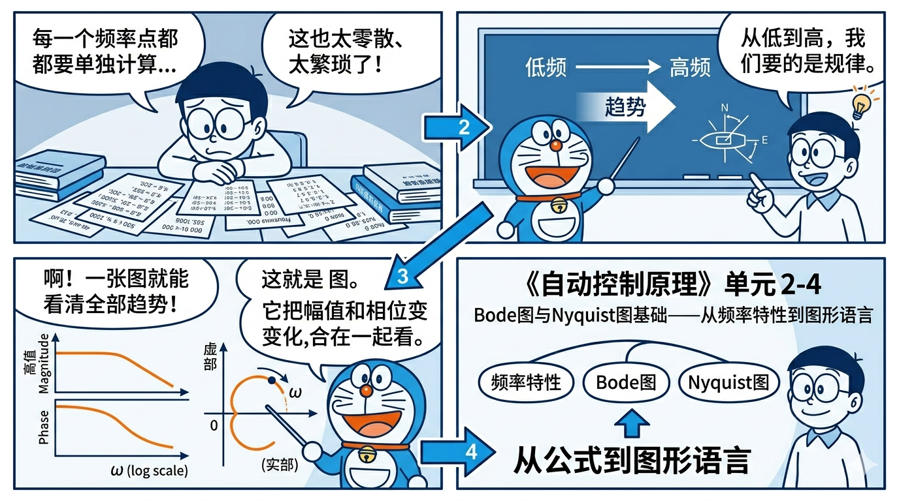
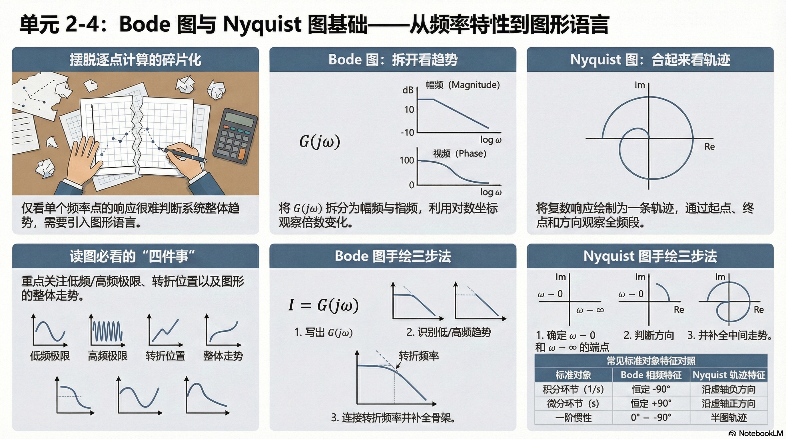

# 单元 2-4 | Nyquist图与频域指标入口——从第一层图形到复平面与裕度语言

- **层次**：模块2 理论主线 · 第四课
- **学时**：90分钟
- **知识类型**：[X] 跨域型
- **前置**：已掌握传递函数、典型环节和结构图的基本含义，并理解正弦稳态响应、频率特性、$G(j\omega)$ 的物理意义以及典型环节 Bode 图的第一轮骨架
- **后续**：3-4（极点作用与根轨迹综合实验中的频域观察）、3-5（零点引入与动态改善）、3-8（频域判别与跨域综合语言）
- **讲义定位**：这份讲义会带你把上一讲已经初步可见的频率特性，继续推进到 Nyquist 图、Bode/Nyquist 双图对照、相位裕度与增益裕度的图上读取，以及标准对象的基础反向识别。

{fig-pos="H"}

---

## 一、引入：为什么有了 $G(j\omega)$ 还不够

到 `2-3` 为止，你已经建立了一个很关键的新对象：频率特性 $G(j\omega)$。  
它告诉你，当输入是角频率为 $\omega$ 的正弦信号时，系统会怎样改变它的振幅，又会怎样拖慢它的相位。也就是说，系统对不同频率的回答，已经可以被写成一套规则。

但只要你真的开始面对工程问题，很快就会发现：**光有这套规则，还不够顺手。**

原因并不复杂。因为 $G(j\omega)$ 虽然已经把“系统如何处理不同节奏”这件事表达清楚了，但它仍然是一种**按频率逐点查询**的对象。你当然可以取 $\omega=0.1$ 算一次，再取 $\omega=1$ 算一次，再取 $\omega=10$ 算一次，可如果你想继续回答下面这些问题，单靠逐点代数计算就会越来越笨重：

- 这个系统整体上更偏向通过低频，还是更偏向放大高频？
- 随着频率升高，振幅衰减得快不快？
- 相位是慢慢拖后，还是在某个频段突然变化明显？
- 两个环节串联以后，整体趋势会怎样变？
- 当极点或零点变化时，整条频域特征到底“往哪边偏了”？

你会发现，这里真正缺的不是新公式，而是一种更高层次的工作语言：

> 你需要一种方法，把“按频率逐点定义的规则表”，变成“能一眼看出趋势、转折和结构信息的图形对象”。

这正是本节课要做的事。  
`2-3` 已经把频率特性对象建起来，并完成了典型环节 Bode 图的第一轮进入；`2-4` 则在此基础上把这个对象继续推进到**复平面轨迹、双图对照和频域指标入口**。从这里开始，频域分析不再只是“代值求一个复数”或“看一条幅频曲线”，而会变成“在多种图形里判断一个系统在整个频率范围内的行为”。

所以，这一课的任务不是再发明一套全新的知识，而是完成一次表达升级：

- 上一课回答的是：系统对某个频率怎么响应，以及典型环节的 Bode 图第一眼长什么样；
- 这一课回答的是：同一对象在 Nyquist 图上怎样运动，Bode/Nyquist 怎样互相对照，以及频域指标怎样第一次被读出来。

你可以先把本课压缩成一句最核心的话：

> **Bode 图和 Nyquist 图，不是新的系统对象，而是频率特性的图形化表达。**

一旦这一点想通，后面的内容就不会显得像突然换频道，而只是把同一套频域规则换成了更适合工程判断的视觉形式。

---

## 二、核心内容

### 2.1 为什么频率特性还要进一步画成图

设一个系统的频率特性为

$$
G(j\omega)=|G(j\omega)|e^{j\angle G(j\omega)}
$$

这条式子本身已经说明了两件事：

- 模 $|G(j\omega)|$ 告诉我们该频率成分被放大还是削弱；
- 幅角 $\angle G(j\omega)$ 告诉我们该频率成分被提前还是滞后。

如果只看某一个固定频率，这当然已经足够。但控制工程关心的从来不是“一个孤立频率点”，而往往是**整个频段上的行为趋势**。因为真实系统面对的输入、扰动和噪声，本来就不只包含某一个单频成分。

于是，工程师真正想看到的就不再是

> “当 $\omega=1$ 时，结果是多少？”

而更像是

> “当频率从低到高扫过去时，这个系统整体是怎么变化的？”

从这个角度看，图形的价值就非常直接：

- 它能把局部数值变成整体趋势；
- 它能把“变化方向”直观暴露出来；
- 它能把不同系统放在同一张图上比较；
- 它能让串联环节的组合效应更容易被看见；
- 它为后面更复杂的频域判断提供统一观察界面。

这也是为什么频域分析里会自然出现两种非常重要的图：

- **Bode 图**：把模与相位分别作为频率的函数画出来；
- **Nyquist 图**：把频率变化时的复数值直接画成复平面轨迹。

它们看起来形式不同，但本质上都在做同一件事：

> 把“频率特性是一个随频率变化的复数对象”这件事，翻译成你可以直接观察的图形。

表：从频率特性到图形对象，工作方式发生了什么变化

| 表达层次 | 主要形式 | 你最容易回答的问题 | 局限 |
|----------|----------|--------------------|------|
| 代数对象 | $G(j\omega)$ | 某个频率点上模和相角是多少 | 不容易看整体趋势 |
| 图形对象 | Bode 图、Nyquist 图 | 整个频段怎样变化、哪里转折明显 | 需要先学会读图规则 |

因此，本课真正要建立的，不是“再记两张新图”，而是新的观察习惯：

> **看频域，不再只盯一个点，而是开始看整条变化轨迹。**

### 2.2 Bode 图不是“一张图”，而是一对图

第一次接触 Bode 图时，最容易产生一个误解：好像它只是把频率特性“画出来了”。  
这句话不能说错，但说得还不够准确。更准确的理解是：

> **Bode 图把同一个频率特性拆成两张图来观察。**

原因就在于频率特性本身是一个复数对象。既然一个复数最关键的两个量是模和幅角，那么最自然的画法就是把它们分开：

1. 一张图看模怎样随频率变化；
2. 一张图看相角怎样随频率变化。

因此，Bode 图固定由两部分组成：

- **幅频图**：纵轴画幅值大小；
- **相频图**：纵轴画相位角大小；
- 两张图共用同一条频率横轴。

如果系统频率特性写成

$$
G(j\omega)=|G(j\omega)|e^{j\phi(\omega)}
$$

那么 Bode 图所展示的其实就是

$$
\omega \longmapsto |G(j\omega)|
$$

和

$$
\omega \longmapsto \phi(\omega)
$$

这两条对应关系。

你可以把它想成一种“分屏观察”：

- 幅频图回答“强弱怎么变”；
- 相频图回答“节奏被拖后多少”。

这两件事必须分开看，因为它们往往并不同步。一个系统可能在某段频率上幅值已经明显下降，但相位还没有拖后很多；也可能幅值变化不剧烈，可相位已经开始快速下滑。  
如果把它们硬压在一张图里，反而不利于判断。

所以，Bode 图并不是“画得麻烦”，而是因为它尊重了频率特性的真实结构：  
**一个复数对象，本来就应该拆成模和相位两部分来观察。**

这一步想通以后，你再看后面的典型环节绘图法则，就不会把它当成机械作图，而会明白每一条线、每一个转折，其实都在回答两个问题：

- 这个环节对某类频率有多敏感？
- 它会把这种节奏拖后到什么程度？

### 2.3 为什么横轴要用对数频率

理解了 Bode 图是双图结构之后，接下来的问题就很自然：

> 既然横轴表示频率，为什么不老老实实用普通线性坐标，而要专门用对数坐标？

答案来自工程对象本身。控制系统关心的频率范围通常不是“从 0 到 10 这么一点”，而经常会跨越几个数量级。比如一个系统，你可能同时关心：

- 很低频处是否能较好跟踪命令；
- 中频附近是否开始出现明显衰减；
- 高频区域是否能有效压制噪声。

如果直接用普通线性坐标，低频部分会被挤在最左边的一小段，高频部分又会占掉大量空间，结果是：

- 低频细节看不清；
- 多个数量级之间不容易平衡展示；
- 转折点和典型频率位置不够醒目。

而对数频率轴恰好解决了这个问题。它不是按“频率差值相等”来排点，而是按“频率倍数相等”来排点。于是：

- $0.1 \to 1$ 与 $1 \to 10$ 在图上占据相近宽度；
- 不同数量级可以被更公平地放在同一张图里；
- 频率范围一旦跨得很宽，图形仍然容易阅读。

这意味着 Bode 图横轴真正强调的不是“多了多少 rad/s”，而是：

> **频率扩大了多少倍。**

这正符合工程判断习惯。因为系统频域行为的很多变化，本来就不是随着频率“加一点点”发生的，而往往是随着频率“翻若干倍”逐渐显现出来的。

从读图角度看，对数频率轴还有一个非常重要的副作用：  
很多典型环节在这种坐标下，会呈现出非常规整、非常容易记忆的趋势线。  
也正因为如此，Bode 图才会成为工程上最常用的频域图形语言之一。

所以，对数横轴并不是一种作图习惯而已，而是在主动配合系统频率特性的观察方式：

- 它帮助你同时看清低频、中频和高频；
- 它让跨数量级的变化能够放进同一张图；
- 它为后面“渐近画法”和“图形叠加”准备了最合适的地基。

到这里，你应该先建立起 Bode 图最基础的三层理解：

1. 它不是新对象，而是频率特性的图形化表达；
2. 它不是一张图，而是幅频图和相频图的配对观察；
3. 它之所以使用对数频率轴，是为了让跨数量级的系统行为变得可读、可比较。

后面再看典型环节画法时，这三层理解会成为你真正稳定的抓手。

#### 2.3.1 为什么幅值也常常改写成对数量

理解了横轴为什么常用对数之后，接下来还会自然遇到第二个问题：

> 幅频图的纵轴为什么也经常不用原始幅值，而要改写成对数量？

原因和横轴很像，都是为了让“跨很多倍数的变化”更容易读。若某个频率处幅值是 $10$，另一个频率处是 $0.1$，两者已经差了 $100$ 倍；若继续直接用原始幅值作图，不同数量级很难放在同一把尺子上稳定比较，串联系统里的乘法关系也不够直观。

所以工程上常把幅值改写为对数量：

$$
L(\omega)=20\log_{10}|G(j\omega)|
$$

这里的单位就是 **dB**，中文常译作**分贝**。  
它的思想来源其实并不复杂：

- 如果讨论的是**功率比**，常写成 $10\log_{10}(\cdot)$；
- 而控制里更常直接面对的是**幅值比**；
- 由于功率与幅值平方成正比，所以幅值比写成对数量时会多出一个 2，于是就得到

$$
20\log_{10}|G(j\omega)|
$$

这就是为什么你在 Bode 幅频图里看到的是 `20`，而不是 `10`。  
你此时不需要把分贝单位的历史细节全部背下来，只要先抓住两件事：

1. 幅值取对数后，跨倍数的变化更容易放到同一张图里；
2. 串联环节原来在幅值上是相乘，改写成 dB 以后就会变成相加，这对后面图形叠加非常方便。

到这里，Bode 图的完整观察习惯其实已经出现了：

- 横轴用对数，是为了把频率倍数关系看清；
- 幅值常写成 dB，是为了把强弱倍数关系看清；
- 相位则保留角度量，直接反映拖后多少。

更完整的分贝来历和幅值/功率关系，见附录 A；正文里你先把它理解成一种服务于读图的工程表达即可。

### 2.4 典型环节的 Bode 图，首先要看“整体趋势”

真正开始画 Bode 图时，最容易犯的一个错误，就是一上来就把全部精力放在精确数值上。  
这会导致你还没看出系统整体在干什么，就已经陷进一堆局部计算里。

更稳妥的顺序应该是：

1. 先看这个环节总体更偏向低频还是高频；
2. 再看它在哪些频率附近开始明显转折；
3. 最后才去补局部数值和精细修正。

也就是说，第一次看 Bode 图时，最重要的不是“这一点到底精确落在多少 dB”，而是先回答：

- 这条幅频曲线总体是在往上走，还是往下走？
- 相位是基本不动，还是会逐步拖后？
- 转折大约从哪里开始？

从这个角度出发，几个最基础的典型环节会显得非常清楚。

#### 2.4.1 比例环节：整条曲线整体上移或下移

设比例环节为

$$
G(s)=K
$$

则有

$$
G(j\omega)=K
$$

这说明它与频率无关。也就是说，不管你输入的是低频还是高频，它都一视同仁地乘上同一个比例因子。

因此，比例环节的 Bode 图最简单：

- 幅频图是一条水平线；
- $K>1$ 时，整条线抬高；
- $0<K<1$ 时，整条线降低；
- 相频图若 $K>0$，则始终为 $0^\circ$。

所以比例环节最重要的图形意义不是“改变趋势”，而是：

> **它会整体改变强弱，但不会挑频率。**

#### 2.4.2 积分与微分环节：一条天然向下，一条天然向上

对积分环节

$$
G(s)=\frac{1}{s}
$$

有

$$
G(j\omega)=\frac{1}{j\omega}
$$

于是随着频率升高，幅值会持续减小，相位固定在 $-90^\circ$。  
这说明积分环节天然更“重视”低频，而会不断削弱高频。

对微分环节

$$
G(s)=s
$$

有

$$
G(j\omega)=j\omega
$$

于是随着频率升高，幅值会持续增大，相位固定在 $+90^\circ$。  
这说明微分环节恰好相反：它天然更敏感于高频变化。

所以你可以先把这两个环节记成最直观的样子：

- **积分环节**：幅频线向下，相位恒为负；
- **微分环节**：幅频线向上，相位恒为正。

这比死记公式更重要。因为后面多个环节组合时，你真正依赖的往往就是这种“整条曲线往哪边偏”的直觉。

#### 2.4.3 一阶惯性环节：低频基本通过，高频逐步压制

在 `2-3` 中，你已经从频率特性角度理解过一阶惯性环节：

$$
G(s)=\frac{1}{Ts+1}
$$

它的核心结论是：

- 低频处幅值接近 1，相位接近 $0^\circ$；
- 高频处幅值明显下降，相位逐步趋向 $-90^\circ$。

把这件事画成 Bode 图以后，你就会看到一个非常典型的频域形象：

- 幅频图在低频段大体保持平直；
- 到某个特征频率附近开始明显下弯；
- 高频段表现为稳定向下的衰减趋势；
- 相频图则从接近 $0^\circ$ 逐步滑向 $-90^\circ$。

因此，一阶惯性环节最值得先记住的，不是哪一个局部点的精确值，而是这句判断：

> **它对慢变化相对宽容，对快变化越来越不愿意跟。**

只要你能把这句话和图形对应起来，后面的很多读图问题都会变得自然。

#### 2.4.4 二阶振荡环节：不仅会衰减，还可能在某段频率附近“鼓起来”

二阶振荡环节比一阶惯性多出来的关键点，在于它不只是“慢慢往下掉”，而可能在某个频率附近表现出更明显的动态特征。设

$$
G(s)=\frac{\omega_n^2}{s^2+2\zeta\omega_n s+\omega_n^2}
$$

这个环节的幅频图在整体上仍然会表现出“高频最终衰减”的趋势，但在阻尼比较小时，某个频率附近可能出现更明显的峰起。  
这意味着系统并不是对所有频率都一味压制，而是可能在某一段频率附近显得特别敏感。

从读图角度看，你此时最先要形成的不是细节公式，而是三条判断：

- 阻尼较大时，曲线更平顺；
- 阻尼较小时，曲线更容易在某段频率附近鼓起来；
- 高频足够高以后，整体仍然会明显衰减。

也就是说，二阶振荡环节第一次让你真正看到：

> **频域图形不只是“通过或压制”，还可能暴露系统在哪一段频率附近最容易起反应。**

表：几类典型环节第一次看 Bode 图时最该抓住的趋势

| 典型环节 | 传递函数 $G(s)$ | 频率特性 $G(j\omega)$ | 幅频图最先看什么 | 相频图最先看什么 | 直观一句话 |
|----------|------------------|--------------------------|------------------|------------------|------------|
| 比例环节 | $K$ | $K$ | 水平，不随频率变 | 基本不变 | 改强弱，不挑频率 |
| 积分环节 | $\dfrac{1}{s}$ | $\dfrac{1}{j\omega}$ | 持续下降 | 固定负相位 | 低频强，高频弱 |
| 微分环节 | $s$ | $j\omega$ | 持续上升 | 固定正相位 | 高频强，低频弱 |
| 一阶惯性 | $\dfrac{1}{Ts+1}$ | $\dfrac{1}{1+j\omega T}$ | 先平后降 | 从 $0^\circ$ 逐步拖后 | 慢变化能过，快变化被压 |
| 二阶振荡 | $\dfrac{\omega_n^2}{s^2+2\zeta\omega_n s+\omega_n^2}$ | $\dfrac{\omega_n^2}{(\omega_n^2-\omega^2)+j2\zeta\omega_n\omega}$ | 整体最终下降，局部可能鼓起 | 相位变化更明显 | 某段频率可能更敏感 |

到这里，你已经有了第一次读 Bode 图最需要的能力：  
不是精确作图，而是先看出“这类对象的大方向是什么”。

### 2.5 为什么可以先用渐近线抓趋势

现在你大概已经意识到一个事实：  
如果每种环节都要求你从第一秒开始精确画出整条光滑曲线，那 Bode 图会变得既慢又容易乱。

工程上之所以能高效使用它，一个关键原因就在于：

> **很多典型环节的 Bode 图，先用渐近线就已经足够抓住主要结构。**

这里的“渐近”并不是说“乱画一条大概差不多的线”，而是指：

- 先在低频段抓住主要趋势；
- 再在高频段抓住主要趋势；
- 最后把转折附近看作从一种趋势过渡到另一种趋势。

这样做的价值非常大。因为工程判断最先关心的，往往不是每个点的小误差，而是：

- 哪一段基本平直；
- 从哪里开始转折；
- 转折后往上还是往下；
- 整体斜率大致有多陡。

只要这些信息先抓对，整条图的骨架就已经立住了。

以一阶惯性环节为例，你完全可以先这样理解它的幅频图：

- 在低频段，几乎看作不衰减；
- 到特征频率附近，开始发生明显变化；
- 在高频段，按稳定趋势持续下降。

这就是渐近画法的本质：  
**先抓骨架，再补圆角。**

从学习顺序上说，这也更适合你当前这一课的位置。因为 `2-4` 的任务首先是让你学会把频率特性读成图形，而不是把每张图都训练成精细手绘题。

所以你在这一讲里最应该形成的习惯是：

1. 先问整体趋势；
2. 再找转折频率；
3. 最后才考虑转折附近的精细修正。

这套顺序之所以重要，还有另一个原因：  
后面多个环节串联时，整体 Bode 图常常可以通过各个环节的图形贡献叠加来理解。  
如果你一开始就死盯精确曲线，组合系统时就很容易失去方向；  
如果你先抓每个环节的骨架，组合以后反而更容易看清整体结构。

因此，渐近画法不是偷懒，而是一种更符合工程分析节奏的表达方式。

#### 2.5.1 简单组合对象的第一步：先分环节，再合骨架

到这里还不能停在“单个典型环节各长什么样”。  
因为 `2-4` 不只是让你会认单个标准对象，还要让你开始接触**简单组合对象**怎样被翻译成图形。

例如

$$
G(s)=\frac{2}{0.5s+1}
$$

它其实不是一个全新的神秘对象，而只是：

- 一个增益环节 $K=2$；
- 再串联一个一阶惯性环节 $\dfrac{1}{0.5s+1}$。

因此第一次画它的 Bode 图时，不必重新发明一套规则，而应先把两个贡献拆开看：

1. 增益环节把整条幅频图整体上抬，但并不改变“先平后降”的骨架；
2. 一阶惯性决定转折频率大约在 $\omega \approx 1/T = 2\ \text{rad/s}$；
3. 高频段是否下降、相位是否逐步拖后，主要还是由惯性环节决定；
4. 相位图里，正增益本身几乎不额外贡献相位拖后，所以主要仍看一阶惯性的变化。

你可以把这种对象的第一次作图口令压缩成一句话：

> **先分对象，再合骨架；先看谁抬高整条线，再看谁决定转折和拖后。**

这就是本课所说的“简单叠加思想”。  
它的目标不是让你做复杂多环节手绘训练，而是让你第一次看到：图形对象已经可以从“单个环节识别”走向“简单对象组合”。

### 2.6 Nyquist 图：把“随频率变化的复数”直接画成轨迹

如果说 Bode 图是把同一个频率特性拆成“强弱变化”和“相位变化”两张图来看，那么 Nyquist 图做的事情正好不同：

> **它不拆开看，而是把 $G(j\omega)$ 作为复数本身，直接画到复平面上。**

也就是说，对每一个频率 $\omega$，系统都会给出一个复数值 $G(j\omega)$。  
这个复数有实部，也有虚部。  
当你让频率从低到高连续变化时，这个复数点也会在复平面上连续移动，于是就形成了一条轨迹。  
这条轨迹，就是 Nyquist 图。

所以第一次看 Nyquist 图时，你最该先问的，不是“判据怎么用”，而是这几个最基础的问题：

- 当 $\omega$ 从很小开始时，点从哪里出发？
- 当 $\omega$ 越来越大时，点往哪里走？
- 它是顺时针转，还是逆时针转？
- 它更靠近实轴，还是更容易向虚轴方向弯过去？

只要这几个问题看清了，Nyquist 图就不再是一条神秘曲线，而会变成“一个复数点如何随频率移动”的自然记录。

#### 2.6.1 为什么 Nyquist 图特别适合建立“整体转向感”

Bode 图擅长把模和相位分开读；Nyquist 图擅长把它们重新合在一起看。

因此，Nyquist 图最独特的价值在于：  
它能让你同时看到两件事是怎样一起变化的：

- 点离原点远近怎样变，代表幅值怎样变；
- 点绕着原点朝哪个方向转，代表相位怎样变。

从这个角度看，Nyquist 图特别像一条“频率扫描留下的运动轨迹”。  
你不是在看两张分开的函数图，而是在看一个点如何一步步从低频状态走向高频状态。

这也就是为什么，在真正开始接触 Nyquist 图时，你一定要先建立一种运动感：

> **Nyquist 图不是静止图形，而是一条按频率顺序被扫出来的路径。**

只要这层感觉建立起来，后面去读典型环节的起点、终点、方向和转角，就会顺很多。

#### 2.6.2 第一次读纯极点系统的 Nyquist 图，要先看什么

在本课范围内，你最先要建立的是纯极点系统的基本直觉，而不是复杂系统的判据使用。  
对于纯极点系统，第一轮读图时建议固定按下面顺序来：

1. **看起点**：低频附近从哪里开始；
2. **看终点**：高频极限向哪里靠近；
3. **看方向**：随着频率升高，轨迹朝哪边走；
4. **看转角**：整体大致转过了多少角度。

例如一阶惯性环节的 Nyquist 图，你会看到它从实轴正向附近出发，随后逐步向下弯，并在高频处向原点靠近。  
这正对应了你在 `2-3` 和本讲前面已经反复见过的那套频域事实：

- 低频时幅值接近 1，相位接近 $0^\circ$；
- 高频时幅值趋小，相位趋近 $-90^\circ$。

也就是说，Nyquist 图并没有讲一套新事实，它只是把“模怎样变、相位怎样变”重新合成了一条轨迹。  
因此，你此时最该抓住的不是新的公式，而是新的看法：

> **Bode 图把频率特性拆开来看，Nyquist 图把它合成轨迹来看。**

只要这一层建立起来，后面你再进入纯极点系统的具体轨迹判断，或者再往后进入判据语言，就不会觉得它们彼此割裂。

### 2.7 纯极点系统的 Nyquist 图，为什么会这样转

既然 Nyquist 图是一条“频率扫描路径”，那你接下来就应该继续追问：

> 为什么有些轨迹只轻轻向下弯，有些轨迹却会转得更多？

答案仍然来自系统本身的极点结构。  
因为对纯极点系统来说，频率升高时，相位拖后的总量会不断累积。  
极点越多，能够累积出来的总拖后就越大；  
于是复平面上的轨迹，整体也就会转得更多。

这件事先从最简单的一阶惯性看最清楚：

$$
G(s)=\frac{1}{Ts+1}
$$

低频时，$G(j\omega)$ 接近 $1$，所以轨迹从实轴正向附近出发；  
高频时，幅值趋近 $0$，相位趋近 $-90^\circ$，所以轨迹最终朝着原点方向收进去。  
因此，一阶惯性的 Nyquist 图给你的第一印象就是：

- 从右侧出发；
- 向下方转；
- 最后收向原点。

如果系统里有两个极点，频率升高以后，总相位拖后就可能进一步接近 $-180^\circ$。  
这时，轨迹不再只是“轻轻往下一拐”，而会表现出更明显的转向。  
也就是说，极点阶次的增加，不只是让幅值下降得更快，也会让复平面上的路径转得更深。

所以，第一次读纯极点系统 Nyquist 图时，一个非常稳的判断框架是：

- **极点越多，高频处总拖后越大；**
- **总拖后越大，轨迹整体转角越明显；**
- **幅值最终衰减到零，所以轨迹最后仍会向原点靠近。**

从这个角度看，Nyquist 图其实是在把“极点让相位不断累积拖后”这件事，直接画成空间中的转向过程。

#### 2.7.1 起点、终点、方向、总转角，分别对应什么物理含义

为了不把 Nyquist 图看成一条只适合“欣赏”的曲线，你需要把读图动作和物理意义固定对应起来。

先看这四件事：

1. **起点**  
   看低频时系统最初怎样对慢变化作出反应。若低频增益较大，起点就离原点更远；若低频增益接近 1，起点就更靠近实轴正向的单位附近。

2. **终点**  
   看高频成分最终被压到什么程度。若高频幅值趋向 0，终点就会收向原点。

3. **方向**  
   看随着频率升高，系统相位是往更滞后的方向走，还是变化较缓。对本课讨论的典型纯极点稳定系统，常见的是向下方转动。

4. **总转角**  
   看整个系统累计了多少相位拖后。这个量与极点个数、极点结构直接相关，所以它特别适合帮助你建立“阶次增加，图形也会跟着变”的直觉。

表：第一次读纯极点 Nyquist 图时，四个观察量各在回答什么问题

| 观察量 | 直接看什么 | 背后对应的系统信息 |
|--------|------------|--------------------|
| 起点 | 从哪里出发 | 低频增益、慢变化跟随能力 |
| 终点 | 向哪里收束 | 高频衰减极限 |
| 方向 | 往哪边转 | 相位变化方向 |
| 总转角 | 大致转了多少 | 极点结构导致的累计拖后 |

只要这张表在脑中先稳定下来，Nyquist 图就不再只是一条“奇怪的复平面曲线”，而会变成一套有明确观察顺序的频域读图工具。

### 2.8 Bode 图与 Nyquist 图，分工到底有什么不同

学到这里，一个很自然的问题会出现：

> 既然它们看的是同一个频率特性，为什么还要同时保留两种图？

答案不是“历史上都在用，所以都学”，而是它们真的各有优势。

Bode 图更适合做分量化观察。  
你可以清楚地看到：

- 哪一段频率上幅值基本平直；
- 哪一段开始快速衰减；
- 相位从哪里开始明显拖后；
- 多个环节叠加后，哪一部分是主要贡献。

Nyquist 图更适合做整体轨迹观察。  
你可以同时看到：

- 幅值怎样变化；
- 相位怎样变化；
- 两者合起来后，复平面轨迹怎样整体转向。

所以，把两者的分工压缩成一句话就是：

> **Bode 图适合拆开分析，Nyquist 图适合合起来观察。**

表：Bode 图与 Nyquist 图在本课中的任务分工

| 图形对象 | 最擅长回答的问题 | 本课最先要掌握什么 |
|----------|------------------|--------------------|
| Bode 图 | 幅值和相位分别怎样随频率变化 | 双图结构、对数坐标、典型环节趋势、渐近骨架 |
| Nyquist 图 | 复数点怎样随频率扫成一条轨迹 | 起点、终点、方向、总转角 |

因此，本课真正的目标并不是让你背两套互不相干的画图规则，而是稳定建立下面这层对应：

- 对象不变：频率特性 $G(j\omega)$；
- 视角不同：拆开看是 Bode，合起来看是 Nyquist；
- 目的相同：判断系统在整个频率范围内的行为。

### 2.9 手工绘图入门：第一次下笔时先画什么

到这里，你已经知道 Bode 图和 Nyquist 图分别在看什么。  
但真正开始“自己画”时，很多人还是会卡住，因为脑中虽然有结论，手上却不知道从哪里落笔。

所以，本课必须把最基本的手工绘图顺序讲清楚。  
注意，这里说的是**入门顺序**，不是复杂系统的精细手绘训练。

对于 Bode 图，第一次下笔建议固定按下面四步：

1. **先写出频率特性 $G(j\omega)$**  
   不要直接对着传递函数脑补图形，先把对象真正换到频域里。

2. **先看低频极限和高频极限**  
   低频告诉你起始趋势，高频告诉你最终趋势。

3. **找特征频率或转折频率**  
   先确定“从哪里开始变”，再谈“怎么变”。

4. **先画骨架，再补细节**  
   先把平直段、上升段、下降段、相位滑落方向画出来，最后才看转折附近的圆滑修正。

如果是 Nyquist 图，第一次下笔则更适合按下面顺序：

1. 先定低频起点；
2. 再定高频终点；
3. 再定轨迹主要朝哪边转；
4. 最后补中间段的大致弯曲方式。

你会发现，这个顺序和前文其实完全一致。  
手工绘图的入门，并不是另一套知识，而只是把前面反复建立的读图顺序，改成下笔顺序而已。

因此，本课范围内你真正要会的“手工绘图”只有这一层：

> **先抓骨架，不追局部花纹；先看极限和转折，不追一开始就精确。**

只要这个顺序稳定了，后面再遇到更多典型环节，你下笔时就不会乱。更细的手绘步骤可直接查附录 C。

### 2.10 基础反向识别：看到图，至少先认出什么对象

除了“由对象画图”，本课还要建立另一种很重要的最小能力：

> **看到一张基础 Bode 图，能不能先粗略判断这更像什么标准对象？**

这里强调的是“基础入口”，不是完整系统辨识。  
也就是说，你此时不需要做到“只看一张图就把系统完整写出来”，但至少应开始做到两件事：

1. 先认出它更像哪一类标准对象；
2. 再给出**粗粒度参数判断**，如低频增益量级、拐点频率位置、时间常数量级，或二阶对象是否存在明显共振峰。

第一次做基础反向识别时，可以先抓下面几条：

- 如果幅频图整体水平、相频图基本不动，优先想到**比例环节**，并进一步问：低频幅值大约在 `0 dB`、`+6 dB` 还是更高位置；
- 如果幅频图持续下降、相位基本固定在负角附近，优先想到**积分型特征**；
- 如果幅频图持续上升、相位基本固定在正角附近，优先想到**微分型特征**；
- 如果幅频图表现为“先平后降”、相频图从 $0^\circ$ 逐步拖向负角，优先想到**一阶惯性环节**，并进一步问：拐点大约落在哪个频率量级，对应的时间常数大约多大；
- 如果幅频图在某段频率附近有明显鼓起、相位变化更剧烈，优先想到**欠阻尼二阶振荡环节**，并进一步问：峰起是否明显，阻尼偏大还是偏小。

你会看到，这些判断并不要求你一上来就写出精确参数，而是先完成一件更基础也更关键的事：

> 先把图形现象和标准对象类型对应起来。

这一步之所以重要，是因为后面很多更复杂的分析，本质上都建立在这种“先认轮廓，再定细节”的能力上。  
如果连最基础的标准对象都认不出来，后面的图形叠加、参数影响、频域判别都会变得漂浮。

表：基础 Bode 反向识别时，第一眼线索与粗粒度参数判断

| 第一眼线索 | 最先联想到的对象 | 可以继续做的粗判断 | 暂时不要急着做什么 |
|------------|------------------|----------------------|--------------------|
| 幅频基本水平，相频基本不动 | 比例环节 | 低频增益大致量级 | 不急着反推精确增益 |
| 幅频持续向下，相位固定负角 | 积分型特征 | 是否存在积分阶特征 | 不急着做完整系统辨识 |
| 幅频持续向上，相位固定正角 | 微分型特征 | 高频敏感趋势是否明显 | 不急着把高频噪声讨论展开 |
| 先平后降，相位逐步拖后 | 一阶惯性环节 | 拐点频率、时间常数量级 | 不急着马上代精确参数 |
| 局部鼓起、相位变化明显 | 二阶振荡特征 | 是否有共振峰、阻尼偏大还是偏小 | 不急着进入判据或补偿设计 |

因此，本课在“反看图形”上的边界也应该非常明确：

- 要会从基础 Bode 图认出**标准对象轮廓**；
- 要会从低频/中频/高频行为看出大致对象类型；
- 要会给出低频增益、拐点频率、时间常数或阻尼强弱的**粗粒度判断**；
- 但**不**要求在本课把反识别训练扩张成完整系统辨识课。

若你需要回看标准对象和图形轮廓的快速对应，可直接查附录 B。

## 三、例题精解

### 3.1 例题一：先不求精确值，只判断一阶惯性环节的 Bode 图骨架

设系统为

$$
G(s)=\frac{1}{0.5s+1}
$$

不要求精确绘图，只回答下面三个问题：

1. 幅频图整体趋势是什么？
2. 相频图整体趋势是什么？
3. 大约从什么频率附近开始出现明显转折？

这道题的关键，不是把每一个频率点都算出来，而是训练你把“频率特性对象”翻译成“图形骨架”。

先看频率特性：

$$
G(j\omega)=\frac{1}{1+j0.5\omega}
$$

由此立刻可以抓住两件事：

- 低频时，$0.5\omega \ll 1$，系统几乎不衰减，相位也接近 $0^\circ$；
- 高频时，$0.5\omega \gg 1$，系统幅值明显下降，相位逐步趋向 $-90^\circ$。

因此，Bode 图的第一层骨架应该这样判断：

- **幅频图**：低频段近似平直，高频段转为明显下降；
- **相频图**：从接近 $0^\circ$ 开始，随后逐步向 $-90^\circ$ 拖后。

再看转折位置。由于一阶惯性环节最典型的变化发生在

$$
\omega T \approx 1
$$

附近，而这里 $T=0.5$，所以

$$
\omega \approx \frac{1}{T}=2\ \text{rad/s}
$$

就是最值得先盯住的特征频率。

所以，本题最重要的结论不是某个局部点精确是多少 dB，而是：

- 这是一条“先平后降”的幅频图；
- 这是一条“从 $0^\circ$ 向 $-90^\circ$ 逐步滑下”的相频图；
- 最明显的变化大约从 $\omega=2\ \text{rad/s}$ 附近开始。

你应该真正带走的，不是“我记住了这一题”，而是这条更可迁移的方法：

> **先看低频极限，再看高频极限，最后用特征频率把两头连起来。**

### 3.2 例题二：同一个对象，为什么 Bode 图和 Nyquist 图会给出一致判断

现在仍看同一个系统

$$
G(s)=\frac{1}{0.5s+1}
$$

这一次不问 Bode 图，而改问 Nyquist 图：

1. 低频起点大约在哪里？
2. 高频终点往哪里去？
3. 轨迹整体朝哪个方向转？

因为

$$
G(j\omega)=\frac{1}{1+j0.5\omega}
$$

所以当 $\omega \to 0$ 时，有

$$
G(j\omega)\to 1
$$

这说明轨迹从实轴正向的 $1$ 附近出发。  
这和 Bode 图里“低频幅值接近 1、相位接近 $0^\circ$”完全一致。

当 $\omega \to \infty$ 时，幅值趋向 0，相位趋向 $-90^\circ$，于是轨迹会向原点靠近，而且整体向下方弯去。  
这又与 Bode 图里的判断完全一致：

- 幅值越来越小，所以点离原点越来越近；
- 相位越来越负，所以轨迹朝下方转。

因此，Nyquist 图的第一轮判断可以写成：

- **起点**：实轴正向的 $1$ 附近；
- **终点**：原点；
- **方向**：随着频率升高逐步向下弯；
- **总转角**：体现出一阶极点带来的持续相位拖后。

这道题最重要的收获是：  
如果你在 Bode 图上已经判断出“低频基本通过、高频明显衰减、相位逐步拖后”，那么在 Nyquist 图上，就应该预期看到“从右边出发、向下弯曲、最终收向原点”的轨迹。  
两者必须能相互对照，不能各说各话。

### 3.3 例题三：先做最小反向识别，并给出粗粒度参数判断

现给出某一未知标准对象的基础 Bode 图特征如下：

- 低频段幅频图大致平直，位置约在 `+6 dB` 附近；
- 从 $\omega \approx 2\ \text{rad/s}$ 附近开始明显下降；
- 相频图从接近 $0^\circ$ 逐步向负角方向滑落；
- 没有出现明显峰起。

问：这个对象最可能是哪一类标准环节？它的静态增益和时间常数大致处在什么量级？作出判断时，你最主要依赖了哪些线索？

这道题故意不要求你立刻写出精确参数，而是训练本节新版边界里非常关键的一点：  
**先从图形轮廓认对象，再决定要不要进一步细化。**

根据题干，最先应抓住的线索有四条：

1. 低频段大致平直，说明系统对低频变化基本能通过；
2. 低频位置约在 `+6 dB`，说明低频增益不是 `1`，而更像是 `2` 这一量级；
3. 从 $\omega \approx 2\ \text{rad/s}$ 附近开始明显下降，说明它像一个在该频率附近发生转折的一阶惯性对象；
4. 相位从接近 $0^\circ$ 慢慢拖后，但没有很剧烈的峰起或复杂折返。

把这四条合在一起，最自然的初步判断就是：

> **它最可能是带正增益的一阶惯性环节，例如 $G(s)=\dfrac{K}{Ts+1}$ 这类对象。**

若继续做本课允许范围内的粗判断，那么：

- 低频幅值约为 `+6 dB`，可先估计 $K \approx 2$；
- 转折频率约在 $\omega \approx 2\ \text{rad/s}$，可先估计 $T \approx 1/2 = 0.5\ \text{s}$。

这里最重要的不是“我能不能一下子写出 $T$ 的精确值”，而是：

- 我能否先把它和比例、积分、微分、二阶振荡环节区分开；
- 我能否说清自己是根据哪几条图形线索作出的判断；
- 我能否在不越界的前提下，给出一个**参数量级层面**的初步估计。

这就是本课要建立的“基础反向识别入口”。  
你此时若能先认轮廓，再给出增益和时间常数的粗粒度判断，就已经达到本讲目标；更细的参数识别与复杂系统判断，不在这一课展开。

### 3.4 例题后的方法总结

把前三道题并排看，本节真正想让你形成的方法链已经出现了：

1. 先从传递函数写出频率特性 $G(j\omega)$；
2. 先看低频极限和高频极限；
3. 再找特征频率或转折频率；
4. 用这些信息先搭出 Bode 图骨架；
5. 若对象是简单串联，先分环节，再把各环节贡献合成整体骨架；
6. 再把同一套模与相位信息合成为 Nyquist 轨迹；
7. 最后检查两种图形表达是否彼此一致；
8. 若题目反过来给你图形，先做标准对象识别，再做增益、拐点频率、时间常数或阻尼强弱的粗粒度判断，不急着做完整辨识。

因此，本节例题的价值不在于“手工把图画得多漂亮”，而在于把下面这层稳定下来：

> **图形不是独立知识，而是频率特性对象的两种读法。**

[AI融入点]
先独立判断：若把例题一中的系统从 $G(s)=1/(0.5s+1)$ 改为 $G(s)=1/(0.2s+1)$，你预计 Bode 图的转折会往左移还是往右移？Nyquist 图起点会变吗？写下自己的判断。然后向 AI 提问：“对于一阶惯性环节，时间常数减小时，Bode 图和 Nyquist 图分别会发生什么整体变化？请只从低频、高频、转折位置和轨迹方向解释。”最后对照 AI 的回答，检查自己是否真的抓住了“参数改动到图形整体变化”的主线。

## 四、工程视角：为什么工程师需要这种图形语言

在真实工程里，系统往往不是只面对一种干净输入。船舶航向控制既要跟随驾驶员缓慢明确的操舵意图，也要面对海浪、风扰、传感器噪声和执行机构抖动等不同频率的扰动。  
如果只会逐点去算 $G(j\omega)$，你当然也能得到答案，但很难快速判断“系统整体更怕哪一段频率”“哪里开始明显拖后”“组合环节以后哪一部分最值得警惕”。

这正是图形语言的价值。  
Bode 图让你一眼看到不同频段的强弱与拖后；Nyquist 图让你一眼看到幅值和相位怎样一起演化。它们不是为了把频域分析变得更花哨，而是为了让工程判断更快、更稳、更不容易漏掉整体趋势。

所以，学习这两种图，表面上是在学作图，实质上是在学一种更成熟的工程观察方式：

- 不只看一个点；
- 不只盯一个公式；
- 而是开始看整个频段上的结构性行为。

## 五、本节小结与前后衔接

1. **Bode 图和 Nyquist 图都不是新对象，而是频率特性 $G(j\omega)$ 的图形化表达。**
2. **Bode 图把同一个频率特性拆成幅频图和相频图两张图来观察；Nyquist 图则把它作为复数轨迹整体来看。**
3. **Bode 图之所以使用对数频率轴，是为了把跨数量级的频率变化放到同一张图里清楚展示；幅值写成 dB，则是为了更方便表达倍数关系和后续叠加。**
4. **第一次读典型环节图形时，最重要的是先抓低频极限、高频极限、转折位置和整体趋势，而不是一开始就死盯局部精确值。**
5. **第一次读纯极点系统 Nyquist 图时，应固定按“起点、终点、方向、总转角”的顺序观察。**

从课程主线看，这一讲完成的是把 `2-3` 中建立起来的频率特性对象，正式翻译成可观察、可比较的图形语言。  
再往后，频域分析就不会只停留在“某个频率点怎么响应”，而会逐步走向“整张图怎样揭示系统结构”。  
因此，`2-4` 的位置非常关键：

- 它承接 `2-3` 的 $G(j\omega)$；
- 它为后面更成熟的频域判别语言提供图形基础；
- 它也在悄悄把你训练成一种新的观察者：从“会算一个频率点”走向“会读整个频率范围”。

---

{fig-pos="H"}

---

## 附录A｜dB 与 $20\log_{10}$ 的来历速记

正文里已经说明了：Bode 幅频图常把幅值写成

$$
L(\omega)=20\log_{10}|G(j\omega)|
$$

这里再把这件事收成一张最简短的理解表，方便你回查。

### A.1 为什么要取对数

因为幅值变化常常跨很多倍数。  
如果直接用原始幅值，几十倍、几百倍的变化不容易在同一张图上稳定比较；  
改写成对数量后，倍数关系会被压缩成更容易观察的增减量。

### A.2 为什么是 20，不是 10

若讨论的是功率比，常写成

$$
10\log_{10}\left(\frac{P_2}{P_1}\right)
$$

而控制里更常直接讨论幅值比。由于功率与幅值平方成正比，即

$$
P \propto A^2
$$

所以

$$
10\log_{10}\left(\frac{A_2^2}{A_1^2}\right)
=
20\log_{10}\left(\frac{A_2}{A_1}\right)
$$

这就是幅频图中常见的 `20` 的来源。

### A.3 你至少该记住的三个对应

| 幅值比 | dB 表达 | 最直接的意思 |
|--------|----------|--------------|
| $1$ | $0\ \text{dB}$ | 不放大也不衰减 |
| $>1$ | 正 dB | 该频率成分被放大 |
| $<1$ | 负 dB | 该频率成分被衰减 |

这一附录的目的不是让你背分贝史，而是让你在看到 dB 时不再觉得它是突然冒出来的新单位。

## 附录B｜典型环节 Bode / Nyquist 速查

本附录只做“快速定位”，不替代正文。  
当你回看讲义时，可以先用这张表把对象、频率特性和第一眼图形印象重新对上。

| 典型环节 | 传递函数 $G(s)$ | 频率特性 $G(j\omega)$ | Bode 第一眼 | Nyquist 第一眼 |
|----------|------------------|--------------------------|-------------|----------------|
| 比例环节 | $K$ | $K$ | 幅频水平，相频基本不变 | 固定点，不形成轨迹扫动 |
| 积分环节 | $\dfrac{1}{s}$ | $\dfrac{1}{j\omega}$ | 幅频持续下降，相位恒为 $-90^\circ$ | 在负虚轴方向附近向原点收缩 |
| 微分环节 | $s$ | $j\omega$ | 幅频持续上升，相位恒为 $+90^\circ$ | 在正虚轴方向远离原点 |
| 一阶惯性 | $\dfrac{1}{Ts+1}$ | $\dfrac{1}{1+j\omega T}$ | 先平后降，相位逐步拖向 $-90^\circ$ | 从实轴正向出发，向下弯并收向原点 |
| 二阶振荡 | $\dfrac{\omega_n^2}{s^2+2\zeta\omega_n s+\omega_n^2}$ | $\dfrac{\omega_n^2}{(\omega_n^2-\omega^2)+j2\zeta\omega_n\omega}$ | 高频最终下降，阻尼小时局部可能鼓起 | 起点在实轴正向，转向更深，总拖后更大 |

对本课来说，这张表最重要的用途不是“背公式”，而是帮助你从图形轮廓迅速回到对象类型。

## 附录C｜Bode 图与 Nyquist 图的详细手绘法则和步骤

由于后续不再安排专门的手工绘制单元，这里把本课需要保留下来的手绘顺序、判断法则和常见错误集中写清。  
你不需要把它当作“复杂作图竞赛说明书”，但至少应掌握这里的入门步骤。  
本附录覆盖的是：

- 典型环节的手工绘图入门；
- 简单串联系统的骨架画法；
- 纯极点系统 Nyquist 图的手绘顺序；
- 常见错法提醒。

### C.1 手绘 Bode 图前，先做哪四件事

无论对象多简单，第一次下笔前都先固定做下面四步：

1. **把传递函数写成频率特性**

$$
G(s)\ \longrightarrow\ G(j\omega)
$$

不要跳过这一步。  
因为后面所有的低频、高频、相位、转折判断，都是从这个对象出发的。

2. **先看低频极限**

- 低频时幅值大致是多少？
- 相位大致靠近多少？
- 这决定图的“起始骨架”。

3. **再看高频极限**

- 高频时幅值总体往上还是往下？
- 相位最终趋向哪个角度？
- 这决定图的“收尾骨架”。

4. **找特征频率或转折频率**

- 一阶惯性常先看 $\omega T \approx 1$；
- 二阶振荡常先看 $\omega$ 与 $\omega_n$ 的相对关系；
- 有多个环节时，就分别找各自转折点。

你会发现，这四步做完以后，图还没细画，但骨架其实已经基本确定了。

表：Bode 图下笔前的 4 步检查单

| 步骤 | 你要写/看什么 | 若跳过会怎样 |
|------|----------------|---------------|
| 1 | 写出 $G(j\omega)$ | 很容易把对象类型看错 |
| 2 | 看低频极限 | 起始骨架不稳 |
| 3 | 看高频极限 | 收尾趋势会画反 |
| 4 | 找转折频率 | 整张图没有“从哪开始变”的抓手 |

### C.2 手绘 Bode 幅频图的入门步骤

对本课范围内的标准对象，建议固定按下面顺序画：

1. **先标横轴**

- 横轴为对数频率轴；
- 先标典型数量级，例如 $0.1,\ 1,\ 10,\ 100$；
- 再把特征频率标在相应位置。

2. **先画低频段趋势**

- 比例环节：水平；
- 一阶惯性：低频近似水平；
- 积分环节：低频就已经向下；
- 微分环节：低频就已经向上。

3. **在特征频率处做转折**

- 不是一开始就画圆滑曲线；
- 先把“趋势变了”这件事画出来；
- 再在转折附近做柔化理解。

4. **再画高频段趋势**

- 一阶惯性：高频向下；
- 二阶振荡：高频下降更明显；
- 若多个环节串联，先把各段趋势叠加成整体骨架。

5. **最后检查是否与物理直觉一致**

- 低频是不是更容易跟随命令？
- 高频是不是更容易压制或放大？
- 整体趋势是否与对象类型相符？

课堂上真正下笔时，你可以把这 5 步压缩成一句操作口令：

> 标横轴，画低频，定转折，接高频，再回头核对象。

### C.3 手绘 Bode 相频图的入门步骤

相频图最容易出的问题，是学生只记某几个角度点，却忘了“相位其实是在逐步变化”。  
所以第一次手绘时应固定按下面顺序：

1. **先判断低频相位**

- 比例环节：通常接近 $0^\circ$；
- 一阶惯性：低频接近 $0^\circ$；
- 积分环节：固定在 $-90^\circ$；
- 微分环节：固定在 $+90^\circ$。

2. **再判断高频相位**

- 一阶惯性：拖向 $-90^\circ$；
- 两个极点：整体可能更接近 $-180^\circ$；
- 纯极点数越多，高频总拖后越大。

3. **把相位变化理解成“滑下去”的过程**

- 不要画成突然掉下去的直角台阶；
- 应该理解成从一个角度逐步过渡到另一个角度。

4. **与幅频图做交叉检查**

- 若幅频已开始明显衰减，相频通常也会开始有实质变化；
- 若幅频还完全没有变，相频通常也不该已经大幅拖后。

因此，相频图不要单独死记，最好总是和幅频图一起检查。  
对初学者来说，最稳的做法不是“先把相位背出来”，而是“先问它和幅频变化是否对得上”。

### C.4 手绘简单串联系统时，先不要急着画总图

本课只要求你进入“简单叠加思想”，不要求复杂手绘训练。  
所以对串联系统，第一次下手时不要直接画总图，而应先做：

1. 分别认出各个标准对象；
2. 分别判断各自的低频/高频趋势；
3. 分别标出各自的转折频率；
4. 最后再把这些趋势合成到同一张图里。

最关键的习惯是：

> **先分对象，后合骨架。**

这样你才不会一上来就把多环节图画成一团没有结构的折线。

对课堂训练来说，串联系统第一次手绘最稳的版本只要求做到：

- 能把各个标准对象拆开认出；
- 能说出每个对象各自在哪段频率起主要作用；
- 能把“谁先转折、谁后转折”按顺序排出来。

先做到这三步，已经够本课使用；更复杂的细部修形，不在这一讲展开。

### C.5 手绘 Nyquist 图的详细步骤

Nyquist 图第一次手绘时，建议严格按下面顺序走：

1. **先定起点**

求或判断

$$
\lim_{\omega\to 0} G(j\omega)
$$

这告诉你轨迹从哪里出发。

2. **再定终点**

求或判断

$$
\lim_{\omega\to \infty} G(j\omega)
$$

这告诉你轨迹最后往哪里收。

3. **再看相位方向**

- 相位越来越负，轨迹通常向下转；
- 相位越来越正，轨迹通常向上转。

4. **再看总拖后量**

- 一阶极点：整体转角较小；
- 极点增多：整体转角更深；
- 这一步帮助你判断轨迹到底是“轻轻一弯”还是“转得很多”。

5. **最后补中间段弯曲趋势**

- 不追求一开始就把每一点精确定位；
- 先保证整体方向、起终点和转向逻辑正确。

表：Nyquist 图下笔时的 5 步检查单

| 步骤 | 先判断什么 | 你真正是在确定什么 |
|------|------------|--------------------|
| 1 | 低频极限 | 起点 |
| 2 | 高频极限 | 终点 |
| 3 | 相位变化方向 | 轨迹朝上还是朝下转 |
| 4 | 总拖后量 | 整体会转多深 |
| 5 | 中间段趋势 | 轨迹怎样把起点和终点连起来 |

课堂上真正作图时，也可以把它压缩成一句操作口令：

> 先定两头，再看转向，最后补中段。

### C.6 基础反向识别时，先看哪几条线索

如果题目反过来给你基础 Bode 图，本课建议固定按下面顺序识别：

1. 先看低频段：平、升还是降；
2. 再看高频段：平、升还是降；
3. 再看相频图：基本不动、固定正负角，还是逐步拖后；
4. 再看有没有局部鼓起；
5. 最后只做“标准对象层面”的初步判断。

你此时不需要一步跳到完整系统辨识，只要先回答：

- 更像比例、积分、微分、一阶惯性，还是二阶振荡？
- 依据是哪几条图形线索？

为了避免一上来就乱猜，本课建议把反向识别时的表达固定成一句完整话：

> “我先根据低频趋势判断它不像谁；再根据高频趋势判断它更像谁；最后用相频图和是否有峰起来缩小范围。”

只要你能把判断说成这句话的结构，通常就说明你的识别过程还是稳的。

### C.7 本课范围内最容易犯的手绘错误

1. **跳过 $G(j\omega)$，直接对着 $G(s)$ 硬想图形**

这样最容易把对象看错。

2. **一开始就死抠局部精确值**

会导致骨架还没立住，整张图已经乱掉。

3. **只看幅频图，不看相频图**

结果常常能猜出“衰减”，却说不清“为什么轨迹往那边转”。

4. **把 Nyquist 图当成静止几何图**

忘了它本质上是一条按频率顺序扫出来的路径。

5. **把基础反向识别误做成完整系统辨识**

本课只要求先认出标准对象轮廓，不要求把复杂模型一步反推出完整表达式。

### C.8 本附录的作用

本附录不是为了把 `2-4` 重新变成技巧训练课，而是因为后续不再单列专门的手工绘图单元，所以这里必须把最基本、最稳定、最不该丢的作图顺序留下来。  
如果你以后再回到本课复习，最值得反复看的不是某一条局部曲线，而是这套顺序：

> 写出 $G(j\omega)$ → 看低频 → 看高频 → 找转折 → 画骨架 → 再做基础识别。

## 附录D｜MATLAB/Octave 复现代码

正文里主线先讲图形语言，这里把最基本的复现代码集中保留。  
如果你想自己把图画出来、核对趋势或改参数观察变化，可从这里开始。

### D.1 一阶惯性环节的 Bode 图

建议文件名：`(D.1.1.first-order-bode.m)`

```matlab
s = tf('s');
G = 1 / (0.5*s + 1);

figure;
bode(G);
grid on;
title('一阶惯性环节的 Bode 图');
```

### D.2 一阶惯性环节的 Nyquist 图

建议文件名：`(D.2.1.first-order-nyquist.m)`

```matlab
s = tf('s');
G = 1 / (0.5*s + 1);

figure;
nyquist(G);
grid on;
title('一阶惯性环节的 Nyquist 图');
```

### D.3 二阶振荡环节阻尼变化对 Bode 图的影响

建议文件名：`(D.3.1.second-order-bode-scan.m)`

```matlab
s = tf('s');
wn = 4;
zeta_list = [0.2 0.5 0.8];

figure;
hold on;
for zeta = zeta_list
    G = wn^2 / (s^2 + 2*zeta*wn*s + wn^2);
    bodemag(G);
end
grid on;
legend('\zeta=0.2', '\zeta=0.5', '\zeta=0.8');
title('不同阻尼比下的二阶振荡环节 Bode 幅频图');
hold off;
```

### D.4 反向识别练习用的标准对象对照

建议文件名：`(D.4.1.standard-objects-gallery.m)`

```matlab
s = tf('s');

G1 = 2;
G2 = 1/s;
G3 = s;
G4 = 1/(0.5*s + 1);
G5 = 16/(s^2 + 2*0.4*4*s + 16);

figure;
subplot(2,1,1);
bodemag(G1, G2, G3, G4, G5);
grid on;
legend('比例', '积分', '微分', '一阶惯性', '二阶振荡');
title('标准对象 Bode 幅频图对照');

subplot(2,1,2);
bodeplot(G1, G2, G3, G4, G5);
grid on;
legend('比例', '积分', '微分', '一阶惯性', '二阶振荡');
title('标准对象 Bode / 相频对照');
```

这些代码在本讲中的作用不是替代你读图，而是帮助你做两件事：

- 自己改参数，再看图形怎样整体移动；
- 让“对象 -> 图形”和“图形 -> 对象”的对应关系更稳定。
