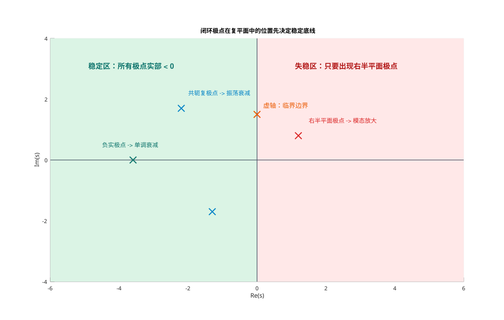
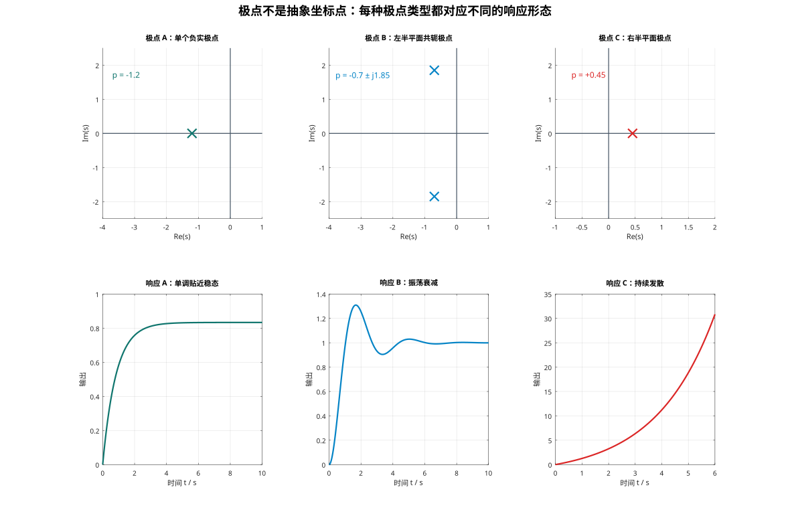
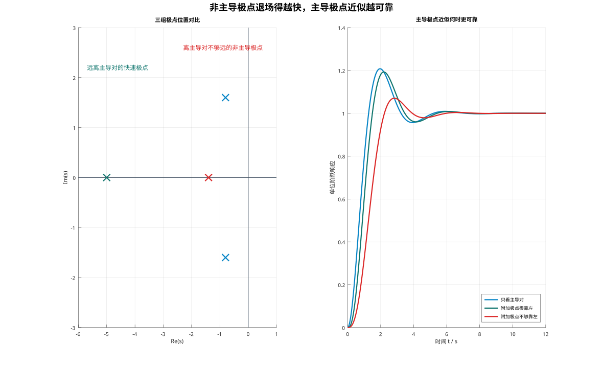
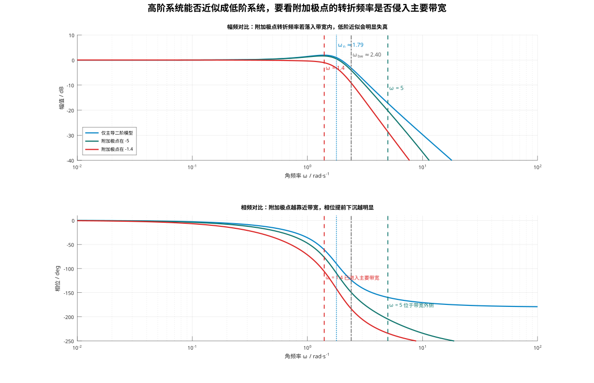
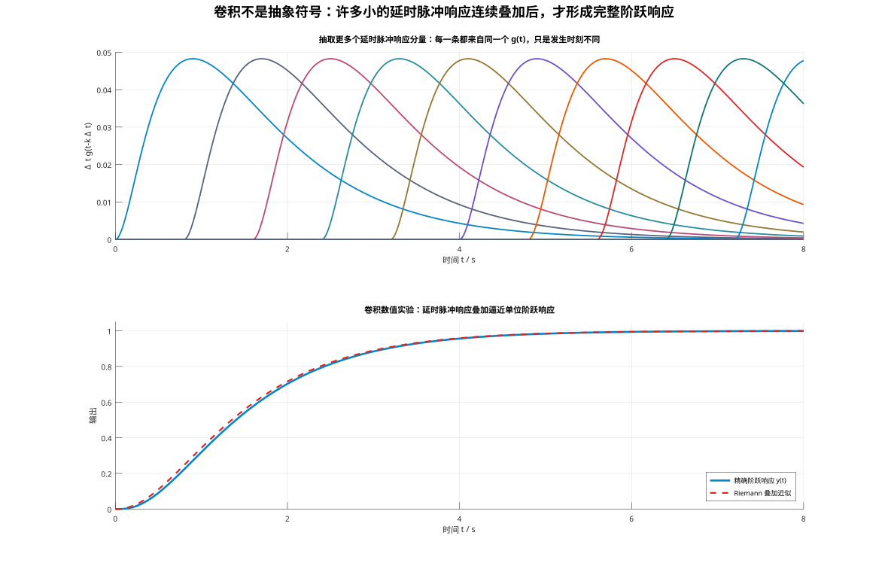
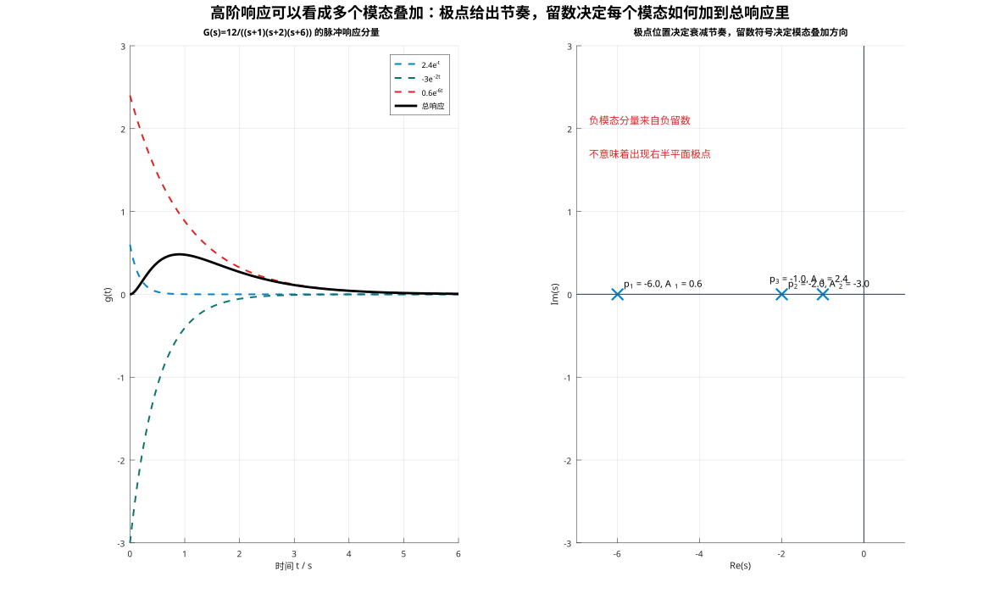

# 单元 3-1 | 纯极点视角下的稳定、模态与双域近似——高阶系统为何仍可用低阶模型理解

- **层次**：模块3 理论主线 · 第一课
- **学时**：90分钟
- **知识类型**：[C] + [X]
- **前置要求**：已掌握一、二阶系统的标准形式、典型动态性能指标、纯极点系统的基本时域特性与基础频域特性，能够从低阶响应曲线和基础 Bode 图中读出系统的快慢特征、振荡趋势与主要频段特性
- **讲义定位**：这份讲义要把“高阶系统为何常可用低阶模型理解”讲成一条完整判断链，并让我们能够同时使用时域与频域证据核验近似是否可靠
- **后续**：稳定边界、根轨迹机制与完整频域判别会继续展开

{fig-pos="H"}

---

## 一、问题从哪里来：高阶系统为什么没有推翻低阶直觉

在 `2-2` 和 `2-4` 中，我们已经学会用两套熟悉的语言描述系统：

- 在时域里，看快慢、超调量、调节时间和振荡节奏；
- 在频域里，看主要频段、幅值变化和相位滞后。

这些语言在一阶、二阶系统上很好用，但工程对象很少停留在二阶。以船舶航向控制为例，执行机构、船体动力学、测量环节和扰动通道叠加后，模型往往会升到三阶、四阶甚至更高。于是我们立刻会遇到两个问题：

1. 高阶系统明明含有更多极点，为什么我们仍常常用低阶模型解释它的主要动态？
2. 忽略某些极点这件事，什么时候只是在“偷懒”，什么时候又确实合理？

这里讨论的是**纯极点系统**。我们暂不引入零点，也不改变控制器结构，先把一个基础判断写清楚：

> 高阶系统之所以常能用低阶模型理解，不是因为高阶信息不重要，而是因为有些模态衰减更快、有些极点在关注频段内影响更小。

因此，下面集中回答三个更根本的问题：

- 极点为什么能代表系统行为；
- 主导极点为什么能解释主要动态；
- 这种近似为什么必须同时经过时域和频域两重检查。

为了把这条分析链真正落到手上，我们在阅读时可以同步整理三份记录：

1. **稳定与模态判断记录**：把左半平面、虚轴、右半平面的稳定含义，以及负实极点、左半平面共轭复极点、右半平面极点、重根对应的动态特征逐一写清。
2. **主导极点近似证据表**：把参考模型、系统 A、系统 B 的时域对照结果并列整理，特别注意附加模态退场快慢与“更靠左只是经验起点”这两条判断。
3. **双域近似解释卡**：分别回答“为什么某个附加极点在时域里可以近似忽略”和“为什么还必须回到 Bode 图检查它是否侵入主要带宽”。

## 二、先守住底线：闭环极点先回答系统会不会失控

设闭环传递函数为

$$
\Phi(s)=\frac{N(s)}{D(s)}
$$

其中分母多项式满足

$$
D(s)=0
$$

这个方程的全部根就是闭环极点。对线性定常系统来说，稳定性的第一道判断完全由这些极点给出：

- 全部极点实部小于 $0$，系统渐近稳定；
- 极点落在虚轴上且右半平面无极点，系统处于临界稳定状态；
- 只要出现右半平面极点，系统就含有会持续放大的模态。

{#fig:stability-half-plane}

这里先回答“会不会失控”，还没有回答“系统会怎么动”。如果极点只停留在复平面上的坐标点，它就还没有变成分析工具。接下来要问的是：极点怎样进入时间响应？

## 三、从坐标点到运动模态：极点为什么能解释系统动态

### 3.1 一般自由响应告诉我们：极点直接写进了响应式

对严格真有理系统，若极点为 $p_i$，每个极点的重数为 $q_i$，经过部分分式展开后，可写成

$$
G(s)=\sum_{i=1}^{m}\sum_{r=1}^{q_i}\frac{A_{i,r}}{(s-p_i)^r}
$$

相应的脉冲响应为

$$
g(t)=\sum_{i=1}^{m}\sum_{r=1}^{q_i}\frac{A_{i,r}}{(r-1)!}t^{r-1}e^{p_i t}, \qquad t \ge 0
$$

这个式子把极点和响应直接连了起来。极点不是抽象标签，而是直接进入响应表达式的“运动模态”：

- 极点实部决定衰减或增长的速度；
- 极点虚部决定振荡频率；
- 重根会额外引入 $t, t^2, \dots$ 这样的多项式因子；
- 留数系数 $A_{i,r}$ 决定每个模态在总响应中的权重和方向。

因此，复平面上的每一个极点，都对应着系统内部一种可以被激发的运动方式。

### 3.2 三类典型极点，三种典型响应

{#fig:poles-and-modes}

读图时，我们要把“极点类型”和“响应形态”一一对应起来：

1. **单个负实极点**：对应纯指数衰减，响应通常单调回到稳态；
2. **左半平面共轭复极点**：对应振荡衰减，虚部决定振荡快慢，实部决定包络收敛速度；
3. **右半平面极点**：对应发散模态，只要出现一个，整体系统就不能稳定。

这里要特别分清一件事。共轭复极点虽然成对出现，但系统输出仍只有**一条物理响应曲线**。成对复根只是数学表达的需要，它们合成后仍给出实函数输出。

### 3.3 重根为什么不能被忽略

如果出现二重极点 $p$，则时域项会由

$$
\frac{A_1}{s-p}+\frac{A_2}{(s-p)^2}
\quad \Longrightarrow \quad
A_1e^{pt}+A_2te^{pt}
$$

可见，即使两个系统的极点实部相同，只要其中一个系统包含重根，它的前段形态和衰减包络都可能明显不同。

这意味着：判断高阶系统能否近似成低阶系统，不能只看“极点大概都在左半平面哪里”，还要看两件事：

- 主导区附近是否还有额外极点或重根；
- 这些模态的权重是否足以改变主要动态。

## 四、主导极点为什么有用：高阶系统何时还能借用低阶语言

### 4.1 主导极点的真正含义

系统阶数升高后，总响应会变成多个模态的叠加。理论上模态越多，分析越复杂；但工程上常见的情况是，某些模态衰减极快，只在起始时刻短暂出现，随后很快退场。真正长期决定曲线形态的，往往是最靠近虚轴、衰减最慢的模态。

这就是主导极点思想：

> 在闭环极点中，最靠近虚轴、衰减最慢的模态，往往决定系统的主要动态品质。

有了这条判断，我们就能把模块2中建立的一阶、二阶指标语言重新接到高阶系统上：如果主导模态清晰，那么超调量、调节时间、振荡节奏这些量，仍可以近似借用低阶对象来解释。

### 4.2 最小例题：附加极点什么时候还能忽略

考虑三组单位直流增益模型：

$$
G_{\mathrm{ref}}(s)=\frac{3.2}{s^2+1.6s+3.2}
$$

$$
G_{\mathrm{A}}(s)=\frac{16}{(s+5)(s^2+1.6s+3.2)}
$$

$$
G_{\mathrm{B}}(s)=\frac{4.48}{(s+1.4)(s^2+1.6s+3.2)}
$$

三者拥有同一对主导共轭极点 $-0.8 \pm j1.6$，区别只在附加极点的位置：

- 参考模型只保留主导二阶对；
- 系统 A 的附加极点在 $-5$，明显更靠左；
- 系统 B 的附加极点在 $-1.4$，已经靠近主导区。

为了把“同一主导极点、不同附加极点”的影响看清楚，我们先把三组模型的阶跃响应写成显式形式。三者共同拥有的主导极点对为

$$
p_{1,2}=-0.8 \pm j1.6
$$

因此都会包含同一个主导振荡模态 $e^{-0.8t}\cos 1.6t$ 与 $e^{-0.8t}\sin 1.6t$，差别只在附加模态衰减得有多快。

对参考二阶模型，

$$
\omega_n=\sqrt{3.2}\approx 1.789,\qquad
\zeta=\frac{1.6}{2\sqrt{3.2}}\approx 0.447,\qquad
\omega_d=\omega_n\sqrt{1-\zeta^2}=1.6
$$

所以它的单位阶跃响应可写为

$$
y_{\mathrm{ref}}(t)=1-e^{-0.8t}\left(\cos 1.6t+0.5\sin 1.6t\right)
$$

对系统 A，单位阶跃响应展开后得到

$$
y_{\mathrm{A}}(t)=1-0.1584e^{-5t}-0.8416e^{-0.8t}\cos 1.6t-0.9158e^{-0.8t}\sin 1.6t
$$

对系统 B，单位阶跃响应展开后得到

$$
y_{\mathrm{B}}(t)=1-1.0959e^{-1.4t}+0.0959e^{-0.8t}\cos 1.6t-0.9110e^{-0.8t}\sin 1.6t
$$

这三条式子给出了最直接的近似证据：

- 参考模型只包含一组衰减率为 $0.8$ 的主导振荡模态；
- 系统 A 多出的附加模态是 $e^{-5t}$，其时间常数只有 $0.2$ s，远小于主导模态的时间常数 $1/0.8=1.25$ s，因此它只会在前段轻微修正曲线；
- 系统 B 多出的附加模态是 $e^{-1.4t}$，其时间常数约为 $0.714$ s，已经落入主导动态的同一时间尺度，因此会持续影响上升过程、超调量和峰值时刻。

把三组模型的阶跃响应放在一起比较，就能看到一个很有代表性的现象：**附加极点离主导区越远，近似越可靠；越靠近主导区，低阶近似越容易失真。**

{#fig:dominant-step}

从图中可以直接读出：

- 参考模型只保留一组主导振荡模态；
- 系统 A 多出的快速模态衰减很快，只在前段轻微修正曲线；
- 系统 B 的附加模态已经进入主要动态区，明显改变了上升过程和超调量。

为了把视觉印象进一步落到定量判断上，再把参考二阶模型的典型公式写出来：

$$
M_p=e^{-\frac{\pi\zeta}{\sqrt{1-\zeta^2}}}\times 100\% \approx 20.79\%
$$

$$
t_p=\frac{\pi}{\omega_d}=\frac{\pi}{1.6}\approx 1.963\ \text{s}
$$

$$
t_s(2\%)\approx \frac{4}{\zeta\omega_n}=\frac{4}{0.8}=5.00\ \text{s}
$$

这三条公式说明：参考模型的超调量、峰值时间和调节时间都可以直接由主导二阶对给出。再把公式结果与 Octave 数值结果并列，就得到下表：

| 模型 | 附加极点 | $t_r$（10%~90%）/ s | $t_p$ / s | $M_p$ / % | $t_s$（2%）/ s | 结论 |
| --- | --- | ---: | ---: | ---: | ---: | --- |
| 参考模型 | 无 | 0.862 | 1.963 | 20.79 | 4.669 | 标准二阶基线 |
| 系统 A | $-5$ | 0.934 | 2.191 | 19.28 | 4.862 | 与基线接近，近似较可靠 |
| 系统 B | $-1.4$ | 1.338 | 2.829 | 7.04 | 4.828 | 已明显偏离，近似不再可靠 |

从这张表我们至少要得到两个结论：

1. 高阶系统不一定“更慢”或“更差”，关键看附加模态是否进入主要动态区；
2. 只要附加极点足够靠左，它对主要超调量、振荡节奏和调节时间的影响就可能很小。

### 4.3 时域里怎样判断“忽略是否还算合理”

在纯极点系统中，我们先记住两条经验判断：

- 若被忽略极点的实部绝对值大约是主导极点实部绝对值的 `3~5` 倍以上，时域近似通常较可靠；
- 若附加极点靠近主导对，或主导区附近还聚集了多个极点或重根，低阶近似很可能失真。

这不是处处成立的定理，而是工程中的第一轮筛选准则。最后能不能忽略，仍要回到图形和数值证据。

## 五、只看时域还不够：为什么还要做频域检查

### 5.1 同一个近似，时域看起来像，不代表频域也像

如果我们只观察阶跃响应，最多只能回答“这条曲线是否仍像一个低阶系统”。但工程判断通常还会继续追问：

- 在主要工作频段内，幅频和相频特性是否仍相近？
- 如果我们想借用低阶对象估计带宽、响应速度和主要相位滞后，这个近似还能不能站得住？

因此，主导极点近似不能只做时域检查，还必须做频域检查。

### 5.2 频域证据：附加极点有没有侵入主要带宽

继续看刚才三组模型的 Bode 图：

{#fig:bode-reduction}

这张图的重点不在手工画图，而在观察**偏差出现在哪些频段**。为了看清偏差从哪里来，我们先把三组模型的幅频表达式写出来：

$$
\left|G_{\mathrm{ref}}(j\omega)\right|
=\frac{3.2}{\sqrt{(3.2-\omega^2)^2+(1.6\omega)^2}}
$$

$$
\left|G_{\mathrm{A}}(j\omega)\right|
=\frac{16}{\sqrt{\omega^2+5^2}\,\sqrt{(3.2-\omega^2)^2+(1.6\omega)^2}}
$$

$$
\left|G_{\mathrm{B}}(j\omega)\right|
=\frac{4.48}{\sqrt{\omega^2+1.4^2}\,\sqrt{(3.2-\omega^2)^2+(1.6\omega)^2}}
$$

从这三条式子可以直接读出两个频率来源：

- 主导二阶对的固有频率约为 $\omega_n=\sqrt{3.2}\approx 1.79\ \text{rad/s}$；
- 系统 A 的附加极点给出转折频率 $5\ \text{rad/s}$；
- 系统 B 的附加极点给出转折频率 $1.4\ \text{rad/s}$；
- 参考模型的数值带宽约为 $2.39\ \text{rad/s}$。

也就是说，图中的彩色竖线并不是凭观察画出来的，而是直接来自这些表达式里的因子结构：主导二阶因子决定主频尺度，一阶附加因子决定新的转折频率。

于是可以直接比较：

| 模型 | 附加极点转折频率 / rad/s | 数值带宽 $\omega_{\mathrm{bw}}$ / rad/s | 与参考模型相比 | 频域判断 |
| --- | ---: | ---: | --- | --- |
| 参考模型 | 无 | 2.390 | 基线 | 主导二阶对决定主要骨架 |
| 系统 A | 5.000 | 2.282 | 约下降 4.5% | 转折频率在带宽外，主要频段偏差较小 |
| 系统 B | 1.400 | 1.763 | 约下降 26.2% | 转折频率落入带宽内，主要骨架被改写 |

这张表说明：

- 若附加极点的转折频率在主要带宽之外，它在关注频带内只会带来较温和的幅相偏差；
- 若附加极点的转折频率已经落入主要带宽，它就会直接改写 Bode 图的主骨架，此时不宜继续把系统当成原来的低阶对象看待。

我们还可以把“为什么远离带宽就可以忽略”写成一个更紧凑的近似式。对附加的一阶极点因子

$$
\frac{1}{1+s/p}
$$

若关注频带满足 $\omega \ll p$，则有

$$
\left|\frac{1}{1+j\omega/p}\right| \approx 1,\qquad
\angle\frac{1}{1+j\omega/p}\approx 0^\circ
$$

这就是频域低阶近似的表达式证据：当附加极点的转折频率远在主要带宽之外时，它在关注频带里对幅值和相位都几乎“不出声”；一旦它落入主要带宽，这个近似就会迅速失效。

因此，频域判断最后可以压缩成一句话：

> 我们想忽略的那个极点，究竟是在关注频段外面，还是已经进入主要带宽里面？

### 5.3 双域判断表

把时域和频域的结论放在一起，我们可以得到一个更实用的判断框架：

| 判断维度 | 近似通常较可靠的情形 | 近似不可靠的情形 |
| --- | --- | --- |
| 时域 | 被忽略极点明显更靠左、衰减更快 | 被忽略极点靠近主导区，或主导区附近有重根聚集 |
| 频域 | 被忽略极点的转折频率高于主要带宽若干倍 | 被忽略极点的转折频率已经落入主要带宽附近 |
| 用途边界 | 粗略估算快慢、振荡趋势和主要带宽骨架 | 精确判断裕度、稳定性或细致设计 |

这里的 Bode 图只承担近似核验的任务，用来判断附加极点是否已经改写主要频段。Nyquist 判据、Bode 判稳与裕度分析需要更完整的频域语言，后续再统一展开。

## 六、卷积为什么会把“极点语言”带到输入响应里

### 6.1 阶跃响应不是凭空出现的

到这里我们已经知道，极点决定脉冲响应中的模态结构。但还有一个问题需要收束：为什么面对阶跃输入、斜坡输入等不同激励时，系统仍表现出同一套由极点主导的动态特征？

答案在卷积里。对线性定常系统，输出满足

$$
y(t)=\int_0^t g(t-\tau)u(\tau)\,\mathrm{d}\tau
$$

其中 $g(t)$ 是脉冲响应。若输入为单位阶跃 $u(t)=1(t)$，则有

$$
y_{\text{step}}(t)=\int_0^t g(t-\tau)\,\mathrm{d}\tau
$$

也就是说，单位阶跃响应可以理解为：**许多延时后的脉冲响应沿时间轴连续叠加。**

### 6.2 数值图像：我们真的能看见这种叠加

{#fig:convolution-step}

图中上半部分展示若干个延时脉冲响应分量，下半部分展示这些分量逐步叠加后对阶跃响应的逼近。这里最重要的不是计算步骤，而是三个观察：

1. 每一个小分量都来自同一个脉冲响应 $g(t)$；
2. 脉冲响应本身已经由极点决定；
3. 阶跃响应只是这些“极点模态碎片”的连续累加。

因此，不管输入怎样激发，只要系统本身不变，输出都仍会服从同一套极点语言。

### 6.3 一个更具体的模态叠加例子

考虑三阶纯极点模型

$$
G(s)=\frac{12}{(s+1)(s+2)(s+6)}
$$

部分分式展开为

$$
G(s)=\frac{2.4}{s+1}-\frac{3}{s+2}+\frac{0.6}{s+6}
$$

于是脉冲响应为

$$
g(t)=2.4e^{-t}-3e^{-2t}+0.6e^{-6t}
$$

{#fig:modal-superposition}

这个例子值得细看，因为它能纠正一个常见误解：模态分量出现负号，并不意味着系统不稳定。这里三个极点都位于左半平面，系统稳定；第二个模态之所以为负，只是因为它的留数系数为负。

所以我们要把两个概念分开：

- 极点位置决定模态的衰减节奏；
- 留数的符号和大小决定模态在总响应中是增强、抵消还是只起很小作用。

## 七、收束：何时可以借用低阶模型

学完整条分析链后，我们至少应当能够完成下面这条判断：

> 当一个高阶纯极点系统存在清晰的主导模态，且其余极点在时域中衰减足够快、在频域中又没有侵入主要带宽时，我们就可以用低阶模型解释它的主要动态；反之，这种近似就不再可靠。

围绕这条判断，全文建立了六个支点：

1. 闭环极点先回答系统会不会失控；
2. 极点进入时域表达式后，变成系统的运动模态；
3. 重根会改变包络和前段形态，不能只按“位置差不多”处理；
4. 主导极点近似能否成立，时域里要看主要动态是否被改写；
5. 频域里还要看附加极点的转折频率是否侵入主要带宽；
6. 卷积说明了不同输入为什么仍会激发同一套极点语言。

## 八、练习与自查

### 8.1 基础题

1. 为什么“全部极点在左半平面”只能回答系统是否稳定，还不能直接说明系统的快慢与振荡程度？
2. 对于共轭复极点，实部和虚部分别控制什么物理特征？
3. 为什么重根会让时域响应多出 $t e^{pt}$ 这一类项？

### 8.2 例题回看

回到系统 A 和系统 B：

1. 若只允许保留主导二阶对，哪个系统更适合做低阶近似？
2. 你的判断分别用了哪些时域证据和频域证据？
3. 如果只看阶跃响应而不看 Bode 图，可能漏掉什么问题？

### 8.3 迁移题

设某高阶系统的主导极点为 $-1 \pm j2$，另有一个附加极点位于 $-6$。请先不给数值计算，只做定性判断：

1. 从时域看，这个附加极点大概率会不会明显改写主要动态？
2. 从频域看，它更可能落在主要带宽内还是带宽外？
3. 你会把这个系统优先看成“可以先用低阶模型解释”，还是“不能轻易近似”？说明理由。

### 8.4 AI 练习

先独立作答，再把下列问题交给 AI，对照自己的判断：

> 比较 $G_{\mathrm{A}}(s)$、$G_{\mathrm{B}}(s)$ 与 $G_{\mathrm{ref}}(s)$ 的低阶近似可靠性，要求同时使用阶跃响应和 Bode 图说明理由，并指出“只做单一域判断”可能带来的误判。

使用 AI 后，请再回到文中的图示核对两件事：

- AI 是否明确区分了“附加极点远离主导区”和“附加极点进入主导区”这两种情形；
- AI 是否同时给出了时域与频域依据，而不只是重复一句“主导极点可以近似”。
