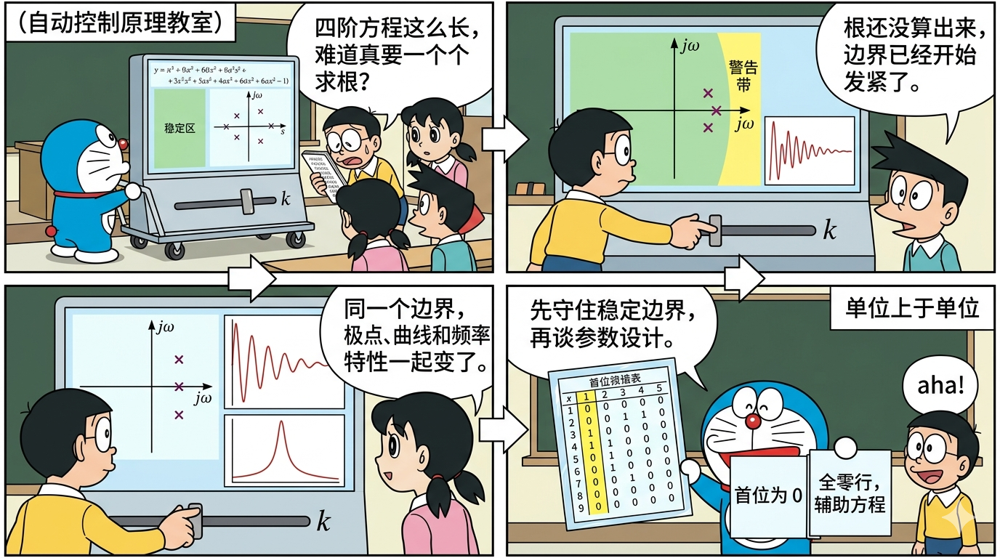
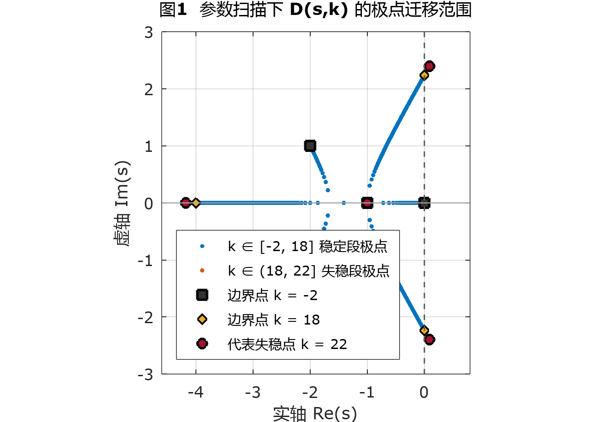
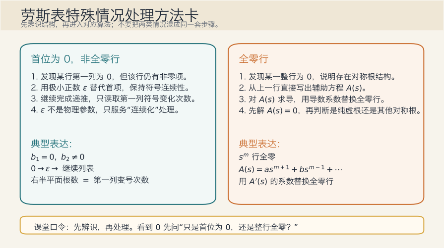
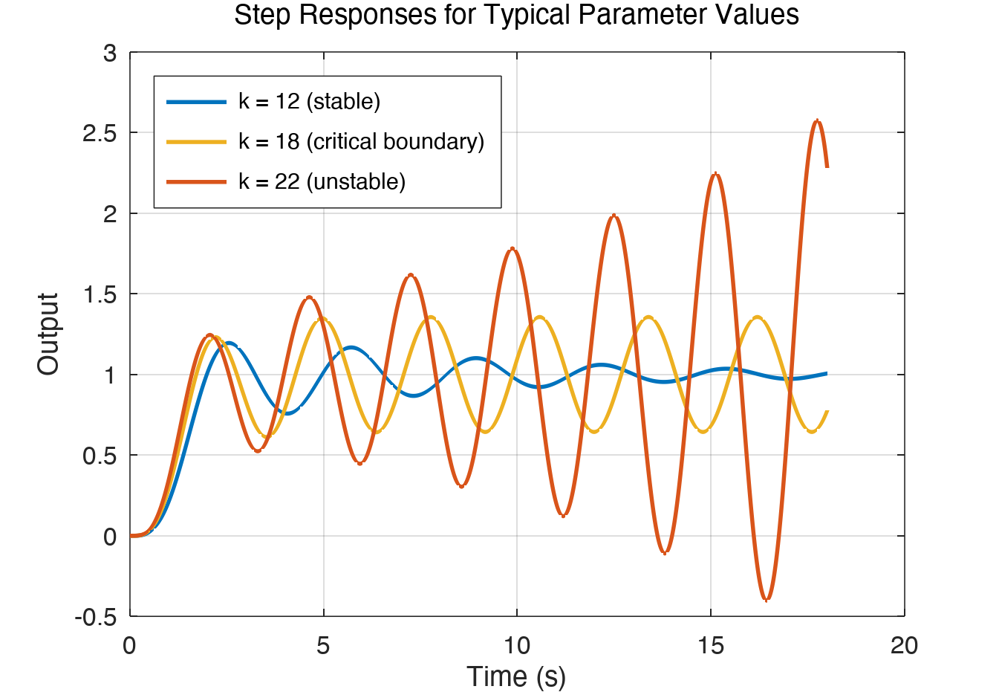
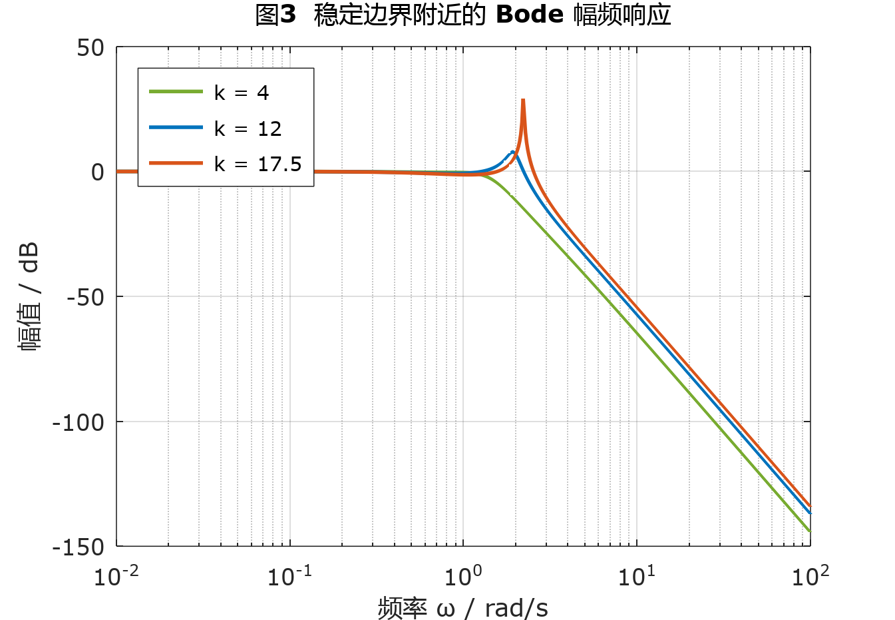
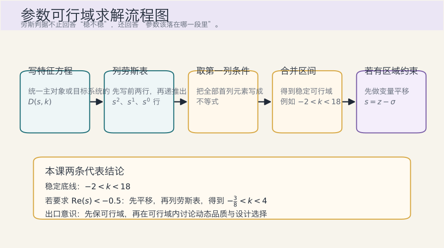
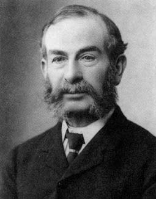

# 单元 3-2 | 劳斯判据：从高阶系统稳定判定到参数可行域

- **层次**：模块3 实践主线 · 第二课
- **学时**：90分钟
- **知识类型**：[C] + [X]
- **前置知识**：理解闭环特征方程与极点位置的关系，明确“全部闭环极点位于左半平面”是线性定常系统渐近稳定的充要条件，能够用极点语言准确描述稳定、临界稳定、不稳定等状态，并理解主导极点对系统动态特性的影响
- **后续课程**：3-3（根轨迹机制与基本法则）、3-4（极点作用与根轨迹综合实验）、4-1（设计起点：性能指标体系、工程约束与可行域表达）
- **讲义定位**：本讲义围绕高阶系统稳定性分析展开，系统讲解普通劳斯表、两类特殊情况、稳定区间、多域对应关系和参数可行域的确定方法



---

## 一、引入：高阶系统稳定分析为什么需要劳斯判据

线性定常系统的稳定性由其闭环极点分布决定。闭环特征方程可写为

$$
D(s)=a_ns^n+a_{n-1}s^{n-1}+\cdots+a_1s+a_0=0
$$

若全部根均位于左半 $s$ 平面，系统渐近稳定；若存在右半平面根，系统不稳定；若根落在虚轴上，系统处于临界边界状态。

对于二阶系统，往往可以直接求解根的解析表达式。然而面对三阶、四阶及更高阶系统时，我们通常先获得特征方程，再分析根的分布态势。此时需要首先回答以下四个关键问题：

1. 系统是否存在右半平面根；
2. 右半平面根的个数是多少；
3. 参数变化时，系统何时趋近稳定边界；
4. 稳定边界对应的根结构特征是什么。

劳斯判据正是基于特征方程系数直接回答上述问题的数学工具。它提供的信息可归纳为三类：

- 系统稳定性的定性判断；
- 右半平面根的数量；
- 参数可行域与稳定边界的确定。

这一工具既适用于高阶系统的初步稳定性分析，也支持参数筛选与优化。后续的根轨迹分析与控制器设计，均以劳斯判据所确定的稳定区域为设计前提。

---

## 二、统一高阶主对象与普通劳斯表

为保持教学内容的连贯性，本课后续内容统一围绕以下四阶特征方程族展开：

$$
D(s,k)=s^4+5s^3+9s^2+(7+k)s+(2+k)
$$

选择同一对象家族有两个目的：

- 首先使用固定参数值建立普通劳斯表，完成“高阶系统稳定判定”的基本操作流程；
- 再保留参数 $k$，将同一张表进一步发展为稳定区间与临界边界分析。

这样做的好处在于，后续讨论稳定区间、特殊情况处理和多域对应关系时，无需频繁切换分析对象，学习者可将注意力持续聚焦于稳定边界本身的内涵与确定方法。

### 2.1 先固定一个参数值，完成普通劳斯表

首先取

$$
k=4
$$

此时特征方程简化为

$$
D(s)=s^4+5s^3+9s^2+11s+6
$$

此时不必急于求解具体的根，直接依据系数建立劳斯表。四阶系统的前两行由偶次项系数和奇次项系数依次排列：

$$
\begin{array}{c|ccc}
s^4 & 1 & 9 & 6 \\
s^3 & 5 & 11 & 0
\end{array}
$$

接下来按劳斯表递推公式计算第三行首项：

$$
b_1=\frac{5\times 9-1\times 11}{5}=\frac{34}{5}
$$

第三行第二项为

$$
b_2=\frac{5\times 6-1\times 0}{5}=6
$$

于是得到

$$
\begin{array}{c|ccc}
s^4 & 1 & 9 & 6 \\
s^3 & 5 & 11 & 0 \\
s^2 & \frac{34}{5} & 6 & 0
\end{array}
$$

再计算第四行首项：

$$
c_1=
\frac{\frac{34}{5}\times 11-5\times 6}{\frac{34}{5}}
=
\frac{\frac{374}{5}-30}{\frac{34}{5}}
=
\frac{\frac{224}{5}}{\frac{34}{5}}
=
\frac{112}{17}
$$

最后一行对应常数项：

$$
\begin{array}{c|ccc}
s^4 & 1 & 9 & 6 \\
s^3 & 5 & 11 & 0 \\
s^2 & \frac{34}{5} & 6 & 0 \\
s^1 & \frac{112}{17} & 0 & 0 \\
s^0 & 6 & 0 & 0
\end{array}
$$

### 2.2 从第一列直接读出稳定结论

这张劳斯表最重要的部分是第一列元素：

$$
1,\quad 5,\quad \frac{34}{5},\quad \frac{112}{17},\quad 6
$$

所有元素均为正，第一列没有符号变化。根据劳斯判据可得：

$$
\text{右半平面根数}=0
$$

因此该系统稳定。

由此可看出劳斯判据的核心优势：即便不显式求出所有根的具体位置，系统是否稳定、右半平面根数有多少，均已可以直接从第一列的符号变化中读取。

### 2.3 为什么“看第一列”就够了

普通劳斯表将稳定性问题转化为第一列元素的符号变化分析。根是否跨越虚轴进入右半平面，最终都会反映到第一列的符号上。

对于本例而言，第一列始终为正，表明根没有穿过虚轴进入右半平面。  
若某一步第一列出现负号，而前一项仍保持正号，则符号变化次数增加一次，右半平面根数也随之增加一次。

由此可见，第一列在劳斯表中扮演着“计数器”的角色：

- 符号始终不变，表明右半平面根数保持为零；
- 符号发生一次变化，表明右半平面根数增加一个；
- 变化次数累计完成后，即可得到系统的失稳程度。

理清这一点至关重要，后续涉及参数的稳定区间分析才不会退化为机械的不等式计算。

### 2.4 用数值求根做一次交叉验证

为验证普通劳斯表判断结果的正确性，可进一步使用数值方法检验这一组系数的所有根。用 Octave 计算

```matlab
roots([1 5 9 11 6])
```

得到

$$
s=-3,\quad s=-1,\quad s=-0.5 \pm j1.3229
$$

四个根均位于左半平面，与劳斯表给出的结论完全一致。

这次交叉验证有两个作用：

1. 普通劳斯表的稳定性结论获得数值方法的确认；
2. 后续讨论参数变化影响时，学习者可自然建立“第一列符号变化”与“极点穿越虚轴”之间的直观联系。

### 2.5 普通情形小结

至此，对普通情形的分析已完成三件事：

1. 为高阶系统提供了标准的分析入口：先写出闭环特征方程，再列写劳斯表；
2. 明确了第一列符号变化次数等于右半平面根数这一核心规则；
3. 固定了同一主对象，为下一步的参数稳定区间分析做好了准备。

接下来保留特征方程中的参数 $k$，同一张劳斯表将从“稳定判定表”转变为“稳定区间确定表”。

---

## 三、带参数劳斯表：从稳定判定走向稳定区间确定

### 3.1 保留参数后，整张劳斯表一次列完

将参数 $k$ 保留在特征方程中：

$$
D(s,k)=s^4+5s^3+9s^2+(7+k)s+(2+k)
$$

前两行仍由系数直接排出：

$$
\begin{array}{c|ccc}
s^4 & 1 & 9 & 2+k \\
s^3 & 5 & 7+k & 0
\end{array}
$$

第三行首项为

$$
b_1=\frac{5\times 9-1\times (7+k)}{5}=\frac{38-k}{5}
$$

第三行第二项为

$$
b_2=\frac{5\times (2+k)-1\times 0}{5}=2+k
$$

于是 $s^2$ 行写成

$$
\begin{array}{c|ccc}
s^2 & \frac{38-k}{5} & 2+k & 0
\end{array}
$$

再计算 $s^1$ 行首项：

$$
c_1=
\frac{\frac{38-k}{5}(7+k)-5(2+k)}{\frac{38-k}{5}}
=
\frac{216+6k-k^2}{38-k}
=
\frac{(18-k)(k+12)}{38-k}
$$

因此，带参数的劳斯表可整理为

$$
\begin{array}{c|ccc}
s^4 & 1 & 9 & 2+k \\
s^3 & 5 & 7+k & 0 \\
s^2 & \frac{38-k}{5} & 2+k & 0 \\
s^1 & \frac{(18-k)(k+12)}{38-k} & 0 & 0 \\
s^0 & 2+k & 0 & 0
\end{array}
$$

### 3.2 第一列不等式直接给出稳定区间

系统稳定时，劳斯表第一列各项均应为正，因此需满足以下不等式：

$$
1>0,\quad 5>0,\quad \frac{38-k}{5}>0,\quad \frac{(18-k)(k+12)}{38-k}>0,\quad 2+k>0
$$

前两项恒成立，实际起约束作用的是后三个不等式。

由

$$
\frac{38-k}{5}>0
$$

得到

$$
k<38
$$

此时第四项分母为正，故只需保证分子为正：

$$
(18-k)(k+12)>0
$$

由此得到

$$
-12<k<18
$$

再结合

$$
2+k>0
$$

得到

$$
k>-2
$$

综合三项约束条件，系统稳定区间为

$$
-2<k<18
$$

这就是参数 $k$ 的稳定可行域。由此可看出劳斯判据的第二层价值：它不仅能判断某一特定系统是否稳定，还能直接给出使系统保持稳定的参数范围。

### 3.3 两个边界点对应两种不同的临界根结构

稳定区间的左右边界分别为

$$
k=-2,\qquad k=18
$$

它们都位于稳定边界上，但对应的根结构有所不同。

当 $k=-2$ 时，

$$
D(s,-2)=s^4+5s^3+9s^2+5s=s(s^3+5s^2+9s+5)
$$

用 Octave 计算

```matlab
roots([1 5 9 5 0])
```

得到

$$
s=0,\quad s=-1,\quad s=-2\pm j
$$

此时有一个根位于原点，系统正好落在虚轴与实轴的交点处。

当 $k=18$ 时，用 Octave 计算

```matlab
roots([1 5 9 25 20])
```

得到

$$
s=-4,\quad s=-1,\quad s=\pm j\sqrt{5}
$$

此时出现一对纯虚根，系统处于振荡临界边界。

这两个边界点说明：稳定区间的端点对应多种临界状态。根可能压到原点，也可能成对位于虚轴上。后续处理特殊情况时，这种差别将变得尤为重要。

### 3.4 用三个参数点核对这一结论

下面选取三个典型参数值，分别代表稳定区域内、稳定边界上和稳定区域外。

表 1. 代表参数点的求根结果与稳定性结论

| 参数值 | Octave 求根结果 | 结论 |
| --- | --- | --- |
| $k=12$ | $s=-3.6759,\ -1,\ -0.1621\pm j1.9448$ | 全部根位于左半平面，系统稳定 |
| $k=18$ | $s=-4,\ -1,\ \pm j2.2361$ | 一对纯虚根，系统位于稳定边界 |
| $k=22$ | $s=-4.1781,\ -1,\ 0.0891\pm j2.3951$ | 出现一对右半平面根，系统不稳定 |

这组结果与劳斯表的分析完全一致。随着 $k$ 增大，共轭根逐步逼近虚轴，在 $k=18$ 时穿越边界，随后进入右半平面。

图 1 展示了参数从 $k=-2$ 扫描至 $k=22$ 时的极点迁移轨迹。图中可直接观察到两个现象：一是 $s=-1$ 始终保持在实轴上；二是共轭根在 $k=18$ 附近穿过虚轴，这与劳斯表预测的稳定边界完全吻合。



图 1. 主对象 $D(s,k)$ 在参数扫描下的极点迁移轨迹。蓝色点对应 $k\in[-2,18]$（稳定区），橙色点对应 $k\in(18,22]$（失稳区）。黑色方块、黄色菱形和红色圆点分别标记 $k=-2$、$k=18$ 和 $k=22$ 三个典型位置。

### 3.5 从“稳定判定”提升到“先定可行域，再谈设计”

面对含参数的特征方程，劳斯判据首先给出稳定可行域

$$
-2<k<18
$$

后续若需进一步讨论超调、振荡频率、响应速度或工程约束，所有精细化设计工作都应在此区间内展开。此时，劳斯判据便从“稳定性判定工具”进一步升华为“参数设计的基础入口”。

[AI融入点]  
首先独立完成本节三条不等式的推导，再将结果发送给 AI 核验。重点核验以下两点：

- AI 是否遗漏了 $s^0$ 行给出的条件 $k>-2$；
- AI 在处理 $s^1$ 行分式时，是否正确先判断分母符号，再化简为分子不等式。

如果 AI 直接给出 $-12<k<18$，则说明其少看了一个第一列条件。

---

## 四、特殊情况处理：首位为 0 与全零行

普通劳斯表默认每一步都能利用上一行的首项继续递推计算。特殊情况出现在递推链条中途被打断时。本课仅处理最常见的两类：

1. 某一行第一列为 $0$，但该行并非全零；
2. 某一整行全部为零。

这两类现象看似都“导致计算无法继续”，但物理含义不同。第一类对应递推过程中的分母失效问题，第二类则对应系统更深层次的根结构对称性。

### 4.1 首位为 0 且该行不全为 0：用极小正数保持符号连续性

先分析一个简短示例

$$
D_1(s)=s^4+2s^3+3s^2+6s+5
$$

前两行劳斯表为

$$
\begin{array}{c|ccc}
s^4 & 1 & 3 & 5 \\
s^3 & 2 & 6 & 0
\end{array}
$$

继续计算时，

$$
b_1=\frac{2\times 3-1\times 6}{2}=0,\qquad
b_2=\frac{2\times 5-1\times 0}{2}=5
$$

于是出现

$$
\begin{array}{c|ccc}
s^2 & 0 & 5 & 0
\end{array}
$$

这里的关键信息是：第一列变为 $0$，但该行并未全为零。此时可引入一个极小正数 $\varepsilon$ 代替该位置，继续递推：

$$
\begin{array}{c|ccc}
s^2 & \varepsilon & 5 & 0
\end{array}
$$

再计算下一行首项：

$$
c_1=\frac{\varepsilon \times 6-2\times 5}{\varepsilon}
=6-\frac{10}{\varepsilon}
$$

当 $\varepsilon \to 0^+$ 时，

$$
c_1<0
$$

因此第一列符号序列为

$$
1,\quad 2,\quad \varepsilon,\quad 6-\frac{10}{\varepsilon},\quad 5
$$

其中发生两次符号变化，故

$$
\text{右半平面根数}=2
$$

用 Octave 验证

```matlab
roots([1 2 3 6 5])
```

得到

$$
s=0.3002\pm j1.6248,\quad s=-1.3002\pm j0.3752
$$

结果与劳斯表分析一致，系统确实包含两个右半平面根。

此类情况的处理要点有两项：

- $\varepsilon$ 的作用是保持符号的连续性，判断时只需关注第一列的符号变化，$\varepsilon$ 本身仅用于维持计算连续性；
- 出现首位为零的情况时，应继续完成递推，再根据第一列符号变化和根结构判断系统稳定性。

### 4.2 出现全零行：上一行隐藏着辅助方程

再看第二个简短示例

$$
D_2(s)=s^4+2s^3+2s^2+2s+1
$$

前几行劳斯表为

$$
\begin{array}{c|ccc}
s^4 & 1 & 2 & 1 \\
s^3 & 2 & 2 & 0 \\
s^2 & 1 & 1 & 0 \\
s^1 & 0 & 0 & 0
\end{array}
$$

此时整行均为零。这种情况下应改用辅助方程法处理，因为前一行对应的多项式已暴露出系统具有成对对称的根结构。

具体处理步骤如下：

首先依据上一行（$s^2$ 行）构造辅助方程：
若全零行出现在 $s^m$ 行，而上一行表示为

$$
a,\quad b,\quad c,\quad \cdots
$$

则该行对应的辅助方程可直接写为

$$
A(s)=as^{m+1}+bs^{m-1}+cs^{m-3}+\cdots
$$

也就是说，辅助方程的系数全部取自全零行的上一行，其幂次按该行对应的奇偶次幂依次递降。

本例中，全零行出现在 $s^1$ 行，上一行为

$$
\begin{array}{c|ccc}
s^2 & 1 & 1 & 0
\end{array}
$$

因此辅助方程为

$$
A(s)=s^2+1
$$

再对它求导：

$$
A'(s)=2s
$$

用导数的系数替换全零行，劳斯表继续写为

$$
\begin{array}{c|ccc}
s^4 & 1 & 2 & 1 \\
s^3 & 2 & 2 & 0 \\
s^2 & 1 & 1 & 0 \\
s^1 & 2 & 0 & 0 \\
s^0 & 1 & 0 & 0
\end{array}
$$

此时第一列全部为正，故系统没有右半平面根。同时，辅助方程

$$
A(s)=s^2+1=0
$$

直接给出一对虚轴根

$$
s=\pm j
$$

用 Octave 验证

```matlab
roots([1 2 2 2 1])
```

得到

$$
s=\pm j,\quad s=-1,\quad s=-1
$$

这一结果表明：系统包含一对纯虚根，处于振荡临界边界。

全零行背后对应多种类型的根结构，都具有关于原点成对对称的特征。辅助方程常见地对应以下情形：

- 一对符号相反的实根；
- 一对纯虚根；
- 两对实部符号相反、虚部相同的共轭复根。

因此，出现全零行后，必须先求解辅助方程，才能确定系统对应的根结构类型。

### 4.3 两类特殊情况的辨识与处理规则

表 2. 两类劳斯特殊情况的辨识与处理规则

| 观察到的现象 | 处理动作 | 对应含义 | 后续关注点 |
| --- | --- | --- | --- |
| 某行第一列为 $0$，但该行不全为 $0$ | 用极小正数 $\varepsilon$ 替代，再继续递推 | 递推过程中的连续化处理 | 仅关注第一列符号变化，不将 $\varepsilon$ 视为真实参数 |
| 某一整行为 $0$ | 用上一行构造辅助方程，求导后替换零行 | 存在关于原点成对对称的根结构 | 先求解辅助方程，再判断是纯虚根、对称实根还是对称复根 |

这一节最容易出现的误判有两种。

第一种误判是见到首位为零便立刻将系统归类为临界状态。正确做法是先引入 $\varepsilon$ 继续完成表列，再根据第一列符号变化判断右半平面根数。

第二种误判是见到全零行就直接判定“系统有纯虚根”。正确做法是先建立辅助方程，再由辅助方程的解确定具体根结构。

[AI融入点]  
将以下两个问题分别发送给 AI，仅要求其给出处理步骤，不要求直接报告最终答案：

- 对于 $D_1(s)=s^4+2s^3+3s^2+6s+5$，AI 是否会主动引入 $\varepsilon$；
- 对于 $D_2(s)=s^4+2s^3+2s^2+2s+1$，AI 是否会先写出辅助方程 $A(s)$。

如果 AI 将两类情况混为同一套算法，说明其尚未真正识别劳斯表中的结构差异。



图 2. 两类劳斯特殊情况的处理方法流程图。首先辨识是“首位为 0”还是“全零行”，再分别进入 $\varepsilon$ 连续化或辅助方程处理流程。

---

## 五、劳斯结论与极点、时域、频域的跨域对应

劳斯判据给出的原始信息是“第一列符号变化”和“是否出现特殊情况”。这些结论需要进一步转化，才能与已经熟悉的极点分布图、时间响应特性、频率特性等概念建立联系。

### 5.1 先将劳斯结论翻译成极点结构

本课前面已得到四种具有代表性的结论：

1. 普通稳定情形：第一列全正，未出现特殊情况；
2. 首位为 $0$ 的简短示例：第一列出现两次符号变化；
3. 全零行简短示例：辅助方程给出一对纯虚根；
4. 主对象在 $k=-2$ 时：出现原点根。

它们对应的极点结构分别如下。

表 3. 劳斯结论与极点结构的对应关系

| 劳斯结论 | 代表对象 | 极点结构 |
| --- | --- | --- |
| 第一列全正 | 主对象 $k=4$ 或 $k=12$ | 全部极点位于左半平面 |
| 第一列变号 2 次 | 短例 $D_1(s)$ | 存在 2 个右半平面根 |
| 出现全零行 | 短例 $D_2(s)$ | 存在关于原点对称的根；本例为 $\pm j$ |
| 边界点 $k=-2$ | 主对象 $D(s,k)$ | 一个极点落在原点，其余极点仍在左半平面 |

这里最关键的连接是：劳斯表本身不直接绘制极点位置，但它提供的符号变化、零行信息和辅助方程解，已足够推断极点落在左半平面、右半平面、虚轴还是原点附近的结构信息。

### 5.2 极点结构一旦确定，时域表现就随之确定

极点结构改变后，系统时间响应的主要特征也会相应改变。

先看普通稳定情形。以

$$
k=12
$$

为例，主对象的根为

$$
s=-3.6759,\quad s=-1,\quad s=-0.1621\pm j1.9448
$$

这表明系统包含一个衰减较快的实模态、一个衰减较慢的实模态以及一对衰减振荡模态。对应的时间响应将收敛至稳态值，若复根距离虚轴较近，还会出现较明显的振荡与超调现象。

再看全零行短例。短例 $D_2(s)$ 的辅助方程给出

$$
s=\pm j
$$

时间响应中将保留下等幅振荡分量。由于振荡不会自行衰减，系统处于临界边界状态。

主对象在

$$
k=-2
$$

时包含原点根

$$
s=0
$$

这意味着时间响应中保留不衰减模态。系统已压至稳定边界，收敛过程不再完整结束。

最后看首位为 $0$ 的短例 $D_1(s)$。它有一对右半平面共轭根

$$
s=0.3002\pm j1.6248
$$

对应的时间响应将呈现振荡包络逐渐放大的特征，幅值随时间增长，系统处于失稳状态。

图 3 将这几种状态呈现在同一张单位阶跃响应图中。图中蓝线对应稳定情形，黄色曲线对应临界边界，红线对应失稳情形。其与图 1 的对应关系为一对一映射：极点越靠近虚轴，振荡衰减越慢；极点进入右半平面后，振荡包络开始放大。



图 3. 主对象在 $k=12,\ 18,\ 22$ 三个代表参数值下的单位阶跃响应。传递函数统一取 $G(s)=\dfrac{2+k}{D(s,k)}$，确保三个版本在直流状态下具有相同静态增益。

### 5.3 同一组极点在频域中留下的痕迹

频域中的许多现象，本质上仍由这些极点的位置决定。

当全部极点位于左半平面时，系统对正弦输入的响应能够形成稳定的稳态输出。若存在靠近虚轴的共轭复根，幅频曲线常在对应频率附近抬高，表现出明显的共振趋势。

当极点恰位于虚轴上时，分母在某一频率点变为零。短例 $D_2(s)$ 中

$$
s=\pm j
$$

对应频率

$$
\omega=1\ \text{rad/s}
$$

此时系统在该频率处出现理想共振，幅值趋于无穷。

当极点位于原点时，频域变化首先体现在低频段。原点根对应积分型的低频特性，$\omega \to 0$ 时幅值显著抬升，系统对直流信号最为敏感。

当出现右半平面根时，系统已失去渐近稳定性。此时即使仍可代数写出 $G(j\omega)$，它也不再对应稳定系统的稳态正弦响应。右半平面共轭根越接近虚轴，相关频段的放大趋势越尖锐，时间响应中的发散振荡也越明显。

图 4 展示了稳定区域内几个代表参数值的幅频特性。随着 $k$ 从 4 增大至 17.5，共轭根逐渐逼近虚轴，幅频曲线在对应频段的峰值持续抬高，这正是“接近稳定边界时系统更容易振荡”的频域证据。



图 4. 主对象在 $k=4,\ 12,\ 17.5$ 三个稳定参数值下的 Bode 幅频曲线。随着参数逼近稳定边界，峰值逐渐抬高，系统对相应频段输入的敏感性增强。

### 5.4 一张表格总结三域对应关系

表 4. 劳斯现象与极点、时域、频域的三域对应表

| 劳斯现象 | 极点结构 | 时域表现 | 频域线索 |
| --- | --- | --- | --- |
| 第一列全正 | 全部极点在左半平面 | 响应衰减并收敛至稳态 | 幅频特性有限，可出现共振峰 |
| 第一列变号 | 存在右半平面根 | 发散或发散振荡 | 不再对应稳定的稳态正弦响应 |
| 全零行 + 辅助方程得纯虚根 | 一对极点落在虚轴上 | 等幅持续振荡 | 对应频率出现理想共振 |
| 根落在原点 | 包含原点极点 | 保留不衰减模态 | 低频段抬升明显 |

这张表格应与劳斯表结合记忆。表格的每一列都在诠释同一件事：稳定性变化会同步反映在复平面、时间响应和频率响应之中。

[AI融入点]  
将上述表格的“劳斯现象”列之外的内容暂时遮住，先自行填写后面三列，再请 AI 补充核对。重点检查以下两点：

- AI 是否将“全零行”直接等同于“纯虚根”，还是会先提及辅助方程；
- AI 是否能正确区分“原点根”与“纯虚根”在时域和频域表现上的差异。

---

## 六、变量平移与区域约束：劳斯判据的参数设计入口

前面得到的稳定区间

$$
-2<k<18
$$

仅回答了一个问题：全部极点是否位于虚轴左侧。实际设计工作通常还会施加更严格的区域约束，例如：

- 极点要落在某条竖线左侧；
- 极点要远离虚轴，以确保更快的衰减速度；
- 在满足稳定性的前提下，进一步讨论超调与振荡频率的限制。

劳斯判据可继续处理这类问题，其核心方法就是变量平移。

### 6.1 竖线左侧约束如何转化为普通稳定性判定

若希望全部极点满足

$$
\operatorname{Re}(s)<-\sigma,\qquad \sigma>0
$$

则可进行变量代换

$$
s=z-\sigma
$$

此时，原先的竖线

$$
\operatorname{Re}(s)=-\sigma
$$

在新变量 $z$ 平面中平移至虚轴位置

$$
\operatorname{Re}(z)=0
$$

于是问题转化为：新特征多项式

$$
\tilde D(z,k)=D(z-\sigma,k)
$$

的全部根是否位于左半 $z$ 平面。至此，问题回归到普通劳斯表的稳定性判定流程。

### 6.2 在主对象上加入“极点位于 $\operatorname{Re}(s)<-0.5$”约束

现在将主对象的设计要求从“稳定”提升为

$$
\operatorname{Re}(s)<-0.5
$$

令

$$
s=z-\frac{1}{2}
$$

代入主对象

$$
D(s,k)=s^4+5s^3+9s^2+(7+k)s+(2+k)
$$

得到新的特征多项式

$$
\tilde D(z,k)=z^4+3z^3+3z^2+\left(k+\frac{5}{4}\right)z+\left(\frac{k}{2}+\frac{3}{16}\right)
$$

接下来对 $\tilde D(z,k)$ 列写劳斯表：

$$
\begin{array}{c|ccc}
z^4 & 1 & 3 & \frac{k}{2}+\frac{3}{16} \\
z^3 & 3 & k+\frac{5}{4} & 0 \\
z^2 & \frac{31-4k}{12} & \frac{k}{2}+\frac{3}{16} & 0 \\
z^1 & \frac{4(4-k)(k+2)}{31-4k} & 0 & 0 \\
z^0 & \frac{k}{2}+\frac{3}{16} & 0 & 0
\end{array}
$$

要求全部 $z$ 根位于左半平面，需要第一列全部为正，因此应满足

$$
\frac{31-4k}{12}>0,\qquad
\frac{4(4-k)(k+2)}{31-4k}>0,\qquad
\frac{k}{2}+\frac{3}{16}>0
$$

逐条化简得到

$$
k<\frac{31}{4},\qquad
-2<k<4,\qquad
k>-\frac{3}{8}
$$

合并后获得新的参数可行域：

$$
-\frac{3}{8}<k<4
$$

这就是在“极点位于 $\operatorname{Re}(s)<-0.5$”这一更强约束下的设计参数区间。

### 6.3 约束一旦加强，可行域会同步收缩

仅要求系统稳定时，参数区间为

$$
-2<k<18
$$

现在加入

$$
\operatorname{Re}(s)<-0.5
$$

约束后，区间收缩为

$$
-\frac{3}{8}<k<4
$$

这组结果表明：约束越严格，可行域越小；约束条件改变时，只需将目标区域平移回虚轴位置，再重新列写劳斯表进行分析。

图 1 中的蓝色稳定段已展示了“稳定可行域”对应的极点分布范围。加入

$$
\operatorname{Re}(s)<-0.5
$$

这一新约束后，图 1 中靠近虚轴的那段蓝色轨迹需整体排除，仅保留更靠近左侧的部分。这正是代数区间收缩在复平面上的几何意义。

用三个参数点检验这一结论会更加直观。

当

$$
k=3
$$

时，平移后多项式的根为

$$
z=-2.3637,\quad z=-0.5000,\quad z=-0.0681\pm j1.1930
$$

全部位于左半 $z$ 平面，因此原系统所有极点均满足

$$
\operatorname{Re}(s)<-0.5
$$

当

$$
k=4
$$

时，平移后的根为

$$
z=-2.5000,\quad z=-0.5000,\quad z=\pm j1.3229
$$

系统正好压在边界上。

当

$$
k=5
$$

时，平移后的根为

$$
z=-2.5899,\quad z=-0.5998,\quad z=0.0949\pm j1.4293
$$

出现右半平面根，表明原系统已有部分极点位于

$$
\operatorname{Re}(s)=-0.5
$$

这条竖线的右侧。

### 6.4 为何这标志着进入设计层面

从

$$
-2<k<18
$$

到

$$
-\frac{3}{8}<k<4
$$

的变化核心在于设计目标的提升，计算方法本身保持不变。

第一组区间回答“系统是否稳定”，第二组区间则回答“系统是否稳定且衰减速度达到指定下界”。这正是设计问题的典型形式：首先将参数限制在满足结构约束的可行域内，再在区域内对不同参数配置的动态品质进行比较。

主对象还有一个值得注意的特征：

$$
D(-1,k)=0
$$

对任意 $k$ 均成立，因此 $s=-1$ 始终是一个闭环极点。这一事实意味着，若进一步要求

$$
\operatorname{Re}(s)<-1
$$

则可行域为空集。变量平移法同样能准确揭示这种“无解”结论。

至此，劳斯判据已完成从“稳定性判定工具”到“参数设计入口”的功能升级。后续进行根轨迹分析与校正设计时，参数首先落入劳斯判据确定的可行域，再在此基础上探讨动态优化与结构选择。

[AI融入点]  
先独立完成以下两个任务，再请 AI 复核：

- 将“全部极点满足 $\operatorname{Re}(s)<-0.5$”转化为新的特征多项式；
- 利用劳斯表推导出参数区间。

核验 AI 时应重点关注两点：

- 变量代换是否正确写成 $s=z-\sigma$；
- 新区间是否确实比 $(-2,18)$ 更窄。



图 5. 从特征方程到受区域约束的参数可行域求解流程。若附加复平面区域约束，应先进行变量平移，再回到劳斯表第一列条件的求解。


图 6. 本讲信息图总结。

---

## 附录 A：劳斯小传

爱德华·约翰·劳斯（Edward John Routh，1831-1907）生于加拿大魁北克，11岁后赴英国求学，先后就读于伦敦大学学院和剑桥大学彼得学院攻读数学。在伦敦大学学院期间，他在德摩根（De Morgan）指导下打下了坚实的数学基础；进入剑桥后，又接受了艾萨克·托德亨特（Isaac Todhunter）和威廉·霍普金斯（William Hopkins）的严格训练。1854年，劳斯以“Senior Wrangler”（剑桥数学荣誉学位考试第一名）的优异名次毕业。同年毕业的詹姆斯·克拉克·麦克斯韦（James Clerk Maxwell）位列第二，这段经历常被用来佐证19世纪英国数学共同体与物理学共同体之间的密切联系。

毕业后，劳斯长期在剑桥执教，培养了大量数学人才。据资料记载，他指导过600余名学生，其中27人后来成为“Senior Wrangler”。劳斯最重要的学术贡献之一，是1877年关于运动稳定性的论文。在线性系统稳定性问题上，他将“多项式根是否全部位于左半平面”这一抽象问题转化为可操作的代数判定流程。1895年，阿道夫·赫尔维茨（Adolf Hurwitz）从另一角度独立给出了相应判据，后形成今天常被称为劳斯判据与赫尔维茨判据的两套等效体系。

这段科学史对控制课程具有直接意义。工程师面对的是“系统是否稳定”这一现实问题，劳斯处理的是“高阶多项式根如何分布”这一数学问题。两者在此处完成了交汇：数学工具进入工程设计的核心领域，工程问题反过来也推动了数学表达方式的演进。如今计算机求根已十分便捷，但劳斯判据仍保有重要的教学价值，因为它训练的是从系统结构、边界条件与可行域角度理解控制问题的能力。



*稳定判据相关人物与学术脉络配图。此处作为“数学融入工程”主题的扩展阅读材料，帮助读者将劳斯判据置于其科学史语境中加以理解。*

---

## 附录 B：本课图像生成代码（Octave）

本课图像生成的完整脚本保存于：

`course-content/authoring/lessons/3-2/media/raw/3-2-generate-plots.m`

下面列出对应图1、图3和图4的核心代码。

### B.1 公共定义

```matlab
pkg load control;

function den = main_den(k)
  den = [1 5 9 7 + k 2 + k];
end

function sys = main_sys(k)
  den = main_den(k);
  num = 2 + k;
  sys = tf(num, den);
end
```

### B.2 图1：极点迁移范围图

```matlab
k_values = linspace(-2, 22, 241);
stable_real = [];
stable_imag = [];
unstable_real = [];
unstable_imag = [];

for k = k_values
  r = roots(main_den(k));
  if k <= 18
    stable_real = [stable_real; real(r(:))];
    stable_imag = [stable_imag; imag(r(:))];
  else
    unstable_real = [unstable_real; real(r(:))];
    unstable_imag = [unstable_imag; imag(r(:))];
  end
end

plot(stable_real, stable_imag, '.');
hold on;
plot(unstable_real, unstable_imag, '.');
plot(real(roots(main_den(-2))), imag(roots(main_den(-2))), 'ks');
plot(real(roots(main_den(18))), imag(roots(main_den(18))), 'kd');
plot(real(roots(main_den(22))), imag(roots(main_den(22))), 'ko');
xline(0, '--');
yline(0, '-');
grid on;
axis equal;
```

### B.3 图3：典型参数的单位阶跃响应

```matlab
t = 0:0.01:18;
[y12, t12] = step(main_sys(12), t);
[y18, t18] = step(main_sys(18), t);
[y22, t22] = step(main_sys(22), t);

plot(t12, y12);
hold on;
plot(t18, y18);
plot(t22, y22);
grid on;
legend('k = 12', 'k = 18', 'k = 22');
```

### B.4 图4：稳定边界附近的 Bode 幅频图

```matlab
w = logspace(-2, 2, 600);
[mag4, ~] = bode(main_sys(4), w);
[mag12, ~] = bode(main_sys(12), w);
[mag17d5, ~] = bode(main_sys(17.5), w);

mag4 = squeeze(20 * log10(mag4));
mag12 = squeeze(20 * log10(mag12));
mag17d5 = squeeze(20 * log10(mag17d5));

semilogx(w, mag4);
hold on;
semilogx(w, mag12);
semilogx(w, mag17d5);
grid on;
legend('k = 4', 'k = 12', 'k = 17.5');
```