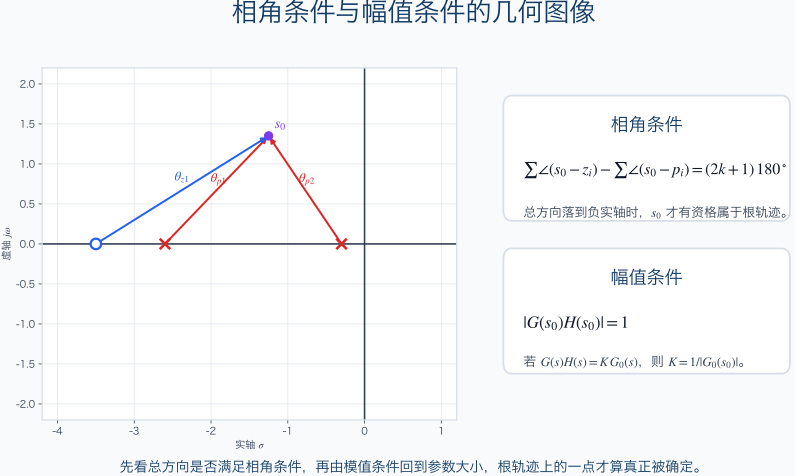
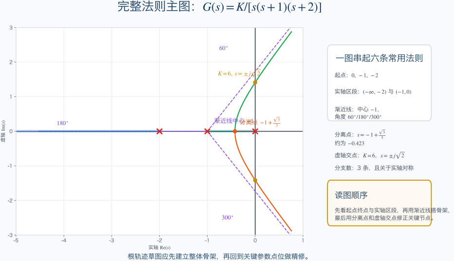
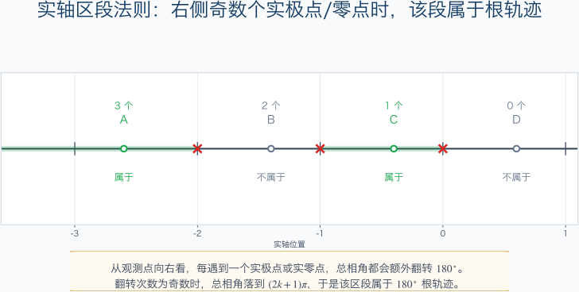
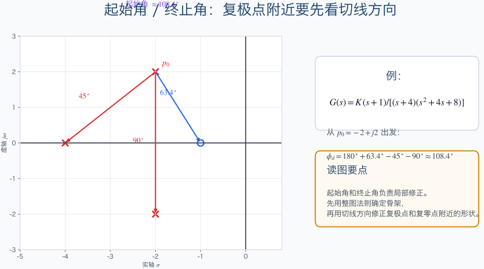
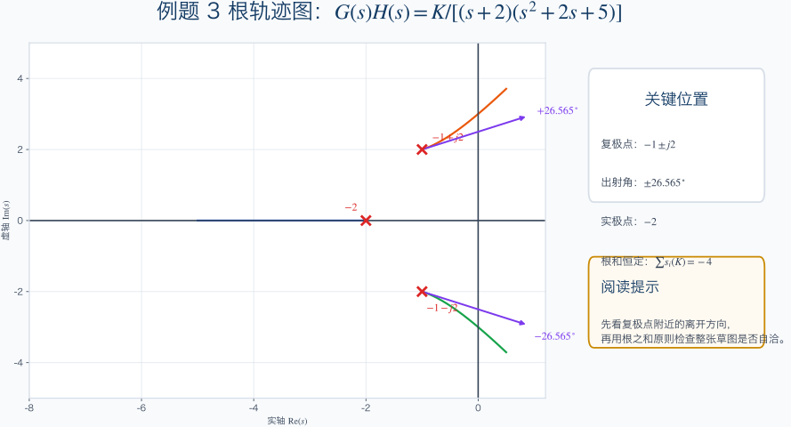

# 单元 3-3 | 教师版课堂讲义

- **标题**：根轨迹机制与完整法则——为什么参数变化会推动闭环极点迁移
- **学时**：90 分钟
- **课型**：理论主线课
- **核心问题**：当开环参数连续变化时，闭环极点为什么会沿特定路径迁移，这条路径又怎样决定稳定性、快慢与振荡趋势
- **课堂判断**：学生不应只停在“会画图”或“会代公式”，而应真正看见“参数变化 -> `GH=-1` -> 根轨迹骨架 -> 关键节点 -> 动态后果”这一整条机制链

`3-2` 已经把稳定边界讲清，本课要把“边界在哪里”推进到“路径怎样形成”。讲到结束时，学生应能把图上的轨迹重新翻译回系统动态，并为 `3-4` 的读图判断与参数窗口分析做好准备。

---

## 一、90 分钟课堂分配

| 环节 | 时间 | 讲解任务 |
|------|------|----------|
| 开场桥接 | 8 分钟 | 从稳定边界转入极点迁移，提出“稳定区间还不够”的核心问题 |
| 主线一：定义与 `GH=-1` | 12 分钟 | 把根轨迹与闭环特征方程直接连起来 |
| 主线二：相角条件与幅值条件 | 12 分钟 | 建立“先判资格，再定参数”的判断顺序 |
| 主线三：完整法则体系 | 18 分钟 | 以骨架、关键点、局部修正三层组织法则 |
| 主线四：统一主例题 | 18 分钟 | 用一个对象串起实轴区段、渐近线、分离点与虚轴交点 |
| 主线五：出射角、入射角与根之和 | 10 分钟 | 把局部方向与整图守恒约束放回同一组法则 |
| 主线六：读图顺序与对象影响 | 8 分钟 | 收口七步读图法与三类开环极点的趋势差异 |
| 后测与总结 | 4 分钟 | 检查条件、法则、例题与读图顺序是否真正连成链 |

---

## 二、课堂展开

### 1. 开场桥接（0-8 分钟）

**讲解重点**

- `3-2` 让学生知道参数会把系统推向哪一段稳定边界，本课要进一步回答：极点为什么沿这条路径走，走到不同位置又意味着什么。
- 开场不急着列法则，先把“边界”与“迁移”区分开。只有学生意识到单点判断不够，后面的法则才有位置。

**可用说法**

- “知道 `K=6` 是边界点，还不等于知道 `0<K<6` 这整段过程中极点怎样移动。”
- “根轨迹不是另一套求根技巧，它研究的是参数连续变化时闭环极点的整体迁移。”
- “如果这条迁移链看清了，图上的骨架、关键节点和动态后果就会连成一体。”

**建议板书**

```text
3-2：边界在哪里
3-3：为什么沿这条路径移动
3-4：怎样按图判断窗口与后果
```

**学生易错**

- 容易把根轨迹理解成“画图版求根”。
- 容易觉得稳定范围一旦已知，趋势判断也就自动完成了。

### 2. 主线一：根轨迹定义与 `GH=-1`（8-20 分钟）

**关键式子**

$$
1 + G(s)H(s) = 0
$$

$$
s=s(K)
$$

$$
L(s)=K\,G_0(s)H(s)
$$

$$
L(s)=-1
$$

**讲解重点**

- 根轨迹研究的是闭环特征方程的根随参数连续变化而形成的点集，观察对象始终是闭环极点。
- 这一段不再插入二阶特例，直接从一般闭环方程进入“参数变化下的闭环根集合”。
- `GH=-1` 不是新内容，而是闭环特征方程的等价表达。把这一点讲稳，后面相角条件与幅值条件才能自然出现。

**课堂推进**

- 先让学生回忆 `3-2` 能回答什么，再追问“若参数继续变化，单点求根为什么不够”。
- 直接把“闭环方程的全部根随 `K` 连续变化”写成定义，避免被某个具体特例牵走。
- 在黑板上把“闭环特征方程 -> 等价写成 `GH=-1` -> 点集条件”写成一条连贯链，不要拆成零散公式。

**学生易错**

- 会把开环极点、闭环极点和轨迹起点混在一起。
- 会把 `GH=-1` 视为额外记忆负担，而不是闭环方程的直接结果。

### 3. 主线二：相角条件与幅值条件（20-32 分钟）

**关键式子**

$$
G(s)H(s)=-1
$$

$$
\angle G(s)H(s)=(2k+1)\pi
$$

$$
|G(s)H(s)|=1
$$

**讲解重点**

- 相角条件回答“这点有没有资格落在根轨迹上”，幅值条件回答“如果在轨迹上，它对应多大参数”。
- 先后顺序必须明确。教师要不断强调：先判资格，再谈参数，否则学生很容易把幅值条件误用成首要判断。
- 这一段适合强依赖几何图像。把“向各极点、零点连线的角度和距离”放回复平面，比单纯代数式更容易让学生建立直观。



**课堂推进**

- 先问学生：若怀疑复平面上一点在根轨迹上，第一步究竟该看什么。
- 再借图说明为什么相角条件先于幅值条件，避免学生一上来就代参数。
- 讲完后可让学生口头判断一个候选点是否具备“轨迹资格”，不要急着让他们算数值。

**学生易错**

- 把“满足幅值条件”误当成“必在轨迹上”。
- 只记结论，不知道相角与几何图像之间的对应关系。

### 4. 主线三：完整法则体系（32-50 分钟）

**关键式子**

$$
\sigma_a=\frac{\sum p_i-\sum z_i}{n-m}
$$

$$
\phi_q=\frac{(2q+1)\pi}{n-m}, \qquad q=0,1,\ldots,n-m-1
$$

$$
\frac{\mathrm{d}K}{\mathrm{d}s}=0
$$

**讲解重点**

- 法则不能平铺直叙，应按三层组织：
  - 骨架：起点终点、分支数、对称性、连续性、实轴区段、渐近线。
  - 关键点：分离点、汇合点、虚轴交点。
  - 局部修正：起始角、终止角。
- 讲法则时始终回到同一张主例图。学生要看到“法则在图上做什么”，而不是只听到一串规则名称。
- “右侧奇数个”“渐近线重心与角度”“虚轴交点连接稳定边界”这几条最值得停下来讲透。







**课堂推进**

- 先只用骨架法则读整张图的大势。
- 再补分离点与虚轴交点，让学生看到这些节点怎样修改先前的骨架判断。
- 最后再收起始角与终止角，说明它们处理的是复极点、复零点附近的局部切线方向。

**学生易错**

- 会把所有法则看成同等优先级，一上来就钻进分离点求导。
- 会把虚轴交点仅当作算出来的一个数，而忽略它与稳定边界的关系。

### 5. 主线四：统一主例题（50-68 分钟）

**关键式子**

$$
G(s)H(s)=\frac{K}{s(s+1)(s+2)}
$$

$$
s^3+3s^2+2s+K=0
$$

$$
(-\infty,-2), \qquad (-1,0)
$$

$$
\sigma_a=-1
$$

$$
60^\circ,\quad 180^\circ,\quad 300^\circ
$$

$$
s=-1+\frac{\sqrt{3}}{3}\approx -0.423
$$

$$
\omega=\sqrt{2}, \qquad K=6, \qquad 0<K<6
$$

**讲解重点**

- 这一题的价值在于把完整法则串成一条判断链，不在于把学生训练成纯手工绘图机器。
- 教学顺序要稳：先用起点终点、实轴区段和渐近线搭骨架，再补分离点和虚轴交点。
- 最后一定回到动态解释：`K` 增大后，共轭极点形成并逐步逼近虚轴，振荡性增强；越过 `K=6` 后，稳定性改变。

**课堂推进**

- 先要求学生只凭骨架法则写出他们已经能确定的信息。
- 再补关键节点，强调关键节点不是替代骨架，而是让骨架更完整。
- 最后用一句整合性结论把图与动态联系起来。

**学生易错**

- 只记住 `K=6` 这个边界值，却不知道它在轨迹图上的位置意义。
- 看到分离点就陷入计算，忘记它只是整张图中的一个局部节点。

### 6. 主线五：出射角、入射角与根之和（68-78 分钟）

**关键式子**

$$
\phi_d(p_i)=\pi+\sum_{j=1}^{m}\angle(p_i-z_j)-\sum_{\substack{r=1\\ r\ne i}}^{n}\angle(p_i-p_r)
\pmod{2\pi}
$$

$$
\phi_a(z_j)=\pi-\sum_{\substack{k=1\\ k\ne j}}^{m}\angle(z_j-z_k)+\sum_{r=1}^{n}\angle(z_j-p_r)
\pmod{2\pi}
$$

$$
\sum_{i=1}^{n}s_i(K)=\sum_{i=1}^{n}p_i
$$

**讲解重点**

- 出射角与入射角回答的是局部切线方向，不是整张图的最终答案。
- 根之和原则回答的是整图守恒约束，它要求局部方向判断必须与整体走向自洽。
- 这一段应先讲法则页，再进例题 3，不要把公式和例题揉成一页。

**课堂推进**

- 先把三条法则并排写清，明确“各自回答什么问题”。
- 再进入例题 3：先求上半平面复极点的出射角，再用共轭对称得到下半平面结果，最后用根之和复核另一实根的位置。
- 结尾用一句话收束：局部方向不能脱离整图约束。

**学生易错**

- 只记住一个出射角数值，忽略它为什么还要接受根之和约束。
- 把出射角、入射角和根之和混成同一类“补充法则”。

### 7. 主线六：读图顺序与对象影响（78-86 分钟）

**讲解重点**

- 七步读图法必须固定为：极点零点、实轴区段、渐近线、实轴关键点、虚轴交点、局部方向、全图复核。
- 三类开环极点的影响要回到对象本身来讲：原点极点、实轴极点、共轭复极点分别会留下不同的轨迹趋势线索。
- 这一段的目标不是再加新内容，而是把前面九项法则整理成稳定的读图入口。

**课堂推进**

- 先让学生复述“为什么读图要先骨架、再关键点、最后补局部方向”。
- 再对照三类开环极点，让学生把“对象类型”和“轨迹趋势”配对起来。
- 这一段结束后直接进入后测，不再继续扩展额外章节。

**学生易错**

- 容易把法则当成平铺清单，不知道先后顺序。
- 只记法则名词，不知道不同开环极点为什么会让轨迹呈现不同趋势。

### 8. 后测与总结（86-90 分钟）

**后测题建议**

1. 若一点满足相角条件但不满足幅值条件，它说明了什么？
2. 为什么画根轨迹时应先看起点终点、实轴区段与渐近线，再去算分离点和虚轴交点？
3. 在例题中，`dK/ds`、劳斯判据、出射角和根之和各自回答什么问题？

**收束语**

- “今天我们把参数变化、闭环极点迁移、九项法则和读图顺序连成了一条线。”
- “下一课的重点不再是补法则，而是把今天这条线变成真正的读图判断与参数窗口分析。”

---

## 三、板书建议

### 板书 1：模块桥接

```text
3-2：稳定边界
↓
3-3：迁移机制与完整法则
↓
3-4：读图、验证、参数窗口
```

### 板书 2：两大条件

```text
1 + GH = 0
↓
GH = -1
↓
相角：能不能在轨迹上
幅值：对应多大参数
```

### 板书 3：法则层次

```text
先看骨架：起点终点 / 实轴区段 / 渐近线
再看关键点：分离点 / 虚轴交点
最后修局部：起始角 / 终止角
```

### 板书 4：主例题结论

```text
G(s)H(s)=K/[s(s+1)(s+2)]
分离点：s≈-0.423
虚轴交点：±j√2
稳定范围：0<K<6
```

### 板书 5：局部方向与整图守恒

```text
出射角 / 入射角：局部切线方向
根之和：整图守恒约束
局部方向必须和整图自洽
```

### 板书 6：七步读图法

```text
极点零点 → 实轴区段 → 渐近线
→ 实轴关键点 → 虚轴交点
→ 局部方向 → 全图复核
```

---

## 四、课堂图形

### 相角条件与幅值条件的几何解释


适合放在“先判资格，再定参数”这一顺序刚刚建立的时候使用。

### 完整法则主例图


整节课都应尽量回到这张主图上讲，让学生始终知道法则落在哪里。

### 实轴区段法则示意图


适合单独放大“右侧奇数个”的判断动作。

### 起始角与终止角示意图


适合解释复极点、复零点附近的局部切线方向。

### 例题 3 出射角与根之和校核图



适合把“局部方向”和“整图自洽”放在同一题里讲清。

---

## 五、教师提示

- 本课主线始终是“参数变化如何推动闭环极点迁移”，不是“根轨迹画图技巧大全”。
- 相角条件和幅值条件若脱离几何图讲，学生很容易把 `GH=-1` 误解为纯记忆结论。
- 主例题一定先讲骨架，再补关键点，否则课堂会过早掉进局部计算。
- 例题 3 不能只停在出射角数值；必须再回到根之和原则做整图复核。
- 结束前一定把法则重组为七步读图法，让学生带着稳定的判断顺序离开本课。
