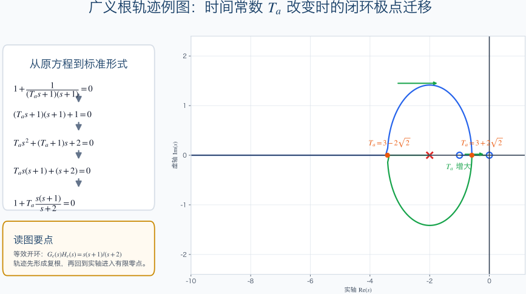
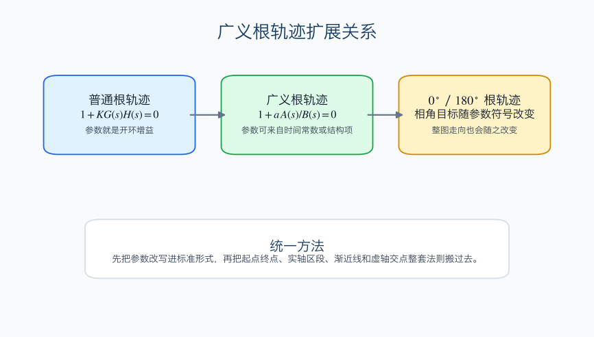
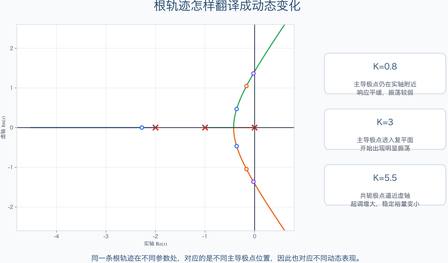

# 单元 3-3 | 教师版课堂讲义

- **标题**：根轨迹机制与完整法则——为什么参数变化会推动闭环极点迁移
- **学时**：90分钟
- **课型**：理论主线课
- **课堂主线**：把 `3-2` 的稳定边界语言推进成“参数变化 -> `GH=-1` -> 根轨迹骨架 -> 广义根轨迹 -> 动态翻译”的完整机制链。
- **上一课衔接语**：上一讲已经回答了“参数推到哪里会碰到稳定边界”，这一讲继续回答“极点为什么会朝那条边界移动，以及它们为什么沿那样的路径走”。
- **下一课铺垫语**：今天先把完整法则体系搭稳；下一讲 `3-4` 再把这套法则转成主图读解、关键节点验证和参数窗口判断。

---

## 一、90 分钟课堂时间分配

| 环节 | 时间 | 目标 |
|------|------|------|
| 开场桥接 | 8 分钟 | 回收 `3-2` 的边界语言，提出“稳定区间还不够”的核心问题 |
| 主线一：根轨迹定义与 `GH=-1` | 12 分钟 | 把“参数变化下的闭环根集合”与闭环特征方程连起来 |
| 主线二：相角条件与幅值条件 | 16 分钟 | 讲清一点是否在根轨迹上的两道入口判断 |
| 主线三：完整法则体系 | 20 分钟 | 按骨架法则、关键节点法则、局部修正规则分层建立体系 |
| 主线四：完整主例题 | 16 分钟 | 用统一对象串起起点终点、实轴区段、渐近线、分离点与虚轴交点 |
| 主线五：广义根轨迹与动态翻译 | 14 分钟 | 把非增益参数与 `0^\circ / 180^\circ` 根轨迹拉回统一总视角 |
| 后测与收束 | 4 分钟 | 检查学生能否从“法则”走到“趋势判断” |

---

## 二、课堂流程

### 1. 开场桥接（0-8 分钟）

**教师要讲的关键话**

- “`3-2` 已经告诉我们稳定区间和边界点在哪里，但工程上更常见的问题是：参数继续变时，极点究竟会往哪里走。”
- “今天这节课不是在学一套孤立画图规则，而是在学参数变化如何翻译成极点迁移。”
- “只要这条迁移逻辑看清，后面的读图判断和参数窗口就有抓手。”

**建议板书**

```text
3-2：边界在哪里
3-3：为什么会沿这条路径移动
3-4：如何按图读窗口与后果
```

**教师提醒**

- 开场先把“边界”与“迁移”区分开，不要直接跳到法则列表。
- 必须让学生意识到：根轨迹服务的是趋势判断，而不是单次求根替代。

### 2. 主线一：根轨迹定义与 `GH=-1`（8-20 分钟）

**必须保留的核心内容**

- 闭环特征方程：
  $$
  1 + G(s)H(s) = 0
  $$
- 参数变化下的闭环根集合：
  $$
  s=s(K)
  $$
- 从二阶简单对象切入“整条变化路径”的必要性：
  $$
  G(s)=\frac{K}{s(0.5s+1)}=\frac{K^\ast}{s(s+2)}, \qquad K^\ast=2K
  $$
  $$
  \lambda_{1,2}=-1\pm\sqrt{1-K^\ast}
  $$

**课堂操作**

- 先让学生口头回忆：`3-2` 中我们能回答什么，不能回答什么。
- 用二阶对象说明“知道某个参数点的根”与“看清一整条变化路径”不是同一件事。
- 收束到一句定义：根轨迹研究的是某个参数连续变化时，闭环极点在复平面形成的点集。

**建议强调**

- 根轨迹首先研究闭环根，不是开环点位本身。
- `GH=-1` 不是新公式，而是闭环特征方程的另一种写法。

### 3. 主线二：相角条件与幅值条件（20-36 分钟）

**必须保留的核心内容**

- 由
  $$
  1 + G(s)H(s)=0
  $$
  直接得到
  $$
  G(s)H(s)=-1
  $$
- 相角条件：
  $$
  \angle G(s)H(s)=(2k+1)\pi
  $$
- 幅值条件：
  $$
  |G(s)H(s)|=1
  $$

**课堂操作**

- 先问学生：若给出复平面上一点，第一件事该算什么。
- 明确顺序：先看相角条件判断“能不能在轨迹上”，再看幅值条件判断“对应多大参数”。
- 调用下图，把“向各极点和零点的连线角度、距离乘积”放回同一张几何图里。


**教师提醒**

- 不要把两大条件讲成孤立代数结论，一定要配几何图讲。
- 不要一上来让学生先算参数值，先让他们养成“先判轨迹资格”的顺序。

### 4. 主线三：完整法则体系（36-56 分钟）

**必须保留的核心内容**

- 起点终点：从开环极点出发，走向有限零点或无穷远。
- 分支数、对称性与连续性：先搭骨架。
- 实轴区段法则：“右侧奇数个”。
- 渐近线中心与夹角：
  $$
  \sigma_a=\frac{\sum p_i-\sum z_i}{n-m}
  $$
  $$
  \phi_q=\frac{(2q+1)\pi}{n-m}, \qquad q=0,1,\ldots,n-m-1
  $$
- 分离点与汇合点：由
  $$
  \frac{\mathrm{d}K}{\mathrm{d}s}=0
  $$
  判定候选点。
- 虚轴交点：用于连接稳定边界。
- 起始角与终止角：用于处理复极点、复零点附近的局部切线方向。

**课堂操作**

- 先把法则分三层写出来：全局骨架、关键节点、局部修正。
- 用主例图反复指认每条法则在图上的落点，不逐条脱离图像空讲。
- 对“实轴区段”“渐近线”“分离点”“虚轴交点”四项做重点展开，起始角/终止角作为局部修正收束。


**教师提醒**

- 本段要讲“法则层次”，不是把所有法则压成同等优先级。
- 不要把课堂变成机械列公式，学生首先要知道为什么先看骨架、再看关键点。

### 5. 主线四：完整主例题（56-72 分钟）

**必须保留的核心内容**

- 统一对象：
  $$
  G(s)H(s)=\frac{K}{s(s+1)(s+2)}
  $$
- 闭环特征方程：
  $$
  s^3+3s^2+2s+K=0
  $$
- 实轴区段：
  $$
  (-\infty,-2), \qquad (-1,0)
  $$
- 渐近线中心与夹角：
  $$
  \sigma_a=-1
  $$
  $$
  60^\circ,\quad 180^\circ,\quad 300^\circ
  $$
- 分离点：
  $$
  s=-1+\frac{\sqrt{3}}{3}\approx -0.423
  $$
- 虚轴交点与稳定范围：
  $$
  \omega=\sqrt{2}, \qquad K=6, \qquad 0<K<6
  $$

**课堂操作**

- 先让学生只用起点终点、实轴区段和渐近线预测整张图的大骨架。
- 再补分离点与虚轴交点，强调“关键点是对骨架的修正，不是替代骨架”。
- 最后回到图上读一句完整结论：`K` 增大后，共轭极点先形成、再逼近虚轴，振荡性增强，超过 `K=6` 后失稳。

**教师提醒**

- 这道题服务“完整机制串联”，不服务高强度手工绘图训练。
- 若课堂时间吃紧，起始角/终止角可只依图口头说明，不必展开完整计算。

### 6. 主线五：广义根轨迹与动态翻译（72-86 分钟）

**必须保留的核心内容**

- 一般参数改写：
  $$
  B(s)+aA(s)=0
  $$
  $$
  1+a\frac{A(s)}{B(s)}=0
  $$
- 等效开环：
  $$
  G_e(s)H_e(s)=\frac{A(s)}{B(s)}, \qquad K_e^\ast=a
  $$
- 时间常数例子：
  $$
  G(s)H(s)=\frac{1}{(T_a s+1)(s+1)}
  $$
  $$
  1+T_a\frac{s(s+1)}{s+2}=0
  $$
- `180^\circ` 根轨迹：
  $$
  \angle G(s)H(s)=(2k+1)\pi
  $$
- `0^\circ` 根轨迹：
  $$
  \angle G(s)H(s)=2k\pi
  $$

**课堂操作**

- 先讲“广义根轨迹没有另外发明新法则，它只是把一般参数重新转回标准根轨迹问题”。
- 调用时间常数例图，让学生顺着“原方程 -> 等效开环 -> 根轨迹 -> 动态变化”这一页读完整逻辑。
- 再用一句对比收束 `0^\circ` 与 `180^\circ` 根轨迹：研究对象相同，区别在参数进入方式与相角条件。
- 最后把读图翻译桥接到动态后果：看左右半平面、看离虚轴距离、看实轴还是复平面主导。







**教师提醒**

- 不要把广义根轨迹讲成附加材料，它是本课总视角的一部分。
- `0^\circ` 与 `180^\circ` 根轨迹只需建立联系与区分，不在本讲展开大量新算例。

### 7. 后测与收束（86-90 分钟）

**后测题建议**

1. 若复平面上一点满足相角条件但不满足幅值条件，它能说明什么？
2. 在根轨迹分析里，为什么要先看起点终点、实轴区段和渐近线，再去算分离点？
3. 广义根轨迹为什么说“没有新法则，只有新改写”？

**收束语**

- “今天这节课把参数变化、闭环极点迁移和动态后果连成了一条完整链。”
- “下一讲进入 `3-4`，把今天这条理论主线变成真正的读图判断、窗口验证和对象化应用。”

---

## 三、板书建议

### 板书 1：模块桥接

```text
3-2：稳定边界
↓
3-3：迁移机制与完整法则
↓
3-4：读图、验证、参数窗口
```

### 板书 2：两大条件

```text
1 + GH = 0
↓
GH = -1
↓
相角：能不能在轨迹上
幅值：对应多大参数
```

### 板书 3：法则层次

```text
先看骨架：起点终点 / 实轴区段 / 渐近线
再看关键点：分离点 / 虚轴交点
最后修局部：起始角 / 终止角
```

### 板书 4：主例题主结论

```text
G(s)H(s)=K/[s(s+1)(s+2)]
分离点：s≈-0.423
虚轴交点：±j√2
稳定范围：0<K<6
```

### 板书 5：广义根轨迹

```text
B(s)+aA(s)=0
↓
1 + a A(s)/B(s) = 0
↓
普通根轨迹工具原样可用
```

### 板书 6：读图翻译

```text
看左右半平面 → 稳定性
看离虚轴距离 → 快慢与拖尾
看实轴/复平面 → 振荡是否出现
```

---

## 四、课堂需调用或补画的图形

### 图形调用：相角条件与幅值条件的几何解释


用途：建立“先判轨迹资格，再判参数大小”的固定顺序。

### 图形调用：完整法则主例图


用途：整节课的主图，起点终点、实轴区段、渐近线、分离点、虚轴交点都尽量回到这一图上讲。

### 图形调用：实轴区段法则示意图


用途：单独放大“右侧奇数个”的判断动作。

### 图形调用：起始角与终止角示意图


用途：服务复极点、复零点附近的局部切线说明。

### 图形调用：时间常数参数的广义根轨迹示意图


用途：把“改写 -> 等效开环 -> 根轨迹”压在同一页里展示。

### 图形调用：普通根轨迹与广义根轨迹的扩展关系


用途：帮助收束“增益根轨迹是广义根轨迹特例”。

### 图形调用：根轨迹到动态变化的翻译图


用途：作为结尾桥，直接连到 `3-4` 的读图与参数窗口。

---

## 五、教师提醒

- 不要把本课讲成“根轨迹画图技巧大全”，主线始终是参数变化如何推动闭环极点迁移。
- 相角条件和幅值条件必须配合几何图讲，否则学生很容易把 `GH=-1` 理解成纯记忆式结论。
- 主例题一定先讲骨架，再补关键点，避免课堂一开始就陷入分离点求导。
- 广义根轨迹不是附录内容，至少要让学生清楚“普通根轨迹只是总视角中的一个特例”。
- 结尾一定把轨迹翻译回稳定性、快慢和振荡性，不让学生停在“图形会画”这一层。
