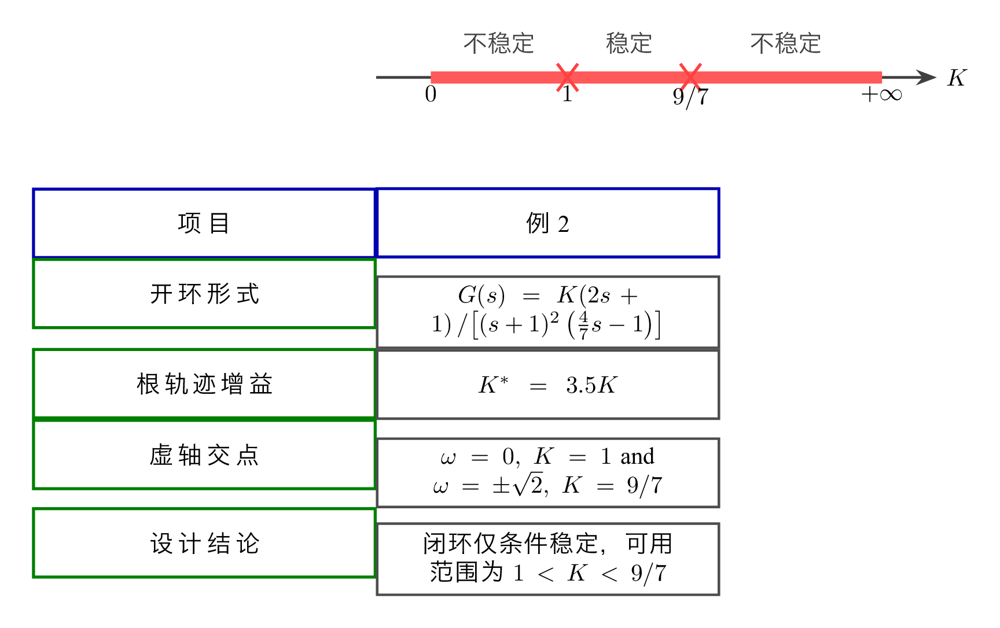
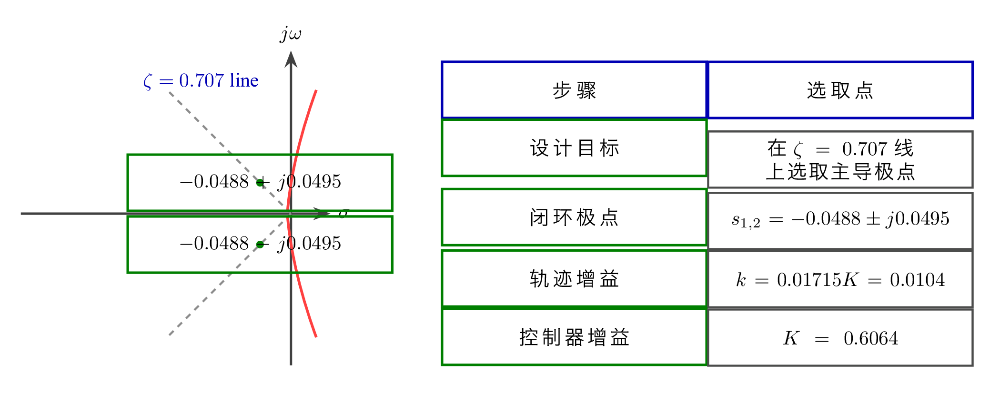

# 单元 3-4 | 教师版课堂讲义

- **标题**：根轨迹读图与对象化验证：把法则真正用到关键节点、参数窗口与工程后果上
- **学时**：90 分钟
- **课型**：实践主线课
- **课堂主线**：围绕同一个船舶航向控制对象，把 `3-3` 的法则压成一条可执行的课堂动作链：`先读关键节点 -> 再判参数窗口 -> 做增益换算 -> 用时域/频域后果回查`
- **衔接说明**：上一讲 `3-3` 讲清“极点为什么沿那样的路径迁移”；这一讲继续追问“拿到这张主图以后，怎样把路径读成判断”；下一讲 `3-5` 再回答“只调增益为什么很快不够，零点为何必须登场”

---

## 一、90 分钟课堂节奏

| 环节 | 时间 | 本段任务 |
| --- | --- | --- |
| 开场桥接 | 8 分钟 | 把学生从“继续听规则”拉回“开始按图判断” |
| 主线一：固定读图顺序 | 10 分钟 | 统一全班观察主图的顺序与语言 |
| 实践一：A/B/C 三版本预测与关键节点标注 | 18 分钟 | 形成第一张 `关键节点读图记录` |
| 实践二：参数窗口判断与增益换算 | 18 分钟 | 形成 `参数窗口判断表`，写清 `k -> K` |
| 实践三：对象化三域验证 | 20 分钟 | 形成 `对象化验证记录`，把图上判断落回对象后果 |
| 汇总纠偏与后测 | 10 分钟 | 把典型误判收束成可复述的判断链 |
| 总结与铺垫 | 6 分钟 | 把本课收口到“只调增益已接近边界” |

> 课堂中学生亲自操作、观察、记录、判断、对比、修正的时间不少于 56 分钟，主要集中在三段实践活动中。对这节实践课而言，时间的重心不在教师讲完，而在学生把判断真正写出来。

## 二、课堂推进建议

### 1. 开场桥接（0-8 分钟）

这一段的任务，不是再讲一遍根轨迹法则，而是把学生的期待重新摆正。教师可以先回收上一讲的结论：`3-3` 已经把“轨迹为什么这样走”讲清，`3-4` 要解决的，是面对一张已经画好的主图，怎样把它读成可辩护的工程判断。若配合 `3-4-intro-video.mp4` 或封面漫画使用，导入问题宜落在一句追问上：“如果系统还稳定，是不是就已经足够好？”

这时不必急于回答哪个版本更优，只需把 A、B、C 三个版本都还位于稳定区内、但气质已经明显不同这一事实摆出来。让学生先感到不满足，后面的窗口语言才会自然成立。开场时只建立任务，不提前滑入计算细节。

**建议板书**

```text
3-3：法则怎么建立
3-4：法则怎么读成判断
主线：关键节点 -> 参数窗口 -> 增益换算 -> 三域验证
```

### 2. 主线一：固定读图顺序（8-18 分钟）

这一段要统一的是动作，而不是答案。教师应先投出主图，再把全班的注意力压回同一个固定对象：

$$
G(s)=\frac{0.01715K}{s(s+0.1)(s+2.14375)}
$$

同时明确图上增益与控制器增益的关系：

$$
k=0.01715K
$$

读图顺序建议固定为四步：

1. 先看起点、终点和分支数量，确认整张图的骨架；
2. 再找分离点、虚轴交点和主导极点候选；
3. 再根据这些节点讨论稳定窗口与可接受窗口；
4. 最后才落到具体参数和工程后果。

课堂里可以先让学生说出“第一眼最想看哪里”，再把零散回答收束为这条顺序。要反复提醒学生：先读轨迹骨架，再谈局部点位；先形成窗口语言，再谈哪个参数更好。这样做的目的，是避免学生一开始就凭感觉替某个版本下结论。

### 3. 实践一：A/B/C 三版本预测与关键节点标注（18-36 分钟）

这一段应让学生先预测，再标注，最后才讨论。三组贯穿版本保持固定：

$$
K_A=0.2,\qquad K_B=0.6064,\qquad K_C=20
$$

参考主导极点分别为：

$$
A:\ -0.0203,\ -0.0790
$$

$$
B:\ -0.0488\pm j0.0496
$$

$$
C:\ -0.0135\pm j0.3931
$$

主图中的关键节点则回收到：

$$
s_{\text{分离}}\approx -0.0494,\qquad s_{\text{虚轴}}=\pm j0.4626
$$

先让学生独立写出 A、B、C 的“快慢、振荡、风险”预测，再回到主图完成 `关键节点读图记录`。教师巡视时不必面面俱到，只集中抓三种典型误判：只盯单个点、不看整条分支；把“靠左”直接等同于“整体更好”；没有把虚轴交点当成明确边界。

这一段的追问可以围绕三句话展开：“为什么 A 看起来更保守，却不一定更优？”“为什么 B 的参考意义来自图上证据，而不是教师指定？”“为什么 C 还没失稳，却已经让人感到风险上升？”这样既能保住课堂节奏，也能让后面的窗口判断不至于悬空。

### 4. 实践二：参数窗口判断与增益换算（36-54 分钟）

这一段是本课最容易被轻描淡写、却最不能被跳过的地方。教师应把稳定窗口与换算关系明白地写出来：

$$
0<K<28.05
$$

$$
k_B=0.0104 \Rightarrow K_B=\frac{0.0104}{0.01715}\approx 0.6064
$$

根轨迹主图先读到的是 $k$，工程对象真正要写回控制器的是 $K$。若学生只停在“图上读出来了一个增益”，但没有完成换算，这个判断在工程上仍未闭合。

建议让学生先独立填写 `参数窗口判断表` 的前三列：图上位置、窗口位置、换算结果。随后再把“稳定窗口”和“可接受窗口”区别开来。此处可以故意展示两类错误答案：一种只写“C 还稳定”，却没有说明它在窗口中的位置和代价；另一种直接把图上的 $k$ 当成控制器的 $K$。让学生看见错误，比教师单向提醒更容易留下记忆。

**建议板书**

```text
图上读到的是 k
工程里要用的是 K
k = 0.01715K
稳定窗口 ≠ 可接受窗口
```

若课堂时间被挤压，这一段也应优先保住，因为它决定本课是否真正具有“工程判断”而不只是“图形观察”的性质。

### 5. 实践三：对象化三域验证（54-74 分钟）

当学生已经形成关键节点和窗口语言后，再把他们带回对象化验证。这里仍只围绕 A、B、C 三个版本展开，避免对象切换带来额外负担。核心结论可以保持简洁而明确：

- A：稳定，但明显偏慢；
- B：速度、阻尼与稳定裕量较为平衡；
- C：虽然仍稳定，但振荡更强，频域风险更早暴露。

课堂组织上，宜让学生分组查看三类媒体：根轨迹主图、阶跃响应对比、Bode 对比。每组在 `对象化验证记录` 中至少写出一句完整的话，说明“主图上的哪个判断，被时域或频域中的哪个证据支持”。教师巡回时，可以反复追问三件事：哪一个域最早暴露 C 的风险？为什么 B 的主导极点近似在这里仍然可信？如果只给时域图而不给主图，学生会失去哪一种窗口语言？

这一段只服务“验证”，不再横向扩写 Nyquist 判据、裕度公式、零点补偿或模块 4 的设计任务。频域在这里的职责，是为读图结论补证，而不是另开一节新的频域课。

### 6. 汇总纠偏与后测（74-84 分钟）

这一段的目标，是把前面三段分散的动作重新压成一条可复述的判断链。后测不必多，但要准。可以围绕以下三题组织：

1. 为什么“还稳定”不足以构成完整判断？
2. 若图上读到 $k=0.0104$，为什么不能直接把它写成实际控制器增益？
3. 在 A/B/C 三个版本中，哪一个更适合作为参考工作点？你的证据链是什么？

点评时，教师应把“完整判断”的最低构成讲清：关键节点、窗口位置、换算链条，以及至少一个时域或频域后果。没有换算的结论，不算工程判断；没有三域回查的窗口判断，也容易流于“看上去不错”的印象式结论。

### 7. 总结与铺垫（84-90 分钟）

收束时可以把话说得非常简单，但要准确：“今天我们把根轨迹从‘会看路径’推进到了‘能写判断’。沿着既有根轨迹只调增益，已经可以做出不少结论，但也已经开始逼近它自己的边界。下一讲 `3-5` 进入零点，不是因为今天的方法错了，而是因为今天的方法已经把自己的极限暴露出来了。”

这段收口既要让学生感到本课完成了一个完整动作，也要让他们明白后续结构改变并不是另起炉灶，而是从今天的边界自然生长出来的。

## 三、建议板书

### 板书 1：本课主线

```text
关键节点 -> 参数窗口 -> 增益换算 -> 三域验证
```

### 板书 2：三版本对象

```text
A：K=0.2
B：K=0.6064
C：K=20
```

### 板书 3：关键节点

```text
分离点：s≈-0.0494
虚轴交点：±j0.4626
稳定窗口：0<K<28.05
```

### 板书 4：换算提醒

```text
k = 0.01715K
主图先读 k
工程最终用 K
```

### 板书 5：三域回查

```text
根轨迹：窗口与主导极点
时域：快慢、振荡、拖尾
频域：带宽、峰值、风险感
```

### 板书 6：对下一课的桥接

```text
只调增益 -> 很快到边界
要继续改善 -> 必须改变结构
零点即将登场
```

## 四、课堂需调用或补画的图形

### 图形调用：主图总览


用途：整节课都回到这一张图，提醒学生所有判断都服务于同一个对象，而不是在多张图之间零散跳转。

### 图形调用：关键节点标注图

{width=84%}

用途：对应实践一，帮助学生把分离点、虚轴交点与主导极点候选写成第一张记录表，而不是只在口头上指出位置。

### 图形调用：版本 B 参考工作点图

{width=84%}

用途：说明“参考工作点”来自图上的证据链，而不是教师预设的唯一答案。

### 图形调用：条件稳定窗口图

{width=80%}

用途：对应实践二，专门服务“稳定窗口”与“可接受窗口”的区分。

### 图形调用：三版本阶跃响应对比

{width=62%}

用途：服务实践三中的时域回查，让学生看见“图上判断”怎样落到响应快慢、振荡和拖尾上。

### 图形调用：三版本 Bode 对比

{width=88%}

用途：服务实践三中的频域回查，强调 C 的风险并不是等到失稳以后才突然出现。

### 图形调用：主导极点近似可信性

{width=88%}

用途：解释为什么版本 B 可以用主导极点近似抓住主要动态，同时也提醒学生近似并不覆盖所有高频细节。

## 五、教师提醒

这节课最重要的，不是“讲得多”，而是让学生真的把判断写出来。课堂上最常见的三种偏差分别是：只看稳不稳、不区分 `k` 与 `K`、只凭时域感觉却不回到主图。如果时间紧张，优先保住“窗口判断与增益换算”这一段，因为它最能体现本课的实践性质。结尾也一定要说清：今天并不是在寻找一个放之四海而皆准的最佳参数，而是在学习怎样把主图读成有证据的工程判断。
