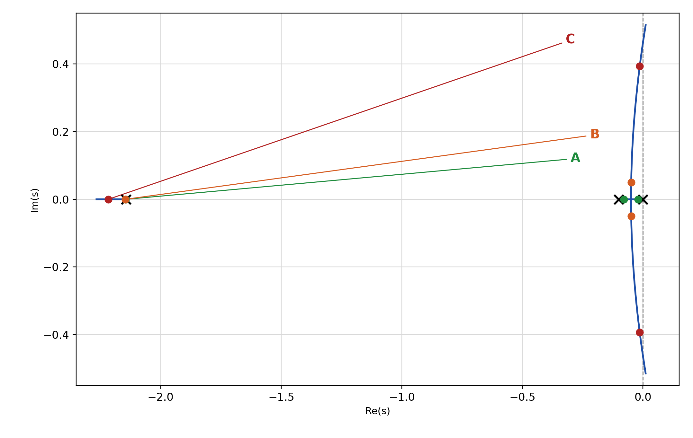
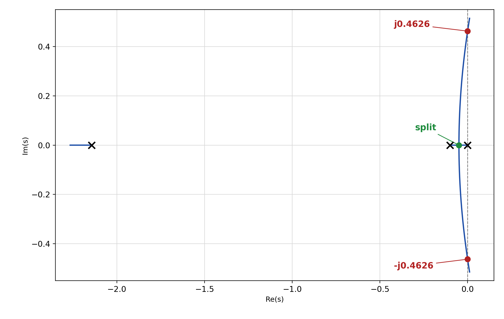
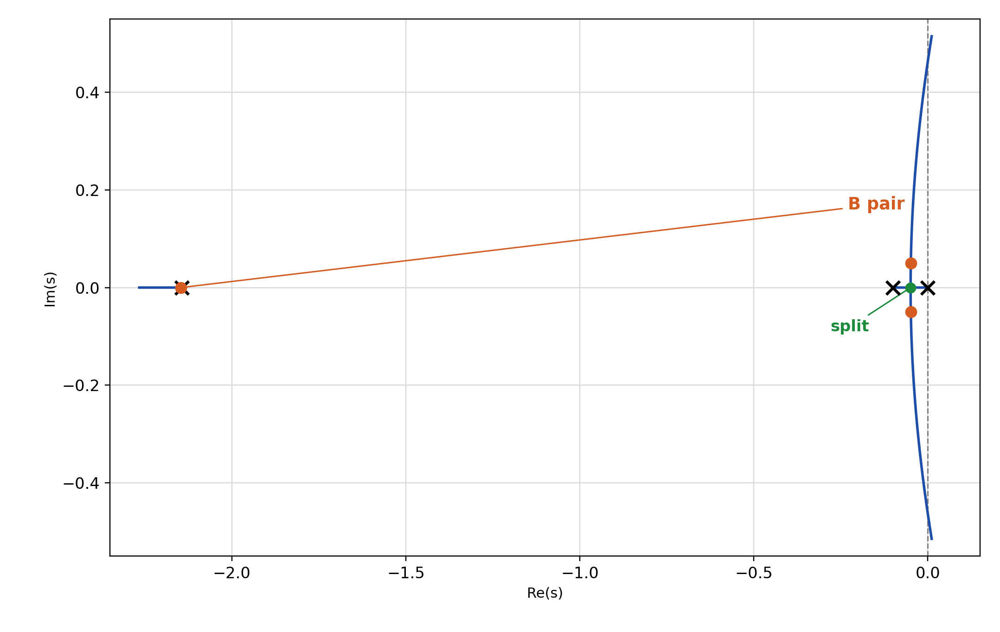
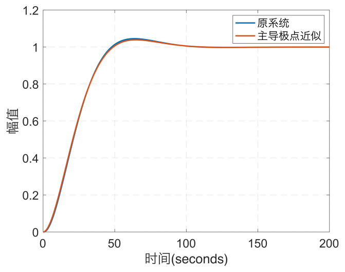
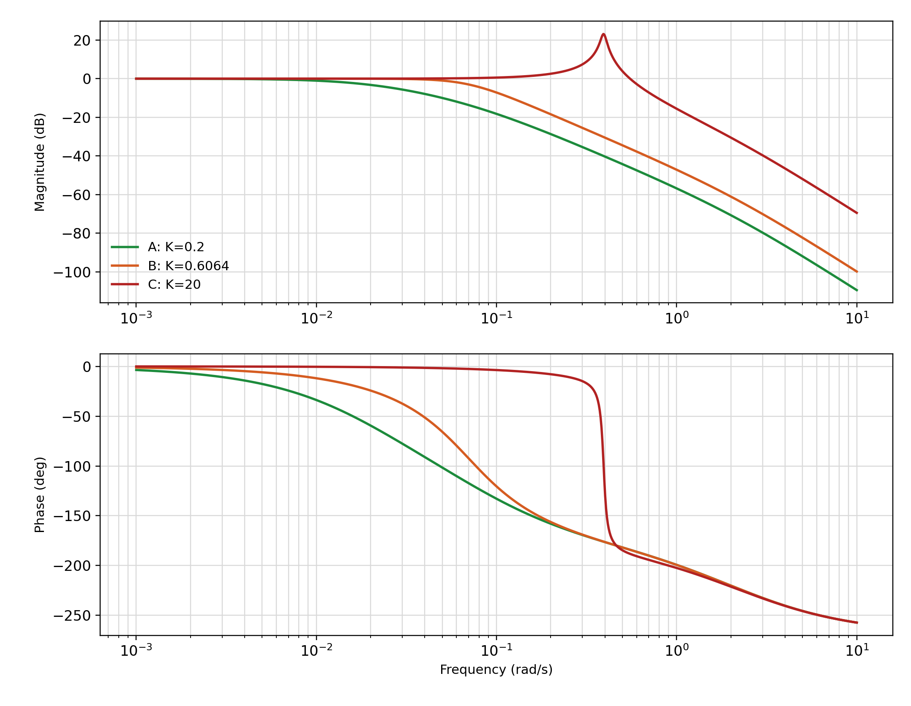
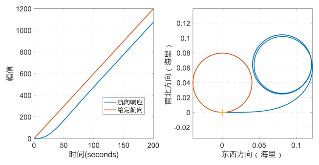
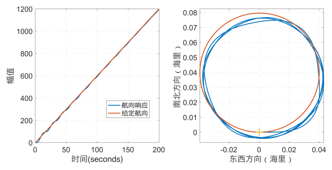
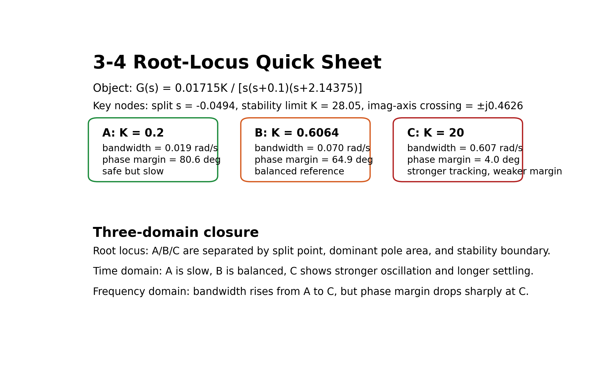

# 单元 3-4 | 根轨迹读图与对象化验证——把法则真正用到主图、参数窗口与工程后果上

- **层次**：模块3 实践主线 · 第四课
- **学时**：90分钟
- **知识类型**：[C] + [X]
- **前置**：已掌握闭环极点与稳定性的关系，能读懂劳斯判据给出的稳定边界，已系统学习根轨迹定义、相角条件/幅值条件与完整法则体系
- **后续**：3-5（零点引入与动态改善）、4-1（设计起点：性能指标体系、工程约束与可行域表达）
- **讲义定位**：这份讲义将带你把 `3-3` 学过的根轨迹法则用于工程读图，沿着 `关键节点读图 -> 参数窗口判断 -> 根轨迹增益换算 -> 对象化三域验证` 这条主线，把读图结论落成可比较、可解释的方案判断。

---

## 一、开场：为什么还要继续读图

### 1.1 从“稳定了”走向“是否真的好用”

在 `3-2` 中，我们已经学会了一个很有力量的判断：  
某个参数取值落在哪个区间时，系统稳定；继续变化时，又会在什么位置逼近虚轴边界。

这一步回答了“系统能不能工作”。  
工程上还要继续追问“系统工作得怎么样”。同样落在稳定区间里的两个参数，常常会给出完全不同的结果：

- 一个版本虽然稳定，但响应拖得很慢；
- 一个版本虽然稳定，但振荡明显、超调偏大；
- 还有一个版本在主图上看似还能继续调，却已经逼近工程上不愿接受的边界。

以船舶航向控制为例，这个差别并不抽象。  
船舶接到转向指令后，控制系统既要把航向拉回目标附近，又要尽量避免长时间摇摆和过大的操舵负担。  
如果我们只知道“当前参数仍然稳定”，却读不出“继续增益后会更快还是更抖、会更稳健还是更冒险”，那么这张根轨迹图就还没有真正进入工程判断。

这一讲要补上的就是这个缺口。  
根轨迹除了说明极点怎样移动，还要承担三件更贴近工程的工作：

1. 从主图中先找出最关键的节点与边界；
2. 把这些节点翻译成参数窗口与方案差异；
3. 再用时域响应和频域后果检验我们的读图结论是否可靠。

这一讲的核心问题可以压缩成一句话：

> 一张根轨迹图，怎样才能从“会看路径”走到“能做判断”？

### 1.2 三项学习产出

为了把“读图”落到可检验的结果上，你需要完成三项学习产出。

| 学习产出 | 你要回答的问题 | 产出中必须出现的关键信息 |
| --- | --- | --- |
| `关键节点读图记录` | 这张主图上最值得先看的位置在哪里？ | 分离点/汇合点、虚轴交点、主导极点候选、稳定窗口 |
| `参数窗口判断表` | 哪些参数“能稳住”，哪些参数“更值得用”？ | 根轨迹增益、实际控制器增益、稳定性判断、性能趋势 |
| `对象化验证记录` | 主图上的判断能否在真实对象上站住？ | 时域后果、频域后果、主导极点近似是否可信 |

这三项产出连起来，就是这一讲的完整判断链：

- `关键节点读图记录` 负责把图上的关键信息找出来；
- `参数窗口判断表` 负责把读图结果转成参数选择语言；
- `对象化验证记录` 负责检查这些判断在工程对象上是否一致。

当你能独立完成这三项记录时，就说明你已经从“知道法则名称”走到了“能把法则变成判断依据”。

### 1.3 知识地图定位

回到模块3的主线地图，这一讲正好接在根轨迹法则之后。

`3-3` 已经把根轨迹的基本对象、判别条件和完整法则体系立住了。  
你已经知道轨迹为什么会从开环极点出发、怎样判断实轴区段、为什么会出现分离点、渐近线和虚轴交点。  
这些内容给出了“轨迹怎样形成”的理论骨架。

`3-4` 更接近工程现场。  
这里不再重讲法则证明，而是把法则整理成稳定的读图顺序。你将看到：

- 同一对象族的不同版本，怎样在一张主图上表现出不同的动态倾向；
- 稳定窗口与可接受窗口为什么不能简单画等号；
- 主图上的“增益”为什么还要进一步换算，才能变成实际控制器参数；
- 为什么读图结论还需要时域响应与频域后果来交叉验证。

学完这一讲，你会得到一个清楚的基线：  
只沿既有根轨迹调增益，已经能读出不少工程信息，但也会很快碰到边界。  
这条边界会直接引向下一课 `3-5`：如果只靠调增益已经难以兼顾多个目标，控制器结构就必须继续变化，零点也就要进入主线。

### 1.4 [AI融入点] 先预测，再让 AI 参与对比

在进入后续主工作区之前，你可以先做一个很短的预测：

1. 如果某个对象的根轨迹离虚轴还较远，你会不会直接判断它“更好用”？
2. 如果两个版本都稳定，你会优先看哪一个版本是否更值得选？
3. 如果主图显示某个参数附近主导极点看起来不错，你是否会马上把它当作最终方案？

先把你的直觉写下来，再把这些问题交给 AI，让它给出自己的解释。  
AI 的回答可以帮助你暴露隐藏的假设，但最后的判断不能交给 AI 代替。你需要在后面的读图、换算和验证中逐步核对：哪些直觉是可靠的，哪些只是“看上去很稳”的错觉。

## 二、读图顺序：拿到主图先做什么

这一章只做一件事：把根轨迹主图的阅读顺序固定下来。  
顺序稳定，后面的判断才会稳定。顺序一乱，最常见的错误就是只盯局部节点，或者看到某个极点位置顺眼就直接跳到参数结论。

### 2.1 第一步：先看起点、终点和分支数量

拿到一张根轨迹图，第一眼先不要急着找漂亮的落点，也不要先猜哪个参数更好。  
先看三件事：

1. 轨迹从哪些开环极点出发；
2. 轨迹最终走向哪些终点；
3. 一共有多少条分支。

这一步的作用是先把整张图的“骨架”立住。  
你先知道对象的整体结构，后面看到分离点、虚轴交点和主导极点候选时，才知道它们各自处在什么背景里。  
如果一开始就跳进局部节点，很容易看见一个点，却不知道这个点为什么重要。

### 2.2 第二步：再找关键节点

骨架看清后，下一步再找关键节点。  
最值得优先看的节点有四类：

- 分离点或汇合点；
- 虚轴交点；
- 主导极点候选；
- 稳定窗口的边界位置。

分离点和汇合点告诉你轨迹的走向正在发生明显变化。  
虚轴交点告诉你“再往前走就要碰到稳定底线”。  
主导极点候选则最重要，因为后面所有对快慢、振荡、超调和带宽的讨论，几乎都会从这里展开。

第二步先抓真正决定后续判断的节点。

### 2.3 第三步：判断窗口，而不是只判断稳定

很多学生看到根轨迹没有越过虚轴，就会下意识地说“这个参数可以”。  
这句话只说对了一半。

稳定只说明系统还能工作。  
工程上还要继续判断：它工作得是否值得接受。  
因此，第三步要同时看两个窗口：

- 稳定窗口：参数还能不能让系统保持稳定；
- 可接受窗口：参数是否让动态后果仍然落在可以接受的范围内。

这一步一定要单独拎出来，因为“稳定”和“好用”不是一回事。  
有些参数虽然还在稳定区间里，但振荡已经太明显、超调已经偏大，或者频域特性已经朝不理想的方向偏移。  
如果这一步省掉，后面的结论常常会显得过于乐观。

### 2.4 第四步：最后再谈参数和后果

前面三步完成后，最后才讨论“这个位置对应什么参数”和“这个参数会带来什么后果”。

这里要连起两条链：

1. 图上的位置怎样对应到参数变化；
2. 这个位置为什么会带来相应的时域与频域表现。

这样安排顺序，有一个很直接的好处：  
你不会因为某个极点位置看起来顺眼，就立刻把它当成结论；你会先确认它属于哪段轨迹、经过了哪些关键节点、落在什么窗口里，然后再讨论它到底值不值得选。

把这四步固定下来后，后面的训练就会自然展开：

- 第三章用它来做三版本预测；
- 第四章用它来整理关键节点读图记录；
- 第五章用它来判断参数窗口并完成增益换算；
- 第七章再用时域和频域结果反过来检查这套读图结论是否站得住。

## 三、主工作区 A：同一对象族三版本预测

从这一章开始，整节课只围绕一个对象展开，不再来回换例子。  
我们固定使用船舶航向控制的根轨迹对象

$$
G(s)=\frac{0.01715K}{s(s+0.1)(s+2.14375)}
$$

为了把“图上的增益”和“控制器增益”区分开，先记

$$
k = 0.01715K
$$

后面主图上读到的根轨迹增益先写成 $k$，再换回实际比例增益 $K$。

下面固定比较三个版本：

| 版本 | 实际比例增益 $K$ | 根轨迹增益 $k$ | 闭环极点特征 | 版本特征 |
| --- | --- | --- | --- | --- |
| A | $0.2$ | $0.00343$ | 三个实极点，主导极点约为 $-0.0203$、$-0.0790$ | 稳定但保守 |
| B | $0.6064$ | $0.0104$ | 主导极点约为 $-0.0488\pm j0.0496$ | 平衡参考点 |
| C | $20$ | $0.343$ | 主导极点约为 $-0.0135\pm j0.3931$ | 仍稳定但明显冒险 |

这三个版本是故意挑开的：

- A 让你看见“稳住了，但明显偏慢”是什么样；
- B 对应教材中阻尼比较理想的参考点；
- C 还没有失稳，但已经把风险感带出来了。

{width=88%}

这张图就是后面整节课反复使用的主图。  
阅读时先不要急着盯某一个点，而要先建立整体印象：三条分支从 $0$、$-0.1$ 和 $-2.14375$ 出发，其中靠近原点的两支决定了 A、B、C 三个版本的主导差异；最左侧那一支虽然也属于闭环极点，但它离虚轴较远，主要承担背景角色。

这一章先不急着下结论。  
如果只看主图，你会把 A、B、C 分别读成什么样？

### 3.1 先对这三个版本做第一判断

现在先不要算稳定范围，也不要先看后面的验证结论。  
只根据这三个版本的极点位置，先做三件事的预测：

1. 谁最慢；
2. 谁看起来最平衡；
3. 谁虽然稳定，但振荡和风险感最强。

对这组三版本，学生最常见的第一判断通常是：

- A 看起来最保守；
- B 看起来最均衡；
- C 看起来虽然还没碰到失稳边界，但已经明显更激进。

这个第一判断未必要一次全对，但一定要先写下来。  
因为后面第四章到第七章，本质上都在检查这三个判断到底有没有证据支持。

### 3.2 把预测写成表

在继续往下读之前，先按下表写出你的第一判断：

| 版本 | 你对速度的预测 | 你对振荡的预测 | 你对风险的预测 |
| --- | --- | --- | --- |
| A（$K=0.2$） | ________ | ________ | ________ |
| B（$K=0.6064$） | ________ | ________ | ________ |
| C（$K=20$） | ________ | ________ | ________ |

填表时只要求你先说清第一反应，不要求一步就把理由写完整。  
但至少要把“慢不慢、抖不抖、险不险”这三件事说出来。

### 3.3 [AI融入点] 让 AI 先给出版本排序

做完上面的预测后，可以把同样的问题交给 AI，例如：

> 对对象 $G(s)=0.01715K/[s(s+0.1)(s+2.14375)]$，比较 $K=0.2$、$0.6064$ 和 $20$ 三个版本。只根据根轨迹和主导极点位置判断，哪个版本更慢，哪个版本更平衡，哪个版本虽然稳定但风险更强？请分别说明理由。

拿到回答后，不要立刻采信。  
你真正要比的是：

- AI 是否也把 A 读成“保守但慢”；
- AI 是否把 B 读成“平衡点”；
- AI 是否看出 C 虽然稳定，但主导极点已经明显向虚轴靠近。

如果 AI 和你的直觉不一致，先把分歧记下来。  
后面第四章开始，我们就用同一张图上的关键节点，把这三组判断逐步核对。

## 四、主工作区 B：关键节点读图

现在把第三章的预测真正落到这张主图上。  
对这个对象，最值得先抓的关键节点有四个：

1. 起点：$0$、$-0.1$、$-2.14375$；
2. 实轴分离点：$s\approx -0.0494$；
3. 虚轴交点：$s=\pm j0.4626$；
4. 虚轴交点对应的稳定边界：$K\approx 28.05$。

这四个量一旦抓住，A、B、C 三个版本就不再只是标签，而会变成有证据支撑的位置判断。

### 4.1 起点先告诉你对象的基本骨架

这条根轨迹从三个开环极点出发：$0$、$-0.1$ 和 $-2.14375$。  
其中，$-2.14375$ 这一支明显更靠左，离另外两支更远。  
这意味着后面真正主导动态变化的，主要是从 $0$ 和 $-0.1$ 出发的那一对分支。

所以，一拿到这张图，脑子里就要先有一句话：

> 这是一条“三极点对象的根轨迹”，决定 A、B、C 三个版本差异的，主要是靠近原点的那一对主导分支。

### 4.2 分离点告诉你“从这里开始不再是纯实轴系统”

对这个对象，实轴分离点约为

$$
s \approx -0.0494
$$

它刚好落在 $-0.1$ 和 $0$ 之间。  
这个位置非常关键，因为它把主图分成了两个阶段：

- 分离点之前，主导极点主要还是实极点；
- 分离点之后，主导分支离开实轴，进入共轭复极点区域。

这正好解释了版本 A 和版本 B 的区别。  
A 的极点还停留在实轴附近，所以它给人的第一感觉是“稳，但慢”；  
B 已经越过分离点，进入共轭复平面，因此开始出现“速度更快、但振荡也开始出现”的特征。

{width=84%}

上图把这条主图最关键的两个节点直接钉住了：  
$s\approx -0.0494$ 是实轴分离点，$s=\pm j0.4626$ 是虚轴交点。  
因此，读这条根轨迹时不能只盯着“轨迹弯没弯出去”，还要同时看清：主导分支是从哪里离开实轴的，以及它最后会在什么位置碰到稳定边界。

分离点的计算不能只记结果，还要把法则和步骤写完整。  
对一般开环对象

$$
L(s)=K\frac{N(s)}{D(s)}
$$

若某个分离点或汇合点位于实轴根轨迹上，那么它必须满足两个条件：

1. 它是由 $K(s)=-D(s)/N(s)$ 求导得到的候选点，即

$$
\frac{\mathrm{d}K}{\mathrm{d}s}=0
$$

2. 它还必须真的落在合法实轴根轨迹区段上，并且对应的参数值属于本题允许的范围。

把这个法则套到该对象上，

$$
K(s)=-\frac{s(s+0.1)(s+2.14375)}{0.01715}
$$

对 $s$ 求导，得到

$$
\frac{\mathrm{d}K}{\mathrm{d}s}
=-\frac{3s^2+4.4875s+0.214375}{0.01715}
$$

令其等于零，可得分离点方程

$$
3s^2+4.4875s+0.214375=0
$$

解得两个候选点

$$
s_1\approx -1.4464,\qquad s_2\approx -0.0494
$$

接下来不能立刻宣布“两者都是分离点”，还要做合法性检查。  
本对象实轴根轨迹只出现在 $(-\infty,-2.14375)$ 与 $(-0.1,0)$ 这两段上。  
其中 $s_1\approx -1.4464$ 落在区段 $(-2.14375,-0.1)$ 内，这一段不是根轨迹；同时它对应的参数值约为 $K\approx -79.19$，也不属于本题讨论的正增益范围。  
因此，真正的实轴分离点只能是

$$
s\approx -0.0494
$$

它对应的实际比例增益约为

$$
K\approx 0.3053
$$

这一步写全以后，你就会明白：  
分离点要先求候选点，再经过实轴区段和参数范围两次筛选。

### 4.3 虚轴交点告诉你稳定边界到底在哪里

用劳斯判据或虚轴交点条件核对，可得这个对象的稳定边界约为

$$
K \approx 28.05
$$

对应交点约为

$$
s=\pm j0.4626
$$

这个结果有两个直接作用。

第一，它把“系统还能保持稳定”的上界钉住了。  
后面看到任何版本时，你都可以立刻判断：它离这条边界还远不远。

第二，它让版本 C 的风险感变得具体。  
C 取的是 $K=20$，还没有穿过虚轴，所以它仍然稳定；  
但它已经明显在朝这条边界靠近，所以“风险更强”有清楚的主图依据。

### 4.4 主导极点候选决定三版本的读图结论

把三个版本的主导极点放在一起看，差别就会很清楚：

- A：主导极点约为 $-0.0203$、$-0.0790$，仍是实极点主导；
- B：主导极点约为 $-0.0488\pm j0.0496$；
- C：主导极点约为 $-0.0135\pm j0.3931$。

这三组位置正好给出三种不同的图上结论：

- A 的主导极点离虚轴不算远，但仍在实轴上，因此振荡弱，响应偏慢；
- B 的主导极点进入复平面，但实部和虚部比较均衡，所以它更像一个“速度和阻尼折中”的工作点；
- C 的主导极点虽然仍在左半平面，但实部已经很小，虚部明显增大，所以振荡感强、稳定余量小。

这时第三章里的预测就可以写得更扎实：  
B 的主导极点落在分离点之后、虚轴之前，而且比 C 更远离稳定边界，所以更接近平衡工作点。

### 4.5 `关键节点读图记录`

| 对象版本 | 起点/终点判断 | 分离点或汇合点 | 虚轴交点 | 主导极点候选 | 读图结论 |
| --- | --- | --- | --- | --- | --- |
| 版本 A | 主导分支仍由 $0$ 与 $-0.1$ 出发的两支控制 | 仍在分离点 $s\approx -0.0494$ 之前 | 离 $K\approx 28.05$ 的边界很远 | $-0.0203$、$-0.0790$ | 稳定、振荡弱，但明显偏慢 |
| 版本 B | 主导分支已越过分离点，进入复平面 | 已越过分离点 | 仍远离虚轴边界 | $-0.0488\pm j0.0496$ | 速度与阻尼较平衡，是参考工作点 |
| 版本 C | 主导分支在复平面内继续向虚轴逼近 | 分离点早已越过 | 距虚轴边界不远 | $-0.0135\pm j0.3931$ | 仍稳定，但振荡强、风险感明显 |

## 五、主工作区 C：参数窗口与增益换算

到了这里，主图上的判断必须落成参数语言。  
对这个对象，先用稳定边界把第一层窗口钉住：

$$
0<K<28.05
$$

这说明 A、B、C 三个版本都还在稳定窗口里。  
但仅有这一句还不够，因为这里真正要练的是第二层窗口：哪些参数虽然稳定，却已经不值得选。

### 5.1 先把图上的增益和实际增益分开

这个对象最容易出错的地方就在这里。  
主图上真正参与根轨迹的是

$$
k=0.01715K
$$

所以根轨迹增益和实际控制器增益的换算关系是

$$
K=\frac{k}{0.01715}
$$

因此，版本 B 在图上读到的是 $k=0.0104$，真正写回控制器时对应的是

$$
K=\frac{0.0104}{0.01715}\approx 0.6064
$$

如果把图上的 $k$ 直接抄成控制器增益 $K$，前面的读图结论虽然对，最后参数仍然会写错。

### 5.2 再把稳定窗口和可接受窗口分开

对这组三版本，可以先形成一个很直观的窗口判断：

- A 当然稳定，但明显偏保守；
- B 稳定，而且主导极点位置更接近平衡区域；
- C 仍然稳定，但已经明显在朝风险区靠近。

所以，这一章更该写清的是：

- 谁只是“能稳住”；
- 谁更接近“愿意采用”的区域；
- 谁虽然没失稳，但已经开始显得不划算。

这正是稳定窗口和可接受窗口的区别。

### 5.3 `参数窗口判断表`

| 对象版本 | 根轨迹增益 $k$ | 实际控制器增益 $K$ | 稳定性判断 | 主导极点判断 | 预计时域后果 | 预计频域后果 |
| --- | --- | --- | --- | --- | --- | --- |
| 版本 A | $0.00343$ | $0.2$ | 稳定，远离边界 | 实极点主导 | 振荡弱，调节慢 | 带宽低，低频跟踪偏弱 |
| 版本 B | $0.0104$ | $0.6064$ | 稳定，且远离边界 | $-0.0488\pm j0.0496$ | 速度与阻尼较平衡 | 低频跟踪与稳定裕量较平衡 |
| 版本 C | $0.343$ | $20$ | 仍稳定，但已靠近风险区 | $-0.0135\pm j0.3931$ | 振荡明显，长尾更强 | 低频跟踪增强，但稳定裕量下降 |

这张表真正要读出的是三个版本的角色差异：

- A 的问题是太慢；
- B 的价值在于它把“速度、阻尼、稳定裕量”压在一个较均衡的位置；
- C 已经被推到“还能用，但代价明显变大”的区域。

### 5.4 [AI融入点] 让 AI 检查换算链，而不是替你报答案

你可以把上面的换算链交给 AI 检查，例如：

> 对对象 $G(s)=0.01715K/[s(s+0.1)(s+2.14375)]$，若根轨迹图上读得 $k=0.0104$，实际控制器增益应为多少？若 $K=20$，它在稳定窗口内吗？请说明换算和判断过程。

AI 在这里最有价值的地方，是帮你检查：

- 你有没有把 $k$ 和 $K$ 混掉；
- 你有没有正确利用 $0<K<28.05$ 这个稳定窗口；
- 你写下的“偏慢 / 平衡 / 冒险”是否真的和参数位置对应。

## 六、工程对象迁移：船舶航向控制

到这一章，前面所有判断都要翻成船舶航向控制的工程语言。  
这里不再说“极点更靠左”“轨迹更靠近虚轴”这种抽象话，而直接说船会怎样动。

### 6.1 A、B、C 三个版本在船舶对象上的含义

把前三章的判断直接翻成航向控制语言，可以得到下面这张表：

| 版本 | 工程含义 |
| --- | --- |
| A（$K=0.2$） | 船能稳稳转过去，但起步慢，航向调整拖沓，不适合要求动作利落的场景 |
| B（$K=0.6064$） | 航向调整速度、振荡和稳定裕量较平衡，适合作为参考工作点 |
| C（$K=20$） | 仍能保持稳定，但操纵动作更激进，振荡更明显，参数变化带来的风险也更强 |

这样一写，主图上的判断就真正落地了。  
同样是一句“稳定”，A、B、C 三个版本的工程含义已经完全不同。

### 6.2 为什么 B 会成为参考工作点

对这个对象，版本 B 并不是随便挑的。  
它对应的主导极点约为 $-0.0488\pm j0.0496$，正好是教材里用来说明“阻尼比较理想”的那一点。  
在这个位置上，船舶的转向和避障表现都比较顺手，主导极点近似与原系统的单位阶跃响应也能较好对上。

所以，B 的作用是给出一个清晰的参考工作点：  
当根轨迹上的极点落在这里附近时，系统通常会呈现较均衡的状态。

{width=84%}

这张图值得反复看。  
它说明了为什么把 $K=0.6064$ 选作参考工作点。  
版本 B 已经越过分离点，形成共轭主导极点；它与虚轴边界之间仍留有明显距离，所以适合用来说明“平衡工作点”。

### 6.3 为什么 C 仍稳定，却已经不再轻松

版本 C 的意义更值得讲。  
它取的是 $K=20$，还在稳定窗口内，但它的主导极点已经明显向虚轴逼近。  
这会带来两层后果：

第一层是时域上更明显的振荡和更强的长尾感。  
也就是说，船虽然还能完成动作，但过程开始显得不够干净。

第二层是工程取舍开始变尖锐。  
在这个增益下，斜坡跟踪误差会减小，一分钟回转这类连续跟踪任务会更有利；  
但代价是阶跃响应的调节过程会变长，系统的“稳得从容”的感觉下降了。

这里最重要的一点是：  
根轨迹读图不仅要告诉你“系统稳不稳”，还要告诉你“它在用什么代价换来什么好处”。

## 七、三域验证：时域与频域后果

到这里还不能停。  
前面所有判断目前都还是“主图上的判断”。  
这一章要做的，是把这些判断拿到三个域里交叉核验：

- 根轨迹域：你在图上到底看到了什么；
- 时域：系统实际怎么响应；
- 频域：系统的跟踪能力和稳定裕量怎样变化。

### 7.1 A、B、C 三个版本的三域对照

| 版本 | 根轨迹结论 | 时域结论 | 频域结论 | 最终判断 |
| --- | --- | --- | --- | --- |
| A（$K=0.2$） | 实极点主导，远离边界 | 振荡弱，但明显偏慢 | 带宽约 $0.019\ \mathrm{rad/s}$，相角裕度约 $80.6^\circ$ | 安全，但过于保守 |
| B（$K=0.6064$） | 主导极点位置均衡，远离虚轴边界 | 转向与避障表现较平衡，主导极点近似有效 | 带宽约 $0.070\ \mathrm{rad/s}$，相角裕度约 $64.9^\circ$ | 参考工作点 |
| C（$K=20$） | 主导极点逼近虚轴，风险感明显 | 阶跃调节过程变长，振荡更明显 | 带宽约 $0.607\ \mathrm{rad/s}$，相角裕度仅约 $4.0^\circ$ | 仍稳定，但代价明显增大 |

这张表最重要的价值，是把前面的“读图直觉”压成了可核验的结论。  
如果三域给出的方向一致，说明你的主图判断是站得住的；  
如果三域说的不是一回事，就不能只凭一张图草率下结论。

### 7.2 主导极点近似在这里为什么可信

对这个船舶对象，版本 B 的价值在于主导极点近似可以直接核对。

在 $K=0.6064$ 下，教材给出的对照结果表明：  
原系统与主导极点近似系统的单位阶跃响应已经相当接近。  
这说明在这一工作点附近，用主导极点来解释系统的主要动态是可信的。

{width=84%}

这张图的读法很简单：  
如果两条曲线在主要上升、超调和收敛阶段都比较接近，就说明主导极点近似抓住了系统最主要的动态。  
版本 B 的价值恰恰在这里，它不仅在主图上看起来平衡，而且在时域响应上也确实能和近似模型较好对上。

这说明根轨迹读图可以通过后续响应曲线验证。

### 7.3 为什么 C 的频域解释不能省掉

版本 C 最容易让人误判。  
如果只看“它还稳定”，很容易以为它只是“更快一点”。  
但一旦把频域一起拉进来，你就会发现问题没有这么简单。

先把关键频域量写出来：

| 版本 | 闭环带宽 | 开环相角裕度 | 闭环峰值 | 频域结论 |
| --- | --- | --- | --- | --- |
| A（$K=0.2$） | 约 $0.019\ \mathrm{rad/s}$ | 约 $80.6^\circ$ | 约 $-0.01\ \mathrm{dB}$ | 跟踪带宽最小，但裕量最大，几乎没有共振峰 |
| B（$K=0.6064$） | 约 $0.070\ \mathrm{rad/s}$ | 约 $64.9^\circ$ | 约 $0.00\ \mathrm{dB}$ | 带宽明显提高，但仍保持较好的稳定裕量 |
| C（$K=20$） | 约 $0.607\ \mathrm{rad/s}$ | 约 $4.0^\circ$ | 约 $23.15\ \mathrm{dB}$ | 跟踪能力大幅增强，但稳定裕量几乎被吃光，并出现强共振峰 |

{width=88%}

这张图要按三个步骤读：

1. 先看带宽。A 到 B 再到 C，$-3\ \mathrm{dB}$ 带宽一路抬高，说明系统对较快输入变化的跟踪能力在增强。
2. 再看相角裕度。A 和 B 还比较从容，而 C 的相角裕度只剩大约 $4^\circ$，说明它已经非常接近“不稳得舒服”的边缘。
3. 最后看闭环峰值。A 和 B 几乎没有共振峰，C 却在约 $0.392\ \mathrm{rad/s}$ 附近出现约 $23.15\ \mathrm{dB}$ 的峰值，这正是振荡感和放大效应变强的频域证据。

所以，C 表示的是：用极小的稳定裕量换来更高的带宽和更强的连续跟踪能力。  
这正是频域验证不能省掉的原因。  
没有这一层，学生很容易把“跟踪变好”误听成“系统整体更优”。

{width=82%}

上图对应版本 B。  
它说明参考工作点在多数工况下已经能给出比较顺手的转向与跟踪表现，但并不意味着所有连续跟踪任务都已经足够理想。

{width=82%}

上图对应版本 C。  
最值得注意的是，这种改进正对应前面 Bode 图里更高的带宽。  
但同一时间，相角裕度只剩约 $4^\circ$、闭环共振峰却被放大到约 $23.15\ \mathrm{dB}$，所以这种改进并不是白来的。  
把这张图和前面的根轨迹、阶跃响应、Bode 图放在一起看，就能看清：  
工程比较的始终是“得到了什么，又付出了什么”。

### 7.4 `对象化验证记录`

| 工程对象 | 选定参数 | 根轨迹读图结论 | 时域验证结论 | 频域验证结论 | 主导极点近似是否可信 | 最终判断 |
| --- | --- | --- | --- | --- | --- | --- |
| 船舶航向控制 A | $K=0.2$ | 实极点主导，远离边界 | 稳，但慢 | 带宽低、裕量大 | 不需要依赖近似 | 保守下界 |
| 船舶航向控制 B | $K=0.6064$ | 主导极点均衡 | 阶跃表现较平衡 | 带宽与裕量较均衡 | 是 | 参考工作点 |
| 船舶航向控制 C | $K=20$ | 逼近风险区但未失稳 | 振荡更明显，调节过程更长 | 带宽高，但相角裕度极小且共振峰明显 | 需谨慎使用 | 工程取舍点 |

### 7.5 [AI融入点] 让 AI 帮你找“哪一域最先出问题”

把上表交给 AI 时，不要只问“谁最好”，而可以这样问：

> 对船舶航向控制对象的 A、B、C 三个版本，若 A 太慢、C 振荡更强而 B 较平衡，这种差异首先在根轨迹、时域还是频域里最容易被看出来？请说明理由。

你要用 AI 来做的是“找矛盾点”，不是“拿标准答案”。  
若 AI 的解释和你的表格冲突，就回到三域证据本身核对：  
到底是主图读错了，还是把时域和频域后果翻译错了。

## 八、课末收束：从读图走向后续结构改变

### 8.1 如何收束

到这里，这一讲完成的事情可以压缩成一句话：  
我们已经把一张根轨迹图读成了一条完整的工程判断链。

对船舶航向控制对象来说，这条链条已经足够回答下面几类问题：

- 哪个工作点只是“能稳住”，但明显偏慢；
- 哪个工作点更像平衡参考点；
- 哪个工作点虽然还没失稳，但已经开始用更小的稳定裕量去换更强的跟踪能力。

这说明，只靠调增益，我们已经能够做出相当多的判断。  
但这里也把边界暴露出来了：  
当你既想继续改善动态性能，又不想让振荡、长尾和风险感一起抬头时，沿着原有根轨迹继续推参数，往往已经不够用了。

### 8.2 对后续单元的铺垫

这就是下一课 `3-5` 必须进入主线的原因。  
从下一课开始，问题不再是“在原轨迹上选哪一个点”，而会变成“能不能通过引入零点，让轨迹本身改一种走法”。  
换句话说，`3-4` 是“在既有轨迹上学会判断”，`3-5` 则要进入“改变轨迹结构本身”。

## 九、小结

1. 全文固定围绕同一个船舶航向控制对象展开，并用 A、B、C 三个具体增益版本贯穿整条判断链。
2. 对这条根轨迹来说，分离点约为 $s\approx -0.0494$，稳定边界约为 $K\approx 28.05$，这两个量决定了后续窗口判断的骨架。
3. 参数判断不能只说“稳不稳”，还要区分稳定窗口和可接受窗口，并把根轨迹增益 $k$ 正确换回实际控制器增益 $K$。
4. 版本 B 对应 $K=0.6064$，可作为参考工作点，因为它在速度、阻尼和稳定裕量之间较均衡。
5. 三域验证说明：根轨迹上的判断只有在时域和频域后果也能对上时，才算真正成立。

## 十、课后思考

### 10.1 用该对象回答

对船舶航向控制对象，A、B、C 三个版本都稳定。  
请你用前面的三张记录表说明：

1. 为什么 A 不能因为“更稳”就被直接看成更优；
2. 为什么 B 更适合作为参考工作点；
3. 为什么 C 虽然还在稳定窗口内，却已经不能简单说成“更大增益、更强性能”。

### 10.2 把窗口语言说完整

只用一句“版本 C 还稳定”显然不够。  
请你把这句话改写成一段完整判断，要求同时包含：

- 它在稳定窗口中的位置；
- 它在可接受窗口中的位置；
- 它在时域和频域上各自带来的代价。

### 10.3 [AI融入点] 课后复盘

把你的 `关键节点读图记录`、`参数窗口判断表` 和 `对象化验证记录` 一起交给 AI，请它回答：

> 在这三张表里，哪一条推理链最薄弱？是关键节点没读清、窗口判断没写完整，还是三域对照没有闭合？

然后不要直接照改。  
先回到你自己的表格，把 AI 指出的那一处重新核对一遍，再自行修订。

{fig-pos="H"}

## 附录 A：关键节点计算补充

附录只补三项正文中实际用到的计算，不回头重讲 `3-3` 的完整法则。

### A.1 分离点计算

对该对象，

$$
G(s)=\frac{0.01715K}{s(s+0.1)(s+2.14375)}
$$

由根轨迹标准写法可得

$$
K=-\frac{s(s+0.1)(s+2.14375)}{0.01715}
$$

令 $\mathrm{d}K/\mathrm{d}s=0$，得到分离点方程

$$
3s^2+4.4875s+0.214375=0
$$

解得两个候选点

$$
s_1\approx -1.4464,\qquad s_2\approx -0.0494
$$

其中真正落在主导分支上的分离点是

$$
s\approx -0.0494
$$

### A.2 稳定边界计算

闭环特征方程为

$$
s^3+2.24375s^2+0.214375s+0.01715K=0
$$

对该三阶系统写劳斯表，第一列同时为正的条件给出

$$
0<K<\frac{2.24375\times 0.214375}{0.01715}\approx 28.05
$$

这就是正文反复使用的稳定窗口。

### A.3 主导极点近似为什么可用

在版本 B 中，闭环极点约为

$$
-2.1461,\qquad -0.0488\pm j0.0496
$$

最左侧那个实极点明显比主导共轭极点远，因此用主导极点来解释主要动态是合理的。  
这也是为什么版本 B 的原系统与近似系统阶跃响应能够较好对上的原因。

## 附录 B：`MATLAB/Octave` 验证代码说明

下面给出三段最小验证代码，分别对应正文中的主图、时域和频域判断。代码统一使用 `MATLAB/Octave`。

### B.1 根轨迹与极点核对

```matlab
pkg load control

G0 = tf(0.01715, conv([1 0], conv([1 0.1], [1 2.14375])));

figure;
rlocus(G0);
grid on;
title('Ship Heading Control Root Locus');

K_list = [0.2, 0.6064, 20];
for K = K_list
    poles = pole(feedback(K * G0, 1));
    disp(['K = ', num2str(K)]);
    disp(poles);
end
```

这段代码用来核对三件事：  
分离点之后是否进入复平面，版本 B 的主导极点是否落在参考区，版本 C 是否仍在稳定窗口内。

### B.2 阶跃响应对比

```matlab
pkg load control

G0 = tf(0.01715, conv([1 0], conv([1 0.1], [1 2.14375])));
K_list = [0.2, 0.6064, 20];
labels = {'A: K=0.2', 'B: K=0.6064', 'C: K=20'};

figure; hold on; grid on;
for i = 1:length(K_list)
    T = feedback(K_list(i) * G0, 1);
    step(T);
end
legend(labels);
title('Step Responses for A, B, C');
```

这段代码主要看两件事：  
A 是否明显偏慢，C 是否比 B 更容易表现出长尾和振荡感。

### B.3 频域对比

```matlab
pkg load control

G0 = tf(0.01715, conv([1 0], conv([1 0.1], [1 2.14375])));
K_list = [0.2, 0.6064, 20];
labels = {'A: K=0.2', 'B: K=0.6064', 'C: K=20'};
w = logspace(-3, 1, 800);

figure; hold on; grid on;
for i = 1:length(K_list)
    T = feedback(K_list(i) * G0, 1);
    bodemag(T, w);
end
legend(labels);

for K = K_list
    L = K * G0;
    T = feedback(L, 1);
    [gm, pm, ~, wcp] = margin(L);
    [mag, ~] = bode(T, w);
    mag_db = 20 * log10(squeeze(mag));
    idx = find(mag_db <= -3, 1);
    bw = w(idx);
    [peak_db, peak_idx] = max(mag_db);
    fprintf('K = %.4f, PM = %.2f deg, wc = %.4f rad/s, bw = %.4f rad/s, peak = %.2f dB @ %.4f rad/s\n', ...
        K, pm, wcp, bw, peak_db, w(peak_idx));
end
```

这段代码用来观察：  
随着增益从 A 推到 C，闭环带宽怎样抬高，相角裕度怎样下降，以及 C 为什么会出现明显共振峰。
