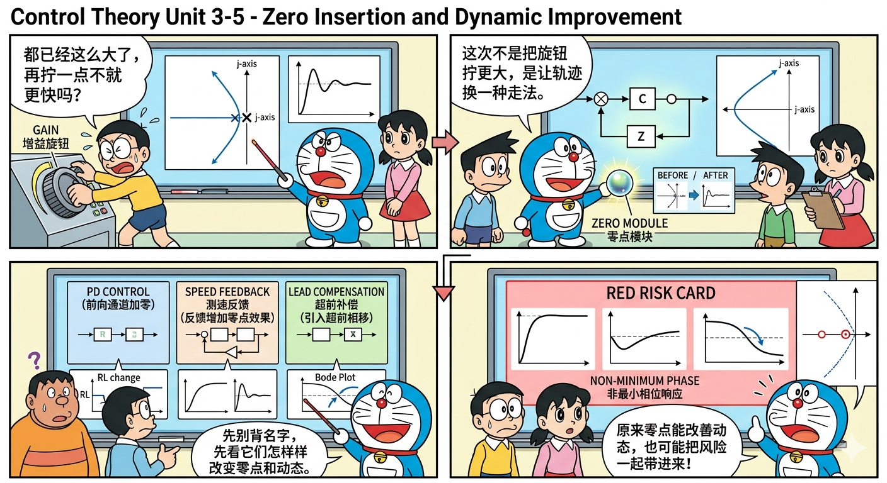
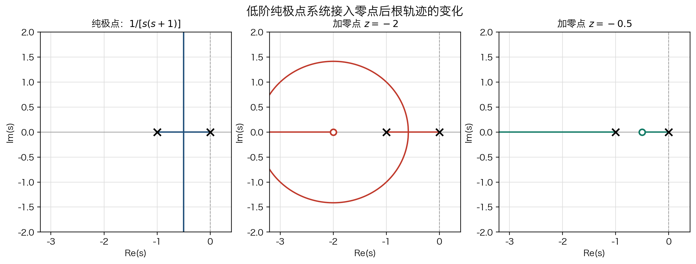
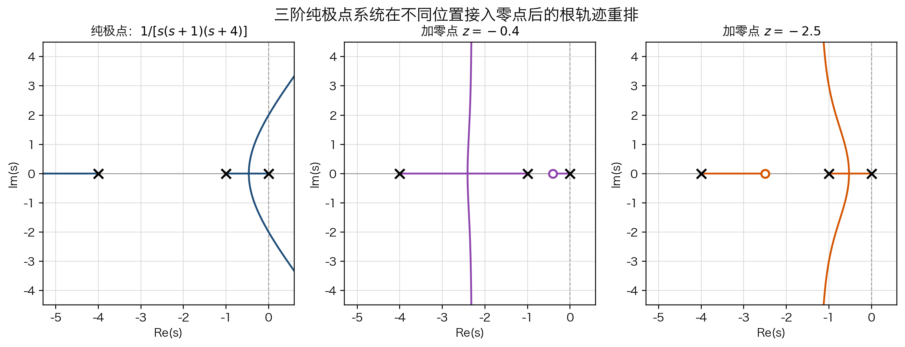
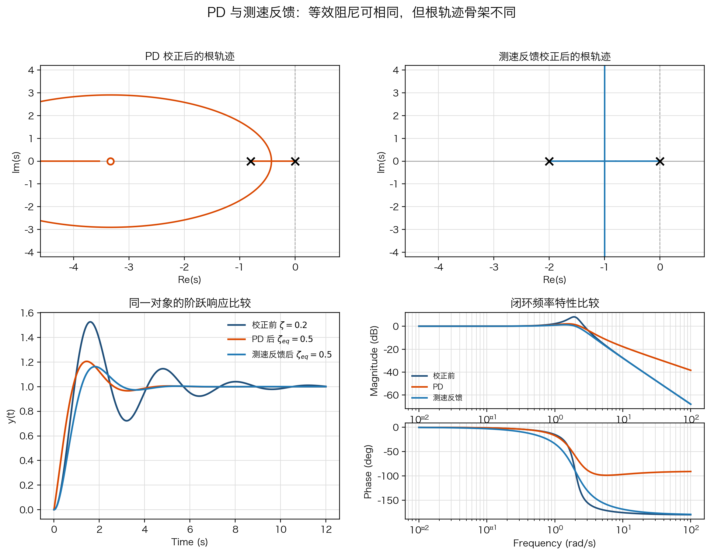
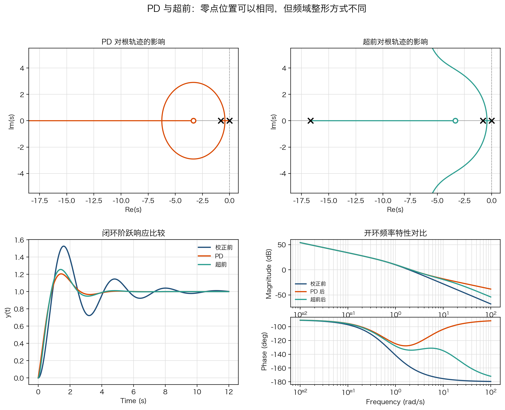
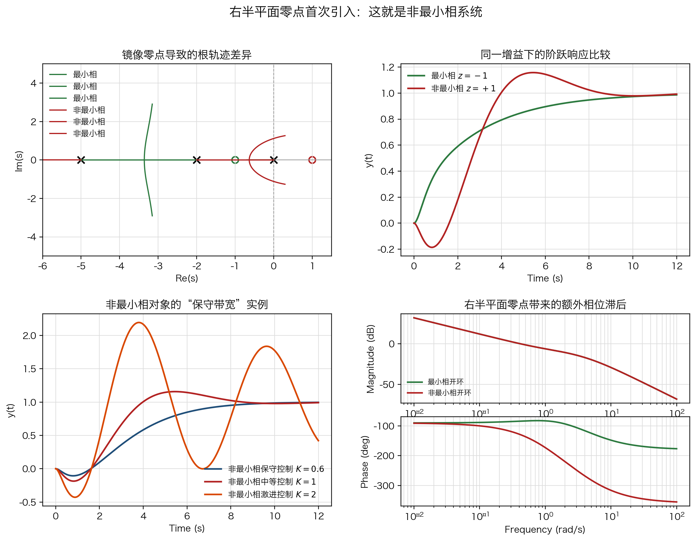
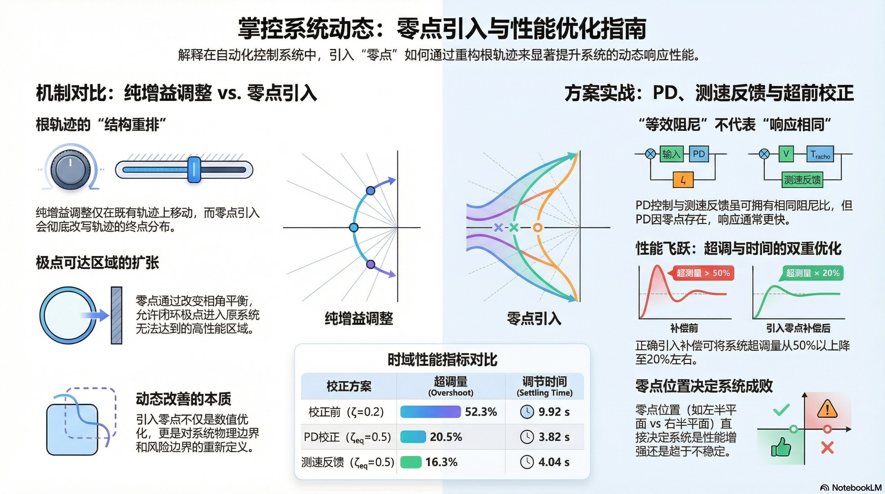

# 单元 3-5 | 零点引入与动态改善——为什么改变结构后，轨迹和响应会一起变

- **层次**：模块3 理论主线 · 第五课
- **学时**：90分钟
- **知识类型**：[X] + [C]
- **前置**：已经能够用纯极点语言描述稳定性与动态趋势，已经系统学习根轨迹的定义、完整法则与读图判断，知道“只沿既有轨迹调增益”能回答什么，也知道它回答不了什么
- **后续**：3-6（零点作用与动态改善实验）、3-7（型别、积分环节与稳态改善）、4-1（设计起点：性能指标体系、工程约束与可行域表达）
- **讲义定位**：本单元围绕同一对象的结构对照展开。我们先看零点如何改写根轨迹，再看这种改写怎样落到时域与频域，最后明确哪些改善伴随新的风险边界。

---

## 一、开场：为什么只调增益很快不够

### 1.1 从 `3-4` 的结论继续往前走

在 `3-4` 中，我们已经能沿着既有根轨迹做工程判断：哪些参数还在稳定窗口内，哪些参数更接近可接受窗口，哪些参数虽然没有失稳，却在用更小的裕量换更快的响应。

这条判断链很有力量，但它有一个明确边界：它只能帮助我们在既有轨迹上选点，不能改变轨迹本身。若原轨迹已经很难同时兼顾速度、振荡和裕量，继续调增益只会把原有矛盾推得更紧。

因此，我们的问题不再是“沿这条轨迹选哪个点”，而是“能不能让轨迹换一种走法”。零点正是最先进入这条主线的结构因素。

### 1.2 本课要解决的核心问题

第一次听到“加一个零点可以改善动态性能”时，最容易把它理解成两种过于简单的版本：

1. 零点只是另一种“把增益调大”的说法；
2. 只要增加零点，系统就会更快更稳。

这两种理解都不准确。零点的重要性在于，它改变的不是某一个孤立指标，而是下面三条相互联动的链：

- 它改变根轨迹的几何骨架；
- 它改变闭环主导极点可能出现的位置；
- 它进而改变时域响应与频域特性的整体趋势。

因此，全文不按“控制器种类大全”组织，而围绕一个更稳定的问题展开：

> 零点为什么会让系统出现纯增益调整所没有的新动态变化？

### 1.3 统一对象与四个版本

为了把问题看清楚，全文固定围绕同一个基准对象展开。我们暂不急着代入复杂整定任务，先把注意力放在结构变化本身。

后文会反复比较下面四个版本：

| 版本 | 结构特征 | 最先关注什么 |
| --- | --- | --- |
| 基准版本 | 只有原对象和纯增益 | 原始根轨迹怎样走，极点在什么边界上受限制 |
| 纯增益继续增大 | 轨迹形状不变，只是在原轨迹上继续选点 | 速度、振荡和裕量的权衡如何加剧 |
| 左半平面零点版本 | 新增一个位于左半平面的零点 | 轨迹为什么会被吸引，主导极点为什么可能更靠左 |
| 右半平面零点版本 | 新增一个位于右半平面的零点 | 为什么名字都叫零点，却可能带来逆响应和更严格的速度上限 |

前三个版本承担主要比较任务。右半平面零点版本主要负责建立边界意识，这里不展开完整设计。

### 1.4 三项学习产出

学完这一单元，我们至少应能完成三项判断。

| 学习产出 | 回答的问题 | 关键信息 |
| --- | --- | --- |
| `零点作用判断表` | 这个变化到底是不是在“引入零点”？ | 零点位置、是否显式增加零点、对轨迹的主要影响 |
| `结构对比解释` | 为什么它不是简单的增益放大？ | 轨迹走向变化、主导极点变化、时域/频域后果 |
| `风险边界卡` | 哪些零点改善值得要，哪些改善带着明显代价？ | 高频放大、相位变化、逆响应、适用边界 |

这三项产出连起来，就是全文主线：先认出是不是在引入零点，再解释零点怎样改变轨迹和动态，最后判断这种变化值不值得要。

## 二、先看根轨迹实例：零点一旦出现，轨迹骨架就变了

### 2.1 例 1：二阶对象最适合用来建立第一印象

先看一个最干净的二阶纯极点对象：

$$
L_0(s)=\frac{K}{s(s+1)}.
$$

这个对象只有两个开环极点 $0$ 和 $-1$，没有零点。根轨迹的两条分支从这两个极点出发，在实轴区间 $(-1,0)$ 上相向运动，然后离开实轴进入复平面。这正是我们在 `3-3/3-4` 中已经熟悉的纯极点基线。

现在不改对象，只改零点位置。先看两种典型的加零点情形：

$$
L_1(s)=\frac{K(s+2)}{s(s+1)}, \qquad
L_2(s)=\frac{K(s+0.5)}{s(s+1)}.
$$

它们的区别只在零点位置：

- $z=-2$ 在两个极点左侧；
- $z=-0.5$ 落在两个极点之间。

{width=100%}

这张对比图里最值得先看三件事：

1. 当零点放在 $-2$ 时，一条分支被拉向 $-2$，另一条分支仍然走向无穷远，根轨迹不再是原来那对对称分离的样子。
2. 当零点放在 $-0.5$ 时，零点直接落进原来最敏感的实轴区间，实轴上的可行区段重新分配，分支更早被“截走”。
3. 同样是增加一个左半平面零点，零点放得更靠右，轨迹重排得更剧烈；零点放得更靠左，轨迹仍被改变，但更像是在左侧把一条分支“接住”。

这里先记住第一条硬结论：

> 纯增益调整只是在既有轨迹上移动；零点引入会改写轨迹终点分配和实轴区段，因此闭环极点可达区域也会一起改变。

### 2.2 例 2：三阶纯极点对象，零点位置不同，主导分支被“拉走”的方式也不同

再看一个三阶对象：

$$
L_3(s)=\frac{K}{s(s+1)(s+4)}.
$$

在这个对象上，我们比较两种零点接入方式：

$$
L_{3a}(s)=\frac{K(s+0.4)}{s(s+1)(s+4)}, \qquad
L_{3b}(s)=\frac{K(s+2.5)}{s(s+1)(s+4)}.
$$

前者把零点放在靠近原点的位置，后者把零点放在中间极点与左侧极点之间。

{width=100%}

这组图比二阶对象更能说明“零点吸引”不是口号，而是主导分支的真实重排：

- 当零点靠近原点时，靠右侧的分支更早被吸引，主导极点候选区整体向右侧零点附近聚集。
- 当零点放在 $-2.5$ 时，被明显改变的是中左部那一段分支，右侧分支仍保留较强的纯极点痕迹。
- 同一阶次、同一个对象，只因为零点位置不同，我们在 `3-4` 中建立的“关键节点、主导分支、可接受窗口”判断语言就必须重写。

所以，讲“零点吸引根轨迹”最好不要停在抽象口号上，更准确的说法是：

> 零点通过改变相角平衡，重新分配了哪些分支会成为主导分支、哪些区域会成为闭环极点更容易到达的位置。

### 2.3 从这两组图立住第一组对照

把二阶和三阶两组图放在一起看，第一组对照就很清楚了。

| 问题 | 纯增益调整 | 零点引入 |
| --- | --- | --- |
| 开环零极点结构 | 不变 | 改变 |
| 根轨迹骨架 | 不变 | 改变 |
| 分支终点与实轴区段 | 不变 | 重新分配 |
| 主导极点可达区域 | 只能沿原轨迹选点 | 轨迹本身被重排 |

后面所有“动态改善”的讨论都建立在这一步之上。如果这一层没有看清，后面讲 `PD`、测速反馈和超前时，就很容易重新滑回“是不是只是另一种调增益”的误判。

### 2.4 如果把零点加到右半平面，会发生什么

到这里可以先记住一个问题。前面两组图讨论的都是左半平面零点。若零点放到右半平面，轨迹还会不会继续朝“更有利的动态区域”重排？输出会不会仍然沿目标方向起步？频域里的相位会不会继续像左半平面零点那样给我们帮忙？

先把这三个问题记下来。读完第五节的镜像零点实例后，再回头看这里，我们就更容易真正理解“非最小相”为什么不是换一个名字而已。

## 三、实例 1：`PD` 与测速反馈都能增大阻尼，但零点副作用不同

### 3.1 先固定同一个对象，再并列比较两种结构

为了避免“对象变化”和“控制结构变化”搅在一起，这里固定被控对象为

$$
G_p(s)=\frac{4}{s(s+0.8)}.
$$

它对应一个基准二阶闭环系统

$$
T_0(s)=\frac{4}{s^2+0.8s+4},
$$

此时 $\omega_n=2$，$\zeta=0.2$。也就是说，校正前的系统本来就偏振荡、偏慢，是一个很典型的“需要改善动态过程”的对象。

现在并列比较两种校正方式：

1. `PD` 校正：$G_{PD}(s)=1+K_d s$；
2. 测速反馈：保留外环单位负反馈，同时把输出经测速发电机环节 $K_t s$ 回送到对象输入端，构成一节输出微分反馈。

两种结构的方框图先放在一起看。上图把误差信号 $E(s)$ 分成“直接通道”和 $K_d s$ 通道，再在对象前相加；下图则保留单位负反馈外环，并把输出速度项 $K_t s\,C(s)$ 反馈到对象前的局部加法点：

{width=88%}

这里最重要的辨认是：测速反馈不是“只剩一个 $K_t s$ 的局部反馈环”，而是“外环单位负反馈 + 内部速度项负反馈”同时存在的双层结构。也正因为这一点，测速反馈是通过输出微分信号改变闭环分母的一次项，而不是把零点直接放进前向通道。

这两种控制都通过一个比例系数来决定“微分作用有多强”：

- `PD` 里由 $K_d$ 决定；
- 测速反馈里由 $K_t$ 决定。

对这个对象，它们都把闭环特征方程改写成同一类形式：

$$
s^2+\left(2\zeta\omega_n+K_d\omega_n^2\right)s+\omega_n^2=0,
\qquad
s^2+\left(2\zeta\omega_n+K_t\omega_n^2\right)s+\omega_n^2=0.
$$

因此二者的闭环阻尼比表达式分别是

$$
\zeta_{PD}=\zeta+\frac{1}{2}K_d\omega_n,
\qquad
\zeta_v=\zeta+\frac{1}{2}K_t\omega_n.
$$

若目标阻尼比记为 $\zeta^\star$，则两种结构达到该目标所需的系数都满足

$$
K_d=K_t=\frac{2(\zeta^\star-\zeta)}{\omega_n}.
$$

对本例，$\omega_n=2$、$\zeta=0.2$，若希望把阻尼比提高到 $\zeta^\star=0.5$，就得到

$$
K_d=K_t=0.3.
$$

这时二者都会把分母的一次项从 $0.8$ 提高到 $2.0$，但它们的闭环传递函数并不相同：

$$
T_{PD}(s)=\frac{4(1+0.3s)}{s^2+2s+4},
\qquad
T_v(s)=\frac{4}{s^2+2s+4}.
$$

于是差别立刻出现了：`PD` 在参考输入到输出的通道里显式增加了零点 $z=-3.33$，测速反馈没有。

### 3.2 不先看名字，先看“等效阻尼相同”的后果

{width=100%}

这张图里，上半部分固定 $K_d=K_t=0.3$，比较的是校正结构确定之后，外环增益 $K$ 变化时的真实根轨迹；下半部分再把这种“相同的阻尼调节能力”翻译成不同的时域和频域后果。

在相同对象、相同等效阻尼比 $\zeta_{\mathrm{eq}}=0.5$ 下，三条阶跃曲线给出了很具体的对比：

| 结构 | 超调量 | 2% 调节时间 | 解读 |
| --- | --- | --- | --- |
| 校正前 | 约 `52.3%` | 约 `9.92 s` | 典型欠阻尼且拖尾明显 |
| `PD` 后 | 约 `20.5%` | 约 `3.82 s` | 阻尼显著改善，但输入通道零点让前段抬升更积极 |
| 测速反馈后 | 约 `16.3%` | 约 `4.04 s` | 阻尼改善接近 `PD`，但因为没有显式前向零点，超调更克制 |

这组数值说明了一个经常被忽略的事实：

> “等效阻尼相同”并不意味着“闭环响应完全相同”。

测速反馈和 `PD` 都能把极点推向更合适的阻尼区域，但 `PD` 还在输入通道里额外放入了一个零点，因此它的前段响应更积极，超调也比测速反馈略大。

频域也不能只看轮廓，要落到指标上。对这组三条闭环频率特性，主要差异可以压成下面这张表：

| 结构 | 共振峰值 | 带宽 | 解读 |
| --- | --- | --- | --- |
| 校正前 | 约 `8.14 dB` | 约 `3.04 rad/s` | 峰值高，欠阻尼特征明显 |
| `PD` 后 | 约 `2.04 dB` | 约 `2.97 rad/s` | 峰值显著压低，带宽基本保持 |
| 测速反馈后 | 约 `1.25 dB` | 约 `2.56 rad/s` | 峰值压得更低，但速度感更保守 |

所以，从频率特性看，测速反馈并不是“没有微分作用”，而是同样能通过提高阻尼压低共振峰，只是它不像 `PD` 那样把输入通道一起推得更积极。

### 3.3 在根轨迹上看见的，是“同样增加阻尼”但轨迹骨架不同

图中的两个上方面板负责解释这一点。

- 左图对应 `PD` 校正后的开环传函 $L_{PD}(s)=K\dfrac{4(1+0.3s)}{s(s+0.8)}$，因此开环有两个实极点 $0,-0.8$，还有一个零点 $-3.33$；
- 右图对应测速反馈等效后的外环开环传函 $L_v(s)=K\dfrac{4}{s(s+2.0)}$，因此开环仍然只有两个实极点 $0,-2.0$，没有零点。

这样一来，两种结构的共同点和差异就可以同时看清：

- 共同点：二者都能通过前面选定的 $K_d=K_t=0.3$ 提高阻尼，使同一对象的阶跃振荡明显减弱；
- 差异：`PD` 的一条分支会被左半平面零点拉向 $-3.33$，测速反馈则没有这个终点，两个分支从实轴断开后向无穷远伸展。

因此，不能把测速反馈说成“另一种 `PD`”：

- 从阻尼结果看，二者可能很像；
- 从零点进了哪里、根轨迹怎样改写看，二者并不一样。

### 3.4 这一组实例的结论

这一组比较最适合压成三句话：

1. `PD` 和测速反馈都能通过 $K_d$、$K_t$ 把二阶对象的阻尼比从 $\zeta=0.2$ 提高到目标值 $\zeta^\star=0.5$，所需系数都满足 $K_d=K_t=0.3$。
2. `PD` 显式引入前向零点，因此超调和前段抬升会比测速反馈更积极。
3. 测速反馈更适合被理解成“在不显式增加前向零点的前提下，提高等效阻尼”的结构。

## 四、实例 2：先看 `PD` 与超前校正装置的频域原理，再回头比较结构差异

### 4.1 `PD` 为什么会让系统更快：它先抬的是中高频幅值

沿用上一节的对象 $G_p(s)=4/[s(s+0.8)]$，先只看控制器自身的频率特性。对理想 `PD` 控制器

$$
G_{PD}(s)=1+T_d s
$$

有

$$
G_{PD}(j\omega)=1+j\omega T_d
$$

因此其幅频和相频分别为

$$
\left|G_{PD}(j\omega)\right|=\sqrt{1+(\omega T_d)^2},
\qquad
\phi_{PD}(\omega)=\arctan(\omega T_d)
$$

这两式揭示的核心不是“它有一个零点”，而是：

- 在低频段，$|G_{PD}(j\omega)| \approx 1$，它几乎不动直流和低频增益；
- 当频率越过拐点 $\omega_d = 1/T_d$ 后，幅值按 `+20 dB/dec` 的斜率持续抬升；
- 相位从 $0^\circ$ 逐步增加，理想情况下可接近 $90^\circ$。

因此，`PD` 的第一频域作用不是抽象的“有零点所以会补角”，而是主动抬升中高频开环幅值。开环幅值被抬高后，`0 dB` 交叉点通常向右移动，截止频率增大，闭环响应速度随之提高。我们先记住这条链：

> `PD` 先把中高频幅值往上托，交叉频率才有机会右移；交叉频率右移后，系统才表现为“更快”。

这也是 `PD` 和单纯比例放大的关键差别。比例增益是把整条幅频曲线整体平移，`PD` 则是在中高频段继续把斜率往上抬，因此它带来的“更快”带有明显的频段选择性。

但这个好处带着直接代价：理想 `PD` 的高频增益会一直上升，高频噪声、测量抖动和未建模高频动态也会被一并放大。工程上常使用带小惯性环节的近似微分，而不直接保留理想 `PD` 的无限高频放大特性。

### 4.2 超前为什么更像“在关键位置补角”：它的相位提升只集中在一段频带

再看一级超前网络。写成标准形式可得

$$
G_{\text{lead}}(s)=\frac{Ts+1}{\alpha Ts+1},
\qquad 0<\alpha<1
$$

本节对照用到的具体网络

$$
G_{\text{lead}}(s)=\frac{0.3s+1}{0.06s+1}
$$

对应 $T=0.3$、$\alpha=0.2$。其频率特性为

$$
\left|G_{\text{lead}}(j\omega)\right|
=
\sqrt{\frac{1+(\omega T)^2}{1+(\alpha \omega T)^2}},
\qquad
\phi_{\text{lead}}(\omega)=\arctan(\omega T)-\arctan(\alpha \omega T)
$$

与 `PD` 相比，超前网络的真正关键词是“有限频带整形”：

- 当 $\omega < \omega_z = 1/T$ 时，幅值几乎不变；
- 在 $\omega_z$ 到 $\omega_p = 1/(\alpha T)$ 之间，幅值按 `+20 dB/dec` 上升；
- 超过极点频率后，幅值不再继续无限抬升，而是趋于有限增益 $20\log_{10}(1/\alpha)$；
- 相位提升也不是一路增加，而是在

$$
\omega_m=\frac{1}{T\sqrt{\alpha}}
$$

附近达到最大值

$$
\phi_m=\sin^{-1}\!\left(\frac{1-\alpha}{1+\alpha}\right)
$$

然后再逐渐回落。

因此，超前校正的频域原理可以概括成一句话：

> 超前不是简单把高频全抬起来，而是在希望穿越 `0 dB` 的那一段附近主动制造一块“相位抬升峰”，让截止频率附近的相角裕度增大。

这也是超前与 `PD` 的核心差异。二者都可能有同样的零点位置，但 `PD` 的幅值抬升会持续到更高频；超前则因为额外极点的存在，把幅值与相位作用限制在一段更可控的频带里。

### 4.3 频域下的一般设计原则：`PD` 看“抬交叉”，超前看“补相角”

{width=100%}

图中右下角已经给出校正前、`PD` 后和超前后的开环幅频与相频对照。读这组图时，应先看右下角频域图，再回头看上方根轨迹图和左下角阶跃响应，因为对 `PD` 与超前而言，根轨迹差异是结果，频域整形才是起因。

从图中可直接读出一组代表性数值：

| 结构 | 交叉频率 | 相角裕度 | 频域解释 |
| --- | --- | --- | --- |
| 校正前 | 约 `1.92 rad/s` | 约 `22.6°` | 中频段补角不足，速度和裕度都偏紧 |
| `PD` 后 | 约 `2.10 rad/s` | 约 `53.1°` | 中高频抬升明显，交叉点右移，速度提高且裕度改善 |
| 超前后 | 约 `2.09 rad/s` | 约 `45.9°` | 在交叉频率附近主动补角，裕度提高且高频放大更受控 |

基于这类图，可以整理出两套一般性设计原则。

#### `PD` 的频域设计原则

1. 先确定系统主要矛盾是否是“响应慢、带宽不足、阻尼不够”，而不是低频精度不足；
2. 再看高频噪声约束是否宽松，若测量噪声很强，理想 `PD` 就不是优先候选；
3. 选择微分零点，让它在目标截止频率左侧开始起作用，使中高频幅值抬升、交叉频率右移；
4. 最后必须回头验算相角裕度、带宽和高频噪声放大。

#### 超前校正的一般设计步骤

1. 先读原系统的截止频率与相角裕度，判断主要矛盾是否是“相角裕度不足”；
2. 根据目标相角裕度估算所需附加超前角，并预留 `5^\circ \sim 12^\circ` 的设计余量；
3. 由所需最大超前角确定 $\alpha$；
4. 让最大超前角出现频率 $\omega_m$ 落在期望的新截止频率附近，再反算 $T$；
5. 校正后重新验算新的截止频率、相角裕度和高频放大是否满足要求。

这里给的是一般原则和步骤，不展开模块4那种完整频域整定计算。当前任务是先看清“为什么要这样设计”，而不是把全部数值流程一次做完。

### 4.4 频域设计下的适用规律：什么时候优先想 `PD`，什么时候优先想超前

把这一节压缩成工程判断语言，可以得到下面这张表。

| 结构 | 更适合的场景 | 不适合的场景 | 一句话概括 |
| --- | --- | --- | --- |
| `PD` | 主要目标是提高响应速度、增大阻尼、提高截止频率；高频噪声约束不太强；对象本身较低阶或主导低阶特征明显 | 测量噪声强、执行机构高频能力有限、不能接受明显高频放大 | “先抬中高频，再把交叉点往右推” |
| 超前校正 | 主要矛盾是相角裕度不足；希望在截止频率附近主动补角；需要比 `PD` 更可控的高频代价；幅值裕度和整体带宽仍有可调整空间 | 高频放大约束极严、低频精度本身才是主要矛盾、需要同时解决稳态与动态多重冲突 | “在关键频段补相角，不让高频一路抬上去” |

若再把时域结果一起对照，同一个对象、同一个单位反馈条件下，三条阶跃曲线给出的是：

| 结构 | 超调量 | 2% 调节时间 |
| --- | --- | --- |
| 校正前 | 约 `52.3%` | 约 `9.92 s` |
| `PD` 后 | 约 `20.5%` | 约 `3.82 s` |
| 超前后 | 约 `25.7%` | 约 `3.84 s` |

这组结果能帮助我们把频域语言和时域后果接起来：

- `PD` 更容易把系统推向更高的交叉频率，因此“更快”的特征更直观；
- 超前校正不是为了在所有指标上压过 `PD`，而是为了把“补角”集中在关键频带，并把高频代价控制在有限范围内；
- 若系统既有低频精度问题，又有相角裕度问题，那么单独 `PD` 或单独超前通常都不是最终答案，后续往往要进入更完整的校正链。

因此，这一节的核心句可以压缩为：

> `PD` 的频域本质是抬升中高频幅值、推动截止频率右移；超前校正的频域本质是在截止频率附近主动补相角、提高相角裕度，并把高频放大控制在有限频带内。

## 五、右半平面零点第一次正式进入主线：这就是非最小相

### 5.1 先把最小相与非最小相写成一对镜像对象

为了把“右半平面零点到底危险在哪里”讲清楚，这里直接比较一对镜像零点对象：

$$
L_{\text{mp}}(s)=K\frac{4(s+1)}{s(s+2)(s+5)},
\qquad
L_{\text{nmp}}(s)=K\frac{4(1-s)}{s(s+2)(s+5)}.
$$

它们有同样的极点，零点到虚轴的距离也相同，唯一差别在于：

- 左半平面零点 $z=-1$：最小相；
- 右半平面零点 $z=+1$：非最小相。

所以，如果后面出现的差异很大，就不能再把它说成“零点只是位置不同而已”。

“非最小相”这个名字也应在这里一次说清。对稳定对象来说，如果幅频特性已经固定，那么所有零点都在左半平面时，系统带来的相位滞后最小，这类对象就叫**最小相**。把零点镜像到右半平面后，幅频特性并不会消失，但相位会额外再滞后一截，于是它就不再是“相位最小”的那一类系统，这就是**非最小相**这一名称的来源。

### 5.2 非最小相最先暴露出来的，不是慢，而是“先往反方向动”

{width=100%}

先看右上角“同一增益下的阶跃响应比较”。当取同样的中等增益 $K=1.0$ 时：

- 最小相对象的响应单调上升，没有先反向动作；
- 非最小相对象先向负方向下冲，最低约到 `-0.186`，随后才折返并上升到稳态值附近。

这个“先往反方向动一下”的现象，就是最该记住的**逆响应**。它不是数值偶然，而是右半平面零点改写输出初始趋势后的直接后果。

因此，第一次引入右半平面零点时，应把定义和现象一起记住：

> 稳定系统只要含有右半平面零点，就属于非最小相系统；其最典型的时域信号，就是可能出现逆响应。

### 5.3 频域里为什么更难控制

再看右下角的开环频域图。与最小相对象相比，非最小相对象在相同增益下会出现额外相位滞后。这意味着如果还想把交叉频率继续往右推，系统会更早遇到相角裕度不足的问题。

这正是非最小相对象“更难控制”的根源之一：

- 你想做快，往往需要更高带宽；
- 右半平面零点偏偏让相位更差；
- 结果就是速度目标和稳定裕量目标更早冲突。

### 5.4 “如何控制”不能只说原则，先看一个保守带宽实例

图中的左下角给了一组很直接的非最小相控制实例，比较的是同一个非最小相对象在三种增益下的闭环响应：

| 增益 | 最深逆响应 | 最大峰值 | 解读 |
| --- | --- | --- | --- |
| `K=0.6` | 约 `-0.106` | 无明显正向峰值 | 保守，逆响应较轻 |
| `K=1.0` | 约 `-0.186` | 峰值约 `1.158` | 中等控制，能跟踪但代价已显现 |
| `K=2.0` | 约 `-0.428` | 峰值约 `2.195` | 过激，逆响应和峰值同时恶化 |

这张表不需要现在就掌握完整非最小相设计理论，但至少要记住一个基本动作：

> 对非最小相对象，第一反应通常不是“继续把带宽往上推”，而是先保守交叉频率，让闭环速度明显低于右半平面零点对应的危险频段。

这也是全文对“非最小相如何控制”的最基本回答。它不展开完整设计流程，但已经把“保守带宽、先保相位、接受速度上限”这组工程动作写清楚了。

## 六、课末收束：动态改善线到此为止

### 6.1 本课到底建立了什么

走到这里，我们建立的不是“控制器种类表”，而是一条稳定的判断语言：

- 当纯增益调整已经很难兼顾速度、振荡和裕量时，应想到是不是需要改变结构；
- 当结构变化里出现零点时，要先判断它在哪里，再判断它怎样改变根轨迹；
- 当根轨迹改变后，要继续追问主导极点、时域响应和频域姿态怎样一起改变；
- 当某种改善看起来很诱人时，还要检查高频代价、相位代价和边界风险有没有同时抬头。

这条判断语言，就是本单元的核心产出。

### 6.2 和前后课程怎么接

若把本单元放回模块3主线里看，它正好处在一个转折点上：

- `3-3` 回答“轨迹为什么这样形成”；
- `3-4` 回答“怎样沿既有轨迹做读图判断”；
- `3-5` 回答“怎样通过零点让轨迹本身出现新的动态可能”。

下一课 `3-6` 会把今天的结论真正拿去做统一对象实验。我们不再只看文字判断，而要比较基准、`PD`、测速反馈和简单超前四个版本在三域里的差异。再下一课 `3-7` 会把主线切换到稳态改善，那时我们会看到：动态改善和稳态改善不是同一条线，零点和积分环节也不是同一类工具。

### 6.3 小结

1. 只调增益时，闭环极点只能沿既有根轨迹移动；当这条轨迹本身不够理想时，继续增大增益只会加剧原有权衡。
2. 左半平面零点之所以常常带来动态改善，是因为它改变了相角平衡和根轨迹骨架，让主导极点有机会进入更有利的区域。
3. `PD` 的频域本质是抬升中高频幅值并推动截止频率右移；测速反馈则主要体现为提高等效阻尼，而不显式增加前向零点。
4. 简单超前的频域本质是在目标交叉频带主动补相角、提高相角裕度，并把高频放大限制在有限频带内。
5. 右半平面零点常带来逆响应风险与额外相位滞后，因此速度目标会更早撞上边界。
6. 本单元只建立“零点动态改善线”的机理语言，不展开完整超前校正设计，也不提前进入模块4的整定流程。

## 七、课后思考

### 7.1 用一句话解释这组核心对照

请分别用一句话解释：

1. 为什么“纯增益调整”和“引入零点”不是同一类改善；
2. 为什么 `PD` 和测速反馈不能因为效果相似就被看成同一个结构；
3. 为什么右半平面零点会把“零点改善动态”这句话变成带条件的判断。

### 7.2 用 AI 做一次误判校准

把本单元的三组核心对照发给 AI，并请它回答：

> 在“纯增益调整 vs 零点引入”“PD vs 测速反馈”“左半平面零点 vs 右半平面零点”这三组比较里，哪一句最容易说错？请只给一句误判，再给一句纠正。

看完 AI 的回答后，不要直接照抄。先自己写出那句误判为什么错，再用本单元里的根轨迹、时域和频域语言把它纠正过来。

## 附录 A：统一比较时应盯住哪四个量

正文已经说明了比较逻辑，这里把最适合带进 `3-6` 实验的四个观察量统一列出来。

### A.1 根轨迹观察量

- 分支是否明显朝零点附近重排；
- 主导极点候选区是否整体更有利；
- 是否仍然需要逼近稳定边界才能换来速度。

### A.2 时域观察量

- 调节过程是否更短；
- 超调是否更容易控制；
- 响应是否出现前冲、逆向初始动作或更明显的高频敏感性。

### A.3 频域观察量

- 相位是更提前还是更滞后；
- 截止频率与带宽是更容易提高，还是更早暴露上限；
- 高频幅值抬升是否开始变成代价。

### A.4 结构判断量

- 前向通道里是否显式增加零点；
- 是否同时引入新的极点；
- 这种结构变化主要是在改善动态、改善稳态，还是只是在转移代价。
