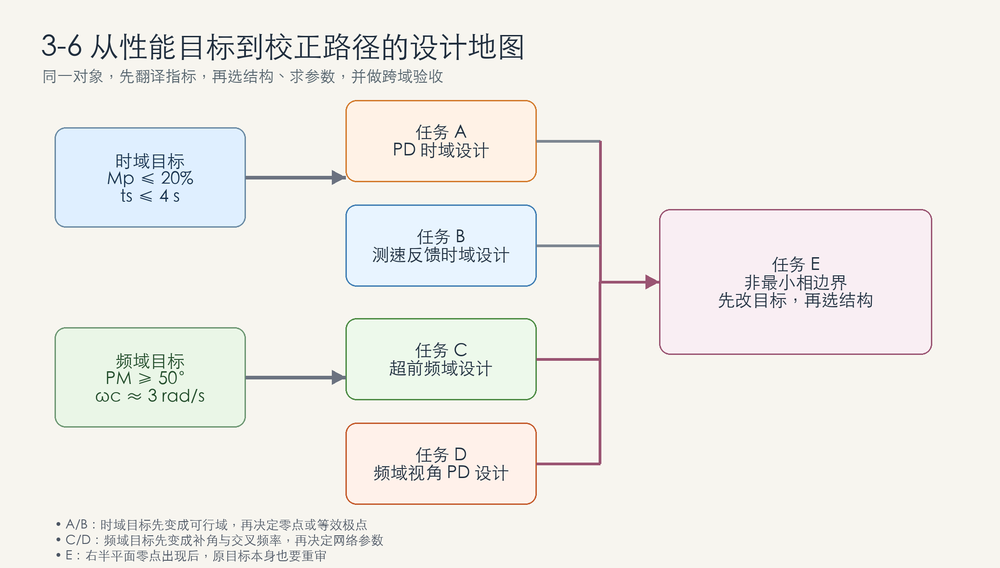
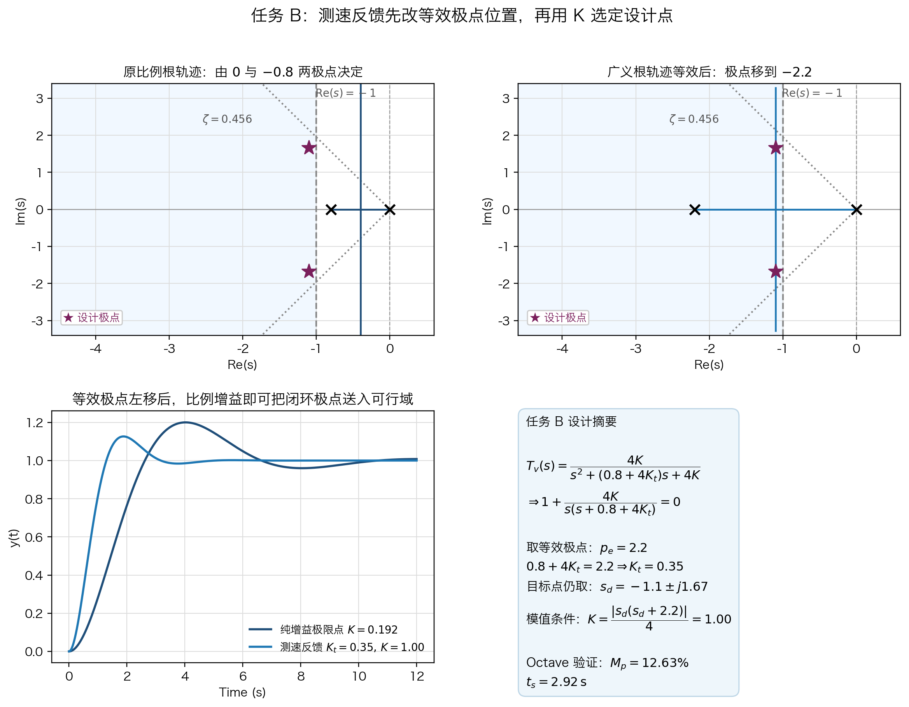
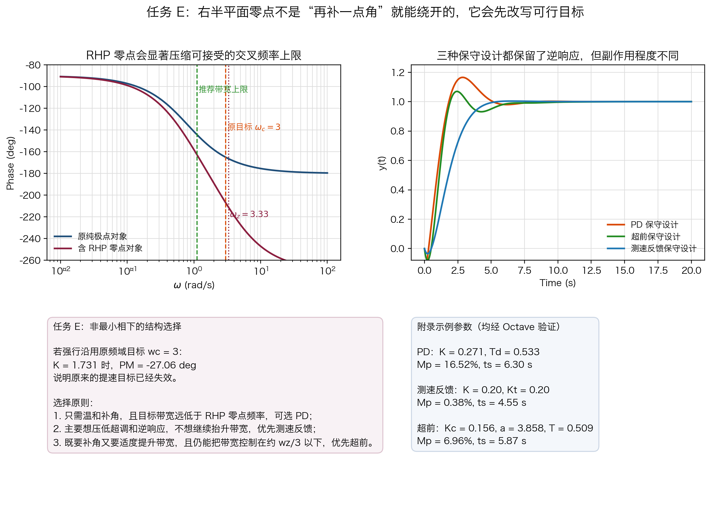
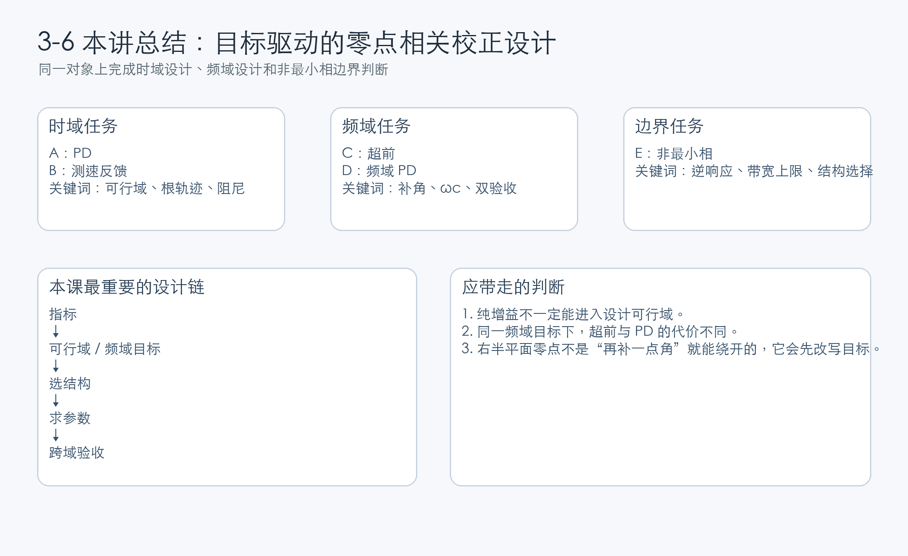

# 单元 3-6 | 零点作用与动态改善实验——从性能目标到校正设计

- **层次**：模块3 实践主线 · 第六课
- **学时**：90分钟
- **知识类型**：[X] + [C]
- **前置**：已经理解零点会改变极点迁移路径，已经学习 `PD`、测速反馈、简单超前和右半平面零点的机理与风险
- **后续**：3-7（型别、积分环节与稳态改善）、3-8（频域判别与跨域综合语言）
- **讲义定位**：这份讲义将把上一课得到的“零点作用机理”推进到“性能指标驱动的校正设计”。你会围绕同一个示例系统，依次完成时域目标驱动的 `PD` 设计、时域目标驱动的测速反馈设计、频域目标驱动的超前设计、同一频域指标下的 `PD` 设计，并在最后检查右半平面零点带来的可行性边界与结构选择。

---

## 一、从机理课进入设计课

### 1.1 上一课解决了什么，这一课还缺什么

在 `3-5` 中，我们已经搞清楚了一条完整的机理链：

- 零点的位置会改变根轨迹骨架；
- 根轨迹骨架一旦改变，闭环主导极点的候选区域就会跟着变化；
- 主导极点区域改变之后，时域响应和频域特性会一起变化。

但只停在“知道会怎样变化”，还不够支撑设计。  
实际工程里，控制器并不是为了“让图更好看”而加入的，而是为了满足明确的指标约束。  
如果题目给出的是“超调不超过多少、调节时间不超过多少、相角裕度至少多少”，那么我们就不能只做并列观察，还必须回答两个更硬的问题：

1. 应该把指标先翻译成什么样的设计目标区域？
2. 面对不同的校正装置，应该怎样用根轨迹或频率特性把参数真正调出来？

这就是本节课的任务。

### 1.2 本节的主线

本节不按“控制器名称列表”组织，而按“目标驱动设计链”组织。  
全文只有一条主线：

> 先把性能指标翻译成设计目标，再根据目标选择和调整零点相关装置，最后用时域、频域和闭环极点去验收设计是否成立。

为了把这条主线做实，本节固定围绕一个示例系统展开，并分成五个连续任务：

1. **任务 A：时域目标驱动的 `PD` 设计**
2. **任务 B：时域目标驱动的测速反馈设计**
3. **任务 C：频域目标驱动的超前校正设计**
4. **任务 D：同一频域指标下的 `PD` 设计**
5. **任务 E：右半平面零点下的可行性边界与结构选择**

### 1.3 [AI融入点] 先做一次“目标翻译”预测

在继续往下读之前，先不用任何图，先独立回答：

1. 如果题目要求超调量减小，你更先想到调阻尼，还是更先想到调带宽？
2. 如果题目要求相角裕度提高到 `45^\circ` 以上，你更先想到根轨迹还是 `Bode` 图？
3. 如果一个系统已经出现右半平面零点，你还会不会继续用“把速度做得更快”作为默认第一目标？

写完后再问 AI。  
AI 适合帮你暴露自己对“时域目标”和“频域目标”的混淆，但最终判断仍然要回到本节后面的设计步骤与验证结果。

## 二、示例系统与设计任务书

### 2.1 示例系统

本节固定使用同一个示例系统：

$$
G_p(s)=\frac{4}{s(s+0.8)}
$$

我们默认外环采用单位负反馈，控制器放在前向通道或局部反馈通道中。  
之所以选择这个对象，是因为它具备三个优点：

1. 基准系统的动态性能并不理想，适合做校正前后对照；
2. `PD`、测速反馈、简单超前和频域视角下的 `PD` 都能在这个对象上给出清楚的设计动作；
3. 当再引入右半平面零点时，设计目标会立刻受到约束，适合做边界讨论。

### 2.2 本节会用到的三类校正表达式

为了避免口径混乱，三类装置的表达式先固定如下。

**1. `PD` 校正**

$$
G_{PD}(s)=K(1+T_d s)
$$

它在前向通道显式引入左半平面零点

$$
z=-\frac{1}{T_d}.
$$

**2. 测速反馈**

测速反馈本节统一写成控制量的拉普拉斯域表达式：

$$
U(s)=K E(s)-K_t s Y(s)
$$

其中

$$
E(s)=R(s)-Y(s).
$$

当只讨论上一课的特定比较参数时，若取 $K=1$、$K_t=0.3$，就得到

$$
U(s)=E(s)-0.3sY(s).
$$

这也是测速反馈在本节中必须使用的标准表达形式。  
它的关键点不是“也显式增加了零点”，而是**通过速度反馈项改变闭环分母的一次项系数**。

**3. 简单超前校正**

$$
G_{lead}(s)=K_c\frac{aTs+1}{Ts+1},
\qquad a>1
$$

它在前向通道中引入一个零点和一个更靠左的极点，因此适合用于频域目标驱动的设计。

### 2.3 五个设计任务

本节实践不再停留在“看哪个图更顺眼”，而是直接用目标驱动。  
对同一个对象，依次给出五个连续任务：

| 任务 | 目标类型 | 目标内容 | 推荐工具 |
| --- | --- | --- | --- |
| A | 时域目标 | 使闭环系统满足 `M_p \le 20\%`、`t_s(2\%) \le 4 s` | 根轨迹 + 阶跃响应 |
| B | 时域目标 | 在不显式增加前向零点的前提下，尽量满足与任务 A 同级的时域指标 | 广义根轨迹 + 阶跃响应 |
| C | 频域目标 | 使补偿后系统满足 `PM \ge 50^\circ`，并把截止频率推进到 `\omega_c \approx 3 rad/s` | `Bode` 图 + 阶跃回查 |
| D | 频域目标 | 在与任务 C 相同的频域指标下，用 `PD` 直接完成补角和增益配置 | `Bode` 图 + 阶跃回查 |
| E | 边界检查 | 引入右半平面零点后，重新判断目标是否可行，并决定该选 `PD`、测速反馈还是超前 | 频域约束 + 时域逆响应 |

{width=100%}

### 2.4 先把时域指标翻译成目标区域

任务 A 和任务 B 都从同一组时域指标出发：

$$
M_p \le 20\%, \qquad t_s \le 4 \text{ s}
$$

对于近似二阶主导的闭环系统，常用翻译关系是

$$
M_p=e^{-\frac{\zeta\pi}{\sqrt{1-\zeta^2}}}\times100\%,
\qquad
t_s \approx \frac{4}{\zeta\omega_n}.
$$

把本节指标代入上式，可先得到一组可操作的下界：

- 由 $M_p \le 20\%$ 可得阻尼比至少应满足 $\zeta \ge 0.456$；
- 由 $t_s \le 4\text{ s}$ 可得 $\zeta\omega_n \ge 1$，也就是主导极点实部至少应落在 $\operatorname{Re}(s)\le -1$ 的左侧。

因此，本节在根轨迹图上使用的目标区域，不再是模糊的“左上角更好”，而是下面这个近似扇区：

- 竖直边界：$\operatorname{Re}(s)=-1$；
- 阻尼边界：$\zeta=0.456$ 对应的等阻尼比线；
- 可接受区域：同时满足这两个约束的左半平面区域。

现在先检查一个关键问题：如果只允许改比例增益 $K$，根轨迹能不能进入这个区域？

对原系统采用纯比例控制时，

$$
L_0(s)=\frac{4K}{s(s+0.8)},
$$

对应闭环特征方程为

$$
s^2+0.8s+4K=0.
$$

当闭环极点成为共轭复根时，可直接写成

$$
s=-0.4\pm j\sqrt{4K-0.16}.
$$

这说明纯增益根轨迹有一个很硬的几何限制：

> 无论 $K$ 怎样变化，复根的实部始终固定在 $\operatorname{Re}(s)=-0.4$ 上。

而本节设计可行域要求 $\operatorname{Re}(s)\le -1$，因此纯增益方法根本不可能进入设计可行域。  
进一步地，若勉强把比例增益调到“刚好满足超调量边界”的位置，`Octave` 验证得到大约

$$
K \approx 0.192,
\qquad
M_p \approx 20.0\%,
\qquad
t_s \approx 9.50\text{ s},
$$

仍然远慢于本节目标。

这一步很重要，因为它把“为什么必须引入校正装置”从口头判断变成了严格的根轨迹结论。

## 三、任务 A：时域目标驱动的 `PD` 设计

### 3.1 先选设计点，而不是先猜零点

`PD` 的优势在于：它把左半平面零点直接放进前向通道，因此可以显式改变根轨迹的终点分配和弯折趋势。  
但真正开始设计时，第一步仍然不是“先给一个 $T_d$”，而是先选一个合适的设计点。

由于 `PD` 会把一个零点带进闭环传递函数分子，实际阶跃超调往往会比“只看闭环极点”稍大一点。  
因此，本节不把设计点选在可行域边界 $\zeta=0.456$ 上，而是主动留出阻尼裕量，取设计阻尼比 $\zeta_d$ 与设计衰减系数 $\sigma_d$ 为

$$
\zeta_d=0.55,\qquad \sigma_d=1.10.
$$

其中：

- $\zeta_d$ 表示设计时选取的目标阻尼比；
- $\sigma_d$ 表示目标主导极点实部的绝对值，即 $s_d$ 到虚轴的水平距离；
- $\omega_{n,d}$ 表示设计自然频率；
- $\omega_{d,d}$ 表示设计阻尼振荡频率。

由此得到

$$
\omega_{n,d}=\frac{\sigma_d}{\zeta_d}=2,
\qquad
\omega_{d,d}=\omega_{n,d}\sqrt{1-\zeta_d^2}\approx 1.670.
$$

所以目标主导极点取为

$$
s_d=-1.1\pm j1.670.
$$

这个点位于可行域内部，而不是压在边界线上。  
这样做的目的很明确：给 `PD` 分子零点带来的附加超调预留空间。

### 3.2 用相角条件反推零点位置

设 `PD` 控制器写成

$$
G_{PD}(s)=K T_d\left(s+\frac{1}{T_d}\right),
\qquad z_c=\frac{1}{T_d}.
$$

这样一来就能直观看到：`PD` 在前向通道中加入的零点位于

$$
s=-z_c=-\frac{1}{T_d}.
$$

对应补偿后开环传递函数为

$$
L_{PD}(s)=\frac{4KT_d\left(s+\frac{1}{T_d}\right)}{s(s+0.8)}.
$$

因此在目标点 $s_d$ 处，相角条件的完整表达式是

$$
\angle\left(s_d+\frac{1}{T_d}\right)-\angle s_d-\angle(s_d+0.8)=(2k+1)180^\circ.
$$

为了书写紧凑，记

$$
\theta_1=\angle s_d,\qquad
\theta_2=\angle(s_d+0.8),\qquad
\theta_z=\angle\left(s_d+\frac{1}{T_d}\right).
$$

在本例中，原对象两个极点贡献的角度分别为

$$
\theta_1=\angle s_d\approx 123.37^\circ,
\qquad
\theta_2=\angle(s_d+0.8)\approx 100.18^\circ.
$$

于是完整相角条件可写成

$$
\theta_z-\theta_1-\theta_2=-180^\circ.
$$

等价地，

$$
\theta_z=\theta_1+\theta_2-180^\circ\approx 43.55^\circ.
$$

再由几何关系

$$
\tan\theta_z=\frac{1.670}{z_c-1.1}
$$

解得

$$
z_c\approx 2.857,
\qquad
T_d=\frac{1}{z_c}\approx 0.35.
$$

这一步得到的不是“试出来一个零点”，而是**由目标点唯一反推出的零点位置**。

### 3.3 用模值条件求增益，并做 `Octave` 验证

把 $T_d=0.35$ 代回后，先写出模值条件的完整表达式：

$$
\left|\frac{4KT_d\left(s_d+\frac{1}{T_d}\right)}{s_d(s_d+0.8)}\right|=1.
$$

于是

$$
K=\frac{|s_d(s_d+0.8)|}{4T_d\left|s_d+\frac{1}{T_d}\right|}\approx 1.00.
$$

于是任务 A 的最终 `PD` 参数可取为

$$
T_d=0.35,\qquad K=1.00.
$$

此时补偿后开环为

$$
L_{PD}(s)=\frac{4(1+0.35s)}{s(s+0.8)},
$$

闭环特征方程为

$$
s^2+2.2s+4=0,
$$

对应极点正好落在

$$
s=-1.1\pm j1.670.
$$

进一步用 `Octave` 检查完整闭环响应，可得

$$
M_p \approx 17.68\%,
\qquad
t_s \approx 3.56\text{ s}.
$$

因此，这组参数不仅在根轨迹上可行，而且在实际阶跃响应上也满足本节选定的性能指标。

{width=100%}

## 四、任务 B：时域目标驱动的测速反馈设计

### 4.1 先把测速反馈改写成广义根轨迹问题

测速反馈不在前向通道显式增加零点，但它同样能改写根轨迹。  
关键在于不要直接盯着原式，而要先做广义根轨迹等效。

对本例系统，如果采用

$$
U(s)=K E(s)-K_t sY(s),
\qquad E(s)=R(s)-Y(s),
$$

则闭环传递函数整理为

$$
T_v(s)=\frac{4K}{s^2+(0.8+4K_t)s+4K}.
$$

于是闭环特征方程可改写成

$$
1+\frac{4K}{s(s+0.8+4K_t)}=0.
$$

{width=88%}

这一步非常关键，因为它把“测速反馈设计”重新变成了一个普通根轨迹问题：

- 对固定的 $K_t$ 而言，根轨迹增益参数仍然是 $K$；
- 与 $K_t$ 相关的不是增益，而是等效开环极点的位置；
- 原来位于 $-0.8$ 的极点，被等效地移到了

$$
s=-(0.8+4K_t).
$$

所以，测速反馈的设计抓手不是“零点放哪里”，而是：

> 先决定等效极点应该移到哪里，再由它反推出 $K_t$，最后再用 $K$ 选定闭环阻尼设计点。

### 4.2 用等效极点位置反推 $K_t$

本节仍然沿用任务 A 的设计点

$$
s_d=-1.1\pm j1.670.
$$

为了让等效根轨迹能够穿过这个点，我们希望等效二阶系统的分母一次项满足

$$
2\zeta_d\omega_{n,d}=2\times0.55\times2=2.2.
$$

也就是说，把原来的极点 $-0.8$ 等效后移到

$$
-2.2
$$

就能让广义根轨迹的复根实部固定在

$$
\operatorname{Re}(s)=-\frac{2.2}{2}=-1.1,
$$

恰好落入任务 A 的设计可行域内部。

因此令

$$
0.8+4K_t=2.2
$$

即可得到

$$
K_t=0.35.
$$

这就是测速反馈设计中的第一步：先用 $K_t$ 改写根轨迹骨架。

### 4.3 再由模值条件选定 $K$

当 $K_t=0.35$ 时，等效开环变成

$$
L_{eq}(s)=\frac{4K}{s(s+2.2)}.
$$

此时在目标点 $s_d$ 处应用模值条件，有

$$
K=\frac{|s_d(s_d+2.2)|}{4}=1.
$$

所以任务 B 的一组整定结果可直接写成

$$
K_t=0.35,\qquad K=1.00.
$$

此时闭环传递函数为

$$
T_v(s)=\frac{4}{s^2+2.2s+4}.
$$

用 `Octave` 检查对应阶跃响应，可得

$$
M_p \approx 12.63\%,
\qquad
t_s \approx 2.92\text{ s}.
$$

这说明测速反馈虽然没有显式零点，但通过把等效极点从 $-0.8$ 左移到 $-2.2$，同样实现了“根轨迹穿过可行域”的目标。

{width=100%}

### 4.4 `PD` 与测速反馈的设计差异

把任务 A 和任务 B 放在一起时，最值得写清的不是“谁更强”，而是“设计动作的抓手不同”。

| 设计问题 | `PD` | 测速反馈 |
| --- | --- | --- |
| 优先调什么 | 先调零点位置，再调增益 | 先调等效极点位置，再调增益 |
| 时域目标如何进入设计 | 通过相角条件把目标点拉到根轨迹上 | 通过广义根轨迹等效把原极点左移 |
| 前向通道是否显式增零点 | 是 | 否 |
| 最值得警惕的误判 | 只看极点，不核对分子零点带来的附加超调 | 把它误写成“只是把 `PD` 挪了位置” |

## 五、任务 C：频域目标驱动的超前校正设计

### 5.1 先固定频域目标，并说明为什么任务 D 也沿用它

为了让任务 C 和任务 D 真正可比，本节给它们固定同一组频域目标：

$$
PM \ge 50^\circ,
\qquad
\omega_c \approx 3\ \text{rad/s}.
$$

这里有两个教学意图：

1. 不再把“频域设计”写成一句空话，而是明确要把相角裕度和截止频率同时落到数值目标上；
2. 让超前和 `PD` 在**完全相同的频域指标**下接受比较，学生才能真正看清两种结构的差异。

先看原对象在这个目标点附近的状态。对

$$
G_p(s)=\frac{4}{s(s+0.8)}
$$

在 $\omega=3\ \text{rad/s}$ 处，有

$$
\left|G_p(j3)\right| \approx 0.4294,
\qquad
\angle G_p(j3)\approx -165.07^\circ.
$$

如果只靠比例增益把交叉频率硬推到 $\omega_c=3$，那么必须取

$$
K_g=\frac{1}{|G_p(j3)|}\approx 2.329.
$$

此时新的开环交叉频率确实落在 $\omega_c\approx 3$，但相角裕度只有

$$
PM_g = 180^\circ + \angle G_p(j3)\approx 14.93^\circ,
$$

远低于目标值。  
这说明频域设计里最危险的误判是：

> 只盯着把截止频率推到目标位置，却不管相角裕度是否被一起保住。

### 5.2 第一步：计算所需最大超前角

任务 C 采用一级超前网络

$$
G_{lead}(s)=K_c\frac{aTs+1}{Ts+1},
\qquad a>1.
$$

为了避免设计后还要返工，超前设计通常要比目标相角裕度再多预留一小段附加相角。  
本节取附加补角 $\delta = 8^\circ$，于是所需最大超前角为

$$
\psi_m = PM_d - PM_g + \delta
= 50^\circ - 14.93^\circ + 8^\circ
= 43.07^\circ.
$$

由一级超前网络的相角公式

$$
\psi_m=\arcsin\frac{a-1}{a+1}
$$

可得

$$
a=\frac{1+\sin\psi_m}{1-\sin\psi_m}
\approx 5.307.
$$

这个参数的物理意义很直观：

- $a$ 越大，能提供的相位超前越多；
- 但同时高频幅值抬升也越明显，因此不应只为“多补一点角”而无节制地增大 $a$。

### 5.3 第二步：把最大超前角布置到目标截止频率

一级超前网络最大相角超前出现的频率为

$$
\omega_m=\frac{1}{\sqrt{a}\,T}.
$$

在标准超前设计中，一般把 $\omega_m$ 直接对准新的截止频率。  
因此令

$$
\omega_m=\omega_c^\ast = 3
$$

即可得到

$$
T=\frac{1}{\omega_c^\ast\sqrt{a}}
=\frac{1}{3\sqrt{5.307}}
\approx 0.1447\ \text{s}.
$$

于是超前网络的零点和极点分别位于

$$
\omega_z=\frac{1}{aT}\approx 1.304,
\qquad
\omega_p=\frac{1}{T}\approx 6.911.
$$

它们夹住目标截止频率的方式，正体现了超前网络的本质：

> 在目标频段附近局部补角，而不是对整个频域无限制地抬升高频增益。

### 5.4 第三步：由幅值条件求 $K_c$

在 $\omega_c^\ast = 3$ 处，超前网络的幅值正好为 $\sqrt{a}$，因此为了让补偿后系统在该处满足幅值交叉条件

$$
\left|K_c G_p(j\omega_c^\ast)\frac{1+j aT\omega_c^\ast}{1+jT\omega_c^\ast}\right|=1,
$$

可直接得到

$$
K_c=\frac{1}{|G_p(j\omega_c^\ast)|\sqrt{a}}
\approx \frac{1}{0.4294\times\sqrt{5.307}}
\approx 1.011.
$$

于是任务 C 的最终补偿器可写成

$$
G_{lead}(s)
=1.011\frac{0.768s+1}{0.145s+1}.
$$

### 5.5 第四步：用 `Octave` 验算频域和时域

将这组参数代回并重新绘制补偿后 `Bode` 图，可得

$$
PM \approx 58.0^\circ,
\qquad
\omega_c \approx 3.00\ \text{rad/s}.
$$

再检查闭环阶跃响应，可得

$$
M_p \approx 13.34\%,
\qquad
t_s \approx 1.92\ \text{s}.
$$

这说明任务 C 不只是“频域图达标”，而是真正把频域目标转换成了可用的补偿器参数，并且在时域里也交出了干净的响应。

{width=100%}

## 六、任务 D：同一频域指标下的 `PD` 设计

### 6.1 为什么要在同一指标下再做一次 `PD`

上一课已经讲过 `PD` 与超前的联系：两者都会提供相角超前。  
区别在于：

- 超前是“零点 + 更靠左的极点”，补角频带有限；
- `PD` 可以看作极点推到足够远之后的理想化极限形式。

因此，任务 D 的意义不是再做一遍任务 C，而是回答：

> 在完全相同的频域目标下，`PD` 是否也能达标？如果能，它和超前相比会付出什么代价？

### 6.2 第一步：沿用任务 C 的基准频率点

任务 D 仍然采用与任务 C 相同的基准点：

$$
PM_d = 50^\circ,
\qquad
\omega_c^\ast = 3\ \text{rad/s}.
$$

只靠比例增益把交叉频率推到该位置时，原系统相角裕度仍只有

$$
PM_g \approx 14.93^\circ.
$$

因此 `PD` 在该点还需要额外提供的相角是

$$
\phi_d = PM_d - PM_g = 50^\circ - 14.93^\circ = 35.07^\circ.
$$

### 6.3 第二步：由相角条件直接求 $T_d$

对于理想 `PD`

$$
G_{PD,\omega}(s)=K(1+T_d s),
$$

在 $\omega_c^\ast$ 处由相角条件有

$$
\angle(1+j\omega_c^\ast T_d)=\phi_d.
$$

因此

$$
\tan\phi_d = \omega_c^\ast T_d
\quad\Rightarrow\quad
T_d = \frac{\tan\phi_d}{\omega_c^\ast}
=\frac{\tan 35.07^\circ}{3}
\approx 0.2340\ \text{s}.
$$

于是 `PD` 零点位置为

$$
z_c=\frac{1}{T_d}\approx 4.274.
$$

### 6.4 第三步：由幅值条件求 $K$

在目标频率点满足幅值条件

$$
\left|K G_p(j\omega_c^\ast)(1+j\omega_c^\ast T_d)\right|=1
$$

即可得到

$$
K=\frac{1}{|G_p(j\omega_c^\ast)|\,|1+j\omega_c^\ast T_d|}
\approx 1.906.
$$

于是任务 D 的最终补偿器可写成

$$
G_{PD,\omega}(s)=1.906(1+0.234s).
$$

### 6.5 第四步：用 `Octave` 验算，并与超前做结构比较

重新验算补偿后开环频域指标，可得

$$
PM \approx 50.0^\circ,
\qquad
\omega_c \approx 3.00\ \text{rad/s}.
$$

这说明：在同一频域指标下，`PD` 的确也能把系统带到目标位置。  
但进一步检查闭环阶跃响应，又得到

$$
M_p \approx 24.57\%,
\qquad
t_s \approx 2.81\ \text{s}.
$$

与任务 C 的超前设计相比，`PD` 在本例中出现了两个更明显的代价：

1. 高频增益继续上升，没有超前网络那样的高频极点来抑制放大；
2. 在同一频域目标下，实际闭环超调更大。

因此，任务 D 的结论不是“超前就没必要学了”，而是：

> `PD` 可以从频域角度直接设计，但当你希望在补角的同时控制高频放大和时域副作用时，超前往往是更稳妥的工程结构。

{width=100%}

## 七、任务 E：右半平面零点下的可行性边界与结构选择

### 7.1 先把边界对象写清楚

任务 E 不再继续使用纯极点对象，而是引入含右半平面零点的版本：

$$
G_{nmp}(s)=\frac{4(1-0.3s)}{s(s+0.8)}.
$$

它的右半平面零点位于

$$
s=+\frac{1}{0.3}=+3.33.
$$

这个对象的意义不在于“再做一个难题”，而在于提醒你：

> 一旦系统出现右半平面零点，原来那种“继续把带宽和速度往上推”的直觉必须先停下来重新审查。

### 7.2 非最小相对象为什么难设计

右半平面零点至少会带来三层困难。

**1. 时域里会出现逆响应倾向**

闭环输出可能先朝错误方向动一下，再回头去追目标。  
这意味着即使最终能稳定，初始响应也会比最小相对象更别扭。

**2. 频域里会额外损失相位**

右半平面零点带来的不是相位超前，而是额外相位滞后。  
于是当你还想维持原来的高带宽目标时，系统往往会先在相角裕度上失守。

本例如果仍然强行要求

$$
\omega_c \approx 3\ \text{rad/s},
$$

则必须取增益

$$
K \approx \frac{1}{|G_{nmp}(j3)|}\approx 1.731,
$$

而对应相角裕度约为

$$
PM \approx -27.06^\circ.
$$

也就是说，原来在最小相对象上可行的频域目标，到了这里已经直接失效。

**3. 交叉频率上限会被压低**

工程上常用一个保守判断：  
若右半平面零点频率为 $\omega_z$，那么期望交叉频率最好控制在它的大约三分之一以下。  
本例中

$$
\omega_z = 3.33
\quad\Rightarrow\quad
\omega_c \lesssim \frac{\omega_z}{3}\approx 1.11
$$

才是更稳妥的工作区间。

### 7.3 在非最小相对象上如何选择 `PD`、测速反馈和超前

任务 E 不是要求你把所有结构都再完整设计一遍，而是要求你先学会**按目标和边界选结构**。

**1. 什么时候选 `PD`**

当你只需要温和补角，且目标交叉频率仍明显低于右半平面零点频率时，可以选 `PD`。  
它适合“轻量补角、结构简单、参数少”的场景。  
但若目标带宽已经逼近右半平面零点，继续用 `PD` 强拉带宽，风险会迅速放大。

**2. 什么时候选测速反馈**

当主要目标是降低超调、减弱逆响应、提高阻尼，而不是继续把带宽往上推时，测速反馈最值得优先考虑。  
因为它的主要动作是改写闭环分母和阻尼特性，而不是在前向通道继续显式放大高频。

**3. 什么时候选超前**

当你确实需要同时提高相角裕度并适度提升带宽，而且仍然能把目标交叉频率压在右半平面零点带来的安全上限之下时，超前通常比理想 `PD` 更稳妥。  
原因在于它既能补角，又保留了高频极点带来的滚降。

### 7.4 本节只把“完整例子”移入附录

为了让正文主线保持清晰，本节不在这里继续把三种结构逐个展开成长例题。  
具体的保守参数示例放入附录 B，那里只承担一件事：

> 给你一组已经用 `Octave` 验过的非最小相校正样例，帮助你把“选结构的判断”落到真实数字上。

{width=100%}

## 八、本节小结与前后衔接

- 任务 A 和任务 B 说明：面对时域目标时，`PD` 与测速反馈都能让根轨迹进入可行域，但设计抓手不同。
- 任务 C 和任务 D 说明：面对同一频域目标时，超前和 `PD` 都能补角，但超前更容易兼顾高频滚降与较小的时域副作用。
- 任务 E 说明：一旦出现右半平面零点，先要重审目标本身，再谈参数怎么调。
- 因此，本节真正要练成的是一条完整设计链：

$$
\text{指标} \rightarrow \text{可行域/频域目标} \rightarrow \text{选结构} \rightarrow \text{求参数} \rightarrow \text{跨域验收}.
$$

- 下一课 `3-7` 将从“动态改善线”切换到“稳态改善线”，回答为什么系统误差还能继续压低，以及积分环节、`PI`、滞后补偿应在什么条件下出场。

## 附录 A｜本节实验记录模板

### A.1 时域目标设计记录

| 任务 | 目标指标 | 设计变量 | 图上证据 | 阶跃验收结果 | 是否达标 |
| --- | --- | --- | --- | --- | --- |
| A：`PD` |  |  |  |  |  |
| B：测速反馈 |  |  |  |  |  |

### A.2 频域目标设计记录

| 任务 | 目标相角裕度 / 截止频率 | 设计变量 | `Bode` 验收结果 | 时域回查结果 | 是否达标 |
| --- | --- | --- | --- | --- | --- |
| C：超前 |  |  |  |  |  |
| D：频域视角 `PD` |  |  |  |  |  |

### A.3 非最小相边界记录

| 观察项 | 现象 | 对设计决策的影响 |
| --- | --- | --- |
| 逆响应 |  |  |
| 额外相位滞后 |  |  |
| 目标交叉频率是否需要下调 |  |  |
| 最终选择的结构 |  |  |

## 附录 B｜非最小相对象上的三种保守校正示例

附录 B 统一使用对象

$$
G_{nmp}(s)=\frac{4(1-0.3s)}{s(s+0.8)}.
$$

这些示例都不再追求任务 C / D 中那种 $\omega_c\approx 3$ 的激进目标，而是把目标压回到 $\omega_c \approx 1$ 左右的保守区域，目的只是让你获得一组真实的操作经验。

### B.1 `PD` 保守示例

取目标

$$
PM \approx 50^\circ,
\qquad
\omega_c \approx 1.0\ \text{rad/s}.
$$

由相角条件与幅值条件可得

$$
T_d \approx 0.533,
\qquad
K \approx 0.271.
$$

于是补偿器为

$$
G_{PD,nmp}(s)=0.271(1+0.533s).
$$

`Octave` 验证结果：

$$
PM \approx 50.0^\circ,\qquad
\omega_c \approx 1.0,\qquad
M_p \approx 16.52\%,\qquad
t_s \approx 6.30\ \text{s}.
$$

闭环仍有明显逆响应，最小反向偏移约为 $y_{\min}\approx -0.209$。  
这说明在非最小相对象上，`PD` 可以温和补角，但逆响应并不会被它“补没”。

### B.2 测速反馈保守示例

采用控制量表达式

$$
U(s)=K E(s)-K_t sY(s),
$$

取一组保守参数

$$
K=0.20,
\qquad
K_t=0.20.
$$

按精确闭环式用 `Octave` 验证，可得

$$
M_p \approx 0.38\%,
\qquad
t_s \approx 4.55\ \text{s}.
$$

对应最小反向偏移约为

$$
y_{\min}\approx -0.035.
$$

这组结果说明：  
当设计重点从“继续提速”转向“控制逆响应和超调”时，测速反馈往往比继续追求更高带宽更有效。

### B.3 超前保守示例

仍取目标

$$
PM \approx 50^\circ,
\qquad
\omega_c \approx 1.0\ \text{rad/s},
$$

并保留约 $8^\circ$ 的附加补角。  
由此可得

$$
a \approx 3.858,
\qquad
T \approx 0.509,
\qquad
K_c \approx 0.156.
$$

于是超前网络为

$$
G_{lead,nmp}(s)=0.156\frac{1.964s+1}{0.509s+1}.
$$

`Octave` 验证结果：

$$
PM \approx 58.0^\circ,\qquad
\omega_c \approx 1.0,\qquad
M_p \approx 6.96\%,\qquad
t_s \approx 5.87\ \text{s}.
$$

最小反向偏移约为

$$
y_{\min}\approx -0.081.
$$

它兼顾适度补角与高频抑制，适合“仍需频域补角，但又不希望理想 `PD` 继续抬高高频”的场景。
