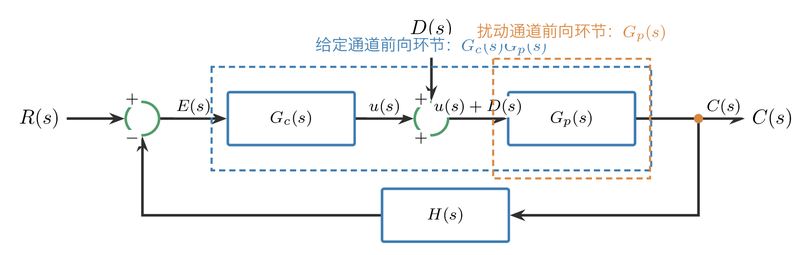
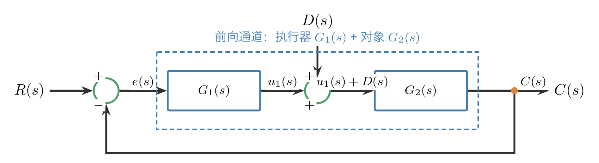
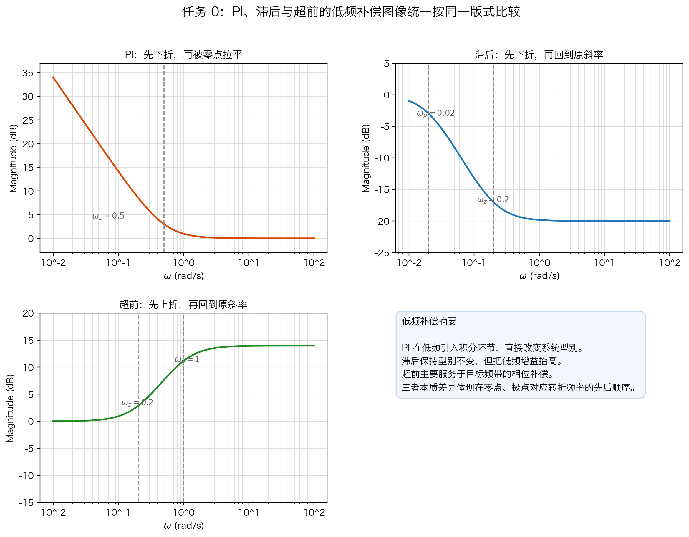
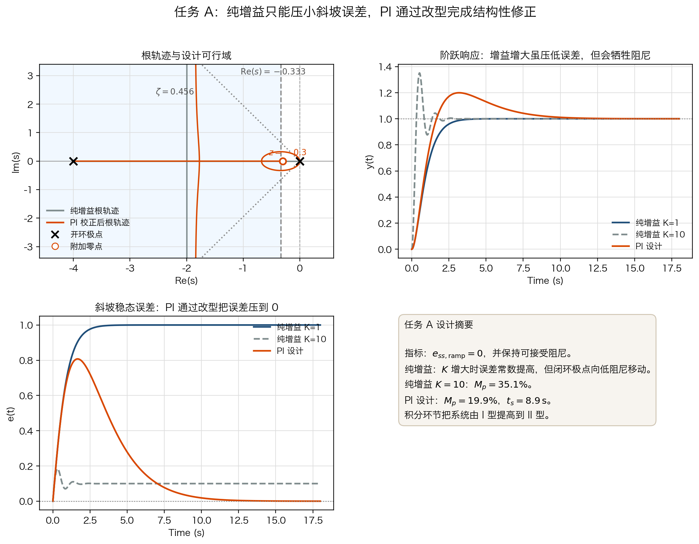
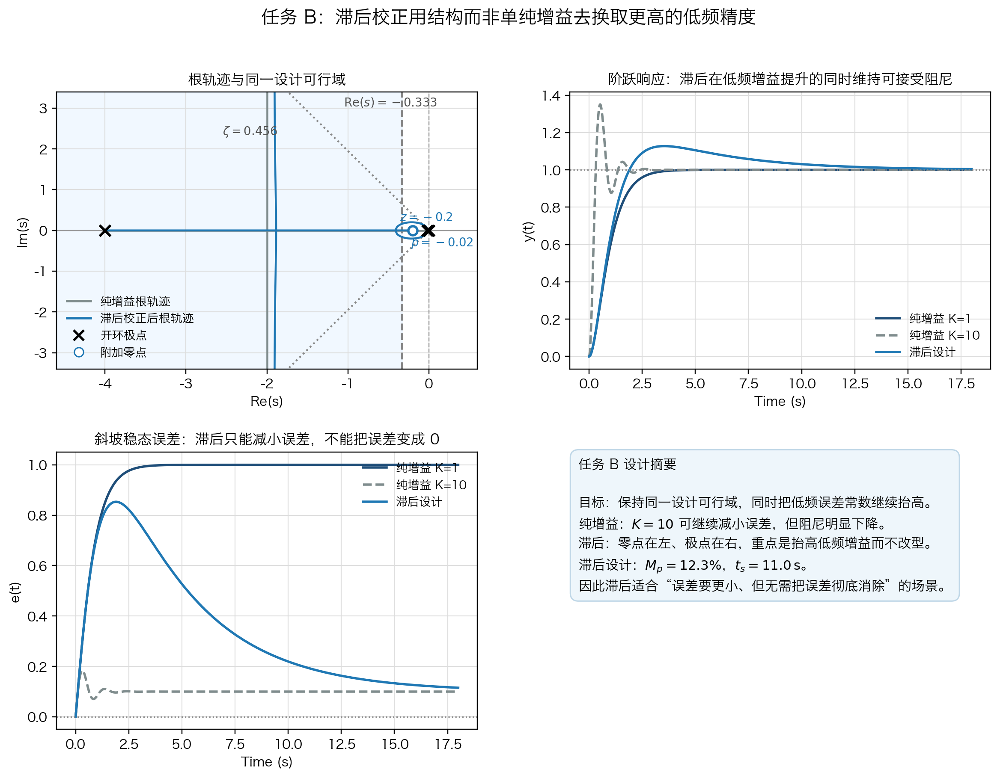
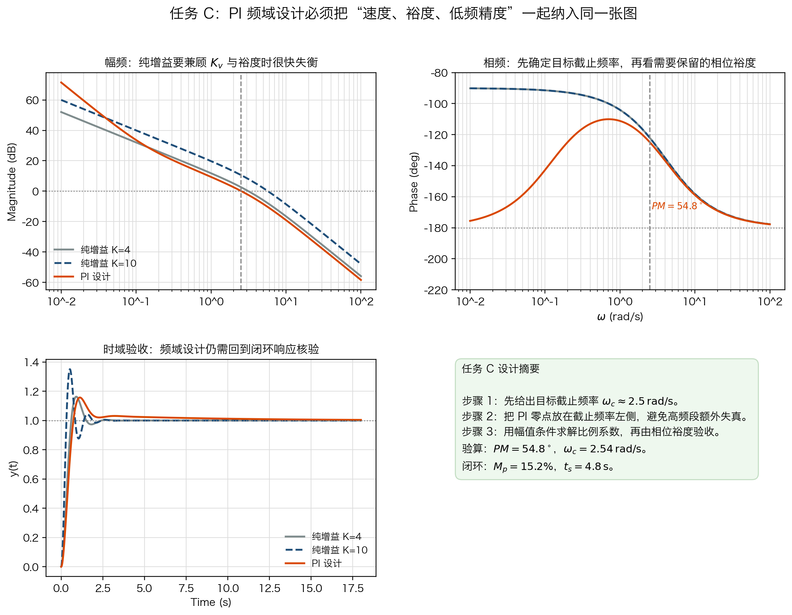
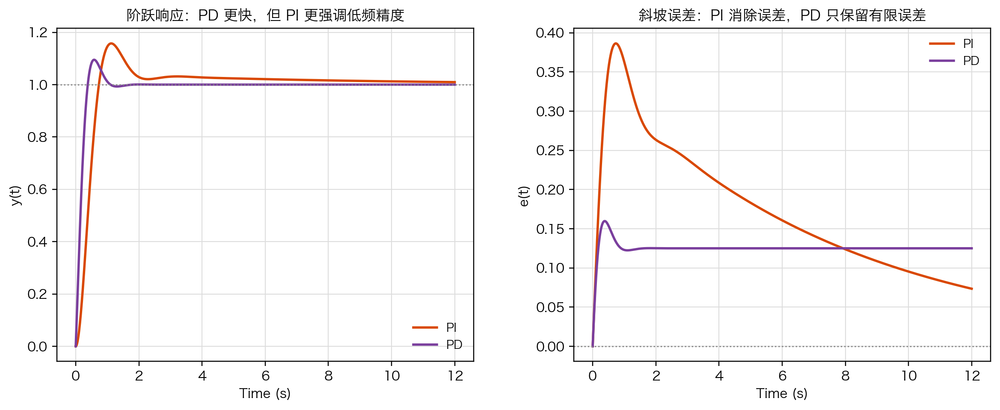
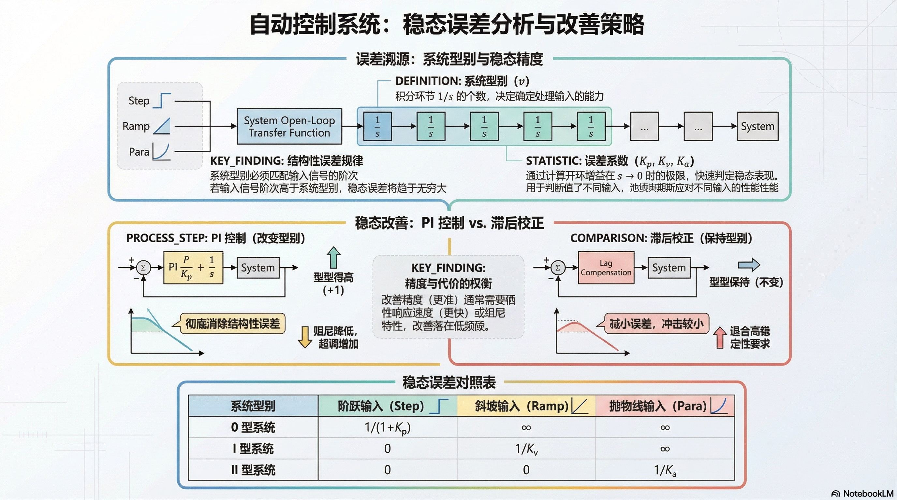

# 单元 3-7 | 型别、积分环节与稳态改善

- **层次**：模块 3 理论主线 · 第七课
- **学时**：90 分钟
- **知识类型**：[C] + [X]
- **前置**：已掌握负反馈结构表达、终值定理、根轨迹基本语言，以及超前/`PD` 校正的动态改善机理
- **后续**：3-8（频域判别与跨域综合语言）、3-9（稳定—动态—稳态综合映射实验）、4-1（性能约束与设计入口）
- **核心问题**：误差从哪条通道来，型别如何决定误差阶次，纯增益为什么只能压小误差而无法消除结构性误差，以及引入 `PI` 与滞后之后动态代价落在哪里。

---

## 一、引入：系统已经稳定了，为什么还可能不够准

系统稳定，只能说明输出不会发散；它并不保证输出最终和给定完全重合。
在闭环控制里，残余偏差至少有两类来源：

1. **系统结构来源**：开环低频结构决定某类误差是否可以从结构上被消除；
2. **信号通道来源**：给定输入与外加扰动进入闭环的位置不同，最终影响输出和误差的方式也不同。

我们先厘清"误差怎样列式、怎样求"，再理解"为什么必须用积分、`PI` 或滞后去改结构，而不是只会调增益"。

> 动态改善线回答"怎样更快、更有阻尼"；
> 稳态改善线回答"为什么更准，以及代价落在哪个频段"。

---

## 二、误差分析主线：先分通道，再谈型别

### 2.1 误差先从两类来源理解

讨论稳态误差时，最容易出现的误判，是把"输入类型"和"扰动进入位置"混成一件事。实际上两者并不等价。

表 1. 误差分析时先要分清的三件事

| 分析对象 | 典型提问 | 常用工具 |
| --- | --- | --- |
| 系统结构 | 这类误差能否从结构上消掉 | 型别、积分个数 |
| 给定输入 | 面对阶跃、斜坡、抛物线时误差怎样变化 | 终值定理、$K_p/K_v/K_a$ |
| 扰动通道 | 外界推偏怎样透到输出与误差 | 闭环传函、误差传函 |

扰动不是"第三种输入型别"。
它的本质是：**经由扰动通道进入闭环，再影响输出与误差。**
因此，给定输入问题与扰动问题的第一步都不是套表，而是先把通道写对。

### 2.2 给定与扰动为何必须分通道

设单回路负反馈系统中，控制器为 $G_c(s)$，对象为 $G_p(s)$，反馈环节为 $H(s)$。给定输入为 $R(s)$，扰动 $D(s)$ 加在对象输入端，总输出为 $C(s)$。我们讨论比较点误差

\begin{equation}
E(s)=R(s)-B(s)=R(s)-H(s)C(s)
\tag{3-7-1}\label{eq:3-7-error-definition}
\end{equation}

它是比较点上的闭环误差；只有在单位反馈 $H(s)=1$ 时，才与常说的输出跟踪误差 $R(s)-C(s)$ 一致。

统一结构如图~\ref{fig:3-7-channels} 所示。

{#fig:3-7-channels width=92%}

输入作用下的闭环传递函数为

\begin{equation}
\Phi_r(s)=\frac{C(s)}{R(s)}=\frac{G_c(s)G_p(s)}{1+G_c(s)G_p(s)H(s)}
\tag{3-7-2}\label{eq:3-7-input-closed-loop}
\end{equation}

扰动作用下的闭环传递函数为

\begin{equation}
\Phi_d(s)=\frac{C(s)}{D(s)}=\frac{G_p(s)}{1+G_c(s)G_p(s)H(s)}
\tag{3-7-3}\label{eq:3-7-disturbance-closed-loop}
\end{equation}

总输出由两条通道叠加得到：

\begin{equation}
C(s)=\Phi_r(s)R(s)+\Phi_d(s)D(s)
\tag{3-7-4}\label{eq:3-7-total-output}
\end{equation}

再由比较点误差定义 $E(s)=R(s)-H(s)C(s)$，即可得到输入作用下与扰动作用下的误差传递函数：

\begin{equation}
\frac{E_r(s)}{R(s)}=\frac{1}{1+G_c(s)G_p(s)H(s)}
\tag{3-7-5}\label{eq:3-7-input-error}
\end{equation}

\begin{equation}
\frac{E_d(s)}{D(s)}=-\frac{G_p(s)H(s)}{1+G_c(s)G_p(s)H(s)}
\tag{3-7-6}\label{eq:3-7-disturbance-error}
\end{equation}

于是总误差为

\begin{equation}
E(s)=E_r(s)+E_d(s)
\tag{3-7-7}\label{eq:3-7-total-error}
\end{equation}

这里有一个必须点明的结论：

> 四类传递函数的分母完全相同，都是 $1+G_c(s)G_p(s)H(s)$。
> 这个公共分母就是闭环系统的特征式，也对应梅森公式中的特征式。
> 它反映的是控制系统的本质结构。改变的是分子部分，分子反映的是选择的信号通道。

后面无论讨论输出还是误差、给定还是扰动，先盯分母看结构，再盯分子看通道，逻辑就不会乱。

### 2.3 终值定理：稳态误差的直接求法

稳态误差的最通用路径是：

1. 先确认闭环稳定；
2. 写出所关心通道的误差传递函数；
3. 再用终值定理求极限。

\begin{equation}
e_{ss}=\lim_{t\to \infty}e(t)=\lim_{s\to 0}sE(s)
\tag{3-7-8}\label{eq:3-7-final-value}
\end{equation}

它回答的是"误差最终停在什么值上"，前提是闭环稳定，且 $sE(s)$ 的极点满足终值定理适用条件。

#### 例题 1：多项式输入作用下的稳态误差

设单位反馈系统的开环传递函数为

\begin{equation}
G(s)=\frac{K}{s^2(0.5s+1)}
\tag{3-7-9}\label{eq:3-7-poly-open-loop}
\end{equation}

给定输入为

\begin{equation}
r(t)=3+2t+\frac{1}{2}t^2
\tag{3-7-10}\label{eq:3-7-poly-input}
\end{equation}

其拉氏变换为

\begin{equation}
R(s)=\frac{3}{s}+\frac{2}{s^2}+\frac{1}{s^3}
\tag{3-7-11}\label{eq:3-7-poly-input-laplace}
\end{equation}

求稳态误差。

**解**

单位反馈下，式 \ref{eq:3-7-input-error} 退化为

\begin{equation}
\frac{E(s)}{R(s)}=\frac{1}{1+G(s)}
\tag{3-7-12}\label{eq:3-7-unity-error}
\end{equation}

故

\begin{equation}
E(s)=\frac{1}{1+G(s)}R(s)
=\frac{s^2(0.5s+1)}{s^2(0.5s+1)+K}\left(\frac{3}{s}+\frac{2}{s^2}+\frac{1}{s^3}\right)
\tag{3-7-13}\label{eq:3-7-poly-error}
\end{equation}

由式 \ref{eq:3-7-final-value}：

\begin{equation}
\begin{aligned}
e_{ss}
&=\lim_{s\to 0}sE(s) \\
&=\lim_{s\to 0}\frac{3s^2(0.5s+1)+2s(0.5s+1)+(0.5s+1)}{s^2(0.5s+1)+K} \\
&=\frac{1}{K}
\end{aligned}
\tag{3-7-14}\label{eq:3-7-poly-final}
\end{equation}

所以多项式输入下的稳态误差为

\begin{equation}
e_{ss}=\frac{1}{K}
\tag{3-7-15}\label{eq:3-7-poly-answer}
\end{equation}

下面我们再用型别与静态误差系数法复算同一题，验证两条路径的一致性。

### 2.4 型别与静态误差系数：稳态误差的快速判断

对标准给定输入，可把开环低频结构写成

\begin{equation}
G(s)H(s)=\frac{K_0}{s^v}G_0(s), \qquad G_0(0)\neq 0
\tag{3-7-16}\label{eq:3-7-type-definition}
\end{equation}

其中 $v$ 是开环传递函数 $G(s)H(s)$ 在原点处的极点个数。
$v=0,1,2,\dots$ 分别对应 0 型、I 型、II 型等系统。

静态误差系数定义为

\begin{equation}
K_p=\lim_{s\to 0}G(s)H(s), \qquad
K_v=\lim_{s\to 0}sG(s)H(s), \qquad
K_a=\lim_{s\to 0}s^2G(s)H(s)
\tag{3-7-17}\label{eq:3-7-static-coeff}
\end{equation}

\begin{center}
表 2. 各型别系统的静态误差系数
\end{center}

| 型别 | $K_p$ | $K_v$ | $K_a$ |
| --- | --- | --- | --- |
| 0 型（$v=0$） | 有限非零 | 0 | 0 |
| I 型（$v=1$） | $\infty$ | 有限非零 | 0 |
| II 型（$v=2$） | $\infty$ | $\infty$ | 有限非零 |

由静态误差系数再转成稳态误差，可得：

\begin{equation}
e_{ss,\mathrm{step}}=\frac{1}{1+K_p}, \qquad
e_{ss,\mathrm{ramp}}=\frac{1}{K_v}, \qquad
e_{ss,\mathrm{para}}=\frac{1}{K_a}
\tag{3-7-18}\label{eq:3-7-standard-ess}
\end{equation}

\begin{center}
表 3. 各型别系统对典型输入的稳态误差
\end{center}

| 型别 | 单位阶跃输入 | 单位斜坡输入 | 单位抛物线输入 |
| --- | --- | --- | --- |
| 0 型 | 有限非零 | $\infty$ | $\infty$ |
| I 型 | 0 | 有限非零 | $\infty$ |
| II 型 | 0 | 0 | 有限非零 |

这个表格只适用于闭环稳定的单回路标准负反馈系统，并且主要服务于**给定输入稳态误差**的快速判断。
一旦题目显式出现扰动通道，仍应优先回到式 \ref{eq:3-7-disturbance-error} 与式 \ref{eq:3-7-final-value}。

#### 回到例题 1：再用静态误差系数法复算

由式 \ref{eq:3-7-poly-open-loop} 可见，该系统含有两个积分环节，因此是 II 型系统。于是

\begin{equation}
K_a=\lim_{s\to 0}s^2G(s)=\lim_{s\to 0}\frac{K}{0.5s+1}=K
\tag{3-7-19}\label{eq:3-7-ka-example}
\end{equation}

输入 $r(t)=3+2t+\frac{1}{2}t^2$ 可以看作"阶跃 + 斜坡 + 单位抛物线"三部分叠加。对 II 型系统：

1. 阶跃分量误差为 0；
2. 斜坡分量误差为 0；
3. 单位抛物线分量误差为 $1/K_a=1/K$。

故总稳态误差仍为

\begin{equation}
e_{ss}=\frac{1}{K}
\tag{3-7-20}\label{eq:3-7-ka-answer}
\end{equation}

两条路径结果一致。终值定理是通用路径，型别与静态误差系数法是标准结构下的快速判断；一旦结构中显式出现扰动通道、附加反馈环节或非标准比较点，就应回到终值定理重新列式。

### 2.5 给定与扰动共同作用下如何求稳态误差

当给定与扰动同时存在时，最稳妥的方法仍是：

1. 先按通道写出总输出；
2. 再由 $E(s)=R(s)-H(s)C(s)$ 写总误差；若是单位反馈，才可简写成 $E(s)=R(s)-C(s)$；
3. 最后用终值定理求极限。

#### 例题 2：给定与扰动共同作用

这里把前向通道拆成两个环节：$G_1(s)$ 表示执行机构，$G_2(s)$ 表示被控对象，扰动加在两者之间。
对应的物理意义是：执行器已经按给定发出了作用，但对象入口又额外受到外界推偏。
例如伺服电机已经给出阀位指令，但管路压力波动在对象入口处额外推了一下系统。

\begin{equation}
G_1(s)=\frac{5}{s+5}, \qquad G_2(s)=\frac{2}{s+2}
\tag{3-7-21}\label{eq:3-7-example2-forward}
\end{equation}

扰动作用在执行器之后、被控对象之前，结构如图所示。

{#fig:3-7-example2-structure width=82%}

给定为单位阶跃输入，扰动为对象入口处的常值附加输入：

\begin{equation}
R(s)=\frac{1}{s}, \qquad D(s)=\frac{0.2}{s}
\tag{3-7-22}\label{eq:3-7-example2-signals}
\end{equation}

求总稳态误差。

**解**

单位反馈下，由式 \ref{eq:3-7-input-closed-loop} 与式 \ref{eq:3-7-disturbance-closed-loop} 可得

\begin{equation}
\Phi_r(s)=\frac{G_1(s)G_2(s)}{1+G_1(s)G_2(s)}=\frac{10}{s^2+7s+20},
\qquad
\Phi_d(s)=\frac{G_2(s)}{1+G_1(s)G_2(s)}=\frac{2(s+5)}{s^2+7s+20}
\tag{3-7-23}\label{eq:3-7-example2-channels}
\end{equation}

因此总误差写成

\begin{equation}
E(s)=\frac{1}{1+G_1(s)G_2(s)}R(s)-\frac{G_2(s)}{1+G_1(s)G_2(s)}D(s)
=\frac{s^2+7s+10}{s^2+7s+20}\cdot \frac{1}{s}
-\frac{2(s+5)}{s^2+7s+20}\cdot \frac{0.2}{s}
\tag{3-7-24}\label{eq:3-7-example2-error}
\end{equation}

由终值定理：

\begin{equation}
\begin{aligned}
e_{ss}
&=\lim_{s\to 0}sE(s) \\
&=\lim_{s\to 0}\left[\frac{s^2+7s+10}{s^2+7s+20}-0.2\frac{2(s+5)}{s^2+7s+20}\right] \\
&=\frac{10}{20}-0.2\frac{10}{20} \\
&=0.4
\end{aligned}
\tag{3-7-25}\label{eq:3-7-example2-answer}
\end{equation}

这个结果说明：同样是常值信号，给定输入与中间扰动经过的通道并不相同，所以留在比较点上的误差也不同。
面对"给定 + 扰动"共同作用的问题，不能只背型别表，更不能把两个信号当作"同一位置的两个输入"来机械叠加。

### 2.6 为什么结构性误差不能靠纯调增益消除

调节增益会改变闭环极点位置，也会改变误差常数的数值；但只要低频结构不变，型别就不变。
因此，纯调增益最多做到：

1. 把某类误差**压小**；
2. 把截止频率、阻尼或相位裕度推到另一个工作点。

它做不到的是：在不改结构的前提下，把"原本不可能为零的误差"直接变成零。

这就是"增益变大"和"型别提高"之间的本质差别：

- **增益调节**：不改变误差阶次；
- **结构修正**：通过引入积分或附加零极点，真正改变低频误差阶次与低频增益分布。

若要求的是结构性误差改善，就必须引入修正结构的控制器。两条典型路径是：

1. `PI`：通过积分提高型别；
2. 滞后：在不改变型别的前提下，提高低频增益并保持可接受的动态品质。

---

## 三、`PI` 与滞后校正：同属低频补偿，但设计逻辑不同

### 3.1 两种低频补偿的结构差别

`PI` 控制器写成

\begin{equation}
G_{PI}(s)=K\left(1+\frac{1}{T_i s}\right)=K\frac{T_i s+1}{T_i s}
\tag{3-7-26}\label{eq:3-7-pi}
\end{equation}

一级滞后校正网络写成

\begin{equation}
G_{lag}(s)=K\frac{Ts+1}{\beta Ts+1}, \qquad \beta>1
\tag{3-7-27}\label{eq:3-7-lag}
\end{equation}

两者都能增强低频能力，但逻辑并不相同。把超前校正也一起纳入比较，可以统一成一条判别规律：先看新增零极点相对原点的先后顺序，再看系统型别是否变化，就能同时判断它对低频精度和对数幅频折线的影响。

- `PI`：在原点新增积分极点，并配一个实零点，核心目的是**提高型别**；因此会先下折，再被零点拉平。
- 滞后：不改变积分个数，而是引入"零点在左、极点在右"的附加零极点对，核心目的是**提高低频增益而少动中频骨架**；因此会先下折，再回到原斜率。
- 超前：表现为"极点在左、零点在右"，主要服务于目标频带的相位补偿；因此会先上折，再回到原斜率。

PI、滞后、超前三种补偿的对数频率特性示意如图~\ref{fig:3-7-lowfreq} 所示。

{#fig:3-7-lowfreq fig-pos="H" width=96%}

\begin{center}
表 4. `PI` 与滞后校正的比较
\end{center}

| 方法 | 型别是否变化 | 主要收益 | 主要代价 | 更像哪条设计线 |
| --- | --- | --- | --- | --- |
| `PI` | 提高 1 型 | 改变误差阶次、显著提高低频跟踪精度 | 相位滞后增加，响应变慢 | 结构性稳态改善 |
| 滞后 | 一般不变 | 提高低频增益，压小有限稳态误差 | 截止频率下降，速度受限 | 低频增益重分配 |

### 3.2 基于时域指标的 `PI` 设计：先证明纯增益不够，再改结构

取典型二阶对象

\begin{equation}
G_p(s)=\frac{4}{s(s+4)}
\tag{3-7-28}\label{eq:3-7-plant}
\end{equation}

设计目标为：

1. 斜坡输入稳态误差为 0；
2. 超调量不超过 20%；
3. 调节时间 $t_s(2\%) \le 12\ \mathrm{s}$。

超调量与调节时间仍由单位阶跃输出 $y(t)$ 衡量；斜坡输入下的精度指标，则由误差 $e(t)=r(t)-y(t)$ 的稳态值衡量。

先看纯增益方法。令控制器为 $G_c(s)=K$，则开环为

\begin{equation}
L_0(s)=\frac{4K}{s(s+4)}
\tag{3-7-29}\label{eq:3-7-pure-gain}
\end{equation}

该对象是 I 型系统，纯增益下速度误差系数为

\begin{equation}
K_v=\lim_{s\to 0}sL_0(s)=K
\tag{3-7-32}\label{eq:3-7-pure-gain-kv}
\end{equation}

故斜坡稳态误差为

\begin{equation}
e_{ss,\mathrm{ramp}}=\frac{1}{K}
\tag{3-7-33}\label{eq:3-7-pure-gain-ramp-error}
\end{equation}

纯增益无论多大，都只能把斜坡误差压小，无法把它变成零。
若要求斜坡稳态误差为 0，就必须把型别从 I 型提升到 II 型。

闭环特征方程为

\begin{equation}
s^2+4s+4K=0
\tag{3-7-30}\label{eq:3-7-pure-gain-char}
\end{equation}

当 $K>1$ 时，闭环极点为

\begin{equation}
s=-2\pm j\,2\sqrt{K-1}
\tag{3-7-31}\label{eq:3-7-pure-gain-poles}
\end{equation}

这一步给出两个直接结论：

1. 根轨迹的复根实部始终固定在 $\operatorname{Re}(s)=-2$ 上，说明调大增益主要是把极点沿竖直线向上推；
2. 阻尼比满足 $\zeta=1/\sqrt{K}$，因此为了减小稳态误差而增大 $K$，会同时减小阻尼。

现在把时域指标翻译成复平面可行域。由

\begin{equation}
M_p \le 20\%, \qquad t_s(2\%) \le 12\ \mathrm{s}
\tag{3-7-34}\label{eq:3-7-time-spec}
\end{equation}

可得

\begin{equation}
\begin{aligned}
M_p=e^{-\pi\zeta/\sqrt{1-\zeta^2}}\le 0.2 &\Rightarrow \zeta \ge 0.456 \\
t_s(2\%)\approx \frac{4}{\sigma}\le 12 &\Rightarrow \sigma \ge \frac{4}{12}=0.333
\end{aligned}
\tag{3-7-35}\label{eq:3-7-time-region}
\end{equation}

可行域可概括为：闭环主导极点必须位于阻尼比边界内侧，并落在 $\operatorname{Re}(s)=-0.333$ 左侧。设计目标不是"把增益调大一点"，而是让补偿后的根轨迹穿过上述可行域，同时把系统型别提高一级。

取 `PI` 控制器

\begin{equation}
G_{PI}(s)=\frac{s+0.3}{s}
\tag{3-7-36}\label{eq:3-7-time-pi-controller}
\end{equation}

由于原点处的附加极点是固定的，设计自由度主要体现在零点位置。把零点从远左逐步移向原点，观察根轨迹与可行域的交点后，可选定 $s=-0.3$ 作为折中位置。这样做的目的有两层：

1. 通过新增积分环节把系统提升为 II 型，从结构上消除斜坡稳态误差；
2. 通过把零点布置在实轴左半平面，重塑根轨迹骨架，使闭环极点落入式 \ref{eq:3-7-time-region} 对应的可行域。

图~\ref{fig:3-7-pi-time} 给出了纯增益与 `PI` 设计的根轨迹、阶跃响应和斜坡跟踪对比。

{#fig:3-7-pi-time fig-pos="H" width=96%}

由图可见：

- 当纯增益从 $K=1$ 调到 $K=10$ 时，斜坡误差从 1 降到 0.1，但阻尼显著下降；
- 纯增益系统始终是 I 型，因此误差曲线 $e(t)$ 只能收敛到更小的常值，不可能先天为零；
- 加入 `PI` 后，系统型别提高为 II 型，斜坡误差曲线可收敛到 0；
- `PI` 设计后的时域指标约为 $M_p \approx 20.0\%$、$t_s \approx 8.9\ \mathrm{s}$，已进入设计可行域。

这一例题的真正结论不是"`PI` 能把误差变小"，而是：

> 当要求消除结构性误差时，第一步不是调增益，而是判断是否必须提高型别。

### 3.3 基于时域指标的滞后校正：同样要先画可行域

仍取对象 $G_p(s)=4/[s(s+4)]$，但现在把目标改成：

1. 保持 $M_p \le 20\%$、$t_s(2\%) \le 12\ \mathrm{s}$；
2. 在不提高型别的前提下，使速度误差系数提高到 $K_v \ge 10$。

若仍只用纯增益，由式 \ref{eq:3-7-pure-gain-kv} 可知需要 $K \ge 10$。
但由式 \ref{eq:3-7-pure-gain-poles} 可知此时阻尼比只有

\begin{equation}
\zeta=\frac{1}{\sqrt{10}}\approx 0.316
\tag{3-7-37}\label{eq:3-7-pure-gain-zeta10}
\end{equation}

已明显低于式 \ref{eq:3-7-time-region} 给出的阻尼边界。
单纯增益法虽然能把 $K_v$ 拉高，却会把极点推向低阻尼区域。

这时引入滞后校正：

\begin{equation}
G_{lag}(s)=\frac{s+0.2}{s+0.02}
\tag{3-7-38}\label{eq:3-7-time-lag-controller}
\end{equation}

这个零极点对的相对位置正好体现了滞后与超前的区别：

- 零点在 $s=-0.2$，更靠左；
- 极点在 $s=-0.02$，更靠右、更接近原点。

因此它的作用不是把根轨迹整体向左猛推，而是尽量保留原有工作点附近的动态特征，同时把低频增益放大约 10 倍。
对应的速度误差系数可写成

\begin{equation}
K_v=\lim_{s\to 0}sG_{lag}(s)G_p(s)=10
\tag{3-7-39}\label{eq:3-7-lag-kv}
\end{equation}

图~\ref{fig:3-7-lag-time} 展示了纯增益与滞后校正在同一可行域下的比较。

{#fig:3-7-lag-time fig-pos="H" width=96%}

图中可以直接读到：

- 若只靠纯增益把 $K_v$ 提高到 10，根轨迹会把闭环极点带到低阻尼区域；
- 滞后校正虽然没有改变型别，但通过"零点在左、极点在右"的结构，把低频增益单独抬高；
- 设计后的响应约为 $M_p \approx 12.7\%$、$t_s \approx 11.6\ \mathrm{s}$，同时满足 $K_v \approx 10$。

所以，滞后的逻辑不是"更弱的积分"，而是：

> 在型别不变时，尽量把低频增益和中频动态分开安排。

### 3.4 基于频域指标的 `PI` 设计：先说明纯增益为什么不可能两头兼顾

仍取对象

\begin{equation}
G_p(s)=\frac{4}{s(s+4)}
\tag{3-7-40}\label{eq:3-7-frequency-plant}
\end{equation}

频域目标给定为：

1. 速度误差系数 $K_v \ge 10$；
2. 相位裕度 $PM \ge 55^\circ$；
3. 截止频率希望落在 $\omega_c \approx 2.5\ \mathrm{rad/s}$ 附近。

先看纯增益。由式 \ref{eq:3-7-pure-gain-kv}，若要满足 $K_v \ge 10$，必须取 $K \ge 10$。
但数值核验表明，此时相位裕度仅约为 $34.9^\circ$。
若反过来把增益压到 $K=4$，则相位裕度可恢复到约 $51.8^\circ$，但速度误差系数只有 4。

纯增益法若想获得足够的相位裕度，只能通过降低截止频率来实现；可一旦这样做，又无法同时满足速度误差系数要求。因此必须引入积分环节。

设计分四步进行。

**步骤 1：先定目标截止频率**

取

\begin{equation}
\omega_c^\ast = 2.5\ \mathrm{rad/s}
\tag{3-7-41}\label{eq:3-7-wc-target}
\end{equation}

使系统既不过分保守，也不把中频推得过高。

**步骤 2：把 `PI` 零点放在截止频率以下**

为减小积分环节在截止频率附近造成的附加相位滞后，取零点

\begin{equation}
\omega_z=0.125\ \mathrm{rad/s}
\tag{3-7-42}\label{eq:3-7-pi-zero}
\end{equation}

对应控制器形式为

\begin{equation}
G_{PI}(s)=K\frac{s+0.125}{s}
\tag{3-7-43}\label{eq:3-7-frequency-pi-general}
\end{equation}

此时在 $\omega_c^\ast$ 附近，`PI` 网络只引入很小的附加相位损失，但已把系统型别从 I 型提升为 II 型，使 $K_v$ 由有限值提升为无穷大。

**步骤 3：由幅值条件求比例系数**

在 $\omega=\omega_c^\ast$ 处满足

\begin{equation}
\left|K\frac{j\omega+0.125}{j\omega}G_p(j\omega)\right|_{\omega=2.5}=1
\tag{3-7-44}\label{eq:3-7-pi-magnitude}
\end{equation}

代入数值可得 $K \approx 2.94$，故取

\begin{equation}
G_{PI}(s)=3\frac{s+0.125}{s}
\tag{3-7-45}\label{eq:3-7-frequency-pi-final}
\end{equation}

**步骤 4：回查相位裕度、截止频率与时域响应**

核验结果如图~\ref{fig:3-7-pi-frequency} 所示。

{#fig:3-7-pi-frequency fig-pos="H" width=96%}

设计结果约为：

\begin{equation}
PM \approx 54.8^\circ, \qquad
\omega_c \approx 2.54\ \mathrm{rad/s}, \qquad
K_v = \infty
\tag{3-7-46}\label{eq:3-7-pi-frequency-result}
\end{equation}

对应闭环时域指标约为

\begin{equation}
M_p \approx 15.6\%, \qquad
t_s \approx 6.0\ \mathrm{s}
\tag{3-7-47}\label{eq:3-7-pi-frequency-step}
\end{equation}

这个例题要强调的不是某一组参数，而是设计顺序：

> 先判断纯增益不可能兼顾低频精度和相位裕度，再定截止频率、布置 `PI` 零点，最后由幅值条件求 $K$ 并回查结果。

### 3.5 频域设计下 `PI` 与 `PD` 的性能差异

为了和上一课的动态改善线衔接，再取一个满足较高截止频率的 `PD` 方案

\begin{equation}
G_{PD}(s)=8(1+0.1s)
\tag{3-7-48}\label{eq:3-7-frequency-pd}
\end{equation}

对同一对象 $G_p(s)=4/[s(s+4)]$ 核验，可得近似结果：

\begin{equation}
PM_{PD}\approx 64.9^\circ, \qquad
\omega_{c,PD}\approx 5.41\ \mathrm{rad/s}, \qquad
K_{v,PD}=8
\tag{3-7-49}\label{eq:3-7-pd-frequency-result}
\end{equation}

将式 \ref{eq:3-7-pi-frequency-result} 与式 \ref{eq:3-7-pd-frequency-result} 对比，可总结为：

\begin{center}
表 5. 频域设计下 `PI` 与 `PD` 的比较
\end{center}

| 方法 | 低频精度 | 截止频率 | 相位裕度 | 时域形态 |
| --- | --- | --- | --- | --- |
| `PI` | 更强，斜坡误差可消除 | 较低 | 中等偏高 | 上升较慢，但跟踪更准 |
| `PD` | 仍为 I 型，斜坡误差有限非零 | 更高 | 更高 | 上升更快、更利落，但低频误差不如 `PI` |

图~\ref{fig:3-7-pi-pd} 给出了二者的时域响应形态对比。

{#fig:3-7-pi-pd fig-pos="H" width=100%}

从图中可以直接看到：

- `PI` 的阶跃响应更温和，斜坡跟踪最终更准；
- `PD` 的阶跃响应更快，过渡过程更"利落"，但斜坡误差仍保留有限偏差；
- 二者并非谁"更高级"，而是分别对应"低频精度优先"和"动态速度优先"的两条设计取向。

### 3.6 低频与中频的分工

`PI` 与滞后都在强调低频；`PD` 与超前则更多作用在中频与相位。
当我们问"为什么更准"和"代价落在哪里"时，答案已经开始从时域和根轨迹转向频域：

1. 低频决定稳态精度；
2. 中频附近决定截止频率与相位裕度；
3. 补偿器的零极点相对位置，决定了到底是在改善结构性误差，还是在交换速度与阻尼。

---

## 四、工程视角：长期偏一点，整段航程都在付代价

在船舶航向控制里，稳态误差看起来只是一个很小的角度偏差，但落到工程现场，它会转化成航迹偏离、反复操舵、推进功率浪费，以及狭窄航道中的安全风险。
工程上真正关心的，不是"能不能把公式背下来"，而是能否判断：

1. 这类误差到底来自结构还是扰动；
2. 该不该加积分；
3. 该用 `PI` 还是滞后；
4. 加完之后会把动态代价压到哪里。

---

## 五、本节小结与前后衔接

1. 稳态误差必须先分给定通道与扰动通道，再决定是看输出还是看误差。
2. 给定作用下与扰动作用下的闭环/误差传函分母相同，反映的是同一个闭环特征式；改变的是分子，分子反映的是信号通道。
3. 终值定理给出稳态误差的通用求解路径，型别与静态误差系数用于标准给定输入的快速判断。
4. 纯调增益不能消除结构性误差；若要改变误差阶次，必须引入修正结构的控制器。
5. `PI` 通过提高型别改善低频精度，滞后通过重分配低频增益改善有限误差；二者都不是"免费午餐"。
6. 频域下的 `PI` 与 `PD` 展现出"低频精度优先"与"动态速度优先"的不同设计取向，下一讲将把这组差异翻译成统一频域语言。

---

---

## 附录 A：稳态误差求解路径判断表

\begin{center}
表 6. 直接求与快速判的选用规则
\end{center}

| 当前问题 | 建议路径 | 关键提醒 |
| --- | --- | --- |
| 标准负反馈、只问典型给定输入稳态误差 | 优先快速判 | 先看型别，再看 $K_p/K_v/K_a$ |
| 输入与扰动共同存在 | 优先直接求 | 先分通道，再做终值极限 |
| 输入是多项式叠加 | 两条路径都可用 | 终值定理看全式，静态误差系数看保留分量 |
| 目标是判断是否必须引入积分 | 先看型别 | 判断误差能否从结构上变成零 |

## 附录 B：本讲用到的复现脚本

本讲保留 `MATLAB/Octave` 复现脚本，但不在讲义中展开长脚本代码，以免打断正文阅读。
配套资料中保留两类脚本：

1. 出图脚本：负责生成根轨迹、时域响应和频域响应图片；
2. 数值核验脚本：负责复算稳态误差、相位裕度、截止频率与关键时域指标。

讲义中只保留设计逻辑、关键公式与结果解释；具体代码随课程资料包单独提供。
