# 单元 3-8 | 频域判别与跨域综合语言

- **层次**：模块3 理论主线 · 第八课
- **学时**：90分钟
- **知识类型**：[X] + [C]
- **前置要求**：已掌握频率响应与 Bode / Nyquist 图的基本读法，理解根轨迹、零点、积分环节与低频补偿的机理，能够区分增益变化、零点引入与积分补偿在结构上的差别
- **后续课程**：3-9（稳定—动态—稳态综合映射实验）、4-1（设计起点：性能指标体系、工程约束与可行域表达）
- **讲义定位**：这份讲义将带你把前面学过的增益、零点、极点、积分与滞后变化统一翻译成频域语言，形成一条完整判断链：先看结构变化在频域图上留下的痕迹，再判断稳定边界，最后把相角裕度、增益裕度、带宽和谐振峰值读回成闭环动态与工程后果。

---

## 一、引入：为什么同样是结构变了，频域图上的反应却完全不同

在前几课里，你已经分别见过三类典型变化：

1. 调大增益以后，系统往往更快，但更容易靠近稳定边界；
2. 引入零点以后，动态过程会变得更积极，同时高频代价也会抬升；
3. 加入积分或滞后以后，稳态精度会提高，但中频相位余量会变紧。

这些现象都是真实存在的，但如果只从时域曲线或根轨迹各看一遍，你仍然很难快速回答两个工程上最关键的问题：

1. 结构变化首先改写的是哪一段频率范围？
2. 它带来的收益和代价，最终会落到哪一种闭环表现上？

频域分析的价值就在这里。它把“结构变化”“稳定边界”“闭环后果”压到同一张判断地图里。对船舶航向控制而言，低频段关系到持续扰动下的航向精度，中频段关系到操纵快慢与超调，高频段关系到噪声和执行器负担。你在本课真正要建立的能力，不是“会画图”，而是“会根据图做判断”。

> 本课核心问题：为什么增益、零点、极点和积分补偿会在频域里留下不同指纹？这些指纹又怎样被翻译成稳定判断、性能读回与工程决策？

---

## 二、核心内容

### 2.1 频域是统一翻译器

把前面学过的知识放在一起看，模块3已经建立了三条主要机制线：

1. 3-1 到 3-4 讲的是极点分布、稳定边界和根轨迹迁移；
2. 3-5 到 3-6 讲的是零点引入对动态过程的改变；
3. 3-7 讲的是积分、PI 和滞后补偿如何改善稳态精度。

频域语言的作用，是把这三条线重新放进同一个框架中。最简洁的表达可以写成：

> 结构变化 → 开环频率特性改写 → 稳定边界变化 → 闭环性能后果

你在本课要形成的判断顺序是：

1. 变化主要改写了低频、中频还是高频？
2. 变化让系统离临界点更近还是更远？
3. 这会怎样反映到速度、超调、稳态精度和噪声代价上？

只要这三步顺起来，Nyquist 判据、Bode 判稳、带宽、裕度和谐振峰值就不再是零散术语，而会变成同一条判断链上的不同节点。

### 2.2 四类结构变化的频域指纹

设开环传递函数为

$$
L(s)=G(s)H(s)
$$

其频率响应写成

$$
L(j\omega)=G(j\omega)H(j\omega)
$$

增益、零点、极点、积分环节之所以会带来不同闭环后果，是因为它们改写 $L(j\omega)$ 的方式不同。

| 结构变化 | 幅频主变化 | 相频主变化 | 第一观察重点 | 常见闭环后果 |
| --- | --- | --- | --- | --- |
| 增益提升 | 整体上移 | 相位基本不变 | 截止频率是否右移 | 速度提高，但稳定余量常减小 |
| 左半平面零点 | 中高频抬升 | 中频相位提前 | 中频是否获得更多提前 | 动态更积极，高频代价上升 |
| 极点增加 / 积分环节 | 低频到中频抬升或转折变早 | 相位更早下降 | 中频余量是否被压缩 | 精度提高，但相位余量更紧 |
| 右半平面零点 | 幅值可能抬升 | 相位朝不利方向变化 | 截止频率上升是否伴随更大相位代价 | 直觉容易失真，超调风险增大 |

#### 2.2.1 增益提升：整条曲线一起被抬高

若把开环增益从 $K$ 增大为 $\alpha K$，其中 $\alpha > 1$，则

$$
L_{\text{new}}(j\omega)=\alpha L(j\omega)
$$

这意味着幅频曲线整体上移 $20\log_{10}\alpha$ dB，而相位曲线基本保持原状。频域上最直接的后果有两个：

1. 截止频率通常向右移动，系统速度往往提高；
2. 穿越点更靠近相位不足区，相角裕度常随之减小。

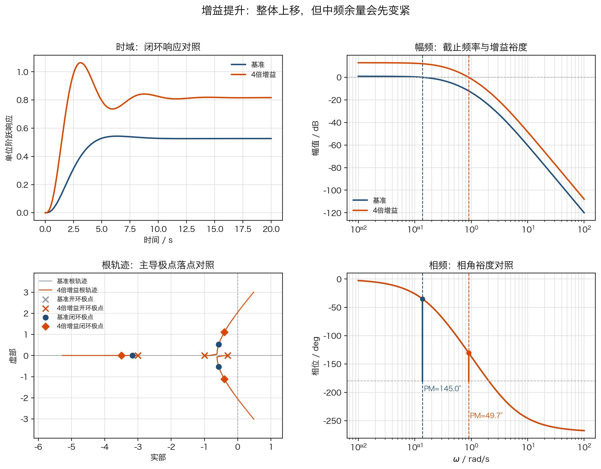{width=100%}

你要抓住的关键词是“整体上移”。这类变化优点直接，代价也直接。

#### 2.2.2 左半平面零点：重点改写中频

引入一个左半平面零点，例如

$$
G_z(s)=1+\frac{s}{z}, \qquad z>0
$$

它在零点附近频带会同时改写幅值和相位：

1. 幅值在较高频率开始上升；
2. 相位在中频段出现提前；
3. 中频段更容易获得较大的动态积极性。

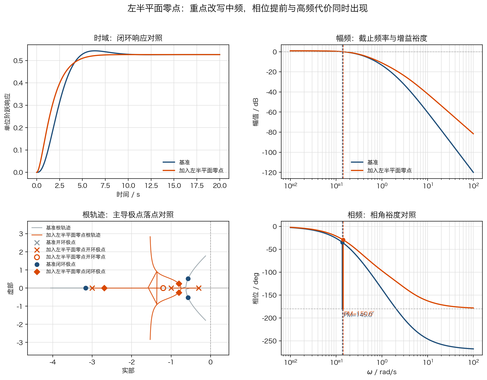{width=100%}

这就是 PD、测速反馈和超前校正容易改善动态品质的原因。它们主要工作的区域不在低频，而在中频。

#### 2.2.3 极点增加与积分环节：先给精度，再收紧余量

积分环节本质上是在原点增加一个极点。若引入

$$
G_i(s)=\frac{1}{s}
$$

或者更一般地增加一个靠近中低频的极点，你会同时看到两种变化：

1. 低频增益增强，稳态精度与抗缓变扰动能力提高；
2. 相位下降得更早，中频相位余量变紧。

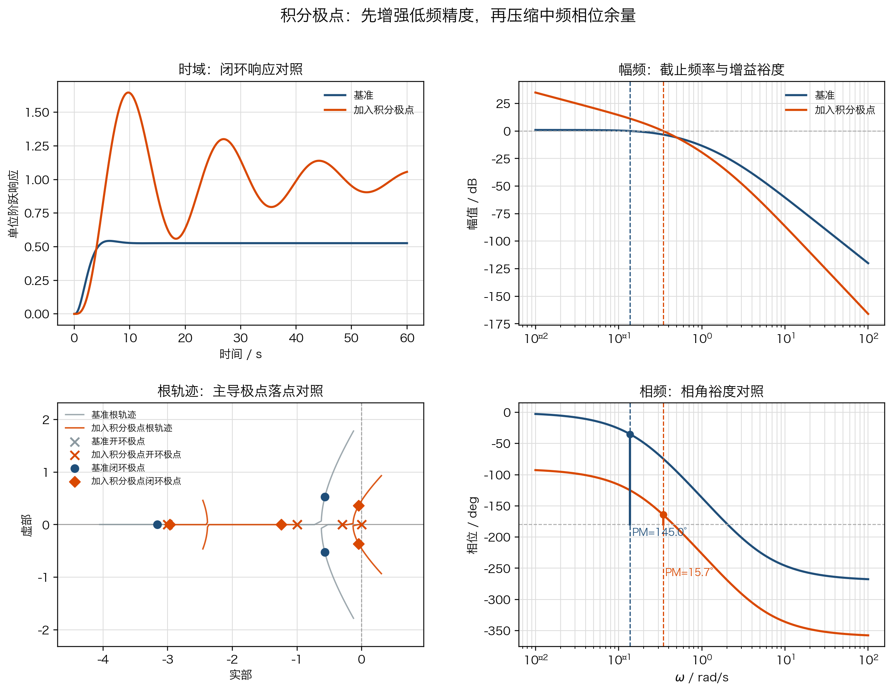{width=100%}

这一节和 3-7 是直接连着的。稳态精度并不是凭空得到的，它通常是通过低频资源增强换来的，而代价常落在中频相位余量上。

#### 2.2.4 右半平面零点：为什么“看起来更强”却可能更难控制

若系统出现右半平面零点，例如

$$
G_{\text{nmp}}(s)=1-\frac{s}{z}, \qquad z>0
$$

则它在幅频上可能表现出“更强”的趋势，但相位却朝更不利的方向变化。此时最容易出现的误判，是只看截止频率上升，就把系统理解成“更快更好”。

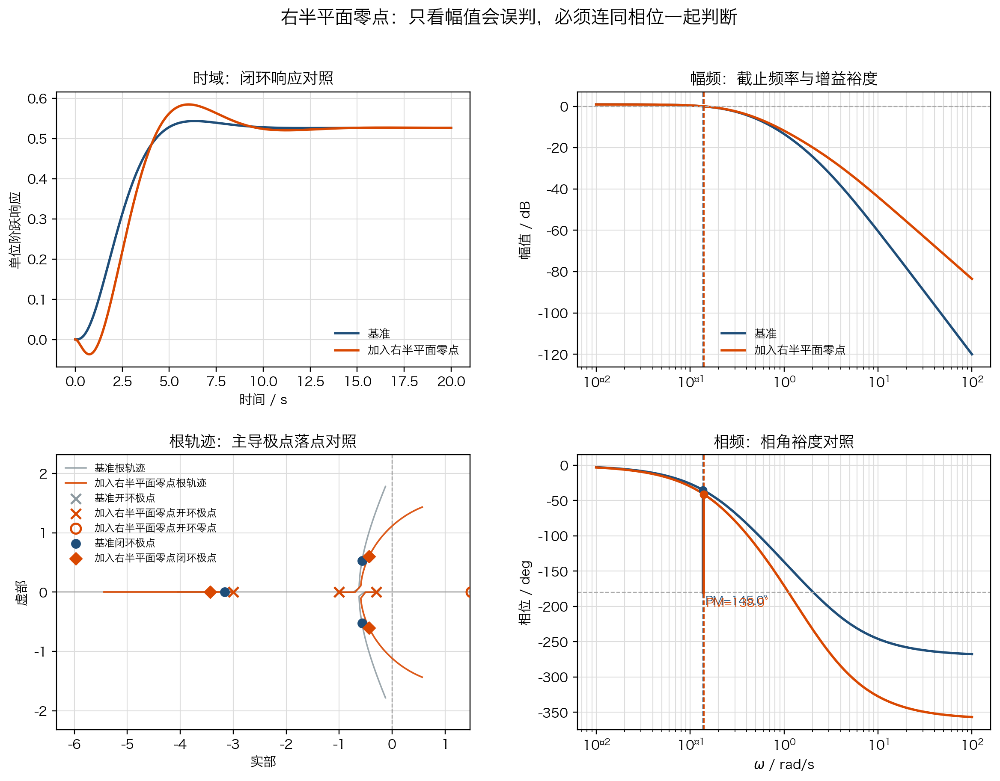{width=100%}

这张图强调的是同一条原则：频域判断不能只看幅值，不看相位。只要相位代价过大，速度提升就会伴随更高的超调风险，甚至会把系统推向更靠近临界点的状态。

#### 例题 1：先从哪一段频带开始判断结构变化

设某单位负反馈系统原始开环频率特性已知，现在分别施加以下变化：

1. 增益扩大为原来的 $4$ 倍；
2. 引入左半平面零点 $1+s/0.8$；
3. 在原点增加一个积分极点。

要求：分别判断哪一种变化最先改写低频，哪一种最先改写中频，并说明每种变化的主要收益和代价。

**解**

- $4$ 倍增益会整体抬高幅频曲线，第一观察重点是截止频率是否右移；
- 左半平面零点主要改写中频，相位提前和高频抬升会同时出现；
- 积分极点首先增强低频，再把中频相位余量压紧。

因此：

- 最先改写低频的是积分极点；
- 最先改写中频的是左半平面零点；
- 改写最均匀的是增益提升。

这个例题训练的是“先看哪一段频带”。这一步判断对了，后面的稳定边界和闭环后果就容易顺着读出来。

### 2.3 从幅角原理到 Nyquist 判据

Nyquist 判据不是一条凭空记忆的规则，它来自幅角原理。要把这条链看清，需要分三步。

#### 2.3.1 幅角原理在说什么

设复函数 $F(s)$ 在封闭路径内部解析，且路径上没有零点和极点。把路径按正方向走一周后，函数值 $F(s)$ 在复平面上的总转角满足

$$
\Delta \arg F(s)=2\pi(Z-P)
$$

其中：

- $Z$ 是路径内部零点数；
- $P$ 是路径内部极点数。

这句话的直观意思是：函数值绕原点转了多少圈，完全由路径内部的零点和极点共同决定。

| 记号 | 含义 | 在闭环稳定分析中的作用 |
| --- | --- | --- |
| $P$ | 路径内部极点数 | 反映开环右半平面极点数 |
| $Z$ | 路径内部零点数 | 对应闭环右半平面极点数 |
| $\Delta \arg F(s)$ | 映射曲线总转角 | 反映函数值对原点的环绕 |

#### 2.3.2 为什么要取 $F(s)=1+G(s)H(s)$

对负反馈系统，闭环传递函数写成

$$
\Phi(s)=\frac{G(s)}{1+G(s)H(s)}
$$

把 $G(s)$ 和 $H(s)$ 分别写成

$$
G(s)=\frac{N_G(s)}{D_G(s)}, \qquad H(s)=\frac{N_H(s)}{D_H(s)}
$$

则闭环传递函数可以改写为

$$
\Phi(s)=\frac{N_G(s)D_H(s)}{D_G(s)D_H(s)+N_G(s)N_H(s)}
$$

所以闭环特征方程的惯例写法是

$$
1+G(s)H(s)=0
$$

对应的闭环特征多项式为

$$
D_G(s)D_H(s)+N_G(s)N_H(s)=0
$$

现在定义

$$
F(s)=1+G(s)H(s)=\frac{D_G(s)D_H(s)+N_G(s)N_H(s)}{D_G(s)D_H(s)}
$$

若某个点 $s_0$ 满足

$$
F(s_0)=0
$$

那么就有

$$
1+G(s_0)H(s_0)=0
$$

进一步得到

$$
D_G(s_0)D_H(s_0)+N_G(s_0)N_H(s_0)=0
$$

这正是闭环特征方程成立的条件。于是：

- $F(s)$ 的零点；
- 闭环特征方程的根；
- 闭环极点；

是同一组点。

这一步非常关键，因为它把“闭环极点是否跑进右半平面”转成了“$F(s)$ 在右半平面有没有零点”。

#### 2.3.3 为什么临界点会变成 $(-1,0)$

既然我们研究的是 $F(s)=1+G(s)H(s)$，那么在虚轴上映射时有

$$
F(j\omega)=1+G(j\omega)H(j\omega)
$$

若某一点满足

$$
F(j\omega)=0
$$

就等价于

$$
G(j\omega)H(j\omega)=-1+j0
$$

也就是说：

- 在 $F$ 平面里，关键对象是“绕原点的情况”；
- 在 $G(s)H(s)$ 平面里，完全等价的关键对象就是“对 $(-1,0)$ 的包围情况”。

这个点在 Nyquist 判据里叫做**临界点**。

若采用“顺时针包围临界点记为正”的工程习惯，则 Nyquist 判据可写成

$$
N=P-Z
$$

其中：

- $P$ 是开环右半平面极点数；
- $N$ 是 Nyquist 曲线对临界点 $(-1,0)$ 的顺时针包围数；
- $Z$ 是闭环右半平面极点数。

于是闭环稳定的条件就是

$$
Z=0 \quad \Longleftrightarrow \quad N=P
$$

你真正要记住的不是一句口号，而是下面这三步：

1. 先数开环右半平面极点数 $P$；
2. 再数 Nyquist 曲线对临界点的包围数 $N$；
3. 最后用 $Z=P-N$ 判断闭环右半平面极点数。

#### 例题 2：第一组快速判稳题

观察四条典型 Nyquist 曲线，分别完成下列判断：

1. 哪一条属于开环稳定且闭环稳定？
2. 哪一条属于开环含一个右半平面极点，但闭环仍稳定？
3. 哪一条属于开环含一个右半平面极点，且闭环不稳定？
4. 哪一条虽然含右半平面零点，但并不因此自动失稳？

**解**

可按“先数 $P$，再数 $N$，最后算 $Z$”的顺序判断。这里直接把对象写回表格，但用更紧凑的表达控制列宽：

\begin{center}
\begingroup\small
\begin{tabular}{p{0.08\linewidth} p{0.34\linewidth} p{0.07\linewidth} p{0.07\linewidth} p{0.11\linewidth} p{0.19\linewidth}}
\hline
图形 & 对象 $L(s)$ & $P$ & $N$ & $Z=P-N$ & 结论 \\
\hline
A & $6/[(s+1)(s+2)(s+4)]$ & 0 & 0 & 0 & 开环稳定，闭环稳定 \\
B & $0.5(s+0.5)/[(s-1)(s+1)(s+3)]$ & 1 & 0 & 1 & 开环不稳定，闭环仍不稳定 \\
C & $8(s+0.5)/[(s-1)(s+1)(s+3)]$ & 1 & 1 & 0 & 开环不稳定，但闭环稳定 \\
D & $10(s-0.5)/[(s+1)(s+2)(s+8)]$ & 0 & 0 & 0 & 含右半平面零点，但闭环仍稳定 \\
\hline
\end{tabular}
\endgroup
\end{center}

这组题训练的是读图判稳的基本动作。你不需要先解高阶方程，只要 $P$、$N$、$Z$ 这三个量数清楚，稳定性就已经明了。

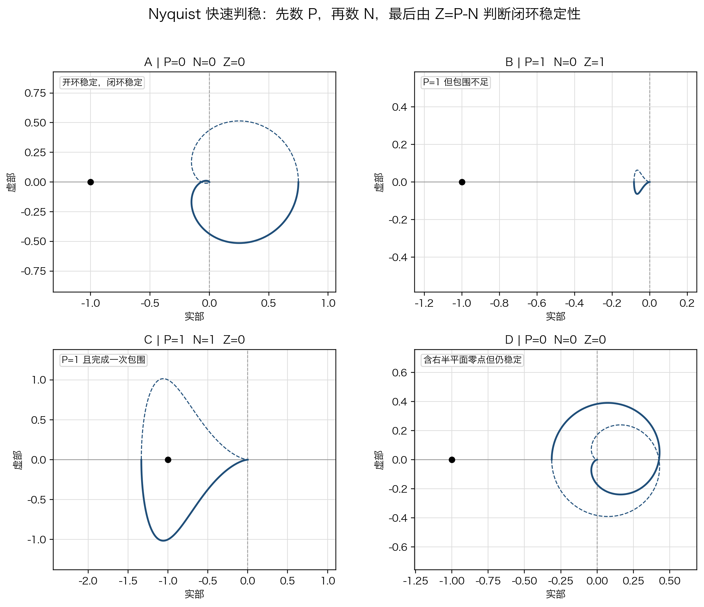{width=100%}

#### 例题 3：第二组设计型例题

考虑开环系统

$$
L(s)=\frac{K}{(s+1)(s+2)(s+4)}
$$

图中给出了 $K=80$ 与 $K=110$ 两种增益对应的 Nyquist 曲线。问：

1. 哪一条曲线没有包围临界点，但已经明显逼近稳定边界？
2. 哪一条曲线已经发生包围，说明闭环越过了稳定边界？
3. 如果工程目标是“既要提高速度，又不能丢掉稳定余量”，你会优先保留哪一个增益区间？

**解**

- $K=80$ 的曲线没有包围临界点，闭环仍保持稳定，但它已经比低增益情况更接近稳定边界；
- $K=110$ 的曲线已经对临界点形成包围，说明闭环极点进入了右半平面；
- 对需要保留稳定余量的设计任务，$K=80$ 这一类“靠近临界点但尚未包围”的区间更适合作为继续整定的起点。

这组题训练的是“从判稳走向设计”。Nyquist 图不仅能告诉你稳不稳，还能告诉你还有没有继续提速的余地。

图 7 中蓝色曲线对应 $K=80$，橙色曲线对应 $K=110$。这里把显示范围收紧到临界点附近，是为了把“是否发生包围、距离临界点还有多近”直接凸显出来。

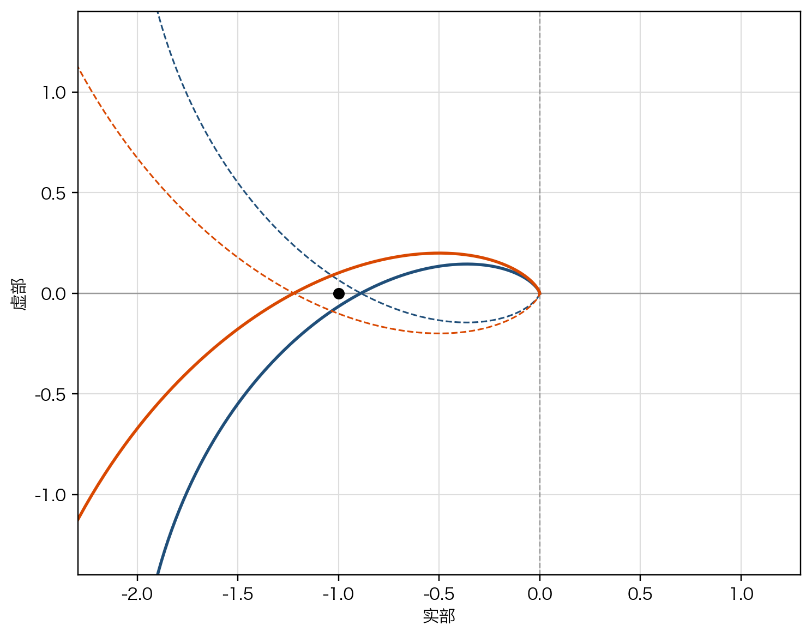{width=78%}

### 2.4 Bode 判稳与稳定裕度

Nyquist 图把稳定问题写成了临界点的几何关系。Bode 图则把同一件事拆成两个更容易读的量：

1. 幅值什么时候降到 $0$ dB；
2. 这时相位离 $-180^\circ$ 还有多远。

#### 2.4.1 截止频率、相角裕度和增益裕度

若在某频率 $\omega_c$ 处满足

$$
|L(j\omega_c)|=1
$$

则 $\omega_c$ 称为**截止频率**。相角裕度定义为

$$
\gamma = 180^\circ + \angle L(j\omega_c)
$$

若在某频率 $\omega_\pi$ 处满足

$$
\angle L(j\omega_\pi)=-180^\circ
$$

则 $\omega_\pi$ 称为**相位穿越频率**。这时若幅值为 $|L(j\omega_\pi)|$，增益裕度定义为

$$
G_m=\frac{1}{|L(j\omega_\pi)|}
$$

或用分贝写成

$$
G_{m,\text{dB}}=-20\log_{10}|L(j\omega_\pi)|
$$

它们回答的是同一个问题：系统距离临界状态还有多少余量。

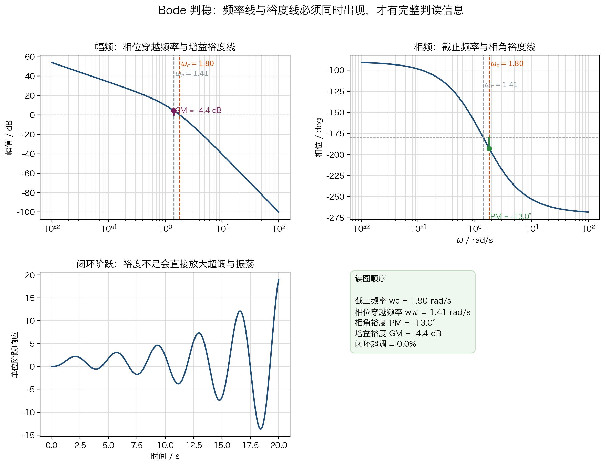

从图上读 Bode 判稳时，要特别注意两类线：

1. **频率线**：截止频率 $\omega_c$ 与相位穿越频率 $\omega_\pi$ 的竖线；
2. **裕度线**：相位图上从相位曲线到 $-180^\circ$ 的 PM 线，幅频图上从幅值曲线到 $0$ dB 的 GM 线。

#### 2.4.2 为什么不能只看截止频率

截止频率右移，通常意味着系统会更快；但如果右移的同时相位下降得更厉害，相角裕度就会变小。于是“更快”并不自动等于“更好”。

| 先看什么 | 主要问题 | 典型结论 |
| --- | --- | --- |
| 截止频率 $\omega_c$ | 系统倾向于更快还是更慢 | 更右通常更快 |
| 相角裕度 $\gamma$ | 中频余量是否充足 | 更大通常更稳、更不易超调 |
| 增益裕度 $G_m$ | 增益继续上调是否危险 | 更大表示对增益变化更有余量 |

#### 例题 4：由 Bode 图直接判稳

对上图中的开环系统，已标出截止频率、相位穿越频率、相角裕度线和增益裕度线。问：

1. 该系统的相角裕度与增益裕度是正还是负？
2. 它更接近稳定还是已经越过稳定边界？
3. 若要把它拉回稳定侧，应优先把截止频率左移还是继续右移？

**解**

从图中可以直接读出：

- 在截止频率处，相位已经低于 $-180^\circ$，因此相角裕度为负；
- 在相位穿越频率处，幅值仍高于 $0$ dB，因此增益裕度也为负；
- 相角裕度和增益裕度都为负，说明系统已经越过稳定边界；
- 若要回到稳定侧，应优先把截止频率左移，或者通过超前校正增加中频相位，而不是继续把截止频率向右推。

这道题训练的是“读线判稳”。Bode 判稳的核心，不是背定义，而是看清两条频率线和两条裕度线。

### 2.5 三频段分工：谁负责精度，谁负责速度，谁负责代价

频域语言真正好用的地方，在于它允许你按频段分工提问。

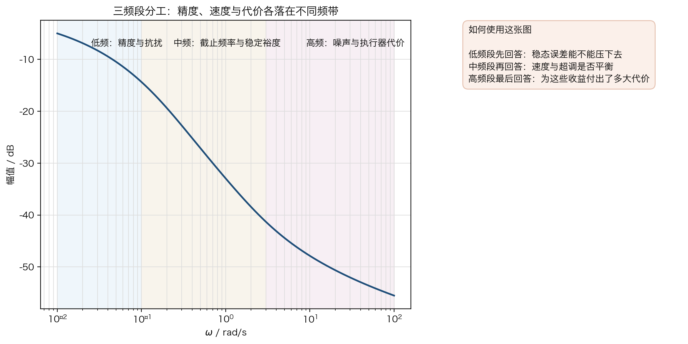{width=100%}

| 频段 | 主要关注量 | 常见工程含义 |
| --- | --- | --- |
| 低频段 | 低频增益、误差衰减能力 | 稳态精度、抗缓变扰动 |
| 中频段 | 截止频率、相角裕度、增益裕度 | 速度、超调、稳定边界 |
| 高频段 | 衰减斜率、峰值放大 | 噪声敏感性、执行器负担、鲁棒性 |

进一步把闭环性能读回来时，还常用下面几个量：

| 频域量 | 你通常关心什么 | 对闭环的典型提示 |
| --- | --- | --- |
| 带宽 $\omega_b$ | 系统能有效跟踪多快的变化 | 越大通常越快 |
| 相角裕度 $\gamma$ | 离临界状态还有多远 | 越大通常越稳 |
| 谐振峰值 $M_r$ | 闭环峰化是否明显 | 越大越容易超调、共振 |
| 谐振频率 $\omega_r$ | 峰值出现在什么频带 | 帮助判断共振集中在哪一段 |

#### 例题 5：按频段安排校正目标

若某系统的任务从“尽快跟踪”切换为“优先减小超调并减轻执行器波动”，你会优先希望下面哪组频域量发生变化？

1. 截止频率继续右移；
2. 相角裕度增大，谐振峰值减小；
3. 高频段增益继续抬高。

**解**

更合适的是第 2 组。因为任务已经从“尽快跟踪”转向“优先平稳”，此时更需要的是更大的中频余量和更轻的闭环峰化，而不是单纯把系统推得更快。

这个例题说明三频段分工不是记忆表格，而是设计时的优先级排序。

### 2.6 综合案例：把判据、裕度和三频段真正用起来

#### 2.6.1 船舶航向控制：超前校正把“较慢且超调偏大”改成“更快且更稳”

本案例不是从“凭空设计一个新控制器”开始，而是先回到资源库中已经出现过的原始对象。在 `5.1` 船舶航向控制案例里，给出的就是一个**未校正、直接负反馈**的原始方案：开环采用固定增益 $K=2.25$，闭环采用单位负反馈。因此，本节所谓“基线方案”，并不是临时拍脑袋挑出来的一条曲线，而是：

1. 直接采用原案例中的开环对象；
2. 不附加任何超前、滞后或积分补偿；
3. 直接与单位负反馈闭合，作为“原系统还没有校正时”的起点。

先写出这个基线开环模型：

$$
L_h(s)=\frac{0.01715\times 2.25}{s(s+0.1)(s+2.14375)}
$$

对应的基线闭环模型为

$$
\Phi_{h,0}(s)=\frac{L_h(s)}{1+L_h(s)}
$$

这样设置基线的理由很直接：只有先看清“原系统自己哪里不足”，后面的频域目标和校正动作才有意义。否则，所谓“校正后变好了”，就失去了参照物。

图 10 先把这个基线方案按统一的 2×2 方式摆出来：左上看闭环时域响应，左下看根轨迹与当前闭环极点位置，右上看开环幅频特性，右下看开环相频特性并在截止频率处标出相角裕度。

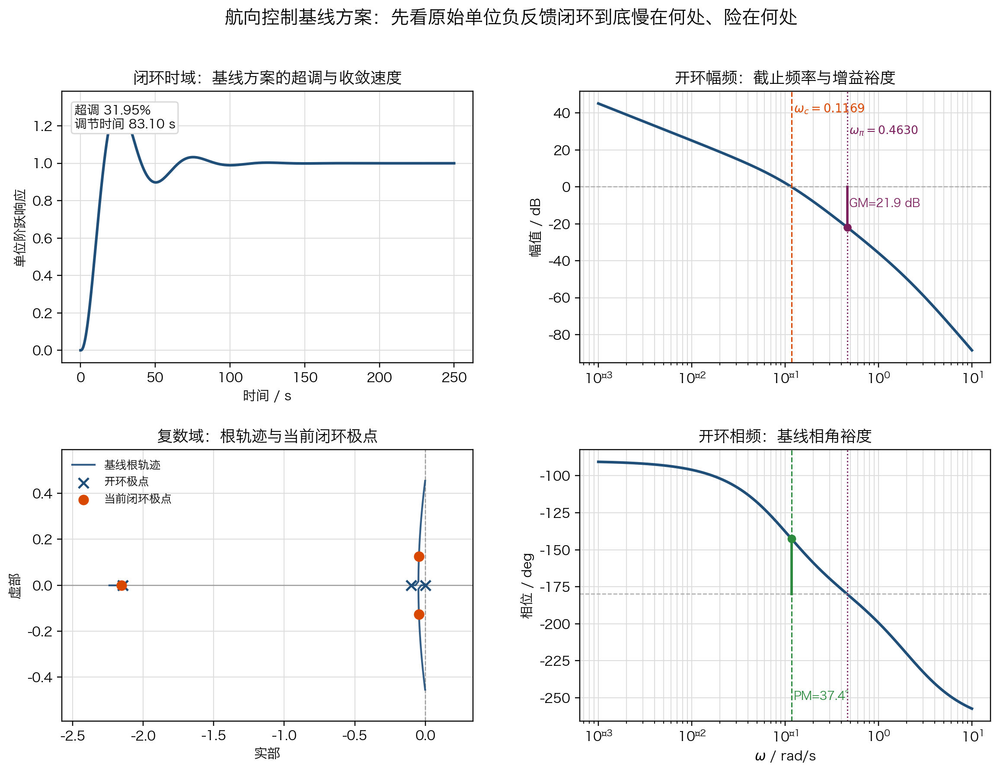{width=100%}

从这张基线图里，应该先读出下面四件事：

- 相角裕度约为 $37.43^\circ$；
- 截止频率约为 $0.1169$ rad/s；
- 超调量约为 $31.95\%$；
- 调节时间约为 $83.10$ s。

这说明它虽然稳定，但“速度偏慢、超调偏大”同时存在。更重要的是，问题并不主要出在低频不足，而是出在**中频余量偏小**：系统想更快时，马上就会碰到相角裕度吃紧的问题。

因此，设计目标不能只写成一句“让它更好”，而要先写成学生能操作的性能指标：

1. 把超调压到 $15\%$ 左右；
2. 把调节时间压缩到 $45$ s 量级；
3. 保持低频增益基本不变，不用牺牲稳态精度换速度。

接下来才进入“性能指标如何翻译到频域”的关键步骤。这一步不能跳，因为频域设计要求不是凭感觉写出来的，而是从时域目标一步步换算过来的。

第一步，由超调目标反推阻尼比。对二阶主导闭环近似，

$$
M_p=e^{-\frac{\pi\zeta}{\sqrt{1-\zeta^2}}}
$$

当希望 $M_p\approx 15\%$ 时，可反推出期望阻尼比约为

$$
\zeta_d \approx 0.52
$$

第二步，由阻尼比估算相角裕度。对最小相、二阶主导系统，$\zeta$ 与相角裕度之间可用经验近似建立对应；当 $\zeta_d \approx 0.5$ 到 $0.55$ 时，常对应

$$
\gamma_d \approx 50^\circ \sim 55^\circ
$$

因此，本案例把目标相角裕度定在约 $50^\circ$ 是有根据的，而不是随意挑一个“看起来不错”的数字。

第三步，由调节时间反推自然频率，再换算到截止频率。用 $2\%$ 调节时间的常用近似

$$
t_s \approx \frac{4}{\zeta\omega_n}
$$

代入 $t_s \approx 45\ \mathrm{s}$ 与 $\zeta_d \approx 0.52$，可估得

$$
\omega_{n,d}\approx 0.17\ \mathrm{rad/s}
$$

而对相角裕度在 $50^\circ$ 左右的闭环系统，截止频率通常与 $\omega_n$ 同量级并略高，因此把目标截止频率放在约 $0.25\ \mathrm{rad/s}$ 是合理的工程取值。

于是，把这三个时域指标翻译成频域目标后，可以得到一组更合适的设计要求：

1. 相角裕度提高到约 $50^\circ$；
2. 截止频率提高到约 $0.25$ rad/s；
3. 中频段需要同时获得“补角”和“抬升幅值”两种作用。

在目标频率 $\omega^*=0.25$ rad/s 处，原系统满足：

$$
|L_h(j\omega^*)| \approx -11.5\ \text{dB}, \qquad \angle L_h(j\omega^*) \approx -164.9^\circ
$$

这意味着若只靠增益把幅值抬到 $0$ dB，新的相角裕度仍只有约 $15^\circ$，显然不能满足设计目标。因此需要引入一个在中频段提供相位提前的超前网络。选取

$$
C_h(s)=\frac{1+s/0.05}{1+s/0.3}
$$

有两层考虑：

1. 零点与极点落在 $0.05$ 到 $0.3$ rad/s 之间，作用频带覆盖原截止频率与目标截止频率之间的中频区域；
2. 该网络在目标频带既能提供明显的相位提前，又不会改变直流增益，因此适合做“速度提升 + 余量恢复”的中频校正。

校正后开环模型为

$$
L_{h,\text{new}}(s)=C_h(s)L_h(s)
$$

图 11 按和基线完全相同的 2×2 布局，把“基线方案”和“超前校正后方案”并排叠加起来。这时你要做的，不是简单说“橙色曲线更好了”，而是逐格回答：

1. 左上：时域里到底快了多少、稳了多少；
2. 左下：根轨迹和闭环极点位置为什么会支持这样的时域变化；
3. 右上：截止频率为什么会向右推；
4. 右下：相角裕度为什么会同步抬高。

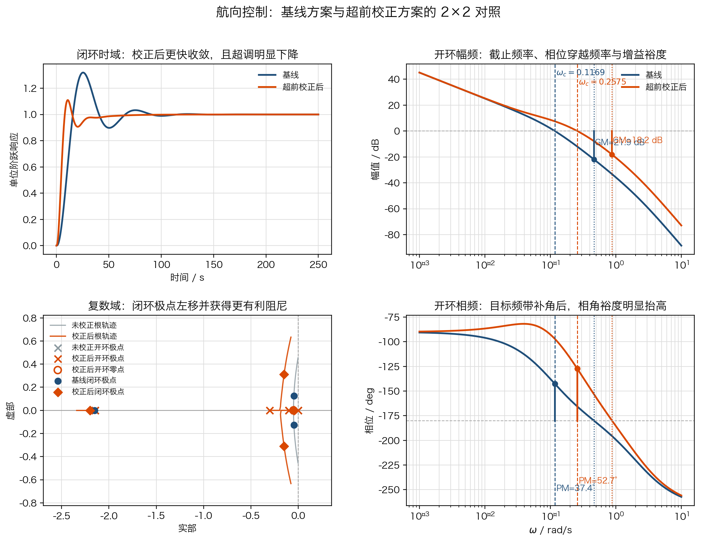{width=100%}

| 指标 | 基线方案 | 超前校正后 | 读回结论 |
| --- | --- | --- | --- |
| 相角裕度 | $37.43^\circ$ | $52.74^\circ$ | 中频余量明显增加 |
| 截止频率 | $0.1169$ rad/s | $0.2575$ rad/s | 响应速度明显提高 |
| 带宽 | $0.1904$ rad/s | $0.4330$ rad/s | 闭环跟踪能力增强 |
| 谐振峰值 $M_r$ | $1.5582$ | $1.1284$ | 峰化显著减轻 |
| 超调量 | $31.95\%$ | $10.98\%$ | 超调明显降低 |
| 调节时间 | $83.10$ s | $43.80$ s | 收敛时间约减半 |

这组结果说明：

1. 基线方案的主要问题不在低频，而在中频余量偏小，所以超调较大、调节较慢；
2. 超前校正主要改写中频，相角裕度从约 $37^\circ$ 提高到约 $53^\circ$；
3. 截止频率和带宽同时提高，说明系统确实更快；
4. 谐振峰值和超调显著下降，说明“更快”没有以牺牲稳定余量为代价。

这正是本课主线的完整落地：先看结构变化改写哪一段频带，再看临界点距离和裕度，最后把这些变化读回到时域后果。

#### 2.6.2 稳定平台：单纯降增益不够，超前校正更能兼顾速度与平稳

稳定平台案例和航向控制案例不同，它不是单纯的一阶或二阶对象，而是由“控制增益 + 执行机构 + 平台动力学 + 单位反馈”组成的伺服闭环。因此，在写开环传函之前，必须先把系统结构说清楚。图 12 给出本案例使用的控制框图。

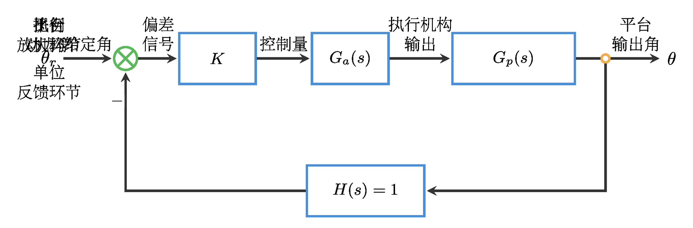{width=100%}

这张框图里，各模块的作用分别是：

1. **比例放大环节 $K$**：调节控制作用强弱，是本案例最先被尝试修改的参数；
2. **执行机构 $G_a(s)$**：把控制指令转成执行机构动作，决定响应速度与部分相位滞后；
3. **平台动力学 $G_p(s)$**：包含平台本体、负载和惯性耦合，是主要动力学来源；
4. **单位反馈环节 $H(s)=1$**：把实际俯仰角直接回送到比较点，形成单位负反馈闭环。

在这个框图下，名义开环模型写为

$$
L_p(s)=\frac{2960(1+s/15)}{s(1+s/3)\left[(1+1.7s)(1+0.005s)(1+0.001s)+100\right]}
$$

这里把 $L_p(s)$ 写成不含额外比例增益的名义对象，目的是把“增益变化”单独抽出来分析。于是，后面的三个方案就有了清楚的来源：

- $L_p(s)$ 表示平台在单位增益下的名义开环模型；
- $5L_p(s)$ 表示激进基线方案；
- $0.2L_p(s)$ 表示仅靠降增益得到的保守方案；
- $C_p(s)L_p(s)$ 表示引入超前校正后的方案。

为什么把 $5L_p(s)$ 叫作“激进基线方案”？因为它对应的是工程上最常见的一种直觉：系统嫌慢时，先把增益抬高，看看能不能直接把速度拉起来。所以，这里不是随便挑了一个 $K=5$，而是刻意把它作为“只靠直接加大增益”的代表方案。

先看这个激进基线方案：

$$
L_{p,\text{fast}}(s)=5L_p(s)
$$

对应的基线闭环为

$$
\Phi_{p,\text{fast}}(s)=\frac{L_{p,\text{fast}}(s)}{1+L_{p,\text{fast}}(s)}
$$

图 13 先像航向控制案例一样，给出这个激进基线的 2×2 基线图：左上看时域，左下看根轨迹与闭环极点，右上看开环幅频，右下看开环相频与裕度。

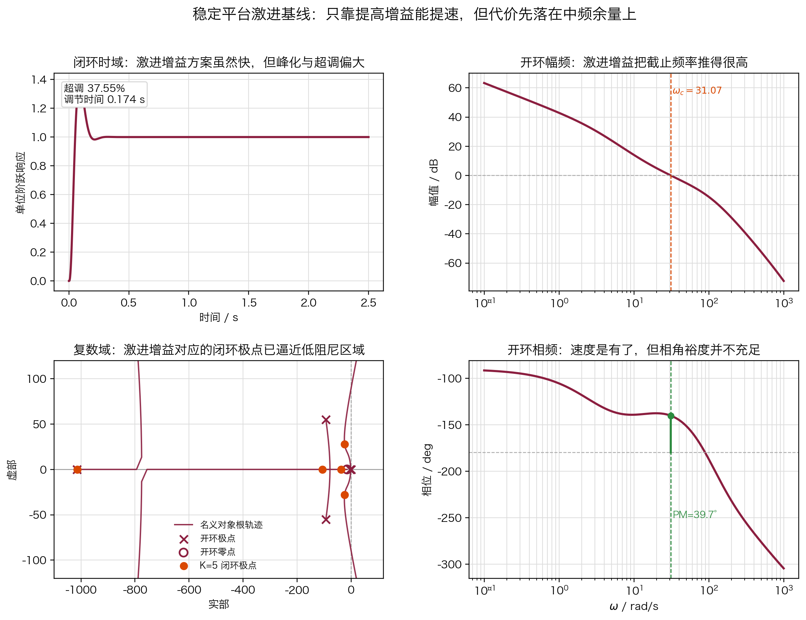{width=100%}

从这张图里，可以读出一个非常典型的矛盾：它确实很快，但峰化和超调也明显。也就是说，单纯把增益抬高，虽然可以把截止频率推到更高频段，却会同时把系统推向更紧的中频余量。

若只靠降增益得到

$$
L_{p,\text{slow}}(s)=0.2L_p(s)
$$

虽然余量更大，超调更小，但速度损失过于明显。这说明“只靠改比例增益”两头都不理想：要么快但冒进，要么稳但太慢。因此，设计目标才需要明确写成：

1. 把超调压到 $10\%$ 左右；
2. 保持 $0.2$ s 量级的快速收敛；
3. 不让截止频率掉到个位数 rad/s。

对应的频域目标可表述为：

1. 相角裕度提高到约 $60^\circ$；
2. 截止频率保持在 $20$ 到 $25$ rad/s；
3. 中频段既要补角，也要保持足够幅值。

在目标频率 $\omega^*=24$ rad/s 处，名义对象满足

$$
|L_p(j\omega^*)| \approx -11.1\ \text{dB}, \qquad \angle L_p(j\omega^*) \approx -138.1^\circ
$$

这说明若只靠增益把幅值抬到 $0$ dB，截止频率虽然能到目标附近，但相角裕度仍只有约 $42^\circ$，不足以把超调压到设计要求。因此需要在该频带同时补大约 $11$ dB 的幅值和约 $20^\circ$ 的相位提前，于是选取

$$
C_p(s)=\frac{1+s/3}{1+s/12}
$$

该网络的设计意图是：

1. 零点与极点都落在平台的中频工作带内；
2. 在 $\omega^*=24$ rad/s 附近既提供足够的幅值抬升，又提供所需的相位提前；
3. 相比“仅降增益”，它不会把速度整体压得过低。

于是进一步采用超前校正

$$
C_p(s)=\frac{1+s/3}{1+s/12}, \qquad L_{p,\text{new}}(s)=C_p(s)L_p(s)
$$

图 14 把激进基线、仅降增益方案和超前校正方案放到同一套 2×2 布局里比较。这次重点不是看“哪条曲线最顺眼”，而是看：

1. 左上：三个方案的速度与超调如何权衡；
2. 左下：激进基线和校正方案在根轨迹层面有什么根本不同；
3. 右上：仅降增益为什么会把截止频率压得过低；
4. 右下：超前校正为什么能在保持较高截止频率的同时，把相角裕度抬上来。

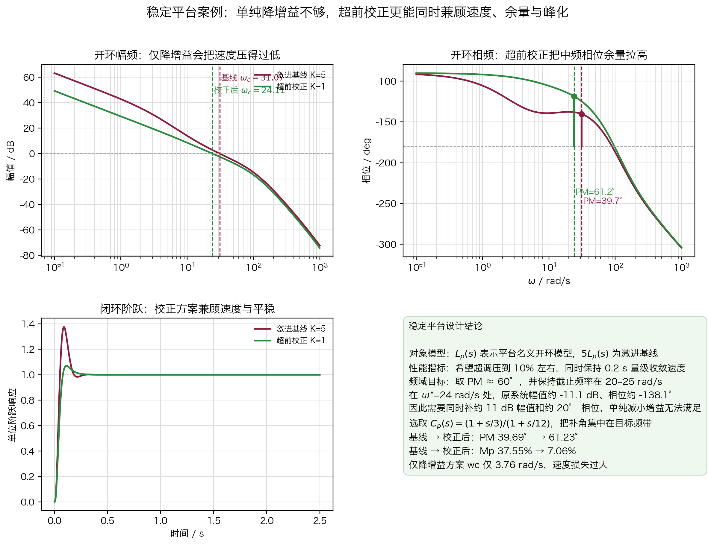{width=100%}

| 指标 | 激进基线 $K=5$ | 仅降增益 $K=0.2$ | 超前校正 $K=1$ | 读回结论 |
| --- | --- | --- | --- | --- |
| 相角裕度 | $39.69^\circ$ | $49.00^\circ$ | $61.23^\circ$ | 校正方案余量最大 |
| 截止频率 | $31.07$ rad/s | $3.764$ rad/s | $24.11$ rad/s | 仅降增益会大幅拖慢速度 |
| 带宽 | $58.93$ rad/s | $5.731$ rad/s | $42.54$ rad/s | 校正方案保留了较高速度 |
| 谐振峰值 $M_r$ | $1.5079$ | $1.2403$ | $1.0404$ | 校正方案峰化最轻 |
| 超调量 | $37.55\%$ | $20.03\%$ | $7.06\%$ | 校正方案超调最小 |
| 调节时间 | $0.174$ s | $1.914$ s | $0.196$ s | 校正方案几乎保持快速收敛 |

这个案例体现了更强的设计含义：

1. 只看“把增益降下来”当然能增加余量，但速度损失非常大；
2. 真正有效的方案，是把校正动作集中到中频：既增加相位提前，又不过度牺牲截止频率；
3. 超前校正后的平台方案把相角裕度提高到约 $61^\circ$，同时把超调降到约 $7\%$；
4. 调节时间仍保持在 $0.2$ s 量级，说明它比“仅降增益”更符合工程设计中“速度与平稳兼顾”的要求。

这已经不是“现状分析”，而是完整的“问题识别 → 校正策略 → 数值验证 → 工程判断”链条。

---

## 三、本节小结

1. 频域分析把结构变化、稳定边界和闭环后果放进了同一张判断地图。
2. 增益提升、零点引入、极点增加与积分补偿会在频域里留下不同指纹，因此收益和代价的落点也不同。
3. Nyquist 判据来自幅角原理，本质上是把闭环求根问题改写成临界点 $(-1,0)$ 的包围关系问题。
4. Bode 判稳把同一个稳定问题翻译成截止频率、相角裕度和增益裕度的读图语言。
5. 三频段理论帮助你把低频精度、中频动态和高频代价分开，再把带宽、谐振峰值和时域表现重新接起来。
6. 工程案例说明：真正好的校正不是单纯加大或减小增益，而是有针对性地改写最关键的频段。

下一课 3-9 会把这些语言真正用于同一对象的多版本比较，你会看到“哪条机制线更适合先承担哪类任务”。

