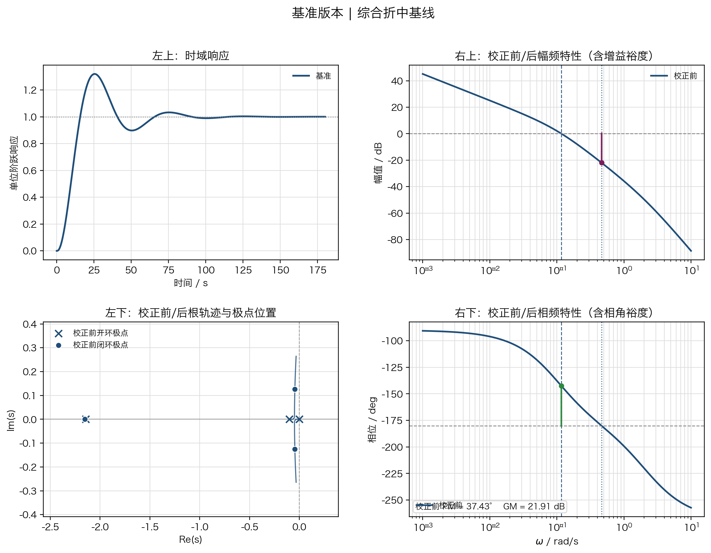
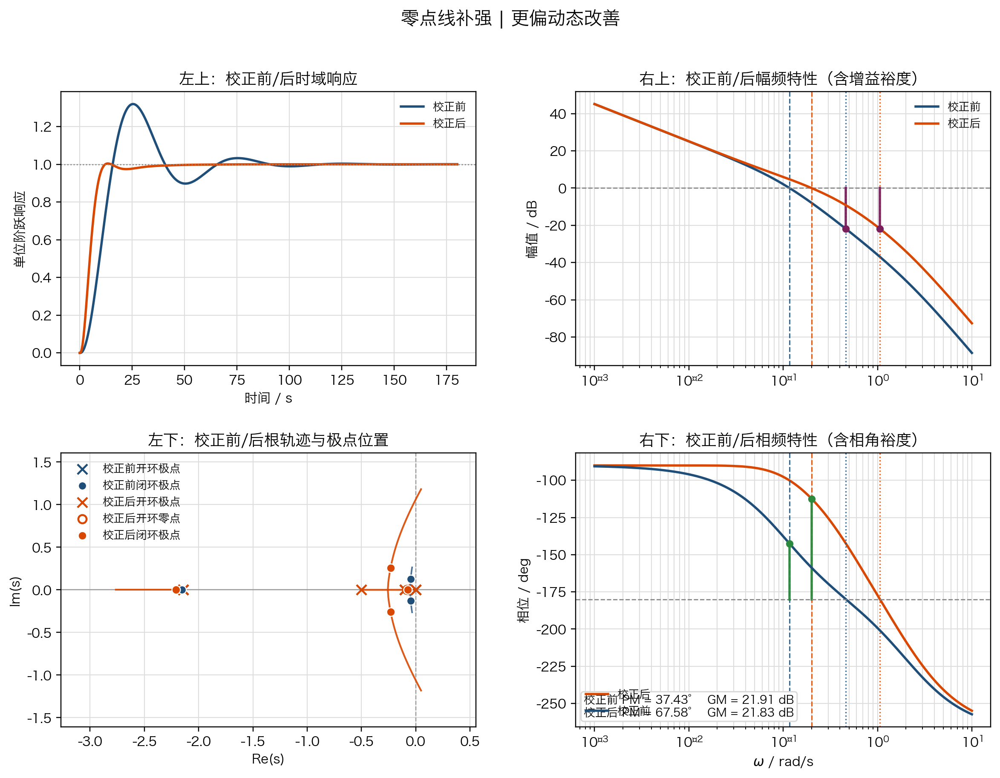
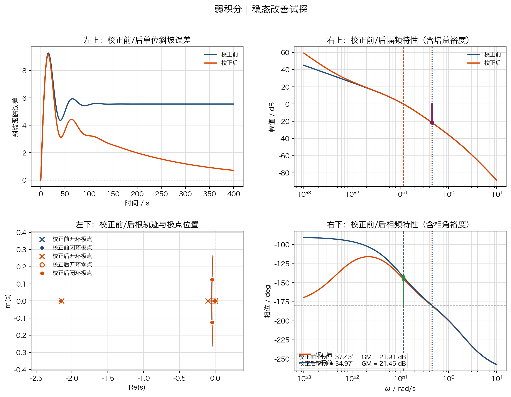
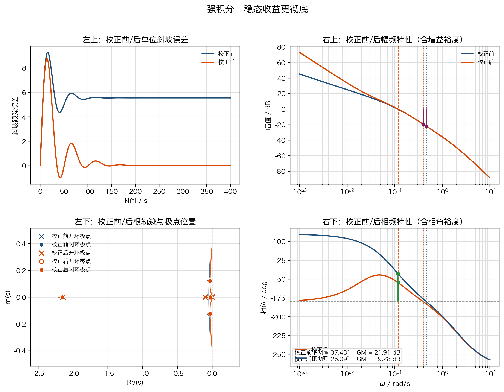
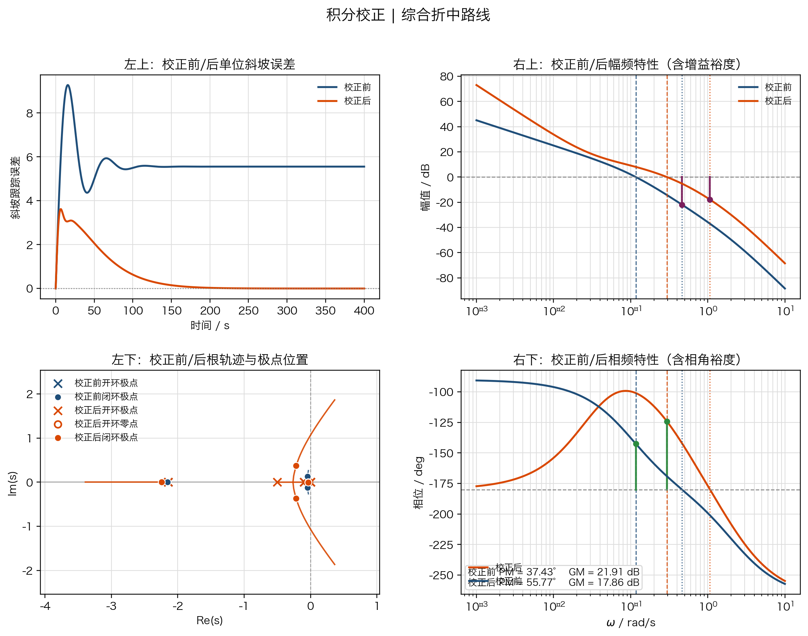
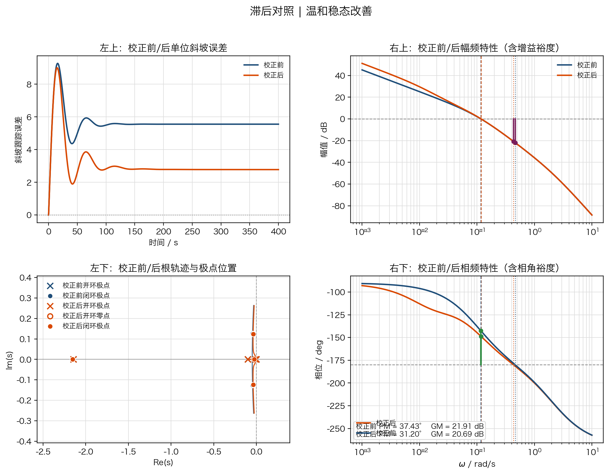
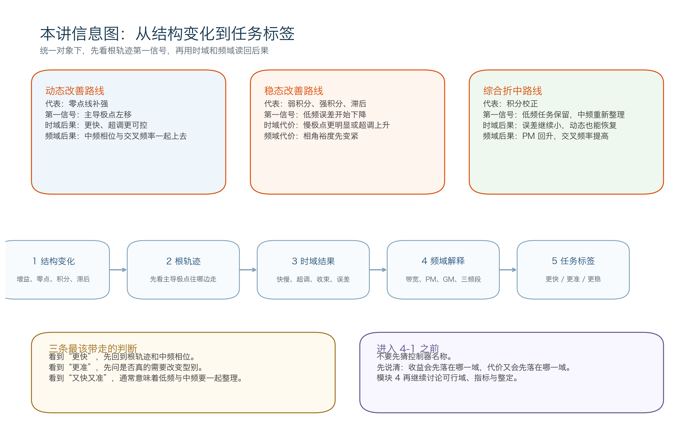

# 单元 3-9 | 稳定—动态—稳态综合映射实验

- **层次**：模块 3 实践主线 · 第九课
- **学时**：90分钟
- **知识类型**：跨域综合 `[X]` + 实践验证
- **前置**：掌握 `3-1` 到 `3-8` 中关于稳定边界、根轨迹、零点动态改善、积分与低频补偿、Bode/Nyquist 判别的基本语言
- **后续**：`4-1`（性能指标体系、工程约束与可行域表达）
- **讲义定位**：围绕同一个船舶航向控制对象，把“更快”“更准”“更稳”三类需求翻译成结构变化、极点迁移、时域响应和频域后果之间的对应关系。

---

## 一、为什么模块 3 结束前要整合三种语言

同一艘船会遇到两类很不同的要求：前方航道突然收窄时，我们希望航向修正更利索；长时间跟踪新航线时，我们又希望慢扰动下的偏差更小。这两个要求都合理，但优先调用的机制线并不相同。

因此，我们不先报控制器名称，而先回答三个更本质的问题：

1. 这次任务首先要改善动态、稳态，还是先守住综合折中？
2. 第一条关键信号会先出现在哪一域，是根轨迹、时域还是频域？
3. 如果某条路线先把收益做出来，最早又会把代价暴露在哪里？

到 `3-9` 为止，模块 3 已给出三种视角不同但彼此关联的语言：

1. **极点与根轨迹语言**：最先回答“闭环极点走向，离稳定边界多远”。
2. **时域响应语言**：直接回答“快慢、超调、收敛时间、稳态误差”。
3. **频域语言**：解释“为什么快慢、超调与误差同时发生，以及代价出现在低频、中频还是高频”。

如果分开学、分开记，容易出现三种误解：

1. 响应更快，就认为“更适合进入设计层”。
2. 低频增益上升，就认为“稳态一定更好且代价很小”。
3. 看到积分、滞后、超前等控制器名称，就背名称而不先问结构变化优先解决什么问题。

我们把分散在各课里的判断整理成一条连贯的判断链：

$$
\text{结构变化}
\rightarrow
\text{根轨迹第一信号}
\rightarrow
\text{时域结果}
\rightarrow
\text{频域解释}
\rightarrow
\text{任务标签}
$$

这里的“任务标签”只保留三类：

| 任务标签 | 自然说法 | 先回看的机制线 | 首先要警惕的代价 |
| --- | --- | --- | --- |
| 更偏动态改善 | 希望更快、更利索 | 根轨迹线、零点线 | 超调放大、裕度变紧、高频放大 |
| 更偏稳态改善 | 希望更准、慢扰动更小 | 型别/积分线、滞后线 | 中频相位余量下降、过渡变长 |
| 更偏综合折中 | 希望别太慢，也别太冒进 | 频域回收全部机制线 | 只顾一头，另一头会失衡 |

后面每个任务都采用统一的 `2x2` 观察框架：

- 左上：时域响应
- 左下：根轨迹，标出开环极点和当前参数下的闭环极点
- 右上：幅频曲线
- 右下：相频曲线，标出增益裕度与相角裕度

后面的比较都按这套版式展开。先看哪一域，再用哪一域复核，也随之固定下来。

---

## 二、统一对象与统一读图口径

本节固定采用同一个船舶航向控制对象：

$$
P(s)=\frac{0.01715}{s(s+0.1)(s+2.14375)}
$$

基准控制器取为常数增益

$$
C_0(s)=2.25
$$

于是基准开环传递函数为

$$
L_0(s)=C_0(s)P(s)=\frac{0.0385875}{s(s+0.1)(s+2.14375)}
$$

这个对象适合作为模块 3 的出口对象，因为它同时具备三种特征：

1. 开环中含有原点极点，稳态误差与型别问题天然存在。
2. 极点在快慢时间尺度上分布明显，根轨迹和阶跃响应都比较典型。
3. 增益、零点、积分和低频补偿一旦变化，三种语言同步变化，无需为每一域另换案例。

读图时需注意：对于基准版和零点线补强版，左上角使用**单位阶跃响应**，因为这两类方案主要比较动态。对于积分家族，左上角改为**单位斜坡跟踪响应或误差响应**，因为基准对象本来就是 I 型系统，面对单位阶跃时稳态误差已为零；如果只盯着阶跃终值，就看不出积分方案到底改善了什么。

---

## 本课实践任务与提交物

这一讲是模块 3 的出口实践。我们只比较已经学过的几条机制线，不新增控制机制，也不提前写完整设计结论。需要完成的三组必做内容是：

1. **基准版本**：先判断当前对象更像哪一类基线；
2. **积分路线**：比较低频收益、慢极点代价与中频整理是否到位；
3. **自选补强版本**：当前统一采用**零点线补强**，不再分叉到其他版本。

此外，**滞后对照**只作为演示后的复判材料，用来说明稳态改善并不只有积分一条路。

本课提交两份产出：

| 提交物 | 必须写出的内容 | 作用 |
| --- | --- | --- |
| 跨域机制映射对照表 | 结构变化、根轨迹第一信号、时域首先看到的结果、频域首先看到的收益/代价、任务标签、主要风险 | 把模块 3 的分散语言收束成可直接带入 `4-1` 的机制地图 |
| 联动解释短报告 | 先解决什么任务、依据了哪几个证据、为什么这个版本还不是设计终点 | 防止只会背控制器名称，不会说明理由与边界 |

分析每个版本时，我们按同一顺序整理：

1. 先给版本贴**任务标签**，不先报控制器名称；
2. 再写**根轨迹第一信号**，说明你最先警惕什么边界；
3. 然后用**时域结果**和**频域证据**分别复核收益与代价；
4. 最后只给出**模块 4 入口判断**，不越级写成“唯一最优方案”。

---

## 三、任务一：基准版本给出哪一类基线

### 3.1 控制器与关键指标

基准版本采用

$$
C_0(s)=2.25
$$

主要数值结果如下：

| 指标 | 数值 |
| --- | --- |
| 闭环主导极点 | $-0.0456 \pm j0.1259$ |
| 另一个闭环极点 | $-2.1525$ |
| 阶跃超调量 | $31.95\%$ |
| 调节时间 | $83.04\ \mathrm{s}$ |
| 上升时间 | $10.27\ \mathrm{s}$ |
| 峰值时间 | $25.41\ \mathrm{s}$ |
| 相角裕度 | $37.43^\circ$ |
| 增益裕度 | $21.91\ \mathrm{dB}$ |
| 增益交叉频率 | $0.1169\ \mathrm{rad/s}$ |
| 单位斜坡稳态误差 | 约 $5.56$ |

### 3.2 四个象限怎么读

#### 左上角：时域响应

阶跃曲线先冲高，再缓慢衰减到稳态。超调量接近三分之一，说明系统已有动态积极性；但调节时间超过 `80 s`，说明这种积极性并未换来利索的收束。它更像“会动，但收得不够干净”的基线对象。

#### 左下角：根轨迹

开环极点位于

$$
s=0,\quad s=-0.1,\quad s=-2.14375
$$

当前增益下的闭环极点落在

$$
s=-2.1525,\quad s=-0.0456 \pm j0.1259
$$

共轭极点离虚轴较近，从根轨迹上就能预判：响应会振荡，阻尼不高，继续追求速度时最先紧张的是稳定边界和中频相位余量。

#### 右上角：幅频

幅频交叉点在 `0.1169 rad/s` 左右，说明系统的速度等级不高，闭环带宽不宽。低频增益能保证单位阶跃无静差，但面对单位斜坡时，低频能力仍不够强。

#### 右下角：相频

相角裕度约 `37.43°`，增益裕度约 `21.91 dB`。这组数字意味着系统稳定，但远未达到“宽裕”的程度。若只靠提高增益追求更快，最先被压缩的就是相角裕度。

### 3.3 基准结论

基准版本对应**综合折中基线**。它具备可接受的稳定性，但也暴露出两条限制：

1. 若优先追求动态改善，第一风险出现在相位余量与超调。
2. 若优先追求稳态改善，仅靠当前低频增益不够，必须重新分配低频资源。

它不是终点，也不能简单归类为“太慢”或“太差”。它的作用，是给后面的几条改善路线提供统一锚点。

---

## 四、任务二：零点线补强如何优先改善动态

### 4.1 控制器与关键指标

零点线补强选用一组代表性的超前校正：

$$
C_z(s)=2.25\frac{12.5s+1}{2s+1}
$$

这组控制器抓住了两点：基准版的相角裕度只有 `37.43°`，继续追求更快响应时，中频相位必须先补出来；新增零点放在 `-0.08`，又能更直接地把根轨迹向左拉开。我们保留原增益 `2.25` 作为比较基线，让零点补偿本身的作用更清楚；再把附加极点放在 `-0.5`，限制高频放大，把中频相角裕度拉回更宽的工作区间。

图中蓝色曲线表示校正前，橙色曲线表示校正后；根轨迹、时域曲线和 Bode 图都按同一口径并排比较。

| 指标 | 数值 |
| --- | --- |
| 开环新增零点 | $-0.08$ |
| 开环新增极点 | $-0.5$ |
| 主要左移的复极点对 | $-0.2314 \pm j0.2581$ |
| 另两个闭环极点 | $-2.2083,\ -0.0727$ |
| 阶跃超调量 | $0.43\%$ |
| 调节时间 | $26.95\ \mathrm{s}$ |
| 上升时间 | $6.82\ \mathrm{s}$ |
| 相角裕度 | $67.58^\circ$ |
| 增益裕度 | $21.83\ \mathrm{dB}$ |
| 增益交叉频率 | $0.2003\ \mathrm{rad/s}$ |
| 单位斜坡稳态误差 | 仍约 $5.56$ |

### 4.2 四个象限怎么读

#### 左上角：时域响应

阶跃曲线的超调几乎被压平，调节时间缩短到原来的三分之一左右。上升更快，收束也更干净，因此“更快”可以直接从曲线读出来。

#### 左下角：根轨迹

新增零点把主要振荡极点对向左拉开，闭环极点从基准版的 `-0.0456 ± j0.1259` 移到 `-0.2314 ± j0.2581`。同时系统还保留一个更慢的实极点 `-0.0727`，因此这里更准确的说法是：主振荡模态左移、阻尼提高，动态品质优先改善。

#### 右上角：幅频

增益交叉频率抬升到 `0.2003 rad/s`，说明系统允许更高的动态工作频率。蓝色和橙色两条幅频曲线给出校正前后对比，增益裕度线放在幅频图中，便于直接比较两种方案在幅值穿越附近离 `0 dB` 的距离关系。

#### 右下角：相频

相角裕度提升到 `67.58°`。这说明这条补强路线通过整理中频附近的相位和幅值获得更好的动态表现。注意它没有改变系统型别，所以稳态精度任务仍保留在原水平上。

### 4.3 零点线补强的任务标签

零点线补强对应**更偏动态改善**。它优先解决“快”和“收得漂亮”，不直接解决“长期误差小不小”。因此，这条路线适合回答“更快一些该怎么办”，不适合独自承担“更准一些该怎么办”。

---

## 五、任务三：积分家族如何把低频收益和中频代价同时暴露出来

### 5.1 为什么这一组要改看斜坡跟踪

基准对象本身已经是一型系统，面对单位阶跃时，基准版、弱积分版、强积分版、积分校正版最终都能回到零静差。真正的区别体现在两个地方：

1. **面对单位斜坡时，误差能不能继续压小甚至压到零**；
2. **为了换来这种低频收益，慢极点、超调和相位余量付出多大代价**。

因此，积分家族统一采用如下读图口径：

- 左上角看单位斜坡跟踪响应或误差响应；
- 左下角看根轨迹和闭环极点；
- 右上角看幅频中的低频增益与交叉频率；
- 右下角看相频中的相角裕度与增益裕度。

为便于横向比较，先把基准对象作为锚点列在前面：

| 方案 | 单位斜坡稳态误差 | 相角裕度 | 阶跃超调量 | 调节时间 |
| --- | --- | --- | --- | --- |
| 基准 | $5.56$ | $37.43^\circ$ | $31.95\%$ | $83.04\ \mathrm{s}$ |
| 弱积分 | 理论上趋于 $0$，`400 s` 时约 `0.71` | $34.97^\circ$ | $37.22\%$ | $90.62\ \mathrm{s}$ |
| 强积分 | 趋于 $0$，`200 s` 时已接近 `0` | $25.09^\circ$ | $56.69\%$ | $134.73\ \mathrm{s}$ |
| 积分校正 | 趋于 $0$，`200 s` 时约 `0.03` | $55.77^\circ$ | $11.93\%$ | $92.73\ \mathrm{s}$ |
| 滞后对照 | 约降为 $2.78$ | $31.20^\circ$ | $43.25\%$ | $88.84\ \mathrm{s}$ |

### 5.2 弱积分：先看到收益，再看到慢极点

弱积分控制器取为

$$
C_{i1}(s)=2.25\left(1+\frac{1}{200s}\right)
$$

这组 PI 先取较大的积分时间常数 `T_i=200`，把积分作用控制在“刚开始看见趋势”的水平。这里不追求误差最快归零，而是先看清一件事：系统多背一枚积分极点后，低频收益和慢极点代价会怎样同时出现。于是我们保留比例增益 `2.25` 不变，只引入较弱积分作用，并让积分零点停在 `-0.005` 附近，观察低频误差是否开始下降，再用根轨迹、误差曲线和 Bode 图一起核对收益与代价。

图中蓝色曲线表示校正前，橙色曲线表示校正后。

它的开环在原点多了一个积分极点，同时在 `s=-0.005` 附近引入零点。闭环新增了一个很靠近虚轴的慢极点 `-0.0051`。这带来两件同时发生的事情：

1. 斜坡跟踪误差开始持续下降，`400 s` 时已从基准版的 `5.56` 压到 `0.71`；
2. 过渡过程被这枚慢极点拖长，所以超调从 `31.95%` 增加到 `37.22%`，调节时间也拉长到 `90.62 s`。

从频域看，弱积分并没有显著提高交叉频率，增益交叉点仍在 `0.1169 rad/s` 附近，但相角裕度已经从 `37.43°` 降到 `34.97°`。这说明低频收益已经开始出现，而代价先在相位余量上出现。

**判断句**：弱积分优先回答“误差还可以继续压”，代价则是“系统多背了一枚慢极点，收束不如原来利索”。

### 5.3 强积分：低频收益更彻底，动态代价也被彻底放大

强积分控制器取为

$$
C_{i2}(s)=2.25\left(1+\frac{1}{40s}\right)
$$

强积分沿用同一比例增益，但把积分时间常数压缩到 `T_i=40`。弱积分已经说明，增加积分会让误差继续下降；这里进一步把积分作用做强，就是为了观察低频收益能否更快兑现，以及代价会不会明显放大。比较时，我们只加强积分，不额外加入中频整理，再对照根轨迹、时域和 Bode 图，判断相位余量和超调被压缩到了什么程度。

图中蓝色曲线表示校正前，橙色曲线表示校正后。

这时积分零点移到 `s=-0.025`，附加积分的作用大得多。单位斜坡误差在 `200 s` 左右已接近于零，说明它在低频确实更有效；但根轨迹同时告诉我们，主要振荡极点仍贴近虚轴，且多出来的慢极点已经移动到 `-0.0281` 附近，系统把更多动态负担放到了低阻尼模式上。

这种变化在时域和频域上都能直接看见：

1. 阶跃超调量升到 `56.69%`；
2. 调节时间拉长到 `134.73 s`；
3. 相角裕度跌到 `25.09°`；
4. 增益裕度降到 `19.28 dB`。

因此，强积分虽然把“更准”这件事做得更彻底，但也把“更冒进、更难收”这件事同时放大了。

**判断句**：强积分适合说明“精度不是白送的”；低频收益越强，中频和动态的代价就越需要单独补回来。

### 5.4 积分校正：保留积分任务，同时把动态和裕度拉回可用区

积分校正采用积分加零点补偿的组合：

$$
C_{ic}(s)=2.25\left(1+\frac{1}{40s}\right)\frac{20s+1}{2s+1}
$$

积分校正是在强积分基础上继续做的。强积分已经把单位斜坡误差几乎压到零，但 `25.09°` 的相角裕度太紧，因此必须补一个中频超前环节，把动态和裕度拉回可用区间。这里把超前零点放在 `-0.05`、极点放在 `-0.5`，就是让相位提升集中作用在当前交叉频率附近。比较时，我们保留强积分的低频任务，不回退型别改善，再围绕交叉频率附近恢复中频相位，最后看误差收益是否保住、超调和裕度是否一起被拉回。

图中蓝色曲线表示校正前，橙色曲线表示校正后。

这组方案保留了积分带来的型别提升，又在中频重新整理了相位。结果非常典型：

1. 单位斜坡误差在 `200 s` 时已降到 `0.03` 左右，低频任务仍然完成；
2. 阶跃超调量从强积分的 `56.69%` 降回 `11.93%`；
3. 上升时间缩短到 `4.19 s`；
4. 相角裕度恢复到 `55.77°`，增益交叉频率抬升到 `0.2959 rad/s`。

闭环极点结构也出现了明显分层：一对复极点来到 `-0.2167 \pm j0.3701`，而另一对较慢极点收在 `-0.0334 \pm j0.0072`。这说明校正动作已经不再只是“继续堆低频”，而是在低频目标不丢的前提下，重新分配中频相位和动态阻尼；同时也提醒我们，决定长时间尾部的并不只是一对快速左移的复极点。

**判断句**：积分校正对应的任务标签是“更偏综合折中”。它告诉我们，积分路线可以继续保留，同时还要配合中频整理；否则系统会越来越准，却也越来越难用。

### 5.5 滞后对照：稳态改善还有另一条路径

滞后对照方案取为

$$
C_{\mathrm{lag}}(s)=4.5\frac{40s+1}{80s+1}
$$

滞后方案希望在不改变型别的前提下把低频增益提高一倍左右。它把零点放在 `-0.025`、极点放在 `-0.0125`，因此低频会被抬高，而交叉频率附近的形状变化相对温和。这正适合和积分路线对照：同样想改善稳态，它为什么只能把误差压小，而不能像积分那样把单位斜坡误差压到零。比较时，我们保持对象和比例任务不变，只加入一组温和的滞后环节，再观察误差变小以后，型别是否改变，代价又会怎样反映到超调和相位余量上。

图中蓝色曲线表示校正前，橙色曲线表示校正后。

这组方案没有增加额外积分极点，因此系统型别没有变化，单位斜坡稳态误差不会降到零，但会从基准版的 `5.56` 降到 `2.78` 左右。换句话说，滞后把低频能力提高了，却没有把“误差阶次”改掉。

它带来的代价也和积分不同：

1. 相角裕度下降到 `31.20°`，但没有像强积分那样跌到很紧的区间；
2. 超调量上升到 `43.25%`，说明低频补偿的代价仍会反映到动态上；
3. 调节时间 `88.84 s`，只比基准版略长，没有像强积分那样明显拖慢收束。

**判断句**：滞后更像“低频放大但不过度改型别”的稳态改善路线。它能把误差压小，却不会像积分那样直接把单位斜坡稳态误差压到零。

### 5.6 积分家族的统一结论

把四种方案并排后，可得一条清楚的规律：

1. **弱积分**：先看到误差开始下降，同时看到附加慢极点让系统更拖。
2. **强积分**：把稳态任务做得最彻底，也把超调和相位代价放得最明显。
3. **积分校正**：说明“积分可以继续保留，同时必须配合中频整理”。
4. **滞后对照**：说明“稳态改善并不只有积分一条路，但滞后和积分解决的程度不同、代价分布也不同”。

因此，面对“我想更准一些”的任务，我们先回答：

1. 我究竟要把误差降到多低；
2. 我是否必须改变型别；
3. 我是否愿意为此付出更紧的相位余量和更长的过渡过程；
4. 如果不愿意，是否需要额外的中频校正。

---

## 六、综合映射：同一对象上的三条典型路线怎样分工

把基准版、零点线补强和积分家族汇总后，可得模块 3 最重要的一张出口表。

| 路线 | 结构变化 | 根轨迹第一信号 | 时域首先看到的结果 | 频域首先看到的代价/收益 | 更适合承担的任务 |
| --- | --- | --- | --- | --- | --- |
| 基准 | 仅常数增益 | 主导极点靠近虚轴 | 有超调，收束较慢 | 裕度不差，但不宽 | 作为综合折中基线 |
| 零点线补强 | 新增零点并配套高频极点 | 主要振荡极点对左移、阻尼提高 | 更快、更稳、超调显著下降 | 交叉频率提高，相角裕度上升 | 优先改善动态 |
| 弱积分 | 增加一枚积分极点 | 多出贴近虚轴的慢极点 | 误差开始下降，但收束更拖 | 相角裕度小幅下降 | 先试探稳态改善 |
| 强积分 | 更强的积分作用 | 主要振荡极点仍贴虚轴，慢极点更明显 | 误差趋零更快，但超调大增 | 相角裕度明显吃紧 | 说明精度代价 |
| 积分校正 | 积分保留，外加中频整理 | 快模态左移、慢模态单独保留 | 误差近零且动态恢复 | 交叉频率上升，裕度回升 | 综合折中路线 |
| 滞后 | 低频放大而不改型别 | 根轨迹变化有限 | 误差减小，但不能清零 | 裕度下降幅度中等 | 温和稳态改善 |

从这张表中，模块 3 的出口结论可压缩为四句话：

1. 想要更快，首先看零点线或其他中频整理动作，而不是先盯低频放大。
2. 想要更准，必须先分清是“压小误差”还是“把某类误差压到零”，两者对型别的要求不同。
3. 只靠积分堆低频，收益先出现在误差曲线里，代价先出现在相位余量和超调里。
4. 真正能带入模块 4 的判断是：这条路线优先解决什么，同时会先牺牲什么。

---

## 课堂实践提交单

下面这张表可以直接作为课堂提交底稿。填写时，先写“最先暴露收益的域”，再写“最先暴露代价的域”，不要把“效果更好”写成空泛结论。

| 版本 | 任务标签 | 结构变化 | 根轨迹第一信号 | 时域首先看到的收益 | 频域首先暴露的代价/收益 | 主要风险 | 一句话判断 |
| --- | --- | --- | --- | --- | --- | --- | --- |
| 基准版本 |  | 仅常数增益 |  |  |  |  |  |
| 零点线补强 |  | 新增零点并配套高频极点 |  |  |  |  |  |
| 弱积分 |  | 增加一枚较弱积分极点 |  |  |  |  |  |
| 强积分 |  | 增强积分作用 |  |  |  |  |  |
| 积分校正 |  | 积分保留并加入中频整理 |  |  |  |  |  |
| 滞后对照（教师演示后复判） |  | 低频放大但不改型别 |  |  |  |  |  |

联动解释短报告建议控制在 `150-200` 字，可按下列模板完成：

> 我把 ________ 版本判为“________”路线，因为从根轨迹上最先看到的信号是 ________，这意味着它优先解决的是 ________。
> 时域证据表明 ________，频域证据进一步说明 ________，因此它虽然完成了 ________，但也把 ________ 提前暴露出来。
> 所以它还不是模块 4 的设计终点；若继续推进，我应先回看 ________ 这条机制线，而不是直接猜参数。

---

## 七、通向 4-1 的入口判断

进入 `4-1` 之前，应先把口头需求翻译成下面三种判断。

| 口头需求 | 第一反应应该看什么 | 不应直接做的事 |
| --- | --- | --- |
| 我希望它更快 | 先看根轨迹与中频相位是否允许主导极点左移 | 直接加积分或把增益调大 |
| 我希望它更准 | 先分清是否需要改变型别，以及代价能否接受 | 看到误差就直接堆最强积分 |
| 我希望既快又准 | 先把低频任务和中频整理一起看 | 认为任何单一路线都能独立完成全部任务 |

到这里，我们已经能够围绕同一对象说清结构变化、根轨迹、时域结果和频域后果之间的联系。下一步再在这个基础上进入模块 4 的性能指标体系、可行域和整定策略。

---

## 本讲小结

1. `3-9` 的核心是把极点语言、时域语言和频域语言收束成同一张判断图。
2. 基准版本提供统一锚点，告诉我们系统当前更像“会动，但还不够从容”的折中基线。
3. 零点线补强主要回答动态改善问题，它优先改变的是中频相位、根轨迹和闭环阻尼。
4. 积分家族主要回答稳态改善问题，它优先改变的是低频误差，代价则先落在慢极点、超调和相位余量上。
5. 积分校正和滞后对照说明，稳态改善可以走不同路径，但“改善到什么程度”和“代价落在哪里”并不相同。
6. 模块 4 真正需要调用的是结构判断能力，而不是控制器名称记忆。

