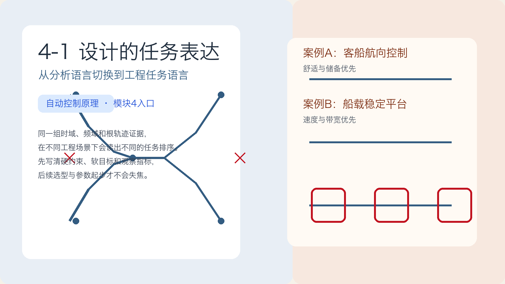
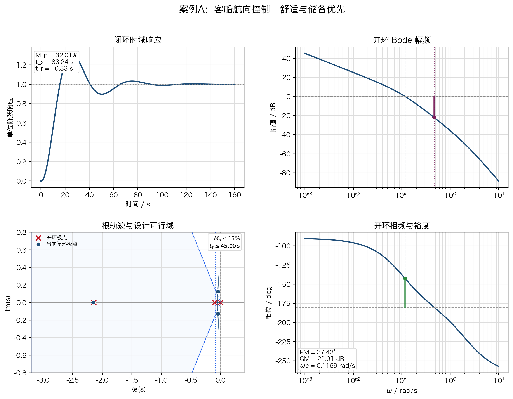
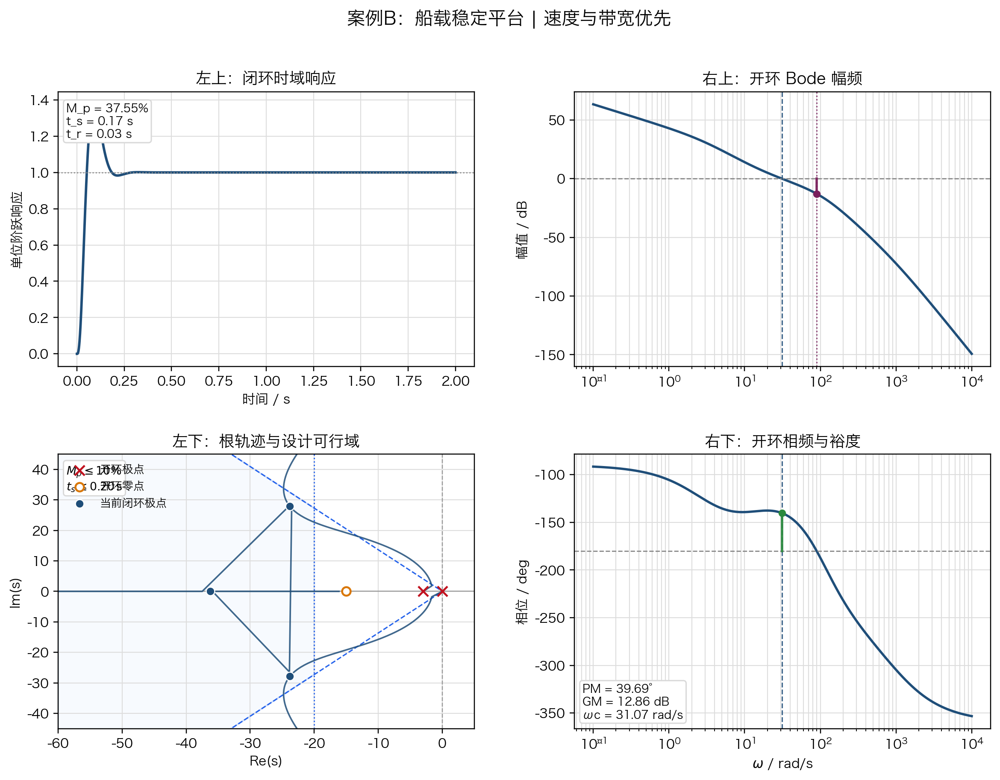

# 单元 4-1 | 设计起点：性能指标体系、工程约束与可行域表达

- **层次**：模块4 理论主线 · 第一课
- **学时**：90分钟
- **知识类型**：[D] 设计型
- **前置**：已掌握典型时域性能指标、频域指标、稳态误差与低频补偿的基本含义，能够从相角裕度、带宽、超调量和调节时间回读系统的动态特征
- **后续**：4-2（控制器选型原理：不同控制结构为何适合不同任务）、4-3（基于结构机理的初始方案形成：从选型判断到关键参数方向）、4-4（初始方案验证与失败诊断）
- **讲义定位**：这份讲义带我们把同一套跨域证据整理成设计任务语言，先写清任务排序、约束边界和证据来源，再进入后续的结构选择与方案起步。

---

## 一、回到地图：同一套跨域证据，为什么会写出两张不同任务书

进入这一讲之前，我们已经在前面的学习里见过很多“分析证据”：

- 阶跃响应告诉你系统快不快、冲得厉不厉害、收得稳不稳；
- 根轨迹告诉你极点将往哪里走，哪些方向可能更危险；
- Bode 图和裕度告诉你系统工作频带大致落在哪里，离风险边界还有多远；
- 稳态误差与低频补偿告诉你系统最后能否长期把偏差压住。

到了设计阶段，难点不再是“我看到了什么”，而是“我先保什么，再争什么”。

这一讲先把一个关键判断立住：

> **面对同一套跨域证据，不同工程场景会写出不同任务书。**

这就是从分析走向设计的分界线。分析课回答“系统当前怎样”，设计课回答“系统必须达到什么水平、哪些底线不能破、哪些性能可以在底线之上继续争取”。

我们先并排回看两个已经分析过的对象：

表1. 两个场景的入口差异

| 场景 | 已知证据 | 先要追问的问题 |
| --- | --- | --- |
| 客船航向控制 | 某组参数下闭环稳定，超调量约为 $32.01\%$，调节时间约为 $83.24\,\text{s}$，相角裕度约为 $37.43^\circ$，截止频率约为 $0.1169\,\text{rad/s}$ | 乘客和船体能否接受这样的过程？持续扰动下是否仍留有足够储备？执行机构负担会不会过重？ |
| 船载稳定平台 | 当前工作点响应很快，超调量约为 $37.55\%$，调节时间约为 $0.17\,\text{s}$，相角裕度约为 $39.69^\circ$，截止频率约为 $31.07\,\text{rad/s}$ | 这个场景是不是更优先看重速度与带宽？如果继续追求速度，会不会迅速逼近储备边界？ |

接下来我们先不讨论应该选 `PI`、`PD`、超前校正还是复合结构，而是先把下面四件事写清楚：

1. 当前场景最不能接受的后果是什么；
2. 哪些指标必须直接写成底线；
3. 哪些指标只是希望更优，而不是绝对不能退让；
4. 当前判断分别来自哪张图、哪个边界、哪条已有证据。

### [AI融入点] 先写自己的排序，再让 AI 做对照

先不要问 AI。请你先独立回答：

1. 客船航向控制里，你最想先保住哪一项指标，为什么；
2. 稳定平台里，你最愿意把哪一项指标提前到更高优先级，为什么。

写完之后，再把你的排序发给 AI，请它只输出两列：

- 它认为每个场景的硬约束是什么；
- 它认为每个场景的软目标是什么。

最后你要自己复核：AI 的划分到底是从证据读出来的，还是只是把“听起来重要”的词重新排了一遍。

---

## 二、先做“同图异读”，再回收最小指标语言

这一讲的起点不是重新分类指标概念，而是把 `3-8 / 3-9` 已经出现过的同一套跨域证据图重新摆到眼前。我们先看图，再解释为什么这些图会导向不同任务排序。

### 2.1 主场景 A：客船航向控制为什么先保平顺与储备

#### 2.1.1 控制对象框图

{width=70%}

图中 $R(s)$ 表示给定航向，$C(s)$ 表示实际航向，$N(s)$ 表示风浪等扰动因素。我们把这个对象作为主场景，因为它能把“系统稳定”和“任务可接受”明确分开。

当前工作点采用开环模型

$$
P_h(s)=\frac{0.01715}{s(s+0.1)(s+2.14375)}
$$

当前工作点取比例增益 $K_h=2.25$，于是开环传递函数为

$$
L_h(s)=K_hP_h(s)=\frac{0.0385875}{s(s+0.1)(s+2.14375)}
$$

#### 2.1.2 跨域 `2 \times 2` 图

{width=100%}

#### 2.1.3 四格联读：这组证据先把什么暴露出来

**闭环时域响应**

当前工作点下，系统超调量约为 $32.01\%$，调节时间约为 $83.24\,\text{s}$，上升时间约为 $10.33\,\text{s}$。这说明系统并不是“不会跟踪”，而是“跟踪得不够让人接受”：

- 超调偏大，意味着修正过程显得冒进；
- 调节时间偏长，意味着过程拖得太久；
- 对客船场景来说，这两点都会直接影响平顺性和舒适感。

**根轨迹与设计可行域**

本案例在根轨迹图中叠加的入口约束为

$$
M_p \le 15\%, \qquad t_s \le 45\,\text{s}
$$

蓝色阴影区表示同时满足“超调边界 + 调节时间边界”的复平面区域。当前闭环极点落在阴影区之外，说明现有工作点虽然稳定，但还没有进入当前任务允许的区域。

这一格最重要，因为它第一次把两个判断拆开：

1. **系统稳定**：极点仍在左半平面；
2. **任务可接受**：极点还必须进入当前任务书允许的区域。

**开环 Bode 幅频**

幅频图显示当前截止频率约为 $0.1169\,\text{rad/s}$。这意味着系统的有效工作频带并不高，快速性改善空间有限。对客船场景来说，这不是一句“带宽偏低”的分析结论，而是一个设计提醒：

- 如果想提速，就会推动工作频带右移；
- 工作频带一旦右移，就必须同时回头检查储备是否被压紧。

**开环相频与裕度**

当前相角裕度约为 $37.43^\circ$，增益裕度约为 $21.91\,\text{dB}$。这说明系统并非没有储备，但也谈不上宽松。对客船场景，更自然的任务语言不是“继续一味提速”，而是：

1. 先把动态过程压进乘客和船体都能接受的区域；
2. 再谈如何缩短调节时间；
3. 同时要让相位余量比当前更从容，而不是更紧。

#### 2.1.4 把主场景的任务排序写出来

只根据上面这组证据，客船航向控制最合理的入口排序应当是：

表2. 主场景 A 的入口排序

| 层次 | 当前判断 |
| --- | --- |
| 最先守住的底线 | 闭环稳定、超调不可继续维持在当前水平、设计点应进入当前可行域、相位储备不能再压紧 |
| 之后继续争取 | 在守住舒适与储备边界后，进一步缩短调节时间、降低累计偏差 |
| 先持续观察，暂不写成结论 | 截止频率、带宽、摆舵频繁程度、积分误差指标 |

可以把它压成一句最短结论：

> 对客船航向控制，**先让过程进入可接受区域，再谈提速**。

### 2.2 对照案例 B：为什么稳定平台会把速度与带宽排得更前

#### 2.2.1 控制对象框图

{width=70%}

这个对象不是主场景，但必须作为对照案例保留下来，因为它最能说明：

> **同一套跨域证据，在另一种任务背景下会把优先级重新洗牌。**

当前工作点采用对象模型

$$
P_p(s)=\frac{2960\left(\frac{s}{15}+1\right)}{s\left(\frac{s}{3}+1\right)\left[(1.7s+1)(0.005s+1)(0.001s+1)+100\right]}
$$

当前工作点取增益 $K_p=5$，因此开环传递函数为

$$
L_p(s)=K_pP_p(s)
$$

#### 2.2.2 综合图与排序变化

{width=100%}

这个场景的四格联读不用像主场景那样铺得很开，我们只保留最能说明“排序重排”的部分：

- 当前超调量约为 $37.55\%$，调节时间约为 $0.17\,\text{s}$，上升时间约为 $0.03\,\text{s}$；
- 当前截止频率约为 $31.07\,\text{rad/s}$，明显高于客船对象；
- 当前相角裕度约为 $39.69^\circ$，增益裕度约为 $12.86\,\text{dB}$；
- 图中的阴影可行域要求主导极点进一步左移，同时保持更高阻尼比。

从这些证据读出来的不是“平台场景可以不要储备”，而是：

1. 响应速度和工作频带被提前到了更高优先级；
2. 超调和储备依然不能放弃，只是它们与“速度优势”形成了更紧的拉扯；
3. 当前工作点属于“快得明显，但还不够稳健”的激进基线。

表3. 对照案例 B 的入口排序

| 层次 | 当前判断 |
| --- | --- |
| 最先守住的底线 | 闭环稳定、超调必须显著低于当前水平、中频储备不能继续压紧、设计点应逼近给定可行域 |
| 之后继续争取 | 在保持较高响应频带的同时，让恢复过程更稳健 |
| 先持续观察，暂不写成结论 | 截止频率、谐振峰值、关键工作区极点变化 |

可以把它压成一句最短结论：

> 对稳定平台，**先保住已经建立的速度优势，再把超调和储备整理到位**。

### 2.3 为什么同一套图，会读出两种任务排序

到这里，两个场景都已经读过一次。真正需要带走的，不是多记一套案例数据，而是下面这张“同图异读”对照表。

表4. 双场景同图异读对照

| 维度 | 客船航向控制 | 船载稳定平台 |
| --- | --- | --- |
| 左上时域首先暴露的问题 | 过程偏冲、偏拖，平顺性不足 | 速度很快，但过程偏冒进 |
| 根轨迹首先提示的问题 | 当前极点还没进入舒适导向的可行域 | 当前极点还没进入“高速且高阻尼”的可行域 |
| 幅频首先提示的问题 | 工作频带偏低，提速空间有限 | 工作频带较高，速度优势已建立 |
| 相频与裕度首先提示的问题 | 中频余量偏紧，提速不能冒进 | 储备不足以支撑“高速度 + 低超调”同时成立 |
| 因此形成的入口排序 | 平顺与储备优先，再谈提速 | 速度与带宽前移，同时补足阻尼与储备 |

这张表说明：

- 设计入口不是背指标名称；
- 设计入口也不是先猜控制器结构；
- 设计入口是拿着同一套证据，先写出符合当前场景的任务排序。

### 2.4 本章小结

1. 4-1 的入口动作是“同图异读”，不是“指标概念再分类”。
2. 客船航向控制仍是主场景，稳定平台只负责压实“任务排序会改变”这一点。
3. 同一套跨域证据会因为任务背景不同而导出不同优先级。
4. 在任务排序没写清之前，不应急着进入控制结构选择。

---

## 三、指标不是并列名词，而是任务书的最小语言

前面先把“排序会重排”这个判断立住，现在再回头解释：为什么同一套图可以被改写成任务书。关键就在于，指标到了设计阶段不再只是并列名词，而要承担不同角色。

### 3.1 三类常用指标，各自回答不同问题

控制系统设计最常调用的指标，可以先压成三组最小语言。

#### 3.1.1 时域指标：回答“过程是否让人接受”

时域指标直接对应时间轴上的动态过程，常见的有上升时间 $t_r$、峰值时间 $t_p$、调节时间 $t_s$、超调量 $M_p$ 和稳态误差 $e_{ss}$。它们帮助我们回答：

- 起步是否敏捷；
- 过程是否冲得过头；
- 恢复是否拖得太久；
- 最后是否回到应有位置。

当对象与人的感受或姿态变化直接相关时，时域指标往往最容易先变成底线。例如客船场景里的超调和平顺性，就是典型的入口硬约束来源。

#### 3.1.2 频域指标：回答“离风险边界和任务频带还有多远”

频域指标通常包括相角裕度 $\gamma$、增益裕度、截止频率 $\omega_c$、带宽频率 $\omega_b$、谐振峰值 $M_r$ 等。它们帮助我们回答：

- 系统还留有多少稳定储备；
- 工作频带大致落在什么范围；
- 提速之后是否正在逼近危险边界；
- 对扰动和噪声的反应主要集中在哪段频带。

设计课里，频域指标最重要的作用不是“再解释一遍频域图”，而是提醒你：任何速度收益都可能伴随储备代价。

#### 3.1.3 积分误差类指标：回答“整个过程累计付出了什么代价”

有些场景里，单看峰值或单看末值还不够，还要看整个误差过程的累计成本。常用积分误差指标有

$$
J_{\mathrm{ISE}}=\int_{0}^{\infty} e^2(t)\,\mathrm{d}t,\qquad
J_{\mathrm{IAE}}=\int_{0}^{\infty} |e(t)|\,\mathrm{d}t,\qquad
J_{\mathrm{ITAE}}=\int_{0}^{\infty} t|e(t)|\,\mathrm{d}t
$$

这三者的关注重点并不完全一样：

- `ISE` 更强调大误差；
- `IAE` 更直观地累计总偏差；
- `ITAE` 对后段拖尾惩罚更重。

在 4-1 里，它们的定位是：**作为后续比较可行方案时的重要评价语言，而不是现在就展开成优化算法专题。**

### 3.2 指标真正进入设计时，会变成三种角色

到了设计课，同一个指标名称本身并不决定它的角色。真正决定角色的是当前任务到底要它做什么。

表5. 指标在设计表达中的三种角色

| 角色 | 要回答的问题 | 常见写法 | 在设计起步时的作用 |
| --- | --- | --- | --- |
| 硬约束 | 哪些底线绝对不能破 | “超调不得超过允许范围”“相角裕度必须保留安全余量”“执行器不得长期过于激烈” | 先排除不能做的方案 |
| 软目标 | 守住底线后还希望争取什么 | “希望调节时间更短”“希望累计误差更小”“希望恢复更快” | 在可行方案中继续排序 |
| 观察指标 | 用什么来解释代价和后果 | “记录带宽变化”“跟踪谐振峰值”“观察摆舵频繁程度” | 帮助说明为什么某方向值得或不值得继续试 |

这张表要配合前一章一起理解。比如：

- 对客船场景，“更大带宽”不是天然硬约束，它更像观察指标或次一级目标，因为真正先要守住的是舒适和储备；
- 对稳定平台，“速度和带宽”会前移，但也不等于“只要更快就一定更好”，因为储备和超调仍是硬边界。

### 3.3 为什么“所有指标都重要”不是合格任务书

学生最容易写出这样一句看似完整的话：

> 超调要小、调节时间要短、带宽要大、裕度要大、误差要小。

这句话的问题不是它错，而是它**没有排序**。没有排序的任务书，实际上没有给后续设计提供任何真正有用的输入。

设计语言必须回答下面三个问题：

1. 哪个底线一旦破掉，方案就不该继续；
2. 哪个方向是在守住底线后继续争取；
3. 哪些量只是用来解释代价，而不是现在就写成必须达成的条款。

这也是为什么 4-1 必须先做“同图异读”。如果不先看场景差异，就很容易把所有指标都堆到同一层，最后只得到一张“听起来都重要”的空洞清单。

### [AI融入点] 让 AI 只做角色检查，不替你写任务书

把下面两类材料一起发给 AI：

1. 你在第一章写出的双场景排序；
2. 本章的三类角色表。

要求 AI 只做一件事：检查你是否把某个指标写错了角色。你自己重点核查两点：

- AI 是否把“证据来源”误写成了“结论”；
- AI 是否把“希望更快”“希望更稳”这类软目标直接升级成硬约束。

如果你自己解释不清角色切换的理由，就不要照抄 AI 的输出。

### 3.4 本章小结

1. 时域指标回答过程接受度，频域指标回答储备与任务频带，积分误差类指标回答累计代价。
2. 同一个指标名称进入设计课后，可能分别承担硬约束、软目标或观察指标。
3. “所有指标都重要”不是合格任务书，因为它没有说明优先级。
4. 4-1 只回收最小指标语言，不把这些指标展开成控制器选型或优化算法专题。

---

## 四、把跨域证据压成任务表达卡

到这里，顺序就应该反过来了：不是先给你一张任务表达卡模板，再去找图来填；而是先从跨域证据读出排序，再把这些判断压成后续课次能接走的输入卡。

### 4.1 一张合格的任务表达卡，至少要写清七项内容

为了让这张卡直接服务后续 `4-2 / 4-3 / 4-4`，我们把任务表达卡固定成七项，而不是只留抽象标题：

表6. 任务表达卡的七个字段

| 项目 | 要回答的问题 | 常见证据来源 |
| --- | --- | --- |
| 控制对象 | 我们到底在控制谁 | 结构图、传递函数、场景说明 |
| 控制目标 | 输出希望跟随什么、抑制什么 | 工程任务描述、使用情境 |
| 最紧矛盾 | 当前最先暴露的主要冲突是什么 | 阶跃响应、四格联读结果 |
| 硬约束 | 哪些底线绝对不能破 | 稳定边界、超调上限、执行器限制、安全要求 |
| 软目标 | 守住底线后继续争取什么 | 调节时间、累计误差、平顺性、速度 |
| 观察指标 | 用什么量来跟踪方案变化 | 裕度、带宽、谐振峰值、摆舵频繁程度 |
| 证据来源 | 当前判断来自哪张图、哪个边界 | 四联图、根轨迹叠加图、频域图、任务背景 |

其中最容易漏掉的是“最紧矛盾”和“证据来源”：

- 没有最紧矛盾，后续课就不知道先围绕什么起步；
- 没有证据来源，任务书就会退化成主观偏好。

### 4.2 主场景 A：客船航向控制的任务表达卡

根据第一章读出来的证据，主场景 A 的任务表达卡可以压成下面这样。

表7. 主场景 A 的任务表达卡

| 项目 | 主场景 A 的表达 |
| --- | --- |
| 控制对象 | 客船航向控制系统 |
| 控制目标 | 给定航向变化后平稳跟踪目标航向，并在持续扰动下保持较小偏差 |
| 最紧矛盾 | 当前工作点能够跟踪，但过程偏冲、偏拖，仍未进入乘客和系统都能接受的区域 |
| 硬约束 | 闭环必须稳定；超调不能继续维持在当前水平；设计点应进入当前可行域；相位储备不能比当前更紧；执行机构负担不能长期过重 |
| 软目标 | 在守住舒适与储备边界后，进一步缩短调节时间、减小累计偏差 |
| 观察指标 | $M_p$、$t_s$、$\gamma$、$\omega_c$、$\omega_b$、摆舵频繁程度、积分误差指标 |
| 证据来源 | 阶跃响应、根轨迹与可行域叠加图、Bode 幅频、相频与裕度图、客船场景的舒适与抗扰要求 |

这张卡传达的核心不是“客船场景不追求速度”，而是：

> **客船场景追求速度，但速度必须服从于平顺和储备边界。**

### 4.3 对照案例 B：稳定平台的任务表达卡为什么会改写排序

对照案例不是要和主场景平起平坐，而是要把“任务排序会改变”压得更实。因此这里保留一张更短、更聚焦的对照卡。

表8. 对照案例 B 的任务表达卡

| 项目 | 对照案例 B 的表达 |
| --- | --- |
| 控制对象 | 船载稳定平台俯仰角伺服系统 |
| 控制目标 | 快速抑制外界扰动并尽快恢复姿态，同时避免过程峰化过大 |
| 最紧矛盾 | 当前工作点速度优势明显，但超调与储备仍未整理到位，属于“快得不够稳健”的基线 |
| 硬约束 | 闭环稳定；超调必须显著低于当前水平；中频储备不能继续压紧；设计点应逼近给定可行域 |
| 软目标 | 在保住当前高频带速度优势的同时，让恢复过程更稳健 |
| 观察指标 | $M_p$、$t_s$、$\gamma$、$\omega_c$、谐振峰值 |
| 证据来源 | 阶跃响应、双尺度根轨迹、Bode 幅频、相频与裕度图、平台场景的快速扰动抑制任务 |

这张卡的作用不是把稳定平台展开成第二条主线，而是提醒你：

- “速度与带宽”可以前移；
- 但“超调与储备”不会因此消失；
- 场景一变，排序就会改写，后续结构选择也会随之变化。

### 4.4 4-1 写好的任务卡，要交给后面哪几课

一旦任务表达卡写清楚，后续课程就不必再从零开始争论“我们到底想要什么”。它会直接成为模块4前半段的共享输入。

表9. 4-1 对后续课次的输入

| 后续课次 | 要从 4-1 接走什么 |
| --- | --- |
| `4-2` | 当前最紧矛盾是什么，因此哪类结构更值得先起步 |
| `4-3` | 在当前任务卡约束下，哪些参数方向值得先试，哪些方向暂时不值得试 |
| `4-4` | 若第一次落地失败，应先检查硬约束是否被破坏，还是软目标仍未达成 |

所以，4-1 的产物不是控制器名字，而是一张后续所有设计动作都要反复回看的输入卡。

### [AI融入点] 让 AI 检查你的任务卡有没有“写浅一层”

把你写好的任务表达卡发给 AI，但只允许它做两类检查：

1. 哪些条目看起来像“分析结论”，还没有真正改写成“任务语言”；
2. 哪些条目缺少证据来源，因此只是主观偏好。

如果 AI 只是在换一种说法重复你的话，而没有指出“哪条判断缺证据”，说明这次对话没有真正帮助你提升任务表达的质量。

### 4.5 本章小结

1. 任务表达卡应当由证据读出来，而不是先验给出。
2. 为了支撑后续课次，这一讲至少要把对象、目标、最紧矛盾、硬约束、软目标、观察指标和证据来源写清楚。
3. 主场景 A 负责建立任务表达主线，对照案例 B 只负责压实“任务排序会重排”。
4. 4-1 产出的不是控制器方案，而是后续设计共享的输入卡。

---

## 五、可行域、满意域与最优域必须分层

任务表达卡写出来之后，我们还要再把一个边界钉死：

> **可行域不等于满意域，满意域也不等于最优域。**

如果这一点没立住，学生很容易把 4-1 误解成“已经开始求最优参数的课”。

### 5.1 三层区域分别在回答什么

可以把三者关系写成

$$
\mathcal{O} \subseteq \mathcal{S} \subseteq \mathcal{F}
$$

其中：

- $\mathcal{F}$ 表示可行域：方案没有触碰底线，至少还值得继续考虑；
- $\mathcal{S}$ 表示满意域：方案不仅可行，而且已经达到当前任务愿意接受的水平；
- $\mathcal{O}$ 表示最优域：在既定评价口径下，进一步表现更优的一小部分区域。

对这一讲来说，这三层的含义很明确：

1. **先排除不能做的**；
2. **再留下当前可以接受的**；
3. **最优比较留给后续课程**。

### 5.2 为什么 4-1 只能把边界画到“可接受”，不能直接跳到“最优”

继续用客船主场景来说明。如果用参数向量 $\theta$ 表示某一类控制方案，那么这里的可行域可以先写成

$$
\mathcal{F}=\left\{\theta \,\middle|\, M_p(\theta)\le M_{p,\max},\ t_s(\theta)\le t_{s,\max},\ \gamma(\theta)\ge \gamma_{\min}\right\}
$$

它表达的是：哪些方案一开始就该排除，哪些方案至少还留在桌面上。

对主场景 A，这里使用的入口边界是

$$
M_p \le 15\%, \qquad t_s \le 45\,\text{s}
$$

配合相位储备不能继续压紧这一要求，根轨迹阴影区就承担了“初步可行域”的角色。

但要注意，这还不是“最优域”。原因有三点：

1. 可行域只说明方案没有踩线，不说明它已经是最好；
2. 这里还没展开具体结构选择，无法严肃比较不同结构之间的最优性；
3. 许多真正的优化问题要等到 `4-5 / 4-6`，结合多目标权衡和失败诊断之后才能合理讨论。

所以，这一讲的任务是：**先把边界写清楚，不假装已经求到了最优。**

### 5.3 “稳定”为什么不等于“可接受”，“可接受”又为什么不等于“最优”

这三个层次很容易被混淆，必须拆开说。

表10. 三层判断的差别

| 层次 | 说明 | 典型误判 |
| --- | --- | --- |
| 稳定 | 极点仍留在允许区域内，系统不会发散 | 以为只要稳定就说明任务完成 |
| 可接受 | 系统已经进入当前任务愿意接受的区域 | 以为只要可接受就说明没有继续改进空间 |
| 最优 | 在当前评价口径下，方案进一步表现更优 | 以为这时候就能直接得到最优参数 |

对模块4来说，正确的顺序必须是：

> 先确认系统稳定，再判断它是否已经进入任务允许的区域，最后才谈在可接受方案之间谁更优。

这一讲只负责把前两层写清楚。

### 5.4 本章小结

1. 可行域、满意域与最优域对应三层筛选，不能混成一步。
2. 4-1 的任务是先把“什么不能做、什么当前可接受”写清楚，不在本课求最优。
3. 主场景中的根轨迹阴影区，服务的是入口边界表达，而不是最终解答。
4. 只要还没把结构与代价说清，就不要轻易使用“最优”这个词。

---

## 六、常见误判与工程判断清单

到了这里，你通常已经能说出很多指标名称，也能看懂不少图。但真正进入设计判断时，仍然容易掉进几种固定误区。这一讲必须先把它们压住，否则后面的 `4-2 / 4-3 / 4-4` 很容易持续把方向写反。

### 6.1 常见误判一：把“系统稳定”等同于“任务已经完成”

这是最常见的认知滑坡。稳定只说明系统没有发散，不代表过程已经可接受，更不代表它已经适合当前任务。

客船案例已经说明：

- 系统稳定，但过程仍不够平顺；
- 设计点仍在当前可行域之外；
- 因此不能把“稳定”直接写成“任务完成”。

稳定平台案例也说明：

- 系统稳定，速度还很快；
- 但超调与储备仍未整理到位；
- 因此稳定也不等于“这个工作点已经合理”。

### 6.2 常见误判二：把所有指标都写成同等重要

“超调要小、调节时间要短、带宽要大、裕度要大、误差要小”看起来像在认真列指标，实际上没有给设计任何排序信息。

一张真正有用的任务书必须能回答：

1. 哪个底线一旦破掉，这个方案就不值得继续；
2. 哪个目标是在守住底线后继续争取；
3. 哪些量只是用来解释代价和后果。

如果这三点说不清，就还是停留在分析课的语言里，没有真正进入设计课。

### 6.3 常见误判三：只看一张图就下结论

单看左上时域图，容易得出“只要再快一点就行”或“只要再稳一点就行”的局部判断；
单看幅频图，容易把“带宽更高”直接理解为“更好”；
单看相频图，又容易把“裕度更大”理解成无条件优先。

4-1 强调“四格联读”，就是为了避免单域判断失真。比较可靠的读图顺序是：

1. 先看时域响应：当前最先暴露的矛盾是什么；
2. 再看根轨迹与可行域：当前工作点是否已经进入任务允许区域；
3. 再看幅频：工作频带大致落在哪里；
4. 最后看相频与裕度：为了这些收益付出的储备代价还能不能接受。

只要这四步还没串起来，就不要急着写设计结论。

### 6.4 工程判断清单：从跨域读图走到任务书

把这一讲的判断流程压成最短清单，可以得到下面这一版。

表11. 从跨域证据到任务表达卡的五步清单

| 步骤 | 先问什么 | 对应证据 |
| --- | --- | --- |
| 第一步 | 当前场景最不能接受的后果是什么 | 场景说明、控制目标 |
| 第二步 | 这些后果会先落在哪些指标上 | 时域曲线、频域图、误差指标 |
| 第三步 | 当前工作点有没有进入当前任务允许区域 | 根轨迹与可行域叠加图 |
| 第四步 | 若继续改善，会先碰到哪类代价 | 裕度、带宽、谐振峰值、执行器负担 |
| 第五步 | 最后该怎样写成任务书 | 最紧矛盾、硬约束、软目标、观察指标、证据来源 |

这五步的意义，在于把“我觉得应该这样”变成“我能说明为什么应该这样”。

### [AI融入点] 让 AI 帮你做误判检查，而不是替你下结论

把你的四格联读结论和任务表达卡一起发给 AI，只允许它做“误判检查”。最值得检查的三点是：

1. 你是否把某个观察指标误写成了硬约束；
2. 你是否只依据单域图形就写下了排序；
3. 你是否把“当前工作点稳定”误写成了“当前工作点已经可接受”。

如果 AI 的修正你自己解释不清，就不要机械照搬。

---

## 七、本节小结与前后衔接

### 7.1 本节小结

1. 4-1 的入口动作是“同图异读”，先看同一套跨域证据在不同场景下如何写出不同任务排序。
2. 时域指标、频域指标和积分误差类指标分别回答过程接受度、储备与任务频带、累计代价。
3. 真正进入设计后，指标要被重新写成硬约束、软目标和观察指标。
4. 任务表达卡必须由证据读出来，而不是先验给出。
5. 可行域、满意域和最优域属于三层筛选，这一讲只负责先把边界写清楚。

### 7.2 在整张课程地图中的位置

回到模块4主线，这一讲承担的是“任务表达入口”这一环。它输出的是一份后续设计必须共享的输入，而不是提前给出已经整定好的控制器：

- 当前场景最怕什么；
- 哪些底线必须先守住；
- 哪些方向可以继续争取；
- 当前证据到底来自哪里；
- 现工作点距离可接受区域还有多远。

只有这些问题先写清楚，后面的选型、起步、验证和优化才不会各说各话。

### 7.3 与前课和后课的衔接

**前衔接**

这一讲直接承接 `3-8` 的频域判别语言和 `3-9` 的模块出口综合映射。模块3已经告诉你“结构变化会怎样改变系统行为”，这里则把这套行为语言改写成“工程上到底想要什么”。

**后铺垫**

- 到 `4-2`，你将继续回答：既然任务排序已经明确，不同控制结构为什么会更适合不同任务；
- 到 `4-3`，你将继续回答：在任务卡已经清楚的前提下，初始参数方向应先往哪里试；
- 到 `4-4`，你会第一次面对“方案落地后为什么失败”，并用本课建立的任务表达卡回头检查失败是破了硬约束，还是只差在软目标。

可以把模块4前半段压缩成一句话：

> `4-1` 先写清任务，`4-2` 再解释结构，`4-3` 才开始起步，`4-4` 用实际结果检验前面写下的判断。

### 7.4 一页带走

如果课后只能带走四句话，最应该留下的是：

1. 稳定只是设计起点，不是设计终点。
2. 同一套跨域证据，会因为工程场景不同而读出不同任务排序。
3. 真正进入设计前，必须先把“最紧矛盾、硬约束、软目标、观察指标、证据来源”写成任务表达卡。
4. 可行域不等于满意域，满意域也不等于最优域。

### 7.5 课后自检

请不看讲义原文，独立回答下面五个问题：

1. 为什么客船航向控制和稳定平台会对同一套跨域证据读出不同排序？
2. 为什么“稳定”不能直接等价于“任务已经完成”？
3. 带宽更大、裕度更大，为什么都不能直接写成无条件更优？
4. 任务表达卡里为什么一定要写“最紧矛盾”和“证据来源”？
5. 如果当前闭环极点仍在可行域之外，进入 `4-2` 之前最先需要保留的输入信息是什么？

若这五题中有两题以上不能独立说清，说明你现在还停留在“会看图”，还没有真正进入“会写任务书”的层次，建议回到本讲义第二章和第三章，把双场景同图异读与任务表达卡对照再读一遍。
