# 单元 4-2 | 控制器选型与单结构整定：频域证据、方法步骤与客船校正

- **层次**：模块4 理论主线 · 第二课
- **学时**：90分钟
- **知识类型**：[D] 设计型
- **前置**：已能把性能指标、稳定裕度、控制量代价和工程约束写成任务表达卡

---

## 一、单结构控制器的收束任务

完成任务表达后，设计者面对的第一个技术动作是选择一类可解释、可计算、可验证的控制结构。控制器名称本身没有设计价值，真正有价值的是三组证据：

1. 主要矛盾落在低频精度、中频动态、通道补偿，还是高频噪声与执行器边界。
2. 候选结构首先改变开环函数 $L(s)=C(s)G(s)$ 的哪一段频率特性。
3. 参数初算后，闭环响应、扰动响应、相角裕度和控制量是否同时可接受。

读完这份材料，应能完成四个判断动作：

1. 解释 `P/PI/PD/PID/超前/滞后/超前-滞后/前馈` 的频域作用。
2. 根据任务证据沿决策树筛选候选结构。
3. 按整定类型写出完整参数计算步骤。
4. 用客船航向控制案例比较候选结构的整定效果，并形成选型边界。

表1. 单结构整定要同时检查的四类量

| 检查量 | 频域含义 | 设计判断 |
| --- | --- | --- |
| 低频增益 | 决定稳态误差、慢扰动抑制和长期保持能力 | 低频不足时优先考虑 `PI` 或滞后 |
| 截止频率 $\omega_c$ | 幅值等于 $1$ 的频率，决定主要闭环速度 | 提高 $\omega_c$ 可加快响应，同时会牵动裕度和噪声 |
| 相角裕度 | 在截止频率 $\omega_c$ 处读取，反映阻尼和鲁棒性 | 裕度不足时优先考虑 `PD`、超前或测速反馈 |
| 高频增益 | 影响噪声放大、控制量抖动和未建模动态 | 微分、强超前和逆模型前馈都要限制高频风险 |

## 二、典型控制结构的频域特性

设被控对象为 $G(s)$，控制器为 $C(s)$，开环函数为
$$
L(s)=C(s)G(s)
$$
闭环特征方程为
$$
1+C(s)G(s)=0
$$
设计参数时，控制器先改变 $C(j\omega)$ 的幅值和相位，再通过 $L(j\omega)$ 改变闭环速度、稳态误差、阻尼和裕度。这组频率曲线把典型结构放在同一频率坐标中比较。

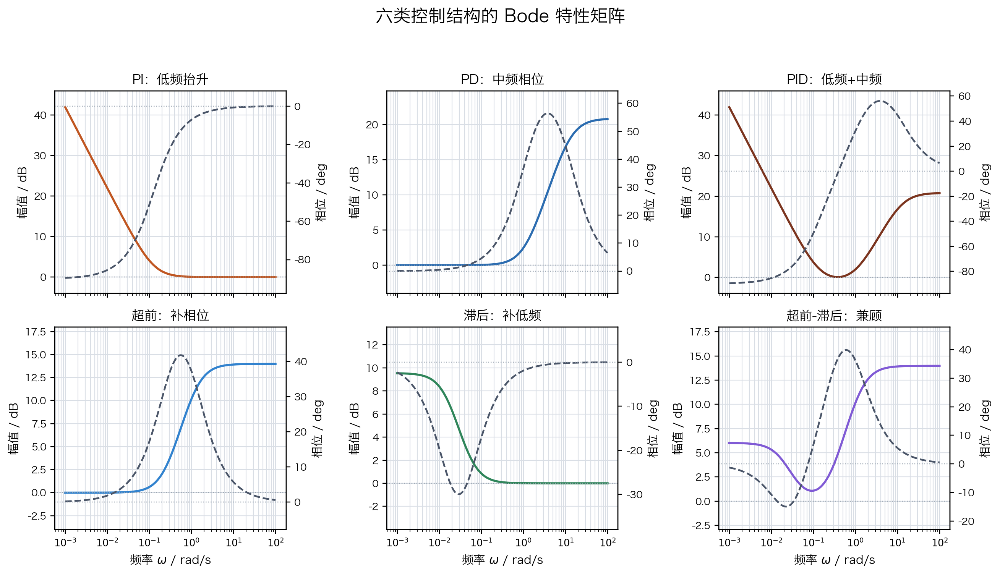

从图中可直接读出几条规律。`PI` 和 `PID` 在低频端抬升幅值，适合处理稳态误差和慢扰动；`PD`、`PID`、超前和超前-滞后会在中频附近提供正相位，适合处理相角裕度、阻尼和超调；滞后主要把增益留在低频，交越频率附近尽量少动；前馈不进入反馈主环路的特征方程，适合补偿已知参考或可测扰动。图中不单列 `P`，因为比例环节只做全频等比例增益平移，不改变曲线形状。

表2. 典型结构的作用对象、整定入口与代价

| 结构 | 常见形式 | 首先改变的频域对象 | 常用整定入口 | 主要代价 |
| --- | --- | --- | --- | --- |
| `P` | $C(s)=K_p$ | 全频段等比例抬升开环幅值 | 经验法、临界比例法 | 裕度下降、控制量增大 |
| `PI` | $C(s)=K_p\left(1+\dfrac{1}{T_i s}\right)$ | 低频增益显著提高，截止频率附近带来滞后 | 频域零点配置、IMC/SIMC、极点配置 | 超调、振荡、积分饱和 |
| `PD` | $C(s)=K_p(1+T_d s)$ 或带滤波形式 | 中频相位超前和阻尼增强 | 二阶模型、频域相位补偿、根轨迹 | 高频噪声、微分冲击 |
| `PID` | $K_p\left(1+\dfrac{1}{T_i s}+T_d s\right)$ | 低频积分与中频微分同时存在 | Ziegler-Nichols、Relay、极点配置、IMC-PID | 参数耦合、饱和、噪声 |
| 超前 | $K_c\dfrac{Ts+1}{\alpha Ts+1},0<\alpha<1$ | 目标频段附近补相位并提高带宽 | Bode 图设计、根轨迹 | 高频增益提高 |
| 滞后 | $\beta\dfrac{Ts+1}{\beta Ts+1},\beta>1$ | 有限提高低频增益，交越附近尽量少动 | 稳态误差倍数、Bode 图设计 | 相位裕度下降、响应变慢 |
| 超前-滞后 | 超前环节与滞后环节串联 | 中频补相位，低频补精度 | 先超前后滞后 | 两部分互相牵动 |
| 前馈 | $F_r(s)$ 或 $F_d(s)$ | 参考通道或扰动通道 | 逆模型、扰动抵消、滤波限幅 | 依赖模型和测量质量 |

## 三、控制器结构选型决策树

结构选择从任务证据开始。先判断主要矛盾的频段和通道，再选择整定入口，最后复核控制量、噪声、饱和和裕度。

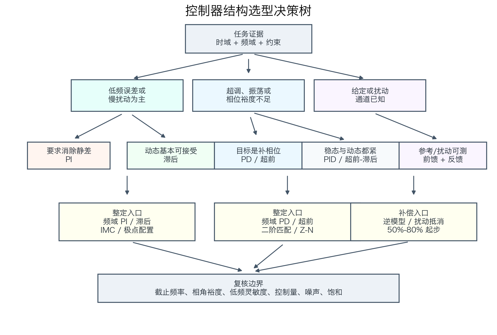

决策树可以转写成五条操作规则。

1. 稳态误差大、慢扰动明显时，优先检查 `PI` 或滞后。若必须消除静差，`PI` 更直接；若动态已经接近可接受，滞后更温和。
2. 超调大、振荡明显、相角裕度不足时，优先检查 `PD`、测速反馈或超前。机械位置系统可从二阶模型入手，频域任务可从超前校正入手。
3. 稳态和动态同时不满足时，`PID` 或超前-滞后才有必要进入候选。
4. 参考轨迹已知或扰动可测时，前馈作为补偿通道加入，反馈仍负责稳定性和鲁棒性。
5. 噪声大、执行器容易饱和、对象纯滞后大时，降低带宽、减弱微分、减弱积分并增加滤波。

## 四、整定方法的完整步骤

### 4.1 经验整定与临界比例整定

经验整定适合模型不够准确但允许试验的系统。完整步骤如下。

1. 关闭积分和微分，只保留比例控制。
2. 增大 $K_p$，使响应速度接近要求，同时避免持续振荡。
3. 加入积分，逐步减小 $T_i$ 或增大 $K_i$，直到稳态误差满足要求。
4. 若超调和振荡明显增大，增大 $T_i$、减小 $K_p$，或加入阻尼补偿。
5. 加入微分或测速反馈，逐步增大 $T_d$ 或 $K_v$。
6. 为微分项加入滤波，常用 $N=5\sim20$。
7. 检查阶跃响应、扰动响应、控制量峰值、噪声和饱和恢复。

Ziegler-Nichols 临界比例法适合能做闭环试验的对象。步骤如下。

1. 只使用比例控制。
2. 逐渐增大 $K_p$，直到系统出现等幅振荡。
3. 记录临界增益 $K_u$ 和临界周期 $P_u$。
4. 按表3计算 `P/PI/PID` 参数。
5. 将 $T_i,T_d$ 换算为 $K_i=K_p/T_i$ 和 $K_d=K_pT_d$。
6. 仿真检查超调、调节时间、相角裕度和控制量。
7. 若响应过激，降低 $K_p$、增大 $T_i$，或采用更保守的 Tyreus-Luyben 参数。

表3. Ziegler-Nichols 临界比例整定表

| 控制器 | $K_p$ | $T_i$ | $T_d$ |
| --- | --- | --- | --- |
| `P` | $0.5K_u$ | -- | -- |
| `PI` | $0.45K_u$ | $P_u/1.2$ | -- |
| `PID` | $0.6K_u$ | $P_u/2$ | $P_u/8$ |

### 4.2 频域 PI 与滞后整定

频域 `PI` 设计用于提高低频能力。控制器写成
$$
C_{PI}(s)=K_p\left(1+\frac{1}{T_i s}\right)
$$
完整步骤如下。

1. 选择目标截止频率 $\omega_c$。
2. 将 PI 零点放在截止频率以下：$\omega_z=\omega_c/5\sim\omega_c/10$。
3. 计算 $T_i=1/\omega_z$。
4. 在 $\omega_c$ 处使用幅值条件：
$$
|C_{PI}(j\omega_c)G(j\omega_c)|=1
$$
5. 得到
$$
K_p=\frac{1}{|G(j\omega_c)|\sqrt{1+\left(\frac{1}{\omega_cT_i}\right)^2}}
$$
6. 重新计算相角裕度。若裕度损失过大，降低目标 $\omega_c$ 或把零点再下移。

滞后校正适合有限提高低频增益。控制器写成
$$
C_{\text{lag}}(s)=\beta\frac{Ts+1}{\beta Ts+1},\qquad \beta>1
$$
完整步骤如下。

1. 由稳态误差改善倍数初取 $\beta$，常用估算为 $\beta\approx e_{ss}/e_{ss}^{\star}$。
2. 令滞后零点位于截止频率以下：$\omega_z=\omega_c/10$。
3. 计算 $T=1/\omega_z$。
4. 取滞后极点 $\omega_p=\omega_z/\beta$。
5. 重算 Bode 图和裕度。若相角裕度下降过多，降低 $\beta$ 或把零极点整体下移。

### 4.3 频域 PD、超前与超前-滞后整定

带滤波的 `PD` 可写成
$$
C_{PD}(s)=K_p\left(1+\frac{T_d s}{1+\frac{T_d}{N}s}\right)
$$
若希望在目标截止频率 $\omega_c$ 处提供相位 $\phi_D$，理想 `PD` 的初算步骤为：

1. 选定 $\omega_c$ 和所需相位补偿 $\phi_D$。
2. 计算
$$
T_d=\frac{\tan\phi_D}{\omega_c}
$$
3. 由幅值条件计算
$$
K_p=\frac{1}{|G(j\omega_c)|\sqrt{1+(\omega_cT_d)^2}}
$$
4. 加入微分滤波 $N=5\sim20$。
5. 检查高频噪声和控制量抖动。

超前校正的频域步骤更适合 Bode 图设计。控制器为
$$
C_{\text{lead}}(s)=K_c\frac{Ts+1}{\alpha Ts+1},\qquad 0<\alpha<1
$$
完整步骤如下。

1. 选定目标截止频率 $\omega_c$ 和目标相角裕度 $PM^\star$。
2. 计算对象相位 $\angle G(j\omega_c)$。
3. 计算所需补偿：
$$
\phi_{\text{need}}=-180^\circ+PM^\star-\angle G(j\omega_c)
$$
4. 加入 $5^\circ\sim12^\circ$ 设计余量，得到 $\phi_{\max}$。
5. 计算
$$
\alpha=\frac{1-\sin\phi_{\max}}{1+\sin\phi_{\max}}
$$
6. 令最大相位超前点落在目标截止频率：
$$
T=\frac{1}{\omega_c\sqrt{\alpha}}
$$
7. 由幅值条件初算
$$
K_c=\frac{\sqrt{\alpha}}{|G(j\omega_c)|}
$$
8. 重画 Bode 图并复核相角裕度、高频增益和控制量。

超前-滞后整定按“先动态、后低频”的顺序执行。先用超前满足相角裕度和速度，再用滞后补低频误差，最后统一复核截止频率和相角裕度。
### 4.4 模型匹配、IMC/SIMC 与前馈整定

模型清楚、阶次较低时，可以用极点配置。对一阶对象
$$
G(s)=\frac{b}{s+a}
$$
采用 PI 控制器 $C(s)=K_p+K_i/s$，闭环特征方程为
$$
s^2+(a+bK_p)s+bK_i=0
$$
若目标闭环为 $s^2+2\zeta\omega_n s+\omega_n^2$，则
$$
K_p=\frac{2\zeta\omega_n-a}{b},\qquad K_i=\frac{\omega_n^2}{b}
$$
对机械二阶对象 $J\ddot y+B\dot y=u$，采用输出微分形式
$$
u=K_p(r-y)-K_d\dot y
$$
闭环特征方程为 $Js^2+(B+K_d)s+K_p=0$，由目标 $\zeta,\omega_n$ 得到
$$
K_p=J\omega_n^2,\qquad K_d=2\zeta\omega_nJ-B
$$
IMC/SIMC 适合近似过程对象。对一阶惯性加纯滞后对象
$$
G(s)=\frac{K e^{-Ls}}{\tau s+1}
$$
常用 PI 参数为
$$
K_p=\frac{\tau}{K(\lambda+L)},\qquad T_i=\min\{\tau,4(\lambda+L)\}
$$
$\lambda$ 是期望闭环时间常数。$\lambda$ 越小，响应越快；$\lambda$ 越大，鲁棒性越强。

前馈整定放在反馈闭环已经稳定之后。参考前馈满足
$$
F_r(s)\approx G^{-1}(s)
$$
扰动前馈满足
$$
F_d(s)=-\frac{G_d(s)}{G(s)}
$$
实际整定时先取理论值的 $50\%\sim80\%$，再检查过补偿、模型误差、滤波和限幅。
## 五、分结构整定例题
### 5.1 例题一：频域 PI 参数计算

对象为
$$
G_1(s)=\frac{1}{s+1}
$$
希望在 $\omega_c=0.8\,\text{rad/s}$ 附近形成闭环，并消除阶跃稳态误差。取 PI 零点 $\omega_z=\omega_c/4=0.2\,\text{rad/s}$，于是
$$
T_i=\frac{1}{\omega_z}=5\,\text{s}
$$
对象在 $\omega_c$ 处的幅值为
$$
|G_1(j0.8)|=\frac{1}{\sqrt{1+0.8^2}}=0.781
$$
PI 形状项幅值为
$$
\left|1+\frac{1}{j\omega_cT_i}\right|
=\sqrt{1+\left(\frac{1}{0.8\times5}\right)^2}=1.031
$$
所以
$$
K_p=\frac{1}{0.781\times1.031}=1.242
$$
进一步得到
$$
K_i=\frac{K_p}{T_i}=0.248
$$
这组参数的含义是：积分用于消除静差，比例增益按目标截止频率确定。与更低的 $\omega_c$ 和更弱的积分相比，这组参数在时域图中更清楚地体现了稳态误差被消除的过程。若相角裕度偏低，应把 $\omega_z$ 再下移或降低 $\omega_c$。

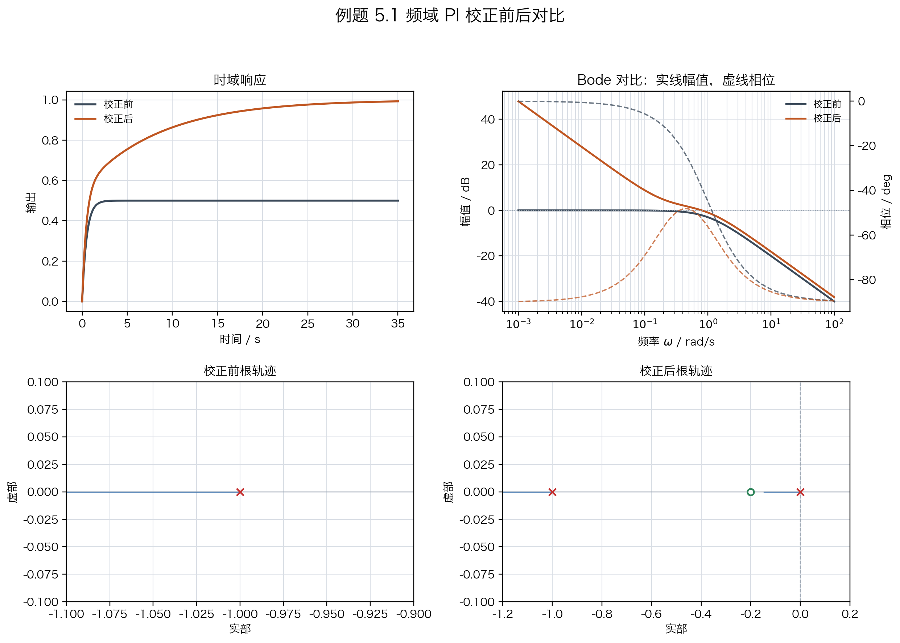

### 5.2 例题二：频域超前参数计算

对象取
$$
G_2(s)=\frac{1.183}{s(1.072s+1)}
$$
它在目标截止频率 $\omega_c=2\,\text{rad/s}$ 处近似满足
$$
|G(j\omega_c)|=0.25,\qquad \angle G(j\omega_c)=-155^\circ
$$
目标相角裕度取 $PM^\star=55^\circ$。所需相位补偿为
$$
\phi_{\text{need}}=-180^\circ+55^\circ-(-155^\circ)=30^\circ
$$
加入 $8^\circ$ 设计余量，取 $\phi_{\max}=38^\circ$。于是
$$
\alpha=\frac{1-\sin38^\circ}{1+\sin38^\circ}=0.238
$$
将最大相位超前点放在 $\omega_c$：
$$
T=\frac{1}{2\sqrt{0.238}}=1.025\,\text{s}
$$
增益为
$$
K_c=\frac{\sqrt{0.238}}{0.25}=1.95
$$
超前校正器为
$$
C_{\text{lead}}(s)=1.95\frac{1.025s+1}{0.244s+1}
$$
这类整定适合相角裕度不足、超调明显、且低频稳态误差不占主导的对象。噪声较大时，应限制 $\alpha$ 不要过小。

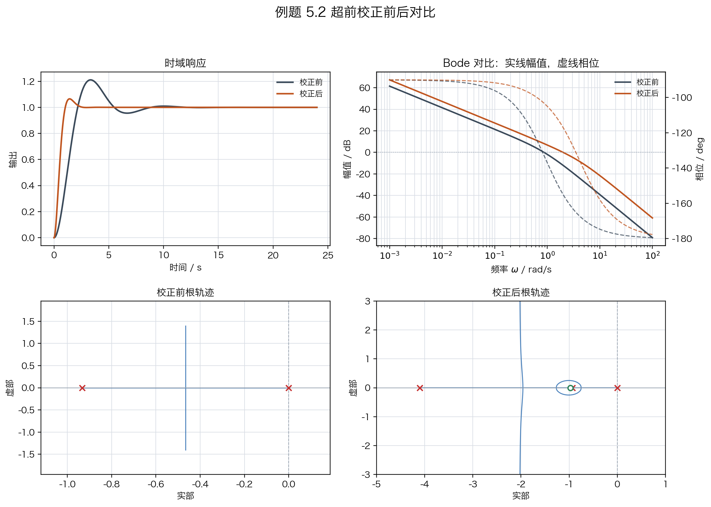

### 5.3 例题三：滞后校正参数计算

对象取
$$
G_3(s)=\frac{9}{s+1}
$$
单位反馈下当前阶跃稳态误差为 $e_{ss}=0.10$，目标为 $e_{ss}^{\star}=0.04$，当前截止频率约为 $\omega_c=1\,\text{rad/s}$。先估算低频增益提高倍数：
$$
\beta\approx\frac{0.10}{0.04}=2.5
$$
取滞后零点
$$
\omega_z=\frac{\omega_c}{10}=0.1\,\text{rad/s}
$$
因此
$$
T=\frac{1}{\omega_z}=10\,\text{s}
$$
滞后极点为
$$
\omega_p=\frac{\omega_z}{\beta}=0.04\,\text{rad/s}
$$
校正器为
$$
C_{\text{lag}}(s)=2.5\frac{10s+1}{25s+1}
$$
它把低频增益提高约 $2.5$ 倍，同时尽量少改变截止频率附近的幅值。代价是相位裕度下降和响应变慢，必须重新计算裕度。

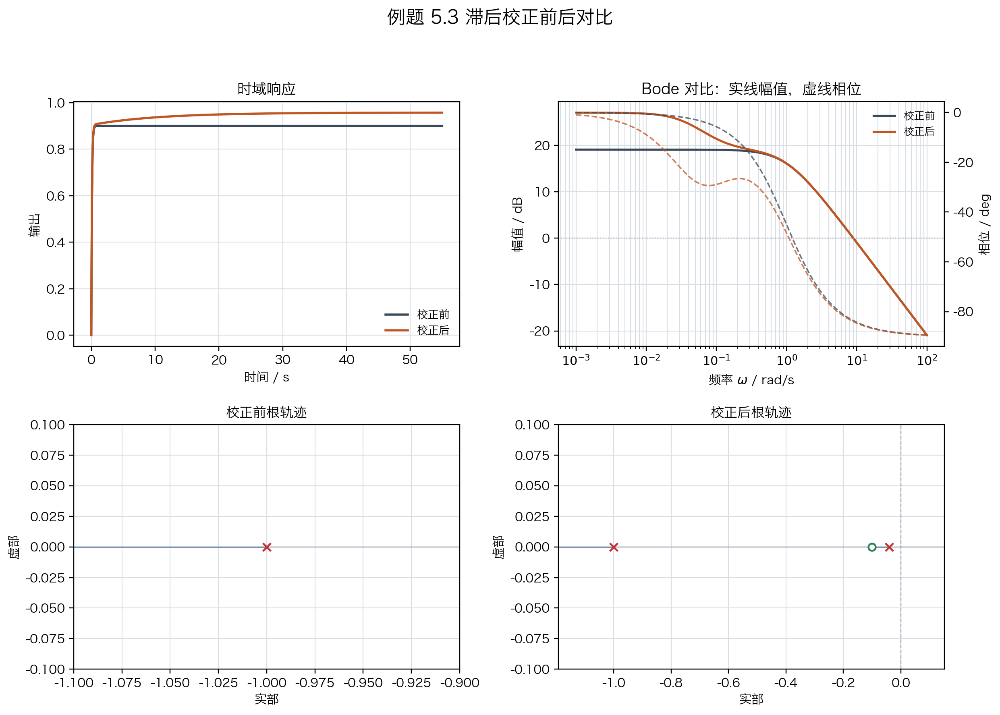

### 5.4 例题四：Ziegler-Nichols PID 参数计算

对象取
$$
G_4(s)=\frac{1}{s(s+1.221)(s+2.021)}
$$
先关闭积分和微分，只保留比例控制。逐步增大 $K_p$：当 $K_p=2$ 时响应较保守；当 $K_p=5$ 时振荡明显增加；当 $K_p=8$ 时出现近似等幅振荡，振荡周期约为 $4\,\text{s}$。因此闭环临界比例试验给出
$$
K_u=8,\qquad P_u=4\,\text{s}
$$

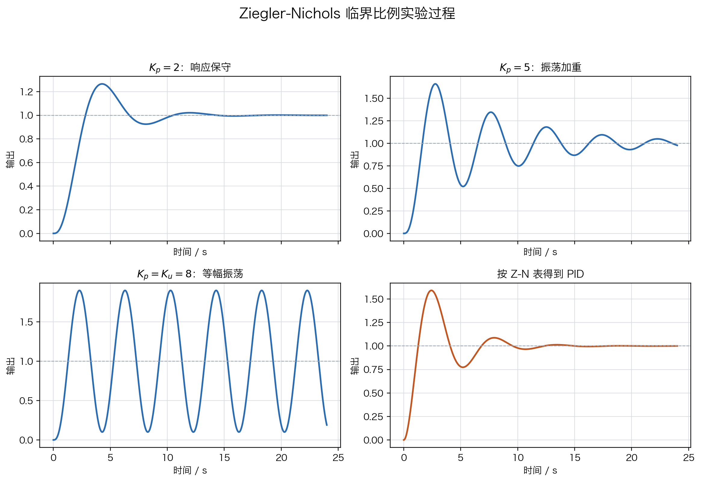

按 Ziegler-Nichols PID 表，
$$
K_p=0.6K_u=4.8
$$
$$
T_i=\frac{P_u}{2}=2\,\text{s},\qquad T_d=\frac{P_u}{8}=0.5\,\text{s}
$$
换算为并联形式：
$$
K_i=\frac{K_p}{T_i}=2.4,\qquad K_d=K_pT_d=2.4
$$
Ziegler-Nichols 参数常使响应偏快、超调偏大。若任务更重视平顺性，可把 $K_p$ 降到 $70\%\sim85\%$，并适当增大 $T_i$。

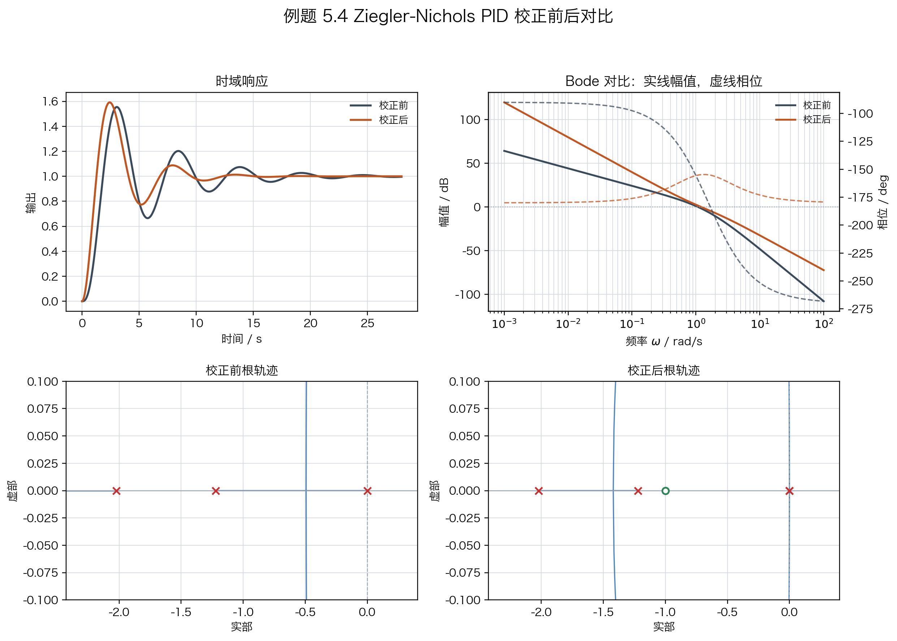

### 5.5 例题五：扰动前馈参数计算

系统输出为
$$
y(s)=G(s)u(s)+G_d(s)d(s)
$$
其中
$$
G(s)=\frac{1}{s+1},\qquad G_d(s)=\frac{0.4}{s+1}
$$
扰动可测时，希望满足
$$
G(s)F_d(s)+G_d(s)=0
$$
因此
$$
F_d(s)=-\frac{G_d(s)}{G(s)}=-0.4
$$
工程整定先取理论值的 $80\%$：
$$
F_d(s)=-0.32
$$
若扰动后输出仍同向偏移，可继续增大补偿；若输出反向偏移或控制量峰值过大，应减小前馈增益并加入限幅。

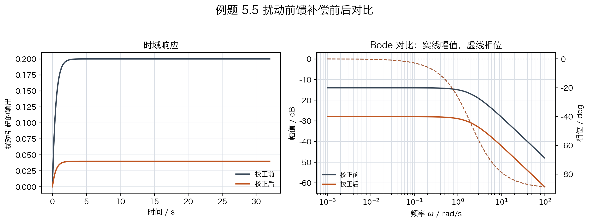

## 六、客船航向控制的候选结构整定

### 6.1 对象与基准证据

客船航向控制对象采用
$$
G_h(s)=\frac{0.01715}{s(s+0.1)(s+2.14375)}
$$
基准比例控制器为 $C_0(s)=2.25$，开环函数为
$$
L_0(s)=C_0(s)G_h(s)
$$
基准系统的截止频率约为 $\omega_c=0.1169\,\text{rad/s}$，相角裕度约为 $37.43^\circ$。给定阶跃超调约为 $31.91\%$，调节时间约为 $83.09\,\text{s}$。这些数字说明客船对象已经稳定，但裕度和平顺性都不宽松。

### 6.2 滞后、PI、超前与超前-滞后的参数初算

候选一是滞后校正。按低频增益提高约 $2.5$ 倍，取
$$
\beta=2.5,\qquad \omega_z=0.012,\qquad \omega_p=0.0048
$$
得到
$$
C_{\text{lag}}(s)=2.25\times2.5\frac{83.33s+1}{208.33s+1}
$$
候选二是频域 PI。取目标截止频率 $\omega_c=0.075\,\text{rad/s}$，零点放在 $\omega_c/8$：
$$
T_i=106.67\,\text{s},\qquad K_p=1.164
$$
因此
$$
C_{PI}(s)=1.164\left(1+\frac{1}{106.67s}\right)
$$
候选三是超前校正。取目标截止频率 $\omega_c=0.13\,\text{rad/s}$，目标相角裕度 $55^\circ$，计算得
$$
K_c=1.576,\qquad \alpha=0.348,\qquad T=13.03
$$
因此
$$
C_{\text{lead}}(s)=1.576\frac{13.03s+1}{4.54s+1}
$$
候选四是超前-滞后。先用超前整理中频，再用温和滞后补低频，计算得到
$$
K_c=1.338,\quad \alpha=0.427,\quad T_{\text{lead}}=13.91,\quad
\beta=1.8,\quad \omega_{z,\text{lag}}=0.00917
$$
这些参数仍属于首轮整定结果，最终是否可交付要看响应、裕度和控制量。

### 6.3 Bode 图与时域响应比较

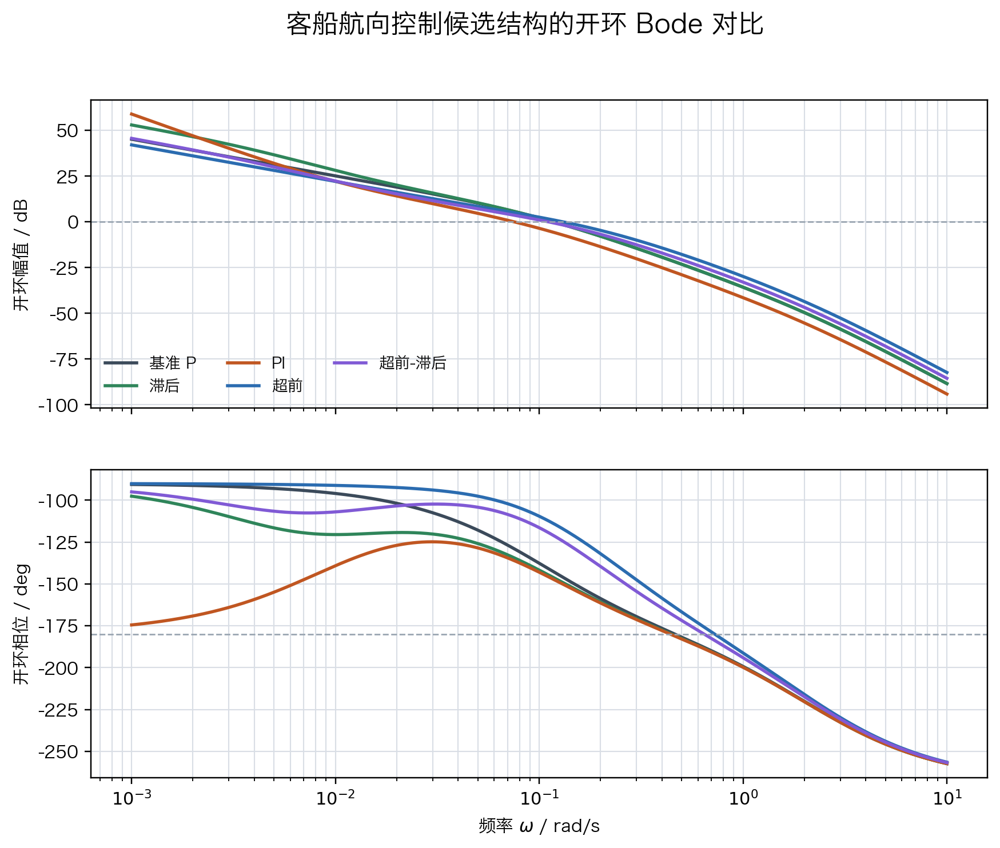

Bode 图显示，滞后主要补低频，但会降低相角裕度；超前和超前-滞后显著改善截止频率附近的相位；单独 PI 的保守频域初算没有自动带来更好的抗扰结果，比例增益下降会抵消一部分积分收益。

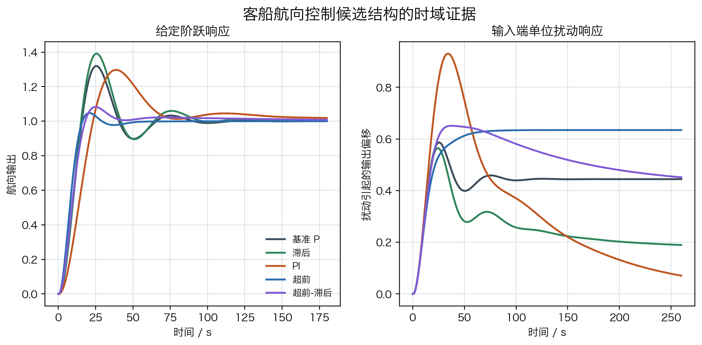

时域结果显示，超前和超前-滞后明显降低给定阶跃超调，并缩短调节时间；滞后略微降低低频灵敏度，但给定阶跃超调和调节时间变差；PI 的响应更慢，扰动峰值也没有改善。

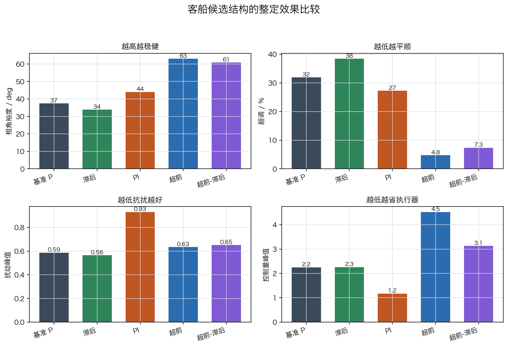

表4. 客船候选结构的首轮整定结果

| 结构 | 相角裕度 | 超调 | 调节时间 | 扰动峰值 | 低频灵敏度 $|S(j0.01)|$ | 控制量峰值 | 判断 |
| --- | ---: | ---: | ---: | ---: | ---: | ---: | --- |
| 基准 `P` | $37.43^\circ$ | $31.91\%$ | $83.09\,\text{s}$ | $0.586$ | $0.056$ | $2.25$ | 可稳定运行，裕度和平顺性不足 |
| 滞后 | $33.85^\circ$ | $38.43\%$ | $88.10\,\text{s}$ | $0.565$ | $0.040$ | $2.26$ | 低频略好，动态代价明显 |
| `PI` | $44.00^\circ$ | $27.27\%$ | $125.34\,\text{s}$ | $0.931$ | $0.084$ | $1.17$ | 保守初算过慢，抗扰未改善 |
| 超前 | $63.00^\circ$ | $4.77\%$ | $40.44\,\text{s}$ | $0.635$ | $0.079$ | $4.52$ | 动态显著改善，控制量和低频抗扰需复核 |
| 超前-滞后 | $60.83^\circ$ | $7.35\%$ | $35.44\,\text{s}$ | $0.651$ | $0.079$ | $3.13$ | 动态较优，低频补偿仍需再调 |

### 6.4 客船案例的结构边界

客船案例给出四条边界。

1. 低频问题不能只看结构名称。滞后确实降低了 $|S(j0.01)|$，但相角裕度、超调和调节时间同时变差。
2. `PI` 的积分作用必须和比例增益、目标截止频率一起看。保守频域初算使系统变慢，扰动峰值反而增大。
3. 超前校正对相角裕度和超调最有效，但它提高控制量峰值，并削弱低频抗扰表现。
4. 超前-滞后具备综合潜力，但首轮参数仍未解决全部约束。它适合作为初始组合候选，不适合直接视为最终方案。

因此，客船航向控制的首轮选择应写成：若当前最紧矛盾是低频保持，可从滞后或温和 PI 起步；若超调和相角裕度已经成为硬约束，超前或超前-滞后应进入候选；若扰动可测，再把扰动前馈放在反馈结构之外做补偿。

## 七、分层练习

### 练习 1：结构识别

某系统给定阶跃超调 $35\%$，相角裕度 $32^\circ$，稳态误差很小。请选择首轮结构，并说明整定入口。

参考要点：主要矛盾在中频相位和阻尼，可选 `PD`、测速反馈或超前；频域任务优先用超前整定，机械位置对象可用二阶模型匹配。

### 练习 2：滞后整定

某系统当前稳态误差 $0.12$，目标稳态误差 $0.04$，当前截止频率 $0.8\,\text{rad/s}$。按频域滞后法计算 $\beta,\omega_z,\omega_p$。

参考结果：
$$
\beta=3,\qquad \omega_z=0.08\,\text{rad/s},\qquad \omega_p=0.0267\,\text{rad/s}
$$
整定后必须复核相角裕度。

### 练习 3：超前整定

某对象在 $\omega_c=1.5\,\text{rad/s}$ 处满足 $|G(j\omega_c)|=0.4$，$\angle G(j\omega_c)=-150^\circ$，目标相角裕度 $55^\circ$。取 $8^\circ$ 余量，计算超前参数。

参考步骤：$\phi_{\text{need}}=25^\circ$，$\phi_{\max}=33^\circ$，再由 $\alpha,T,K_c$ 三个公式计算。

### 练习 4：客船候选结果解释

根据表4回答：

1. 哪个结构最明显降低超调？
2. 哪个结构最明显降低 $|S(j0.01)|$？
3. 为什么不能只凭单一指标选择最终结构？

参考要点：超前降低超调最明显；滞后降低低频灵敏度最明显；最终结构必须同时检查裕度、扰动、控制量和动态响应。

## 八、选型边界总结

表5. 典型证据到控制结构的边界提示

| 证据 | 优先结构 | 整定入口 | 边界 |
| --- | --- | --- | --- |
| 稳态误差大，动态基本可接受 | 滞后 | $\beta,\omega_z,\omega_p$ | 响应可能变慢，相角裕度下降 |
| 必须消除静差 | `PI` | $\omega_z,T_i,K_p$ 或 IMC-PI | 积分饱和、超调和低频振荡 |
| 超调大、相角裕度不足 | `PD` / 超前 | $T_d$ 或 $\alpha,T,K_c$ | 高频噪声和控制量峰值 |
| 稳态和动态都不满足 | `PID` / 超前-滞后 | Ziegler-Nichols、极点配置、先超前后滞后 | 参数耦合，必须复核全部指标 |
| 参考轨迹已知 | 参考前馈 | $F_r(s)\approx G^{-1}(s)$ | 需要滤波，模型不准会过补偿 |
| 扰动可测 | 扰动前馈 | $F_d(s)=-G_d(s)/G(s)$ | 不能替代反馈闭环 |
| 噪声大或执行器易饱和 | 降低带宽，减弱微分和积分 | 滤波、限幅、抗积分饱和 | 性能提升要让位于安全边界 |

控制器整定的核心是让低频精度、截止频率、相角裕度、高频噪声和执行器能力同时成立。单结构首轮整定给出的是可验证的候选起点；只有经过响应、扰动、裕度和控制量的联合检查，结构选择才具备工程意义。

