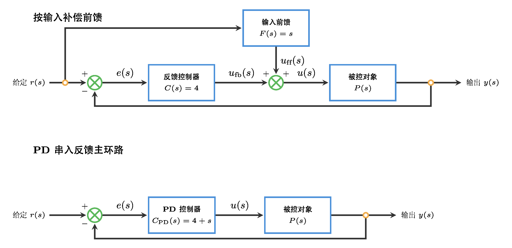
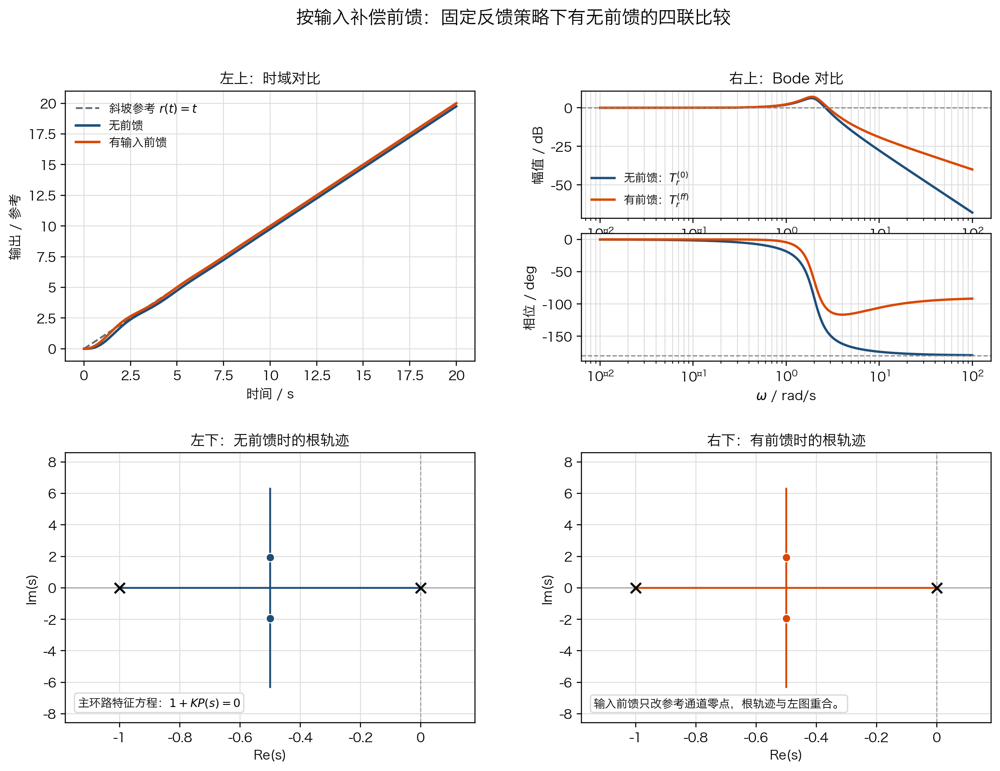
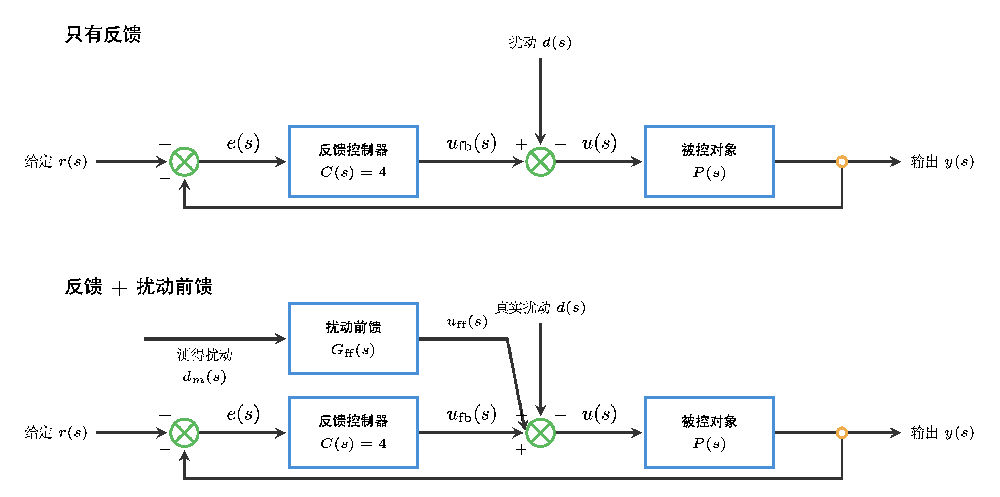
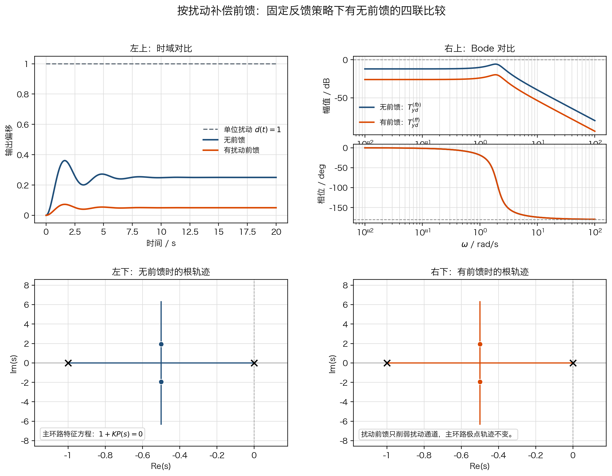

# 单元 4-2 | 控制器选型原理：不同控制结构为何适合不同任务

- **层次**：模块4 理论主线 · 第二课
- **学时**：90分钟
- **知识类型**：[D] 设计型
- **前置**：已完成任务表达卡书写，能够区分硬约束、软目标与观察指标，能够从时域、频域与稳态误差证据描述系统现状
- **后续**：下一步将把单结构首轮起步继续发展为可验证的初始方案
- **讲义定位**：这份讲义帮助我们把任务表达卡翻译成结构选择理由，写出单结构首轮起步方向、预期收益、主要代价与首轮验证假设

---

## 一、问题引入：同样面对反馈系统，为什么第一步不能都写成 `PID`

客船航向保持和船载稳定平台姿态恢复都已经进入闭环运行。两类对象都能从时域响应、根轨迹、Bode 图和裕度中读出系统现状，但它们的第一步并不相同。

表1. 两类任务在首轮起步上的差异

| 场景 | 当前现象 | 直观冲动 | 真正需要先回答的问题 |
| --- | --- | --- | --- |
| 客船航向保持 | 长时间受风浪扰动，过程偏冲、偏拖 | 直接加大控制强度，尽快把过程压快 | 当前最紧的矛盾是低频保持能力不足，还是动态品质不足 |
| 稳定平台姿态恢复 | 恢复很快，但超调和中频储备仍然吃紧 | 继续提速，保持高速优势 | 当前更该整理中频动态品质，还是先补低频精度 |

真正困难的地方，不在于记住哪一个控制器名字更常见，而在于把任务写成一条完整判断链：

1. 当前最紧的矛盾是什么。
2. 这个矛盾主要落在哪一段频率行为，或者落在哪条给定/扰动通道。
3. 哪一类单结构最直接作用于这段行为。
4. 第一轮参数先朝哪个方向起。
5. 这样起步会先得到什么收益，又会先透支什么代价。

如果这五步没有写清，`PID` 就会退化成口号，结构选择也无法继续长成后面的初始方案。

## 二、前置缺口与本课能力目标

`4-1` 已经完成了任务表达卡。我们已经知道：

- 哪些指标是当前场景不能突破的底线；
- 哪些指标可以在守住底线后继续争取；
- 哪些证据来自时域图、根轨迹、Bode 图和裕度读数。

但任务表达卡还没有回答下面三个设计问题：

1. 为什么低频矛盾更自然地指向 `PI/滞后`，而中频矛盾更自然地指向 `PD/超前`。
2. 为什么前馈有时值得进入候选，却不能代替反馈保底。
3. 为什么首轮起步只能先写结构优先级和参数方向，而不能直接跳到完整方案。

学完这份讲义后，我们应能完成四个动作：

1. 根据任务表达卡判断当前主要矛盾落在低频、中频还是通道补偿。
2. 从 `P/PI/PD/PID/超前/滞后/前馈` 中筛出更合适的首轮单结构。
3. 写出“参数先朝哪个方向起”的首轮起步语句，而不是只报结构名称。
4. 补全一张单结构首轮起步卡，说明预期收益、主要代价和首轮验证假设。

## 三、把控制结构整理成任务工具箱

### 3.1 先写清判断主线

控制器可以记为

$$
C(s)
$$

它与被控对象 $P(s)$ 串联后，开环函数写成

$$
L(s)=C(s)P(s)
$$

在首轮选型阶段，我们通常还不急着求完整参数，而是先判断：为了让 $L(s)$ 的低频、中频或某条补偿通道更接近任务要求，$C(s)$ 应先具备什么作用特征。

表2. 单结构首轮判断链

| 步骤 | 要回答的问题 | 产出 |
| --- | --- | --- |
| 1 | 当前最紧的矛盾是什么 | 精度不足、动态品质不足、扰动隔离不足，或储备边界过紧 |
| 2 | 矛盾主要落在哪里 | 低频、中频、高频约束，或给定/扰动通道 |
| 3 | 哪类单结构更直接 | `P`、`PI/滞后`、`PD/超前`、前馈 |
| 4 | 第一轮先朝哪个方向起 | 先补低频、先整理中频、先打开补偿通道 |
| 5 | 最先想验证什么改善 | 误差先降、超调先降、扰动影响更早被削弱 |
| 6 | 最可能先透支什么代价 | 相位余量、速度、噪声敏感性、实现复杂度 |

这条判断链决定了我们能否把“结构名称”写成真正的设计动作。

### 3.2 各类结构的最小语义

表3. 控制结构工具箱总表

| 结构 | 常见形式 | 主要作用 | 更适合先解决什么问题 | 常见代价 |
| --- | --- | --- | --- | --- |
| `P` | $C(s)=K$ | 先建立最小可用闭环，观察增益变化趋势 | 先确认对象对反馈是否基本可用 | 只能粗调，低频精度与动态品质改善都有限 |
| `PI` | $C(s)=K_p+\dfrac{K_i}{s}$ | 提高低频增益，引入积分 | 稳态误差偏大、慢扰动抑制不足 | 相位滞后增加，容易拖慢过程或压缩储备 |
| `PD` | $C(s)=K_p+K_d s$ | 增强趋势判断，改善阻尼和相位倾向 | 超调过大、阻尼不足、过程不够利落 | 高频噪声更敏感，不能单独补低频精度 |
| 超前 | $C(s)=K\dfrac{Ts+1}{\alpha Ts+1},\ 0<\alpha<1$ | 在中频附近提供相位超前 | 希望提速同时保留一定储备 | 高频放大倾向增强，对噪声更敏感 |
| 滞后 | $C(s)=K\dfrac{Ts+1}{\beta Ts+1},\ \beta>1$ | 更偏向低频补偿，尽量少动中频 | 低频精度与恒值扰动抑制不足 | 速度可能下降，动态过程未必立即改善 |
| 前馈 | 按输入补偿或按扰动补偿 | 不等误差形成，沿已知通道提前注入控制量 | 已知给定轨迹跟踪、可测扰动抵消 | 强依赖模型和测量质量，不能替代反馈 |
| `PID` | $C(s)=K_p+\dfrac{K_i}{s}+K_d s$ | 同时补低频和中频 | 低频精度与动态品质都很紧时的组合候选 | 结构复杂，若理由不清容易退化成默认答案 |

从任务角度看，这张表最重要的结论是：每一类结构都优先作用于某一类矛盾，并且都会带来相应代价。控制器不存在脱离场景后的自动优先级。

### 3.3 频段职责决定了结构优先级

三频段语言在本课中的作用，是帮助我们解释“结构为什么会有效，也为什么一定会有代价”。

表4. 三频段职责与结构选择

| 频段或通道 | 主要关心的量 | 更常见的首轮结构 | 需要一起检查的代价 |
| --- | --- | --- | --- |
| 低频 | 稳态误差、慢扰动抑制、长期保持精度 | `PI`、滞后 | 相位滞后、过程拖慢、储备压缩 |
| 中频 | 截止频率、相角裕度、阻尼与超调 | `PD`、超前 | 高频敏感性、执行器负担、储备继续收紧 |
| 通道补偿 | 已知给定、可测扰动 | 前馈 | 模型失配、测量误差、未知扰动仍需反馈兜底 |

因此，我们选择结构时真正要写出来的是：它先改善哪一段行为，以及代价会先从哪里冒出来。

### 3.4 为什么 `PID` 不能写成默认起点

只有当下面三个条件同时出现时，`PID` 或复合校正才值得在首轮进入候选：

1. 低频精度问题确实明显存在。
2. 中频动态品质或储备问题也同样紧迫。
3. 单一结构已经无法解释当前任务。

在这三个条件没有同时满足之前，更稳妥的写法是先明确单结构优先级，再把组合结构留给后续方案形成阶段。

## 四、为什么客船航向保持更该先选 `PI/滞后`

### 4.1 先看清：这里要解决的不是“能不能跟上”，而是“低频保持能力够不够”

客船航向保持的主要困难，不在于系统完全不会跟踪，而在于长期风浪扰动下，保持能力和平顺性都不够从容。当前对象与工作点写为

$$
P_h(s)=\frac{0.01715}{s(s+0.1)(s+2.14375)},
\qquad
C_0(s)=K_h=2.25
$$

于是当前开环函数为

$$
L_h(s)=C_0(s)P_h(s)=\frac{0.0385875}{s(s+0.1)(s+2.14375)}
$$

客船场景的跨域证据如下：

{width=100%}

- 超调约为 $32.01\%$，调节时间约为 $83.24\,\text{s}$，过程偏冲、偏拖；
- 当前主导极点仍在可接受设计区域之外，说明“稳定”还没有转化为“任务上可接受”；
- 截止频率约为 $\omega_c=0.1169\,\text{rad/s}$，相角裕度约为 $37.43^\circ$，说明储备并不宽松；
- 场景长期面对慢扰动，真正先吃紧的是低频保持能力与慢扰动抑制。

这里最关键的判断不是“误差大不大”，而是**要让哪一段频率行为先变强**。
若我们希望慢扰动引起的偏差更小，本质上要做的是让低频灵敏度

$$
S(s)=\frac{1}{1+L_h(s)}
$$

在较低频段更小。要让 $S(j\omega)$ 变小，最直接的方法不是先去抬中频，而是先把 $|L_h(j\omega)|$ 在低频段托起来。

### 4.2 把 `PI` 和 `PD` 真正放到同一张比较表里

若首轮考虑 `PI`，可先写成

$$
C_{PI}(s)=K_p\left(1+\frac{\omega_i}{s}\right)
$$

若首轮考虑 `PD`，可先写成

$$
C_{PD}(s)=K_p(1+T_d s)
$$

现在不求完整整定，只做“为什么先选它”的量级比较。
为了说明问题，我们选一个只服务首轮判断的代表性参数：

- 对 `PI`，取积分拐点 $\omega_i=0.02\,\text{rad/s}$，低于当前截止频率；
- 对 `PD`，取 $T_d\approx 1/\omega_c=8.55\,\text{s}$，让它的主要作用落在当前截止频率附近。

先在低频工作带 $\omega_l=0.01\,\text{rad/s}$ 比较：

$$
\left|\frac{C_{PI}(j\omega_l)}{K_p}\right|
=\sqrt{1+\left(\frac{\omega_i}{\omega_l}\right)^2}
=\sqrt{1+2^2}
=2.24
$$

$$
\angle \frac{C_{PI}(j\omega_l)}{K_p}
=-\arctan \frac{\omega_i}{\omega_l}
=-63.4^\circ
$$

而 `PD` 在同一低频点的增益几乎不变：

$$
\left|\frac{C_{PD}(j\omega_l)}{K_p}\right|
=\sqrt{1+(\omega_l T_d)^2}
\approx 1.00
$$

$$
\angle \frac{C_{PD}(j\omega_l)}{K_p}
=\arctan (\omega_l T_d)
\approx 4.9^\circ
$$

这意味着：

- `PI` 会明显提高低频回路增益，因而更有机会把慢扰动和长期偏差先压下去；
- `PD` 在低频段几乎不增加回路增益，因此它对“长期托住精度”帮助很有限。

再看当前截止频率附近。`PI` 在 $\omega_c=0.1169\,\text{rad/s}$ 处的影响是

$$
\left|\frac{C_{PI}(j\omega_c)}{K_p}\right|
=\sqrt{1+\left(\frac{\omega_i}{\omega_c}\right)^2}
\approx 1.015,
\qquad
\angle \frac{C_{PI}(j\omega_c)}{K_p}\approx -9.7^\circ
$$

`PD` 在这一带的影响则是

$$
\left|\frac{C_{PD}(j\omega_c)}{K_p}\right|
=\sqrt{2}\approx 1.414,
\qquad
\angle \frac{C_{PD}(j\omega_c)}{K_p}=45^\circ
$$

表5. 客船场景中 `PI` 与 `PD` 的首轮比较

| 比较点 | `PI` | `PD` | 对当前任务意味着什么 |
| --- | --- | --- | --- |
| 低频增益 | 明显提升 | 几乎不变 | 客船更需要前者 |
| 截止频率附近相位 | 引入滞后 | 引入超前 | 当前主矛盾不是“再提速” |
| 直接改善方向 | 慢扰动抑制、长期保持 | 阻尼、超调、速度感 | 客船当前先保低频 |
| 主要风险 | 储备变紧、过程可能更慢 | 更容易把系统推向激进提速 | 后者不是当前第一步 |

所以，这里不是“`PI` 听起来更像精度控制”，而是**算出来 `PI` 的作用带宽确实更贴近当前矛盾**。
若第一步先上 `PD`，最先被加强的是中频附近，而不是慢扰动真正施压的低频区间。

### 4.3 为什么还要保留“滞后”作为同类候选

若我们想补低频，但又不想立刻把积分环节带来的漂移风险、持续相位滞后和执行器累积负担全部推到第一步上，那么“滞后”就是更温和的工程写法。

滞后校正可以写成

$$
C_{lag}(s)=K\frac{Ts+1}{\beta Ts+1},
\qquad \beta>1
$$

它和 `PI` 的共同点是：都把重点放在低频补偿。
它和 `PI` 的区别在于：它不引入真正的纯积分，因此更适合以下场景：

- 明显需要增强低频保持能力；
- 但又不希望第一步就把积分放成主角；
- 或者工程实现上更担心积分漂移、执行器长时饱和。

因此，客船这一类低频问题的首轮写法通常是：

- 若目标是先明确补静差与慢扰动抑制主线，写 `PI`；
- 若目标是先做更温和的低频抬升、少碰实现边界，写滞后。

### 4.4 客船场景的首轮起步卡

表6. 客船场景的单结构首轮起步卡

| 字段 | 内容 |
| --- | --- |
| 当前任务 | 在风浪扰动下完成航向修正并保持平顺 |
| 最紧矛盾 | 低频保持能力与慢扰动抑制不足 |
| 首选单结构 | `PI` 或滞后 |
| 起步证据 | 需要优先压低低频灵敏度，`PI/滞后` 比 `PD/超前` 更直接抬升低频回路增益 |
| 参数起步方向 | 先增强低频补偿作用，让低频增益向“更能托住精度”的方向移动 |
| 首先验证的改善 | 长期偏差是否先减小，扰动后是否更容易回到给定值 |
| 主要代价 | 相位余量可能变紧，调节时间未必立即缩短 |
| 当前不宜优先采用的结构 | 单独使用 `PD/超前`，因为它首先改的是中频动态品质，而不是低频保持能力 |
| 留给 `4-3` 的未决项 | 单结构补低频后，动态品质是否立即暴露为新的硬约束，是否需要再补中频机制线 |

## 五、为什么稳定平台姿态恢复更该先选 `PD/超前`

### 5.1 先看清：这里真正吃紧的是中频相位与阻尼

船载稳定平台的场景更关注快速恢复。当前对象与工作点写为

$$
P_p(s)=\frac{2960\left(\frac{s}{15}+1\right)}{s\left(\frac{s}{3}+1\right)\left[(1.7s+1)(0.005s+1)(0.001s+1)+100\right]},
\qquad
C_0(s)=K_p=5
$$

对应证据如下：

{width=100%}

- 调节时间约为 $0.17\,\text{s}$，速度已经很快；
- 超调约为 $37.55\%$，说明过程仍然偏冒进；
- 截止频率约为 $\omega_c=31.07\,\text{rad/s}$，相角裕度约为 $39.69^\circ$，继续提速会明显牵动中频储备；
- 当前主要问题不在于低频静态精度，而在于阻尼与动态品质仍不够理想。

因此，这里要做的不是再去大幅提高低频增益，而是让截止频率附近的相位和阻尼更可控。
换言之，我们不是先问“稳态误差还能不能更小”，而是先问“在当前速度已经很快的前提下，能不能把超调和储备整理得更像工程上可接受的样子”。

### 5.2 把 `PD` 和 `PI` 放到当前截止频率附近比较

仍然先不求完整整定，只比较结构本身首先强化哪一段行为。

若考虑 `PD`：

$$
C_{PD}(s)=K_p(1+T_d s)
$$

让它在当前截止频率附近发挥作用，可取

$$
T_d\approx \frac{1}{\omega_c}=\frac{1}{31.07}\approx 0.0322\,\text{s}
$$

则在当前截止频率附近有

$$
\left|\frac{C_{PD}(j\omega_c)}{K_p}\right|=\sqrt{2}\approx 1.414,
\qquad
\angle \frac{C_{PD}(j\omega_c)}{K_p}=45^\circ
$$

这说明 `PD` 的第一作用点正落在平台当前最吃紧的那一带：它会明显改变截止频率附近的相位与阻尼趋势。

若反过来先上 `PI`，仍以代表性积分拐点 $\omega_i=5\,\text{rad/s}$ 为例，则在当前截止频率处

$$
\left|\frac{C_{PI}(j\omega_c)}{K_p}\right|
=\sqrt{1+\left(\frac{\omega_i}{\omega_c}\right)^2}
\approx 1.013
$$

$$
\angle \frac{C_{PI}(j\omega_c)}{K_p}
=-\arctan \frac{\omega_i}{\omega_c}
\approx -9.1^\circ
$$

这组数的含义很直接：

- `PD` 在当前最关键的频段给出正相位；
- `PI` 在同一频段只会再带来相位滞后；
- 但平台当前本来就不是先缺低频静态精度，而是先缺中频动态品质。

表7. 稳定平台场景中 `PD` 与 `PI` 的首轮比较

| 比较点 | `PD` | `PI` | 对当前任务意味着什么 |
| --- | --- | --- | --- |
| 截止频率附近相位 | 显著增加 | 略有下降 | 平台更需要前者 |
| 低频增益 | 基本不变 | 会提高 | 当前主矛盾并不在这里 |
| 直接改善方向 | 阻尼、超调、动态品质 | 静态精度、慢扰动抑制 | 平台当前先整理中频 |
| 主要风险 | 高频噪声更敏感 | 储备更紧、反而可能更拖 | 后者会进一步偏离当前重点 |

这就是为什么平台场景首轮更像 `PD` 或超前，而不是 `PI`。
不是因为“平台喜欢微分”，而是因为它当前最需要的结构作用点就在截止频率附近。

### 5.3 为什么“超前”是 `PD` 的工程化写法

超前校正可以写成

$$
C_{lead}(s)=K\frac{Ts+1}{\alpha Ts+1},
\qquad 0<\alpha<1
$$

它和 `PD` 的共同点是：都把主要作用放在中频相位改善。
它和 `PD` 的区别在于：它通常更容易把“补相位”和“高频不过分放大”放在同一张工程表里做折中。

例如，当 $\alpha=0.2$ 时，超前网络的最大相位超前可达

$$
\phi_{\max}=\sin^{-1}\frac{1-\alpha}{1+\alpha}
=\sin^{-1}\frac{0.8}{1.2}
\approx 41.8^\circ
$$

这和上面 `PD` 在当前截止频率附近给出的相位改善处于同一量级。
因此，平台这类“已经很快，但阻尼与储备吃紧”的任务，首轮通常写成 `PD/超前` 这一路，而不是 `PI/滞后`。

### 5.4 稳定平台场景的首轮起步卡

表8. 稳定平台场景的单结构首轮起步卡

| 字段 | 内容 |
| --- | --- |
| 当前任务 | 在较高恢复速度下抑制姿态扰动，避免过程峰化过大 |
| 最紧矛盾 | 阻尼不足，中频动态品质仍偏紧 |
| 首选单结构 | `PD` 或超前 |
| 起步证据 | 需要优先改善截止频率附近的相位与阻尼，`PD/超前` 比 `PI/滞后` 更直接作用于这一段 |
| 参数起步方向 | 先增强中频相位改善作用，优先整理阻尼与动态品质 |
| 首先验证的改善 | 超调是否先下降，过程是否更利落 |
| 预期收益 | 在保住速度优势的同时压低超调 |
| 主要代价 | 高频噪声更敏感，储备可能继续收紧 |
| 当前不宜优先采用的结构 | 单独使用 `PI`，因为它不会直接解决中频动态品质问题 |
| 留给 `4-3` 的未决项 | 若补相位后低频精度或抗扰要求开始成为新矛盾，是否需要再补低频机制线或引入通道补偿 |

## 六、前馈不是点到为止：本课程在 `4-2` 的正式入口

### 6.1 为什么前馈必须在这一讲讲透

到目前为止，我们已经看到两类典型任务：

- 客船更像“先补低频保持能力”；
- 平台更像“先整理中频动态品质”。

但这还不够。工程上还有一类情况：
系统的问题不是先落在低频或中频，而是**落在一条已知的输入通道或可测扰动通道**。

这时，只靠反馈并不划算，因为反馈必须先等误差出现。
前馈的价值，恰恰在于：

- 给定一变化，就先按目标趋势提前出力；
- 扰动一测到，就沿扰动入口先做抵消；
- 让误差尽量少形成，而不是形成以后再拉回来。

因此，`4-2` 对前馈的讲法不能只停在“它也值得进入候选”。
本课要把它讲成两条完整路径：

1. **按输入补偿**：用给定前馈改善跟踪；
2. **按扰动补偿**：用扰动前馈削弱可测扰动的影响。

### 6.2 按输入补偿：为什么它首先服务“跟踪”，而不是替代反馈

在两自由度结构中，控制输入可写成

$$
u(s)=C(s)\bigl(r(s)-y(s)\bigr)+F(s)r(s)
$$

其中：

- $C(s)$ 负责稳定性、鲁棒性与误差修正；
- $F(s)$ 负责沿给定通道提前注入控制量。

最理想的按输入补偿条件写成

$$
G_f(s)G_2(s)=1
$$

这意味着输出能完全再现输入，即“按给定作用的完全不变性”。
但工程上通常不会机械追求它，因为这往往要求对象逆或微分环节，容易放大噪声。

#### 6.2.1 一个固定反馈策略下的输入前馈四联比较

考虑一个固定反馈策略不变的归一化跟踪系统：

$$
P(s)=\frac{1}{s(s+1)},\qquad C(s)=4
$$

若不加入输入前馈，则从给定到输出的闭环传递函数为

$$
T_r^{(0)}(s)=\frac{P(s)C(s)}{1+P(s)C(s)}=\frac{4}{s^2+s+4}
$$

若加入一阶输入前馈

$$
F(s)=s
$$

则给定到输出的闭环传递函数变为

$$
T_r^{(ff)}(s)=\frac{P(s)\bigl(C(s)+F(s)\bigr)}{1+P(s)C(s)}=\frac{s+4}{s^2+s+4}
$$

两者最重要的区别是：

- 分母完全相同，说明反馈主环路决定的特征方程没有改变；
- 分子由 $4$ 变成了 $s+4$，说明前馈主要是在参考通道上补了一条“提前出力”的零点机制。

但如果只看到这里，学生很容易把它误读成“这不就是把一个 `PD` 写成了另外一种样子吗”。
这个疑问必须先用结构图区分清楚。

先看下面这张“按输入补偿前馈与 `PD` 的结构对比图”：

{width=100%}

这张结构图要先读出两个结构事实：

1. 输入前馈的微分环节 $F(s)=s$ 只看给定 $r(s)$，它并不进入误差信号 $e(s)=r(s)-y(s)$ 的反馈主环路。
2. `PD` 的微分环节属于反馈控制器的一部分，它处理的是误差 $e(s)$，因此会直接进入闭环特征方程。

这一点可以用同一对象上的一个对照算式说透。
若把 `PD` 直接写成

$$
C_{PD}(s)=4+s
$$

则同一对象

$$
P(s)=\frac{1}{s(s+1)}
$$

下，从给定到输出的闭环传递函数变成

$$
T_r^{(PD)}(s)=\frac{P(s)\bigl(4+s\bigr)}{1+P(s)\bigl(4+s\bigr)}
=\frac{s+4}{s^2+2s+4}
$$

请特别比较它和输入前馈的结果：

$$
T_r^{(ff)}(s)=\frac{s+4}{s^2+s+4}
$$

两者虽然都出现了分子 $s+4$，但分母并不相同。
这说明：

- 输入前馈只是把参考通道改成了“提前出力”的零点结构；
- `PD` 则把零点直接带进了反馈主环路，因此极点位置、阻尼和根轨迹都会跟着变化。

所以，前面四联图里“有无输入前馈时根轨迹几乎重合”，不是因为输入前馈等于 `PD`，恰恰是因为它**不是** `PD`。

若系统原本对斜坡输入 $r(t)=At$ 的稳态误差为

$$
e_{ss}^{(0)}=\frac{A}{K_1K_2}
$$

加入一阶前馈补偿后，稳态误差变为

$$
e_{ss}^{(ff)}=\frac{A(1-\tau K_2)}{K_1K_2}
$$

这条公式特别重要，因为它把“按输入补偿为什么有用”讲成了可计算的比较，而不是一句口号。

下图给出了固定反馈策略下有无输入前馈的四联对比。左上是斜坡跟踪时域响应，右上是从给定到输出的 Bode 对比，左下是无前馈时的根轨迹，右下是加入输入前馈后的根轨迹。

{width=100%}

这张图要读出三层意思：

1. 左上时域图中，加入输入前馈后，输出在斜坡输入下更贴近参考线，说明误差形成得更慢、更小。
2. 右上 Bode 图中，加入输入前馈后，参考通道在工作频段内更接近“幅值跟得上、相位滞后更小”的目标。
3. 左下和右下根轨迹几乎重合，说明输入前馈并没有改动反馈闭环的特征方程。它改善的是跟踪通道的零点结构，而不是把极点轨迹整体搬走。

表9. 输入前馈对斜坡误差的影响

| 前馈参数 | 误差结果 | 物理含义 |
| --- | --- | --- |
| $\tau=0$ | $\dfrac{A}{K_1K_2}$ | 没有前馈，完全靠反馈跟踪 |
| $\tau=\dfrac{0.5}{K_2}$ | $\dfrac{0.5A}{K_1K_2}$ | 误差减半，但仍是有差跟踪 |
| $\tau=\dfrac{1}{K_2}$ | $0$ | 对这类斜坡输入，等效把系统无差度提高一阶 |
| $\tau>\dfrac{1}{K_2}$ | 误差变负 | 出现过补偿，说明前馈过激 |

因此，按输入补偿的设计逻辑不是“把前馈加上去就更高级”，而是：

1. 先明确你要改善的是哪类跟踪误差；
2. 再用公式检查前馈参数是否把误差减小到了你想要的方向；
3. 最后再看是否引入了过补偿与噪声放大风险。

#### 6.2.2 没有输入前馈 vs 有输入前馈

表10. 输入补偿的两种设计结果

| 设计方式 | 误差形成机制 | 最先改善的东西 | 最先暴露的风险 |
| --- | --- | --- | --- |
| 只有反馈 | 必须等输出落后于给定后再追 | 结构简单、鲁棒性靠反馈兜底 | 跟踪滞后明显，斜坡或轨迹输入更吃亏 |
| 反馈 + 输入前馈 | 给定一变化就沿参考通道提前出力 | 跟踪更快、更顺，误差更晚形成 | 模型不准会过补偿，微分型前馈会更敏感 |

这就是为什么在“目标轨迹已知、输入变化趋势已知”的任务里，前馈应该被正式当作一类结构候选，而不是只在页边提一下。

### 6.3 按扰动补偿：为什么它首先服务“抗扰”，而不是替代反馈

若可测扰动 $d(s)$ 通过扰动通道 $G_d(s)$ 进入对象，系统输出可写为

$$
y(s)=G(s)u(s)+G_d(s)d(s)
$$

若控制量由反馈和扰动前馈组成：

$$
u(s)=u_{fb}(s)+u_{ff}(s),
\qquad
u_{ff}(s)=G_{ff}(s)d(s)
$$

则输出对扰动的传递函数为

$$
T_{yd}(s)=\frac{G(s)G_{ff}(s)+G_d(s)}{1+G(s)C(s)}
$$

若希望在目标频段内尽量抵消扰动，则理想条件是

$$
G_{ff}(s)=-\frac{G_d(s)}{G(s)}
$$

这就是按扰动补偿的核心设计公式。
它的含义非常直白：**不要等扰动先把输出拉偏，而是沿扰动入口附近先构造一条反作用通道。**

#### 6.3.1 一个固定反馈策略下的扰动前馈四联比较

仍考虑同一反馈主回路

$$
P(s)=\frac{1}{s(s+1)},\qquad C(s)=4
$$

并把可测扰动 $d(s)$ 视为从与控制量同一入口叠加进入对象。
这时可以把扰动通道近似看成与控制通道同形，即

$$
G_d(s)=P_h(s),\qquad G(s)=P_h(s)
$$

为了与上面的归一化对象保持一致，我们在这一小节中把它改写成

$$
G_d(s)=P(s),\qquad G(s)=P(s)
$$

则理想扰动前馈满足

$$
G_{ff}(s)=-1
$$

这表示：测到多大的扰动力矩，就先沿同一入口打出等幅反向的控制力矩。

没有扰动前馈时，扰动对输出的作用为

$$
T_{yd}^{(fb)}(s)=\frac{P(s)}{1+P(s)C(s)}=\frac{1}{s^2+s+4}
$$

若只做到 $80\%$ 的扰动补偿，即取

$$
G_{ff}(s)=-0.8
$$

则残余扰动传递变为

$$
T_{yd}^{(ff)}(s)=\frac{(1-0.8)P(s)}{1+P(s)C(s)}
=\frac{0.2}{s^2+s+4}
$$

这说明同一可测扰动进入系统后，反馈需要收拾的残余量只剩下原来的 $20\%$。
这就是扰动前馈真正有价值的地方：**先把误差的来源削掉一大块，再让反馈去兜底剩余部分。**

不过，如果不先看结构，学生又很容易把它理解成“只是反馈控制器又多调了一下参数”。
因此在读四联图之前，仍然要先把结构差别看清。

先看下面这张“只有反馈与反馈加扰动前馈的结构对比图”：

{width=100%}

这张结构图要先读出三个结构事实：

1. 没有扰动前馈时，扰动 $d(s)$ 先在对象输入端把输出拉偏，反馈只能等偏差形成后再纠正。
2. 加入扰动前馈后，可测扰动 $d_m(s)$ 会先经过 $G_{ff}(s)$ 生成一条补偿控制量，沿对象输入端提前对消。
3. 无论有没有扰动前馈，反馈主环路仍然都是 $C(s)$ 与 $P(s)$ 这一条，因此特征方程仍是同一个 $1+P(s)C(s)=0$。

这也可以直接从公式上看出来：

$$
T_{yd}^{(fb)}(s)=\frac{P(s)}{1+P(s)C(s)},
\qquad
T_{yd}^{(ff)}(s)=\frac{P(s)+P(s)G_{ff}(s)}{1+P(s)C(s)}
$$

变化只出现在分子，即扰动通道被改写；分母并没有变。
所以，后面四联图里有无扰动前馈时根轨迹重合，并不是“前馈没起作用”，而是说明它起作用的位置不在反馈主环路，而在扰动入口附近。

下图给出了固定反馈策略下有无扰动前馈的四联对比。左上是单位扰动进入后的时域响应，右上是从扰动到输出的 Bode 对比，左下是无前馈时的根轨迹，右下是加入扰动前馈后的根轨迹。

{width=100%}

这张图同样要读出三层意思：

1. 左上时域图中，加入扰动前馈后，扰动引起的输出偏移显著减小，说明误差来源在入口处已经被削弱。
2. 右上 Bode 图中，扰动到输出的幅值曲线整体下移，说明在整个工作频带内，扰动通道的传递被压低了。
3. 左下和右下根轨迹仍然重合，说明扰动前馈也没有改变反馈主环路的特征方程；它削弱的是扰动传递通道，而不是重新塑造极点轨迹。

表11. 没有扰动前馈 vs 有扰动前馈

| 设计方式 | 扰动进来后的第一反应 | 输出上最先看到的现象 | 反馈承担的工作量 |
| --- | --- | --- | --- |
| 只有反馈 | 先等输出偏差形成 | 扰动先把航向拉偏，再慢慢拉回 | 最大 |
| 反馈 + 扰动前馈 | 扰动一测到就先抵消一部分 | 偏差形成得更慢、更小 | 明显下降 |

#### 6.3.2 为什么这还不是“前馈万能”

虽然理想公式写成

$$
G_{ff}(s)=-\frac{G_d(s)}{G(s)}
$$

但工程上仍要检查三件事：

1. 扰动是否真的可测；
2. $G(s)$ 和 $G_d(s)$ 是否足够准确；
3. 理想前馈是否因果、是否稳定、是否会放大高频噪声。

只要其中一条不过关，前馈就会欠补偿、过补偿，或者根本无法实现。
因此，前馈绝不是把反馈赶下主线，而是把反馈从“独自善后”变成“有帮手地兜底”。

### 6.4 前馈讲到这里，为什么后面仍然需要 `4-3`

`4-2` 要把前馈讲透，但只讲到**单条通道为什么值得进入候选、其设计公式和第一轮比较依据是什么**。
下一讲 `4-3` 才继续处理更复杂的问题：

- 当前馈和反馈主结构要同时存在时，复合结构骨架怎样写；
- 当跟踪通道和抗扰通道同时提出要求时，参数方向如何分配；
- 类似船舶横摇减摇鳍这类“抗扰任务主导、控制力矩需要按物理分量组织”的任务，为什么会逼出更复杂的复合控制结构。

因此，本讲对前馈的正确结论是：

- **原理、公式、双案例对比，本讲讲透；**
- **复合结构的正式组合方式和验证假设，留给 `4-3`。**

## 七、最小例题

### 7.1 例题一：为什么客船首轮不该先上 `PD`

#### 题目

某航向保持系统已经形成如下任务表达卡：

- 长期受慢扰动影响时，偏差仍然偏大；
- 当前相角裕度只有中等余量；
- 过程超调偏大，但速度不是最紧矛盾；
- 第一轮希望先看长期偏差下降，而不是先看速度进一步提升。

请回答：

1. 首轮更适合优先考虑哪类单结构。
2. 其理由应写成哪条频段判断链。
3. 最先需要警惕的代价是什么。

#### 解题思路

先看主要矛盾，再看要把哪一段回路增益抬起来，最后再看代价会从哪里冒出来。

#### 详细求解

第一步，识别主要矛盾。题目强调的是“长期受慢扰动影响时偏差偏大”，因此当前更紧的不是速度，而是低频保持能力。

第二步，判断作用频段。慢扰动抑制和长期保持都属于低频问题，因此需要优先降低低频灵敏度

$$
S(s)=\frac{1}{1+L(s)}
$$

第三步，选择单结构。要降低低频灵敏度，最直接的办法是先提高低频回路增益，因此首轮更适合 `PI` 或滞后，而不是 `PD` 或超前。

第四步，说明为什么不先上 `PD`。`PD` 的主要作用点在截止频率附近，首先改善的是中频阻尼和相位趋势，而不是慢扰动最先施压的低频区间。

第五步，写主要代价。补低频通常会引入相位滞后，因此相角裕度可能进一步变紧，过程速度也未必立刻改善。

#### 结论

这道题的首轮写法应是：

- 首选单结构：`PI` 或滞后
- 作用理由：先抬低频回路增益，优先压慢扰动与长期偏差
- 主要代价：相位余量可能进一步变紧

### 7.2 例题二：按输入补偿为什么不能盲目追求“全补偿”

#### 题目

某系统原本对斜坡输入 $r(t)=At$ 的稳态误差为

$$
e_{ss}^{(0)}=\frac{A}{K_1K_2}
$$

加入按输入补偿后，误差变为

$$
e_{ss}^{(ff)}=\frac{A(1-\tau K_2)}{K_1K_2}
$$

请判断：

1. 取 $\tau=0.5/K_2$ 时，误差变化如何；
2. 取 $\tau=1/K_2$ 时，为什么说它“提高了无差度”；
3. 为什么工程上仍然不能简单追求任何输入都“完全不变”。

#### 详细求解

当 $\tau=0.5/K_2$ 时，

$$
e_{ss}^{(ff)}
=\frac{A(1-0.5)}{K_1K_2}
=\frac{0.5A}{K_1K_2}
$$

误差减半，但系统仍是有差跟踪。

当 $\tau=1/K_2$ 时，

$$
e_{ss}^{(ff)}=0
$$

这意味着对于这类斜坡输入，前馈把原本的有差跟踪提升为无差跟踪，可以理解为把系统对该类输入的跟踪阶次提高了一层。

但工程上仍然不能盲目追求任何输入都“完全不变”，原因是：

1. 理想全补偿往往要求对象逆或微分项；
2. 微分会放大噪声；
3. 模型不准时会直接导致过补偿或欠补偿；
4. 真正稳定性和鲁棒性的保底仍然靠反馈闭环。

#### 结论

按输入补偿的正确目标不是“逢给定必全补偿”，而是：
**先确定需要改善的跟踪误差，再把前馈参数调到既能明显减误差、又不把模型风险放大的位置。**

## 八、分层练习

### 练习 1：结构选择

某闭环系统当前超调较大，调节时间已经较短，频域证据显示中频储备偏紧。请判断：

1. 当前主要矛盾更接近低频问题还是中频问题。
2. 首轮更适合优先考虑哪类单结构。
3. 为什么 `PI` 不应成为首选。

### 练习 2：比较写作

比较下面两张任务表达卡，分别写出更合适的首轮结构与理由。

- 任务卡 A：慢扰动影响明显，长期偏差偏大，当前速度尚可接受。
- 任务卡 B：速度已经很快，但超调偏大，相角裕度偏紧。

要求：每张卡都至少写出“首选单结构 + 起步证据 + 一条主要代价”。

### 练习 3：输入前馈判断

某系统对斜坡指令的跟踪仍明显滞后，参考输入的变化趋势已知。请回答：

1. 按输入补偿为什么值得进入候选。
2. 它首先改善的是哪类误差。
3. 为什么即使加入输入前馈，反馈也仍然必须保留。

### 练习 4：扰动前馈判断

某系统存在一条可测扰动通道，扰动每次都从同一入口进入对象。请回答：

1. 扰动前馈的理想设计条件写成什么形式。
2. 若只做到 $80\%$ 的补偿，反馈为什么仍有价值。
3. 哪三类工程风险会阻止你直接照搬理想公式。

## 九、本节小结

1. 结构选择的起点是任务表达卡中的主矛盾，而不是控制器名称。
2. 客船场景之所以先选 `PI/滞后`，不是因为“精度听起来更重要”，而是因为低频保持能力才是当前最吃紧的矛盾，补低频才会先降低低频灵敏度。
3. 平台场景之所以先选 `PD/超前`，不是因为“平台喜欢微分”，而是因为截止频率附近的相位与阻尼才是当前最该整理的对象。
4. 前馈在本课必须按两条路径讲清：按输入补偿服务跟踪，按扰动补偿服务抗扰；它们都建立在模型与通道信息可用的前提上。
5. 反馈负责保底，前馈负责提前出手；真正的工程设计通常是两者配合，而不是二选一。

## 附录：4-2 自检清单

完成本讲后，我们至少要能回答下面六个问题：

1. 我能把主矛盾说成“低频问题 / 中频问题 / 通道问题”之一吗。
2. 我能说明为什么 `PI/滞后` 更像补低频，而 `PD/超前` 更像整理中频吗。
3. 我能写出“为什么此刻不该先选另一类结构”吗。
4. 我能写出按输入补偿和按扰动补偿各自的目标与基本公式吗。
5. 我能说明前馈为什么不能替代反馈吗。
6. 我能把本讲输出写成一张首轮起步卡，而不是只写一个控制器名称吗。

只要其中有一项答不清，说明当前的选型判断还没有真正闭环。
