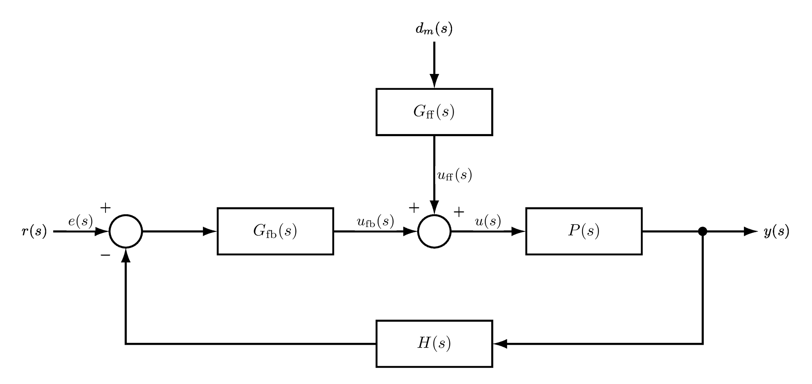

# 单元 4-2 | 控制器选型原理：不同控制结构为何适合不同任务

- **层次**：模块4 理论主线 · 第二课
- **学时**：90分钟
- **知识类型**：[D] 设计型
- **前置**：已完成 `4-1` 的任务表达卡书写，能够区分硬约束、软目标与观察指标，能够用时域、频域和误差语言描述系统当前表现
- **后续**：4-3（基于结构机理的初始方案形成：从选型判断到关键参数方向）、4-4（初始方案验证与失败诊断）
- **讲义定位**：这份讲义不教你"把每种控制器都整定一遍"，而是教你在任务还没进入完整参数设计之前，先说清楚为什么当前任务更适合优先调用哪类单结构、参数第一步先朝什么方向起、预计会得到什么收益、又要为此付出什么代价。

---

## 一、引入：任务表达卡已经写好，为什么还不能直接喊出控制器名字

在 `4-1` 中，我们已经把分析语言压成了一张任务表达卡。现在你知道：

- 当前对象最紧的约束是什么；
- 哪些指标是底线，哪些指标只是优化方向；
- 现有工作点虽然稳定，但未必已经进入任务可接受区域。

很多同学到了这一步，会立刻问一句话：

> "那我到底该用 `PI`、`PD`、`PID`，还是超前、滞后？"

这句话问得太快了。"控制器名字"不是设计起点，真正的起点是**当前最紧的矛盾到底落在哪里**。例如：

- 是稳态误差太大，低频能力明显不够；
- 是速度和超调打架，中频动态品质最紧；
- 是已知扰动反复出现，希望在它进入误差环节前就先补偿；
- 还是系统已经够快，却越来越逼近稳定储备和高频噪声边界。

不先回答这些问题，控制器名称就会退化成经验口号。学生因此会出现三种典型误判：

1. 把 `PID` 当作"更高级所以默认更好"的答案；
2. 只会说"这个结构能改善"，却说不清它主要改善了哪一段频率行为；
3. 只盯着收益，不说明代价从哪里来。

因此，这节课的任务不是记忆控制器大全，而是把模块3中学过的极点、零点、积分、相位、三频段与稳定裕度语言重新组织成一句更适合设计环节的话：

> 这类单结构为什么对当前任务更合适，第一步先往哪里推，它优先改善什么，又会牺牲什么。

### 1.1 从 `4-1` 接过来的不是答案，而是矛盾清单

任务表达卡真正交给本节的输入，不是"最后用什么控制器"，而是下面这五个判断：

表1. `4-1` 交给本节的五个核心判断

| 判断项 | 你现在必须先说清什么 |
| --- | --- |
| 主要矛盾 | 当前首先要救的是低频精度、动态品质、扰动隔离，还是稳定储备 |
| 底线边界 | 哪些指标不能再恶化 |
| 可接受代价 | 为了改善主要矛盾，哪些副作用还能接受 |
| 起步方向 | 第一轮准备先增强哪类作用，是低频补偿、中频相位改善，还是通道补偿 |
| 暂缓决策 | 哪些组合结构与细化参数问题必须留到 `4-3` 再展开 |

一旦这五项写清，控制结构的优先级就不再靠背诵，而是靠理由，而且你也能真正迈出“第一步起步”。

### [AI融入点] 先给出自己的首选，再让 AI 质疑你

请先独立完成下面两步，不要一开始就问 AI：

1. 从 `4-1` 的任务表达卡里圈出"当前最紧的主要矛盾"。
2. 写下你认为的首选单结构，并补一句“第一步参数先朝哪个方向动”。

然后再把你的判断发给 AI，让它只做一件事：**挑错**。要求 AI 反问你：

- 你的结构到底优先改了哪一段频率行为；
- 你写的参数方向，是否真的服务了这个主要矛盾；
- 你有没有忽略它会带来的代价；
- 你是不是把组合结构误当成了第一步默认答案。

最后只保留那些你自己能够解释清楚的修改意见。

---

## 二、控制结构不是名字清单，而是作用机制的工具箱

进入选型环节后，最有用的不是按顺序背 `P`、`PI`、`PD`、`PID`，而是把它们重组成一个工具箱。这个工具箱里，每一类结构都只回答一个问题：

- 它主要调用了什么机制；
- 它优先改善什么任务矛盾；
- 它为什么会连带带来某种代价。

### 2.1 先看最小结构语义

控制器写成一般形式可以记作

$$
C(s)
$$

它与被控对象 $P(s)$ 串联后，开环函数写成

$$
L(s)=C(s)P(s)
$$

选型阶段并不急于求完整参数，而是先看：为了把 $L(s)$ 的低频、中频或通道结构改成任务需要的样子，$C(s)$ 应该优先具备什么特征，以及第一步准备先把哪类作用增强一点。

表2. 结构工具箱总表

| 结构 | 常见形式 | 主要机制 | 优先改善什么 | 常见代价 | 不宜优先用于什么 |
| --- | --- | --- | --- | --- | --- |
| `P` | $C(s)=K$ | 先建立最小可用闭环，整体抬高开环增益 | 快速形成基本反馈闭环，先看系统能不能跟、能不能稳 | 只能粗调，低频精度和动态品质提升都有限 | 需要显著改善稳态误差或动态品质的任务 |
| `PI` | $C(s)=K_p+\dfrac{K_i}{s}$ | 引入积分，提高低频增益 | 减小稳态误差，增强低频跟踪与恒值扰动抑制 | 相位滞后加重，容易拖慢响应或压缩稳定储备 | 动态品质已很紧、相位储备本就吃紧的对象 |
| `PD` | $C(s)=K_p+K_d s$ | 引入微分趋势判断，改善相位与阻尼倾向 | 提升动态品质，减小超调，改善响应利落程度 | 对高频噪声敏感，不能单独解决低频精度问题 | 主要矛盾是稳态误差或持续扰动偏差 |
| `PID` | $C(s)=K_p+\dfrac{K_i}{s}+K_d s$ | 同时补低频与中频 | 当低频精度和动态品质都很紧时，作为组合方案候选 | 结构更复杂，代价和约束也更多；若无理由容易沦为默认答案 | 尚未分清主要矛盾、还没确认组合是否必要时 |
| 超前 | $C(s)=K\dfrac{Ts+1}{\alpha Ts+1},\ 0<\alpha<1$ | 在中频附近提供相位超前 | 提高相角裕度、改善中频动态品质、为提速留空间 | 高频放大倾向增强，对噪声更敏感 | 低频精度明显不足但中频并非主要矛盾时 |
| 滞后 | $C(s)=K\dfrac{Ts+1}{\beta Ts+1},\ \beta>1$ | 更偏向低频增益补偿，尽量少动中频 | 改善低频精度与扰动抑制，同时比"直接猛加增益"更克制 | 会拖慢速度，仍可能侵蚀相位余量 | 需要立刻改善快速性或相位储备的任务 |
| 前馈 | 依对象与通道而定 | 针对已知输入或已测扰动，走通道定向补偿 | 在误差形成前先补偿给定或扰动影响 | 依赖模型和测量质量，不能替代反馈保底 | 把它当成闭环稳定与鲁棒性的主方案 |
| 复合校正 | 由多种结构组合 | 同时处理多个冲突 | 当单一结构无法解释当前任务时，作为下一步设计入口 | 设计复杂度明显上升，未决项更多 | 在还没做优先结构筛选时直接起步 |

这张表的关键不是记形式，而是记住一句话：

> 每一种结构都只是"优先改某一类行为"的工具，不是脱离任务就自动更高级的标签。

### 2.2 四类最小选型语义

把上表再压缩，可以得到更适合判断的四类最小语义。

#### 2.2.1 建立基本闭环

当系统首先缺的是"先形成最小可用反馈闭环"，或者需要先看对象对反馈增益变化是否基本可接受时，`P` 往往是最低门槛的起点。它的价值不是"最终够用"，而是让我们快速看清：

- 对象是否有基本可控趋势；
- 增益上升后稳定与动态的方向会怎样变化；
- 后续更复杂结构有没有继续介入的必要。

#### 2.2.2 补低频能力

当主要矛盾是稳态误差、慢扰动抑制、低频跟踪能力不足时，应该优先想到的是 `PI` 或滞后，而不是先去追求动态改善。它们都在回答同一个问题：

> 怎样让系统在低频段更"有劲"，从而把精度和扰动抑制先托起来。

但这类改善从来不是免费的。低频补强通常伴随相位滞后和速度代价，因此它更适合那些"先把准头补上，再谈更快"的任务。

**最小例子：客船航向保持更像“先补低频”**

若当前对象与比例工作点取为

$$
P_h(s)=\frac{0.01715}{s(s+0.1)(s+2.14375)},
\qquad
C(s)=K_h=2.25,
$$

那么 `4-1` 的现状分析已经表明：系统可以跟踪航向，但超调约为 $32.01\%$，调节时间约为 $83.24\,\text{s}$，而且还要长期面对风浪扰动。这个例子里，教师首先担心的不是“还不够快”，而是“低频保持能力和慢扰动抑制还没有立住”。因此第一轮判断更自然地会落在 `PI/滞后` 上，而不是先靠 `PD` 去追动态速度。

#### 2.2.3 改中频动态品质

当主要矛盾是超调过大、阻尼不足、相位储备紧张、希望提速但又不想直接撞向风险边界时，`PD` 或超前更自然。它们的共同点在于：

- 主要动的是中频附近的相位和动态形状；
- 改善的是响应的利落程度和储备空间；
- 代价则往往转移到高频噪声敏感性和实现复杂度上。

因此，`PD/超前` 更像"动态品质工具"，而不是"精度工具"。

**最小例子：稳定平台更像“先改中频”**

对船载稳定平台，若当前对象与工作点取为

$$
P_p(s)=\frac{2960\left(\frac{s}{15}+1\right)}{s\left(\frac{s}{3}+1\right)\left[(1.7s+1)(0.005s+1)(0.001s+1)+100\right]},
\qquad
C(s)=K_p=5,
$$

则 `4-1` 已经读到：系统调节时间约为 $0.17\,\text{s}$，说明速度并不慢；真正刺眼的是超调约为 $37.55\%$，以及中频储备仍不够从容。这个例子里，首轮应该先整理相位、阻尼和超调，因此更像 `PD/超前` 的任务，而不是“先补低频精度”的任务。

#### 2.2.4 隔离给定或扰动通道

如果给定信号或某类扰动是可预见、可测量、可建模的，就不一定非要等误差形成后再靠反馈慢慢修正。此时前馈的价值会凸显出来：

- 对给定变化较明确的任务，可以先沿给定通道做补偿；
- 对可测扰动，可以在扰动进入主误差回路之前先对冲一部分影响。

但一定要记住：**前馈是补偿，不是保底。** 它不能替代反馈对稳定性、鲁棒性和模型偏差的兜底作用。

**最小例子：已测扰动出现时，问题就变成“通道值不值得补”**

若系统能实时测得某扰动信号 $d_m(s)$，控制输入可写成

$$
u(s)=u_{\mathrm{fb}}(s)+u_{\mathrm{ff}}(s),
\qquad
u_{\mathrm{ff}}(s)=-G_{\mathrm{ff}}(s)d_m(s).
$$

这时首轮判断就不再只是“低频还是中频”，而是“这条可测扰动通道是否值得单独补偿”。若答案是肯定的，前馈就应进入候选；但只要模型不准或存在未知扰动，反馈仍然必须承担保底职责。

### 2.3 `PID` 为什么不是默认起点

最常见的误区，就是把 `PID` 当作"功能最全，所以总该先试试"的默认答案。这种想法在工程上很危险，因为它跳过了最重要的那一步：先确认当前主要矛盾到底是不是同时压在低频精度和中频动态品质上。

只有当下面三个条件同时出现时，`PID` 或复合校正才值得进入首轮候选：

1. 低频精度问题确实显著存在；
2. 动态品质或储备问题也同样紧；
3. 单一结构已经无法充分解释任务需求。

否则，更稳妥的做法是先说清楚"当前优先结构是什么"，把组合结构留给 `4-3` 再进入参数与方向判断。

---

## 三、结构为什么会有收益，也一定会有代价

选型不能只说"这个结构有用"，还必须继续回答：

1. 它到底改了哪一段频率行为；
2. 为什么改了这一段之后，会在别的地方产生代价。

三频段语言和稳定储备语言在这里的真正价值，是作为选型解释工具，而不是独立频域专题。

### 3.1 三频段不是另一个章节，而是一条判断链

从设计视角看，三频段可以压成一句话：

- **低频段**主要关系稳态误差、慢扰动抑制和跟踪精度；
- **中频段**主要关系截止频率、相角裕度和动态品质；
- **高频段**主要关系噪声放大、执行机构负担和高频鲁棒性。

所以控制结构的选择，本质上是在回答：

> 当前最值得先动的是低频、中频还是通道结构，而这次改动会不会在别的频段透支代价。

### 3.2 统一判断链：任务矛盾 -> 频段职责 -> 单结构起步

把选型过程写成可执行步骤，可以得到下面这条统一判断链。

表3. 单结构首轮起步判断链

| 步骤 | 关键问题 | 典型结论 |
| --- | --- | --- |
| 第一步 | 当前最紧的任务矛盾是什么 | 精度不足、动态品质不足、扰动隔离不足、储备不足 |
| 第二步 | 这个矛盾主要落在哪一段频率行为或哪个通道 | 低频、中频、高频约束、给定/扰动通道 |
| 第三步 | 哪类单结构最直接作用于这一段行为 | `PI/滞后`、`PD/超前`、前馈、基础反馈 |
| 第四步 | 第一轮参数先朝哪个方向起 | 先增强低频补偿、先增加中频相位改善、先打开通道补偿 |
| 第五步 | 第一轮最先想验证什么改善 | 误差是否先降、超调是否先压、扰动是否更早被削弱 |
| 第六步 | 这样改会透支什么代价 | 相位余量、速度、噪声敏感性、复杂度 |
| 第七步 | 哪些问题现在仍不能定，必须留到 `4-3` | 复合结构、细化参数、完整方案表达 |

中间任何一步说不清，说明你还没有资格直接跳到控制器名称，更谈不上说自己已经完成了“起步”。

### 3.3 结构作用点 vs 代价来源

表4. 结构作用点与代价来源联读表

| 结构类别 | 主要作用点 | 常见收益 | 代价主要从哪里来 |
| --- | --- | --- | --- |
| `P` | 整体抬高开环水平 | 快速建立闭环，先看趋势 | 只能粗调，进一步改善空间有限 |
| `PI/滞后` | 重点补低频 | 精度更高，慢扰动抑制更强 | 相位滞后增加，可能拖慢动态或压缩储备 |
| `PD/超前` | 重点改中频 | 动态品质更好，提速更有余地 | 高频更敏感，噪声和执行器负担可能上升 |
| 前馈 | 通道定向补偿 | 已知输入/扰动更早被处理 | 依赖模型和测量，偏差一大就失灵 |
| 复合结构 | 跨多个作用点 | 能同时兼顾多类冲突 | 结构复杂，未决参数与边界显著增多 |

这里最重要的一列不是"收益"，而是最后一列。工程设计从来不是比谁能说出更多优点，而是谁能明确知道自己正在拿什么做交换。

### 3.4 稳定储备语言为什么必须跟进来

"既然 `PD/超前` 能改善动态品质，那就一直往这个方向加"——这类说法的问题在于，它默认中频改善不会继续挤压边界。

我们必须把稳定储备翻译成设计语言：

- 相角裕度不是抽象名词，而是"你离动态失控还有多远"；
- 幅值裕度不是课本定义，而是"你还能承受多少模型偏差和增益变化"；
- 储备越紧，越不适合再做激进提速；
- 高频噪声越敏感，越不适合盲目强调微分或超前效应。

因此，任何"我要更快"的选型判断，都必须带上后一半句：

> 更快以后，我是否还保得住储备和抗噪声边界？

### 3.5 反馈保底 vs 前馈补偿

前馈很容易被误解成"既然可以提前补偿，那是不是就不用费劲做反馈了"。这个理解必须在这里就压住。

反馈和前馈在设计职责上完全不同：

- **反馈**负责保底：模型有偏差、外界有未知扰动时，它仍然要把系统拉回去；
- **前馈**负责定向补偿：已知通道、已知规律、已知信号可以尽量提前处理。

前馈适合回答"我能否让已知影响少走弯路"，但它不适合回答"系统靠什么保证稳定和鲁棒"。

把两者混为一谈，你以为自己在做"更聪明的控制"，其实是在拿保底能力去赌模型精确度。

---

## 四、把规则落到三个最小案例上

结构工具箱和判断链都已经具备。下面不再空讲原则，而是把它们压到三个最小案例里：一个更像 `PI/滞后` 的场景，一个更像 `PD/超前` 的场景，以及一个前馈值得出现的场景。

### 4.1 案例 A：客船航向保持，为什么首轮更像 `PI/滞后`

#### 4.1.1 背景与当前模型

设客船接到 $10^\circ$ 航向修正指令，同时持续受到风浪扰动。当前对象与比例工作点取自 `4-1`：

$$
P_h(s)=\frac{0.01715}{s(s+0.1)(s+2.14375)},
\qquad
C(s)=K_h=2.25.
$$

对应的开环函数为

$$
L_h(s)=\frac{0.0385875}{s(s+0.1)(s+2.14375)}.
$$

#### 4.1.2 先看“问题长什么样”

{width=100%}

这张图在 `4-1` 用来写任务表达卡；到了 `4-2`，它的用途变成“拿证据支持首轮选型”。先只读三个结论：

- **时域**：超调约为 $32.01\%$，调节时间约为 $83.24\,\text{s}$。系统不是不能跟踪，而是“能跟上，但过程太冲、太拖”。
- **复平面/根轨迹**：当前闭环极点还在舒适导向可行域之外，说明“稳定”不等于“任务上可接受”。
- **频域**：截止频率约为 $0.1169\,\text{rad/s}$，相角裕度约为 $37.43^\circ$。系统并非没有储备，但余量并不宽松。

#### 4.1.3 用判断链做第一轮选型

现在沿着统一判断链走一遍：

1. **当前最紧矛盾是什么？**  
   不是单纯“还想更快”，而是“既要把持续扰动下的保持能力托起来，又不能把平顺和储备继续压坏”。
2. **矛盾主要落在哪一段？**  
   首先落在低频能力，因为航向保持精度和慢扰动抑制都属于低频问题。
3. **哪类结构更直接？**  
   `PI/滞后` 更直接，因为它们优先补低频增益。
4. **代价会从哪里来？**  
   相位会更吃紧，速度也未必立刻变好，因此后面必须回头检查储备。

所以这个案例里，首轮更合理的写法不是“系统慢，所以加 `PD` 提速”，而是：

> 先用 `PI` 或滞后把低频能力补起来，参数方向上先沿“增强低频补偿”的方向起步，让航向保持和慢扰动抑制先站稳；至于如何兼顾更快与更稳，要留到 `4-3` 再判断是否需要组合结构。

表5. 案例 A 的单结构首轮起步卡

| 字段 | 内容 |
| --- | --- |
| 当前任务 | 客船在风浪扰动下完成航向修正并保持平顺 |
| 最紧矛盾 | 低频精度与慢扰动抑制不足，同时不能继续恶化平顺与储备 |
| 首选单结构 | `PI` 或滞后 |
| 参数先朝哪个方向动 | 先增强低频补偿作用，让低频增益往“更能托住精度与慢扰动抑制”的方向移动 |
| 结构证据 | 主要补低频增益，直接服务稳态精度与慢扰动抑制 |
| 首先验证什么改善 | 持续扰动下偏差是否先减小，航向保持是否先更稳 |
| 预期收益 | 航向保持能力增强，持续扰动下偏差减小 |
| 明示代价 | 相位余量可能继续变紧，调节时间未必立即缩短 |
| 暂不优先结构 | `PD/超前`，因为它先改中频，不能单独解决低频保持问题 |
| 验证假设 | 若低频补偿起步是对的，先看到的应是保持误差下降，而不是速度立刻明显提升 |
| 留给 `4-3` 的问题 | 是否需要再组合动态改善结构，以及如何把“低频先补强”写成完整方案骨架 |

### 4.2 案例 B：稳定平台姿态恢复，为什么首轮更像 `PD/超前`

#### 4.2.1 背景与当前模型

设船载稳定平台要快速压住外界扰动带来的俯仰偏差。当前对象与工作点同样取自 `4-1`：

$$
P_p(s)=\frac{2960\left(\frac{s}{15}+1\right)}{s\left(\frac{s}{3}+1\right)\left[(1.7s+1)(0.005s+1)(0.001s+1)+100\right]},
\qquad
C(s)=K_p=5.
$$

#### 4.2.2 先看“问题长什么样”

{width=100%}

这次同样先读三个结论：

- **时域**：调节时间约为 $0.17\,\text{s}$，已经很快，但超调约为 $37.55\%$，过程偏冒进。
- **复平面/根轨迹**：主导极点尚未进入“高速度且高阻尼”的目标区域，说明当前主要问题不是慢，而是阻尼还不够理想。
- **频域**：截止频率约为 $31.07\,\text{rad/s}$，相角裕度约为 $39.69^\circ$，增益裕度约为 $12.86\,\text{dB}$。速度优势已经建立，但再往前冲会明显牵动中频储备。

#### 4.2.3 用判断链做第一轮选型

现在再走一遍同样的判断链：

1. **当前最紧矛盾是什么？**  
   不是“精度太差”，而是“已经够快，但动态品质和阻尼不够理想”。
2. **矛盾主要落在哪一段？**  
   落在中频附近，因为这里直接牵动截止频率、相角裕度和超调。
3. **哪类结构更直接？**  
   `PD/超前` 更直接，因为它们优先整理中频相位和阻尼倾向。
4. **代价会从哪里来？**  
   高频噪声更敏感，储备也可能进一步被压缩。

所以这个案例里，若第一句话就写“先上 `PI` 提高精度”，就抓错了主要矛盾。更合理的写法应是：

> 先用 `PD` 或超前把中频动态品质整理出来，参数方向上先沿“增强中频相位改善”的方向起步，让系统在保持高速优势的同时降低超调；若后续仍发现低频精度不足，再到 `4-3` 讨论是否需要组合低频补偿结构。

表6. 案例 B 的单结构首轮起步卡

| 字段 | 内容 |
| --- | --- |
| 当前任务 | 稳定平台快速压住姿态扰动并避免过程峰化过大 |
| 最紧矛盾 | 速度已经建立，但阻尼和中频动态品质仍不够理想 |
| 首选单结构 | `PD` 或超前 |
| 参数先朝哪个方向动 | 先增强中频相位改善作用，让阻尼与动态品质优先被整理 |
| 结构证据 | 优先整理中频相位与阻尼，直接作用于超调、相角裕度和动态利落度 |
| 首先验证什么改善 | 超调是否先被压低，动态过程是否先变得更利落 |
| 预期收益 | 在保住当前速度优势的同时，把超调压下来 |
| 明示代价 | 高频噪声更敏感，储备可能继续收紧 |
| 暂不优先结构 | `PI`，因为此刻最紧的不是低频静态精度问题 |
| 验证假设 | 若中频起步方向正确，先看到的应是超调和阻尼改善，而不是低频精度自动被补齐 |
| 留给 `4-3` 的问题 | 是否需要组合低频补偿，以及如何把“中频先整理”升级成完整方案骨架 |

### 4.3 补充判断：已测扰动出现时，为什么前馈值得进入候选但不能抢主线

#### 4.3.1 背景与结构图

再看一个更短的小例子：某对象已经有反馈闭环，但现在又多了一类**可测扰动**。例如平台系统能测到某条外界扰动通道，或者执行前已经知道一段给定输入轮廓。此时控制输入可写成

$$
u(s)=u_{\mathrm{fb}}(s)+u_{\mathrm{ff}}(s),
\qquad
u_{\mathrm{ff}}(s)=-G_{\mathrm{ff}}(s)d_m(s).
$$

其结构可直观看成下面这类“补偿支路另走一条通道”的形式：

{width=84%}

#### 4.3.2 这个例子为什么能帮助选型

这个补充例子的重点不是计算出某个前馈参数，而是帮助你识别：**当前问题是不是一条通道问题**。如果主要麻烦来自“某类已知扰动每次都从同一个入口把系统推出去”，那么它既不只是低频精度问题，也不只是中频相位问题，而是“是否值得沿该通道单独补偿”的问题。

因此这里的首轮判断应写成：

1. 反馈继续保底，负责模型不准和未知扰动；
2. 若可测扰动通道稳定、重复且有模型，则前馈值得加入候选；
3. 若扰动不可测、模型偏差大，或者主要矛盾其实仍在低频/中频，则不应把前馈写成主角。

表7. 前馈补充判断卡

| 字段 | 内容 |
| --- | --- |
| 当前任务 | 已有反馈闭环，但存在一条可测、重复出现的扰动通道 |
| 最紧矛盾 | 扰动入口明确，希望在误差形成前先削弱其影响 |
| 补充结构 | 前馈作为补充结构 |
| 参数先朝哪个方向动 | 先决定是否打开这条通道补偿，而不是先把反馈主结构整体重写 |
| 结构证据 | 作用点不在“补低频”或“改中频”，而在于沿已知通道提前补偿 |
| 首先验证什么改善 | 扰动进入后，误差峰值或修正负担是否更早下降 |
| 预期收益 | 扰动影响更早被削弱，反馈环节的修正负担下降 |
| 明示代价 | 效果依赖模型与测量质量，不能替代反馈保底 |
| 验证假设 | 若通道补偿值得保留，应先看到已测扰动的影响被提前削弱，而不是所有问题都自动消失 |
| 留给 `4-3` 的问题 | 前馈与反馈如何配合，补偿强度和带宽边界如何确定 |

### 4.4 三个案例放在一起时，你真正该记住什么

把三个案例并排看，规律就很清楚了：

1. 客船航向保持的第一矛盾更像低频能力问题，因此首轮更偏 `PI/滞后`；
2. 稳定平台姿态恢复的第一矛盾更像中频动态品质问题，因此首轮更偏 `PD/超前`；
3. 已测扰动存在时，问题会转化为通道补偿问题，因此前馈应作为补充候选进入视野。

所以，真正稳定的判断方法不是背“哪个对象配哪个控制器”，而是先把问题归类成：

- 低频问题；
- 中频问题；
- 通道问题；
- 或储备/噪声边界问题。

一旦归类清楚，首轮候选结构往往就自然浮现出来。

---

## 五、把选型结论写成一张"单结构首轮起步卡"

本节的最终产物不应是参数表，而应是一张能交给 `4-3` 继续推进的"单结构首轮起步卡"。卡片的作用是：在还没有进入完整整定之前，先把"为什么优先选它、第一步准备先往哪边起、先验证什么"写得足够可辩护。

### 5.1 单结构首轮起步卡模板

表8. 单结构首轮起步卡模板

| 字段 | 应填写的内容 |
| --- | --- |
| 当前任务 | 对象是谁，当前主要要解决什么问题 |
| 最紧矛盾 | 精度、动态品质、扰动隔离、储备与噪声中，哪一个最紧 |
| 首选单结构 | 当前优先考虑哪一类单结构 |
| 参数先朝哪个方向动 | 第一轮准备先增强哪类作用，而不是直接报完整参数值 |
| 结构证据 | 它主要调用了什么机制，作用点落在哪一段频率行为或哪个通道 |
| 首先验证什么改善 | 第一轮最想先看到哪条现象发生变化 |
| 预期收益 | 先希望改善什么 |
| 明示代价 | 预计会牺牲什么，边界可能在哪里收紧 |
| 暂不采用的结构 | 至少写出一个当前不宜优先采用的结构及理由 |
| 验证假设 | 如果这一步起对了，最先应该看到什么；如果没看到，优先怀疑哪里 |
| 留给 `4-3` 的问题 | 哪些组合条件、细化参数与复合结构决策暂不在本课完成 |

### 5.2 三种最常见错误写法

为了避免这张卡变成空话，下面三种写法必须主动排除。

#### 错误一：只写控制器名字，不写起步理由

例如只写"首选 `PI`"，但不说明为什么低频精度是主要矛盾，也不说明第一步为什么要先补低频。这类答案看起来有结论，其实没有起步依据。

#### 错误二：只写结构，不写参数方向与验证假设

例如写"用超前起步"，却不补上“第一轮先增强中频相位改善”和“先看超调是否下降”。这类答案会把“起步”重新退回空口号。

#### 错误三：只写收益，不写代价

例如写"超前能提速"，却不补上"但会提高高频敏感性，并继续消耗储备"。这类答案会把控制设计误讲成"只要有优点就能一直叠加"。

#### 错误四：把组合结构写成偷懒答案

例如直接写"用 `PID` 总能兼顾各方面"。这等于跳过了最关键的筛选环节，也会让 `4-3` 失去继续展开的起点。

### 5.3 学完本节，你能做什么，又刻意不做什么

学完本节，你应该能够做到：

1. 从任务表达卡出发筛选首轮候选结构；
2. 用结构机理解释选型理由，而不是靠背诵；
3. 写出单结构首轮起步的参数方向，并说清它为什么服务当前主要矛盾；
4. 写下一条第一轮验证假设，知道自己准备先看什么改善；
5. 判断什么时候只需单一结构优先，什么时候必须留到下一课再讨论复合结构。

本节**刻意不做**以下事情：

- 不进入参数整定步骤；
- 不进入自动求优或多目标优化流程；
- 不把 `PID/复合校正` 讲成万能默认答案；
- 不把三频段和稳定裕度重新讲成独立专题。

`4-2` 先把"为什么选、第一步往哪里起"站稳，`4-3` 再把"单结构不够时怎样长成可验证方案"接上。

### [AI融入点] 让 AI 帮你做"反方辩手"，不是替你给答案

请任选一个场景，用下面的格式先写出自己的单结构首轮起步卡，再交给 AI：

> 我当前的任务是……
> 我判断最紧的矛盾是……
> 我首选的单结构是……
> 我准备先把参数朝……这个方向起步……
> 我的理由是……
> 我先想验证……是否改善……
> 我预计的代价是……
> 我暂时不选……，因为……

然后要求 AI 不要直接改写你的答案，而是扮演"反方辩手"，只追问两类问题：

1. 你说的参数方向，到底落在哪一段频率行为或哪个通道；
2. 你先想验证的现象，是否真的对应当前主要矛盾；
3. 你有没有低估这个结构的代价，或者错把组合结构当默认起点。

最后你要自己完成修订，而不是照抄 AI 的重写版本。

---

## 六、本节小结

1. 本节的核心不是背控制器名称，而是学会把结构机理翻译成单结构首轮起步理由。
2. `P/PI/PD/PID/超前/滞后/前馈/复合校正` 应被看成作用机制工具箱，而不是平铺直叙的控制器百科。
3. 选型判断必须沿着"任务矛盾 -> 频段职责/通道结构 -> 单结构优先级 -> 参数起步方向 -> 代价检查"这条链往下走。
4. `PI/滞后` 更常服务低频精度与扰动抑制，`PD/超前` 更常服务中频动态品质，前馈服务可测通道补偿，`PID/复合校正` 则应作为单一结构不足后的组合结果。
5. 本节的正式产物是"单结构首轮起步卡"，而不是参数结果表；完整方案骨架与复合结构起步留给 `4-3`。

> 如果说 `4-1` 回答的是"任务到底想要什么"，那么 `4-2` 回答的就是"既然任务已经写清，我们为什么先优先调用这类单结构、第一步先往哪里起"。下一课 `4-3`，我们将把这种起步继续推进成"单结构不够时，初始方案怎样长成可验证的复合结构骨架"。

---

## 课后练习

1. 以"客船航向控制"或"船载稳定平台"为对象，补写一张完整的单结构首轮起步卡，要求至少写出一个首选单结构、一个参数起步方向、一个验证假设，以及一个暂不优先结构。
2. 判断下面三句话哪里有问题，并改写成更合理的设计表达：
   - "既然 `PID` 最全，就先从 `PID` 开始。"
   - "前馈能提前补偿，所以比反馈更高级。"
   - "只要用了超前，系统就一定更快更稳。"
3. 任选一个你熟悉的控制对象，尝试把它的主要矛盾先压成"低频问题 / 中频问题 / 通道问题 / 储备问题"四类之一，并解释你的分类依据。
