# 单元 4-3 | 经典复合控制的初始方案落地：从单结构候选到工程可运行方案

- 课程：自动控制原理
- 层次：模块 4 实践主线 · 第三课
- 学时：90分钟
- 知识类型：[D] 设计型
- 前置：已能把控制任务写成任务表达卡，并能用单结构控制器完成首轮选型与整定
- 讲义定位：这份讲义帮助我们把单结构候选推进为包含前馈、滤波、限幅与抗饱和的经典复合控制初始方案。

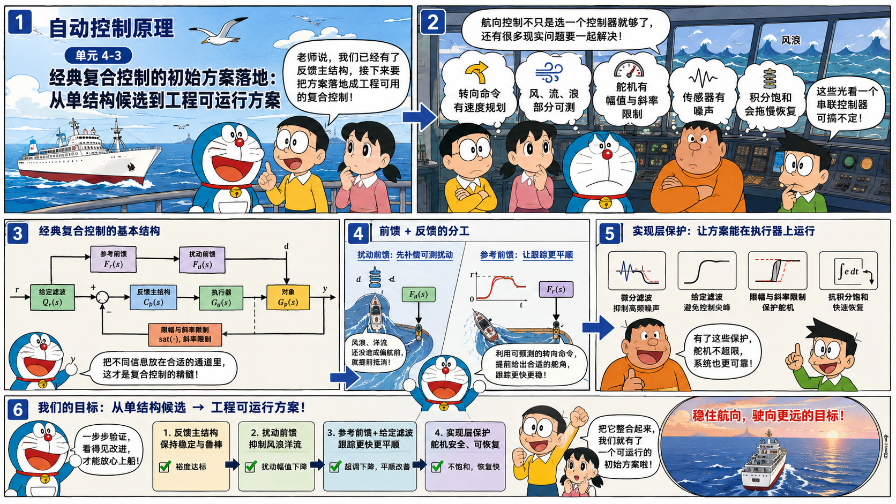

## 一、从单结构候选进入复合控制问题

客船航向保持的任务已经不再停留在“选哪种控制器”。前面的分析已经给出任务表达卡，也已经用决策树比较了滞后、`PI`、超前与超前-滞后等候选结构。现在更关键的问题是：当单个串联校正结构已经能改善一部分指标，却仍无法同时处理平顺性、抗扰性、控制量约束和工程实现风险时，方案应怎样继续落地。

4-2 中的客船候选结果可以压缩成下面这张接力表。

表 1. 单结构候选留下的设计缺口

| 候选结构 | 已经改善的方面 | 暴露出的缺口 | 进入 4-3 后的动作 |
| --- | --- | --- | --- |
| 滞后 | 低频灵敏度略有改善 | 相角裕度下降，超调和调节时间变差 | 不再把低频补偿单独推强 |
| `PI` | 具备消除静差的能力 | 保守初算使响应过慢，扰动峰值没有改善 | 积分只作为基本结构的一部分进入工程实现 |
| 超前 | 超调和调节时间明显改善 | 控制量增大，低频抗扰仍需复核 | 可作为反馈主结构的起点 |
| 超前-滞后 | 动态指标较优，兼顾一定低频补偿 | 低频补偿仍未充分，参数之间互相牵动 | 可作为基本串联结构，但还需要额外通道 |
| 前馈 | 可提前补偿参考或可测扰动 | 不改变反馈闭环稳定性，依赖模型与测量 | 与反馈主结构复合使用 |

这张表说明，继续重复“主要矛盾是什么、因此选哪种结构”已经没有足够增量。此时要处理的是更复杂的工程控制场景：

- 航向给定可能不是理想阶跃，而是带速度规划的转向命令；
- 风、流、浪或负载变化中的一部分可以测量或估计；
- 舵机存在幅值限制和变化率限制；
- 传感器存在噪声，微分或强超前会放大高频成分；
- 积分环节在饱和时会继续累积，造成恢复过程变慢甚至反向冲击。

这些问题只看开环 Bode 图和一个串联校正器很难完整处理。经典复合控制的意义，是在已有反馈主结构之外增加信息通道和工程保护环节，使方案从“理论上能改善曲线”推进到“工程上可以运行”。

## 二、狭义复合控制与广义复合控制

“复合控制”这个词在不同教材中有宽窄两种用法。进入设计前，应先把边界分清。

表 2. 两种复合控制口径

| 口径 | 核心含义 | 本次课程如何使用 |
| --- | --- | --- |
| 狭义复合控制 | 开环前馈与闭环反馈并用，典型形式是按输入前馈补偿或按扰动前馈补偿 | 本次课程的核心内容，重点讨论反馈主结构与参考/扰动前馈的组合 |
| 广义复合控制 | 在单回路串联校正之外，引入额外信息通道、局部回路、选择逻辑、模型补偿、观测估计或工程保护 | 本次只取其中最基础的实现层复合，如微分滤波、给定滤波、抗积分饱和、限幅和斜率限制 |

本次课程不展开串级控制、解耦控制、Smith 预估、扰动观测器、`MPC` 等复杂工程控制结构。这些方法同样属于广义复合控制，但它们需要更多对象模型、状态变量、约束求解或多变量分析，适合放到后续课程中处理。

完成本次课程后，学习者能够：

1. 区分狭义复合控制与广义复合控制，并说明本次只处理哪些结构。
2. 在已有 `PID` 或超前-滞后等基本反馈结构上，写出参考前馈与扰动前馈的复合表达。
3. 解释传统串联校正 Bode 分析在前馈、限幅、抗饱和和给定滤波场景中的局限。
4. 为一个复杂航向控制任务写出“反馈主结构 + 前馈通道 + 实现保护”的初始方案。
5. 用首轮验证记录说明哪些指标已经改善，哪些问题应移交给后续参数优化。

## 三、基本串联结构作为反馈主结构

本次课程不重新讲 `PID`、超前和超前-滞后的整定公式。它们已经是可调用的基本结构。现在需要改变的是使用方式：先把其中一个结构作为反馈主结构，再判断是否需要加入前馈和工程实现环节。

单位反馈下的基本串联校正常写成

$$
u_f=C(s)(r-y),
$$

其中 $C(s)$ 可以是 `PID`、超前-滞后或其他已整定的反馈控制器。它通过开环函数

$$
L(s)=C(s)G(s)
$$

改变闭环速度、相角裕度、超调和稳态误差。这个分析仍然重要，因为反馈主结构负责稳定性、鲁棒性和未测扰动修正。

问题在于，真实控制任务中的信号通常不止 $r-y$ 一个误差信号。若扰动 $d$ 可测，若参考轨迹 $r$ 可预测，若执行器会饱和，若传感器噪声明显，控制律就会从单一串联结构变成

$$
u=\operatorname{sat}\left(
C(s)(r_f-y)+F_r(s)r+F_d(s)d
\right),
$$

其中 $r_f$ 是滤波后的给定，$F_r(s)$ 是参考前馈，$F_d(s)$ 是扰动前馈，$\operatorname{sat}(\cdot)$ 表示执行器限幅。这个表达式已经超出传统“只看 $L(s)$”的单回路分析范围。

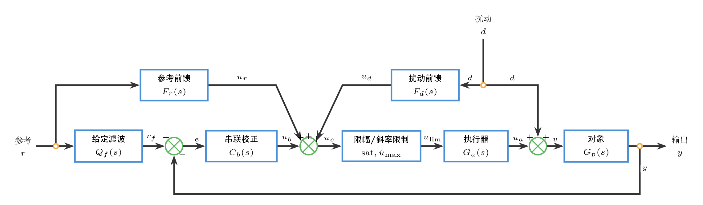

这张框图把经典复合控制的几个入口放在同一张结构中：参考信号可以先经过给定滤波，也可以通过参考前馈直接进入控制输入端；可测扰动既可在执行器之后、对象之前进入被控过程，也可以通过扰动前馈提前补偿；反馈主结构仍围绕误差信号工作；执行器前端还要经过限幅和斜率限制。它说明复合控制不是把一个更复杂的 $C(s)$ 串到误差后面，而是把不同信息分别放到合适的通道中。

## 四、前馈与反馈的经典复合

### 4.1 扰动前馈与反馈的分工

设输出由控制输入 $u$ 和扰动 $d$ 共同决定：

$$
y=G_u(s)u+G_d(s)d.
$$

反馈控制器为

$$
u_f=C(s)(r-y).
$$

当扰动 $d$ 可以测量时，可以加入扰动前馈：

$$
u=C(s)(r-y)+F_d(s)d.
$$

代入对象方程可得扰动到输出的通道：

$$
\frac{y(s)}{d(s)}=
\frac{G_u(s)F_d(s)+G_d(s)}{1+G_u(s)C(s)}.
$$

如果希望主要频段内扰动影响被抵消，理想前馈为

$$
F_d(s)=-\frac{G_d(s)}{G_u(s)}.
$$

这个公式体现了前馈和反馈的分工：前馈在扰动尚未造成明显误差前先给出补偿，反馈负责稳定、鲁棒和残余误差修正。前馈不能替代反馈，因为它不知道补偿是否真的成功，也无法处理未测扰动和模型误差。

### 4.2 参考前馈与给定通道塑形

当参考轨迹已知时，也可以加入参考前馈：

$$
u=C(s)(r-y)+F_r(s)r.
$$

此时参考到输出的传递关系变为

$$
\frac{y(s)}{r(s)}=
\frac{G_u(s)\left(C(s)+F_r(s)\right)}
{1+G_u(s)C(s)}.
$$

理想上希望 $G_u(s)F_r(s)\approx 1$，所以常写成

$$
F_r(s)\approx G_u^{-1}(s).
$$

工程实现中不能盲目使用完美逆模型。若对象存在非最小相位零点、纯滞后、高频噪声或执行器限制，直接逆模型会不可实现或过于激进。更常用的写法是

$$
F_r(s)=Q(s)G_u^{-1}(s),
$$

其中 $Q(s)$ 是低通滤波器，用来限制高频和控制峰值。

### 4.3 Bode 串联校正的局限

Bode 图仍然适合分析反馈主环路的 $L(s)=C(s)G(s)$，但它不能单独回答全部复合控制问题。

表 3. 单一 Bode 分析难以覆盖的内容

| 新增结构 | Bode 主环路能说明什么 | 还需要额外检查什么 |
| --- | --- | --- |
| 扰动前馈 | 反馈环路稳定性和裕度 | $G_uF_d+G_d$ 是否真的抵消，模型误差是否会过补偿 |
| 参考前馈 | 反馈通道的鲁棒性 | 给定变化是否造成控制尖峰，逆模型是否可实现 |
| 给定滤波 | 滤波后反馈环路仍稳定 | 跟踪速度和平顺性是否可接受 |
| 限幅与斜率限制 | 线性范围内的频域性能 | 饱和后闭环是否变慢、积分是否 windup、执行器是否频繁贴边 |
| 微分滤波 | 中频相位改善趋势 | 高频噪声和传感器量化误差是否被放大 |

因此，复合控制的首轮验证必须同时看四类证据：反馈主环路裕度、参考响应、扰动响应、控制量轨迹。只看开环 Bode 图，会漏掉前馈抵消、限幅、斜率限制和积分饱和带来的真实行为。

## 五、实现层复合：让方案能在执行器上运行

狭义复合控制解决“前馈和反馈怎样并用”。工程实现层复合解决“这套控制律能不能在真实设备上运行”。这些环节不一定改变主控制思想，但会直接决定系统是否稳定、平顺和可恢复。

### 5.1 微分滤波与输出微分

理想 `PID` 中的微分项为 $K_pT_ds$，高频增益随频率无限增大。实际常采用带滤波的微分：

$$
C_D(s)=K_p\frac{T_ds}{1+\frac{T_d}{N}s},
$$

其中 $N$ 为微分滤波系数。$N$ 越大，微分越接近理想形式，但噪声风险也越高。

给定阶跃进入误差微分时，会产生微分冲击。更稳妥的工程写法是让微分作用在输出上，而不是作用在误差上：

$$
u_D=-K_p\frac{T_ds}{1+\frac{T_d}{N}s}y.
$$

这相当于保留对输出变化的阻尼作用，同时避免给定突变直接打到微分通道。

### 5.2 给定滤波与二自由度思想

若参考命令变化很快，单靠反馈主结构会在控制量上产生尖峰。可以先对给定做滤波：

$$
r_f(s)=\frac{1}{T_fs+1}r(s).
$$

控制律写成

$$
u=C(s)(r_f-y)+F_r(s)r.
$$

这里反馈看到的是更平滑的 $r_f$，参考前馈仍可利用原始参考 $r$ 的可预测信息。这个写法体现了二自由度思想：参考通道和反馈通道不必完全共用同一个信号。

### 5.3 限幅、斜率限制与抗积分饱和

执行器通常同时有幅值限制和变化率限制：

$$
u_{\min}\le u \le u_{\max},\qquad
|\dot u|\le \dot u_{\max}.
$$

若控制器计算出的 $u$ 超出边界，实际进入对象的是

$$
u_{\text{act}}=\operatorname{sat}(u).
$$

此时若积分项仍按原误差持续累积，就会出现积分饱和。反算抗饱和的核心做法，是把执行器“实际给出的控制量”和控制器“原本计算出的控制量”之间的差额反馈到积分通道：

$$
\dot x_i=e+\frac{u_{\text{act}}-u}{T_{aw}},
$$

其中 $x_i$ 是积分状态，$T_{aw}$ 是抗饱和回算时间常数。当执行器饱和时，实际控制量 $u_{\text{act}}$ 的幅值小于控制器计算出的 $u$，因此 $u_{\text{act}}-u$ 与原误差造成的积分推动方向相反。用于积分的等效误差被修正为更小的量，积分作用随之减弱，积分状态不再继续按不可实现的控制需求累积。

表 4. 实现层复合环节的作用

| 环节 | 处理的问题 | 首轮验证要看什么 |
| --- | --- | --- |
| 微分滤波 | 限制高频噪声和微分冲击 | 控制量是否抖动，传感器噪声是否被放大 |
| 给定滤波 | 避免参考突变导致控制尖峰 | 跟踪是否变慢，超调是否下降 |
| 输出微分 | 避免设定值微分冲击 | 给定突变时控制量是否平滑 |
| 输出限幅 | 防止执行器超出物理边界 | 是否长期贴边，是否破坏调节时间 |
| 斜率限制 | 防止执行器动作过快 | 控制量变化率是否超限，响应是否拖慢 |
| 抗积分饱和 | 防止积分状态在饱和时继续累积 | 饱和解除后是否快速恢复，是否出现反向冲击 |

这些环节属于广义复合控制中的实现层复合。本次课程只要求会把它们纳入初始方案，不要求展开复杂保护逻辑、选择控制或多回路控制。

## 六、锚点案例：客船航向控制的经典复合方案

### 6.1 对象、扰动加入点与反馈主结构

客船航向保持的舵角到航向通道仍采用

$$
G_u(s)=\frac{0.01715}{s(s+0.1)(s+2.14375)}.
$$

为了明确扰动加入点，把这个通道拆成执行器和被控对象两部分：

$$
G_a(s)=\frac{0.01715}{s+2.14375},\qquad
G_p(s)=\frac{1}{s(s+0.1)},\qquad
G_u(s)=G_a(s)G_p(s).
$$

海浪和洋流不经过舵机，而是在执行器之后、对象之前进入被控过程。因此扰动到航向的通道只有大惯性和积分环节：

$$
G_d(s)=G_p(s)=\frac{1}{s(s+0.1)}.
$$

输出关系应写成

$$
y=G_p(s)\bigl(G_a(s)u+d\bigr)
=G_u(s)u+G_d(s)d.
$$

这一路径意味着反馈控制量必须先经过执行器动态，扰动则直接进入对象输入端。反馈主结构沿用 4-2 的超前-滞后候选：

$$
C_b(s)=
\frac{1.338(13.91s+1)(109.05s+1)}
{(5.94s+1)(196.29s+1)}.
$$

扰动信号取

$$
d(t)=0.004+0.003\sin(0.08t),
$$

其中常值项代表稳定洋流，正弦项代表低频海浪。这个任务已经不再是单纯改善阶跃响应，而是要在同一个反馈主结构上依次加入扰动前馈、参考前馈、给定滤波和执行器保护。

### 6.2 扰动前馈：先补偿可测扰动

先不加入参考前馈，只考虑可测扰动补偿。控制律为

$$
u=C_b(s)(r-y)+F_d(s)d.
$$

代入对象方程可得扰动到输出的通道：

$$
\frac{y(s)}{d(s)}=
\frac{G_u(s)F_d(s)+G_d(s)}
{1+G_u(s)C_b(s)}.
$$

若模型完全准确，希望 $G_uF_d+G_d=0$。由于 $G_u=G_aG_p$ 且 $G_d=G_p$，理想扰动前馈为

$$
F_d^\ast(s)=-\frac{G_d(s)}{G_u(s)}
=-\frac{1}{G_a(s)}
=-\frac{s+2.14375}{0.01715}.
$$

完全抵消相当于直接近似执行器逆模型，对模型误差和执行器能力都过于敏感。本例先同时观察 $100\%$ 与 $75\%$ 两种前馈强度；后续复合方案采用较保守的 $75\%$ 前馈强度，并加入一阶低通：

$$
F_d(s)=
\frac{-43.73(s+2.14375)}{8s+1}.
$$

对于常值洋流 $d(t)=d_0$，稳态前馈舵角趋近 $u_d=-93.75d_0$；对于正弦海浪 $A\sin \omega t$，前馈会同时体现执行器逆近似和一阶滤波，不把高频扰动直接放大到舵角。

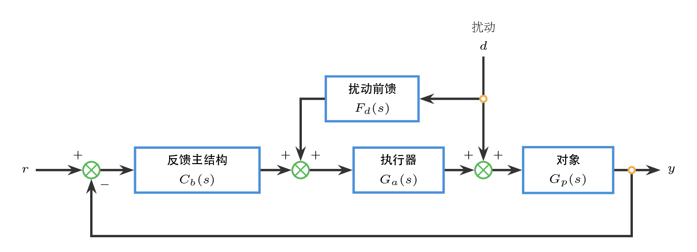

仿真中参考信号保持为零，扰动信号取 $0.004+0.003\sin(0.08t)$，从而单独观察扰动前馈的作用。图中同时给出无前馈、$75\%$ 前馈强度和 $100\%$ 前馈强度三种结果；后续小节沿用 $75\%$ 前馈强度。

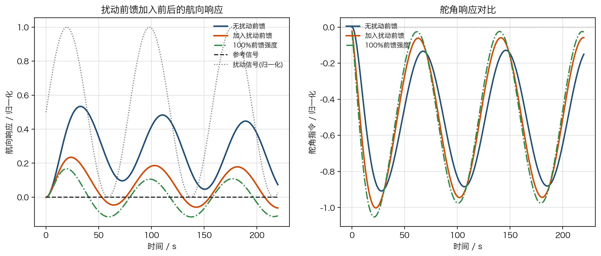

加入扰动前馈后，反馈控制器不必等航向偏差明显出现后再修正，低频扰动造成的偏移被提前压低。$100\%$ 强度的抵消更强，但对模型误差和执行器能力更敏感；$75\%$ 强度保留部分反馈修正余量，适合作为后续组合的基础。舵角曲线中会出现与扰动同频的补偿成分，这是前馈正在工作的证据；若这部分舵角过大，应优先降低前馈强度或增大扰动前馈滤波时间常数。

### 6.3 参考前馈：在变化给定下减少反馈滞后

在保持扰动前馈的基础上，加入参考前馈：

$$
u=C_b(s)(r-y)+F_r(s)r+F_d(s)d.
$$

参考前馈的目的，是在参考变化阶段提前给出操舵趋势。这里使用对象低频近似，是因为参考通道只需要补偿主要慢变化趋势，而不应把高频逆模型直接放进前馈。对

$$
G_u(s)=\frac{0.01715}{s(s+0.1)(s+2.14375)}
$$

而言，当参考变化频率远低于 $0.1$ 和 $2.14375$ 对应的转折频率时，可把 $(s+0.1)$ 和 $(s+2.14375)$ 近似为常数 $0.1$ 与 $2.14375$，得到

$$
G_u(s)\approx \frac{0.01715}{0.1\times 2.14375}\frac{1}{s}
\approx \frac{0.08}{s}.
$$

因此参考通道的低频逆模型可取 $12.5s$。同样先比较 $100\%$ 与 $75\%$ 两种前馈强度；后续仍保留 $75\%$ 的前馈强度，并用一阶低通限制高频：

$$
F_r(s)=\frac{9.375s}{8s+1}.
$$

这个表达式的含义是：参考变化越快，前馈越早给出操舵趋势；参考保持不变时，参考前馈逐渐回到零，稳态精度仍交给反馈闭环保证。

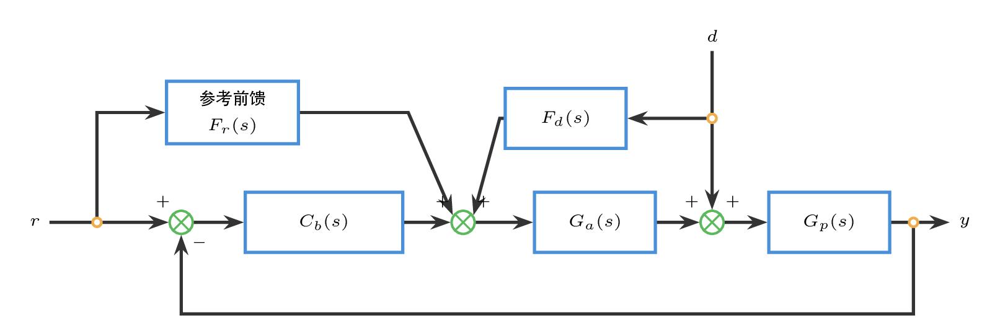

仿真中参考信号采用余弦速度规划的航向变化，扰动通道和扰动信号与前一小节保持一致。图中同时比较无参考前馈、$75\%$ 参考前馈强度和 $100\%$ 参考前馈强度；后续小节沿用 $75\%$ 强度。

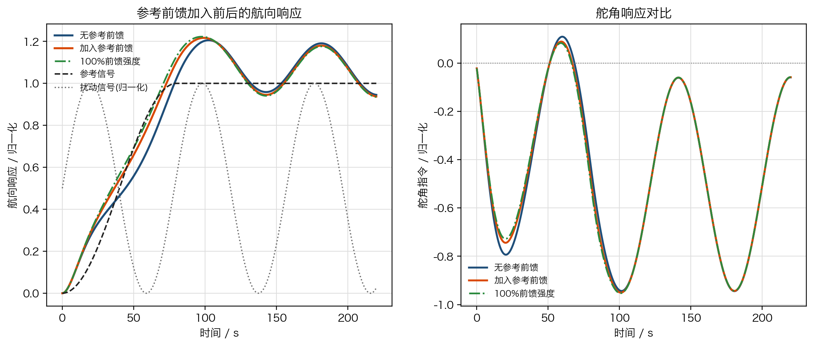

加入参考前馈后，航向变化初段的跟随滞后减小，舵角会提前出现与参考变化相匹配的动作。$100\%$ 强度能进一步减少滞后，但更容易把参考变化转化为较大的前馈舵角；$75\%$ 强度保留较多反馈校正余量。若舵角峰值过高，问题通常不在反馈主结构，而在参考前馈强度、参考前馈滤波或给定变化本身过陡。

### 6.4 给定滤波：让反馈通道看到更平滑的命令

继续保留扰动前馈和参考前馈，再加入给定滤波：

$$
r_f=Q_f(s)r,\qquad
u=C_b(s)(r_f-y)+F_r(s)r+F_d(s)d.
$$

本例取

$$
Q_f(s)=\frac{1}{16s+1}.
$$

这里要注意 $r_f$ 与 $r$ 的分工：反馈主结构看到的是平滑后的 $r_f$，因此不容易因给定突变产生大误差；参考前馈仍使用原始 $r$，保留对参考变化的提前动作能力。

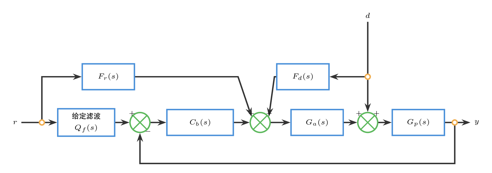

为了凸显给定滤波的作用，仿真把参考信号改为较陡的阶跃命令，扰动通道和扰动信号仍保持不变。对比只改变是否加入 $Q_f(s)$。

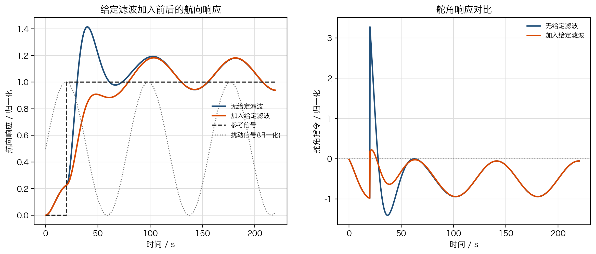

加入给定滤波后，航向响应会更平滑，舵角峰值和初段突变得到抑制；代价是跟踪速度下降。这个代价是可解释的工程权衡：给定滤波不是为了让系统更快，而是为了避免参考命令把反馈通道和执行器同时推向过激状态。

### 6.5 限幅、斜率限制与抗积分饱和：处理真实执行器边界

最后把执行器边界纳入方案。控制器先计算未受限的控制量：

$$
u_{\mathrm{raw}}=
C_{\mathrm{PIDf}}(s)(r_f-y)+F_r(s)r+F_d(s)d.
$$

实际进入执行器的控制量经过幅值限制和斜率限制：

$$
u_{\mathrm{act}}=
\operatorname{rateLimit}
\left(\operatorname{sat}(u_{\mathrm{raw}})\right),
$$

$$
-2.4\le u_{\mathrm{act}}\le 2.4,\qquad
|\dot u_{\mathrm{act}}|\le 0.045.
$$

若控制器中含积分状态，饱和发生时不能让积分继续按原误差无限累积。本例采用反算抗饱和：

$$
\dot x_i=e+\frac{u_{\mathrm{act}}-u_{\mathrm{raw}}}{T_{aw}},
\qquad T_{aw}=1.8.
$$

当执行器没有饱和时，$u_{\mathrm{act}}\approx u_{\mathrm{raw}}$，积分项按误差正常工作。当执行器饱和时，意味着原始控制量大于实际控制量，$u_{\mathrm{act}}-u_{\mathrm{raw}}$ 会把用于积分的误差修正为更小的量，使积分作用减弱；积分状态不再继续追逐一个执行器无法实现的控制量。

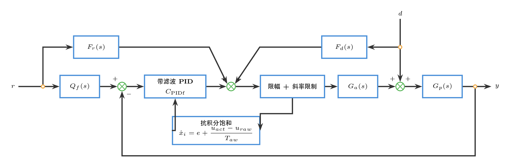

仿真采用较大的航向阶跃，使舵角实际进入饱和区。对比对象是“有限幅和斜率限制但没有抗饱和”与“同样限幅和斜率限制，并加入反算抗饱和”。

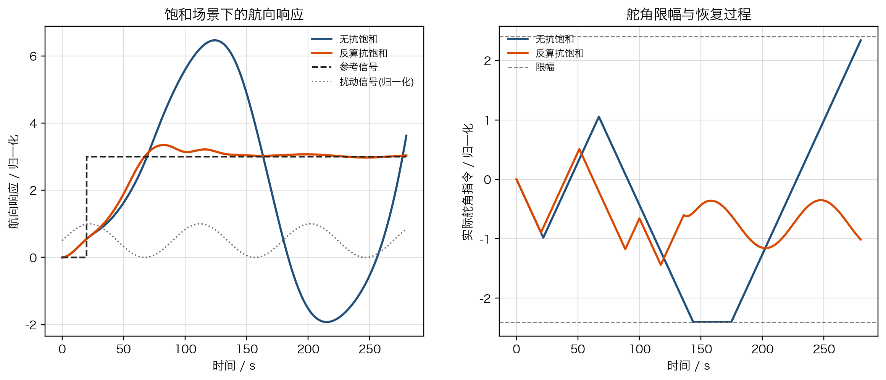

没有抗饱和时，积分状态在执行器贴边期间继续累积，饱和解除后航向恢复拖尾更明显；加入反算抗饱和后，积分状态被实际舵角反向校正，恢复过程更快，舵角也更少出现长时间贴边。这个对比说明，线性 Bode 图无法暴露积分饱和问题，必须通过含执行器限制的时域仿真检查。

### 6.6 首轮验证记录

完成这组复合结构后，首轮验证记录应包含下面几项。

表 5. 客船经典复合方案的首轮记录

| 记录项 | 本例写法 | 需要观察的证据 |
| --- | --- | --- |
| 反馈主结构 | $C_b(s)=1.338(13.91s+1)(109.05s+1)/[(5.94s+1)(196.29s+1)]$ | 基本稳定性、超调、调节时间和残余误差 |
| 扰动前馈 | $F_d(s)=-43.73(s+2.14375)/(8s+1)$ | 扰动偏移是否下降，舵角补偿是否过大 |
| 参考前馈 | $F_r(s)=9.375s/(8s+1)$ | 变化给定下的跟随滞后和舵角峰值 |
| 给定滤波 | $Q_f(s)=1/(16s+1)$ | 航向变化是否更平滑，跟踪是否过慢 |
| 执行器保护 | $u_{\mathrm{act}}\in[-2.4,2.4]$；$|\dot u_{\mathrm{act}}|\le 0.045$ | 舵角是否长期贴边，舵速是否超限 |
| 抗积分饱和 | $\dot x_i=e+(u_{\mathrm{act}}-u_{\mathrm{raw}})/1.8$ | 饱和解除后是否拖尾或反向冲击 |

这组记录把结构、参数和验证证据放在同一张表中。后续参数优化不再从“选什么控制器”开始，而是从这些可调参数和可观测曲线出发，定义目标函数和约束。

## 七、最小例题：给定滤波与前馈能解决什么

某航向控制系统已经采用超前-滞后反馈结构，给定阶跃响应超调满足要求，但舵角在命令突变时出现尖峰；同时，横向风扰可以通过风速仪获得近似测量。请回答：

1. 是否应继续增加反馈增益。
2. 应加入哪两类复合环节。
3. 首轮验证应重点看哪些曲线。

### 参考解答

不宜继续增加反馈增益。当前主要问题不再是反馈带宽不足，而是参考通道冲击和可测扰动没有被提前利用。更合适的初始方案是：

- 在给定通道加入给定滤波或参考前馈，使航向命令变化更平滑；
- 在扰动通道加入保守扰动前馈，用可测风扰提前补偿；
- 对输出加入限幅和斜率限制，并给积分项增加抗饱和。

首轮验证应同时看参考响应、扰动响应、舵角轨迹、舵速轨迹和饱和恢复过程。若给定响应变慢但控制量明显平顺，这是可接受的首轮权衡；若扰动前馈导致反向偏差，则应降低 $\lambda_d$ 或增强扰动滤波。

## 八、实践任务与分层练习

### 8.1 实践任务

以客船航向控制为对象，完成一版经典复合控制初始方案。提交内容至少包含六项：

1. 反馈主结构：说明采用超前-滞后、带滤波 `PID` 或其他已有结构中的哪一种。
2. 前馈通道：写出参考前馈、扰动前馈或二者都采用的理由。
3. 给定处理：说明是否加入给定滤波，以及它牺牲了什么。
4. 执行器保护：给出舵角限幅和舵速限制的检查方式。
5. 抗饱和处理：说明积分项在执行器贴边时如何停止累积或回算。
6. 首轮验证表：分别记录参考响应、扰动响应、控制量、反馈裕度和饱和恢复。

### 8.2 分层练习

**练习 1：狭义与广义复合控制**
判断下列环节属于狭义复合控制、广义复合控制中的实现层复合，还是复杂工程控制结构：扰动前馈、给定滤波、抗积分饱和、串级控制、`MPC`。

**练习 2：前馈强度选择**
某扰动前馈按理想模型计算后使输出反向偏移。请说明应调整 $\lambda_d$、$Q_d(s)$ 还是反馈主结构，并给出理由。

**练习 3：Bode 图的边界**
某方案的反馈主环路相角裕度满足要求，但实机仿真中舵角长期贴边，恢复时出现明显拖尾。请说明为什么只看 Bode 图不够，并指出需要补哪类实现环节。

**练习 4：参数优化入口**
把一个经典复合控制方案写成待优化参数向量，至少包含反馈主结构参数、前馈强度、给定滤波时间常数、抗饱和时间常数和限幅参数。

## 九、小结

1. 狭义复合控制主要指前馈与反馈并用；广义复合控制还包括额外通道、局部回路、模型补偿和工程实现保护。
2. 4-3 的重点不是再次判断主要矛盾和重新选型，而是在 4-2 的单结构候选基础上处理更复杂的控制场景。
3. `PID`、超前和超前-滞后在这里是反馈主结构，不再作为本次课程的新知识重新讲解。
4. 前馈负责提前利用参考或可测扰动，反馈负责稳定、鲁棒和残余误差修正。
5. 微分滤波、给定滤波、限幅、斜率限制和抗积分饱和属于实现层复合，是初始方案能否落地的关键。
6. 传统 Bode 分析仍服务反馈主环路，但不能单独覆盖前馈抵消、限幅、斜率限制和积分饱和。

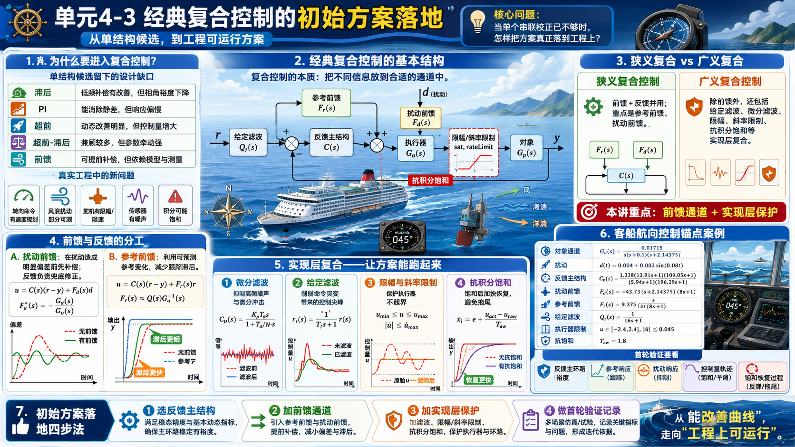

## 附录 A：经典复合控制初始方案记录项

整理首轮方案时，至少把下面八项写清楚：

1. **任务条件**：参考变化、可测扰动、执行器约束和噪声条件。
2. **反馈主结构**：采用哪一种已有基本结构，以及它负责哪类闭环品质。
3. **参考通道**：是否采用给定滤波或参考前馈。
4. **扰动通道**：是否采用扰动前馈，前馈强度和滤波如何取初值。
5. **微分处理**：是否采用输出微分和微分滤波。
6. **执行器保护**：幅值限幅和斜率限制如何进入验证。
7. **抗饱和处理**：积分项在饱和时如何处理。
8. **优化入口**：哪些参数进入下一轮目标函数和约束优化。

这些项目写清之后，初始方案就不再只是一个控制器公式，而是一套可以进入仿真、验证和参数优化的工程控制结构。

## 附录 B：参考文献与复现文件

### B.1 文献与资源来源

1. `course-content/resource-library/pdf/22串联校正.md`，来源文件：`22串联校正.pdf`。本讲用于超前校正、频域指标与串联校正设计语言的背景整理。
2. `course-content/resource-library/pdf/23滞后超前.md`，来源文件：`23滞后超前.pdf`。本讲用于滞后-超前结构、`PID` 与整定表的背景整理。
3. `course-content/resource-library/ship-control-cases/sections/2.1-船舶航向控制建模实例.md`，来源文档：`course-content/questions/source/船舶控制案例20240116.docx`。本讲用于船舶航向控制对象、扰动进入方式和野本模型背景。
4. `course-content/resource-library/ship-control-cases/sections/5.1-船舶航向控制频域分析.md`，来源文档：`course-content/questions/source/船舶控制案例20240116.docx`。本讲用于客船航向通道 $0.01715/[s(s+0.1)(s+2.14375)]$ 的频域分析背景。
5. `course-content/resource-library/ship-control-cases/sections/6.1-船舶航向控制频域校正.md`，来源文档：`course-content/questions/source/船舶控制案例20240116.docx`。本讲用于客船航向控制频域校正案例的设计背景。
6. Åström, K. J., and Hägglund, T. *PID Controllers: Theory, Design, and Tuning*. 2nd ed. Instrument Society of America, 1995. 本讲用于 `PID` 整定与抗积分饱和思想的参考背景。
7. Ziegler, J. G., and Nichols, N. B. "Optimum Settings for Automatic Controllers." *Transactions of the ASME*, 64, 1942, pp. 759-768. 本讲用于经典 `PID` 整定表的历史来源背景。

### B.2 数值与图像复现文件

1. `course-content/authoring/lessons/4-3/media/raw/generate_compound_design_data.m`：生成 `PI + 超前`、滞后-超前、带微分滤波 `PID` 与客船初始校正案例的时域、频域和根轨迹数据。
2. `course-content/authoring/lessons/4-3/media/raw/render_compound_figures.py`：根据 `4-3-compound-design-data.json` 排版生成复合结构四联图。
3. `course-content/authoring/lessons/4-3/media/raw/generate_compound_control_case_data.m`：生成 6.1 至 6.5 中扰动前馈、参考前馈、给定滤波和抗积分饱和对比数据。
4. `course-content/authoring/lessons/4-3/media/raw/render_compound_control_case_assets.py`：根据 `4-3-compound-control-case-data.json` 生成本讲通用结构图、6.2 至 6.5 局部结构图和响应对比图。
5. `course-content/authoring/lessons/4-3/media/raw/generated-data/4-3-compound-control-case-data.json`：保存 6.2 至 6.5 的最终仿真数据和关键参数表达。
6. `course-content/authoring/lessons/4-3/media/raw/generated-data/4-3-compound-design-data.json`：保存复合结构设计样例的最终仿真数据、频域数据、根轨迹数据和性能指标。
