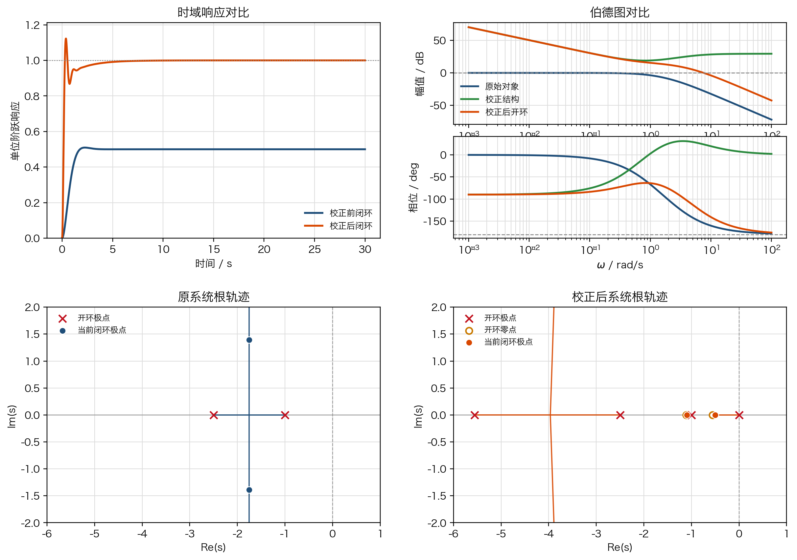
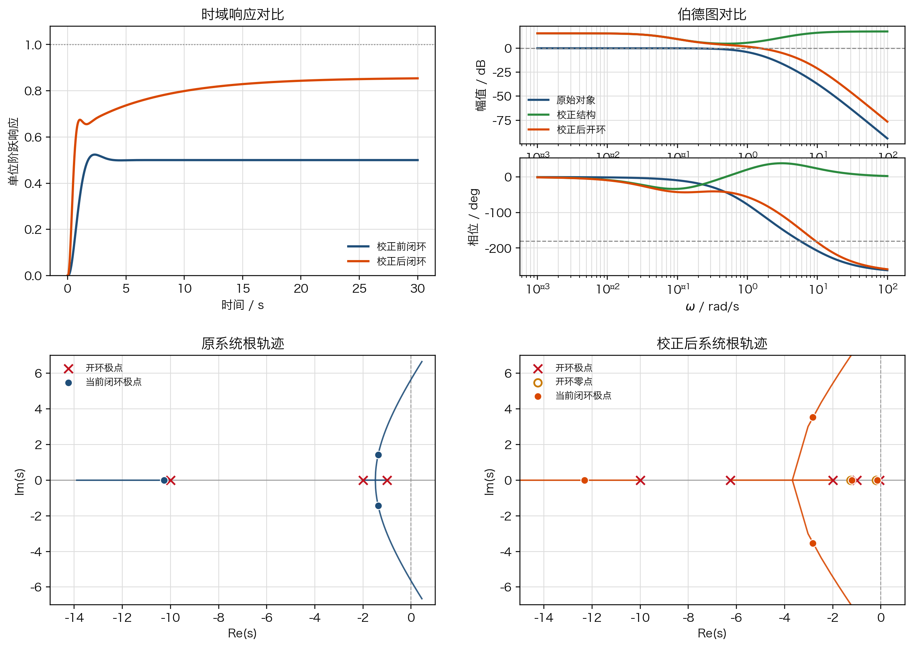
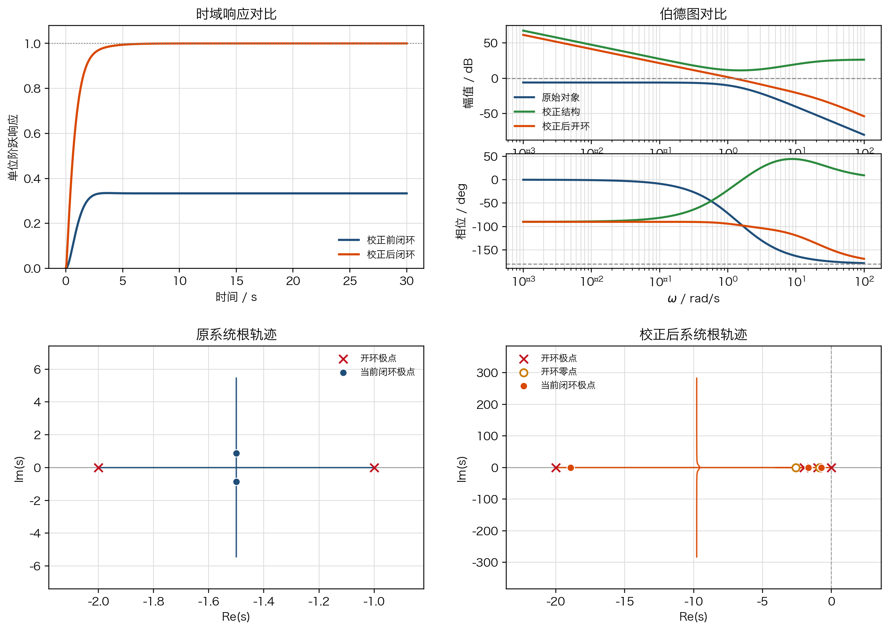
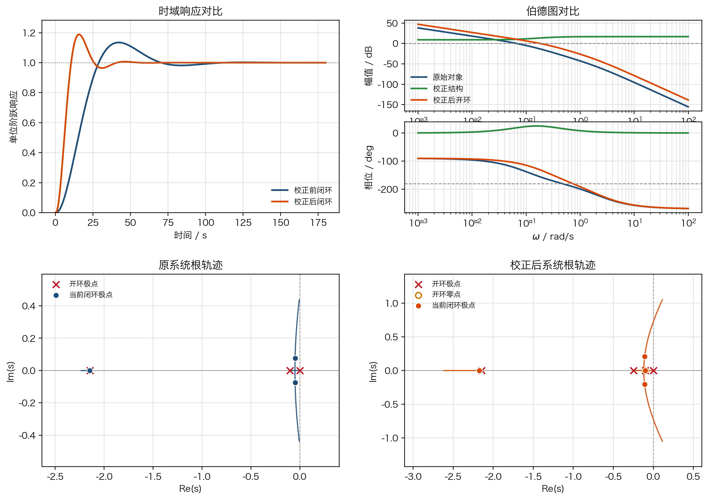
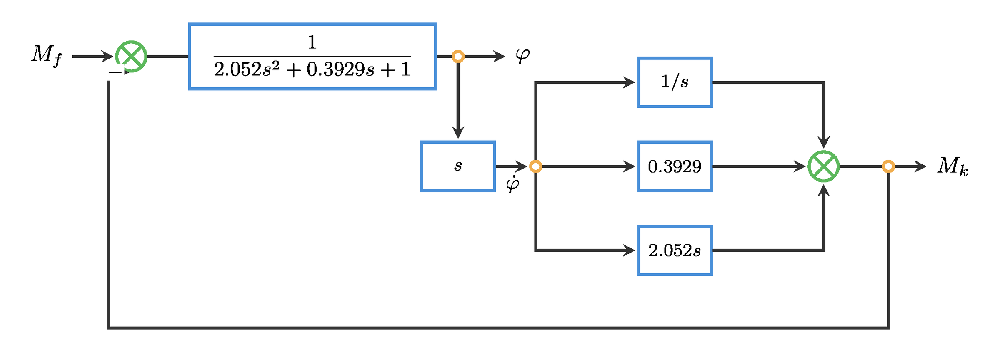
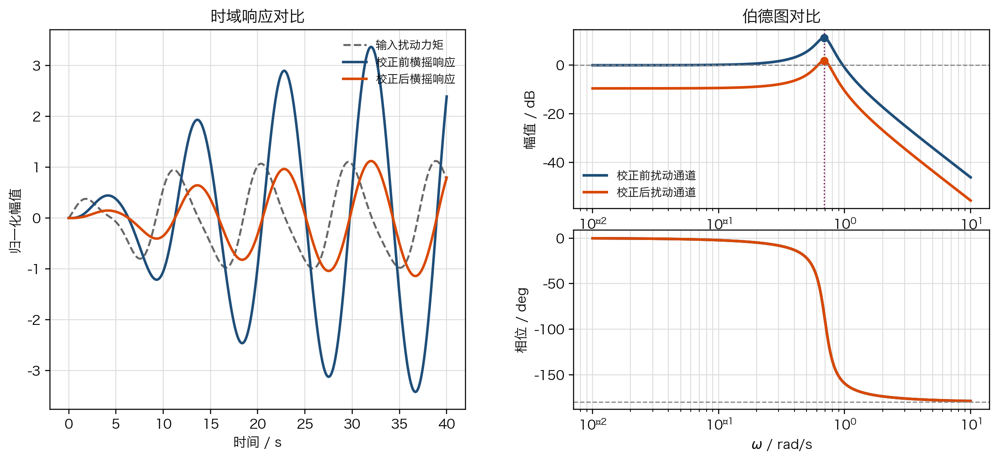

# 单元 4-3 | 初始方案落地实践：复合校正、参数整定与首轮验证

- 课程：自动控制原理
- 层次：模块 4 实践主线 · 第三课
- 学时：90 分钟
- 知识类型：[D] 设计型
- 前置：已经完成 `4-1` 的任务书表达，能够区分硬约束、软目标与观察指标；已经完成 `4-2` 的单结构起步判断，能够说明为什么当前先选 `PI/滞后`、`PD/超前`、前馈或其他结构
- 讲义定位：本讲把“会选结构”推进到“会把结构真正落到对象上”，重点训练复合校正的结构表达、参数整定逻辑、多联图验证与问题清单形成
- 后续：本讲形成的首轮证据与问题清单，将直接进入 `4-4` 的多目标权衡与控制器优化

---

## 一、为什么初始方案不能只剩一个固定骨架

在 `4-2` 中，我们已经完成了单结构起步判断，知道应当先把哪一条机制线拉起来。但到了初始方案阶段，真正困难的问题不是“会不会写出一个控制器形式”，而是：

1. 当前对象的主矛盾究竟落在低频、中频，还是扰动通道本身。
2. 单结构继续往前推，是否会立刻暴露新的硬约束。
3. 第二条机制线应当来自频段分工，还是来自任务通道与物理分量重写。
4. 第一次验证时，应该用哪些证据判断这版方案是否值得继续推进。

因此，本讲不把“结构表达”和“首轮验证”拆开，而是把它们压成一条完整动作链：

$$
\text{对象分析}
\rightarrow
\text{结构选型}
\rightarrow
\text{复合表达}
\rightarrow
\text{参数整定}
\rightarrow
\text{多联图验证}
\rightarrow
\text{问题清单}
$$

这里特别需要纠正一个常见误解：**复合校正并不存在唯一骨架。**
单结构只是起点。只要对象的矛盾同时落在多个频段，或者给定通道与扰动通道的任务不同，就应当考虑多种复合形式，而不是机械地把某一种表达式套到所有对象上。

---

## 二、复合校正的三种常用形式

### 2.1 复合结构总览

表 1 复合结构的常见形式与适用情形

| 形式 | 一般表达式 | 适合情形 | 主要作用 |
| --- | --- | --- | --- |
| `PI + 超前` | $C(s)=K\left(1+\dfrac{1}{T_i s}\right)\dfrac{T_\alpha s+1}{\alpha T_\alpha s+1},\ 0<\alpha<1$ | 既要压低静差，又要补回中频相位与阻尼 | 低频托举 + 中频整理 |
| `滞后 + 超前` | $C(s)=K\dfrac{T_\ell s+1}{\beta T_\ell s+1}\dfrac{T_\alpha s+1}{\alpha T_\alpha s+1},\ \beta>1,\ 0<\alpha<1$ | 原系统速度尚可，但低频增益不够，同时不希望牺牲过多相位裕量 | 低频补偿 + 相位回收 |
| 带微分滤波的 `PID` | $C(s)=K\left(1+\dfrac{1}{T_i s}+\dfrac{T_d s}{T_f s+1}\right)$ | 需要零静差、又希望用微分提前整理动态，但必须抑制纯微分的高频放大 | 一体化低频补偿 + 中频超前 + 高频滚降 |

下面三个演示的重点是：**说明复合形式如何改变系统行为**。它们用于帮助建立结构感，不以工程意义最强为目标。工程意义最完整的设计过程将在第三部分单独展开。

---

### 2.2 复合形式 1：`PI + 超前`

典型对象取为

$$
P_1(s)=\frac{1}{(s+1)(0.4s+1)}.
$$

校正目标设为：稳态误差压到 `5%` 以内、超调量控制在 `15%` 左右、截止频率提升到 `2 rad/s` 附近。

先看对象现状。这个对象本身稳定，但单位反馈下存在明显静差。若只提高增益，可以缩小静差，却会很快把中频相位储备压薄。

因此这里采用

$$
C_1(s)=6\left(1+\frac{1}{1.8s}\right)\frac{0.9s+1}{0.18s+1}.
$$

其结构分工非常清晰：

- `PI` 环节负责抬升低频增益，把静差压到零附近。
- 超前环节负责在交叉频率附近补相位，把超调与阻尼拉回可接受范围。
- 总增益 `K=6` 决定这两条机制线的总体强度。

表 2 `PI + 超前` 的校正结果

| 指标 | 校正前 | 校正后 | 变化解释 |
| --- | --- | --- | --- |
| 超调量 | `1.93%` | `12.30%` | 静差被压到零后，系统不再像原来那样“反应保守”，动态更积极 |
| 调节时间 | `1.63 s` | `3.35 s` | 引入积分以后，系统要先建立更完整的低频保持能力 |
| 稳态误差 | `0.50` | 约 `0` | 低频增益显著提高 |
| 相角裕度 | 无代表值 | `49.36°` | 超前环节把中频相位重新托住 |
| 截止频率 | 无代表值 | `7.60 rad/s` | 响应速度明显提高，但控制作用也会更强 |

这一形式适合回答的核心问题是：
**当“静差偏大”和“中频动态偏软”同时存在时，如何让低频托举与中频整理分工协同，而不是互相拖累。**

---

### 2.3 复合形式 2：`滞后 + 超前`

典型对象取为

$$
P_2(s)=\frac{1}{(s+1)(0.5s+1)(0.1s+1)}.
$$

校正目标设为：单位阶跃稳态误差压到 `15%` 左右、相角裕度保持在 `80^\circ` 以上、同时不把动态过程推成高超调形态。

先看对象现状。该对象原有速度并不算太差，但低频增益不够，直接增益拉升又容易损失相位裕量。

因此采用

$$
C_2(s)=6\frac{5s+1}{20s+1}\frac{0.8s+1}{0.16s+1}.
$$

这里两条机制线的职责分别是：

- 滞后环节把低频增益托起来，用较小的代价改善静差。
- 超前环节补回由于低频增益抬升而失去的相位余量。

表 3 `滞后 + 超前` 的校正结果

| 指标 | 校正前 | 校正后 | 变化解释 |
| --- | --- | --- | --- |
| 超调量 | `4.75%` | `0%` | 系统变得更保守，过程更平缓 |
| 调节时间 | `3.14 s` | `17.28 s` | 为保持充足相位裕量，速度明显放慢 |
| 稳态误差 | `0.50` | `0.146` | 低频增益得到补偿，但未做到零静差 |
| 相角裕度 | 无代表值 | `108.70°` | 储备非常充足，说明首轮设计偏保守 |
| 截止频率 | 无代表值 | `1.52 rad/s` | 速度下降是换取高裕量的直接代价 |

这一形式体现的不是“越快越好”，而是：
**当速度尚可接受，但静差偏大且不能把系统推成高超调状态时，可以用滞后与超前的组合把低频增益与相位裕量分别安排。**

---

### 2.4 复合形式 3：带微分滤波的 `PID`

典型对象取为

$$
P_3(s)=\frac{1}{(s+1)(s+2)}.
$$

校正目标设为：稳态误差压到零、调节时间保持在 `4 s` 左右、相角裕度维持在 `60^\circ` 以上。

先看对象现状。如果既希望零静差，又希望把中频动态提早整理出来，那么 `PID` 往往是最紧凑的表达。但纯微分会放大高频噪声。

因此实际写成

$$
C_3(s)=3.5\left(1+\frac{1}{1.5s}+\frac{0.25s}{0.05s+1}\right).
$$

其中：

- 积分项保证低频保持能力和零静差。
- 微分项把中频相位提前整理出来。
- 分母中的 `$0.05s+1$` 是微分滤波环节，用来限制高频放大。

表 4 带微分滤波 `PID` 的校正结果

| 指标 | 校正前 | 校正后 | 变化解释 |
| --- | --- | --- | --- |
| 超调量 | `0.43%` | `0%` | 动态仍然平稳 |
| 调节时间 | `2.52 s` | `3.34 s` | 为了获得零静差与更稳妥的相位储备，速度略有放慢 |
| 稳态误差 | `0.667` | 约 `0` | 积分项发挥决定性作用 |
| 相角裕度 | 无代表值 | `84.63°` | 微分补偿提升了中频相位，且滤波抑制了高频副作用 |
| 截止频率 | 无代表值 | `1.21 rad/s` | 速度不是极端追求，而是服从稳健性 |

这一形式适合的典型对象是：
**需要零静差、又希望把动态提前整理，但不允许纯微分直接暴露在高频噪声之前。**

---

## 三、工程案例：客船航向保持的超前校正初始方案

上面的三个演示强调的是复合结构怎样改变系统行为。下面进入真正的工程案例。这里的重点不再只是“看出哪种形式能用”，而是：

1. 指标为什么这样设定。
2. 为什么此处不机械地使用复合骨架。
3. 参数如何从目标要求一步一步整定出来。
4. 第一轮验证后，下一步应当优先处理什么问题。

### 3.1 对象与任务

客船航向保持对象取为

$$
P_h(s)=\frac{0.01715}{s(s+0.1)(s+2.14375)}.
$$

该对象已经包含积分特性，因此在单位反馈下，稳态误差本来就不大。当前工程任务不是“先把静差从很大压到很小”，而是要在风浪作用下让船舶更快、更平顺地回到目标航向，同时避免舵角动作过激。

本案例的首轮校正目标设为：

- 超调量控制在 `20%` 以内，避免修航时出现明显越摆。
- 调节时间压到 `40 s` 左右，缩短长时间修航造成的航向拖尾。
- 控制峰值控制在 `7` 以内，避免舵机与舵角动作过猛。

这三个指标对应的物理含义分别是：

- **超调量**：过大时，船首会越过目标航向后再反向修正，乘坐感与航迹品质都会变差。
- **调节时间**：过长时，船舶在扰动后长期偏离目标航向，航迹会显著变弯。
- **控制峰值**：过大时，意味着舵角或舵速需求过高，执行机构负担增大，也会增加操舵磨损。

### 3.2 为什么这里先选超前，而不是机械套用复合结构

这一步是案例与前面三个演示最重要的区别。

对客船航向对象而言：

- 低频保持能力不是当前主矛盾，因为对象本身已有积分特性，稳态误差已经很小。
- 当前主矛盾落在中频动态：系统响应偏慢、相位偏薄、修航过程不够利落。
- 如果此时先加积分，会进一步提高低频作用，未必能精准解决“慢”和“越摆”的问题，反而可能增大操舵代价。

因此，首轮方案不采用“先写一个固定的 `PI + 超前` 骨架”，而是先用**超前校正**整理中频动态，再观察是否还需要在下一轮补入新的机制线。

设初始控制器为

$$
C_h(s)=K\frac{Ts+1}{\alpha Ts+1},
\qquad 0<\alpha<1.
$$

### 3.3 参数整定过程

#### 第一步：由超调指标反推阻尼要求

二阶近似下，超调量满足

$$
M_p=e^{-\frac{\pi\zeta}{\sqrt{1-\zeta^2}}}.
$$

要求 `\(M_p \le 20\%\)`，解得阻尼比约为

$$
\zeta \approx 0.46.
$$

这一步告诉我们：首轮方案不能只追求速度，必须保证闭环极点有足够阻尼。

#### 第二步：由调节时间反推速度下界

按 `2%` 调节时间近似，

$$
t_s \approx \frac{4}{\zeta\omega_n}.
$$

若要求 `\(t_s \approx 40\,\text{s}\)`，则

$$
\zeta\omega_n \ge \frac{4}{40}=0.1,
\qquad
\omega_n \ge \frac{0.1}{0.46}\approx 0.217.
$$

考虑到航向对象较慢，且控制峰值又有限制，首轮把目标交叉频率定在

$$
\omega_c \approx 0.18\ \text{rad/s},
$$

先让系统明显快于原方案，但不过早把控制量推到危险区。

#### 第三步：由相位缺额确定超前量

在 `\(\omega_c=0.18\ \text{rad/s}\)` 处，原对象的相位大约为

$$
\angle P_h(j\omega_c)\approx -155.7^\circ.
$$

如果希望首轮方案获得约 `50^\circ` 的相角裕度，那么需要的超前量约为

$$
\phi_m \approx 25^\circ.
$$

超前网络满足

$$
\phi_m=\sin^{-1}\!\left(\frac{1-\alpha}{1+\alpha}\right),
$$

因此

$$
\alpha=\frac{1-\sin\phi_m}{1+\sin\phi_m}
\approx 0.406.
$$

#### 第四步：由对象慢极点位置选取零极点分布

对象慢极点位于 `\(s=-0.1\)` 附近。为了让超前零点与对象慢动态相配合，取

$$
T=10,
\qquad
\alpha T \approx 4.06 \approx 4.
$$

于是超前网络写成可实现的工程形式

$$
\frac{Ts+1}{\alpha Ts+1}
\approx
\frac{10s+1}{4s+1}.
$$

这一步不是纯粹的数值拼接，而是把“补相位的位置”放到对象最慢动态附近，使其对航向修正最有针对性。

#### 第五步：由幅值条件确定总增益

在设计交叉频率处满足

$$
\left|C_h(j\omega_c)P_h(j\omega_c)\right|=1.
$$

代入 `\(\omega_c=0.18\ \text{rad/s}\)` 与上面的超前网络后，可求得

$$
K\approx 2.80.
$$

首轮取值为

$$
K=2.782.
$$

于是得到完整初始方案

$$
C_h(s)=2.782\frac{10s+1}{4s+1}.
$$

### 3.4 首轮验证

表 5 客船航向保持首轮校正结果

| 指标 | 校正前 | 校正后 | 结果解释 |
| --- | --- | --- | --- |
| 超调量 | `13.50%` | `18.86%` | 仍满足 `20%` 约束，但已经接近上限 |
| 峰值时间 | `42.16 s` | `15.72 s` | 修航过程明显加快 |
| 调节时间 | `65.48 s` | `36.02 s` | 已达到“约 40 s”目标 |
| 稳态误差 | `1.96×10^{-4}` | 约 `0` | 对象原有积分特性已保证良好低频保持 |
| 控制峰值 | `1.00` | `6.89` | 接近上限 `7`，说明控制力度已较强 |
| 相角裕度 | 无代表值 | `49.05°` | 与设计目标基本一致 |
| 截止频率 | 无代表值 | `0.18 rad/s` | 与整定设定一致 |

从这组结果可以看到，首轮方案已经成功接住了主要矛盾：

- 航向修正速度显著提高。
- 调节时间压到目标附近。
- 超调与控制峰值仍处于可接受范围内。

但它也暴露了三个必须写入下一轮的问题：

1. 超调量已经接近上限，继续提速会面临明显风险。
2. 控制峰值已非常接近约束边界，舵角动作余量不大。
3. 相角裕度只有约 `49°`，说明系统虽然可用，但并不宽松。

这正是 `4-4` 要处理的工作：在多目标条件下继续权衡速度、稳健性与操舵代价，而不是再从零开始重新选型。

---

## 四、实践任务

### 4.1 任务背景

设单位反馈对象为

$$
P_p(s)=\frac{1}{(s+1)(0.4s+1)(0.1s+1)}.
$$

系统当前表现为：速度并不算极慢，但静差偏大，若只靠增益拉升，很容易把相位储备压薄。现在要求你给出一版可运行的初始方案，并完成首轮验证。

### 4.2 设计要求

实践任务的目标设定如下：

- 单位阶跃稳态误差不大于 `0.12`。
- 超调量不高于 `15%`。
- 调节时间不超过 `12 s`。
- 相角裕度不低于 `55^\circ`。
- 首轮方案必须写清控制器结构、参数方向与验证重点，不能只报最后参数。

### 4.3 提交内容

每个小组应提交以下四项内容：

1. 对象分析单：说明当前主矛盾为何不是单纯的“再增大增益”。
2. 初始方案卡：写出控制器形式，并解释每一部分对应的职责。
3. 首轮验证图：至少包含时域响应、伯德图和根轨迹对比。
4. 问题清单：说明本轮方案满足了什么、透支了什么、下一轮先改什么。

### 4.4 完成建议

建议先回答三个问题，再开始写控制器表达式：

1. 当前主矛盾主要落在低频静差，还是中频阻尼与裕量。
2. 如果要补第二条机制线，应采用 `PI + 超前`、`滞后 + 超前`，还是其他组合。
3. 第一次验证时，最担心先失守的是超调、稳态误差，还是相角裕量。

---

## 五、边界案例：横摇减摇鳍不是简单的频段叠加

前面的三个复合形式主要服务于“给定跟踪 + 频段分工”。但在船舶横摇减摇问题中，设计逻辑发生了根本变化：主问题不是让给定角度跟得更快，而是当波浪持续施加横向扰动力矩时，怎样把船体横摇角压低。

这里先回顾对象含义。传递函数

$$
G_{\varphi M_f}(s)=\frac{\varphi(s)}{M_f(s)}=\frac{1}{2.052s^2+0.3929s+1}
$$

描述的是**减摇鳍产生的控制力矩 `\(M_f\)` 到船体横摇角 `\(\varphi\)`** 之间的关系。控制目标不是追踪某个角度命令，而是让波浪扰动引起的横摇幅值尽可能变小，尤其要压低共振频带附近的响应。

相应控制器取为

$$
G_c(s)=\frac{2(2.052s^2+0.3929s+1)}{s}.
$$

将其展开可得

$$
G_c(s)=4.104s+0.7858+\frac{2}{s}.
$$

这说明减摇鳍控制器并不是单纯“再补一个超前或再补一个滞后”，而是把：

- 横摇角速度相关作用，
- 横摇角本身的反馈作用，
- 低频累积偏差的积分作用

同时组合起来，共同重写扰动抑制过程。

为了体现减摇鳍的实际效果，我们采用一段逐渐建立起来的典型扰动力矩作为输入，并同时观察未补偿与补偿后的横摇响应，以及扰动通道的频域变化：

表 6 横摇减摇鳍边界案例结果

| 指标 | 原系统 | 校正后 | 含义 |
| --- | --- | --- | --- |
| 共振峰值 | `11.32 dB` | `1.77 dB` | 横摇共振被显著压低 |
| 共振频率 | `0.687 rad/s` | `0.687 rad/s` | 主要改的是峰值高度，而不是把共振点“挪走” |
| 振幅比 | `1` | `0.333` | 共振处横摇响应约降为原来的三分之一 |

这个边界案例提醒我们：

1. 复合结构不只来自低频与中频的频段叠加。
2. 当任务转为扰动抑制时，设计应首先回到通道与物理分量的表达。
3. 因此，“复合校正”真正要学会的是结构组织能力，而不是死记某一个公式模板。

---

## 六、小结

本讲的核心结论有三条：

1. 初始方案不是把单结构名字写得更长，而是把多条机制线怎样协同工作说明白。
2. 复合校正没有唯一骨架，至少应能区分 `PI + 超前`、`滞后 + 超前`、带微分滤波的 `PID`，以及扰动通道重写这类边界情形。
3. 工程案例不能只报参数结论，必须说明指标含义、结构选型依据、参数整定过程与首轮验证结果。

因此，进入 `4-4` 之前，我们应当已经具备以下能力：

- 能根据对象矛盾判断应当采用哪种复合思路。
- 能把初始方案写成结构、参数与验证重点三层表达。
- 能根据首轮验证结果形成清晰的问题清单，为下一轮优化提供入口。

---

## 附录：实践任务参考分析与设计过程

下面给出第四部分实践任务的一种参考思路。它不是唯一答案，但应当体现完整的设计链。

### A.1 为什么不宜只靠增益拉升

对

$$
P_p(s)=\frac{1}{(s+1)(0.4s+1)(0.1s+1)}
$$

而言，直接增大增益确实能够减小静差，但会同时把交叉频率推向相位下降更快的区间，从而导致超调增大、相角裕量下降。因此，这个对象的主矛盾不是“增益不够”这么简单，而是**低频补偿与中频稳健性需要同时安排**。

### A.2 为什么优先考虑 `滞后 + 超前`

该对象原本的速度并不算极慢，说明当前最紧迫的问题不是“还要不要继续提速”，而是：

- 先把低频增益适度托起，压低静差；
- 同时补回相位余量，避免闭环过程变成高超调形态。

因此，`滞后 + 超前` 往往比直接上积分更合适。滞后环节负责低频补偿，超前环节负责中频整理，两者分工更清楚。

### A.3 参数整定时至少要交代什么

参考整定过程可按以下顺序展开：

1. 先由稳态误差要求估计低频增益需要提高到什么程度。
2. 再由超调量与相角裕量要求，判断交叉频率附近还需要补多少相位。
3. 根据目标交叉频率布置超前零极点。
4. 最后用幅值条件确定总增益。

如果首轮结果出现“静差明显改善但速度过慢”，说明滞后作用偏强；若出现“速度尚可但超调偏大”，说明超前量或总增益的选择还需要重审。

### A.4 首轮验证后怎样写问题清单

问题清单不应只写“效果一般”，而应明确写成下面三类句子：

- 已满足的目标：例如“稳态误差已压到要求之内”。
- 已暴露的代价：例如“相角裕量仍偏低，继续提速风险较大”。
- 下一轮优先调整项：例如“先回收总增益，还是先重布超前零极点位置”。

只要这三类句子写清楚，实践任务就真正完成了从“会写结构”到“会形成下一轮设计入口”的过渡。
