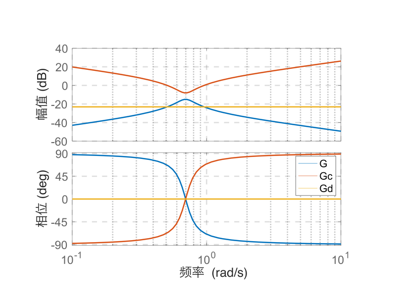

# 单元 4-3 | 基于结构机理的初始方案形成：从选型判断到关键参数方向

- **层次**：模块4 理论主线 · 第三课
- **学时**：90分钟
- **知识类型**：[D] 设计型
- **前置**：已完成 `4-1` 的任务表达卡书写，能够区分硬约束、软目标与观察指标；已完成 `4-2` 的单结构首轮起步卡，能够说明首选结构、参数起步方向、预期收益与明示代价
- **后续**：4-4（初始方案验证与失败诊断）、4-5（多目标权衡与控制器优化设计）
- **讲义定位**：在 `4-2` 的单结构起步卡基础上，继续形成一张**首版可验证方案卡**，把第一次验证前的预期改善、主要风险和优先怀疑点写清楚。

> `4-1` 把分析证据整理成任务书，`4-2` 围绕主矛盾完成单结构起步，`4-3` 把“会选结构”推进到“会写方案”，`4-4` 再用第一次验证检验这张方案卡。

---

## 一、为什么 `4-3` 必须出现

到 `4-2` 结束时，我们已经能写出一张单结构起步卡，其中至少包含下面几项内容：

1. 当前最紧矛盾是什么；
2. 首选单结构是什么；
3. 第一个参数方向准备朝哪里起；
4. 预期先改善什么；
5. 这样做最可能透支什么代价。

这一步解决的是“先动哪条机制线”的问题，把“凭感觉喊控制器名字”推进到了“能讲出结构理由”。但工程设计还要继续向前，因为单结构往往只能先抓住最紧的那条矛盾，还没有回答后面两个问题：

- 当第一条矛盾稍微缓和以后，新的次矛盾会从哪里冒出来；
- 如果任务天然跨两个频段，或者天然跨两类通道，第二条机制线应该怎样补进来。

这一课的目标很明确：

1. 判断单结构还能不能继续撑住当前任务；
2. 若单结构不够，决定第二条机制线应补在哪里，是继续补低频、整理中频，还是重写任务通道；
3. 把结果写成一张**首版可验证方案卡**，供 `4-4` 做第一次验证。

这里不追求把参数一次算完，而是要把**结构骨架、参数方向和验证假设**同时写出来。

---

## 二、案例 A：客船航向控制为什么会从单结构走向复合结构

我们先看一个典型的给定跟踪任务。这个案例会告诉我们，什么叫“单结构起步是对的，但停在单结构就不够了”。

### 2.1 背景与当前模型

设客船接到 $10^\circ$ 航向修正指令，同时持续受到风浪扰动。当前对象与比例工作点延续 `4-1 / 4-2`：

$$
P_h(s)=\frac{0.01715}{s(s+0.1)(s+2.14375)},
\qquad
C(s)=K_h=2.25.
$$

对应的开环函数为

$$
L_h(s)=\frac{0.0385875}{s(s+0.1)(s+2.14375)}.
$$

这个对象的特点并不神秘：有惯性、有积分、有明显的过程拖尾。它不属于“只要系统稳定就能接受”的那类任务，因为客船航向调整还会直接牵动乘客体感、船体平顺性和操纵余量。

### 2.2 先看证据，再判断结构

{width=100%}

这张图把我们在 `4-1` 和 `4-2` 已经见过的证据重新摆到一起。只看三条最关键结论：

- **时域**：超调约为 $32.01\%$，调节时间约为 $83.24\,\text{s}$。系统能够跟踪，但过程偏冲、偏拖。
- **复平面/根轨迹**：当前闭环极点还在舒适导向可行域之外，说明“稳定”与“过程可接受”不是一回事。
- **频域**：截止频率约为 $0.1169\,\text{rad/s}$，相角裕度约为 $37.43^\circ$。系统还有储备，但并不宽松。

这三条证据已经足够说明：当前对象并非无法工作，而是现有方案还不能把过程品质和储备同时拉到更合适的区域。系统已经有响应、有跟踪，也有稳定结论，因此很容易让人误以为继续沿着原结构慢慢加力就够了。

### 2.3 `4-2` 为什么先给出 `PI/滞后` 起步

从这些证据出发，`4-2` 给出的单结构起步卡是成立的：

- 主要矛盾首先落在低频能力；
- 因而第一轮更像 `PI/滞后` 起步；
- 参数方向先沿“增强低频补偿”的方向走；
- 预期收益是保持能力变强，明示代价是速度未必立刻改善，储备还可能继续变紧。

这个判断抓住的是：

- 恒值航向跟踪精度；
- 慢扰动下的保持能力；
- 长时间累计偏差不要太大。

也就是说，`4-2` 的工作没有错。它只是完成了第一步，还没有完成第二步。

### 2.4 为什么只沿 `PI/滞后` 继续走已经不够

客船任务里还同时存在另外两项不能回避的要求：

1. 超调已经偏大，过程平顺性不能继续恶化；
2. 调节时间已经偏长，单纯再补低频并不会自动把过程整理得更利落。

这时任务已经不再是“把低频补起来”这么单一，而是同时提出两条要求：

- 低频能力要站稳；
- 中频动态品质也要被整理。

这正是 `4-3` 的起点。单结构起步卡已经抓住了第一条机制线，但还没有覆盖第二条机制线。

### 2.5 工程目标释放出的结构信息

在一组更明确的工程约束下，客船航向控制常被写成下面这样的设计目标：

- 阶跃响应超调量满足 $\sigma\% \leq 24.9\%$；
- 过渡过程时间满足 $t_s \leq 3\,s$。

在这组目标下，预期开环形式会被写成

$$
G(s) = \frac{k(\tau s + 1)}{s^{2}(Ts + 1)}
$$

对应的控制器可写成

$$
G_{c}(s) = \frac{2.185(10s + 1)(2.138s + 1)}{s(0.2138s + 1)}.
$$

这组式子现在不需要沿着完整计算流程再推一遍。这里最值得提取的是它释放出的结构信息：

- 控制器里同时出现了积分侧和零点侧；
- 保持能力和动态品质被同时写进了骨架；
- 这意味着任务已经不可能只靠一条低频机制线独自解决。

也就是说，只要超调、速度和保持能力同时被写成硬约束，控制器自然会长成“低频补偿线 + 中频整理线”同时出现的复合骨架。

### 2.6 最小判断表

表1. 案例 A 中“单结构是否还够用”的最小判断表

| 判断问题 | 当前结论 | 解释 |
| --- | --- | --- |
| 当前最紧矛盾是否基本集中在单一频段 | 否 | 低频保持能力重要，但超调与调节时间也不能继续放任 |
| 主要矛盾改善后，是否没有立刻暴露新的硬约束冲突 | 否 | 只补低频会继续挤压动态品质和储备 |
| 只用当前单结构，能否写出明确的预期改善与预期代价 | 只能写出一半 | 可以写出低频改善，但还写不清中频会怎样被整理 |
| 第一次验证失败后，能否明确优先怀疑方向 | 不能充分做到 | 若结构里没有中频整理线，就难判断失败来自结构不足还是参数力度不足 |

这张表的结论很直接：客船案例必须从单结构走向复合结构。

### 2.7 第一版结构骨架怎样写

对客船案例而言，第一版骨架先写成抽象形式最稳妥：

$$
C_0(s)=K\cdot C_{\mathrm{LF}}(s)\cdot C_{\mathrm{MF}}(s)
$$

其中：

- $C_{\mathrm{LF}}(s)$ 代表低频补偿线；
- $C_{\mathrm{MF}}(s)$ 代表中频相位整理线；
- $K$ 代表整体作用强度。

如果把它进一步写成一类常见工程表达，可以记成下面这种**典型候选骨架**：

$$
C_0(s)=K\left(1+\frac{1}{T_i s}\right)\frac{T_\alpha s+1}{\alpha T_\alpha s+1},
\qquad 0<\alpha<1
$$

这条式子不是最终答案，而是先把结构分工写清楚：

1. $\left(1+\dfrac{1}{T_i s}\right)$ 承担低频补偿线，负责把保持能力先托起来；
2. $\dfrac{T_\alpha s+1}{\alpha T_\alpha s+1}$ 承担中频相位整理线，负责给超调、调节时间和储备留出整理空间；
3. 增益 $K$ 决定整体作用强度，但不能把它当成唯一手段。

### 2.8 为什么这里先示范成 `PI + 超前` 型表达

`4-2` 的单结构起步写的是 `PI/滞后`，而这里的典型候选骨架更接近“积分环节 + 超前整理”。原因很直接：客船案例已经多出了一条新的要求：

- 第一条线仍然要托住低频能力；
- 第二条线必须明确负责中频整理。

只要把“中频整理”写成明确机制线，工程表达就会自然靠近超前或 `PID` 中的微分侧。若此时仍只停在“滞后”表述上，结构骨架就还没有把案例里的第二条矛盾写出来。

这里仍然保留抽象骨架 $C_{\mathrm{LF}}(s)\cdot C_{\mathrm{MF}}(s)$，也是为了提醒我们：本课关心的是机制分工，不是提前把最终参数锁死。

### 2.9 参数方向怎样写，才真正可验证

进入 `4-3` 以后，参数方向不再只是数值表，而是设计语言。它至少要回答：

- 哪个变量先承担低频任务；
- 哪个变量先承担中频整理；
- 哪个方向是为了改善当前主要冲突；
- 哪个方向若走过头，会先透支哪条边界。

表2. 主场景 A 的参数方向判断表

| 变量 | 第一轮方向判断 | 主要意图 | 需要警惕的代价 |
| --- | --- | --- | --- |
| 增益 $K$ | 适度增强，但不把它当唯一手段 | 让整体调节作用真正显现 | 若只靠加大 $K$，超调和储备可能先恶化 |
| 积分时间常数 $T_i$ | 取能持续托住低频的方向，但不过分激进 | 压低长期偏差，增强慢扰动保持能力 | 低频补得过猛会拖慢动态并带来更大相位滞后 |
| 超前比值 $\alpha$ | 取相位整理有效的方向，而不是逼近 $1$ | 让中频阻尼与相位余量先被补出来 | 过于激进会带来高频敏感性上升 |
| 超前中心频段 | 靠近当前最需要整理的中频区域，而不是随意摆放 | 让主要改善真正落在超调和调节时间相关区域 | 若放错频段，可能“补了结构却没补到矛盾” |
| 高频约束 | 同步检查噪声与执行机构负担，不把它留到事后补救 | 防止中频整理把高频代价推得太大 | 若完全忽略，第一次验证会出现“看似提速、实际更脆”的结果 |

### 2.10 主场景 A 的首版可验证方案卡

表3. 主场景 A 的首版可验证方案卡

| 字段 | 内容 |
| --- | --- |
| 当前任务 | 客船航向控制需要在保持低频跟踪与慢扰动抑制能力的同时，把超调和调节时间压进更可接受的区域 |
| 结构骨架 | “低频补偿 + 中频相位整理”的复合结构 |
| 参数方向 | 保留低频补偿以托住低频能力，同时补入一条超前机制线整理中频动态品质；增益只作整体强度调节，不再单独承担全部任务 |
| 主要证据 | 只补低频无法同时回答超调偏大和调节时间偏长的问题；任务本身已经跨低频与中频两段 |
| 预期改善 | 低频保持能力不丢的前提下，超调应先下降，调节过程应先变得更利落 |
| 明示代价 | 若超前作用过猛或增益过高，高频敏感性与储备压力可能先暴露 |
| 失败后优先怀疑点 | 若低频精度改善了但超调没压下，优先怀疑中频整理线不够；若动态提起来了但低频保持变差，优先怀疑低频补偿线不足或两条线配合失衡 |

### 2.11 第一次验证前，必须先写出的假设

主场景 A 至少要写下三条验证假设：

1. 若方向正确，超调应先比单纯低频补偿方案更明显地降下来；
2. 若方向正确，调节时间不应因低频补偿而继续大幅拖长；
3. 若方向正确，低频保持能力仍应保住，而不是因为一味追求中频改善而被削弱。

同时写出三条风险提醒：

1. 若只看到速度略快，但超调和储备更差，说明中频整理过激；
2. 若只看到低频误差改善，但过程更拖，说明方案仍停留在“只补低频”的旧路上；
3. 若主要现象完全不对应原任务矛盾，优先怀疑结构骨架没有对准问题，而不是先怀疑数值算得不够精细。

---

## 三、案例 B：横摇减摇鳍为什么会把“频段分工”推进到“任务通道分工”

只看客船案例，我们已经知道：当低频和中频同时提出要求时，单结构会走向复合结构。但复合结构并不总是长成同一种样子。下面这个案例会告诉我们，任务一旦从“给定跟踪”变成“抗扰抑制”，结构判断的重心会继续变化。

### 3.1 背景：这是一个零给定抗扰任务

某船减摇鳍控制系统的目标不是跟踪一个外部给定角度，而是通过鳍产生的力矩去抵消海浪等随机扰动，从而减小船体横摇。这个任务有三个要点：

- **给定值不是主导因素**；
- **扰动力矩是主要来源**；
- **控制器首先要回答“怎样抵消扰动”，然后才谈过程品质。**

这和客船航向控制的任务性质很不一样。客船案例首先面对的是“我要跟到哪里去”；减摇鳍案例首先面对的是“外界在把我往哪边拉，我靠什么抵消”。

### 3.2 把力矩平衡关系写出来

在鳍的作用下，会产生一个对抗海浪干扰力矩的控制力矩 $M_k(s)$。船舶横摇运动方程可写成

$$
\left( I_{X} + \Delta I_{X} \right)\ddot{\varphi} + 2N_{\mu}\dot{\varphi} + Dh\varphi = M_{f} - M_{k}
$$

式中：

- $M_f$ 是海浪等外界干扰产生的力矩；
- $M_k$ 是控制系统主动施加的对抗力矩；
- $\varphi$ 是横摇角。

如果理想情况下有 $M_k = M_f$，那么右边项就会变成零，稳态后横摇自然会被压下去。问题在于，$M_f$ 并不能直接测量，因此我们不能写出一条简单的“前馈抵消公式”就结束。

案例 B 的难点在于：**任务主线是抗扰，但扰动本身并不直接可测，所以控制器必须借助系统可测状态间接构造对抗力矩。**

### 3.3 控制力矩为什么会自然长成复合结构

由力矩平衡关系可知，若希望控制力矩真正对着扰动去工作，它通常需要同时包含与横摇角、横摇角速度、横摇角加速度相关的分量，即

$$
M_{k} = A\varphi + B\dot{\varphi} + C\ddot{\varphi}
$$

这条式子直接说明了三件事：

1. 这里本来就不是单变量补偿问题；
2. 结构里天然会同时出现“位置项、速度项、加速度项”；
3. 这类任务中的复合结构来自力矩平衡要求，单一结构无法覆盖全部分量。

把上式代回横摇运动方程，可得

$$
\left( I_{X} + \Delta I_{X} + C \right)\ddot{\varphi} + \left( 2N_{\mu} + B \right)\dot{\varphi} + (Dh + A)\varphi = M_{f}
$$

若参数 $A$，$B$，$C$ 满足

$$
\frac{A}{Dh} = \frac{B}{2N_{\mu}} = \frac{C}{I_{X} + \Delta I_{X}} = P(常数)
$$

则可化成

$$
\left( I_{X} + \Delta I_{X} \right)(1 + P)\ddot{\varphi} + 2N_{\mu}(1 + P)\dot{\varphi} + Dh(1 + P)\varphi = M_{f}
$$

进一步得到

$$
\left( I_{X} + \Delta I_{X} \right)\ddot{\varphi} + 2N_{\mu}\dot{\varphi} + Dh\varphi = \frac{M_{f}}{1 + P}
$$

这说明控制作用等效于把干扰力矩压缩了 $(1 + P)$ 倍。也就是说，案例 B 的复合结构骨架首先服务的是**抗扰通道重写**，而不是让跟踪过程更快。

### 3.4 看图更容易看出问题性质

{width=100%}

这张结构图和客船航向控制最不同的地方在于：我们并不是围绕一个外部给定去看误差收敛，而是在看外部扰动力矩如何被系统内部重新分配和抵消。

这会直接改变 `4-3` 里的提问方式：

- 客船案例问的是：低频和中频怎样同时被安排；
- 横摇案例问的是：扰动抑制这条主通道应由哪些结构分量共同承担。

### 3.5 为什么这个案例不能只靠单结构

如果我们只保留一个比例项、一个积分项或者一个微分项，会怎样？

- 只保留位置项，难以充分回答阻尼与惯性相关的动态补偿；
- 只保留速度项，难以单独处理恢复力矩与长期稳态表现；
- 只保留加速度项，抗扰动作会很敏感，且难以独立稳定落地。

因此，案例 B 需要复合结构，不是因为低频和中频都想兼顾，而是因为**任务本身要求多个物理分量共同参与构造控制力矩。**

这个角度非常重要。它提醒我们：复合结构的来源有两种常见路径。

1. **频段型来源**：一个任务同时要求低频和中频都被重新安排，客船案例属于这一类；
2. **通道型来源**：一个任务首先要求控制力矩沿正确物理机制抵消扰动，横摇案例属于这一类。

### 3.6 把它写成工程上常见的控制器表达

若采用角速度陀螺作为测量元件，测到的是与横摇角速度成比例的信息。此时控制器可写成

$$
u(t) = A\int_{}^{}{\dot{\varphi}(t)dt + B\dot{\varphi}(t) + C\frac{d\dot{\varphi}(t)}{dt}}
$$

对其做零初始条件下的拉氏变换，可得

$$
G_{c}(s) = \frac{U(s)}{C(s)} = \frac{A}{s} + B + Cs
$$

如果取

$$
C = T_{\varphi}^{2},\qquad B = 2T_{\varphi}\xi_{\varphi},\qquad A = 1
$$

则有

$$
G_{c}(s) = T_{\varphi}^{2}s + 2T_{\varphi}\xi_{\varphi} + \frac{1}{s}
= \frac{T_{\varphi}^{2}s^{2} + 2T_{\varphi}\xi_{\varphi}s + 1}{s}
= \frac{2.052s^{2} + 0.3929s + 1}{s}
$$

这时我们会发现，工程上熟悉的 `PID` 形式出现在这里，但它不是因为“控制器大全里常见”才被默认选中，而是因为：

- 积分项对应一个长期作用方向；
- 比例项对应一个直接的阻尼/恢复分量；
- 微分项对应一个更快的动态响应分量。

换句话说，案例 B 中 `PID` 的价值首先在于它是一种**复合结构骨架**，而不是一个需要背参数表的名字。

### 3.7 再看频域证据

{width=100%}

这张图揭示的是另一个关键信息：横摇对象面对扰动时，会在接近固有谐振频率附近表现出更强的峰值响应。如果控制器对这段频带没有安排好，抗扰效果就会在最敏感的区域失手。

因此，案例 B 的结构判断不能只说“我要快一点”或“我要稳一点”，它必须回答：

- 谐振附近的响应怎样被压下去；
- 干扰主导的频带怎样被针对性处理；
- 高速动作带来的高频放大风险怎样被控制住。

### 3.8 案例 B 的参数方向判断

表4. 案例 B 的参数方向判断表

| 变量 | 第一轮方向判断 | 主要意图 | 需要警惕的代价 |
| --- | --- | --- | --- |
| 积分相关作用 | 保留长期抑制能力，但不过度放大低频累积 | 让外界持续扰动下的残余偏差不过度积累 | 纯积分过强会带来漂移与迟滞 |
| 比例相关作用 | 维持直接阻尼与恢复分量 | 让系统对当前横摇状态有足够的即时反应 | 过强会使控制量过猛 |
| 微分相关作用 | 在谐振附近提供更快的动态抑制 | 降低峰值响应，改善抗扰利落度 | 高频噪声更敏感 |
| 高频约束 | 给微分侧留出滤波与执行器保护空间 | 防止抑制谐振时把高频噪声放大得过头 | 若忽略，会出现控制动作脆弱和噪声驱动问题 |
| 任务通道识别 | 明确这是抗扰主导，不按给定跟踪去写指标顺序 | 让验证环节先看扰动抑制效果 | 若误判，会把失败原因看错 |

### 3.9 案例 B 的首版可验证方案卡

表5. 案例 B 的首版可验证方案卡

| 字段 | 内容 |
| --- | --- |
| 当前任务 | 横摇减摇鳍控制需要围绕扰动力矩抑制来组织控制作用，使横摇在主要干扰频段内被明显压低 |
| 结构骨架 | “多物理分量共同构造控制力矩”的复合结构，可工程化写成 `PID` 型表达 |
| 参数方向 | 同时安排位置、速度、加速度相关作用，其中谐振附近的动态抑制是重点，长期抑制能力不能被完全丢掉 |
| 主要证据 | 扰动力矩不可直接测量，控制器必须借系统可测状态间接构造对抗力矩；单一结构无法覆盖全部力矩平衡要求 |
| 预期改善 | 主要干扰频段内的横摇响应应先下降，谐振峰值应被压低 |
| 明示代价 | 微分侧过激会放大高频噪声，积分侧过强会引入漂移与迟滞 |
| 失败后优先怀疑点 | 若谐振附近仍压不住，优先怀疑动态抑制分量不够；若低频长期表现恶化，优先怀疑长期抑制分量安排失衡 |

### 3.10 第一次验证前的假设应怎样写

案例 B 的验证假设不应照搬客船案例，因为它的任务不是给定跟踪。更合适的写法是：

1. 若方向正确，主要干扰频段的横摇响应应先被明显压低；
2. 若方向正确，谐振附近的峰值不应继续突出；
3. 若方向正确，控制动作虽然会更积极，但不应出现明显的高频脆弱性。

相应的风险提醒应写成：

1. 若峰值没有压下，优先怀疑动态抑制分量安排不够；
2. 若抑振变强但高频噪声剧烈放大，优先怀疑微分侧过激；
3. 若控制效果看似积极，但长期抑制变差，优先怀疑各分量配比失衡。

---

## 四、并列比较后，`4-3` 的边界更清楚

只看案例 A，我们容易把 `4-3` 理解成“低频和中频怎样一起安排”；只看案例 B，我们又容易把它理解成“多物理分量怎样一起构造力矩”。把两者并排，`4-3` 的边界就清楚了。

表6. 两个案例的并列比较

| 项目 | 案例 A：客船航向控制 | 案例 B：横摇减摇鳍控制 |
| --- | --- | --- |
| 任务主线 | 给定跟踪 + 保持能力 | 扰动抑制 + 力矩抵消 |
| 当前主矛盾 | 低频能力不足，但动态品质也不能继续恶化 | 抗扰主导，控制力矩必须沿正确物理分量共同工作 |
| `4-2` 单结构起步 | `PI/滞后` 更自然 | 单一结构很难完整承担主任务 |
| 为什么单结构不够 | 低频补上以后，中频动态品质仍未被接住 | 单一分量无法覆盖力矩平衡中的多项要求 |
| 第二条机制线来自哪里 | 中频相位整理线 | 多分量共同构造控制力矩 |
| 常见工程化表达 | `PI + 超前` 或 `PID` 型复合骨架 | `PID` 型复合骨架 |
| 第一次验证先看什么 | 超调、调节时间、保持能力是否同时被接住 | 谐振峰值是否压低、扰动响应是否下降 |
| 失败后先怀疑什么 | 中频整理线不足，或低频/中频配合失衡 | 动态抑制分量不足，或各物理分量配比失衡 |

这张表把本课最关键的事实说清了：

1. 复合结构不是默认答案；
2. 复合结构出现的理由也不止一种；
3. 我们不能只背控制器名称，必须写清第二条机制线到底从哪里来。

### 4.1 两个案例共同支撑的结论

把两个案例压在一起，可以得到四条稳定判断：

1. **先有任务，再有结构。**
   结构不是从控制器名录里选出来的，而是从任务冲突里长出来的。

2. **单结构只能先抓最紧矛盾。**
   一旦任务跨多个频段，或跨不同通道、不同物理分量，第二条机制线迟早要补进来。

3. **参数方向必须和结构骨架一起写。**
   只写“上 `PID`”“加超前”“加积分”没有意义；必须同时说明先增强什么、预期改善什么、可能牺牲什么。

4. **验证假设必须在验证前写出。**
   否则第一次上机就会退化成“看曲线临场猜测”，无法为 `4-4` 提供真正有价值的诊断信息。

### 4.2 `PID` 在本课中的位置

经过两个案例以后，我们可以更准确地理解 `PID` 在这一课中的位置。

它不是默认答案，也不是应当回避的答案。它在这一课中的位置是：

- 一种常见的**复合结构工程表达**；
- 一种把多条机制线写进同一骨架的方法；
- 一种只有在任务确实需要多条机制线同时出现时，才有理由进入首版方案的结构选择。

这个定位非常关键。它可以防止两种常见误判：

1. 什么都没分析，就直接写 `PID`；
2. 明明任务已经要求复合结构，却因为害怕复杂而迟迟不写第二条机制线。

---

## 五、把两个案例重新抽象成 `4-3` 的通用方法

到这里，我们已经可以直接总结出这一课的方法流程。

### 5.1 一条最短的翻译链

$$
\text{任务矛盾} \rightarrow \text{频段/通道定位} \rightarrow \text{结构骨架} \rightarrow \text{参数方向} \rightarrow \text{验证假设}
$$

这条链里每一环都回答不同的问题：

表7. 从任务到方案的五步翻译链

| 步骤 | 要回答的问题 | 产出 |
| --- | --- | --- |
| 任务矛盾定位 | 当前最先要救什么，哪些边界不能破 | 任务表达卡中的主矛盾与底线 |
| 频段或通道定位 | 主要问题落在低频、中频，还是任务通道/物理分量安排 | 第一条机制线与第二条机制线的来源 |
| 结构骨架形成 | 单结构够不够；若不够，第二条机制线补在哪里 | 单结构骨架或复合结构骨架 |
| 参数方向判断 | 第一轮先增强或减弱哪些作用 | 参数方向表 |
| 验证假设书写 | 第一次验证前应先看到什么，又最可能先坏什么 | 验证假设单 |

### 5.2 什么叫“首版可验证方案卡”

首版可验证方案卡不是最终答案，也不是参数表。它至少要包含下面七个字段：

表8. 首版可验证方案卡模板

| 字段 | 应写内容 |
| --- | --- |
| 当前任务 | 对象是谁，当前要解决的主要问题是什么 |
| 结构骨架 | 反馈主结构由哪几条机制线组成 |
| 参数方向 | 第一轮先准备增强或减弱哪些作用 |
| 主要证据 | 为什么认为这些机制线值得放进来 |
| 预期改善 | 第一次验证前最希望先看到什么变化 |
| 明示代价 | 预期可能先透支什么边界 |
| 失败后优先怀疑点 | 若结果不对，先怀疑结构不足还是参数方向写反 |

只要这些字段没有写完，方案就还只是“想法”，不是“可验证方案”。

### 5.3 五类常见方向变量

表9. 初始方案中的五类方向变量

| 变量类型 | 它主要回答什么 |
| --- | --- |
| 增益配置方向 | 整体作用强度先往哪边推 |
| 低频补偿方向 | 稳态误差、慢扰动抑制和低频保持能力如何先托起来 |
| 中频相位改善方向 | 超调、阻尼、调节时间与储备如何先被整理 |
| 高频约束方向 | 噪声放大与执行机构负担如何被控制住 |
| 任务通道 / 物理分量安排方向 | 是否有必要让某条控制作用专门承担抗扰、力矩平衡或某类已知影响 |

不是每个案例都要把五类变量全部铺满，但一旦进入复合结构，这五类变量至少要逐项检查，不能只剩一句“控制器名称”。

### 5.4 第一次验证前，为什么必须把代价和怀疑点一起写进去

工程上更危险的方案，往往不是明显很差的方案，而是“只写收益、不写代价”的方案。因为这样的方案一上机，我们只会盯着自己最想看到的那条曲线，而忽略：

- 储备是不是被压得更紧了；
- 高频敏感性是不是变强了；
- 控制量是不是开始走得过猛；
- 原任务里没写出来的约束是不是被提前打破了。

同样，若不写“失败后优先怀疑点”，我们在 `4-4` 看到异常时，就很容易把所有问题都归为“参数没调好”。这会把第一次失败诊断直接降格成机械试参。

因此，方案卡必须同时写三类内容：

1. 我想先改善什么；
2. 我预期会牺牲什么；
3. 如果没改善，我优先怀疑哪里。

---

## 六、AI 在这一课里的角色

AI 可以参与，但只能放在辅助位置。更合适的用法有两类。

### 6.1 分类检查

在写方案卡之前，我们先独立完成两句判断：

1. 若只沿当前单结构继续推进，最先暴露出的次矛盾是什么；
2. 这个次矛盾更像低频问题、中频问题，还是任务通道/物理分量问题。

然后把这两句交给 AI，只让它做分类检查：

- 这是不是把原来的主要矛盾换了一种说法；
- 这个次矛盾主要落在哪一段频率行为，或哪类通道安排；
- 第二条机制线更像补在低频、中频，还是任务通道。

### 6.2 方案卡比较

当我们已经写出两张方案卡时，可以让 AI 比较：

- 两个任务的主要冲突分别是什么；
- 第二条机制线分别在解决什么；
- 哪个案例更强调频段分工，哪个案例更强调通道或物理分量安排。

AI 在这里的价值，是帮助我们把差异讲清。AI 不负责替我们直接生成控制器，也不负责替我们越过验证假设直接宣布答案。

---

## 七、本课要掌握的动作

学完这一课，我们至少要能独立完成下面五个动作：

1. 从 `4-2` 的单结构起步卡里，指出哪一个次矛盾说明“单结构已经不够”；
2. 说明第二条机制线准备补在低频、中频，还是任务通道/物理分量安排，以及理由是什么；
3. 把方案写成“结构骨架 + 参数方向 + 验证假设”的首版可验证方案卡；
4. 在第一次验证前，写出预期改善、明示代价和失败后优先怀疑点；
5. 说明两个不同案例中，复合结构为什么会以不同方式出现。

### 7.1 一个最小练习

表10. 最小练习模板

| 练习项 | 你要写出的内容 |
| --- | --- |
| 当前任务 | 主对象是谁，当前最紧矛盾是什么 |
| 单结构为什么不够 | 主要矛盾改善后立刻暴露出的次矛盾是什么 |
| 第二条机制线 | 准备补在低频、中频，还是任务通道/物理分量安排，为什么 |
| 参数方向 | 第一轮先增强或减弱哪些作用 |
| 预期改善 | 第一次验证最希望先看到什么 |
| 明示代价 | 最担心先透支哪条边界 |
| 失败后优先怀疑点 | 若预期未出现，先怀疑结构还是参数方向 |

这张练习卡写完以后，再进入 `4-4`，第一次验证就不再是边看曲线边临时猜测，而是带着明确假设去收集设计证据。

---

## 本节小结

1. `4-3` 的任务是把 `4-2` 的单结构起步卡推进成首版可验证方案卡。
2. 客船航向控制说明：当低频能力和中频动态品质必须同时被安排时，单结构会走向“低频补偿 + 中频整理”的复合骨架。
3. 横摇减摇鳍说明：当任务主线变成抗扰抑制时，复合结构还可能来自任务通道和物理分量的共同要求。
4. 因此，复合结构不是默认答案，也不只有一种来源。它只能从任务冲突里长出来。
5. 参数方向不是数值表，而是设计语言。它要同时说明先改善什么、可能透支什么、失败后优先怀疑哪里。
6. 只要结构骨架、参数方向和验证假设同时写清，第一次验证就不是试运气，而是在收集真正的设计证据。

---

## 附录A：减摇鳍案例的建模与框图化步骤

这一附录不改变正文主线，只把案例 B 在资源库 `6.2` 中已经出现、但正文里没有完全展开的建模与框图化步骤补全，方便第一次接触该案例的同学把“横摇角控制”读成真正的“力矩控制问题”。

### A.1 从原始系统到“扰动力矩输入”视角

资源库中的原始减摇鳍系统首先是按完整控制系统来画的：

{width=88%}

第一次看这张图时，学生最容易困惑的是：  
我们明明在讨论“减小横摇角”，为什么后来却把问题改写成了“控制力矩 $M_k$ 怎样对抗海浪扰动力矩 $M_f$”？

答案在于：  
减摇鳍系统并不是“给定一个目标横摇角，然后让船去跟踪它”，而是“外界海浪不断把船体推离平衡，我们要持续施加反向力矩把这种扰动压下去”。

因此，在分析与设计时，更合适的切入口不是“参考输入 -> 输出误差”，而是：

1. 海浪扰动力矩 $M_f$ 从哪里进入系统；
2. 鳍产生的控制力矩 $M_k$ 怎样回到对象输入端；
3. 两者在对象输入端如何相互抵消。

只要这三个问题立住，减摇鳍案例就会从“一个看上去像普通姿态控制的问题”转成“一个典型的抗扰力矩控制问题”。

### A.2 为什么可以先把执行机构近似掉

资源库 `6.2` 给出的一个关键前提是：液压伺服系统的时间常数约为 $\frac{1}{15}$，远小于船体横摇对象的固有时间尺度 $\sqrt{2.052}$。

这一步近似的含义不是“执行机构不重要”，而是：

- 在当前这节课所关注的主频段内，执行机构的动态比船体本身快得多；
- 因而第一轮建模时，可以把它先等效成比例环节；
- 这样我们就能把注意力集中到“对象的横摇力矩平衡”而不是执行机构细节上。

这类近似在工程上很常见。  
它的目的不是把系统简化得更漂亮，而是先抓住当前设计里真正主导的那一层动态。

### A.3 从横摇角运动方程到力矩平衡

船舶横摇运动方程写成

$$
\left( I_{X} + \Delta I_{X} \right)\ddot{\varphi} + 2N_{\mu}\dot{\varphi} + Dh\varphi = M_{f} - M_{k}.
$$

把这条式子按“左边是船体自身力矩，右边是外加力矩”来读，物理意义会更直接：

- $\left( I_{X} + \Delta I_{X} \right)\ddot{\varphi}$ 对应惯性力矩；
- $2N_{\mu}\dot{\varphi}$ 对应阻尼力矩；
- $Dh\varphi$ 对应恢复力矩；
- $M_f$ 是海浪施加的外部扰动力矩；
- $M_k$ 是减摇鳍主动施加的控制力矩。

如果理想情况下有 $M_k=M_f$，则对象输入端的净扰动力矩为零，横摇自然会被压下去。  
问题在于，海浪扰动力矩本身不可直接测量，所以我们不能把控制器写成一个“直接复制 $M_f$”的前馈环节。

这一步把问题真正改写成了：

> 如何利用可测量的横摇运动信息，间接构造一个足够接近 $M_f$ 的对抗力矩 $M_k$？

### A.4 为什么控制力矩会长成三项结构

由上面的力矩平衡可知，如果希望 $M_k$ 真正沿着对象已有的物理机制去工作，它自然会写成

$$
M_k=A\varphi+B\dot{\varphi}+C\ddot{\varphi}.
$$

这不是“拍脑袋选一个三项式”，而是因为对象本身就由三类力矩共同平衡：

1. 与位移相关的恢复力矩；
2. 与速度相关的阻尼力矩；
3. 与加速度相关的惯性力矩。

因此，若控制力矩只保留某一项，就只能对准其中一类力矩来源，很难完整覆盖整个抗扰任务。

把这条式子代回横摇方程，可得

$$
\left( I_{X} + \Delta I_{X} + C \right)\ddot{\varphi} + \left( 2N_{\mu} + B \right)\dot{\varphi} + (Dh + A)\varphi = M_{f}.
$$

若进一步令

$$
\frac{A}{Dh} = \frac{B}{2N_{\mu}} = \frac{C}{I_{X} + \Delta I_{X}} = P,
$$

则有

$$
\left( I_{X} + \Delta I_{X} \right)\ddot{\varphi} + 2N_{\mu}\dot{\varphi} + Dh\varphi = \frac{M_{f}}{1 + P}.
$$

这就说明：  
当三类补偿作用按同一比例同时参与时，控制力矩的效果相当于把外部扰动力矩在整个通道上统一压缩为原来的 $\frac{1}{1+P}$。

### A.5 为什么“测角速度”最后能变成“控力矩”

学生最常见的疑问是：  
既然最后想控制的是力矩，为什么工程上经常测的是角速度 $\dot{\varphi}$？

原因在于，角速度通常比扰动力矩更容易测得，而角速度一旦进入控制器，就可以通过三条支路重新构造出三类所需分量：

$$
u(t)=A\int \dot{\varphi}(t)\,dt+B\dot{\varphi}(t)+C\frac{d\dot{\varphi}(t)}{dt}.
$$

这里三条支路的作用分别是：

- 积分支路把角速度积回角位移，对应 $\varphi$ 项；
- 比例支路直接保留角速度，对应 $\dot{\varphi}$ 项；
- 微分支路对角速度再微分，对应 $\ddot{\varphi}$ 项。

因此，学生看到的“PID 型控制器”在这个案例里不能被理解成一个抽象名称，而应理解成：

> 用角速度这一个可测量信号，重新拼出位移、速度、加速度三类力矩补偿分量，再把它们合成为控制力矩 $M_k$。

{width=92%}

这张图对应的读法是：

1. 海浪扰动力矩 $M_f$ 直接进入对象输入端；
2. 对象输出横摇角 $\varphi$；
3. 横摇角经角速度测量环节得到 $\dot{\varphi}$；
4. $\dot{\varphi}$ 经过积分、比例、微分三支路，重新构成控制力矩 $M_k$；
5. $M_k$ 回到对象输入端，对海浪扰动进行负向对冲。

这样一来，学生就能把“横摇角控制”准确地理解为：

- 目标变量仍然是横摇角 $\varphi$；
- 但真正施加到对象上的控制量是力矩 $M_k$；
- 控制器的工作，就是把可测量的运动状态转写成恰当的对抗力矩。

### A.6 这个附录与正文主线的边界

这一附录的目的，是把案例 B 的建模和框图化逻辑补齐，而不是把 `4-3` 变成完整的减摇鳍建模专题。  
正文主线仍然只保留两件事：

1. 为什么该案例的复合结构来自任务通道与物理分量要求；
2. 为什么这种复合结构可以工程化写成 `PID` 型骨架。

如果你第一次读正文时已经理解这两点，可以把附录视作查阅材料；  
如果你仍然困惑“横摇角控制怎么最后变成力矩控制”，这一附录就是专门用来补这个缺口的。
