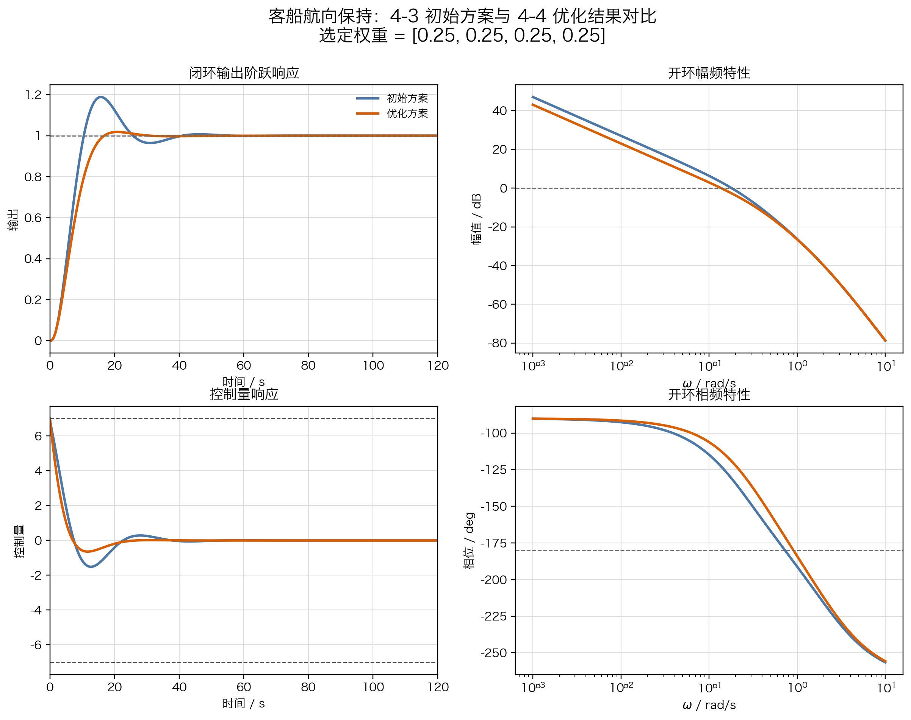
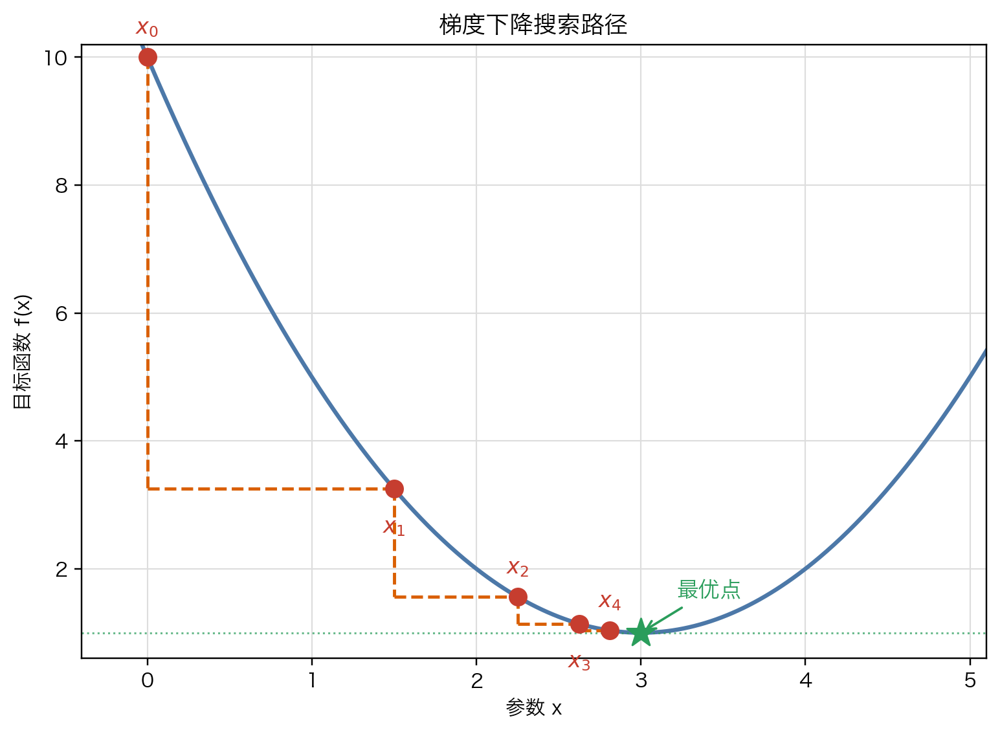
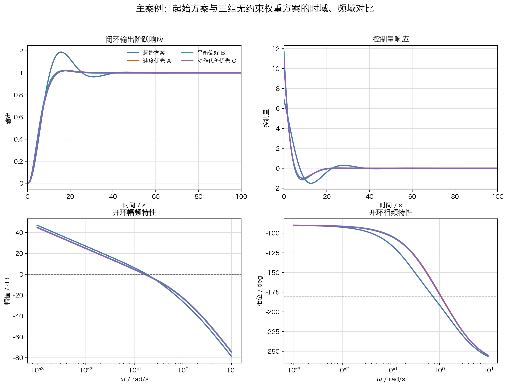
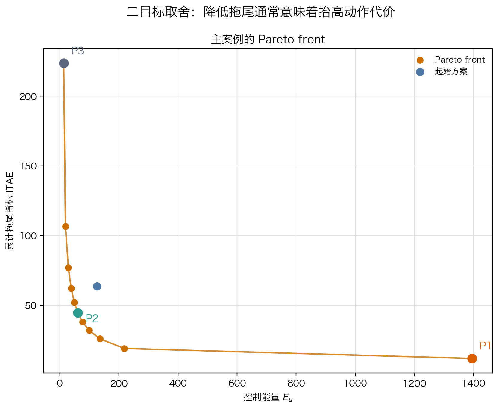
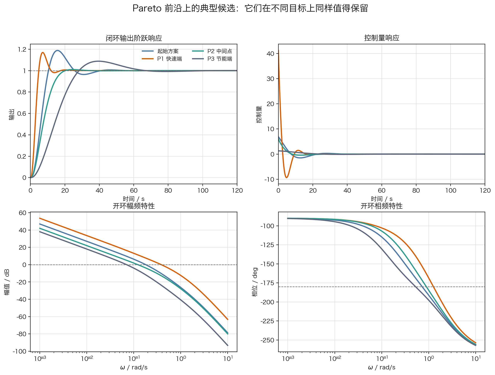
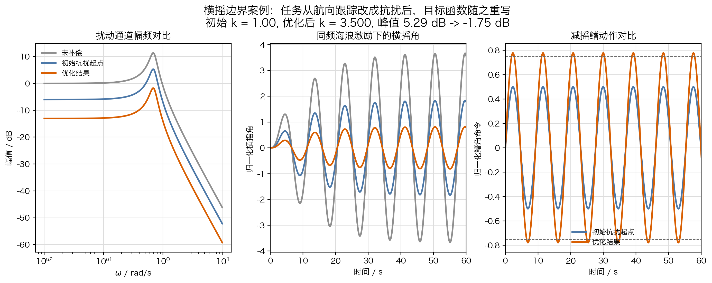

# 单元 4-4 | 多目标权衡与控制器优化设计

- 课程：自动控制原理
- 层次：模块 4 理论主线 · 第四课
- 学时：90分钟
- 知识类型：[D] 设计型
- 前置：已完成固定结构控制器的首轮设计与验证，能够根据时域、频域和控制量证据识别主要矛盾
- 核心任务：把固定结构的首轮证据写成无约束加权优化问题，并得到一组可比较的候选解

## 一、复合方案中的多目标取舍问题

客船航向保持的初始方案已经完成首轮验证。对象取为

$$
P_h(s)=\frac{0.01715}{s(s+0.1)(s+2.14375)}.
$$

首轮方案是一套可以运行的经典复合控制结构：反馈主结构负责稳定性和基本动态品质，参考前馈与扰动前馈利用可预测信息，给定滤波、限幅、斜率限制和抗积分饱和负责把方案放回执行器边界。它已经能跑通验证，但仍留下一个关键问题：这些环节中的可调参数怎样放进同一套比较语言。

这一对象已经自带积分特性，当前最紧的矛盾落在下面几类愿望同时出现时的拉扯：

- 希望修航过程更快；
- 希望误差拖尾更短；
- 希望前中段误差强度得到压低；
- 希望控制动作保持平顺并节制。

如果只靠“再试几组参数”，我们大致知道该往哪个方向调，却很难说明不同方向之间怎样取舍。速度变快了，也许拖尾真的缩短了；控制动作更强了，也许前中段误差确实被压下去了。扰动前馈强度、给定滤波时间常数、抗饱和时间常数和反馈主结构参数也会互相牵动。这些变化需要被写进同一套可比较的评价语言。

当前先处理更基础的一步：把固定结构、参数起点和性能偏好写成无约束加权目标，让求解器给出按偏好搜索得到的候选解。偏好驱动下的候选族看清之后，带边界优化才能判断哪些候选只是“偏好上有吸引力”，哪些候选能够继续推进。

## 二、本次课程目标

学完这一课后，我们应能完成以下工作：

1. 能用首轮验证证据说明参数试凑为什么会卡在冲突指标前。
2. 能写出固定结构参数向量、参数范围与初值来源。
3. 能把调节时间、积分误差与控制能量改写成同一套无约束加权目标。
4. 能说明归一化基准应来自任务书或首轮方案读数。
5. 能用数值优化方法从同一起点出发，得到三组不同权重下的无约束候选解，并读出它们的时域、频域差异。
6. 能说明 `Pareto front` 如何把若干同样值得讨论的候选一起呈现出来。
7. 能说明边界案例中为什么必须更换目标语言，并用数值响应实验验证这种改写确实改变了搜索方向。

## 三、复合方案首轮证据与多目标拉扯

### 3.1 复合控制首轮记录

进入优化建模前，先把首轮记录放在一起看。问题已经从“选哪个控制器”转为“这套复合方案中哪些参数应进入下一轮比较”。

表 1. 复合控制方案的参数入口

| 移交项 | 首轮写法 | 进入优化建模的方式 |
| --- | --- | --- |
| 反馈主结构 | $C_b(s)=1.338\dfrac{(13.91s+1)(109.05s+1)}{(5.94s+1)(196.29s+1)}$ | 作为固定结构主体，先抽取关键参数切片建模 |
| 扰动前馈 | $F_d(s)=-43.73\dfrac{s+2.14375}{8s+1}$ | 记录前馈强度和滤波时间常数，可进入扩展参数向量 |
| 参考前馈 | $F_r(s)=9.375\dfrac{s}{8s+1}$ | 记录参考通道补偿强度，先作为背景通道保留 |
| 给定滤波 | $Q_f(s)=1/(16s+1)$ | 记录平顺性与跟踪速度之间的取舍 |
| 执行器保护 | $u_{\mathrm{act}}\in[-2.4,2.4]$，$|\dot u_{\mathrm{act}}|\le 0.045$ | 暂不写进自由目标，保留给带边界优化做工程复核 |
| 抗积分饱和 | $\dot x_i=e+(u_{\mathrm{act}}-u_{\mathrm{raw}})/1.8$ | 记录恢复过程风险，保留给带边界优化 |

这张表说明，当前优化起点不需要从零重选结构，也不需要把复合环节推倒重来。我们已经有一套能运行、能解释、能验证的结构。现在要把其中最关键的收益和代价先写成统一目标，让候选解从同一套偏好语言中产生。

### 3.2 四组参数切片试凑结果

为了讲清优化建模动作，主案例不把表 1 中所有参数一次性放进搜索。我们先取与反馈主结构同源的参数切片，其他复合通道暂不参与本例搜索，比较四组典型试凑结果。它们都保留同一类固定结构，只是各自强调的方向不同。

表 2. 航向保持参数切片的四组试凑结果

| 方案 | 设计意图 | 超调 / % | 调节时间 / s | 控制峰值 | 相角裕度 / deg | 读数结论 |
| --- | --- | ---: | ---: | ---: | ---: | --- |
| 比例基线 | 先给出最小可运行起点 | 31.9677 | 83.1 | 2.2500 | 37.4347 | 速度慢，动态品质不够 |
| 仅补低频 | 继续改善低频行为 | 41.2759 | 176.1 | 1.1195 | 30.8006 | 低频改善后，动态矛盾更突出 |
| 方向过激 | 直接把速度拉起来 | 20.2410 | 19.6 | 25.0000 | 47.8274 | 速度收益显著，但动作代价骤增 |
| 最小修正 | 把动作强度收回一部分 | 24.8740 | 39.1 | 6.0000 | 43.4991 | 动作被收回后，动态品质又开始回退 |

这组表格并不判定“哪组参数完全错误”。它揭示的是固定结构中的多目标拉扯：只靠人工试凑，我们知道某些参数变化会换来什么，但还没有把“收益”和“代价”放在同一把尺子下比较。

### 3.3 统一比较语言的必要性

观察表 2，可以看到三种典型拉扯：

- 想缩短调节时间时，控制动作往往会明显变大；
- 想把拖尾继续压短时，前中段的动态形状不一定同步改善；
- 想把动作收回时，前面争取到的速度收益又可能退回去。

这类局面不能靠多背几个控制器名字解决，也不会靠再补一轮经典校正公式自动消失。我们需要先统一评价语言：把不同量纲、不同时间尺度、不同意义的量改写成可同时进入比较的无量纲目标项。

偏好写进可计算的自由目标之后，求解器会告诉我们：如果暂时只按这些偏好搜索，固定结构会走向哪一类候选解。

## 四、优化起点、参数向量与范围来源

### 4.1 复合方案到参数向量的抽取

首轮已经给出完整复合方案。若把所有可调项一次性写入参数向量，可以得到

$$
\theta_{\mathrm{full}}=
\begin{bmatrix}
\theta_b & \lambda_d & \tau_d & \lambda_r & \tau_r & T_f & T_{aw}
\end{bmatrix}^{\mathsf T},
$$

其中 $\theta_b$ 表示反馈主结构中的若干参数，$\lambda_d,\tau_d$ 表示扰动前馈强度和滤波，$\lambda_r,\tau_r$ 表示参考前馈强度和滤波，$T_f$ 表示给定滤波时间常数，$T_{aw}$ 表示抗饱和回算时间常数。这个完整向量会直接通向带边界的工程优化，变量数量较多，不利于第一次建立目标函数构造方法。

为了让目标函数构造先变得清楚，主案例先取反馈主结构的三参数切片：

$$
\theta=
\begin{bmatrix}
K & T & \alpha
\end{bmatrix}^{\mathsf T},
\qquad
C_h(s)=K\frac{Ts+1}{\alpha Ts+1},
\qquad
0<\alpha<1.
$$

这一切片只覆盖复合方案中的反馈主结构部分，适合展示“参数化—归一化—加权目标—候选解”的可计算入口。其起点写成

$$
\theta_0=
\begin{bmatrix}
2.796 & 10 & 0.406
\end{bmatrix}^{\mathsf T}.
$$

这组参数来自首轮可运行方案同源的反馈主结构起点。搜索应建立在这样的起点上，避免从失真的参数开始。扰动前馈、参考前馈、给定滤波、限幅和抗饱和仍然属于复合方案的一部分，只是在主案例中暂不进入搜索变量，以免目标函数入口被过多工程边界淹没。

为了让这组起点不只是一个公式，这里把首轮设计结果的图和关键性能指标并排回看一次：

{width=100%}

表 3. 首轮设计结果的关键性能指标

| 指标 | 数值 | 说明 |
| --- | ---: | --- |
| 调节时间 $t_s$ / s | 36.0 | 主过程仍偏慢 |
| `ITAE` | 63.692 | 拖尾还比较明显 |
| `ITSE` | 16.528 | 前中段误差强度仍需继续压低 |
| 控制能量 $E_u$ | 125.715 | 动作代价已经不能忽略 |
| 截止频率 $\omega_c$ / rad/s | 0.180 | 带宽仍偏低 |
| 相角裕度 / deg | 49.046 | 储备尚可，但仍有继续调整空间 |
| 超调 / % | 18.864 | 前段动态形状并不理想 |
| 控制峰值 | 6.887 | 峰值动作已经开始抬高 |

### 4.2 参数范围只承担“固定结构可解释范围”的职责

当前把参数范围限制为

$$
1 \le K \le 6,\qquad
4 \le T \le 15,\qquad
0.15 \le \alpha \le 0.85.
$$

这些范围的作用只有一个：保证搜索结果仍然属于当前超前结构的有效区间。

表 4. 参数范围的来源说明

| 参数 | 取值范围 | 结构解释 |
| --- | --- | --- |
| $K$ | $[1,6]$ | 保持整体作用强度处在当前结构仍可解释的范围内 |
| $T$ | $[4,15]$ | 让超前零点继续落在主工作频段附近 |
| $\alpha$ | $[0.15,0.85]$ | 保持在超前结构有效区间内，避免退化成别的补偿形态 |

这里要特别注意：参数范围不同于输出过程的工程复核条件。它只告诉求解器“留在当前经典结构的可解释区间”。搜索先限制在这个区间内，扰动前馈、参考前馈、给定滤波、执行器限幅和抗饱和这些复合环节再进入带边界的联合复核。

## 五、自由目标的无量纲加权表达

### 5.1 四类自由目标项

对客船航向保持而言，先选取四类自由目标项：

- 调节时间 $t_s$：代表收敛速度；
- `ITAE`：代表误差拖尾是否被压短；
- `ITSE`：代表前中段强误差是否真的被压下去；
- 控制能量 $E_u$：代表控制动作整体是否过于激进。

其中

$$
E_u(\theta)=\int_0^{200}u^2(t;\theta)\,\mathrm{d}t.
$$

这四类量可以进入自由目标，因为它们承担的是“比较偏好”的职责；工程复核条件稍后再单独处理。

### 5.2 归一化基准的取法

为了让不同量纲的量能写进同一个标量目标，采用无量纲归一化。当前写法为

$$
J_{\mathrm{free}}(\theta)=
w_1\frac{t_s(\theta)}{40}
+
w_2\frac{\mathrm{ITAE}(\theta)}{\mathrm{ITAE}_0}
+
w_3\frac{\mathrm{ITSE}(\theta)}{\mathrm{ITSE}_0}
+
w_4\frac{E_u(\theta)}{E_{u,0}},
\qquad
\sum_{i=1}^4 w_i = 1.
$$

表 5. 归一化基准的来源

| 归一化项 | 数值 | 来源 |
| --- | ---: | --- |
| $t_s / 40$ | 40 | 来自当前任务书中的速度期望 |
| $\mathrm{ITAE} / \mathrm{ITAE}_0$ | 63.6924 | 起始方案的拖尾读数 |
| $\mathrm{ITSE} / \mathrm{ITSE}_0$ | 16.5282 | 起始方案的误差强度读数 |
| $E_u / E_{u,0}$ | 125.7148 | 起始方案的控制能量读数 |

这里有一条原则：归一化基准只来自任务书或首轮方案证据，不来自任意指定的“好看数字”。这样做的好处是，只要某一项归一化值小于 1，我们就能立刻判断它相对于起始方案已经改善。

### 5.3 权重偏好的数值化表达

在

$$
J_{\mathrm{free}}(\theta)=
\sum_{i=1}^{4}w_i\,\Phi_i(\theta)
$$

这类写法里，权重把当前设计者更看重什么写进模型。某一项权重大，表示搜索会更愿意为这一类收益服务；某一项权重小，表示这一类量当前允许退到次要位置。

因此，权重是偏好的数值化表达，会随任务重点改变。只要偏好一变，数值搜索的推进方向也会跟着变。具体的权重组合，放到主案例里展开。

## 六、目标函数驱动的数值搜索

### 6.1 可重复求值的数值模型

到目前为止，我们已经完成三件准备工作：

- 取与反馈主结构同源的参数切片 $C_h(s)=K\dfrac{Ts+1}{\alpha Ts+1}$；
- 给出起点 $\theta_0=[2.796,\ 10,\ 0.406]^{\mathsf T}$；
- 给出无约束加权目标 $J_{\mathrm{free}}(\theta)$。

因此，交给数值方法的任务就是

$$
\min_{\theta} J_{\mathrm{free}}(\theta),
\qquad
\theta \in [1,6]\times[4,15]\times[0.15,0.85].
$$

这里的“无约束”指模型只围绕自由目标项展开，还没有把输出过程的工程复核条件写进模型本体。参数范围用于保证搜索不离开当前固定结构的可解释区间；复合通道和执行器边界在这里先回读，不裁决。

### 6.2 数值优化的迭代链

对当前案例，数值优化并不神秘。它每一轮都在重复下面这条链：

1. 取一组参数 $\theta=[K,T,\alpha]^{\mathsf T}$；
2. 计算闭环时域响应和频域响应；
3. 回读 $t_s$、`ITAE`、`ITSE`、$E_u$；
4. 代回 $J_{\mathrm{free}}(\theta)$，比较这组参数是否更符合当前偏好；
5. 若更符合，就继续沿这个方向更新；若不符合，就换一个方向。

因此，数值优化方法的角色，是把“偏好表达”变成“可重复计算的迭代过程”。无论背后采用的是直接搜索、准牛顿式更新，还是别的局部搜索手段，关键都在于每一次更新都必须回到仿真证据上。

### 6.3 例题：一维二次目标函数的梯度下降搜索

在进入主案例之前，先看一个一维目标函数例题：

$$
f(x)=(x-3)^2+1.
$$

若从 $x_0=0$ 出发，按“当前位置的负梯度方向”不断更新，就会得到一条逐步靠近谷底的搜索路径。

{width=78%}

图中每一个点都对应一次“代价评估”，虚线表示参数更新的路径。它说明的是：数值优化会根据当前代价面的局部信息，一步步往更小的目标值移动。

这个图只用于建立搜索直观，不替主案例求解控制器参数。当控制器参数被写成向量、性能指标被写成目标函数之后，搜索就会在“目标面”上留下可读的轨迹。

## 七、客船航向保持的无约束权重优化案例

### 7.1 四组控制器的数值结果总表

从同一起点出发，保持同一超前校正结构

$$
C_h(s)=K\frac{Ts+1}{\alpha Ts+1},
$$

得到三组不同权重下的无约束优化结果：

$$
w^{(A)}=[0.40,\ 0.30,\ 0.20,\ 0.10],
\qquad
w^{(B)}=[0.30,\ 0.30,\ 0.20,\ 0.20],
\qquad
w^{(C)}=[0.20,\ 0.25,\ 0.25,\ 0.30].
$$

其中：

- $w^{(A)}$ 更愿意把调节时间和拖尾一起压下去；
- $w^{(B)}$ 更希望在速度、拖尾和动作代价之间保持平衡；
- $w^{(C)}$ 更愿意多保留一些控制余量。

四组控制器表达式为

$$
\begin{aligned}
C_{h,0}(s)&=2.796\dfrac{10s+1}{4.06s+1},\\
C_A(s)&=2.1734\dfrac{9.6303s+1}{1.8344s+1},\\
C_B(s)&=2.2249\dfrac{10.0260s+1}{1.9129s+1},\\
C_C(s)&=2.1490\dfrac{9.7724s+1}{1.9121s+1}.
\end{aligned}
$$

表 6. 起始方案与三组无约束权重方案的时域读数

| 方案 | 调节时间 / s | `ITAE` | `ITSE` | 控制能量 |
| --- | ---: | ---: | ---: | ---: |
| 起始方案 | 36.0 | 63.692 | 16.528 | 125.715 |
| 速度优先 $A$ | 13.1 | 27.839 | 11.348 | 143.181 |
| 平衡权重 $B$ | 12.4 | 24.145 | 10.665 | 154.550 |
| 能量优先 $C$ | 13.1 | 27.412 | 11.545 | 138.352 |

这张表已经足够说明权重为什么会把搜索推向不同候选：

- 方案 $B$ 在当前三组里给出了最快的收敛和最低的 `ITAE`，但控制能量最高；
- 方案 $A$ 同样明显压短过程，动作代价低于 $B$，高于 $C$；
- 方案 $C$ 没有追求最短调节时间，在三组中控制能量最低。

{width=100%}

### 7.2 三组候选的时域收益

单看标量目标还不够，我们还要把它们放回时域过程去读。下面三点是看时域对比时最重要的结论：

1. 起始方案的主问题确实是过程偏慢，36 s 的调节时间说明首轮方案只是一个可以继续推进的起点。
2. 三组无约束候选都把主过程明显压短，其中 $B$ 的调节时间最短。
3. 方案 $C$ 的过程依然比起始方案快得多，同时在三组中保留了最低的控制能量，说明当权重开始照顾动作代价时，搜索会自动避开更激进的控制动作。

也就是说，数值优化并没有替我们做判断，它只是把判断放大了。偏好一旦改变，时域响应就会朝不同方向展开。

### 7.3 三组候选的频域代价

表 7. 起始方案与三组无约束权重方案的频域回读

| 方案 | 截止频率 $\omega_c$ / rad/s | 相角裕度 / deg | 超调 / % | 控制峰值 |
| --- | ---: | ---: | ---: | ---: |
| 起始方案 | 0.180 | 49.046 | 18.864 | 6.887 |
| 速度优先 $A$ | 0.162 | 68.181 | 1.999 | 11.410 |
| 平衡权重 $B$ | 0.169 | 67.624 | 1.990 | 11.661 |
| 能量优先 $C$ | 0.161 | 67.980 | 1.996 | 10.983 |

从频域回读可以看到另一个重要事实：这三组无约束方案不能简单归纳为“越快越差”。

- 方案 $B$ 的截止频率最高，说明它更强烈地把主工作频段往高处推；
- 三组候选的相角裕度都比起始方案高得多，说明无约束优化并不必然意味着频域储备立刻变坏；
- 真正发生剧烈变化的，是控制峰值这一类动作读数。它在三个无约束方案里都被显著抬高，其中 $C$ 的抬高幅度最低。

这一步只做“回读”，不做“裁决”。它把数值搜索结果重新翻译回工程语言，让我们看到：同样是无约束优化，时域收益、频域读数和动作代价不会朝同一个方向同步变化。

## 八、双目标 Pareto 前沿与候选族

### 8.1 `ITAE` 与控制能量的双目标收缩

为了把 `Pareto` 讲清楚，主案例中先只保留两个彼此矛盾的目标：

- `ITAE`：希望误差拖尾更小；
- 控制能量 $E_u$：希望控制动作更节制。

于是我们考虑二目标设计对

$$
\bigl(\mathrm{ITAE}(\theta),\ E_u(\theta)\bigr).
$$

如果某一组参数能让 `ITAE` 继续下降，却必然把 $E_u$ 推高，那么它就不可能被一个单一“最佳答案”完全概括。更合理的做法，是求出一条 `Pareto front`，把那些**任何一个目标再改善一点，就一定会让另一个目标变差**的候选全部保留下来。

{width=78%}

这条前沿说明：横轴越靠左，控制能量越小；纵轴越靠下，`ITAE` 越小。沿前沿向低 `ITAE` 一侧移动时，动作代价会被抬高；沿低能量一侧移动时，拖尾指标会变差。前沿本身已经把“拖尾”和“动作代价”的矛盾关系可视化了。

### 8.2 三个典型前沿点

在当前对象上，对 `(ITAE,\ E_u)` 做加权扫描后，可得到一条由多组非支配解组成的前沿。三点都保持同一超前校正结构

$$
C_h(s)=K\frac{Ts+1}{\alpha Ts+1},
$$

因此表 8 直接列出对应参数与读数。这里取出其中三组最有代表性的点：

表 8. 三个典型 `Pareto front` 点

| 前沿点 | $K$ | $T$ | $\alpha T$ | `ITAE` | $E_u$ | 调节时间 / s | 控制峰值 |
| --- | ---: | ---: | ---: | ---: | ---: | ---: | ---: |
| 快速端 $P_1$ | 2.4274 | 10.0554 | 1.5893 | 19.118 | 218.302 | 11.6 | 15.359 |
| 中间点 $P_2$ | 1.5779 | 10.3379 | 2.7290 | 44.581 | 61.435 | 18.0 | 5.977 |
| 节能端 $P_3$ | 1.0099 | 11.0339 | 4.8830 | 106.763 | 19.191 | 28.2 | 2.282 |

{width=100%}

这三点在 `Pareto` 意义下“同样值得保留”，理由在于：

- 从 $P_3$ 走向 $P_1$，可以显著压低 `ITAE`，但必须接受更高的控制能量；
- 从 $P_1$ 回到 $P_3$，可以大幅节省动作代价，但必须接受更长的拖尾；
- $P_2$ 夹在中间，任何一边都没有把另一边完全“碾压掉”。

因此，`Pareto front` 的价值在于把原本无限多的参数组合压缩成一条值得讨论的候选边界。

### 8.3 `Pareto` 对工程决策的意义

对工程设计而言，`Pareto front` 至少有三层意义：

1. 它告诉我们哪些候选还值得继续保留，哪些候选已经同时输给了别人。
2. 它把“偏好”从口头争论变成可视化的几何对象。设计者可以在一条可见前沿上做决策。
3. 它让候选比较先有一条清楚的前沿。加入工程复核后，筛选和判断仍然可以从这组可解释候选开始。

所以，`Pareto` 的意义在于为工程判断提供一个更清楚的候选集合。

## 九、横摇抗扰案例中的目标语言改写

### 9.1 同样是固定结构，目标语言已经完全不同

横摇减摇鳍面对的主要任务是“在海浪扰动下压低横摇摆动”，给定跟踪速度退到次要位置。对象取为

$$
P_r(s)=\frac{1}{2.052s^2+0.3929s+1},
$$

控制器仍保持固定结构，只把增益写成可调参数：

$$
C_r(s)=k\frac{2.052s^2+0.3929s+1}{s},
\qquad
0.5 \le k \le 3.5.
$$

此时更合适的自由目标转为横摇强度、扰动通道峰值和减摇鳍动作代价：

$$
J_r(k)=
0.60\frac{\mathrm{RMS}(\varphi)}{\mathrm{RMS}(\varphi)_0}
+
0.25\frac{\max_\omega |T_d(j\omega)|}{\max_\omega |T_d(j\omega)|_0}
+
0.15\frac{\mathrm{RMS}(u)}{\mathrm{RMS}(u)_0}.
$$

这里的三项分别对应：

- 横摇角整体强度是否被压低；
- 扰动通道谐振峰是否被削弱；
- 减摇鳍动作是否过于激进。

### 9.2 数值响应实验对搜索方向的验证

为了验证这条新目标函数确实在驱动正确的搜索方向，取正弦波浪扰动频率 $\omega_0=0.6818\ \mathrm{rad/s}$，比较起始方案 $k=1.0$ 与无约束优化结果 $k^\star=3.5$。

表 9. 横摇案例的时域、频域数值验证

| 方案 | $k$ | $\mathrm{RMS}(\varphi)$ | 横摇峰值 | 谐振峰值 | 谐振峰值 / dB | $\mathrm{RMS}(u)$ |
| --- | ---: | ---: | ---: | ---: | ---: | ---: |
| 起始方案 | 1.0 | 1.172 | 1.838 | 1.839 | 5.294 | 0.352 |
| 无约束优化结果 | 3.5 | 0.521 | 0.817 | 0.818 | -1.750 | 0.548 |

{width=100%}

这张表说明了两件非常具体的事情：

1. 一旦把目标语言改成 RMS 与扰动通道峰值，搜索会主动去压低横摇整体强度和谐振峰，而不再围着“过程快不快”打转。
2. 代价并没有消失。横摇角和谐振峰都被显著压低的同时，控制量均方根值也上升了。这正说明边界案例同样存在收益与代价的重新分配。

因此，边界案例用于验证：只要任务从给定跟踪切到扰动抑制，目标函数本身就必须重写，而且这种重写会在数值响应上留下可见证据。

## 十、分层练习

### 10.1 基础练习：自由目标项与归一化基准

某航向保持方案的首轮读数为 $t_s=42\,\mathrm{s}$、$\mathrm{ITAE}=80$、$\mathrm{ITSE}=20$、$E_u=150$。任务书希望调节时间以 $40\,\mathrm{s}$ 为参考。请写出四个归一化目标项，并说明每一项的物理含义。

### 10.2 进阶练习：权重变化下的候选选择

仍使用表 6 和表 7 的三组候选。若工程任务更重视动作代价和较低控制峰值，但仍希望调节时间不超过 $25\,\mathrm{s}$，请在 $A/B/C$ 三组方案中选择一组作为继续复核的候选，并用时域、频域和控制量三类证据说明理由。

### 10.3 拓展练习：扰动抑制目标函数改写

某船舶横摇控制任务不关心给定跟踪速度，而关心海浪扰动下的横摇均方根、扰动通道峰值和减摇鳍动作强度。请仿照式 $J_r(k)$ 写出一个三项加权目标函数，并说明为什么不能直接沿用航向保持案例中的 $t_s$、`ITAE` 和 `ITSE`。

## 十一、总结与扩展思考

这一节完成的是一条无约束优化建模链：

1. 用首轮证据确认固定结构中的多目标拉扯；
2. 写清参数向量、起点、参数范围与归一化来源；
3. 写出无约束加权目标 $J_{\mathrm{free}}(\theta)$；
4. 用三组权重做数值优化实验，比较时域与频域候选差异；
5. 用 `Pareto front` 把同一对象下真正值得讨论的一族候选显性呈现出来；
6. 用横摇案例验证任务通道一变，目标语言也必须跟着重写。

最需要记住的是下面这条链：

$$
\text{首轮证据}
\rightarrow
\text{参数化}
\rightarrow
\text{归一化}
\rightarrow
\text{自由目标}
\rightarrow
\text{数值优化}
\rightarrow
\text{候选族}.
$$

{width=100%}

这些候选还需要重新放回工程复核中判断，区分“偏好上值得保留”和“工程上真正可继续推进”的方案。扩展思考可以沿两个方向继续展开：第一，把扰动前馈强度、给定滤波时间常数和抗饱和时间常数一起纳入参数向量；第二，把控制峰值、舵速边界和相角裕度写成显式边界，比较无约束候选与带边界候选的差异。
