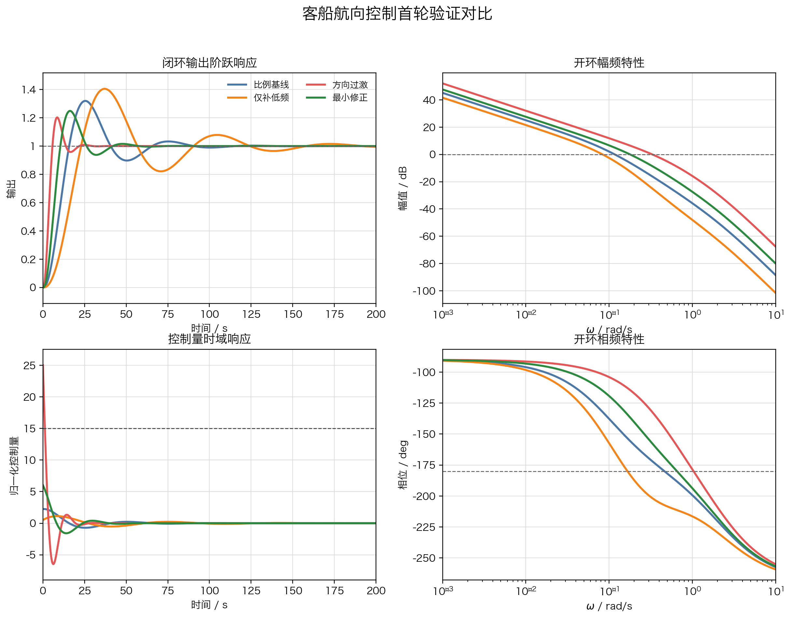
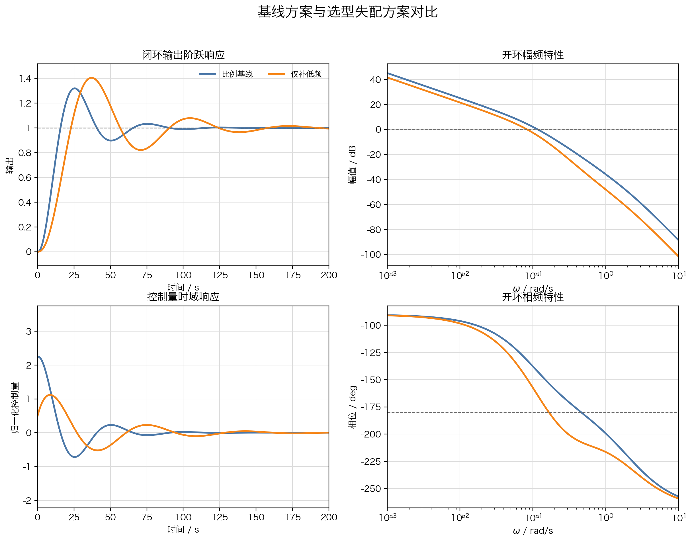
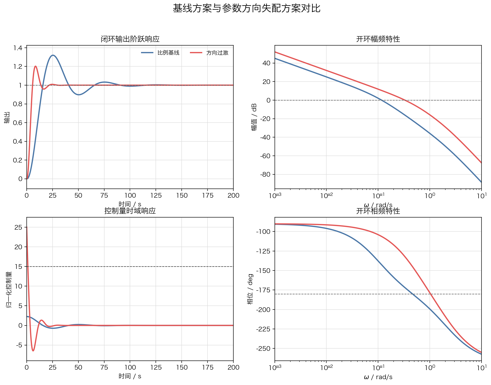
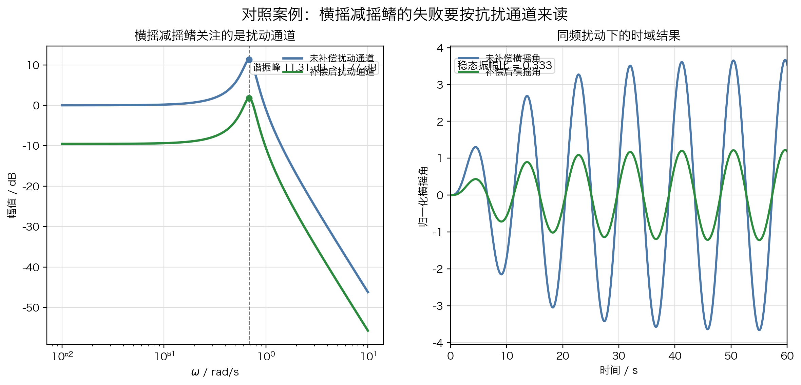

# 单元 4-4 | 初始方案验证与失败诊断

- 课程：自动控制原理
- 层次：模块 4 实践主线 · 第四课
- 学时：90 分钟
- 知识类型：[D] 设计型
- 前置：已能把任务书写成“硬约束、软目标、观察指标”的三栏表达；已能写出首版初始方案与验证假设
- 讲义定位：这份讲义将带我们把首版方案放进统一验证情境，用证据判断第一次失败究竟暴露了结构问题、参数方向问题，还是任务表达漏项
- 后续：本讲形成的失败诊断卡与问题清单，将直接进入 `4-5` 的多目标权衡与优化设计

---

## 一、问题引入：为什么第一次落地不能直接进入下一轮改参

到 `4-3` 结束时，我们已经不再停留在“控制器名称”的层面，而是能把任务写成一张首版可验证方案表。对客船航向控制这一主场景，工作对象取为

$$
P_h(s)=\frac{0.01715}{s(s+0.1)(s+2.14375)}.
$$

围绕这同一对象，我们先后写下了四种首轮方案：

$$
\begin{aligned}
C_{\mathrm{base}}(s) &= 2.25,\\
C_{\mathrm{LF}}(s) &= 1.5\frac{2s+1}{6s+1},\\
C_{\mathrm{F}}(s) &= 5\frac{10s+1}{2s+1},\\
C_{\mathrm{R}}(s) &= 3\frac{10s+1}{5s+1}.
\end{aligned}
$$

它们分别代表四种不同的设计状态：

1. `比例基线`：系统先工作起来，但还没有形成真正的设计分工。
2. `仅补低频`：把注意力集中到低频保持能力，却没有显式整理中频动态。
3. `方向过激`：已经抓住动态整理方向，但作用强度与作用频段都推得过猛。
4. `最小修正`：诊断以后做出的第一轮回收方案，用来验证归因是否有效，而不是宣布最终完成。

本讲把这四类方案统一放进同一组测试条件：

1. 输出先看单位阶跃响应。
2. 控制量峰值约束写成 $|u| \le 15$。
3. 频域读回同时记录截止频率 $\omega_c$ 与相角裕度。

{width=100%}

这一步要回答三个更基础的问题：

1. 预期改善有没有真的发生。
2. 最先坏掉的是硬约束，还是仍可继续优化的软目标。
3. 若结果不对，问题出在结构骨架、参数方向，还是原任务表达本身。

第一次验证的价值，就在于把这些问题写实。若我们跳过诊断，直接继续调参，后续每一步都会失去依据。

---

## 二、前置缺口与本课能力目标

上一讲已经解决了“初始方案怎样写出来”的问题，但还有三块内容没有补齐。

### 2.1 当前仍缺什么

第一，首版方案写出了结构骨架与参数方向，却还没有经过统一测试。
第二，纸面上的“预期收益”与“明示代价”仍停留在判断层，尚未变成证据。
第三，若方案第一次落地失败，我们还缺少一套稳定的归因语言，容易把所有问题都写成“再调一调参数”。

### 2.2 学完这一讲后，我们要能完成哪些动作

学完以后，我们应当能够独立完成下面五件事：

1. 回收 `4-3` 的方案表达与验证假设，不把第一次验证做成无目标的上机试验。
2. 用统一对象、统一测试条件记录“预期改善 / 预期代价 / 实际后果”三栏对照。
3. 区分 `选型失配`、`参数方向失配`、`约束表达不足` 三类失败。
4. 把失败转写成一张可供 `4-5` 继续使用的问题清单。
5. 区分给定跟踪任务与扰动抑制任务在验证重点上的差别。

---

## 三、统一验证框架：先写对照，再做归因

### 3.1 第一次验证之前，必须先回收两张输入表

第一次验证不是重新选结构，也不是立即求最优参数。进入仿真或实验之前，我们至少要先把两张输入表摆在桌面上：

表1. 首轮验证的输入

| 输入文档 | 至少包含什么 |
| --- | --- |
| 初始方案表达表 | 当前方案、结构骨架、参数方向、预期收益、明示代价 |
| 验证假设单 | 最希望先改善哪一项，最担心先坏掉哪条边界，若失败先怀疑什么 |

这两张表的作用，是保证我们在看图之前已经知道自己在验证什么。若没有这一步，后面的所有曲线都会退化成“看完再说”的印象判断。

### 3.2 统一测试结果要整理成同一张对照表

表2. 客船航向控制首轮验证对照

| 方案 | 原本想先改善什么 | 超调 / % | 调节时间 / s | 相角裕度 / deg | 截止频率 $\omega_c$ / rad/s | 控制峰值 | 首轮判断 |
| --- | --- | ---: | ---: | ---: | ---: | ---: | --- |
| 比例基线 $C_{\mathrm{base}}$ | 先让系统进入工作状态 | 31.97 | 83.1 | 37.43 | 0.1169 | 2.25 | 能跟踪，但过程偏冲、偏拖 |
| 仅补低频 $C_{\mathrm{LF}}$ | 先托住低频保持能力 | 41.28 | 176.1 | 30.80 | 0.0835 | 1.12 | 主要矛盾没有被接住 |
| 方向过激 $C_{\mathrm{F}}$ | 明显压缩动态过程 | 20.24 | 19.6 | 47.83 | 0.3300 | 25.00 | 输出改善出现，但控制量先越界 |
| 最小修正 $C_{\mathrm{R}}$ | 在动态改善与控制代价之间先回收一轮 | 24.87 | 39.1 | 43.50 | 0.1785 | 6.00 | 诊断已经能指导下一轮方向 |

把这张表读清以后，我们会立刻看到三条事实：

1. 控制量小不等于方案合理，关键要看主要矛盾是否真的被覆盖。
2. 动态明显改善也不等于可以直接判成功，必须先检查硬约束是否被突破。
3. 同样叫“失败”，它们暴露的层次并不相同。

### 3.3 归因顺序必须固定

第一次失败最容易出现的混乱，来自顺序颠倒。更稳妥的读表顺序是：

1. 先看硬约束：控制量、执行边界、通道性质是否已经先出问题。
2. 再看软目标：超调、调节时间、储备是否朝预期方向改善。
3. 最后看方向一致性：频域读回是否支持原先的结构判断。

只有按这个顺序读，我们才能分清“越界问题”和“仍可优化问题”。

### 3.4 本讲最终要交出的三张表

第一次验证结束以后，本讲至少要形成下面三类产出。

表3. 预期/实际对照表模板

| 字段 | 应填写的内容 |
| --- | --- |
| 当前方案 | 当前控制器表达式或方案编号 |
| 原本想先改善什么 | 例如“先托住低频保持能力”“先压缩动态过程” |
| 原本预计的代价 | 例如“控制量可能上升”“储备可能收紧” |
| 实际先看到什么 | 输出、控制量、频域上最先出现的事实 |
| 最先坏掉的边界 | 硬约束、软目标，还是任务表达 |
| 证据来源 | 图、表或具体数值 |

表4. 失败诊断卡模板

| 字段 | 应填写的内容 |
| --- | --- |
| 失败类型 | 选型失配 / 参数方向失配 / 约束表达不足 |
| 主要证据 | 至少两条，且来自不同表征 |
| 当前归因 | 说明问题首先落在结构、方向，还是任务表达 |
| 暂不下结论的部分 | 哪些问题还需要带到下一轮验证 |

表5. 问题清单移交表模板

| 当前症状 | 现阶段结论 | 下一轮先问什么 |
| --- | --- | --- |
| 硬约束被突破 | 当前方案已越界 | 应先回收哪一段作用强度 |
| 软目标明显落后 | 主要矛盾未被覆盖 | 是否需要补入新的机制线 |
| 任务通道理解错误 | 题目本身读错了 | 是否应重写任务书与验证情境 |

---

## 四、主案例：客船航向控制中的两类典型失败

### 4.1 “仅补低频”更像选型失配

{width=100%}

把 `比例基线` 与 `仅补低频` 摆在一起，三类证据会指向同一结论。

第一，输出侧并没有改善主要矛盾。超调从 $31.97\%$ 增大到 $41.28\%$，调节时间从 $83.1\,\text{s}$ 拉长到 $176.1\,\text{s}$。
第二，控制量虽然下降到 $1.12$，但系统并没有把该有的动态整理真正做出来。
第三，截止频率由 $0.1169$ 降到 $0.0835$，系统整体工作节奏继续被压低，中频附近也没有形成有效的动态整理。

因此，这一类失败更适合写成：

- 当前动作确实落在低频一侧；
- 但任务本身同时要求低频保持能力和中频动态品质；
- 现有结构骨架只覆盖了其中一段，所以主要矛盾没有被接住。

这就是 `选型失配` 的典型特征。结构没有完全离题，但结构分工仍不完整。

### 4.2 “方向过激”更像参数方向失配

{width=100%}

把 `比例基线` 与 `方向过激` 摆在一起，证据呈现出另一种形态。

第一，输出动态确实改善了。超调降到 $20.24\%$，调节时间压缩到 $19.6\,\text{s}$。
第二，频域读回也支持这一点。截止频率提升到 $0.33\,\text{rad/s}$，相角裕度提高到 $47.83^\circ$，说明中频整理已经发生。
第三，真正先出问题的是控制量。控制峰值达到 $25.00$，明显超过约束 $15$。

因此，这一类失败更适合写成：

- 结构方向大体是对的；
- 频域动作也确实发生在想整理的那一段；
- 问题出在作用强度与作用频段的组合过于激进，执行边界先被突破。

这就是 `参数方向失配` 的典型特征。结构判断可以保留，但参数方向必须回收。

### 4.3 “最小修正”为什么重要

`最小修正` 并不是最终答案，它的作用是验证前面的诊断有没有真正转化为下一步行动。
在表2中，它同时表现出三点：

1. 超调和调节时间较基线明显回收；
2. 控制量重新落回可接受区间；
3. 截止频率与相角裕度停在一个更平衡的位置。

因此，`最小修正` 的意义在于说明：第一次失败并没有把设计链打断。只要归因准确，失败信息就能直接转写成下一轮可执行的问题。

---

## 五、对照案例：横摇减摇鳍提醒我们检查任务通道

主案例已经说明，第一次失败可能来自结构不完整，也可能来自参数方向过激。
横摇减摇鳍再补上一层提醒：有时控制器本身还没有错，先错的是任务读法。

### 5.1 这个对象首先是扰动抑制问题

对横摇减摇鳍而言，我们首先关心海浪扰动力矩进入以后，横摇是否被有效压住。若把横摇角对扰动力矩的关系写成

$$
G_{\varphi M_f}(s)=\frac{1}{2.052s^2+0.3929s+1},
$$

那么对象本身就是一个以外部扰动力矩为输入的二阶振荡系统。
这一点会直接决定验证重点：我们应当先看谐振峰有没有被压低，而不是先问阶跃给定是否更快。

### 5.2 补偿结构为什么会写成三项力矩分量

船舶横摇运动方程可以写成

$$
\left(I_X+\Delta I_X\right)\ddot{\varphi}+2N_\mu\dot{\varphi}+Dh\varphi=M_f-M_k.
$$

这个式子把惯性、阻尼、恢复三类力矩都摆到了桌面上。若希望控制力矩去对冲扰动，最自然的补偿写法就是

$$
M_k=A\varphi+B\dot{\varphi}+C\ddot{\varphi}.
$$

若再让三项系数满足

$$
\frac{A}{Dh}=\frac{B}{2N_\mu}=\frac{C}{I_X+\Delta I_X}=P,
$$

闭环后就可化成

$$
\left(I_X+\Delta I_X\right)\ddot{\varphi}+2N_\mu\dot{\varphi}+Dh\varphi=\frac{M_f}{1+P}.
$$

当 $P=2$ 时，扰动通道理论上会缩小到原来的 $\frac{1}{3}$。此处的控制结构服务于扰动通道削弱。

{width=90%}

### 5.3 若仍按跟踪语言去读，就属于约束表达不足

{width=100%}

补偿前后的对比给出三条直接证据：

1. 未补偿时，谐振峰出现在 $\omega_r \approx 0.682\,\text{rad/s}$，峰值约为 $11.31\,\text{dB}$。
2. 补偿后，同一频率处的峰值降到约 $1.77\,\text{dB}$。
3. 同频扰动下，稳态横摇振幅降为原来的 $\frac{1}{3}$。

因此，这个案例真正要问的是：

1. 扰动通道是否被削弱。
2. 谐振频段是否被压住。
3. 这种削弱是否来自正确的分量补偿结构。

若我们仍把它写成“给定跟踪够不够快、超调大不大”，归因就会偏离真正的任务重点。
更准确的判断是：任务书漏写了关键通道，这类问题应归入 `约束表达不足`。

---

## 六、最小例题：怎样把一组验证结果写成失败诊断

现有某方案的首轮测试结果如下：

- 原本想先压缩动态过程；
- 超调为 $20.24\%$，调节时间为 $19.6\,\text{s}$；
- 相角裕度为 $47.83^\circ$，截止频率为 $0.33\,\text{rad/s}$；
- 控制峰值为 $25.00$，已超过约束 $15$。

请判断这更像哪一类失败，并写出下一轮应优先追问的问题。

### 解答

**第 1 步：先看硬约束。**
控制峰值已经超过约束，因此当前问题首先属于方案越界。

**第 2 步：再看方向是否有效。**
超调和调节时间都明显改善，频域上截止频率也提高，说明结构方向并没有离题。

**第 3 步：形成诊断。**
这一组证据更符合 `参数方向失配`：结构方向基本正确，但作用强度或作用频段过于激进。
下一轮应优先追问：在不放弃动态改善的前提下，应先回收哪一段作用强度，才能把控制量拉回边界内。

这个例题最关键的地方，是把“动态改善出现了”与“硬约束已越界”同时写出来。少任何一条，归因都会失真。

---

## 七、分层练习

### 练习 1：基础练习

围绕 `仅补低频` 方案，完成一张三栏对照表：

1. 原本想先改善什么。
2. 实际先看到什么。
3. 最先坏掉的是哪一类边界。

完成后，用两句话说明它更像 `选型失配` 还是 `参数方向失配`。

### 练习 2：进阶练习

某方案测试结果如下：

- 超调 $26\%$，调节时间 $44\,\text{s}$；
- 相角裕度 $42^\circ$，截止频率 $0.18\,\text{rad/s}$；
- 控制峰值 $6.8$，未超过约束；
- 设计预期是“先把动态改善拉回来，再看能否继续压缩控制代价”。

请判断：

1. 当前问题属于“硬约束被破”还是“软目标仍未达”。
2. 这一结果是否已经具备带入 `4-5` 做权衡分析的条件。
3. 下一轮更应优先检查结构骨架，还是继续检查参数方向。

### 练习 3：综合练习

围绕横摇减摇鳍案例，完成下面三项任务：

1. 用三句话重写该对象的任务书，明确对象、主要输入和主要输出。
2. 说明为什么此处应优先看扰动通道而不是给定跟踪曲线。
3. 写出一条“若仍按跟踪语言解释，会导致什么归因错误”的提醒语。

---

## 八、特殊情况与常见误判

### 8.1 不能把所有失败都写成“再调一调参数”

若主要矛盾根本没有被覆盖，问题落在结构骨架；若控制量已经先越界，问题落在硬约束；若任务通道本身读错，问题落在任务表达。
这三类问题的下一步并不相同，因此不能混写。

### 8.2 不能只看时域图

时域图告诉我们结果发生了什么，频域图告诉我们动作落在哪一段，控制量曲线告诉我们代价先在哪一侧暴露。
只看时域图，最容易把“结果更快”误判成“方案更合理”。

### 8.3 不能把抗扰任务按给定跟踪任务解释

主案例中的客船航向控制，验证重点落在跟踪过程、储备与控制量。
横摇减摇鳍则首先关心谐振压制和扰动削弱。
对象不同，任务通道不同，失败诊断的关注重点也会不同。

---

## 九、本节小结

1. 第一次验证的任务，是把 `4-3` 的纸面方案放进统一测试情境，写清预期与实际的差异。
2. `选型失配`、`参数方向失配`、`约束表达不足` 分别对应结构不完整、方向过激和任务书漏项三种不同层次。
3. 客船航向控制是本讲主案例，负责建立失败分类语言；横摇减摇鳍只是对照案例，用来提醒我们检查任务通道。
4. 本讲形成的主要产物，是预期/实际对照表、失败诊断卡和问题清单移交表。

若这三张表写清楚了，第一次失败就已经转化成了下一轮优化的输入。

---

## 附录：统一验证记录模板

表6. 预期/实际对照空白表

| 当前方案 | 原本想先改善什么 | 原本预计的代价 | 实际先看到什么 | 最先坏掉的边界 | 证据来源 |
| --- | --- | --- | --- | --- | --- |
|  |  |  |  |  |  |

表7. 失败诊断卡空白表

| 失败类型 | 主要证据 1 | 主要证据 2 | 当前归因 | 暂不下结论的部分 |
| --- | --- | --- | --- | --- |
|  |  |  |  |  |

表8. 问题清单移交空白表

| 当前症状 | 现阶段结论 | 下一轮先问什么 |
| --- | --- | --- |
|  |  |  |
