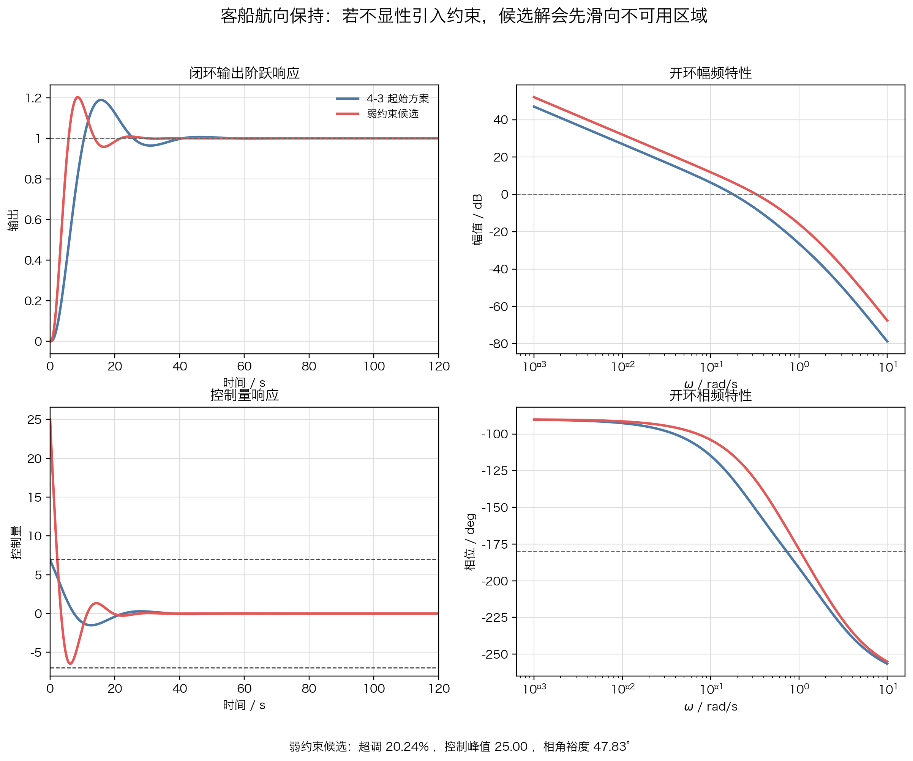
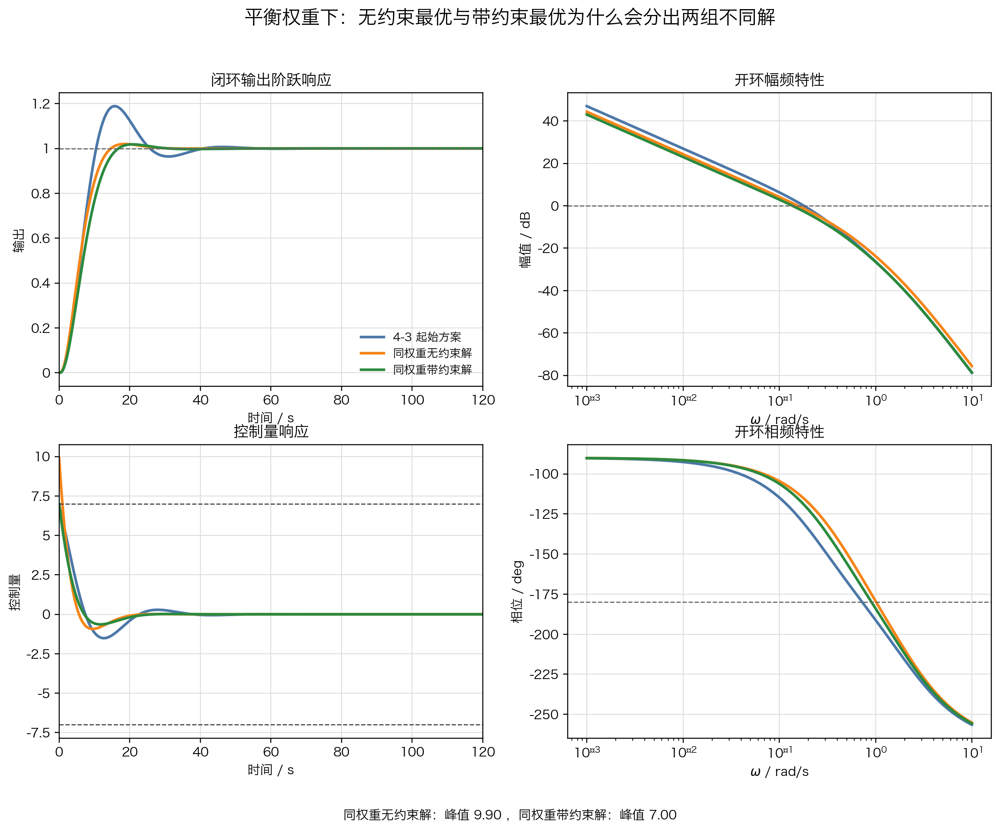
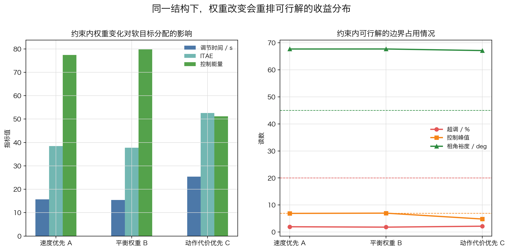
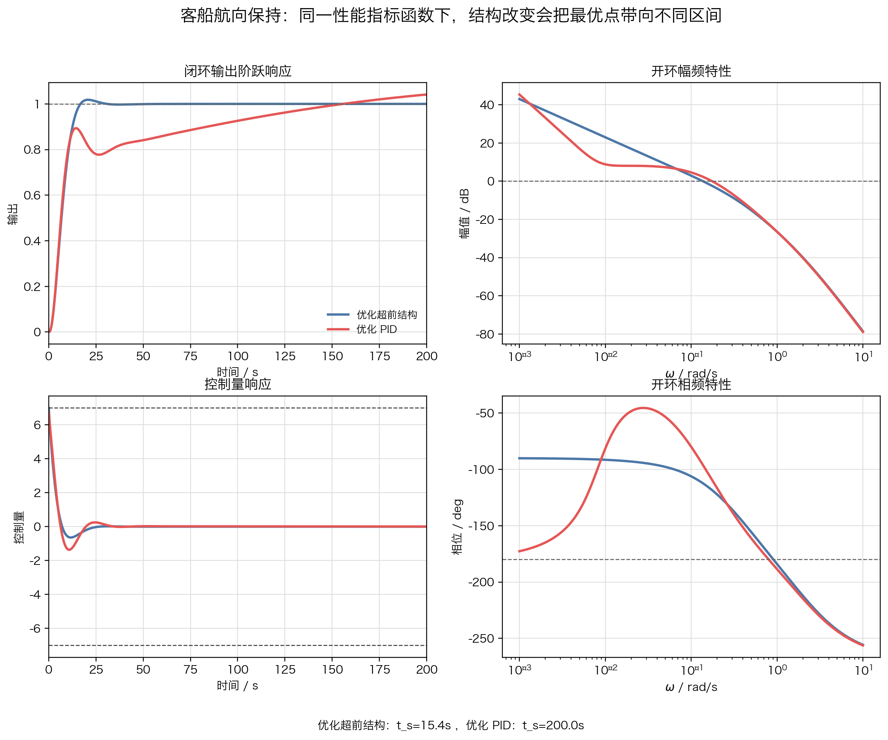

# 单元 4-5 | 约束下的优化设计实践：参数约束翻译与带约束参数优化

- 课程：自动控制原理
- 层次：模块 4 实践主线 · 第五课
- 学时：90分钟
- 知识类型：[D] 设计型
- 前置：已能够写出固定结构参数向量、归一化基准与无约束加权目标，并已得到一版看似合理的候选解
- 讲义定位：这份讲义从 `4-4` 的无约束候选解出发，先揭露它为何越过工程边界，再把这些边界写成硬约束和罚函数，完成一轮带约束参数优化
- 后续：这里得到的带约束可用解将进入 `4-6` 的场景迁移与边界比较

## 一、问题引入：为什么“自由目标更优”不等于“工程上可用”

上一课已经把客船航向保持写成固定结构下的无约束加权优化问题。对象仍取为

$$
P_h(s)=\frac{0.01715}{s(s+0.1)(s+2.14375)}.
$$

控制器结构保持为超前形式

$$
C_h(s)=K\frac{Ts+1}{\alpha Ts+1},
\qquad 0<\alpha<1.
$$

在“先压速度和拖尾”的偏好下，上一课给出了一版无约束候选：

$$
C_u(s)=5\frac{10s+1}{2s+1}.
$$

从自由目标看，这版候选很有吸引力：调节时间更短，`ITAE` 更小，`ITSE` 也同步下降。问题恰恰在这里。若课堂只停在上一页，我们很容易把“自由目标更优”误判成“方案已经可用”。

因此，本课真正要补上的动作是：

- 先拿 `4-4` 的无约束候选做工程复核；
- 再把那些不能继续含糊处理的边界升格为硬约束；
- 最后让求解器在这些边界内重新搜索一版可交付的参数解。

## 二、本次课程目标

完成这一轮实践后，我们应能完成以下工作：

1. 能指出无约束候选为什么会在真实工程边界下失真。
2. 能把超调、控制峰值和相角裕度写成硬约束，而不是继续停留在口头提醒。
3. 能解释参数范围与输出侧硬约束在模型中分别承担什么职责。
4. 能写出罚函数表达，并说明为什么它能把搜索拉回可用区域。
5. 能比较起始方案、无约束候选和带约束可用解的差异，说明约束到底改变了什么。

## 三、先做复核：`4-4` 的无约束候选到底出了什么问题

### 3.1 从自由目标看，它确实很有诱惑力

先回收上一课已经得到的自由目标项对比：

表 1. 起始方案与无约束候选的自由目标项对比

| 指标 | `4-3` 起始方案 | `4-4` 无约束候选 | 上一课得到的结论 |
| --- | ---: | ---: | --- |
| 调节时间 / s | 36.0 | 19.6 | 更快 |
| `ITAE` | 63.6924 | 20.1632 | 拖尾更短 |
| `ITSE` | 16.5282 | 5.3330 | 前中段误差强度也下降 |
| 控制能量 | 125.7148 | 774.9575 | 为收益支付了很大动作代价 |

如果课程只比较这四项，很容易把 `C_u(s)` 看成一版“足够好”的结果。也正因为如此，下一步的工程复核才不能省略。

### 3.2 一旦回到工程边界，问题立刻暴露

把无约束候选重新放回完整证据中，得到下面这组读数：

表 2. 起始方案与无约束候选的工程复核

| 指标 | `4-3` 起始方案 | `4-4` 无约束候选 | 复核结论 |
| --- | ---: | ---: | --- |
| 超调 / % | 18.8636 | 20.2410 | 已越过舒适性边界 |
| 调节时间 / s | 36.0 | 19.6 | 收敛明显更快 |
| `ITAE` | 63.6924 | 20.1632 | 拖尾明显缩短 |
| `ITSE` | 16.5282 | 5.3330 | 前中段误差强度下降 |
| 控制能量 | 125.7148 | 774.9575 | 动作代价急剧上升 |
| 控制峰值 | 6.8867 | 25.0000 | 远超执行机构边界 |
| 相角裕度 / deg | 49.0462 | 47.8274 | 裕度仍在，但没有换来更稳妥的整体结果 |

这张表说明了一个关键事实：`C_u(s)` 不是“完全无效”，它的改进方向本身是对的；但它把自由目标带来的收益建立在越界代价之上，因此不能直接进入工程实现。

### 3.3 图上最先看见的是什么

如果把起始方案和无约束候选画到同一张图上，问题会更直观。

{width=100%}

这张图至少暴露了三件事：

1. 无约束候选确实把闭环输出更快压向目标，说明上一课的加权目标并没有走错方向。
2. 控制量曲线远远冲过原本可接受的动作区间，说明求解器把执行机构当成了可以无限透支的资源。
3. 即使部分频域读数没有立刻崩坏，这种大动作也已经足以使“更优”失去工程意义。

因此，本课的入口不是“再换一组权重试试”，而是“先把哪些边界绝对不能继续含糊处理说清楚”。

## 四、硬约束第一次被显性提出

### 4.1 哪三条边界必须升格为硬约束

对客船航向保持而言，当前至少要把下面三条边界显性写出来：

$$
M_p \le 20\%, \qquad
\max |u(t)| \le 7, \qquad
\phi_m \ge 45^\circ.
$$

这三条边界分别对应三种不同的工程责任：

- 超调边界对应舒适性与修航平稳程度；
- 控制峰值边界对应执行机构的物理能力；
- 相角裕度边界对应闭环对模型偏差和外部扰动的承受能力。

表 3. 三条硬约束各自挡住什么风险

| 边界 | 挡住的风险 | 若不显性写出会怎样 |
| --- | --- | --- |
| $M_p \le 20\%$ | 把越摆当作可无限接受的提速代价 | 输出过程越来越激进 |
| $\max |u(t)| \le 7$ | 把执行机构边界当成可透支资源 | 候选解看似更快，实则不可实现 |
| $\phi_m \ge 45^\circ$ | 只看时域变快，不看稳健性储备 | 结果对模型偏差更脆弱 |

硬约束的作用不是告诉我们“什么更优”，而是先把那些绝不能接受的解挡在外面。

### 4.2 参数范围和硬约束不是同一种东西

上一课已经写过参数范围：

$$
1 \le K \le 6,\qquad
4 \le T \le 15,\qquad
0.15 \le \alpha \le 0.85.
$$

它们的职责是保证搜索还停留在当前超前结构的可解释区间内。

本课新增的三条硬约束，职责则完全不同：它们直接裁决输出过程和工程边界能不能接受。也就是说：

- 参数范围负责“结果还属不属于当前结构”；
- 硬约束负责“这个结果能不能交付”。

如果只保留前者而没有后者，求解器仍然会在一个“结构上说得通、工程上却可能失真”的区域里搜索。

### 4.3 先有边界，后有求解器

到这里，当前案例的角色分工已经明确：

表 4. 本课中的模型分工

| 设计对象 | 在模型中的角色 | 写入方式 |
| --- | --- | --- |
| $K,T,\alpha$ 的结构解释 | 参数范围 | 维持固定结构可解释区间 |
| 超调、控制峰值、相角裕度 | 硬约束 | 越界时进入罚函数或直接判为不可行 |
| 调节时间、`ITAE`、控制能量 | 软目标 | 在守住边界后继续争取 |
| `ITSE`、截止频率、幅值裕度 | 复核证据 | 求解后解释为什么可信 |

这一步的顺序不能反过来。不是先拿到求解器，再临时往里塞几个约束名词；而是先把哪些边界不能破写清楚，再决定求解器怎样执行。

## 五、把边界写进模型：罚函数为什么成为必要工具

### 5.1 先保留上一课的自由目标

上一课的自由目标保持不变：

$$
J_{\mathrm{free}}(\theta)=
w_1\frac{t_s(\theta)}{40}
+
w_2\frac{\mathrm{ITAE}(\theta)}{\mathrm{ITAE}_0}
+
w_3\frac{\mathrm{ITSE}(\theta)}{\mathrm{ITSE}_0}
+
w_4\frac{E_u(\theta)}{E_{u,0}}.
$$

这是因为上一课写下的偏好并没有失效。真正新增的，不是另一套偏好，而是“偏好必须在边界内争取”这一层规则。

### 5.2 罚函数把越界代价显性写进目标

对当前案例，可以写成

$$
J_{\mathrm{con}}(\theta)=J_{\mathrm{free}}(\theta)+P(\theta),
$$

其中

$$
P(\theta)=
50\max(0,M_p-20)^2
+
20\max(0,u_{\max}-7)^2
+
5\max(0,45-\phi_m)^2.
$$

这条式子的含义很直接：

- 只要结果不越界，罚函数为零，搜索仍按原有偏好推进；
- 一旦某条边界被突破，总代价会迅速放大；
- 越界越严重，求解器就越倾向于把搜索拉回边界内。

这就是本课为什么引入罚函数。它不是算法炫技，而是把“边界不能只当注释”这件事真正写进模型本体。

### 5.3 `fmincon` 在这里是什么角色

本课可以用两种方式实现同一件事：

- 直接使用罚函数，让无约束求解器通过总代价变化自行远离越界区；
- 使用 `fmincon` 一类带约束求解器，把边界显式交给求解器管理。

两种方式都可以，但课堂重点不在工具选型本身，而在“边界已经被显性写入模型”。只要这一步没有完成，换再高级的求解器也只是更快地搜索失真解。

## 六、带约束求解：怎样把搜索拉回可用区域

### 6.1 当前求解输入

到本课为止，真正决定求解行为的最小输入如下：

表 5. 带约束参数优化的最小输入

| 项目 | 当前写法 |
| --- | --- |
| 对象 | $P_h(s)=\dfrac{0.01715}{s(s+0.1)(s+2.14375)}$ |
| 结构 | $C_h(s)=K\dfrac{Ts+1}{\alpha Ts+1}$ |
| 起点 | $\theta_0=[2.796,\ 10,\ 0.406]^{\mathsf T}$ |
| 参数范围 | $1\le K\le 6,\ 4\le T\le 15,\ 0.15\le \alpha\le 0.85$ |
| 自由目标 | 速度、拖尾、误差强度、控制能量 |
| 硬约束 | $M_p\le20\%$，$\max |u(t)|\le 7$，$\phi_m\ge45^\circ$ |
| 复核项 | `ITSE`、截止频率、幅值裕度 |

求解器此时承担的工作只有一件事：在已写清的边界内重新搜索更优参数。

### 6.2 `fmincon` 求解流程拆解

前面已经把对象、结构、目标函数和硬约束都写清了，接下来真正需要补上的不是“再解释一遍优化思想”，而是把这些量如何交给 `fmincon` 说透。对当前主案例，最小实现可以压成五步。

第一步，把参数向量、初值和边界交给求解器：

```matlab
x0 = [2.796; 10.0; 0.406];
lb = [1; 4; 0.15];
ub = [6; 15; 0.85];
```

第二步，保持上一课已经确定的性能指标函数，不再临时改写权重语义。以下面这组平衡权重为例：

$$
B=[0.30,\ 0.30,\ 0.20,\ 0.20].
$$

它对应的目标函数仍然是

$$
J_B(\theta)=
0.30\frac{t_s(\theta)}{40}
+0.30\frac{\mathrm{ITAE}(\theta)}{\mathrm{ITAE}_0}
+0.20\frac{\mathrm{ITSE}(\theta)}{\mathrm{ITSE}_0}
+0.20\frac{E_u(\theta)}{E_{u,0}}.
$$

在代码里，只需要把四项指标读出来再按权重合成：

```matlab
objective = @(x) weighted_cost(x, plant, t, refs, [0.30, 0.30, 0.20, 0.20]);
```

第三步，把三条硬约束写成 `nonlcon`。`fmincon` 只接受“$c(x)\le 0$”的形式，因此应写成

```matlab
function [c, ceq] = nonlcon(x, plant, t)
    metrics = collect_metrics(x, plant, t);
    c = [
        metrics.overshoot - 20;
        metrics.control_peak - 7;
        45 - metrics.phase_margin
    ];
    ceq = [];
end
```

第四步，调用求解器：

```matlab
options = optimoptions('fmincon', 'Algorithm', 'sqp', 'Display', 'iter');
[x_star, fval] = fmincon(objective, x0, [], [], [], [], lb, ub, ...
    @(x) nonlcon(x, plant, t), options);
```

第五步，把输出参数重新翻译回控制器：

```matlab
K = x_star(1);
T = x_star(2);
alpha = x_star(3);
C_star = K * (T * s + 1) / (alpha * T * s + 1);
```

也就是说，`fmincon` 并没有替我们决定设计逻辑。真正起决定作用的仍是三件事：目标函数怎么写、`nonlcon` 里塞了哪些边界、初值与边界区间是否来自前面的设计证据。

### 6.3 同一权重下，无约束与有约束为什么会分出两组不同解

为了把“约束改变的到底是什么”说清楚，先固定上一课已经出现过的平衡权重，不再改动偏好本身：

平衡权重 $B=[0.30,0.30,0.20,0.20]$。

在这组权重下，无约束最优和带约束最优分别是

$$
C_B(s)=2.0644\frac{9.9804s+1}{2.0809s+1},
\qquad
C_{B,c}(s)=1.7679\frac{10.4676s+1}{2.6452s+1}.
$$

对照的三条控制器分别是

$$
C_0(s)=2.796\frac{10s+1}{4.06s+1},
\qquad
C_B(s)=2.0644\frac{9.9804s+1}{2.0809s+1},
\qquad
C_{B,c}(s)=1.7679\frac{10.4676s+1}{2.6452s+1}.
$$

表 6. 同一权重下的三方案对比

| 方案 | 调节时间 / s | `ITAE` | `ITSE` | 控制能量 | 控制峰值 | 相角裕度 / deg |
| --- | ---: | ---: | ---: | ---: | ---: | ---: |
| `4-3` 起始方案 | 36.0 | 63.692 | 16.528 | 125.715 | 6.887 | 49.046 |
| 同权重无约束解 | 13.5 | 28.265 | 12.404 | 122.910 | 9.901 | 67.747 |
| 同权重带约束解 | 15.4 | 37.784 | 16.486 | 79.767 | 6.996 | 67.694 |

{width=100%}

这张图和这张表合起来说明了一件非常关键的事：约束改变的不是权重语言，而是可行域。无约束最优并没有违背平衡权重的偏好，相反，它正是过于忠实地沿着这组偏好继续压时间和累计误差，才把控制峰值推到了 `9.901`。`fmincon` 加进来以后，偏好仍然是这组偏好，但求解器被迫在“峰值不能越界”的可行域里重新找点，于是得到的 `C_{B,c}(s)` 自然会更慢一些，却把控制能量明显压低。

因此，同一权重下两组最优解并存，不是因为目标函数前后不一致，而是因为“有没有把边界写成求解器必须 obey 的规则”这件事，直接改变了最优点能落在哪里。

### 6.4 权重影响：可行域不变时，收益会怎样被重新分配

在同样的硬约束之内，再看三组不同权重：
三组权重分别取
$A=[0.40,0.30,0.20,0.10]$、
$B=[0.30,0.30,0.20,0.20]$、
$C=[0.20,0.25,0.25,0.30]$。

表 7. 约束内权重扫掠结果

| 方案 | 调节时间 / s | `ITAE` | 控制能量 | 控制峰值 | $\phi_m$ / deg | 超调 / % |
| --- | ---: | ---: | ---: | ---: | ---: | ---: |
| 速度优先 $A$ | 15.7 | 38.479 | 77.371 | 6.902 | 67.684 | 1.963 |
| 平衡权重 $B$ | 15.4 | 37.784 | 79.767 | 6.996 | 67.694 | 1.819 |
| 动作代价优先 $C$ | 25.4 | 52.566 | 51.145 | 4.825 | 67.113 | 2.167 |

{width=100%}

这一步最值得看的是两条趋势：

1. `A` 和 `B` 的过程速度已经非常接近，说明一旦硬约束开始主导，继续把权重往“更快”那一侧推，并不会无限换来速度收益。
2. `C` 组明显把控制能量和控制峰值继续压下来了，但调节时间回升到 `25.4 s`，说明当权重开始显著照顾动作代价时，可行解会主动回到更保守的时间尺度。

因此，权重并不是一句空话。即使硬约束已经固定，可行域中的收益分配仍会被权重重排；只是这种重排不再允许越界那种“假优”继续混进来。

### 6.5 同一主案例下：优化 PID 和优化超前结构为什么会分化

尽管在给定结构下已经找到一版最合适的参数解，但起初指定的结构就一定最合适吗？如果对象不变、评价函数不变、硬约束也不变，只把控制器结构从当前超前结构改成 `PID`，最优点会怎样移动？

这里不再换新对象，仍用客船航向保持主案例，并继续采用平衡权重 $B=[0.30,0.30,0.20,0.20]$ 对应的归一化代价函数以及同样三条硬约束。这样得到的两条最优控制器分别是

$$
C_{LL}^\star(s)=1.7679\frac{10.4676s+1}{2.6452s+1},
$$

$$
C_{PID}^\star(s)=0.3205\left(1+\frac{1}{137.3s}+\frac{100.0s}{5.0s+1}\right).
$$

表 8. 同一主案例下，不同结构的最优解对比

| 方案 | 调节时间 / s | `ITAE` | `ITSE` | 控制能量 | 控制峰值 | 相角裕度 / deg | 超调 / % |
| --- | ---: | ---: | ---: | ---: | ---: | ---: | ---: |
| 优化超前结构 | 15.4 | 37.784 | 16.486 | 79.766 | 6.996 | 67.694 | 1.820 |
| 优化 PID | 200.0 | 1063.966 | 118.036 | 95.775 | 6.731 | 70.601 | 4.123 |

{width=100%}

这一步最值得看的不是谁“赢了”，而是结构如何改写了可达最优区间：

- 在同一代价函数下，优化超前结构的归一化代价约为 `0.620`，而优化 `PID` 的归一化代价约为 `8.092`；
- `PID` 为了守住同样的控制峰值和稳健性边界，被迫把积分作用放得很弱，同时把动态整体拖慢到 `200 s` 的观察窗口边缘；
- 优化 `PID` 的开环相频在低频段贴近 `-180°` 是合理的，因为对象本身已经带一个积分环节，`PID` 又再引入一个积分项，所以低频开环会先表现出近似两个积分环节叠加的相位特征。

因此，参数优化只能回答“在这一个结构里怎样调最好”，却不能替我们回答“这个结构本身是不是最合适”。这正是后续结构优化要接住的问题。

### 6.6 三方案比较真正说明了什么

表 9. 三方案关键指标对比

| 指标 | `4-3` 起始方案 | 越界无约束候选 | `4-5` 带约束可用解 |
| --- | ---: | ---: | ---: |
| 超调 / % | 18.8636 | 20.2410 | 1.8194 |
| 调节时间 / s | 36.0 | 19.6 | 15.4 |
| `ITAE` | 63.6924 | 20.1632 | 37.7835 |
| `ITSE` | 16.5282 | 5.3330 | 16.4860 |
| 控制能量 | 125.7148 | 774.9575 | 79.7669 |
| 控制峰值 | 6.8867 | 25.0000 | 6.9960 |
| 相角裕度 / deg | 49.0462 | 47.8274 | 67.6942 |

这张表最有价值的地方不在于哪一列最小，而在于它清楚说明了约束改变了搜索方向：

1. 无约束候选把时间和误差指标压得很低，却以极高的动作代价和明显越界换来这件事。
2. 带约束可用解不再追求那种极端激进的收益，而是在守住边界后，把速度、拖尾和动作代价一起压到更均衡的位置。
3. `ITSE` 从起始方案到带约束可用解几乎不变，这说明当前结果并没有靠放大前中段误差强度去换表面上的漂亮尾巴。

因此，硬约束不是把优化“做保守了”，而是把优化重新拉回可用设计空间。

### 6.7 参数变化为什么仍然合乎结构机理

带约束可用解相对起始方案的参数变化如下：

- $K$ 从 `2.796` 降到 `1.7679`，整体作用强度被明显收回；
- $T$ 从 `10` 调到 `10.4676`，零点仍停留在原来的有效工作频段附近；
- $\alpha$ 从 `0.406` 降到 `0.2527`，超前作用增强，用来提高阻尼和稳健性储备。

这三条变化说明：硬约束并没有把结果推离当前固定结构，反而逼着参数修正回到更合乎结构职责的方向。它不再靠粗暴增大整体作用强度去换速度，而是在动作、动态品质与稳健性之间重新分配余量。

## 七、当前结果为什么可接受，但还不是终局

一版可接受的参数解，至少要满足三条标准：

1. 参数仍能回到当前结构机理上解释；
2. 超调、控制峰值和相角裕度三条边界全部守住；
3. 改进收益能够在统一证据下被读出来，而不是只靠单个指标看起来更优。

当前带约束可用解满足这三条标准，因此它已经是一版真正可进入后续比较的方案。但它仍然不是终局，原因也很清楚：控制峰值从 `6.8867` 上升到 `6.9960`，虽然仍在边界内，却已经非常贴近 `7` 的上限。这说明当前结构在这个场景下仍然成立，但余量并不宽松。

更重要的是，这一课还额外告诉我们两件事：

- 同一权重下，有没有把边界写进求解器，会直接改写最优点的位置；
- 同一性能指标函数下，换一个控制器结构，最优点本身也会移动到完全不同的代价分布上。

因此，`4-5` 的收束并不是“参数已经算出来”，而是“参数优化的边界已经看清，结构差异的伏笔也已经露头”。

## 八、小结

这一课完成了六件关键工作：

1. 拿 `4-4` 的无约束候选做了完整工程复核；
2. 把超调、控制峰值和相角裕度升格为硬约束；
3. 用 `fmincon` 把目标函数、边界和参数区间接成了可执行求解链；
4. 说明了同一权重下无约束解与带约束解为什么会分开；
5. 讨论了权重改变时，可行解如何在速度、拖尾和动作代价之间重新分配收益；
6. 用同一主案例下的 `PID` 与超前结构对比，提前暴露了“结构也会改变最优区间”。

对本课而言，最重要的不是背住某组参数，而是记住这条链：

$$
\text{目标函数}
\rightarrow
\text{硬约束}
\rightarrow
\texttt{fmincon}
\rightarrow
\text{可行解比较}
\rightarrow
\text{结构差异暴露}.
$$

只有这条链走完，“更优”才真正具有工程意义。

## 附录 A：客船航向保持的 `fmincon` 完整代码

下面给出本讲主案例的一份完整 `MATLAB/Octave` 复现脚本。它把对象、目标函数、`nonlcon`、`fmincon` 调用和结果回读放在同一个文件中，便于直接复现。

```matlab
pkg load control
pkg load optim

s = tf('s');
plant = 0.01715 / (s * (s + 0.1) * (s + 2.14375));
t = 0:0.1:200;

x0 = [2.796; 10.0; 0.406];
lb = [1; 4; 0.15];
ub = [6; 15; 0.85];

refs = struct();
refs.ts_ref = 40.0;
refs.itae_ref = 63.6924;
refs.itse_ref = 16.5282;
refs.eu_ref = 125.7148;
weights = [0.30, 0.30, 0.20, 0.20];

objective = @(x) weighted_cost(x, plant, t, refs, weights);
options = optimoptions('fmincon', 'Algorithm', 'sqp', 'Display', 'iter');
[x_star, fval] = fmincon(objective, x0, [], [], [], [], lb, ub, ...
    @(x) nonlcon(x, plant, t), options);

K = x_star(1);
T = x_star(2);
alpha = x_star(3);
C_star = K * (T * s + 1) / (alpha * T * s + 1);

[metrics, y, u, tout] = collect_metrics(x_star, plant, t);
disp(x_star)
disp(metrics)

figure(1)
plot(tout, y, 'LineWidth', 1.5)
grid on
xlabel('t / s')
ylabel('y(t)')
title('闭环输出响应')

figure(2)
plot(tout, u, 'LineWidth', 1.5)
hold on
yline(7, '--k')
yline(-7, '--k')
grid on
xlabel('t / s')
ylabel('u(t)')
title('控制量响应')

function J = weighted_cost(x, plant, t, refs, weights)
    metrics = collect_metrics(x, plant, t);
    J = weights(1) * (metrics.settling_time / refs.ts_ref) ...
      + weights(2) * (metrics.itae / refs.itae_ref) ...
      + weights(3) * (metrics.itse / refs.itse_ref) ...
      + weights(4) * (metrics.control_energy / refs.eu_ref);
end

function [c, ceq] = nonlcon(x, plant, t)
    metrics = collect_metrics(x, plant, t);
    c = [
        metrics.overshoot - 20;
        metrics.control_peak - 7;
        45 - metrics.phase_margin
    ];
    ceq = [];
end

function [metrics, y, u, tout] = collect_metrics(x, plant, t)
    s = tf('s');
    C = x(1) * (x(2) * s + 1) / (x(3) * x(2) * s + 1);
    [y, tout] = step(feedback(C * plant, 1), t);
    [u, ~] = step(feedback(C, plant), t);
    y = y(:);
    u = u(:);
    tout = tout(:);
    final_value = dcgain(feedback(C * plant, 1));
    if ~isfinite(final_value) || abs(final_value) < 1e-12
        final_value = y(end);
    end
    idx = find(abs(y - final_value) > 0.02 * abs(final_value), 1, 'last');
    if isempty(idx)
        settling_time = 0;
    elseif idx >= length(tout)
        settling_time = tout(end);
    else
        settling_time = tout(idx + 1);
    end
    error_signal = 1 - y;
    [~, phase_margin] = margin(C * plant);
    metrics = struct();
    metrics.overshoot = max(0, (max(y) - final_value) / final_value * 100);
    metrics.settling_time = settling_time;
    metrics.itae = trapz(tout, tout .* abs(error_signal));
    metrics.itse = trapz(tout, tout .* (error_signal .^ 2));
    metrics.control_energy = trapz(tout, u .^ 2);
    metrics.control_peak = max(abs(u));
    metrics.phase_margin = phase_margin;
end
```
