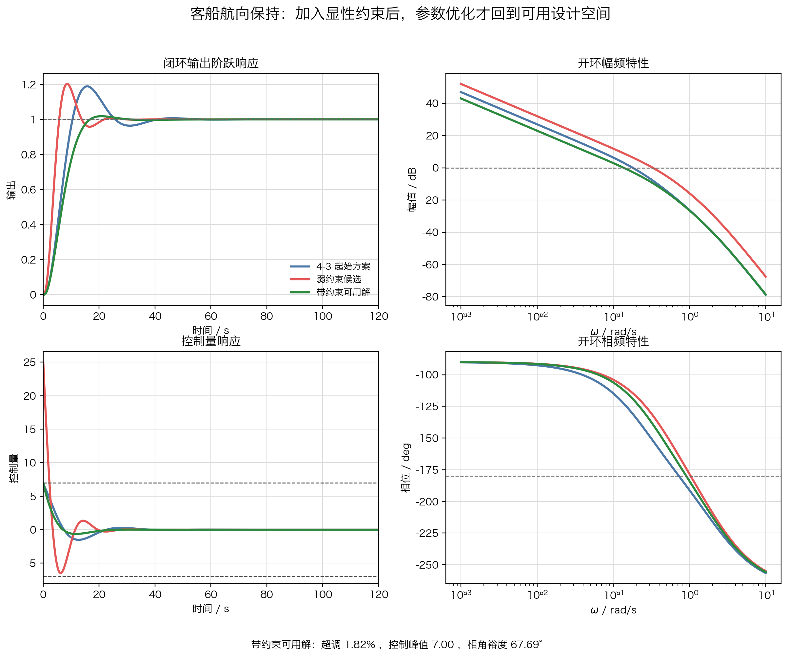

# 单元 4-5 | 约束下的优化设计实践：参数约束翻译与带约束参数优化

- 课程：自动控制原理
- 层次：模块 4 实践主线 · 第五课
- 学时：90分钟
- 知识类型：[D] 设计型
- 前置：已能够写出固定结构参数向量、归一化基准与无约束加权目标，并已得到一版看似合理的候选解
- 讲义定位：这份讲义从 `4-4` 的无约束候选解出发，先揭露它为何越过工程边界，再把这些边界写成硬约束和罚函数，完成一轮带约束参数优化
- 后续：这里得到的带约束可用解将进入 `4-6` 的场景迁移与边界比较

## 一、问题引入：为什么“自由目标更优”不等于“工程上可用”

上一课已经把客船航向保持写成固定结构下的无约束加权优化问题。对象仍取为

$$
P_h(s)=\frac{0.01715}{s(s+0.1)(s+2.14375)}.
$$

控制器结构保持为超前形式

$$
C_h(s)=K\frac{Ts+1}{\alpha Ts+1},
\qquad 0<\alpha<1.
$$

在“先压速度和拖尾”的偏好下，上一课给出了一版无约束候选：

$$
C_u(s)=5\frac{10s+1}{2s+1}.
$$

从自由目标看，这版候选很有吸引力：调节时间更短，`ITAE` 更小，`ITSE` 也同步下降。问题恰恰在这里。若课堂只停在上一页，我们很容易把“自由目标更优”误判成“方案已经可用”。

因此，本课真正要补上的动作是：

- 先拿 `4-4` 的无约束候选做工程复核；
- 再把那些不能继续含糊处理的边界升格为硬约束；
- 最后让求解器在这些边界内重新搜索一版可交付的参数解。

## 二、本次课程目标

完成这一轮实践后，我们应能完成以下工作：

1. 能指出无约束候选为什么会在真实工程边界下失真。
2. 能把超调、控制峰值和相角裕度写成硬约束，而不是继续停留在口头提醒。
3. 能解释参数范围与输出侧硬约束在模型中分别承担什么职责。
4. 能写出罚函数表达，并说明为什么它能把搜索拉回可用区域。
5. 能比较起始方案、无约束候选和带约束可用解的差异，说明约束到底改变了什么。

## 三、先做复核：`4-4` 的无约束候选到底出了什么问题

### 3.1 从自由目标看，它确实很有诱惑力

先回收上一课已经得到的自由目标项对比：

表 1. 起始方案与无约束候选的自由目标项对比

| 指标 | `4-3` 起始方案 | `4-4` 无约束候选 | 上一课得到的结论 |
| --- | ---: | ---: | --- |
| 调节时间 / s | 36.0 | 19.6 | 更快 |
| `ITAE` | 63.6924 | 20.1632 | 拖尾更短 |
| `ITSE` | 16.5282 | 5.3330 | 前中段误差强度也下降 |
| 控制能量 | 125.7148 | 774.9575 | 为收益支付了很大动作代价 |

如果课程只比较这四项，很容易把 `C_u(s)` 看成一版“足够好”的结果。也正因为如此，下一步的工程复核才不能省略。

### 3.2 一旦回到工程边界，问题立刻暴露

把无约束候选重新放回完整证据中，得到下面这组读数：

表 2. 起始方案与无约束候选的工程复核

| 指标 | `4-3` 起始方案 | `4-4` 无约束候选 | 复核结论 |
| --- | ---: | ---: | --- |
| 超调 / % | 18.8636 | 20.2410 | 已越过舒适性边界 |
| 调节时间 / s | 36.0 | 19.6 | 收敛明显更快 |
| `ITAE` | 63.6924 | 20.1632 | 拖尾明显缩短 |
| `ITSE` | 16.5282 | 5.3330 | 前中段误差强度下降 |
| 控制能量 | 125.7148 | 774.9575 | 动作代价急剧上升 |
| 控制峰值 | 6.8867 | 25.0000 | 远超执行机构边界 |
| 相角裕度 / deg | 49.0462 | 47.8274 | 裕度仍在，但没有换来更稳妥的整体结果 |

这张表说明了一个关键事实：`C_u(s)` 不是“完全无效”，它的改进方向本身是对的；但它把自由目标带来的收益建立在越界代价之上，因此不能直接进入工程实现。

### 3.3 图上最先看见的是什么

如果把起始方案和无约束候选画到同一张图上，问题会更直观。

{width=100%}

这张图至少暴露了三件事：

1. 无约束候选确实把闭环输出更快压向目标，说明上一课的加权目标并没有走错方向。
2. 控制量曲线远远冲过原本可接受的动作区间，说明求解器把执行机构当成了可以无限透支的资源。
3. 即使部分频域读数没有立刻崩坏，这种大动作也已经足以使“更优”失去工程意义。

因此，本课的入口不是“再换一组权重试试”，而是“先把哪些边界绝对不能继续含糊处理说清楚”。

## 四、硬约束第一次被显性提出

### 4.1 哪三条边界必须升格为硬约束

对客船航向保持而言，当前至少要把下面三条边界显性写出来：

$$
M_p \le 20\%, \qquad
\max |u(t)| \le 7, \qquad
\phi_m \ge 45^\circ.
$$

这三条边界分别对应三种不同的工程责任：

- 超调边界对应舒适性与修航平稳程度；
- 控制峰值边界对应执行机构的物理能力；
- 相角裕度边界对应闭环对模型偏差和外部扰动的承受能力。

表 3. 三条硬约束各自挡住什么风险

| 边界 | 挡住的风险 | 若不显性写出会怎样 |
| --- | --- | --- |
| $M_p \le 20\%$ | 把越摆当作可无限接受的提速代价 | 输出过程越来越激进 |
| $\max |u(t)| \le 7$ | 把执行机构边界当成可透支资源 | 候选解看似更快，实则不可实现 |
| $\phi_m \ge 45^\circ$ | 只看时域变快，不看稳健性储备 | 结果对模型偏差更脆弱 |

硬约束的作用不是告诉我们“什么更优”，而是先把那些绝不能接受的解挡在外面。

### 4.2 参数范围和硬约束不是同一种东西

上一课已经写过参数范围：

$$
1 \le K \le 6,\qquad
4 \le T \le 15,\qquad
0.15 \le \alpha \le 0.85.
$$

它们的职责是保证搜索还停留在当前超前结构的可解释区间内。

本课新增的三条硬约束，职责则完全不同：它们直接裁决输出过程和工程边界能不能接受。也就是说：

- 参数范围负责“结果还属不属于当前结构”；
- 硬约束负责“这个结果能不能交付”。

如果只保留前者而没有后者，求解器仍然会在一个“结构上说得通、工程上却可能失真”的区域里搜索。

### 4.3 先有边界，后有求解器

到这里，当前案例的角色分工已经明确：

表 4. 本课中的模型分工

| 设计对象 | 在模型中的角色 | 写入方式 |
| --- | --- | --- |
| $K,T,\alpha$ 的结构解释 | 参数范围 | 维持固定结构可解释区间 |
| 超调、控制峰值、相角裕度 | 硬约束 | 越界时进入罚函数或直接判为不可行 |
| 调节时间、`ITAE`、控制能量 | 软目标 | 在守住边界后继续争取 |
| `ITSE`、截止频率、幅值裕度 | 复核证据 | 求解后解释为什么可信 |

这一步的顺序不能反过来。不是先拿到求解器，再临时往里塞几个约束名词；而是先把哪些边界不能破写清楚，再决定求解器怎样执行。

## 五、把边界写进模型：罚函数为什么成为必要工具

### 5.1 先保留上一课的自由目标

上一课的自由目标保持不变：

$$
J_{\mathrm{free}}(\theta)=
w_1\frac{t_s(\theta)}{40}
+
w_2\frac{\mathrm{ITAE}(\theta)}{\mathrm{ITAE}_0}
+
w_3\frac{\mathrm{ITSE}(\theta)}{\mathrm{ITSE}_0}
+
w_4\frac{E_u(\theta)}{E_{u,0}}.
$$

这是因为上一课写下的偏好并没有失效。真正新增的，不是另一套偏好，而是“偏好必须在边界内争取”这一层规则。

### 5.2 罚函数把越界代价显性写进目标

对当前案例，可以写成

$$
J_{\mathrm{con}}(\theta)=J_{\mathrm{free}}(\theta)+P(\theta),
$$

其中

$$
P(\theta)=
50\max(0,M_p-20)^2
+
20\max(0,u_{\max}-7)^2
+
5\max(0,45-\phi_m)^2.
$$

这条式子的含义很直接：

- 只要结果不越界，罚函数为零，搜索仍按原有偏好推进；
- 一旦某条边界被突破，总代价会迅速放大；
- 越界越严重，求解器就越倾向于把搜索拉回边界内。

这就是本课为什么引入罚函数。它不是算法炫技，而是把“边界不能只当注释”这件事真正写进模型本体。

### 5.3 `fmincon` 在这里是什么角色

本课可以用两种方式实现同一件事：

- 直接使用罚函数，让无约束求解器通过总代价变化自行远离越界区；
- 使用 `fmincon` 一类带约束求解器，把边界显式交给求解器管理。

两种方式都可以，但课堂重点不在工具选型本身，而在“边界已经被显性写入模型”。只要这一步没有完成，换再高级的求解器也只是更快地搜索失真解。

## 六、带约束求解：怎样把搜索拉回可用区域

### 6.1 当前求解输入

到本课为止，真正决定求解行为的最小输入如下：

表 5. 带约束参数优化的最小输入

| 项目 | 当前写法 |
| --- | --- |
| 对象 | $P_h(s)=\dfrac{0.01715}{s(s+0.1)(s+2.14375)}$ |
| 结构 | $C_h(s)=K\dfrac{Ts+1}{\alpha Ts+1}$ |
| 起点 | $\theta_0=[2.796,\ 10,\ 0.406]^{\mathsf T}$ |
| 参数范围 | $1\le K\le 6,\ 4\le T\le 15,\ 0.15\le \alpha\le 0.85$ |
| 自由目标 | 速度、拖尾、误差强度、控制能量 |
| 硬约束 | $M_p\le20\%$，$\max |u(t)|\le 7$，$\phi_m\ge45^\circ$ |
| 复核项 | `ITSE`、截止频率、幅值裕度 |

求解器此时承担的工作只有一件事：在已写清的边界内重新搜索更优参数。

### 6.2 一版带约束可用解

在相同参数范围内重新求解，得到一版带约束可用解：

$$
C_h^\star(s)=1.7679\frac{10.4676s+1}{2.6452s+1}.
$$

它没有沿着上一课那种激进方向继续冲，而是在守住边界的同时保留了部分收益。

{width=100%}

图中的三条曲线分别对应：

- `4-3` 的起始方案；
- `4-4` 的无约束候选；
- `4-5` 的带约束可用解。

现在我们终于能清楚地区分三种状态：起始方案可运行但尚未优化；无约束候选方向对却越界；带约束解才真正回到了可交付区间。

### 6.3 三方案比较真正说明了什么

表 6. 三方案关键指标对比

| 指标 | `4-3` 起始方案 | `4-4` 无约束候选 | `4-5` 带约束可用解 |
| --- | ---: | ---: | ---: |
| 超调 / % | 18.8636 | 20.2410 | 1.8194 |
| 调节时间 / s | 36.0 | 19.6 | 15.4 |
| `ITAE` | 63.6924 | 20.1632 | 37.7835 |
| `ITSE` | 16.5282 | 5.3330 | 16.4860 |
| 控制能量 | 125.7148 | 774.9575 | 79.7669 |
| 控制峰值 | 6.8867 | 25.0000 | 6.9960 |
| 相角裕度 / deg | 49.0462 | 47.8274 | 67.6942 |

这张表最有价值的地方不在于哪一列最小，而在于它清楚说明了约束改变了搜索方向：

1. 无约束候选把时间和误差指标压得很低，却以极高的动作代价和明显越界换来这件事。
2. 带约束可用解不再追求那种极端激进的收益，而是在守住边界后，把速度、拖尾和动作代价一起压到更均衡的位置。
3. `ITSE` 从起始方案到带约束可用解几乎不变，这说明当前结果并没有靠放大前中段误差强度去换表面上的漂亮尾巴。

因此，硬约束不是把优化“做保守了”，而是把优化重新拉回可用设计空间。

还要把这件事放回 `4-4` 已经讲过的 `Pareto` 语境里理解。上一课说明过：当两个或多个目标彼此矛盾时，工程上往往不会只有一个脱离偏好的绝对最优点，而是会保留一组同样值得讨论的非支配候选。到了这一课，变化并不是 `Pareto` 观念失效了，而是可比较的集合先被硬约束重新筛了一遍。

也就是说：

- `4-4` 的无约束候选虽然在某些自由目标上很好看，但一旦越过超调、控制峰值和相角裕度边界，就不再属于可保留的工程候选；
- `4-3` 的起始方案与 `4-5` 的带约束可用解，才构成“守住边界之后仍可继续比较”的集合；
- 如果在同样边界下继续求得多组可行解，那么它们之间仍然应按 `Pareto` 的意义比较，而不是机械地把某一个标量最小值当成唯一答案。

所以，本课不是用约束把权衡消掉，而是把“越界的假优”剔除以后，在可用区域内重新谈权衡。

### 6.4 参数变化为什么仍然合乎结构机理

带约束可用解相对起始方案的参数变化如下：

- $K$ 从 `2.796` 降到 `1.7679`，整体作用强度被明显收回；
- $T$ 从 `10` 调到 `10.4676`，零点仍停留在原来的有效工作频段附近；
- $\alpha$ 从 `0.406` 降到 `0.2527`，超前作用增强，用来提高阻尼和稳健性储备。

这三条变化说明：硬约束并没有把结果推离当前固定结构，反而逼着参数修正回到更合乎结构职责的方向。它不再靠粗暴增大整体作用强度去换速度，而是在动作、动态品质与稳健性之间重新分配余量。

## 七、当前结果为什么可接受，但还不是终局

一版可接受的参数解，至少要满足三条标准：

1. 参数仍能回到当前结构机理上解释；
2. 超调、控制峰值和相角裕度三条边界全部守住；
3. 改进收益能够在统一证据下被读出来，而不是只靠单个指标看起来更优。

当前带约束可用解满足这三条标准，因此它已经是一版真正可进入后续比较的方案。但它仍然不是终局，原因也很清楚：控制峰值从 `6.8867` 上升到 `6.9960`，虽然仍在边界内，却已经非常贴近 `7` 的上限。这说明当前结构在这个场景下仍然成立，但余量并不宽松。

从 `Pareto` 的角度看，这个结果也不应被说成脱离偏好的唯一绝对最优。更准确的表述是：在当前结构、当前参数范围和当前硬约束下，它是一组值得优先保留的可行设计；如果后续在同一边界下再找到别的可行候选，就仍然要比较它们分别把收益放在了速度、拖尾、动作代价和稳健性中的哪一侧。

这也正是本课与上一课最清楚的分工：

- `4-4` 解决的是“如果只按偏好搜索，会得到什么候选”；
- `4-5` 解决的是“为什么这类候选必须接受边界复核，并通过约束优化被重新拉回可用区域”。

下一课进入场景迁移时，问题就不再是“参数算没算出来”，而是“这组在当前场景守住边界的参数，到了新场景还能不能继续守住边界”。

## 八、小结

这一课完成了五件关键工作：

1. 拿 `4-4` 的无约束候选做了完整工程复核；
2. 把超调、控制峰值和相角裕度升格为硬约束；
3. 明确区分了参数范围和输出侧硬约束的不同职责；
4. 用罚函数把边界真正写进了模型本体；
5. 得到了一版能进入后续迁移比较的带约束可用解。

对本课而言，最重要的不是记住罚函数前的系数，而是记住这条链：

$$
\text{无约束候选}
\rightarrow
\text{越界复核}
\rightarrow
\text{硬约束显化}
\rightarrow
\text{罚函数/带约束求解}
\rightarrow
\text{可用解}.
$$

只有这条链走完，“更优”才真正具有工程意义。
