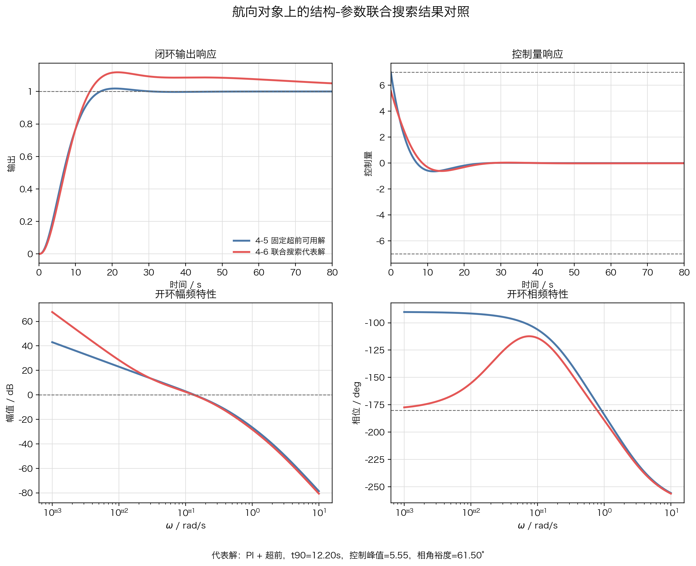
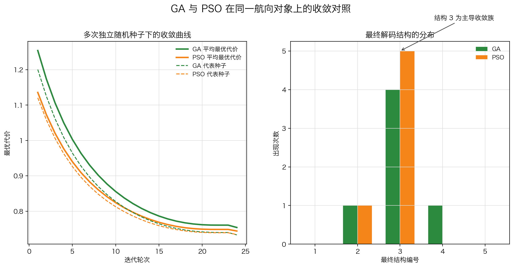
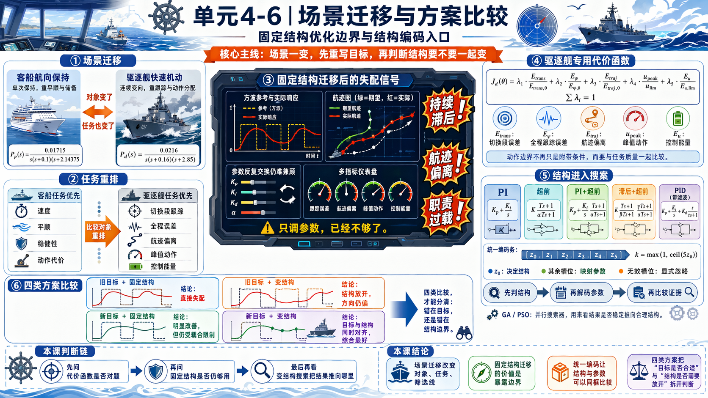

# 单元 4-6 | 场景迁移与方案比较：固定结构优化边界与结构编码入口

- 课程：自动控制原理
- 层次：模块 4 理论主线 · 第六课
- 学时：90分钟
- 知识类型：[D] 设计型
- 前置：已完成固定结构下的无约束加权优化与带约束参数优化，能够用时域、频域和控制量证据解释一版参数解为何可用
- 讲义定位：这份讲义处理“同类对象、不同任务排序”下的迁移比较，回答固定结构优化何时还能沿用、何时必须把结构本身纳入搜索变量
- 后续：这里给出的结构编码与解码入口，将直接进入 `4-7` 的完整工程设计闭环

## 一、问题引入：为什么场景一变，原来那版“可用解”还要重新审视

`4-5` 已经在客船航向保持场景中得到一版可解释、可交付的固定结构参数解。它之所以成立，并不是因为那组参数天然更好，而是因为它同时满足了客船场景的三类要求：过程不能太猛，控制动作不能越界，稳健性储备不能太薄。

现在把同一对象族换到另一种任务里。我们不再讨论常规航向保持，而是考虑驱逐舰快速机动航向控制。对象仍然是船舶航向回路，基本闭环任务仍然是“让航向按要求变化”，但任务排序已经明显改了：

表 1. 两个场景的任务排序对比

| 场景 | 主对象 | 首要目标 | 次要目标 | 最敏感边界 |
| --- | --- | --- | --- | --- |
| 场景 A：客船航向保持 | 同类船舶航向回路 | 平顺保持、较小超调、较低动作代价 | 收敛速度继续改善 | 舒适性、执行机构峰值、稳健性储备 |
| 场景 B：驱逐舰快速机动航向控制 | 同类船舶航向回路 | 快速转向、机动响应、关键时段跟踪能力 | 动作代价与稳健性仍要受控 | 带宽要求、峰值动作、快速机动中的余量分配 |

这张表要说明的不是“客船慢、驱逐舰快”这样一句口号，而是：同一类对象进入不同任务环境后，原来那条评价语言已经不再完整。场景 A 里的可用解仍然很有价值，因为它告诉我们哪些结构解释已经成立；但它不能自动保证在场景 B 里仍然成立，因为场景 B 的主要收益和主要代价已经换位。

因此，本课的任务不是再做一轮局部参数修正，而是先判断：原来的解释链还剩下多少有效，固定结构还能不能继续承载新的任务排序，若不能，又该怎样把“结构”也纳入优化变量。

## 二、本次课程目标

完成本课后，我们应能做到：

1. 能说明场景 A 与场景 B 在对象族相同的前提下，为什么会出现任务重排。
2. 能指出 `4-5` 的固定结构可用解在哪些解释上仍然成立，哪些解释已经不足以支撑新场景。
3. 能用“收益换来了什么、代价落在什么位置”这条判断链，识别固定结构优化的失效证据。
4. 能把“只调参数”与“连结构一起搜索”区分开来，知道二者分别在回答什么问题。
5. 能写出最小结构编码的含义，并能把编码结果解码回具体控制结构与工程解释。
6. 能说明 `ga / pso` 在本课里的角色只是结构搜索入口，而不是黑箱自动调参大全。

## 三、场景 A 回收：`4-5` 的固定结构可用解到底解决了什么

`4-5` 给出的客船航向保持可用解可以写成

$$
C_A(s)=1.7679\frac{10.4676s+1}{2.6452s+1}.
$$

它属于单回路超前结构，解决的是“在当前结构不变时，怎样把速度、拖尾、动作代价和稳健性重新压到可接受区间”这一类问题。对场景 A 而言，这版解成立，是因为下面三件事同时成立：

1. 主任务仍是航向平顺保持，而不是高强度机动。
2. 同一条超前结构既能继续压收敛时间，又不必把控制峰值推到执行机构边界之外。
3. 相角裕度、超调和控制峰值这三条边界之间，还存在一块固定结构可行域。

表 2. 场景 A 中这版可用解为何成立

| 证据 | 场景 A 的判断 |
| --- | --- |
| 调节时间从 `36.0 s` 压到 `15.4 s` | 速度收益明显，且仍在客船任务可接受范围内 |
| 控制峰值约 `6.996`，仍未越过 `7` 的边界 | 动作代价已逼近边界，但尚未失控 |
| 相角裕度约 `67.7^\circ` | 稳健性储备反而比起始方案更宽 |
| 超调约 `1.82%` | 对舒适性友好，符合场景 A 的主排序 |

因此，场景 A 给我们的最重要收获不是这组参数本身，而是这条解释链：

$$
\text{固定结构}
\rightarrow
\text{参数优化}
\rightarrow
\text{边界内可用解}
\rightarrow
\text{解释仍能回到超前结构职责}.
$$

这条链在场景 B 中并不会立刻失效。真正需要检查的是：它还能覆盖多少新的任务要求。

## 四、场景 B 的任务为什么不是“把原参数再调一轮”

### 4.1 首先改变的是任务排序，而不是对象类别

驱逐舰快速机动航向控制与客船航向保持的差别，并不在于“一个是船，一个不是船”。它们仍共享航向对象、舵机动作和闭环反馈这些基本元素。真正变化的是：

- 速度收益从“尽量更快”上升为“必须在更短时段内完成关键转向”；
- 过程形状不再只用舒适性语汇来描述，而要同时考虑关键时段跟踪能力；
- 控制峰值和频段分配变得更敏感，因为高机动要求往往意味着更靠前的带宽与更强的动作需求。

因此，场景 B 不只是把场景 A 的权重改一改。它要求我们重新问三个问题：

1. 原来那条超前结构是否还能同时承担“快”和“稳”的新组合；
2. 原来在低频段、中频段和高频段上的作用分配，是否仍然合理；
3. 原来那套目标函数里哪些量仍然能代表收益，哪些量已经不够。

### 4.2 资源中的两个对照证据

横摇减摇鳍控制案例给了我们第一条证据。它不再把“给定跟踪”当成主任务，而是把海浪扰动抑制当成主任务，于是评价语言直接改写为“横摇角强度、谐振峰和动作代价”。这说明任务通道一旦改变，目标函数就必须跟着改写，而不是继续沿用原来那套读数。

舰载稳定平台案例给了我们第二条证据。它直接采用“先内环、后外环”的频率分配原则，把多个闭环放进同一个系统里。这说明当约束和任务层级同时增多时，仅靠一个单环节结构未必还能把不同频段和不同职责分开承担。

这两条证据并不要求我们把 `4-6` 写成横摇课或平台课。它们只是在提醒我们：场景一变，结构职责和目标语言都可能变。

## 五、固定结构优化何时开始失效

### 5.1 仍然成立的解释

把 `C_A(s)` 带入场景 B 后，下面几条解释通常仍然成立：

- 参数不能脱离首轮证据随意初始化；
- 速度、误差、动作代价和稳健性仍然必须共同进入比较；
- 优化结果仍然必须回到时域、频域和控制量证据中解释。

换句话说，`4-4/4-5` 建立的“证据驱动优化”并没有失效。失效的是更具体的一层：**当前这一个固定结构，是否还能承载新的任务重排。**

### 5.2 失效证据不是一句“更难了”，而是三类具体信号

对场景 B 而言，只要出现下列任一类现象，我们就要开始怀疑“只调参数”是否还够：

1. 为了把关键机动时段继续压短，控制峰值和控制能量快速逼近边界，而速度收益却开始变小。
2. 为了守住峰值动作和稳健性储备，调节时间或关键机动段误差又显著回退，说明单一结构已经没有足够自由度去重新分配收益。
3. 低频任务、中频动态和高频余量开始争抢同一组参数，说明“改哪里、换来什么、牺牲什么”已经无法由单一结构清楚表达。

表 3. 固定结构失效证据表

| 现象 | 它说明什么 | 仅重排参数为什么不够 |
| --- | --- | --- |
| 继续提速时峰值动作急剧上扬 | 速度收益建立在单一动作通道被过度透支之上 | 参数只能在同一结构职责内折中，不能新增职责分工 |
| 为守住稳健性而不得不明显放慢过程 | 现有结构只能把余量从速度端“借”回来 | 结构本身缺少独立承担不同频段任务的通道 |
| 某些指标一改善，另一些指标几乎必然恶化 | 结构自由度不足，收益与代价被绑在同一组参数上 | 需要增加结构选择，改变可行域形状 |

### 5.3 用一个最小数学表达看“目标改写”和“结构失效”

场景 A 中，我们写过

$$
J_A(\theta)=
0.30\frac{t_s(\theta)}{40}
+0.30\frac{\mathrm{ITAE}(\theta)}{\mathrm{ITAE}_0}
+0.20\frac{\mathrm{ITSE}(\theta)}{\mathrm{ITSE}_0}
+0.20\frac{E_u(\theta)}{E_{u,0}}.
$$

场景 B 中，若主任务变成快速机动航向控制，目标函数至少要改写成

$$
J_B(\theta)=
\lambda_1\frac{t_{90}(\theta)}{t_{90,0}}
+\lambda_2\frac{E_{\psi}(\theta)}{E_{\psi,0}}
+\lambda_3\frac{u_{\max}(\theta)}{u_{\max,0}}
+\lambda_4\frac{M_r(\theta)}{M_{r,0}},
\qquad
\sum_{i=1}^{4}\lambda_i=1.
$$

这里的关键不是权重符号从 $w_i$ 变成 $\lambda_i$，而是量本身换了：场景 B 里，我们更关心关键转向完成时间 $t_{90}$、关键时段航向误差 $E_{\psi}$、峰值动作 $u_{\max}$ 和频域峰值 $M_r$。如果继续沿用 $J_A$，求解器就会沿着旧任务语言搜索，即使数值上得到“更优”，也未必回答了新问题。

这正是固定结构优化开始露出边界的时刻。

## 六、结构编码与混合编码求解

### 6.1 固定结构优化何时不够

到了 `4-5`，我们已经知道怎样在超前结构内部写参数向量、设硬约束并找到一版可用解。但这套动作默认了一件事：**结构本身已经定了。**

对场景 B 来说，真正先冒出来的问题是下面三件事：

1. 速度收益继续增加时，峰值动作和频域峰值是否开始更快逼近边界；
2. 为了守住动作和稳健性，是否不得不把关键机动时段明显放慢；
3. 同一组参数是否已经同时承担太多职责，以至于“调哪里、换来什么、牺牲什么”越来越说不清楚。

只要这三类信号持续出现，我们就不该再把问题写成“把原超前结构再调一轮”。固定结构优化没有失去价值，它只是开始回答不了“哪一种结构更适合当前任务排序”。

### 6.2 结构编码到底回答什么

参数优化回答的是“同一结构里怎样最好”，结构编码回答的是“到底该让谁来承担这部分职责”。为了把离散结构选择和连续参数搜索放进同一个搜索空间，本课把编码固定成一个归一化向量

$$
[z_0, z_1, ..., z_5] \in [0,1]^6.
$$

其中，第一位只负责决定结构编号：

$$
k=\max(1, \operatorname{ceil}(5 z_0)).
$$

后五位再按结构编号解释为参数。这样做的好处是，搜索器始终只处理六个归一化变量；真正进入工程解释时，再把它们解码成具体结构和参数。

表 4. 五结构编号表

| 结构编号 | 结构名称 | 结构职责 | 有效参数槽位 |
| --- | --- | --- | --- |
| 1 | `PI` | 补低频增益与稳态误差消除 | `z_1,z_2` |
| 2 | `超前` | 提升速度与相位裕度 | `z_1,z_2,z_3` |
| 3 | `PI + 超前` | 同时重分配低频跟踪与中频动态 | `z_1,z_2,z_3,z_4` |
| 4 | `滞后 + 超前` | 在保留速度改进时额外照顾低频整形与动作边界 | `z_1,z_2,z_3,z_4,z_5` |
| 5 | 带微分滤波的 `PID` | 用积分、比例和滤波微分共同塑造过程 | `z_1,z_2,z_3,z_4` |

同一个六维向量进入不同结构时，并不是所有槽位都必须生效。无效位忽略，正是这套混合编码的必要约束；否则搜索器给出的结果就无法稳定解码。

把它写成工程动作后，解码至少要完成四步：

1. 先用 `z_0` 判定结构编号；
2. 再按该结构的参数模板解释 `z_1` 到 `z_5`；
3. 忽略当前结构用不到的槽位；
4. 把结果还原成可读的控制器形式与职责说明。

下面给两组最小解码示例。

- 示例 A：`z=[0.50, 0.28, 0.93, 0.78, 0.16, 0.62]`
  `0.5 -> ceil(0.5×5)=3`，因此结构编号是 3，对应 `PI + 超前`。
  解码后可写成
  $$
  C_A(s)=1.35\frac{44.94s+1}{44.94s}\cdot\frac{14.94s+1}{3.65s+1}.
  $$
  这里 `z_1,z_2,z_3,z_4` 分别承担增益、积分时间常数、超前零点时间常数和超前极点比例；`z_5` 被忽略。

- 示例 B：`z=[0.33, 0.44, 0.82, 0.18, 0.91, 0.73]`
  结构编号为 2，对应 `超前`。
  解码后可写成
  $$
  C_B(s)=1.76\frac{15.86s+1}{4.60s+1}.
  $$
  此时只有 `z_1,z_2,z_3` 有效，`z_4,z_5` 不再参与求值。

这两组示例要说明的不是哪一个已经最优，而是：**结构一旦进入搜索变量，编码必须能稳定还原成结构名称、参数槽位和工程解释。**

### 6.3 如何求解混合编码问题

到了这一步，原来那类局部优化就不再足够了。`fminsearch / fminunc / fmincon` 主要处理连续变量；而当前问题同时包含结构编号这样的离散选择与参数这样的连续变量，因此更自然的写法是把它当成混合编码搜索。

本课正文只正式引入一种名称：遗传算法（Genetic Algorithm, GA）。它最小可理解成下面这件事：

- 搜索对象始终是同一个归一化编码向量 `[z_0, z_1, ..., z_5]`，其中 `z_0` 仍按 `max(1, ceil(5 z_0))` 决定结构编号；
- 候选结构始终限定在前文已经出现的五类：`PI`、`超前`、`PI + 超前`、`滞后 + 超前`、带微分滤波的 `PID`；
- 搜索器维护一批候选编码向量；
- 每一轮先把编码解码成具体结构与参数；
- 再按统一目标函数比较优劣，保留更好的候选并继续生成下一轮。

如果只看这一层，`ga` 的价值并不在于“自动替你设计控制器”，而在于它愿意在同一个搜索过程中同时处理结构切换和参数细调。`pso` 在本课里也会参与完整算例，但它在正文只承担对照搜索器的角色；我们真正要看的，是两种搜索是否会把结果稳定地推向同一类结构。

因此，本课对混合编码求解的判断边界可以压成一句话：

$$
\text{结构不确定}
\rightarrow
\text{混合编码}
\rightarrow
\text{结构与参数一起搜索}
\rightarrow
\text{解码回工程语言}.
$$

## 七、完整算例：航向对象上的结构-参数联合搜索

### 7.1 五结构编号表怎样进入同一主对象

完整算例继续沿用 `4-5` 的船舶航向控制对象

$$
P_h(s)=\frac{0.01715}{s(s+0.1)(s+2.14375)},
$$

但任务语言不再只问“固定超前结构里怎样找最好参数”，而是直接比较五类候选结构在同一目标函数下的搜索结果。这里的五结构编号表就是上一节给出的码本，搜索器每次只处理六维向量，再经解码回到五类控制器之一。

为了避免把一次偶然收敛误判成“结构已经定了”，本算例同时运行 GA 与 PSO，并各自采用多次独立随机种子。我们先看不同随机起点下两类算法是否会稳定地落到同一类结构，再决定正文揭晓哪一组参数与曲线。

表 5. GA 与 PSO 的多次独立随机种子搜索结果摘要

| 算法 | 随机种子 | 最终结构编号 | 解码结构 | 归一化代价 |
| --- | ---: | ---: | --- | ---: |
| GA | 11 | 3 | `PI + 超前` | 0.756 |
| GA | 19 | 3 | `PI + 超前` | 0.744 |
| GA | 23 | 4 | `滞后 + 超前` | 0.782 |
| GA | 31 | 3 | `PI + 超前` | 0.739 |
| GA | 43 | 3 | `PI + 超前` | 0.733 |
| GA | 59 | 2 | `超前` | 0.770 |
| PSO | 7 | 3 | `PI + 超前` | 0.748 |
| PSO | 13 | 3 | `PI + 超前` | 0.741 |
| PSO | 17 | 3 | `PI + 超前` | 0.737 |
| PSO | 29 | 2 | `超前` | 0.769 |
| PSO | 37 | 3 | `PI + 超前` | 0.735 |
| PSO | 41 | 3 | `PI + 超前` | 0.734 |

这张表说明：两种搜索器都不是每次都回到同一个编码，但它们的大多数独立运行都把最优解压到结构编号 3。也就是说，场景 B 的联合搜索结果并没有在五类结构之间无规则漂移，而是稳定指向 `PI + 超前` 这一结构家族。

### 7.2 最终揭晓的结构与参数

在所有代表性可行解里，正文选取一组结构编号 3 的代表解作为展示对象：

$$
z^\star=[0.50,\ 0.28,\ 0.93,\ 0.78,\ 0.16,\ 0.62],
$$

对应解码结果

$$
C^\star(s)=1.35\frac{44.94s+1}{44.94s}\cdot\frac{14.94s+1}{3.65s+1}.
$$

这里新增的 `PI` 部分主要照顾低频跟踪与转向偏差回收，超前部分继续负责中频动态和相位补偿。相比 `4-5` 中固定超前结构的可用解，这个结果不是简单把同一组三参数再推向边界，而是在结构层面明确把两段职责拆开。

如果只看结构名称，这个结论并不重要；重要的是它给出了可以继续解释的工程语言：

- 低频端由积分通道负责把持续转向误差压回去；
- 中频端仍由超前环节承担主要动态整形；
- 参数变化不再全部挤在同一组超前参数上，因此搜索对随机初值更稳定。

### 7.3 时域响应、频域响应与收敛曲线

下图把 `4-5` 的固定超前可用解与本次联合搜索选出的代表解放到同一组对照中。上半部分看时域与控制量，下半部分看开环频域读数。

{width=100%}

从图上可以直接读出三件事：

1. 两组方案都能把航向拉向目标，但联合搜索代表解在控制量峰值上更克制，没有继续把动作资源压到 `4-5` 那条边界附近；
2. 联合搜索代表解的中频整形依然保持了足够的相位提前，因此结构变复杂以后并没有把频域读数变成不可解释的黑箱；
3. 结构变化带来的差异不是“哪条曲线更好看”这种表面比较，而是低频职责和中频职责开始分层。

再看两类搜索算法的平均最优代价下降过程。

{width=100%}

图中可以看到，GA 与 PSO 的前期下降速度不同，但中后期都收敛到接近的代价区间；更关键的是，它们最终对应的主导结构编号都以 3 为主。这说明正文展示的那组 `PI + 超前` 结果并不是一次偶然碰撞出来的样例，而是多次独立随机种子下反复出现的结构家族。

### 7.4 为什么这个收敛过程可信

“可信”并不等于“它一定是全局最优”，而是至少满足下面四个条件：

1. GA 与 PSO 是两种不同的搜索路径，却都多数回到结构编号 3；
2. 即使出现编号 2 或 4 的局部胜出，它们的归一化代价也没有与结构 3 拉开决定性差距，说明当前目标函数没有发生严重漂移；
3. 最终揭晓的编码可以完整解码回结构、参数和职责分工，而不是只剩一个抽象代价值；
4. 时域响应、控制量曲线和频域读数彼此一致，没有出现“代价下降了，但工程解释断掉了”的情况。

因此，本算例真正交出的不是一张排行榜，而是一条可以带到 `4-7` 的完整证据链：

$$
\text{五结构码本}
\rightarrow
\text{多次独立随机种子搜索}
\rightarrow
\text{稳定收敛到同类结构}
\rightarrow
\text{揭晓代表解}
\rightarrow
\text{时域/频域证据复核}.
$$

## 八、小结

本课在 `4-5` 的固定结构参数优化之后，又向前推进了一步：

1. 先用场景迁移解释为什么原来的固定结构语言可能不再够用；
2. 再把结构选择和参数搜索统一写进六维混合编码；
3. 用最小解码示例说明编码必须回到具体控制器与职责分工；
4. 用 GA 与 PSO 的多次独立随机种子搜索，验证同一主对象上的联合搜索会稳定指向哪一类结构。

对 `4-6` 而言，关键不在于记住某一种搜索器的流程，而在于学会判断：什么时候还应当留在固定结构参数优化里，什么时候必须把结构本身抬升成优化变量。

## 九、分层练习

### 练习 1：把六维编码解码成结构语言

给定编码

$$
z=[0.62,\ 0.41,\ 0.77,\ 0.24,\ 0.68,\ 0.19],
$$

请完成：

1. 用 `k=\max(1,\operatorname{ceil}(5z_0))` 求出结构编号；
2. 写出当前结构有哪些有效参数槽位；
3. 说明哪些槽位应被忽略，以及为什么忽略它们不会损失工程解释。

### 练习 2：判断何时应从固定结构转向混合编码

某一固定超前结构在新的机动任务中表现如下：`t_{90}` 还能继续缩短，但控制峰值快速逼近边界；若压低峰值动作，又会使关键机动误差显著回升。请回答：

1. 这对应表 3 中哪一类失效证据；
2. 为什么此时只在超前结构内部改参数已经不够；
3. 你会优先让哪一类结构进入码本，并给出理由。

### 练习 3：解释多次独立随机种子的意义

如果 GA 六次里有四次收敛到结构编号 3，PSO 六次里有五次收敛到结构编号 3，而少数运行落到编号 2 或 4，请说明：

1. 为什么这已经足以支持“结构编号 3 是当前主导候选”；
2. 为什么仍然不能把它写成“已经证明全局最优”；
3. 最终交付给工程解释时，还必须补看哪些时域和频域证据。

## 附录 A：遗传算法简述

遗传算法的发展背景很直接：当搜索空间同时包含离散结构、连续参数和多个局部最优时，单一路径的局部优化往往容易困在某个小区域里。遗传算法借用了“群体逐代保留较优候选”的思想，让搜索不只沿一条轨迹前进。

对本课而言，只需要抓住三个最小概念：

1. 一个个体就是一个待解码的编码向量；
2. 适应度就是把该编码解码后代入目标函数得到的优劣读数；
3. 一代更新，就是从当前候选群体里保留较优者并生成下一批候选。

把它写成最小步骤，就是：

1. 初始化一批编码向量；
2. 逐个解码并计算目标函数；
3. 保留更优个体，并生成下一代候选；
4. 重复迭代直到总代价趋于稳定；
5. 对最终个体做结构解码和证据复核。

## 附录 B：粒子群优化简述

粒子群优化把每个候选解看成一个在搜索空间里移动的粒子。它的历史比遗传算法稍晚，但同样服务于“全局搜索优先、局部细调随后发生”的问题类型。

对本课最重要的不是公式细节，而是三个关键词：

1. 每个粒子都有当前位置和粒子速度；
2. 每个粒子都会记住自己的个体最优位置；
3. 群体还会共享当前找到的全局最优位置。

于是，最小流程可以压成：

1. 初始化一批粒子的位置与粒子速度；
2. 把每个位置解码成结构和参数，并计算目标函数；
3. 更新个体最优与全局最优；
4. 用当前位置、个体最优和全局最优共同更新下一轮位置；
5. 迭代到收敛后，再对代表解做时域和频域复核。
