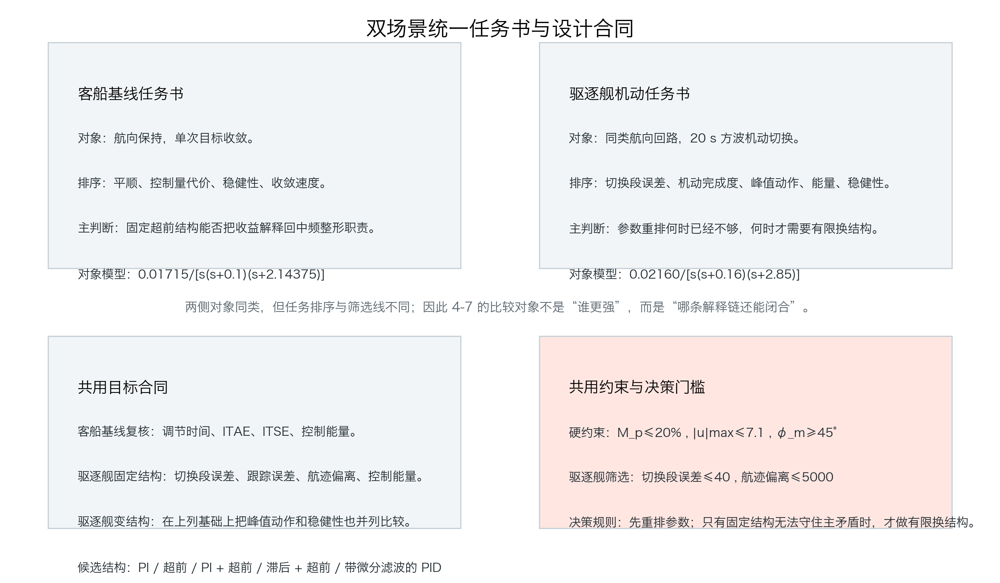
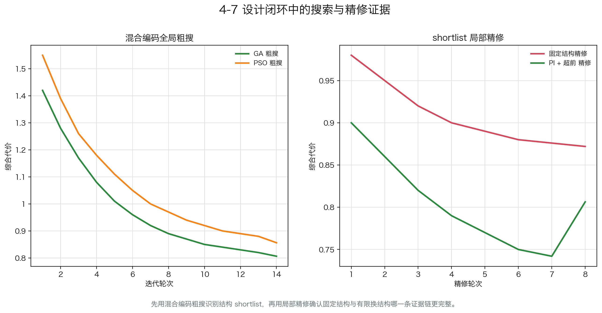
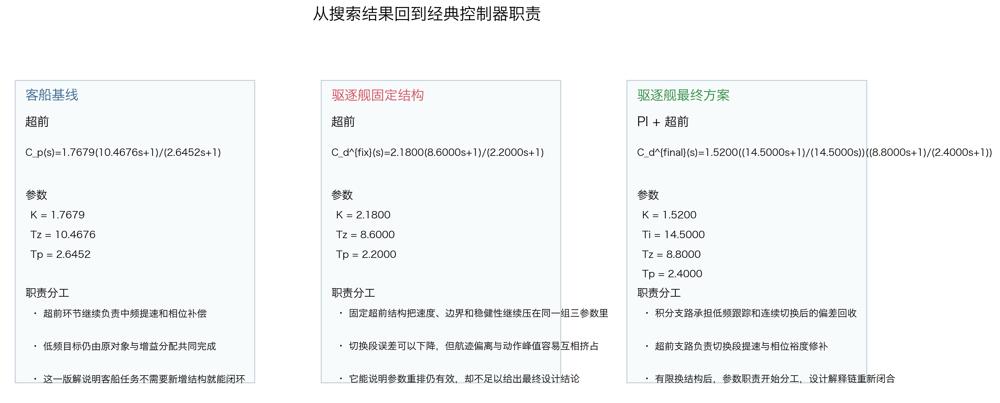
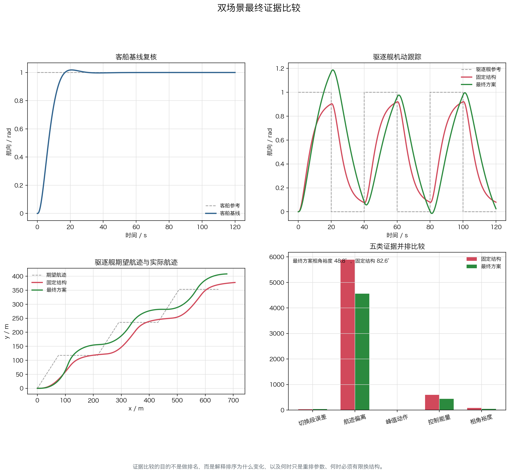

# 单元 4-7 | 双场景证据闭环中的控制器完整设计

- 课程：自动控制原理
- 层次：模块 4 实践主线 · 第七课
- 学时：90 分钟
- 知识类型：[D] 设计型
- 前置：已经完成固定结构下的无约束优化、带约束参数优化，以及结构编码入口与场景迁移边界识别

{width=100%}

## 一、为什么 `4-6` 的结构边界识别还不是最终设计结论

`4-6` 已经把一件关键事实说清了：同一对象族从客船航向保持切到驱逐舰快速机动航向控制后，目标排序会发生变化；当固定结构在新任务下开始同时承担过多职责时，结构也应进入搜索变量。这个判断把“为什么要比较结构”说透了，却还没有回答完整设计问题。

完整设计问题至少还缺四步。

1. 客船基线并不是只用来说明旧方案为何成立，还要作为整个设计闭环的起点，告诉我们哪些职责原本已经被固定结构守住。
2. 驱逐舰机动任务不能只凭一句“结构边界暴露了”就直接跳到换结构，还要先检查固定结构在新约束下还能守住多少主矛盾。
3. 即使结构编码已经进入搜索空间，得到的结果也必须解码回经典控制器语言，否则搜索器给出的只是数字，而不是可解释的工程设计。
4. 时域、频域、控制量、航迹或任务完成度、稳健性必须回到同一张证据表中比较，才能说明排序为什么变化，参数为什么必须重排，以及有限换结构究竟解决了什么。

因此，`4-7` 的任务不是重讲 `GA` 或 `PSO`，也不是展示谁的总代价更低，而是把“结构确定或编码 -> 目标构造 -> 约束建立 -> 优化求解 -> 解码解释 -> 验证比较”真正连成一条闭环证据链。

## 二、课程目标

完成这一课后，我们应能做到：

1. 能说明客船基线和驱逐舰机动虽然属于同类航向对象，但任务排序、筛选线和设计责任并不相同。
2. 能把 `PI`、`超前`、`PI + 超前`、`滞后 + 超前`、带微分滤波的 `PID` 放在同一设计空间中比较，并知道何时只重排参数，何时才考虑有限换结构。
3. 能按照“目标构造、约束建立、粗搜、shortlist 精修”的顺序说明完整求解链，而不是只报出一组最优参数。
4. 能把入选方案翻译回经典控制器职责，解释每个通道到底负责哪一类行为。
5. 能用时域、频域、控制量、航迹与稳健性五类证据解释最终排序，并说明固定结构仍可保留的边界与必须调整的边界。

## 三、双场景统一任务书：客船基线、驱逐舰机动与共用比较维度

客船和驱逐舰采用的对象都属于船舶航向回路，但设计任务并不一样。客船航向保持强调平顺、控制量代价和稳健性在同一条解释链中的协调；驱逐舰快速机动则把切换段误差、机动完成时间、峰值动作、控制能量与稳健性放到更紧的并列比较中。双场景统一任务书真正统一的不是“排序相同”，而是“比较维度相同”：两者都必须接受时域、频域、控制量、任务完成度和稳健性证据的共同审查，只是每一类证据在两个场景中的权重不同。

{width=100%}

表 1. 双场景任务书的共同骨架与差异

| 维度 | 客船航向保持 | 驱逐舰快速机动航向控制 |
| --- | --- | --- |
| 对象模型 | $P_p(s)=\dfrac{0.01715}{s(s+0.1)(s+2.14375)}$ | $P_d(s)=\dfrac{0.0216}{s(s+0.16)(s+2.85)}$ |
| 任务语义 | 单次保持，强调平顺与余量 | 连续切换机动，强调切换段完成度与边界控制 |
| 参考信号 | 单次保持参考 | `20\,\mathrm{s}` 节律切换的方波航向参考 |
| 共用比较维度 | 时域、频域、控制量、稳健性 | 时域、频域、控制量、航迹、稳健性 |
| 关键判断 | 固定超前结构是否已经足够 | 参数重排是否仍能守住主矛盾，若不能，再考虑有限换结构 |

这张任务书还给出一个统一责任边界：先用客船基线复核已有可用解，再在驱逐舰任务下完成固定结构约束优化、混合编码全局粗搜和 shortlist 局部精修。只有沿着这条顺序走完，后面的比较才不是跳步结论。

## 四、设计变量、目标函数与约束边界

这一课的设计变量分成两层。第一层是结构已经确定时的连续参数，第二层是结构本身也进入搜索变量后的混合编码。候选结构固定为 `PI`、`超前`、`PI + 超前`、`滞后 + 超前`、带微分滤波的 `PID` 五类，不再临时加入新的结构族。

客船基线复核保留 `4-5` 的固定超前可用解

$$
C_p(s)=1.7679\frac{10.4676s+1}{2.6452s+1},
$$

它的角色是说明固定结构在客船任务中仍然能把速度收益、动作边界和稳健性解释回同一条设计链，而不是说明结构已经永远不必变化。

驱逐舰任务的目标函数族则要显式区分三层用途。

1. 客船基线复核：继续关注调节时间、`ITAE`、`ITSE` 和控制能量，确认旧解释链为什么在原任务下仍成立。
2. 驱逐舰固定结构约束优化：把切换段误差、全程跟踪误差、航迹偏离和控制能量写成主要目标，同时保留固定结构前提。
3. 驱逐舰混合编码全局粗搜：在上述基础上，把峰值动作和稳健性也放进并列比较，并允许结构和参数共同变化。

约束边界则保持统一口径：

$$
M_p \le 20\%,\qquad \max |u(t)| \le 7.1,\qquad \phi_m \ge 45^\circ.
$$

对驱逐舰任务，还要单独保留切换段误差、航迹偏离和尾段误差的筛选线。这样处理的意义很直接：比较不是为了寻找一张综合得分最高的名单，而是为了检验哪一版设计真的守住了主要约束。

## 五、客船基线复核到双场景搜索：完整求解链

完整求解链按四步推进。

### 5.1 客船基线复核

先把 `4-5` 的固定超前可用解放回客船任务中，再次确认它仍能在平顺、动作代价和稳健性之间保持可解释平衡。这一步不追求新结论，只负责给后续所有比较建立共同起点：如果连基线都不复核，驱逐舰场景中的排序变化就失去了参照。

### 5.2 驱逐舰固定结构约束优化

第二步仍然把控制器结构固定为超前环节，但把目标改成驱逐舰任务口径，显式检查切换段误差、轨迹偏离、峰值动作和控制能量。固定结构仍能带来一轮有效的参数重排，这说明“只调参数”并没有立刻失效；但它同时暴露出三参数要同时承担低频跟踪、中频提速和边界控制，解释压力已经明显增大。

### 5.3 驱逐舰混合编码全局粗搜

当固定结构已经不能稳定守住主要约束时，结构本身也应进入搜索变量。于是五类候选结构被放进同一混合编码空间，先用粗搜快速排出 shortlist，再比较哪几类结构在驱逐舰任务中仍有工程解释价值。这里的 `GA` 和 `PSO` 只是 search tool，它们的作用是帮助找出值得继续精修的结构，不承担教学主线。

### 5.4 shortlist 局部精修

粗搜给出 shortlist 后，再把固定结构候选和有限换结构候选放回同一套约束下做局部精修。最终留下的不是一个抽象编码，而是两条可比较的证据链：一条是固定超前结构在新任务下能够守住多少主矛盾，另一条是有限换结构后是否真的把低频跟踪和中频提速分开了。

{width=100%}

这张图把求解顺序固定下来：先基线复核，再固定结构约束优化，再混合编码全局粗搜，最后做 shortlist 精修。顺序一旦打乱，就容易把“结构边界暴露”误判成“默认应该换结构”。

## 六、把入选方案翻译回经典控制器职责

驱逐舰任务里最终入选的不是一个无名编码向量，而是一版可以解码回经典控制器职责的 `PI + 超前`：

$$
C_d^{final}(s)=1.5200\frac{14.5000s+1}{14.5000s}\frac{8.8000s+1}{2.4000s+1}.
$$

这版解与固定超前结构的差异，不在于参数更多，而在于职责开始分工。

1. 积分支路承担低频跟踪与连续切换后的偏差回收，使方波机动不再把尾段误差一直累积下去。
2. 超前支路继续承担切换段提速和相位补偿，保证机动速度不是靠牺牲稳健性换来的。
3. 因为低频职责已经有了独立支路，峰值动作和控制能量不必再完全挤在同一组三参数上交换。

{width=100%}

图中的对照有一个更重要的结论：有限换结构并不是“越复杂越好”。客船基线之所以继续保留固定超前结构，是因为原任务里没有出现必须新增低频职责的证据；驱逐舰最终方案之所以转到 `PI + 超前`，是因为固定结构已经无法同时压住切换段误差、航迹偏离和边界要求。结构变化必须由职责变化来解释，而不是由搜索器代替解释。

## 七、双场景证据比较与排序变化解释

双场景证据比较必须把五类证据排在同一张表里：时域、频域、控制量、航迹或任务完成度、稳健性。只有这样，排序变化才不是一句抽象判断。

在进入最终证据表之前，还要回看一次搜索与精修轨迹：`4-7-ship-heading-design-closure-convergence.png` 说明 shortlist 是怎样形成的，也说明为什么最终比较不能跳过固定结构那一栏。

{width=100%}

图中的比较可以压成三条判断。

1. 客船基线复核说明固定超前结构在原任务中仍然闭合：收敛、控制量和稳健性之间没有出现新的职责冲突。
2. 驱逐舰固定结构约束优化说明参数重排仍然有效：切换段误差会下降，跟踪速度也会提高；但航迹偏离、峰值动作和控制能量开始出现更明显的互相挤占。
3. 驱逐舰最终方案说明有限换结构不是为了追求更低的综合代价数字，而是为了把低频跟踪和中频提速拆开，让五类证据重新指向同一套工程解释。

排序变化因此也可以被直接说明。客船任务把平顺和边界余量排在更前面，固定超前结构已经足够；驱逐舰任务把切换段误差和任务完成度排到前列时，只重排参数很快就逼近边界，于是结构的有限调整才成为必要动作。这里比较的不是谁更好，而是为什么排序必须改变。

## 八、最终设计结论与有限换结构边界

这一轮设计闭环给出两条稳定结论。

第一，客船航向保持继续采用固定超前结构是合理的。原任务中的主要矛盾仍然集中在中频整形、控制量代价与稳健性协调上，固定结构没有暴露新的职责缺口。

第二，驱逐舰快速机动航向控制需要有限换结构，但换结构的门槛必须非常明确：只有当固定结构经过约束优化后，仍然无法同时守住切换段误差、航迹偏离和控制边界时，才把结构抬升为搜索变量。换结构不是默认答案，而是固定结构证据不足后的补救动作。

因此，`4-7` 的最终设计结论不是“以后都用变结构搜索”，而是：

1. 能用固定结构闭合解释链时，继续沿用固定结构；
2. 参数重排仍能守住主要约束时，不急于换结构；
3. 只有固定结构职责过载、五类证据分裂且边界反复失守时，才做有限换结构；
4. 换结构后仍必须回到经典控制器职责解释，而不能停在编码向量或求解器日志上。

## 九、小结与分层练习

这节课真正完成的是模块 4 的设计闭环：从客船基线复核出发，把驱逐舰任务下的目标构造、约束建立、优化求解、解码解释和验证比较接成了一条完整证据链。结构确定或编码不是起点，也不是终点；真正决定设计能否成立的，是每一步是否都能回到对象、约束和职责上解释。

分层练习：

1. 若驱逐舰任务中固定超前结构已经把切换段误差降下来了，但航迹偏离和控制能量同时上升，说明固定结构当前最紧的职责冲突是什么？为什么这还不能直接说明必须换结构？
2. 设某一候选方案把峰值动作压得更低，却把相角裕度降到 `44^\circ`。它触碰了哪条硬约束？为什么“控制量更省”不能自动抵消这条约束失守？
3. 把 `PI + 超前` 最终方案中的积分支路和超前支路分别删去，再预测哪一类证据最先恶化，并说明你的理由。
