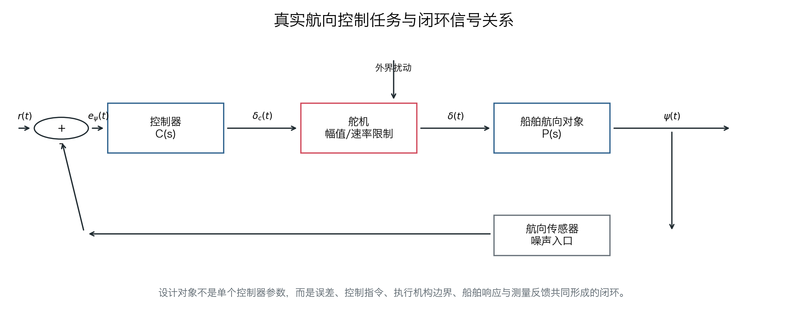
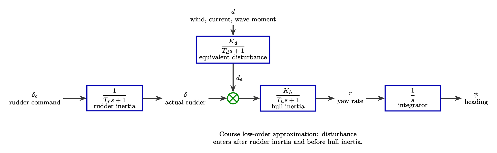
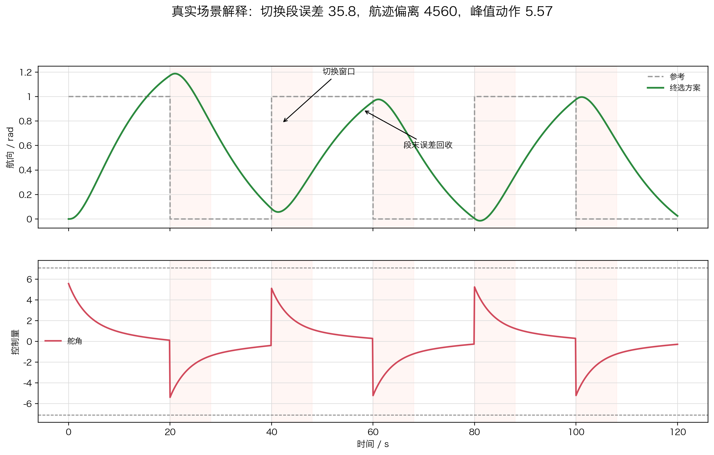
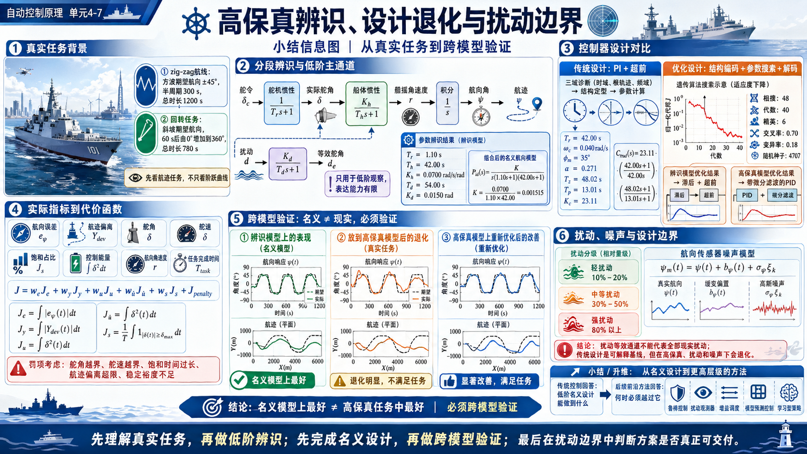

# 单元 4-7｜高保真辨识、设计退化与扰动边界

- 课程：自动控制原理
- 模块：模块 4 控制系统设计
- 课型：实践课
- 学时：90 分钟
- 知识类型：[D] 设计型 / 综合型
- 前置：4-4 固定结构下的优化建模，4-5 带约束参数优化，4-6 场景迁移与结构编码入口
- 讲义定位：用驱逐舰航向控制任务完成“高保真任务观察、低阶辨识、指标翻译、控制器设计、跨模型验证、扰动边界判断”的设计闭环

## 一、真实航迹任务与分段辨识模型结构

舰船航向控制的设计起点不是抽象的单位阶跃，而是航线任务。驾驶指令给出的是“按某种航迹行动”，控制器真正处理的是期望航向角、实际航向角、艏摇角速度、舵角和船舶位置之间的关系。若从一开始就把任务压成单一响应曲线，航迹偏离、舵机极限和扰动耦合都会被掩盖。

本课使用 055 型驱逐舰课程高保真代理模型作为真实任务背景。高保真模型采用 MMG 三自由度结构，状态包含纵向速度、横向速度、艏摇角速度、位置、航向与实际舵角。它不是实船水池试验模型，但能反映自动舵课程中必须面对的事实：舵令不会立刻变成实际舵角，实际舵角先改变艏摇角速度，艏摇角速度再积分为航向角，航向角再决定航迹。

两类典型航线先被翻译为期望航向角：

| 航线任务 | 期望航向翻译 | 控制含义 | 图中观察量 |
| --- | --- | --- | --- |
| zig-zag 航线 | 方波期望航向 | 航向命令反复切换，检验快速跟踪、残留误差和舵机负担 | 给定航向、实际航向、舵角、航迹 |
| 回转运动 | 斜坡期望航向 | 航向持续变化，检验连续转向能力和航迹曲率 | 给定航向、实际航向、艏摇角速度、航迹 |

方波期望航向不是数学游戏。它对应 zig-zag 航线中“左舷目标角—右舷目标角—再回到另一侧”的连续命令切换。斜坡期望航向不是单次阶跃。它对应回转运动中航向角随时间持续增加，船舶应形成近似圆形或螺旋式航迹。航向响应图必须画给定信号，航迹图必须画期望航迹，否则学生只能看见跟踪曲线，看不见任务偏离。

为了让经典控制器能够设计和解释，需要把高保真模型降阶为课程内可使用的传递函数模型。降阶不是把高保真模型“简化成真实模型”，而是提取一条可解释的主通道：

$$
\delta_c \rightarrow \frac{1}{T_r s+1} \rightarrow \delta
\rightarrow \frac{K_h}{T_hs+1} \rightarrow r
\rightarrow \frac{1}{s} \rightarrow \psi .
$$

其中 $\delta_c$ 为舵令，$\delta$ 为实际舵角，$r$ 为艏摇角速度，$\psi$ 为航向角。舵机惯性由 $T_r$ 描述，船体惯性由 $T_h$ 描述，舵角到艏摇角速度的增益由 $K_h$ 描述。扰动在课程内只作为低阶等效入口处理，放在舵机之后、船体惯性之前：

$$
d \rightarrow \frac{K_d}{T_d s+1} \rightarrow d_e,\qquad
\delta+d_e \rightarrow \frac{K_h}{T_hs+1}.
$$

这个扰动入口的意义有限。它只是把横向风浪、水流和波浪力矩粗略折算成“等效舵角”，方便学生观察扰动为什么会破坏名义设计。它不能代表高保真模型中的横荡、航速变化、局部流速变化和舵效变化。

组合后的名义辨识模型为三阶航向模型：

$$
P_{id}(s)=\frac{K}{s(T_rs+1)(T_hs+1)},\qquad
K=\frac{K_h}{T_rT_h}.
$$

用本课数据得到：

$$
T_r=1.10\,\mathrm{s},\qquad T_h=42.00\,\mathrm{s},\qquad K_h=0.0700\,\mathrm{rad/s/rad}.
$$

扰动等效通道的拟合值为：

$$
T_d=54.00\,\mathrm{s},\qquad K_d=0.0150\,\mathrm{rad}.
$$

这些参数的来源不是经验拍数，而是下面三段阶跃辨识。

## 二、分段辨识与参数确定

分段辨识的基本思想是先把可观察的局部关系拆开，再组合为可用于控制器设计的低阶模型。这样做比一次性拟合三阶分母更适合教学，因为每个参数都有物理位置。

### 舵机惯性辨识

舵机段使用舵令阶跃作为输入，实际舵角作为输出。模型为：

$$
G_r(s)=\frac{\delta(s)}{\delta_c(s)}=\frac{1}{T_rs+1}.
$$

阶跃输入为 $10^\circ$ 舵令。图中黑色虚线为阶跃输入，实线为高保真响应，虚线响应为一阶惯性拟合。$T_r$ 的确定方式是寻找一阶惯性阶跃曲线与实际舵角响应的最小误差；本课得到 $T_r=1.10\,\mathrm{s}$。

### 船体惯性辨识

船体段使用实际舵角作为输入，艏摇角速度作为输出。模型为：

$$
G_h(s)=\frac{r(s)}{\delta(s)}=\frac{K_h}{T_hs+1}.
$$

这里不能只看艏摇角速度一条曲线。因为航向角是艏摇角速度的积分，如果 $K_h$ 与 $T_h$ 只让 $r(t)$ 局部贴合，却让积分后的 $\psi(t)$ 长期漂移，这组参数仍然不适合航向控制。参数确定时同时约束艏摇角速度与积分后的航向角，得到 $T_h=42.00\,\mathrm{s}$、$K_h=0.0700\,\mathrm{rad/s/rad}$。

### 扰动等效惯性尝试

扰动段把横向扰动抽象为单位扰动阶跃，尝试拟合为：

$$
G_d(s)=\frac{d_e(s)}{d(s)}=\frac{K_d}{T_ds+1}.
$$

这一步的结果带有明确的失败意义。阶跃输入可以画出来，拟合曲线也可以给出，但高保真响应的方向、幅值和时间过程并不能被单一等效舵角通道稳定解释。当前拟合得到 $T_d=54.00\,\mathrm{s}$、$K_d=0.0150\,\mathrm{rad}$，只能作为低阶扰动观察入口，不应被当作可靠扰动模型。

三段辨识给出一个清晰判断：舵机惯性和船体惯性可以为传统控制器设计提供名义模型；扰动等效惯性的误差不是偶然噪声，而是单一“船体前扰动通道”表达能力不足。后续设计必须区分“在辨识模型上能设计”和“在高保真任务中仍能工作”。

## 三、实际指标到代价函数

高保真实验能直接观察的实际指标包括航向误差、航迹偏离、舵角、舵速、饱和占比、控制能量、航向角速度和任务完成时间。这些量不是并列装饰，而是把现实任务翻译成控制设计语言的入口。

| 实际指标 | 课程指标表达 | 角色 | 判断含义 |
| --- | --- | --- | --- |
| 航向误差 | $e_\psi(t)=\psi_d(t)-\psi(t)$，$J_e$ | 主目标 | 是否跟住期望航向 |
| 航迹偏离 | $Y_{dev}$ 或轨迹 RMSE，$J_y$ | 主目标 / 诊断指标 | 航向误差是否积累成真实位置偏差 |
| 舵角 | $\max|\delta(t)|$，$J_u$ | 硬约束 / 次目标 | 执行机构是否可实现，动作代价是否过高 |
| 舵速 | $\max|\dot{\delta}(t)|$，$J_{\dot u}$ | 硬约束 / 次目标 | 舵机是否需要不可实现的快速动作 |
| 饱和占比 | $\rho_s=T_s/T$，$J_s$ | 诊断指标 / 罚项 | 控制器是否长期贴着执行边界工作 |
| 控制能量 | $\int\delta^2(t)dt$ | 次目标 | 不能靠过度用舵换跟踪误差 |
| 航向角速度 | $r(t)$ 峰值与振荡 | 诊断指标 | 是否出现过强艏摇或持续摆动 |
| 任务完成时间 | 达到航向窗口或回转任务窗口的时间 | 主目标 / 诊断指标 | 机动是否在要求时间内完成 |

这些指标分为四类。硬约束先判定方案是否可交付；主目标决定优化方向；次目标比较已经满足硬约束的候选方案；诊断指标解释为什么某个方案在高保真任务中退化。

综合代价函数写为：

$$
J=w_eJ_e+w_yJ_y+w_uJ_u+w_{\dot u}J_{\dot u}+w_sJ_s+J_{penalty}.
$$

其中：

$$
J_e=\int_0^T |e_\psi(t)|dt,\qquad
J_y=\int_0^T |Y_{dev}(t)|dt,
$$

$$
J_u=\int_0^T \delta^2(t)dt,\qquad
J_{\dot u}=\int_0^T \dot{\delta}^2(t)dt,
$$

$$
J_s=\frac{1}{T}\int_0^T \mathbf{1}_{|\delta(t)|\ge \delta_{max}}dt.
$$

惩罚项显式包含五类不可忽略的边界：

$$
\begin{aligned}
J_{penalty}={}&
\lambda_\delta \max(0,\max|\delta|-\delta_{max})^2\\
&+\lambda_{\dot\delta}\max(0,\max|\dot\delta|-\dot\delta_{max})^2\\
&+\lambda_s\max(0,\rho_s-\rho_{s,max})^2\\
&+\lambda_y\max(0,Y_{dev,max}-Y_{limit})^2\\
&+\lambda_m\max(0,M_{min}-M_{actual})^2 .
\end{aligned}
$$

这里的五个罚项分别对应舵角越界、舵速越界、饱和时间过长、航迹偏离超限和稳定裕度不足。罚项的作用不是把硬约束变成普通偏好，而是让优化器在搜索时尽早远离不可交付区域。若方案违反舵角边界或稳定裕度边界，即使航向误差看起来更小，也不能直接接受。

## 四、控制器设计与优化对比

控制器设计分成两条线。第一条线在辨识模型上完成传统控制器设计，得到可解释的名义控制器。第二条线在高保真模型上允许有限结构组合和再优化，用来检验名义控制器在真实任务中的退化。

传统设计不直接跳到高保真模型内部。它先使用辨识模型：

$$
P_{id}(s)=\frac{K}{s(T_rs+1)(T_hs+1)}
$$

进行结构选择、参数整定和名义验证。候选结构保持在经典低阶集合内：

$$
PI,\quad \text{超前},\quad PI+\text{超前},\quad \text{滞后}+\text{超前},\quad \text{带微分滤波的 }PID.
$$

按文字名称记为 $PI$、超前、PI + 超前、滞后 + 超前、带微分滤波的 $PID$。

高保真优化允许更完整的结构组合，但仍然限定为可解释结构：参考前馈、测速反馈、$PI$、超前、滞后、带微分滤波的 $PID$。前馈用于减少可预测命令或可测扰动带来的误差；测速反馈用于约束艏摇角速度；$PI$ 用于低频误差回收；超前用于中频提速与相位补偿；滞后用于低频增益整形；微分滤波用于避免把噪声直接放大。

五类对比必须分开写清：

| 对比类别 | 模型与设计关系 | 应得结论 |
| --- | --- | --- |
| 传统设计在辨识模型 | 用辨识模型设计，并在辨识模型上验证 | 说明名义控制器是否满足课程低阶对象 |
| 传统设计放到高保真模型 | 不改参数，直接进入高保真模型 | 暴露低阶模型外的动态、饱和和航迹误差 |
| 基于辨识模型的优化设计在辨识模型 | 用低阶模型和代价函数优化 | 说明优化器是否改善名义指标 |
| 基于辨识模型的优化设计放到高保真模型 | 将名义优化结果跨模型验证 | 判断“辨识模型上最好”是否转化为真实任务可用 |
| 基于高保真模型的优化设计放到高保真模型 | 直接在高保真任务上搜索和验证 | 作为最终工程比较，但仍需解码为控制职责 |

这五类对比的核心价值是防止一个常见误判：辨识模型上代价函数最小，不等于真实航迹任务最好。低阶模型只能提供名义控制器，高保真模型负责暴露设计退化。

报告包保留了 5 种结构、4 个场景、无扰动/有扰动、辨识模型/高保真模型的完整对比，共 40 张航向角与航迹图。讲义正文只选两类代表任务：zig-zag 航线和回转运动。

zig-zag 图中的左图必须同时读取三条曲线：方波期望航向、高保真航向和辨识模型航向。若只看辨识模型，控制器似乎能稳定跟随；放到高保真模型后，转向过程中的滞后、舵角贴边和航迹偏离会更明显。右图中的期望航迹用于判断控制误差是否已经变成真实位置偏差。

回转图说明另一类退化。斜坡期望航向要求系统持续改变航向，而不是到达某个固定角度后保持。辨识模型可以较好描述主趋势，但高保真轨迹会受到横向速度、艏摇角速度和舵角速率限制影响。控制器若只按固定阶跃指标优化，在回转运动中可能出现航迹半径偏差和转向完成时间偏差。

本课推荐的名义结构仍是 $PI+\text{超前}$：

$$
C_{final}(s)=K
\left(\frac{T_is+1}{T_is}\right)
\left(\frac{T_zs+1}{T_ps+1}\right).
$$

它的优势不是某个单项指标绝对最小，而是职责分工清晰：$PI$ 支路回收低频误差和段末残留，超前支路改善中频响应与相位裕度，总增益在速度、舵角和稳定裕度之间折中。若高保真优化给出更复杂组合，也必须能解释为这些职责的重新分配，而不是只报告搜索排名。

## 五、扰动影响、适用边界与模块 5 展望

扰动下航向保持能力进一步退化，这是高保真实验中最重要的边界证据。低阶辨识模型把扰动放在舵机之后、船体惯性之前，等效成一个附加舵角 $d_e$。这个近似对课堂分析有价值，但不能覆盖现实扰动。

现实中的横向风浪、水流和波浪力矩通常同时改变四件事：第一，直接改变艏摇力矩；第二，引起横荡速度，使船体侧向运动改变航迹；第三，改变局部来流速度和攻角，使舵效不再等同于静水条件；第四，在不同时间尺度上叠加，既有缓慢漂移，也有短周期波浪激励。单一“船体前扰动通道”只能抓住其中一部分现象。

因此，扰动通道辨识失败不是参数调得不够好，而是模型结构本身不够表达现实扰动。若在扰动场景中继续调 $T_d$ 和 $K_d$，可以让某段曲线看起来更贴合，却会牺牲其他航线、其他航速或其他扰动方向下的解释力。

本课的适用边界可以概括为三句话。经典低阶辨识能够形成名义控制器，但不能替代高保真验证。传统控制器设计能够解释主要控制职责，但不能自动覆盖多入口扰动和执行机构非线性。结构优化能够改善高保真任务表现，但最终仍要回到控制职责、硬约束、航迹证据和实现边界上解释。

模块 5 将处理这些边界之后的设计问题：更强模型表达、更强扰动处理、更复杂结构或策略层控制。更强模型表达意味着从单输入单输出传递函数走向多变量模型或状态空间表达；更强扰动处理意味着显式建模风、浪、流或引入扰动观测；更复杂结构意味着增益调度、鲁棒控制、模型预测控制或策略层控制进入讨论。它们都建立在本课结论之上：先知道低阶经典设计能做到什么，再判断什么时候必须越过它。

## 六、练习

### 基础练习

根据舵机阶跃辨识图，说明 $T_r$ 的含义。为什么实际舵角响应不能被看作无惯性的立即到位？若 $T_r$ 被低估，控制器设计会怎样误判舵机能力？

### 进阶练习

用船体惯性模型

$$
G_h(s)=\frac{K_h}{T_hs+1}
$$

解释 $T_h$ 与 $K_h$ 的来源。为什么船体段辨识需要同时约束艏摇角速度和积分后的航向角？

### 综合设计练习

比较“基于辨识模型的优化设计放到高保真模型”和“基于高保真模型的优化设计放到高保真模型”两类结果。若前者在辨识模型上代价更小，但在高保真 zig-zag 航线中航迹偏离更大，应怎样修改设计说明书中的最终判断？

### 边界讨论

扰动等效通道的参数为 $T_d=54.00\,\mathrm{s}$、$K_d=0.0150\,\mathrm{rad}$。请说明为什么这两个参数不能证明现实风浪扰动已经被充分建模。答案需要同时提到艏摇、横荡、局部流速和舵效。
