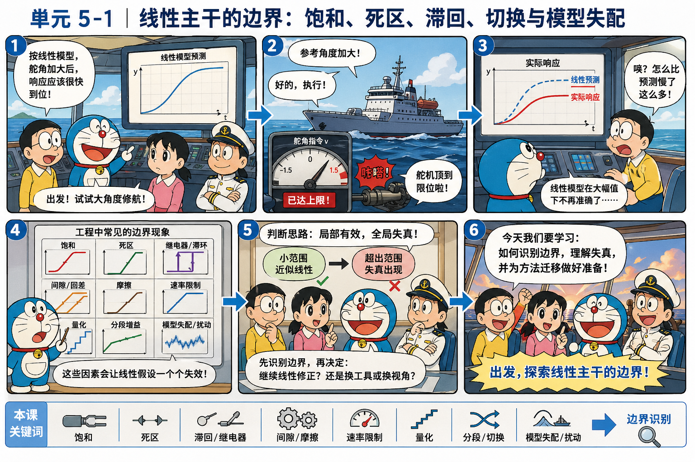
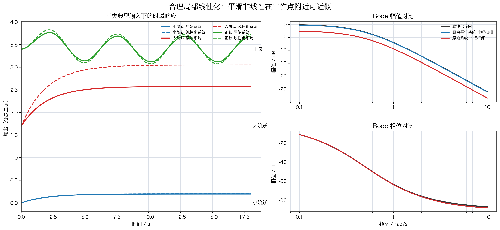
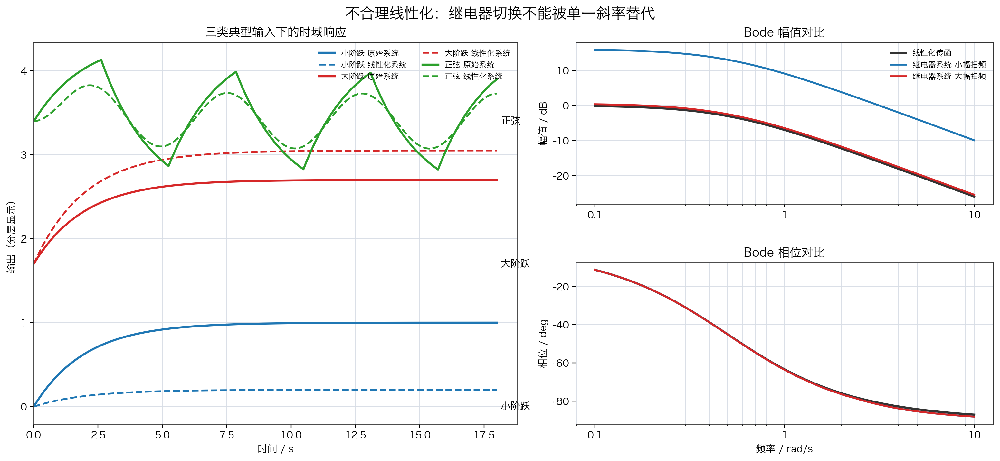
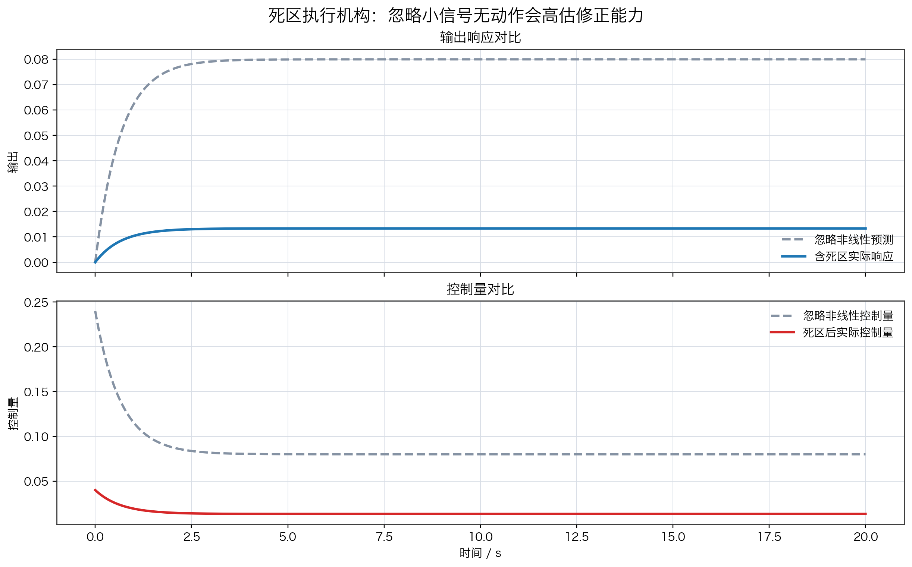
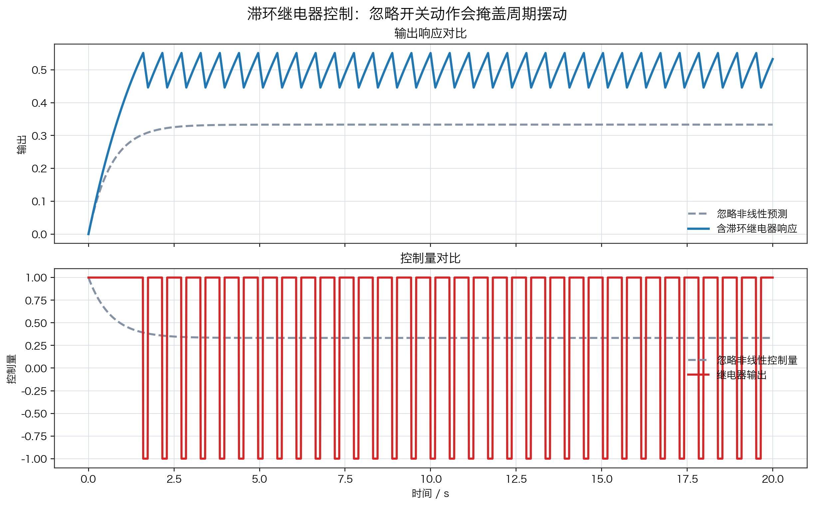
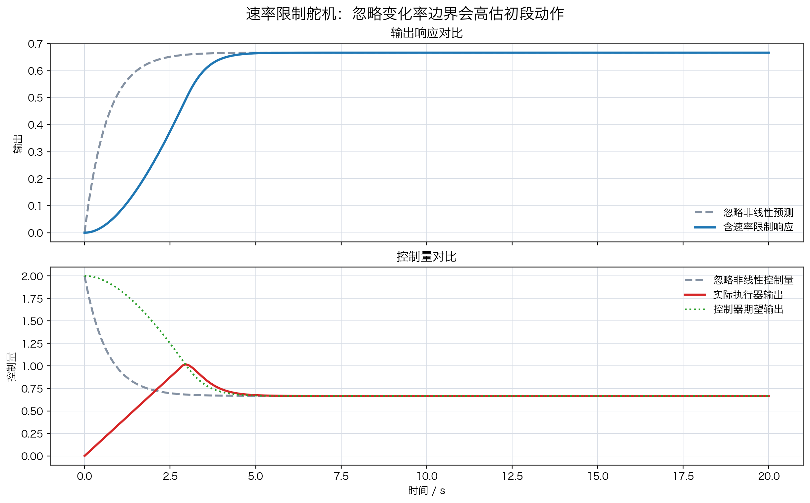
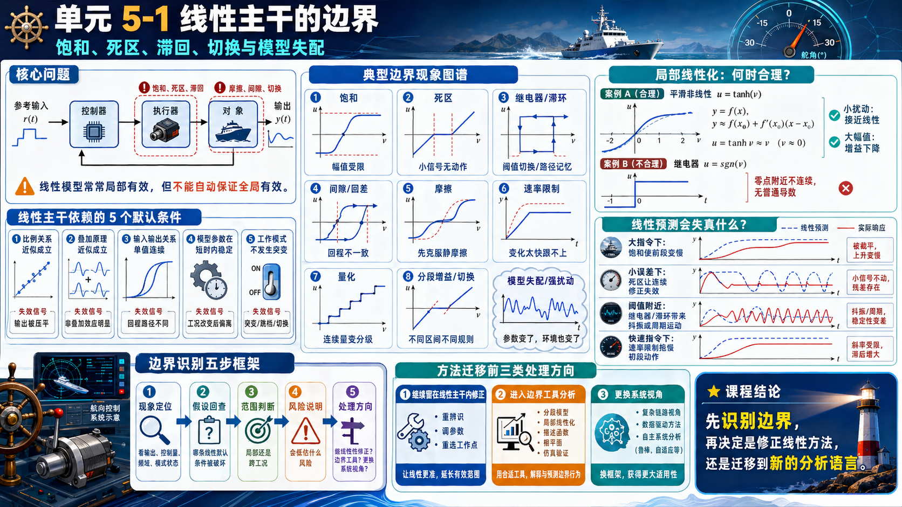

# 单元 5-1 | 线性主干的边界：饱和、死区、滞回、切换与模型失配

- 课程：自动控制原理
- 位置：模块 5 知识边界与方法迁移层 · 第一课
- 学时：90分钟
- 学习起点：已能用传递函数、极点、根轨迹、频域指标和固定结构优化解释线性定常单回路系统
- 核心问题：线性主干在哪些工程边界处开始失真，失真证据怎样支撑方法迁移判断

## 一、工程对象触碰边界后的响应失真

一套航向控制器在小角度修航时表现平稳：输出跟随参考，控制量也没有明显尖峰。若参考角突然放大，线性模型仍会给出一条光滑响应曲线，但真实舵机可能已经顶到限位，输出过程开始变慢，尾段误差也被拖长。此时线性模型并未完全失效——它仍然解释了小范围内的主要趋势；真正暴露出来的是有效范围的边界。

{width=100%}

导入图把同一条线性信号路径放进多个工程边界中：执行器可能被机械止挡截断，小指令可能落入死区，继电器可能在阈值附近突然通断，滞回与间隙会让回程路径不同，摩擦会吞掉起动动作，速率限制会拖慢变化过程，数字实现还可能把连续量变成分级输出。这些现象共同标定了线性理论默认的工作范围。

这种局面在工程系统中很常见。放大器有最大输出电压，舵机有角度和角速度限制，机械传动存在间隙，执行器启动需要克服摩擦，控制程序可能在不同模式间切换，真实对象参数也会随载荷、航速和环境扰动改变。线性主干能够处理大量问题，是因为这些因素在某个工作范围内可以被忽略、近似或并入模型参数。一旦工作点、输入幅值或环境条件越过范围，原有假设就会被逐项暴露。

边界识别的重点在于：先看清线性主干在哪些地方开始失真，再判断问题还能否留在线性框架内修正，或需要进入非线性分析、复杂链路建模、数据驱动等新的视角。

## 二、学习目标

学完这一课后，我们应能完成以下工作：

1. 能说明线性定常主干默认依赖哪些工程假设。
2. 能识别饱和、死区、继电器、滞回、间隙、摩擦、速率限制、量化、分段增益、模型失配和强扰动各自破坏了哪些假设。
3. 能用“局部有效、全局失真”的语言解释小信号近似为什么会成立，以及为什么不能自动推广到全范围。
4. 能根据响应曲线、控制量曲线、频域对比和对象条件判断一套线性设计是否已经触碰边界。
5. 能写出方法迁移前的最小边界说明，区分继续线性修正、进入边界工具分析和更换系统视角三类处理方向。

## 三、线性主干依赖的五个默认条件

线性主干把系统写成传递函数、状态空间模型、频率特性或根轨迹对象时，通常默认以下条件在当前工作范围内成立。

表 1. 线性主干的默认条件与失效信号

| 默认条件 | 在分析中的作用 | 常见失效信号 |
| --- | --- | --- |
| 比例关系近似成立 | 输入放大多少，输出趋势也按比例变化 | 大输入下输出被压平、分段或动作受限 |
| 叠加原理近似成立 | 多个输入或扰动的影响可以分开分析再相加 | 两个作用叠加后出现额外状态、突跳或额外振荡 |
| 输入输出关系单值连续 | 同一输入对应同一输出，路径不影响结果 | 上行和下行路径不同，回程后存在残差 |
| 模型参数在短时内稳定 | 同一对象可以用同一组参数解释 | 载荷、航速、温度或工况改变后响应系统性偏离 |
| 工作模式不发生突变 | 结构、控制律和执行逻辑保持同一形式 | 阈值触发、保护逻辑介入、控制模式切换 |

这些条件并不要求真实世界完全线性。它们只要求在当前任务范围内，非线性因素不会主导响应。工程设计正是依靠这种近似展开：在一个工作点附近建立模型，用线性方法完成主要判断，再用边界检查确定近似是否仍然可用。

## 四、典型非线性环节的输入输出特性

典型非线性环节可以先从输入输出特性看起。这里的图用于识别“哪条线性假设正在失效”，不等同于完整动态模型。

{width=100%}

### 4.1 饱和截断大幅值动作

饱和表示输出存在最大幅值。例如执行器指令 $v$ 经过限幅后得到实际输出

$$
u=\operatorname{sat}(v)=
\begin{cases}
u_{\max}, & v>u_{\max},\\
v, & -u_{\max}\le v\le u_{\max},\\
-u_{\max}, & v<-u_{\max}.
\end{cases}
$$

当 $|v|\le u_{\max}$ 时，饱和环节和比例环节没有区别；当 $|v|>u_{\max}$ 时，再增大输入也不能得到更大的输出。饱和会使线性预测高估执行器能力，也可能在积分控制中引出更严重的累积误差。

### 4.2 死区屏蔽小信号

死区表示小输入不会产生输出。以宽度 $\Delta$ 的理想死区为例，

$$
u=
\begin{cases}
k(v-\Delta), & v>\Delta,\\
0, & |v|\le \Delta,\\
k(v+\Delta), & v<-\Delta.
\end{cases}
$$

死区破坏的是小信号灵敏度。控制器给出微小修正时，执行器或传动机构可能没有动作，误差必须累积到一定程度才被释放。航向保持、减摇鳍、稳定平台等系统中，死区会让小扰动附近的响应变得迟钝，使线性模型预测的连续微调变成间歇修正。

### 4.3 继电器与带滞环继电器把连续输入变成开关动作

理想继电器把输入的符号变成输出的两种状态：

$$
u=M\operatorname{sgn}(v).
$$

它没有“小幅比例关系”。只要 $v$ 越过零点，输出就从 $-M$ 跳到 $M$。带滞环继电器还会引入两个阈值：上行时达到 $+\Delta$ 才切换，下行时降到 $-\Delta$ 才切换。滞环可以减少频繁抖动，但也意味着同一输入值对应的输出取决于历史路径。

### 4.4 间隙、回差与摩擦让路径和起动条件成为状态

机械间隙和回差的共同特征是“同一输入值可能对应不同输出值”。输入从小到大经过某点，与输入从大到小回到同一点，输出不一定相同。摩擦则使小作用先被静摩擦抵消，只有作用超过启动条件后对象才真正运动。它们破坏的不只是比例关系，还把过去的运动方向、接触状态和启动条件带入当前响应。

### 4.5 速率限制、量化和平滑非线性改变动态细节

速率限制约束的是输出变化速度，而不是输出幅值本身。执行器角度还没有到极限时，角速度可能已经到达极限；线性模型会因此高估初段跟随速度。量化来自数字实现、传感分辨率或离散执行档位，它让连续小变化变成台阶变化。平滑非线性如 $u=\tanh v$ 不发生突跳，但局部斜率随幅值改变，远离工作点后等效增益会下降。

### 4.6 分段增益、模式切换、模型失配和强扰动

分段增益和模式切换表示系统在不同条件下使用不同斜率、不同结构或不同控制律。常见形式包括保护逻辑介入、限速模式开启、继电器通断、任务模式转换、控制器增益调度等。切换带来的核心变化是系统方程本身发生改变：

$$
\dot{x}=
\begin{cases}
f_1(x,u), & g(x,u)<0,\\
f_2(x,u), & g(x,u)\ge 0.
\end{cases}
$$

模型失配和强扰动不是单一静态环节，却同样会把线性主干推出有效范围。船舶对象中，航速变化、载荷变化、海况扰动、舵机滞后、执行器老化都会使模型参数偏离原值。若扰动把系统推到饱和、死区、切换或新的工作点附近，响应失真就不再只是参数误差，而是多个边界因素共同作用。

## 五、局部线性化：合理近似与错误近似

局部线性化的基本思想可以写成

$$
y=f(x),\qquad
y\approx f(x_0)+f'(x_0)(x-x_0).
$$

这条式子给出了线性主干的数学依据：在工作点 $x_0$ 附近，非线性函数可以用切线近似。只要偏离量足够小，线性模型就能捕捉主要趋势。问题在于，这个近似需要两个条件同时满足：函数在工作点附近有可用的斜率，输入扰动也没有把系统推出这个小邻域。下面两个例子分别说明合理与不合理的线性化。

### 5.1 合理例子：平滑非线性在工作点附近线性化

考虑一阶对象前接一个平滑非线性执行环节：

$$
2\dot{y}(t)=-y(t)+u(t),\qquad u(t)=\tanh v(t).
$$

在工作点 $v_0=0,\ y_0=0,\ u_0=0$ 附近，有

$$
\tanh v\approx \tanh 0+\left(1-\tanh^2 0\right)(v-0)=v.
$$

因此局部线性化模型为

$$
2\Delta\dot{y}(t)=-\Delta y(t)+\Delta v(t),
$$

对应传递函数为

$$
G_{\text{lin}}(s)=\frac{\Delta Y(s)}{\Delta V(s)}=\frac{1}{2s+1}.
$$

这个传递函数不是原始非线性系统的全局传递函数，只是 $v=0$ 附近的小扰动模型。小阶跃、小幅正弦扫频时，原始系统和线性化系统接近；大阶跃或大幅扫频时，$\tanh v$ 的斜率下降，线性化模型会高估输出增益。

{width=100%}

左侧将小阶跃、大阶跃和正弦输入的响应叠加在同一坐标中。小阶跃下两条曲线几乎重合，大阶跃下线性化系统给出更高的输出。右侧的 Bode 对比中，黑线是 $G_{\text{lin}}(s)$，蓝线和红线是原始非线性系统在小幅与大幅正弦输入下的一次谐波估计；幅值越大，等效增益越低。这个例子说明：合理线性化可以解释工作点附近的主要动态，但不能自动解释全幅值行为。

### 5.2 不合理例子：把继电器切换误当成比例斜率

再考虑同一个一阶对象前接继电器：

$$
2\dot{y}(t)=-y(t)+u(t),\qquad u(t)=\operatorname{sgn} v(t).
$$

在 $v=0$ 附近，$\operatorname{sgn}v$ 不是连续函数，也没有普通意义下的导数。若直接写成

$$
u(t)\approx k_f v(t),\qquad k_f=1,
$$

就会得到形式上熟悉的模型

$$
2\Delta\dot{y}(t)=-\Delta y(t)+\Delta v(t),\qquad
G_{\text{fake}}(s)=\frac{1}{2s+1}.
$$

这个模型并不是通过对可导函数做局部线性化得到的，而是把开关动作误当成比例环节。它会严重低估小输入触发的切换幅值，也会掩盖继电器输出中的高次谐波和阈值敏感性。

{width=100%}

图中小阶跃已经足以触发继电器输出，原始系统朝 $1$ 收敛，而伪线性模型只朝 $0.2$ 收敛；大阶跃和正弦输入下，原始系统也呈现明显的开关特征。右侧 Bode 不是严格的非线性频率响应，而是正弦输入下一次谐波的近似对比。继电器在小幅输入下等效增益反而很大，这与伪线性传函给出的判断相反。

### 5.3 局部线性化的使用边界

表 2. 局部线性化能解释什么

| 情况 | 线性近似的有效性 | 判断依据 |
| --- | --- | --- |
| 平滑非线性的小扰动围绕同一工作点变化 | 通常有效 | 函数可导，输入幅值小，执行器未触边 |
| 同一对象在相邻工况运行 | 可能有效 | 参数变化可被重新辨识或裕度覆盖 |
| 大幅指令触碰执行器限制 | 明显不足 | 控制量被限幅，输出过程与线性预测分离 |
| 系统出现路径记忆、继电器切换或量化 | 不能直接用单一传函替代 | 同一输入下响应依赖历史、阈值或档位 |
| 强扰动推动系统跨工作区 | 单一模型不足 | 模型参数、边界环节和外部扰动共同变化 |

因此，线性模型应被视为在工作范围内有效的分析语言。它的失效不代表前面建立的知识没有价值，而是提醒我们先确定当前对象已经越过哪一条边界。

## 六、不同非线性类型中的线性预测失真

边界识别不能只停在“这是不是非线性”的命名上，还要能说出线性预测会低估什么风险。下面按不同非线性类型给出几个典型场景。

### 6.1 饱和执行器：大指令下响应前段变慢

以航向舵机角度存在上限为例。设被控对象仍用一阶近似表示：

$$
2\dot{y}(t)=-y(t)+u(t),
$$

控制器采用比例律

$$
v(t)=2(r-y(t)).
$$

若忽略饱和，线性预测直接取 $u(t)=v(t)$。若考虑舵机角度上限，则实际执行器输出为

$$
u(t)=\operatorname{sat}(v(t)),\qquad |u(t)|\le 1.2.
$$

比较两个阶跃输入：小阶跃 $r=0.3$，大阶跃 $r=1.2$。小阶跃初始控制量为 $v(0)=0.6$，没有触碰执行器边界。大阶跃初始控制量为 $v(0)=2.4$，已经超过执行器上限。

{width=100%}

左侧小阶跃没有触碰边界，忽略饱和的线性预测和含饱和实际响应保持一致；右侧大阶跃中，忽略饱和时的预测控制量越过执行器上限，实际控制量被截断在 $1.2$ 附近，输出前段明显变慢。这个场景说明，边界识别不能只看输出是否最终接近目标，还要同时看控制量是否已经触碰物理限制。

### 6.2 死区执行机构：小误差附近的连续修正失效

以阀控执行机构在小开度附近存在死区为例。对象和控制器为

$$
2\dot{y}(t)=-y(t)+u(t),\qquad v(t)=2(r-y(t)),
$$

小参考输入取 $r=0.12$。若忽略死区，线性预测认为

$$
u(t)=v(t),
$$

因此闭环模型为

$$
2\dot{y}(t)=-y(t)+2(r-y(t)).
$$

若考虑宽度 $\Delta=0.2$ 的死区，则实际执行器输出为

$$
u(t)=
\begin{cases}
v(t)-0.2, & v(t)>0.2,\\
0, & |v(t)|\le 0.2,\\
v(t)+0.2, & v(t)<-0.2.
\end{cases}
$$

{width=100%}

忽略死区时，线性模型预测输出最终约为 $0.08$，控制量也保持连续变化；考虑死区后，大部分小修正被死区吞掉，实际输出只能上升到约 $0.013$。两者的差异说明，小误差附近的风险不是“大动作太慢”，而是控制器以为自己在持续修正，执行机构实际只给出了很弱的有效动作。静摩擦场景也有同类表现：输入未超过启动摩擦前，线性预测中的连续微调不会真正进入对象。

### 6.3 继电器和滞环：阈值附近出现抖振或周期运动

以温控、液位或保护逻辑中常见的开关控制为例。对象仍取

$$
2\dot{y}(t)=-y(t)+u(t),
$$

目标为 $r=0.5$。若忽略继电器，把开关动作误当成比例控制，则

$$
u_{\text{lin}}(t)=2(r-y(t)).
$$

若考虑带滞环继电器，设滞环宽度 $h=0.05$，输出幅值为 $1$，则

$$
u(t)=
\begin{cases}
1, & r-y(t)>h,\\
-1, & r-y(t)<-h,\\
u(t^-), & |r-y(t)|\le h.
\end{cases}
$$

这里的 $u(t^-)$ 表示继电器保持上一时刻状态。滞环减少了阈值附近的高频抖动，但也让系统具有路径记忆。

{width=100%}

忽略继电器时，线性模型预测输出平滑收敛到约 $0.33$，控制量逐渐趋近于一个小幅连续值；实际继电器系统在 $0.5$ 附近来回切换，输出形成周期性摆动，控制量在 $1$ 与 $-1$ 之间跳变。这个例子说明，继电器问题的主要风险不是稳态值算错一点，而是线性预测会完全掩盖开关动作、阈值穿越和周期摆动。

### 6.4 速率限制舵机：快速指令下初段动作被拖慢

以舵机角度没有越界但角速度受到限制为例。对象与控制器为

$$
2\dot{y}(t)=-y(t)+u(t),\qquad v(t)=2(r-y(t)),\qquad r=1.0.
$$

若忽略速率限制，线性预测取

$$
u(t)=v(t).
$$

若考虑执行器变化率边界，则执行器输出 $u(t)$ 不能立即等于期望指令 $v(t)$，而满足

$$
\dot{u}(t)=\operatorname{sat}\left(\frac{v(t)-u(t)}{T_a}\right),
\qquad |\dot{u}(t)|\le 0.35,\qquad T_a=0.2.
$$

{width=100%}

忽略速率限制时，线性模型认为控制量可以从初始时刻直接给出接近 $2$ 的动作，输出前段快速上升；实际执行器输出只能按最大变化率逐步爬升，输出响应明显滞后。后段两者可能接近同一稳态值，但初段差异已经足以影响调节时间、避障距离或工程安全裕度。机械间隙和量化也会造成类似的“线性曲线被路径、档位或变化率改写”的结果，只是一个强调回程路径，一个强调输出分级。

这个场景组归纳出一条实用判断链：

$$
\text{线性预测有效}
\rightarrow
\text{检查控制量、阈值、路径和对象条件}
\rightarrow
\text{确认是否触碰边界}
\rightarrow
\text{决定是否继续线性修正}.
$$

若只看最终稳态值，一些非线性系统也可能看起来可接受；若同时检查执行器动作、切换状态、频域幅值和路径依赖，失真来源会更清楚。

## 七、边界识别的五步判断框架

面对一个响应异常的控制系统，我们应先把边界证据整理清楚，再决定是否需要更换分析方法。

表 3. 边界识别五步框架

| 步骤 | 要回答的问题 | 典型证据 |
| --- | --- | --- |
| 现象定位 | 异常出现在输出、控制量、误差、频域响应还是模式状态中 | 响应曲线、控制量曲线、Bode 对比、切换日志 |
| 假设回查 | 哪个线性默认条件被破坏 | 比例、叠加、单值连续、参数稳定、结构固定 |
| 范围判断 | 问题只出现在局部，还是跨越多个工况 | 小/大输入对比，工况切换对比，幅值扫频对比 |
| 风险说明 | 若继续沿用线性主干，会低估什么风险 | 执行器越界、尾段误差、振荡、误判裕度、阈值抖动 |
| 处理方向 | 问题还能线性修正，还是需要边界工具或系统视角迁移 | 重新线性化、分段建模、非线性分析、链路重构 |

这张表的作用是把方法迁移前的证据写清楚。没有边界证据时，直接宣称“换前沿方法”很容易变成追逐新概念；有边界证据时，迁移才有明确对象和工程理由。

## 八、方法迁移前的三类处理方向

### 8.1 继续留在线性主干内修正

当失效只来自参数偏差、工作点小幅移动或裕度不足时，可以继续在线性框架内处理。例如重新辨识模型参数、增加鲁棒裕度、重选控制器参数、限制参考输入幅值，或在新的工作点附近重新线性化。此时线性主干仍然是主要分析语言。

### 8.2 进入边界工具分析

当响应已经由饱和、死区、滞回、继电器、间隙、摩擦、量化、切换或自持振荡主导时，需要引入边界工具。局部线性化、相平面、描述函数、仿真实验和分段模型都属于这类入口。它们的作用是观察边界，不是直接替代全部控制设计。

### 8.3 更换系统视角

当问题已经不是一个单回路对象足以解释——例如感知误差、估计偏差、规划指令、执行器约束和环境扰动同时耦合——就需要把控制放回复杂系统链路中分析。此时方法迁移可能走向自主系统链路、数据驱动或策略学习，但前提仍然是边界证据已经说明单一线性主干不足以解释当前问题。

## 九、小结

线性主干是自动控制原理中最重要的分析语言之一。它能够成立，是因为在特定工作范围内，比例、叠加、单值连续、参数稳定和结构固定等条件近似有效。工程对象触碰饱和、死区、继电器、滞回、间隙、摩擦、速率限制、量化、切换、模型失配或强扰动时，这些条件会被逐项破坏。

核心判断是：线性模型通常在局部有效，不能自动保证全局有效。边界识别的任务，就是把“哪里仍可用、哪里已经失真、失真来自哪条假设”说清楚。只有完成这一步，进入非线性工具、复杂自主系统链路、数据驱动或策略学习，才有明确的工程理由。

## 十、分层练习

### 练习 1：边界现象识别

某舵机控制回路在小角度修航时响应正常。当参考角从 $5^\circ$ 增大到 $25^\circ$ 后，控制器输出指令继续增大，但舵角实际值停在最大允许角附近，航向响应前段明显变慢。

请判断：

1. 该现象最可能对应哪一类边界环节？
2. 被破坏的线性默认条件是什么？
3. 只看航向最终值，为什么可能低估风险？

### 练习 2：死区与小信号误差

某执行机构存在 $\Delta=0.2$ 的死区。控制器在稳态附近给出的修正指令长期落在 $[-0.15,0.15]$ 内，但误差并没有继续减小。

请说明：

1. 为什么线性模型会高估这类小信号修正能力？
2. 若要继续留在线性主干内处理，可以先做哪两类工程调整？
3. 若这些调整仍然不能解释响应，应转向哪类边界工具？

### 练习 3：局部线性化是否合理

某执行环节满足 $u=\tanh v$，另一执行环节满足 $u=\operatorname{sgn}v$。两者后面都接同一个一阶对象 $2\dot{y}=-y+u$。

请判断：

1. 哪一个对象可以在 $v=0$ 附近合理线性化？
2. 合理线性化后的微分方程和传递函数是什么？
3. 为什么不能把继电器环节直接写成同一个传递函数？

### 练习 4：模型失配与方法迁移说明

某船舶航向控制器在试验池中满足调节时间和超调要求。海上试验时，载荷变化和海况扰动使响应出现持续拖尾，控制量也更频繁触碰限幅。请写出一段不超过 150 字的边界说明，至少包含：

- 已观察到的边界证据；
- 可能被破坏的线性假设；
- 仍可在线性主干内尝试的处理；
- 需要迁移方法时的理由。

## 十一、扩展思考

前沿方法的价值通常出现在边界之后。数据驱动方法、强化学习和复杂自主系统架构并不会因为名称更新就天然优于线性控制。面对一个具体工程对象，我们应先判断线性主干是否仍在有效范围内，再判断边界来自执行器、对象、扰动、模式切换还是系统链路。方法迁移建立在已有主干的边界证据之上，目标是选择更能解释当前对象的分析框架。

