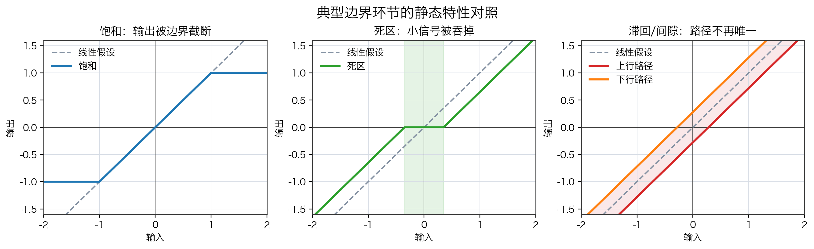
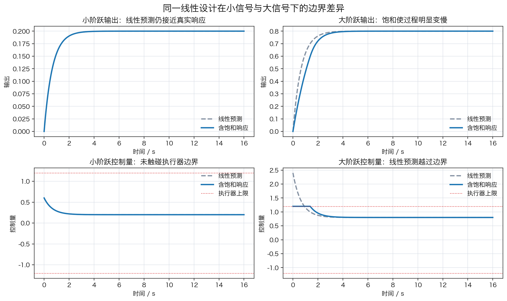

# 单元 5-1 | 线性主干的边界：饱和、死区、滞回、切换与模型失配

- 课程：自动控制原理
- 层次：模块 5 前沿拓展主线 · 第一课
- 学时：90分钟
- 知识类型：[X] 跨域型（边界识别）
- 前置：已能用传递函数、极点、根轨迹、频域指标和固定结构优化解释线性定常单回路系统
- 讲义定位：这份讲义用于识别线性主干的有效边界，把典型失效现象整理为后续方法迁移的判断依据

## 一、工程对象触碰边界后的响应失真

一套航向控制器在小角度修航时表现平稳：输出跟随参考，控制量也没有明显尖峰。若参考角突然放大，线性模型仍会给出一条光滑响应曲线，但真实舵机可能已经顶到限位，输出过程开始变慢，尾段误差也被拖长。此时线性模型没有完全失去价值，它仍然解释了小范围内的主要趋势；真正暴露出来的是有效范围。

这种局面在工程系统中很常见。放大器有最大输出电压，舵机有角度和角速度限制，机械传动存在间隙，执行器启动需要克服摩擦，控制程序可能在不同模式间切换，真实对象参数也会随载荷、航速和环境扰动改变。线性主干能够处理大量问题，是因为这些因素在某个工作范围内可以被忽略、近似或并入模型参数。一旦工作点、输入幅值或环境条件越过范围，原有假设就会被逐项暴露出来。

本单元研究的重点是边界识别。我们先看见线性主干在哪些地方开始不够用，再判断问题还能否留在线性框架内修正，或需要进入非线性、复杂链路、数据驱动等新的分析视角。

## 二、课程目标

学完这一课后，我们应能完成以下工作：

1. 能说明线性定常主干默认依赖哪些工程假设。
2. 能识别饱和、死区、滞回、切换、模型失配和强扰动各自破坏了哪些假设。
3. 能用“局部有效、全局失真”的语言解释小信号近似为什么会成立，以及为什么不能自动推广到全范围。
4. 能根据响应曲线、控制量曲线和对象条件判断一套线性设计是否已经触碰边界。
5. 能写出方法迁移前的最小边界说明，区分继续线性修正、进入边界工具分析和更换系统视角三类处理方向。

## 三、线性主干依赖的五个默认条件

线性主干把系统写成传递函数、状态空间模型、频率特性或根轨迹对象时，通常默认以下条件在当前工作范围内成立。

表 1. 线性主干的默认条件与失效信号

| 默认条件 | 在分析中的作用 | 常见失效信号 |
| --- | --- | --- |
| 比例关系近似成立 | 输入放大多少，输出趋势也按比例变化 | 大输入下输出被压平或动作受限 |
| 叠加原理近似成立 | 多个输入或扰动的影响可以分开分析再相加 | 两个作用叠加后出现额外状态或额外振荡 |
| 输入输出关系单值连续 | 同一输入对应同一输出，路径不影响结果 | 上行和下行路径不同，回程后存在残差 |
| 模型参数在短时内稳定 | 同一对象可以用同一组参数解释 | 载荷、航速、温度或工况改变后响应系统性偏离 |
| 工作模式不发生突变 | 结构、控制律和执行逻辑保持同一形式 | 阈值触发、保护逻辑介入、控制模式切换 |

这些条件并不要求真实世界完全线性。它们只要求在当前任务范围内，非线性因素不会主导响应。工程设计常常正是依靠这种近似展开：在一个工作点附近建立模型，用线性方法完成主要判断，再用边界检查确定近似是否仍然可用。

## 四、典型边界环节的输入输出特性

### 4.1 饱和截断大幅值动作

饱和表示输出存在最大幅值。例如执行器指令 $v$ 经过限幅后得到实际输出

$$
u=\operatorname{sat}(v)=
\begin{cases}
u_{\max}, & v>u_{\max},\\
v, & -u_{\max}\le v\le u_{\max},\\
-u_{\max}, & v<-u_{\max}.
\end{cases}
$$

当 $|v|\le u_{\max}$ 时，饱和环节和比例环节没有区别；当 $|v|>u_{\max}$ 时，再增大输入也不能得到更大的输出。饱和最容易造成两类后果：控制器以为自己给出了足够大的动作，真实执行器只给出边界动作；响应过程因此变慢，甚至在积分环节存在时积累更大的后续误差。

### 4.2 死区吞掉小信号

死区表示小输入不会产生输出。以宽度 $\Delta$ 的理想死区为例，

$$
u=
\begin{cases}
k(v-\Delta), & v>\Delta,\\
0, & |v|\le \Delta,\\
k(v+\Delta), & v<-\Delta.
\end{cases}
$$

死区破坏的是小信号灵敏度。控制器给出微小修正时，执行器或传动机构可能没有动作，误差必须累积到一定程度才被释放。航向保持、减摇鳍、稳定平台等系统中，死区会让小扰动附近的响应变得迟钝，使线性模型预测的连续微调变成间歇修正。

### 4.3 滞回与间隙使路径成为变量

滞回和机械间隙的共同特征是“同一输入值可能对应不同输出值”。输入从小到大经过某点，与输入从大到小回到同一点，输出不一定相同。这破坏了单值关系，也让状态记忆进入对象。

{width=100%}

静态特性对照图把三类边界放在同一坐标下。灰色虚线表示线性假设。饱和在大幅值区间被截断，死区在原点附近形成无响应带，滞回/间隙让上行和下行路径分开。三者都说明同一套线性比例关系只在局部区间内成立。

### 4.4 切换改变系统结构

切换表示系统在不同条件下使用不同结构或不同控制律。常见形式包括保护逻辑介入、限速模式开启、继电器通断、任务模式转换、控制器增益分段调度等。切换带来的核心变化是系统方程本身发生改变：

$$
\dot{x}=
\begin{cases}
f_1(x,u), & g(x,u)<0,\\
f_2(x,u), & g(x,u)\ge 0.
\end{cases}
$$

如果切换阈值附近频繁来回穿越，系统可能出现抖振、突跳或周期运动。线性主干可以分析每一个固定模式附近的局部行为，却不能只用一个固定传递函数解释完整切换过程。

### 4.5 模型失配和强扰动放大参数偏差

模型失配表示设计模型与真实对象不一致。小幅偏差常常可以通过裕度、鲁棒性或重新辨识修正；强失配会改变主要动态。船舶对象中，航速变化、载荷变化、海况扰动、舵机滞后、执行器老化都会使模型参数偏离原值。

强扰动会把这种偏差进一步放大。若扰动只在小范围内变化，线性模型还能提供有效预测；若扰动把系统推到饱和、死区、切换或新的工作点附近，响应失真就不再只是参数误差，而是多个边界因素共同出现。

## 五、局部有效与全局失真

线性化的基本思想可以写成

$$
y=f(x),\qquad
y\approx f(x_0)+f'(x_0)(x-x_0).
$$

这条式子说明了线性主干的合法来源：在工作点 $x_0$ 附近，非线性函数可以用切线近似。只要偏离量足够小，线性模型就能给出主要趋势。问题在于，这个近似有范围。离开工作点以后，曲率、限幅、路径记忆和结构切换都会逐渐显现。

表 2. 局部线性化能解释什么

| 情况 | 线性近似的有效性 | 判断依据 |
| --- | --- | --- |
| 小扰动围绕同一工作点变化 | 通常有效 | 输入幅值小，执行器未触边，响应可重复 |
| 同一对象在相邻工况运行 | 可能有效 | 参数变化可被重新辨识或裕度覆盖 |
| 大幅指令触碰执行器限制 | 明显不足 | 控制量被限幅，输出过程与线性预测分离 |
| 系统出现路径记忆或模式切换 | 需要更换描述 | 同一输入下响应依赖历史或阈值状态 |
| 强扰动推动系统跨工作区 | 单一模型不足 | 模型参数、边界环节和外部扰动共同变化 |

因此，线性模型应被理解为工作范围内的有效语言。它的失效不意味着前面建立的知识无用，而是提醒我们先确定当前对象已经越过哪一条边界。

## 六、最小例题：一阶对象在饱和执行器下的响应差异

考虑一阶对象

$$
2\dot{y}(t)=-y(t)+u(t),
$$

控制器采用比例律

$$
v(t)=2(r-y(t)).
$$

若执行器没有饱和，则 $u(t)=v(t)$。若执行器存在边界，则

$$
u(t)=\operatorname{sat}(v(t)),\qquad |u(t)|\le 1.2.
$$

比较两个阶跃输入：

- 小阶跃：$r=0.3$；
- 大阶跃：$r=1.2$。

小阶跃初始控制量为 $v(0)=0.6$，没有触碰执行器边界。此时含饱和系统与线性预测几乎重合。大阶跃初始控制量为 $v(0)=2.4$，已经超过 $1.2$ 的执行器上限。真实控制量被截断，输出只能按照最大动作慢慢爬升，线性预测会明显高估前段速度。

{width=100%}

响应对比图给出四个证据。左侧小阶跃没有触碰边界，线性预测和含饱和响应保持一致；右侧大阶跃中，线性预测控制量越过执行器上限，真实输出前段明显变慢。这个例题说明，边界识别不能只看输出是否最终接近目标，还要同时看控制量是否已经触碰物理限制。

这个例题也给出一条实用判断链：

$$
\text{线性预测有效}
\rightarrow
\text{检查控制量与对象条件}
\rightarrow
\text{确认是否触碰边界}
\rightarrow
\text{决定是否继续线性修正}.
$$

若只看最终稳态值，小阶跃和大阶跃都可能看起来可接受；若同时检查执行器动作，大阶跃已经明确越过线性主干的安全解释范围。

## 七、边界识别的五步判断框架

面对一个响应异常的控制系统，我们应先把边界证据整理清楚，再决定是否需要更换方法语言。

表 3. 边界识别五步框架

| 步骤 | 要回答的问题 | 典型证据 |
| --- | --- | --- |
| 现象定位 | 异常出现在输出、控制量、误差还是模式状态中 | 响应曲线、控制量曲线、切换日志 |
| 假设回查 | 哪个线性默认条件被破坏 | 比例、叠加、单值连续、参数稳定、结构固定 |
| 范围判断 | 问题只出现在局部，还是跨越多个工况 | 小/大输入对比，工况切换对比 |
| 风险说明 | 若继续沿用线性主干，会低估什么风险 | 执行器越界、尾段误差、振荡、误判裕度 |
| 处理方向 | 问题还能线性修正，还是需要边界工具或系统视角迁移 | 重新线性化、分段建模、非线性分析、链路重构 |

这张表的作用是把方法迁移前的证据写清楚。没有边界证据时，直接宣称“换前沿方法”很容易变成追新；有边界证据时，迁移才有明确对象和工程理由。

## 八、方法迁移前的三类处理方向

### 8.1 继续留在线性主干内修正

当失效只来自参数偏差、工作点小幅移动或裕度不足时，可以继续在线性框架内处理。例如重新辨识模型参数、增加鲁棒裕度、重选控制器参数、限制参考输入幅值，或在新的工作点附近重新线性化。此时线性主干仍然是主要语言。

### 8.2 进入边界工具分析

当响应已经由饱和、死区、滞回、切换或自持振荡主导时，需要引入边界工具。局部线性化、相平面、描述函数、仿真实验和分段模型都属于这类入口。它们的职责是观察边界，不是直接替代全部控制设计。

### 8.3 更换系统视角

当问题已经不是一个单回路对象能够解释，例如感知误差、估计偏差、规划指令、执行器约束和环境扰动同时耦合，就需要把控制放回复杂系统链路中分析。此时方法迁移可能走向自主系统链路、数据驱动或策略学习，但前提仍然是边界证据已经说明单一线性主干不够解释当前问题。

## 九、本节小结

线性主干是自动控制原理中最重要的分析语言之一。它能够成立，是因为在特定工作范围内，比例、叠加、单值连续、参数稳定和结构固定等条件近似有效。工程对象触碰饱和、死区、滞回、切换、模型失配或强扰动时，这些条件会被逐项破坏。

本单元建立的核心判断是：线性模型通常在局部有效，不能自动保证全局有效。边界识别的任务，就是把“哪里仍可用、哪里已经失真、失真来自哪条假设”说清楚。只有完成这一步，后续进入非线性工具、复杂自主系统链路、数据驱动或策略学习，才有明确的工程理由。

## 十、分层练习

### 练习 1：边界现象识别

某舵机控制回路在小角度修航时响应正常。当参考角从 $5^\circ$ 增大到 $25^\circ$ 后，控制器输出指令继续增大，但舵角实际值停在最大允许角附近，航向响应前段明显变慢。

请判断：

1. 该现象最可能对应哪一类边界环节？
2. 被破坏的线性默认条件是什么？
3. 只看航向最终值，为什么可能低估风险？

### 练习 2：死区与小信号误差

某执行机构存在 $\Delta=0.2$ 的死区。控制器在稳态附近给出的修正指令长期落在 $[-0.15,0.15]$ 内，但误差并没有继续减小。

请说明：

1. 为什么线性模型会高估这类小信号修正能力？
2. 若要继续留在线性主干内处理，可以先做哪两类工程调整？
3. 若这些调整仍然不能解释响应，应转向哪类边界工具？

### 练习 3：模型失配与方法迁移说明

某船舶航向控制器在试验池中满足调节时间和超调要求。海上试验时，载荷变化和海况扰动使响应出现持续拖尾，控制量也更频繁触碰限幅。请写出一段不超过 150 字的边界说明，至少包含：

- 已观察到的边界证据；
- 可能被破坏的线性假设；
- 仍可在线性主干内尝试的处理；
- 需要迁移方法时的理由。

## 十一、扩展思考

前沿方法的价值通常出现在边界之后。数据驱动方法、强化学习和复杂自主系统架构并不会因为名称更新就天然优于线性控制。面对一个具体工程对象，我们应先判断线性主干是否仍在有效范围内，再判断边界来自执行器、对象、扰动、模式切换还是系统链路。方法迁移建立在已有主干的边界证据之上，目标是选择更能解释当前对象的语言。
