# 单元 5-2 教师版讲义 | 非线性系统的最小分析入口：局部线性化、相平面与描述函数的边界角色

- 课程：自动控制原理
- 学时：90 分钟
- 课型：理论
- 课堂主线：先判断线性主干为什么不够，再选择合适的非线性边界观察工具
- 学生基础：已经识别饱和、死区、滞回、切换和模型失配等线性主干失效现象

## 一、课堂主线与关键判断

本课不把非线性系统展开成完整理论课，而是建立三种最小入口工具的选择意识。局部线性化回答“工作点附近还能不能用线性主干”；相平面回答“二阶状态轨迹怎样运动”；描述函数回答“某些非线性环节是否可能和线性部分形成自振边界”。

课堂中要反复区分三类证据：工作点附近的斜率、状态平面中的轨迹、频域复平面中的交点。学生常见问题不是公式记不住，而是把三类工具混成一种万能非线性分析方法。教师需要把每个工具的适用范围和看不见的内容同时讲清。

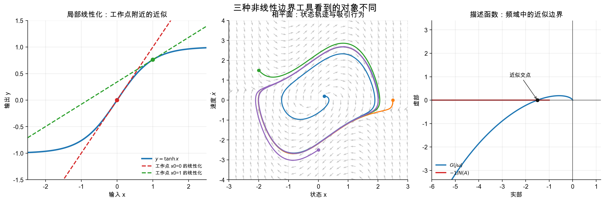{width=100%}

## 二、课堂目标

完成本课后，学生应能：

1. 说明局部线性化中的工作点、增量变量和小信号增益。
2. 对一元非线性关系在指定工作点附近做一阶线性化。
3. 在相平面中识别平衡点、轨迹方向、吸引行为和周期行为。
4. 写出饱和、死区、继电、滞环、间隙等常见非线性环节的描述函数及适用范围。
5. 用 $G(j\omega)=-1/N(A)$ 找到候选自振点，并用微小扰动法判断交点是否稳定。
6. 在舵机饱和与死区场景中解释自振风险、工程后果和整改方向。

## 三、局部线性化的讲授要点

### 3.1 工作点不是装饰条件

板书从静态关系开始：

$$
y=f(x),\qquad
y\approx f(x_0)+f'(x_0)(x-x_0).
$$

再引入增量变量：

$$
\Delta x=x-x_0,\qquad \Delta y=y-f(x_0),
$$

得到

$$
\Delta y\approx f'(x_0)\Delta x.
$$

这里要强调两点。第一，$f'(x_0)$ 是工作点附近的小信号增益，不是全局比例系数。第二，增量模型解释的是偏离工作点的小扰动，不直接解释大幅输入、饱和边界或切换过程。

### 3.2 用 $\tanh x$ 做最小对比

学生容易把一条非线性曲线理解为“取一条最合适的直线”。用 $y=\tanh x$ 可以快速打断这种误解。在 $x_0=0$ 附近，$f'(0)=1$；在 $x_0=1$ 附近，$f'(1)\approx0.420$。同一条曲线在不同工作点得到不同线性模型，说明线性化首先取决于工作点。

讲授时不需要扩展到复杂高维推导，但要让学生看懂雅可比矩阵：

$$
A=\left.
\begin{bmatrix}
\dfrac{\partial \dot{x}_1}{\partial x_1} & \dfrac{\partial \dot{x}_1}{\partial x_2}\\
\dfrac{\partial \dot{x}_2}{\partial x_1} & \dfrac{\partial \dot{x}_2}{\partial x_2}
\end{bmatrix}
\right|_{x=x^\ast}.
$$

特征值只给出平衡点附近的局部稳定性。若学生把它直接外推为全局稳定，应回到“轨迹远离工作点或穿过阈值”这一证据。

## 四、相平面的讲授要点

相平面适合把二阶系统的状态运动画出来。课堂中先写状态方程：

$$
\dot{x}_1=x_2,\qquad \dot{x}_2=f(x_1,x_2),
$$

再说明相平面方向场来自

$$
\frac{dx_2}{dx_1}=\frac{f(x_1,x_2)}{x_2},\qquad x_2\ne0.
$$

相平面重点读三个对象：平衡点、轨迹方向和闭合轨道。不要把课堂时间花在相平面复杂作图技巧上。本课只需要学生能解释轨迹是否靠近平衡点、是否被吸引到闭合轨道、是否存在初值敏感现象。

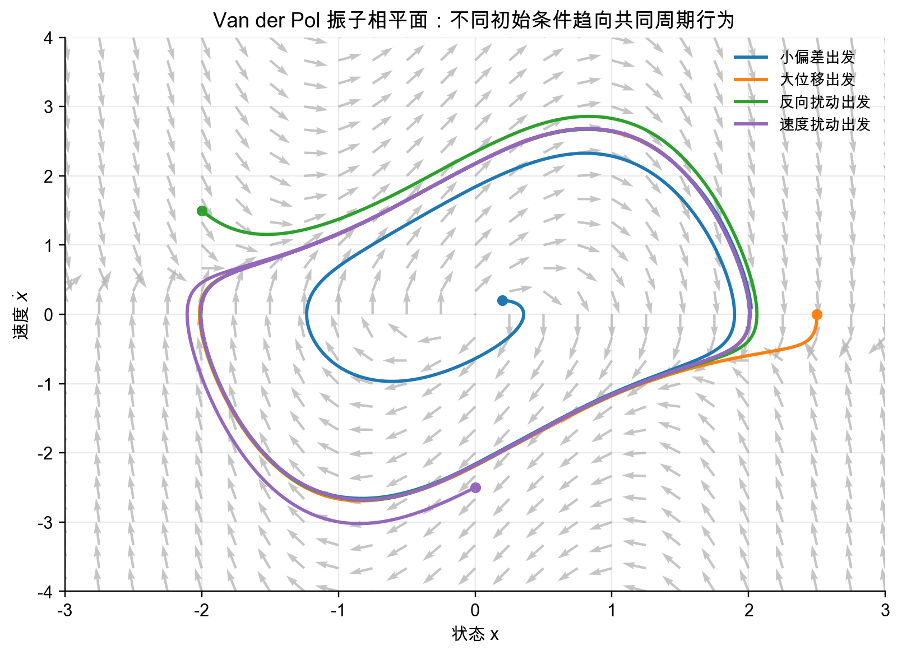{width=80%}

Van der Pol 图用于建立周期行为直觉。教师可追问：如果只看原点附近的线性化，能否看出远处轨迹最后靠近同一闭合轨道？这个问题能自然转入“局部工具与全局轨迹证据不能混用”。

## 五、描述函数的讲授要点

### 5.1 描述函数的近似前提

从正弦输入开始：

$$
e(t)=A\sin \omega t.
$$

非线性输出一般包含基波和高次谐波。描述函数只保留基波，把非线性环节近似为幅值相关复增益：

$$
N(A)=\frac{\text{输出基波复幅值}}{\text{输入正弦幅值}}.
$$

这里要把“幅值相关”讲透。线性频率响应中 $G(j\omega)$ 只随频率变；描述函数 $N(A)$ 还随输入幅值变。学生若把 $N(A)$ 当作普通常数增益，后面的负倒曲线会读错。

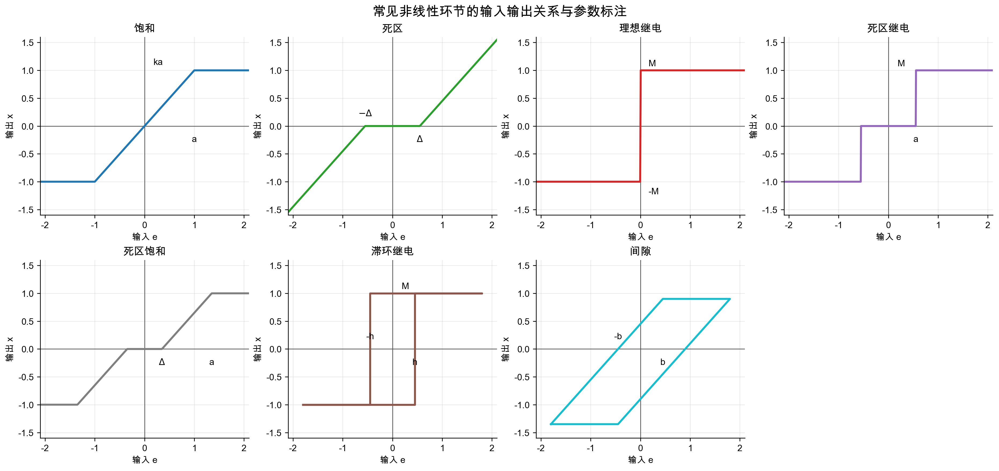{width=100%}

### 5.2 常见非线性环节的讲授顺序

建议按“实描述函数”到“复描述函数”讲：

1. 饱和：小输入等效斜率为 $k$，大输入基波增益下降。
2. 死区：小输入被吞掉，$A>\Delta$ 后才出现基波分量。
3. 理想继电：输出幅值固定，等效增益随 $A$ 增大而减小。
4. 死区继电：死区决定动作门槛，继电决定输出幅值。
5. 滞环继电：滞环引入相位滞后，$N(A)$ 成为复数。
6. 间隙：机械反向间隙带来路径相关和相位滞后。
7. 死区饱和：小输入无动作，大输入又被限幅。

公式按学生讲义给出即可。课堂中应重点解释参数范围，例如滞环继电必须满足 $A>h$ 才能形成周期切换，间隙环节必须满足 $A>b$ 才能越过机械间隙。

## 六、负倒描述函数与自振判断

### 6.1 闭环结构与适用范围

描述函数法对应的闭环结构是线性部分 $G(s)$ 与非线性环节 $N$ 串联后构成负反馈。课堂中先展示结构图，再说明它的限制：非线性最好能集中成一个环节，线性部分要能衰减高次谐波，分析目标是自由系统的稳定性和自振边界。

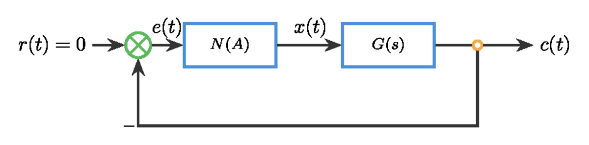{width=82%}

### 6.2 从特征方程到负倒曲线

描述函数近似下，闭环候选周期解满足

$$
1+G(j\omega)N(A)=0,
$$

即

$$
G(j\omega)=-\frac{1}{N(A)}.
$$

讲授时要把“候选”二字保留。交点只说明在基波近似下频率和振幅可能匹配，不能直接等同于稳定自振。接着用微小扰动法判断交点两侧的包围关系。

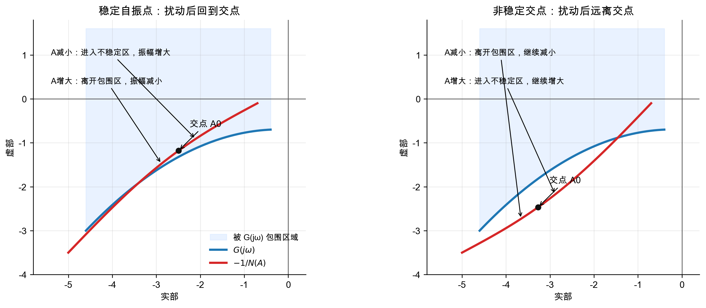{width=92%}

图中 $A_1$ 是进入边界的交点，两侧扰动远离交点，属于非稳定候选点。$A_2$ 是穿出边界的交点，两侧扰动回到交点，可解释为稳定自振点。教师应要求学生用“区内/区外”和“振幅增大/减小”说完整判断链，而不是只背“穿出稳定”。

### 6.3 常见负倒曲线的读图方式

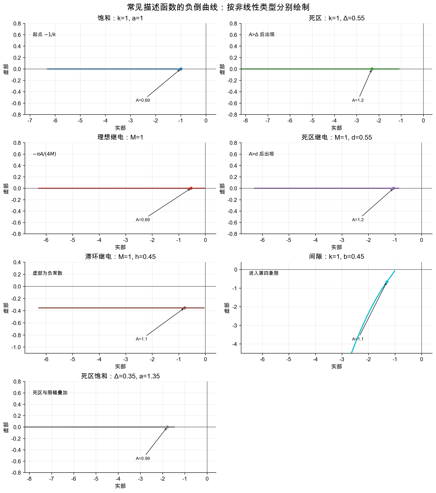{width=100%}

负倒曲线读图时抓三件事：起点在哪里，随 $A$ 增大向哪里移动，参数变化如何移动整条曲线。实描述函数的负倒曲线落在负实轴上；滞环和间隙会进入复平面。学生若只看是否“有交点”，需要追问交点对应的参数范围是否满足、微小扰动是否稳定、时域仿真是否支持。

## 七、例题组织方式

### 7.1 理想继电例题

线性部分为

$$
G(s)=\frac{10}{s(s+2)^2},
$$

理想继电输出幅值 $M=1$。例题目的不是训练代数技巧，而是让学生完整走一遍：

1. 写出 $N(A)=4/(\pi A)$；
2. 写出 $-1/N(A)=-\pi A/4$；
3. 由 $G(j\omega)$ 虚部为零求 $\omega=2\ \mathrm{rad/s}$；
4. 由 $G(j2)=-0.625$ 求 $A\approx0.796$；
5. 用仿真确认短脉冲后进入稳定周期运动。

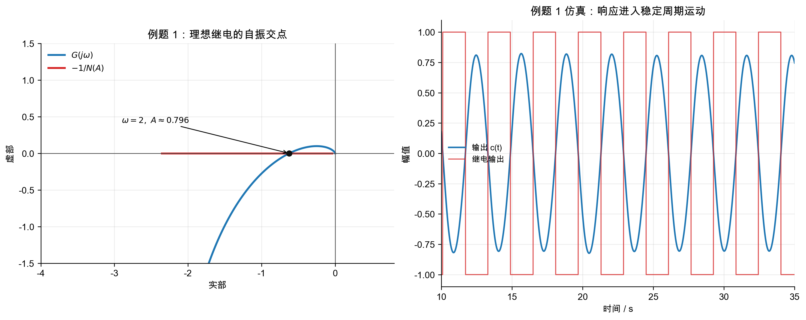{width=100%}

### 7.2 饱和增益例题

该例题用于说明自振不是由非线性环节单独决定。$K=4$ 和 $K=9$ 使用同一个单位饱和环节，但只有 $K=9$ 的 Nyquist 曲线与负倒曲线相交。讲授时要把“线性部分的增益和相位共同决定交点”作为结论。

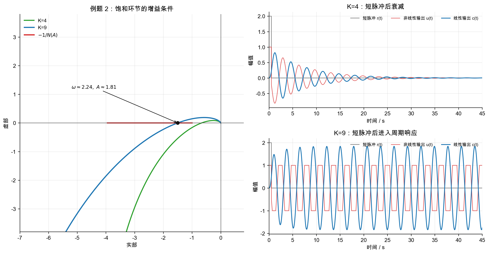{width=100%}

## 八、船舶航向舵机案例讲授要点

案例要从执行器结构进入，而不是从公式进入。舵机链条中，控制器输出经放大器、电液伺服阀、液压缸和舵叶机构形成舵角。放大器或阀驱动电压有限幅，阀芯搭接、摩擦和启动压力会形成死区。

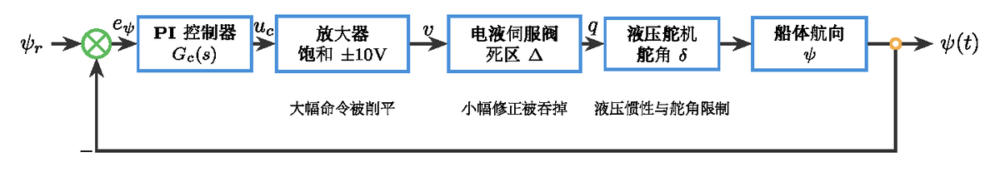{width=100%}

自振风险放在低速进港的小航向保持场景中讲。若 PI 增益较高，误差越过死区后执行器突然动作，舵角变化又使误差反向穿过死区，系统可能在“无动作”和“突然动作”之间反复切换。描述函数估计给出候选频率 $\omega\approx2.24\ \mathrm{rad/s}$ 和输入振幅 $A\approx1.22$，说明周期运动会反复触发死区和饱和边界。

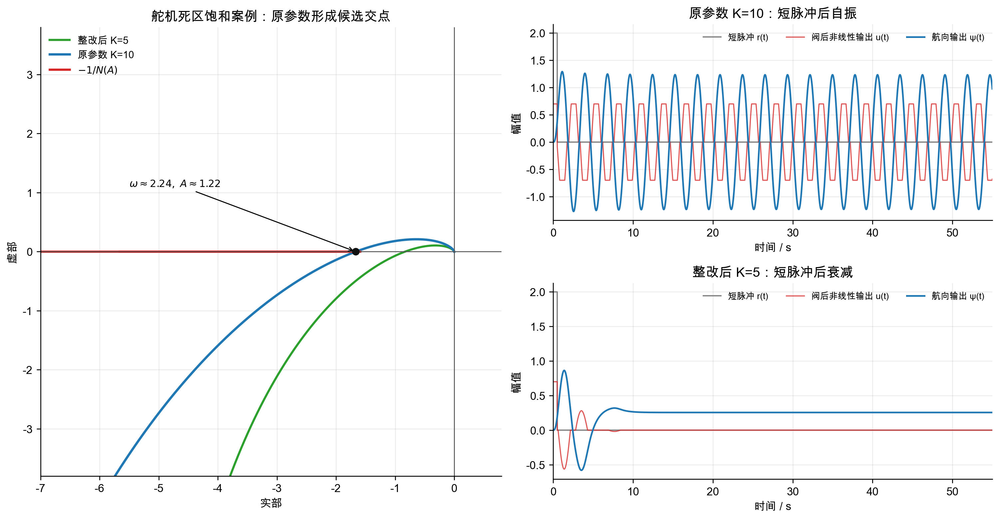{width=100%}

整改方向不要只写“降低增益”。应同时讨论四类措施：降低中低频增益或重新整定 PI；加入抗积分饱和；维护或补偿阀口死区和机械间隙；通过滤波或相位校正让线性曲线远离危险交点。最后强调仍需用含饱和、死区、速率限制和舵机动力学的仿真以及试验复核。

## 九、课堂误判与处理

| 误判 | 表现 | 处理方式 |
| --- | --- | --- |
| 把局部线性化当作全局模型 | 认为雅可比特征值稳定即可判断全局稳定 | 回到 $\tanh x$ 和 Van der Pol 图，区分工作点附近和远处轨迹 |
| 把相平面当作所有系统通用图 | 试图把高阶系统直接画成一张二维图 | 说明相平面适合二阶或降阶对象，高阶系统需要投影并配合仿真 |
| 把描述函数当作精确频率响应 | 忽略高次谐波和低通滤波条件 | 追问线性部分是否能衰减高次谐波 |
| 把交点直接等同于稳定自振 | 看到交点就写“系统自振” | 要求补充微小扰动方向和时域仿真证据 |
| 把舵机自振只归因于控制器参数 | 只提出降低增益 | 引导学生同时检查执行器死区、饱和、间隙和抗积分饱和 |

## 十、板书与课堂收束

建议板书保留四组核心式：

$$
\Delta y\approx f'(x_0)\Delta x,
$$

$$
\frac{dx_2}{dx_1}=\frac{f(x_1,x_2)}{x_2},
$$

$$
N(A)=\frac{\text{输出基波复幅值}}{\text{输入正弦幅值}},
$$

$$
G(j\omega)=-\frac{1}{N(A)}.
$$

课堂结尾可用一句话收束：局部线性化看“近处”，相平面看“轨迹”，描述函数看“边界交点”；三者都提供证据，但没有任何一个能单独替代工程验证。

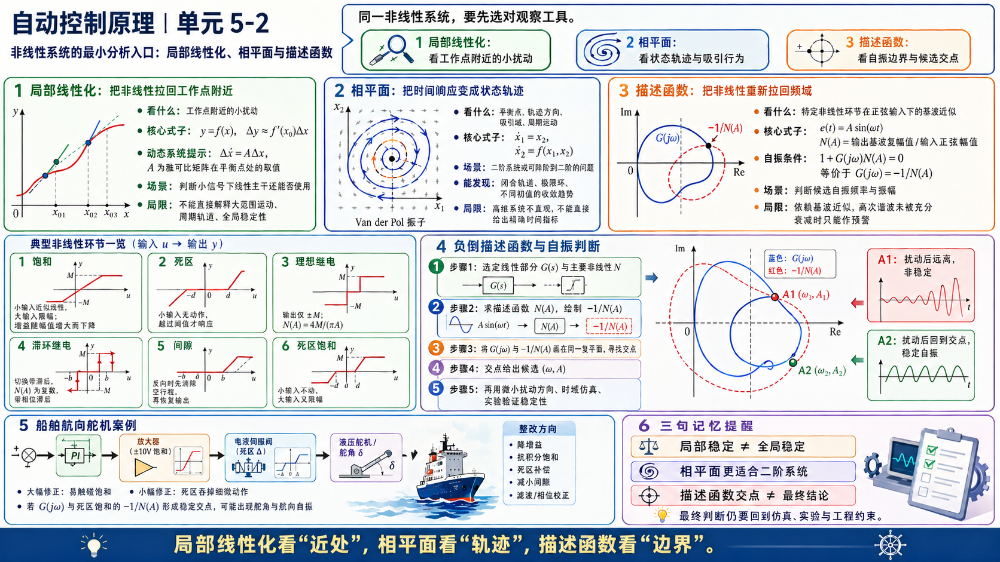
