# 单元 5-3 | 从单回路控制到复杂自主系统链路：MASS 的感知、估计、规划与控制协同

- 课程：自动控制原理
- 学时：90分钟
- 课型：理论
- 前置：已能识别线性主干的边界，并能用局部线性化、相平面和描述函数理解非线性系统的最小分析入口
- 讲义定位：这份讲义帮助我们把“控制器解决问题”的单回路视角扩展为“自主系统链路协同”的系统视角，明确控制在 MASS 中承担的位置、接口与责任边界

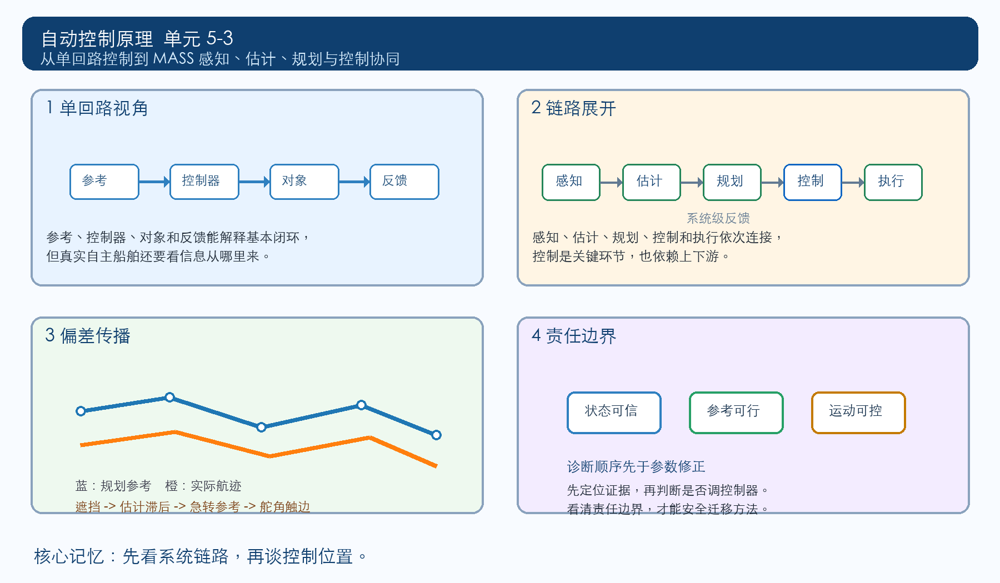

## 一、复杂自主系统把单回路放进更长的责任链

一个普通闭环控制问题通常可以写成参考输入、控制器、被控对象和反馈测量之间的关系。我们把误差 $e(t)=r(t)-y(t)$ 送入控制器 $C(s)$，再由执行器驱动对象，使输出 $y(t)$ 尽量跟随参考 $r(t)$。这套语言适合解释航向保持、平台稳定、速度调节等大量问题。

MASS，即 Maritime Autonomous Surface Ship，通常译为海上自主水面船舶。它面对的问题比单回路控制更长：船舶需要感知周围环境，估计自身与目标状态，理解航道规则和碰撞风险，规划行动意图，再把规划结果转化为舵角、推进和姿态控制指令。控制仍然重要，但它不再独自定义整个系统。

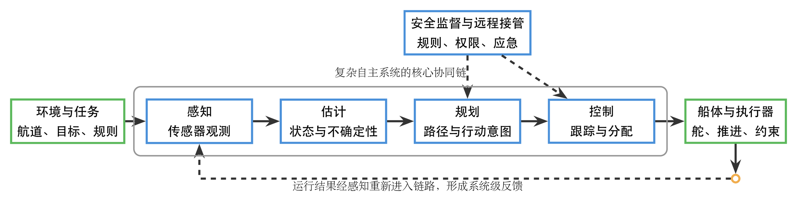{width=100%}

这张链路图把复杂自主系统拆成几个相互依赖的环节。感知回答“系统看到了什么”，估计回答“这些不完整观测对应什么状态”，规划回答“在规则、目标和风险约束下应形成怎样的行动意图”，控制回答“怎样把行动意图转化为可执行、可约束、可反馈的运动”。执行器和船体把控制指令变成真实运动，运行结果又重新进入感知和估计环节。

这里的关键变化是责任边界。若船舶偏离期望轨迹，原因可能来自控制器参数，也可能来自感知遮挡、状态估计漂移、规划路径过急、执行器限幅、环境扰动或安全监督策略。复杂系统中的问题需要沿链路定位，不能只把所有偏差归因给控制器。

## 二、学习目标

学完这一课后，我们应能完成以下工作：

1. 能说明 MASS 中感知、估计、规划、控制和执行之间的基本信息流。
2. 能指出经典单回路控制在复杂自主系统链路中的位置，以及它依赖哪些上游输入和下游约束。
3. 能区分“控制器参数问题”“上游信息质量问题”“规划意图问题”“执行约束问题”和“系统责任边界问题”。
4. 能用链路诊断表分析一个自主航行偏差案例，提出应优先检查的环节。
5. 能解释为什么复杂自主系统不能被简单理解为一个更大的控制器。

## 三、单回路控制仍然承担运动落地任务

经典闭环控制的基本形式仍可写成

$$
e(t)=r(t)-y(t),\qquad u(t)=C(e(t)),\qquad y(t)=P(u(t),d(t)),
$$

其中 $r(t)$ 是参考，$y(t)$ 是输出，$u(t)$ 是控制输入，$P$ 表示对象与执行机构，$d(t)$ 表示扰动。在线性定常近似下，$C(s)$ 与 $P(s)$ 的组合可以给出闭环传递函数，帮助我们判断稳定性、超调、调节时间、稳态误差和裕度。

在 MASS 链路中，这段闭环通常负责“把上游给出的行动意图落实为运动”。规划层可能给出一段参考航迹、期望航向、速度剖面或避碰机动意图；控制层需要把这些意图变成舵、推进、减摇鳍等执行器的指令，并在风浪流、模型误差和执行器限制下维持可接受的跟踪效果。

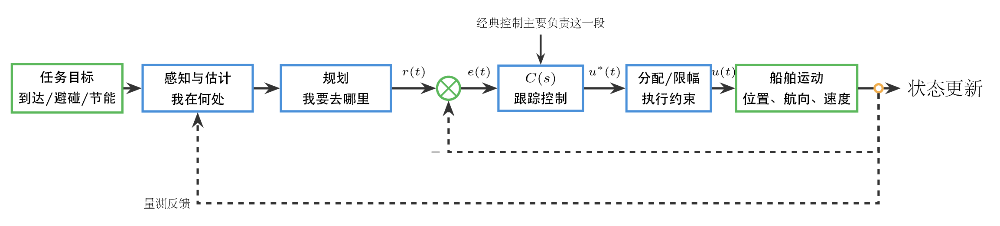{width=100%}

控制层的职责可以概括为三类。第一，跟踪参考，使真实运动接近规划意图。第二，处理局部扰动和模型误差，使运动过程保持稳定。第三，尊重执行器和船体约束，避免把上游意图转化为不可实现的指令。它并不直接决定感知是否完整，也不直接保证规划目标本身合理。

## 四、感知和估计决定控制器看到的对象状态

控制器使用的反馈量并不等于真实世界本身。传感器有噪声、遮挡、延迟、分辨率和失效风险；多源信息融合也会引入时间同步、坐标转换和置信度问题。估计层把原始观测整理成位置、速度、航向、目标距离、障碍物状态和不确定性描述，再把这些状态交给规划和控制。

若估计状态偏移，控制器可能在“错误的对象状态”上工作。例如真实船舶已经受流偏移，但估计层低估了横向速度，控制层得到的误差就会偏小；或者目标船速度估计滞后，规划层给出的避碰路径会过于乐观。此时单独增大控制增益可能让动作更激烈，却不能修正信息源头。

表 1. 上游信息质量对控制判断的影响

| 上游问题 | 控制层接收到的表现 | 可能后果 | 优先检查对象 |
| --- | --- | --- | --- |
| 传感器噪声增大 | 反馈量高频抖动 | 控制指令频繁变化，执行器负担增加 | 量测滤波、传感器健康、采样同步 |
| 目标状态估计滞后 | 参考误差反应过慢 | 避碰动作滞后，轨迹修正不足 | 目标跟踪模型、估计延迟 |
| 环境遮挡或丢帧 | 状态短时缺失 | 规划和控制进入保守模式或保持上一指令 | 感知冗余、置信度阈值、降级策略 |
| 坐标系或时间戳不一致 | 误差方向或大小异常 | 控制方向错误或响应不稳定 | 坐标转换、时间同步、接口协议 |

这类问题的共同点是：控制器数学形式可能没有错，但它收到的输入已经偏离真实状态。复杂自主系统需要把“反馈量是否可信”作为控制判断的一部分。

传感器噪声的影响可以从一条普通闭环链路中直接看出来。对象实际输出 $y(t)$ 可以是相当平滑的曲线；测量环节叠加噪声后，反馈量 $y_m(t)$ 出现高频抖动，误差 $e(t)=r(t)-y_m(t)$ 随之抖动，控制器输出 $u(t)$ 被迫包含高频成分，执行机构也会出现频繁小幅动作。此时学生在控制器输出端看到的是“控制太忙”，但源头可能只是反馈量质量不足。

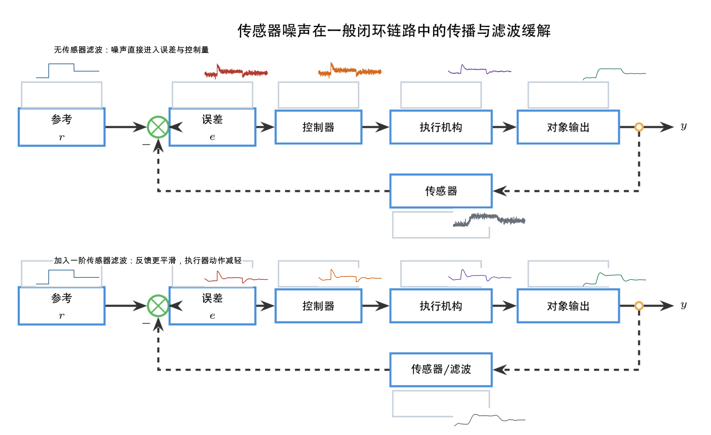{width=100%}

图中的上排没有传感器滤波，噪声从反馈测量进入误差信号，再进入控制器输出，执行机构曲线也出现明显抖动。下排加入一阶滤波后，反馈曲线变平滑，误差信号和控制输出的高频成分降低，执行器动作也随之减轻。滤波并不是免费收益：滤波会引入相位滞后，过强滤波可能降低闭环响应速度。因此诊断时不能简单地把“噪声变小”视为唯一目标，而要同时观察测量平滑度、响应延迟和执行器动作负担。

测量延迟会造成另一类更隐蔽的问题。若航向传感器或融合估计输出滞后，控制器比较的是当前参考航向与“几秒前的测量航向”。控制器仍在认真减小误差，但这个误差已经不是当前船体姿态的真实误差。避障航向变化越快，延迟造成的偏差越明显。为了把这个原因单独看清楚，图中先在无测量延迟的系统上校准控制器，得到理想航向和理想航迹；随后保持控制器参数不变，只把反馈测量换成带延迟的航向测量。

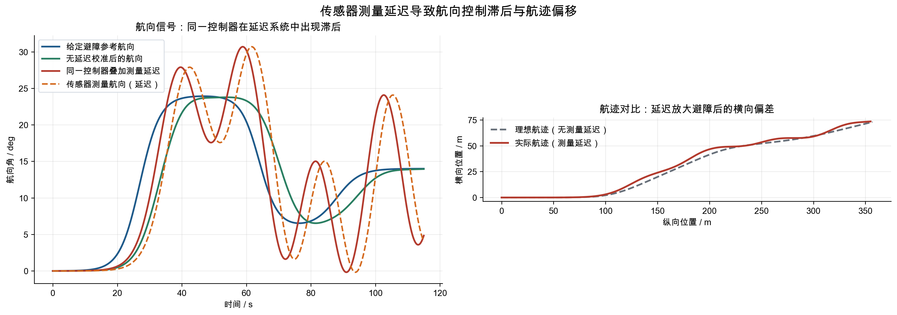{width=100%}

左侧航向曲线显示，同一控制器在无延迟系统中能够较快跟随避障参考；加入测量延迟后，控制器看到的航向落后于真实航向，修正动作也随之滞后。右侧航迹对比中，无延迟的理想航迹能够较快贴近规划意图；测量延迟存在时，实际航迹在避障后留下更大的横向偏差。这类现象若只看末端轨迹，很容易被误判为“控制器增益不够”，但证据链显示主要差异来自反馈测量的时间滞后。

## 五、规划把任务约束翻译为控制参考

规划层面对的对象通常不是一个传递函数，而是带有目标、规则、障碍物、航道、能耗和安全余量的任务空间。它需要在多个候选行动中选择一条路径或一组参考信号。控制层随后跟踪这些参考。

若规划层给出的参考轨迹过急，即使控制器在局部意义上稳定，也可能因为舵角限幅、推进限制、横向加速度约束或安全距离不足而无法完成。若规划层只优化最短路径，控制层可能被迫频繁大幅动作；若规划层过于保守，控制层会得到平滑但效率低的参考。规划质量直接决定控制问题的可实现性。

控制语言可以给规划提供约束反馈。例如最大舵角 $\delta_{\max}$、最大舵角速率 $\dot{\delta}_{\max}$、允许横向加速度、最小转弯半径和跟踪误差上界，都可以转化为规划层的可行域。一个合理的自主系统不应先规划出不可执行的轨迹，再要求控制器“强行跟上”。

“最短路径让控制层频繁大幅动作”的发生机制并不神秘。规划层若只看几何距离，会倾向于用折线、急转或频繁局部绕行缩短航程。控制层拿到的不是几何图形本身，而是从路径切线翻译出来的航向参考 $\psi_d(t)$。折线拐点会变成航向阶跃，锯齿路径会变成频繁正负切换的航向参考。控制器为了减小航向误差，会输出很大的舵角指令；执行机构再把这些指令截断到舵角上限或舵速上限。最终日志中看到的不是“路径短”，而是舵角长期贴边、正负饱和切换、实际航迹滞后于规划航迹。

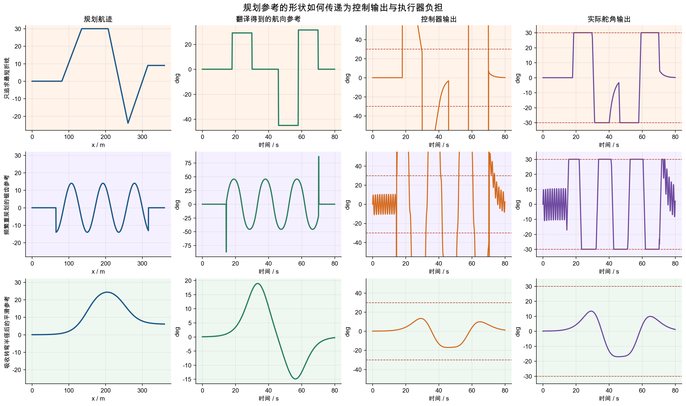{width=100%}

第一行的最短折线路径在几何上直接，但每个折点都翻译成航向参考的突变，控制器输出在拐点处形成大幅尖峰，实际舵角长时间触碰 $\pm 30^\circ$ 边界。第二行的频繁重规划路径看似每次修正都不大，但连续锯齿使航向参考反复摆动，舵角在正负最大值之间切换，执行器负担很重。第三行把转弯半径和路径平滑纳入规划后，航向参考连续变化，控制器输出和实际舵角都留有余量。规划层越早吸收控制可行域，控制层越少被迫用极端动作补救。

## 六、执行约束让控制指令必须经过可实现性检查

执行器把控制信号变成物理动作。舵机、推进器、减摇鳍和动力系统都有幅值、速率、带宽、能耗、热负荷和故障模式。即使上游感知和规划正确，控制层也必须把理想指令 $u^\ast(t)$ 变成实际可执行指令 $u(t)$。

常见约束可以写成

$$
|u(t)|\le u_{\max},\qquad |\dot{u}(t)|\le \dot{u}_{\max}.
$$

这两个不等式已经足以改变闭环表现。若 $u^\ast(t)$ 长时间超过 $u_{\max}$，实际控制量被截断，输出响应会变慢，积分环节可能累积误差；若 $\dot{u}(t)$ 受限，执行器无法按控制器期望快速变化，短时跟踪性能会下降。5-1 和 5-2 中讨论的饱和、死区、速率限制和非线性边界，在 MASS 中仍然存在，只是它们被放进了更长的系统链路。

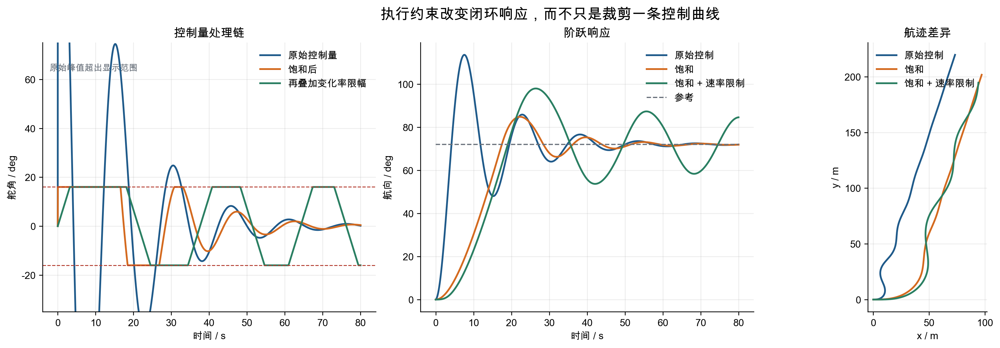{width=100%}

左侧曲线把同一个理想控制量依次经过幅值饱和和变化率限制。这个仿真故意采用较急的航向阶跃，理想舵角会明显超过 $\pm 16^\circ$ 的舵角边界；叠加 $5^\circ/\mathrm{s}$ 的舵速限制后，实际舵角不仅峰值被截断，上升和回落也明显变慢。中间的阶跃响应说明，同一套控制律在执行约束下会表现出不同的响应速度。右侧航迹说明，执行约束不是“控制信号后处理”的细节，它会改变船体真实运动路径。若规划层和诊断层忽略这件事，就会把可实现性不足误读为控制器本身不够强。

## 七、链路责任边界决定故障诊断顺序

复杂自主系统的偏差需要按“信息、意图、控制、执行、监督”分层诊断。若直接从控制器参数开始调整，容易把上游信息错误和任务约束错误误当成闭环性能不足。

表 2. MASS 链路诊断的责任分层

| 诊断层 | 核心问题 | 典型证据 | 可能处理方向 |
| --- | --- | --- | --- |
| 感知层 | 原始环境与目标信息是否可靠 | 丢帧、误检、漏检、噪声异常 | 冗余感知、阈值修正、置信度输出 |
| 估计层 | 状态是否可信并带有不确定性 | 估计滞后、轨迹跳变、协方差异常 | 滤波模型修正、时间同步、异常剔除 |
| 规划层 | 参考是否满足规则和可实现性 | 轨迹过急、安全距离不足、频繁重规划 | 可行域约束、风险代价、路径平滑 |
| 控制层 | 跟踪律是否稳定并具备鲁棒性 | 超调过大、振荡、稳态误差、裕度不足 | 参数修正、结构调整、抗扰设计 |
| 执行层 | 指令是否被物理约束截断 | 饱和、速率限制、能耗过高、故障告警 | 控制分配、限幅处理、执行器健康管理 |
| 监督层 | 系统是否需要降级或接管 | 置信度过低、规则冲突、风险超限 | 安全模式、远程接管、人机协同 |

这张表用于建立诊断顺序。控制层仍然需要承担稳定和跟踪责任，但它只能在上游信息可信、参考可执行、下游执行器可用的条件下发挥作用。

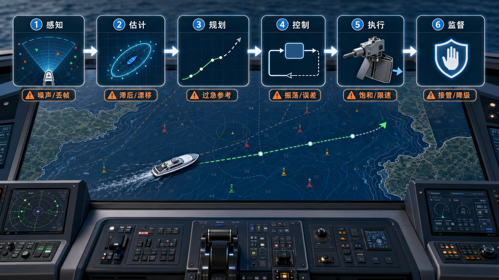{width=100%}

诊断顺序的价值在于减少误修。若日志中同时出现传感器丢帧、估计滞后、规划参考过急和执行器饱和，直接调控制器参数并不能解释全部现象。更可靠的做法是先确认原始观测是否可信，再看估计是否把观测变成了及时状态；随后检查规划参考是否可执行；只有在信息和参考都成立后，控制器稳定性、裕度和参数才成为主要对象。执行和监督层的证据则用于判断问题是否已经超过自动系统可继续运行的边界。

## 八、避碰机动中的链路偏差传播场景

考虑一艘自主水面船在狭窄航道中航行。任务目标是保持计划航线，并在遇到横穿目标船时完成安全避让。单回路航向控制视角会先问：当前航向误差是多少，舵角指令如何让船头转向目标航向。MASS 链路视角会先整理更长的问题链：

1. 感知层是否稳定识别目标船、岸线、浮标和禁航区域。
2. 估计层是否给出目标船速度、相对方位、碰撞风险和置信度。
3. 规划层是否生成满足规则、安全距离、操纵能力和任务效率的避碰路径。
4. 控制层是否能让船舶按参考航迹转向并抑制风浪流扰动。
5. 执行层是否有足够舵角、舵速和推进余量完成机动。

若目标船被短时遮挡，估计层可能低估碰撞风险，规划层给出的避让轨迹就会偏晚；控制器随后收到一个较急的参考转向，舵机又可能因为速率限制无法立即跟上。最终轨迹偏差看起来像“航向控制不够快”，但真正的责任链包含感知置信度、估计滞后、规划可行性和执行器余量。

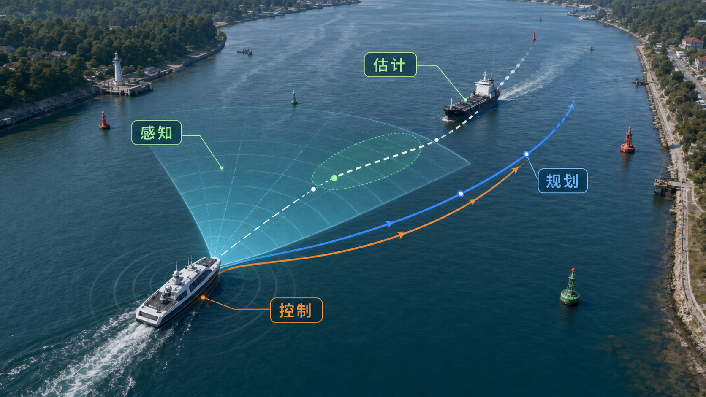{width=100%}

这张场景图把同一个避碰过程放在一张海图上阅读。感知扇区给出目标船和航道环境，估计层把目标船未来位置表示成预测轨迹，规划层给出避让路径，控制层把路径转化为实际船舶运动。蓝色规划路径和橙色实际航迹之间的间隔，就是链路中延迟、约束和控制误差共同留下的结果。诊断时不能只问“橙色航迹为什么没有贴住蓝线”，还要追问蓝线是否来得太晚、转得太急、是否已经超出舵角和舵速能力。

## 九、避碰转向过急的链路定位分析

设自主船以 $v=4\ \mathrm{m/s}$ 沿直航线接近障碍物，障碍物等效半径为 $r_o=25\ \mathrm{m}$。规划层不是直接指定“马上转弯”，而是先假定船舶能够按某个转弯半径 $R$ 完成避障，再加上安全裕量 $m=16\ \mathrm{m}$，计算距离障碍物多远时必须开始避障。这里的关键并不是哪条路径更短，而是规划层估计的转弯能力是否真实可实现。

若船舶从直航线切入圆弧避障，为了让圆弧外缘避开障碍物与裕量，可用近似关系估计启动距离

$$
d_{\mathrm{start}}\approx \sqrt{(r_o+m)(2R+r_o+m)}.
$$

代入 $r_o+m=41\ \mathrm{m}$，三个策略对应

$$
\begin{aligned}
R=35\ \mathrm{m}:&\quad d_{\mathrm{start}}\approx 67.5\ \mathrm{m},\\
R=65\ \mathrm{m}:&\quad d_{\mathrm{start}}\approx 83.7\ \mathrm{m},\\
R=140\ \mathrm{m}:&\quad d_{\mathrm{start}}\approx 114.7\ \mathrm{m}.
\end{aligned}
$$

这个距离会直接决定避障动作何时开始。若规划层相信船舶能以很小半径转弯，它就会让船舶更晚进入避障；若半径较大，启动圈自然更大，避障开始得更早。

控制层真正要实现的是对应舵角。用简化自行车模型近似船舶平面转向，若等效船长取 $L=34\ \mathrm{m}$，半径 $R$ 对应的名义舵角为

$$
\delta_d \approx \arctan\frac{L}{R},
$$

因此

$$
\begin{aligned}
R=35\ \mathrm{m}:&\quad \delta_d\approx 44.2^\circ,\\
R=65\ \mathrm{m}:&\quad \delta_d\approx 27.6^\circ,\\
R=140\ \mathrm{m}:&\quad \delta_d\approx 13.7^\circ.
\end{aligned}
$$

若该船在当前航速、载荷和海况下的舵角边界为 $18^\circ$，则 $R=35\ \mathrm{m}$ 和 $R=65\ \mathrm{m}$ 对应的规划参考已经超过控制和执行的可行域；$R=140\ \mathrm{m}$ 才给舵角留出余量。问题的危险之处在于：$R=35\ \mathrm{m}$ 不仅要求了不可实现的急转，还把启动距离压到 $67.5\ \mathrm{m}$。船舶进入启动圈后即使舵角贴着上限，实际转弯半径也比规划层假定的大，横向位移来得太晚，可能直接撞上障碍物。此时合理的诊断结论应写为“规划参考没有吸收控制与执行约束，并因此低估了最小避障启动距离”。

这个判断可以按四步展开。

第一步，检查上游输入。感知层已经识别目标船，估计层也给出了目标船相对速度和位置；没有证据表明目标状态完全错误。

第二步，检查规划参考。每一种策略都先按自身估计的 $R$ 计算启动圈，船舶进入同色虚线圆后才开始避障。半径越小，启动圈越靠近障碍物；若这个小半径又不可实现，系统就会在过近的位置才发现自己转不过去。

第三步，检查控制与执行。由 $\delta_d\approx \arctan(L/R)$ 可知，$R=35\ \mathrm{m}$ 和 $R=65\ \mathrm{m}$ 的名义舵角分别约为 $44.2^\circ$ 和 $27.6^\circ$，都超过 $18^\circ$ 的执行边界。控制器强行跟踪时，舵角会被饱和截断，响应曲线表现为转向滞后、横向偏差增大和后续修正动作变大。

第四步，形成链路修正。规划层应把最小转弯半径、最大艏向角速度、舵角限幅和安全距离一起纳入可行域。若只从舵角限幅出发，最小可实现转弯半径近似为

$$
R_{\min}\approx \frac{L}{\tan\delta_{\max}}
=\frac{34}{\tan 18^\circ}
\approx 105\ \mathrm{m}.
$$

这个结果说明，控制层给出的物理能力边界需要回流到规划层。复杂自主系统中的控制不只是末端执行，它也向上游提供可行性约束；若还要留出安全余量，实际规划半径通常应大于这个理论下限。

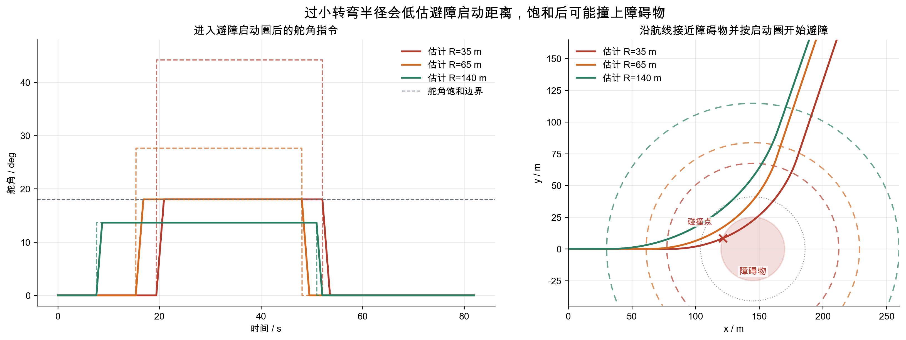{width=100%}

仿真图把半径 $R=35\ \mathrm{m}$、$65\ \mathrm{m}$ 和 $140\ \mathrm{m}$ 的三种启动策略放在同一航线、同一障碍物和同一执行器边界下比较。右图中同色虚线圆表示该策略按估计半径算出的启动圈，船舶一旦进入该圆就开始避障。$R=35\ \mathrm{m}$ 的启动圈最近，舵角又被 $18^\circ$ 饱和截断，实际转弯半径变大，航迹在来不及形成足够横向位移时撞上障碍物；$R=65\ \mathrm{m}$ 虽然舵角仍有饱和，但启动更早，结果贴近风险边界；$R=140\ \mathrm{m}$ 的舵角留有余量，启动圈更大，能够按预期避开障碍物。这组曲线说明，转弯半径不是规划层的纯几何参数，它同时决定避障动作的开始时刻和控制执行层是否会贴着边界工作。

## 十、MASS 自动化等级与责任边界案例

国际海事组织在 MASS 监管讨论中使用过四类自动化程度：带自动化过程和决策支持的船舶、船上有人但由远程位置控制的船舶、船上无人且由远程位置控制的船舶、能够自行决策并采取行动的全自主船舶。这个划分有助于理解运行形态和责任主体，但它不能替代工程链路分析。

同一自动化等级下，感知、估计、规划、控制和执行仍可能有不同实现方式。一个远程控制系统可能拥有强大的感知与估计，但规划决策主要由岸基人员完成；一个高度自动化系统可能在航迹规划中使用复杂算法，但底层运动控制仍采用经典反馈控制。我们阅读 MASS 系统时，应同时看自动化等级、责任主体和技术链路。

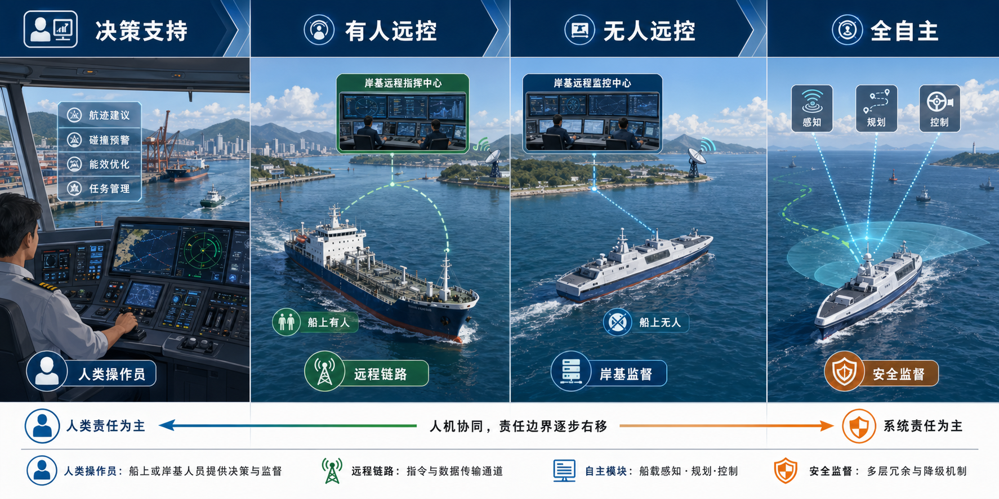{width=100%}

四类自动化程度的差异，首先体现在责任主体和决策位置。决策支持场景中，船上人员仍是主要责任主体，自动化系统提供建议、预警和优化信息；有人远控场景中，船上仍有人，但控制链路引入岸基指挥和远程通信；无人远控场景中，船舶现场人员退出，岸基监控和远程链路成为关键边界；全自主场景中，船载系统需要在感知、估计、规划、控制和监督之间形成更完整的闭环。自动化等级越高，越不能只检查底层控制性能，必须同时检查链路证据、责任边界和降级机制。

截至 2026 年 4 月 30 日，IMO 公开资料显示 MASS Code 仍处在路线图推进中：非强制性 MASS Code 计划在 2026 年 5 月完成和通过，强制性 Code 计划最迟于 2030 年 7 月 1 日通过，并于 2032 年 1 月 1 日生效。这类监管进展提示我们，MASS 同时涉及安全、责任、人员、网络风险和国际规则。

## 十一、链路阅读的最小方法

面对一套复杂自主系统，我们可以按五个问题阅读。

1. 任务目标是什么：到达、避碰、节能、舒适、准时或安全冗余。
2. 状态从哪里来：传感器、融合估计、远程输入和外部通信是否可信。
3. 参考怎样生成：规划层是否把规则、风险和可执行性纳入约束。
4. 控制怎样落地：闭环是否稳定，是否有足够裕度，是否能处理局部扰动。
5. 责任怎样分界：自动系统、远程人员、船上人员和安全监督逻辑各自承担哪段决策。

这五个问题构成一条最小诊断路径。若偏差来自上游状态错误，先修正感知和估计；若来自参考不可实现，先修正规划约束；若来自闭环振荡，再回到控制结构、参数和裕度；若来自执行饱和，控制分配和执行器健康管理要优先进入分析；若风险超过自动系统可信范围，监督层应触发降级或接管。

## 十二、分层练习

### 练习 1：链路角色识别

给出以下五个动作，判断它们分别属于感知、估计、规划、控制、执行或监督中的哪一类，并说明理由。

1. 雷达和视觉系统识别前方目标船轮廓。
2. 算法根据多帧观测估计目标船速度。
3. 系统生成一条绕开目标船并保持安全距离的航迹。
4. 控制器把期望航向转化为舵角指令。
5. 风险评分超过阈值后，远程操作者接管。

### 练习 2：链路故障定位

一艘自主船在避让时出现轨迹偏差。日志显示：感知目标存在 2 秒丢帧，估计层在丢帧后保持上一速度值，规划层随后给出急转参考，控制器输出舵角达到上限。请按链路顺序写出至少三个可能原因，并给出优先检查顺序。

### 练习 3：可行性约束计算

某船以 $v=3\ \mathrm{m/s}$ 航行，当前控制与执行能力允许的最大艏向角速度为 $2^\circ/\mathrm{s}$。规划层给出半径 $R=70\ \mathrm{m}$ 的转弯路径。

1. 计算该路径要求的期望艏向角速度 $\dot{\psi}_d$。
2. 判断该参考是否在可实现范围内。
3. 若不可实现，计算当前速度下的最小合理转弯半径。
4. 写出这项计算应反馈给规划层还是控制层，并说明原因。

## 十三、本节小结

MASS 把经典控制问题放进更长的系统链路中。感知提供原始信息，估计形成可用状态，规划生成行动意图，控制把意图落到执行器和船体运动，监督层处理安全边界和接管问题。控制仍然承担稳定、跟踪和抗扰职责，但它依赖上游信息质量，也受下游执行约束限制。

复杂自主系统的分析重点是链路责任判断。出现偏差时，应先沿感知、估计、规划、控制、执行和监督逐层定位，再决定是否调整控制器。若参考不可执行、状态不可信或执行器触边，单纯提高控制增益通常会扩大风险。控制工程师在 MASS 场景中的价值，不只是设计一个更强的控制器，还包括把控制可行域、稳定裕度和执行边界清楚地反馈给系统链路。

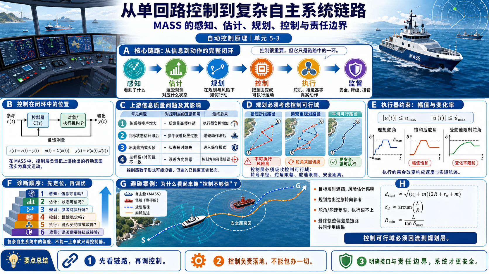

## 参考资料

- International Maritime Organization. [Autonomous shipping](https://www.imo.org/en/MediaCentre/HotTopics/Pages/Autonomous-shipping.aspx).
