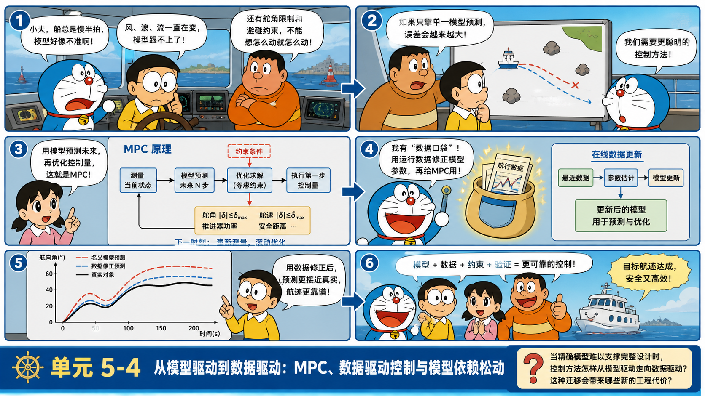
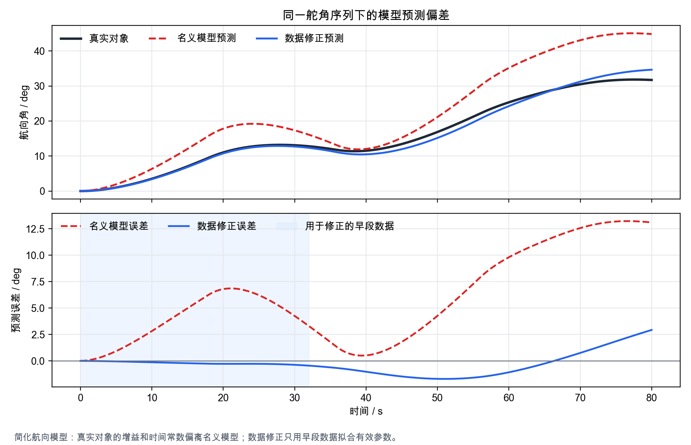
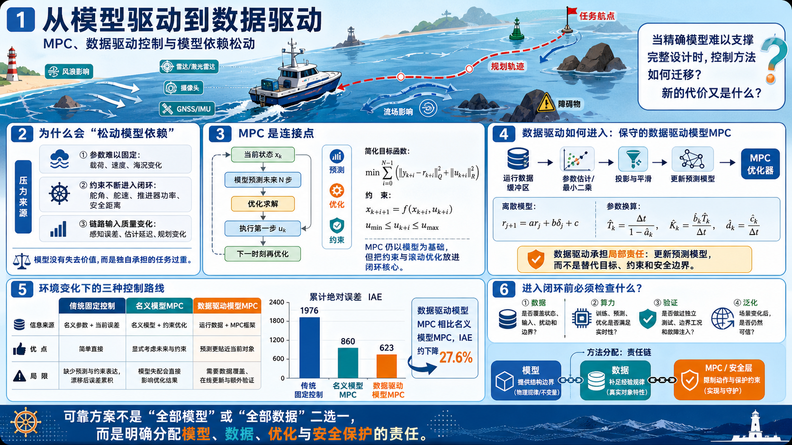

# 单元 5-4 | 从模型驱动到数据驱动：MPC、数据驱动控制与模型依赖松动

**课程**：自动控制原理
**课型**：理论
**学时**：90分钟
**知识类型**：[X] 跨域型
**前置**：已掌握控制目标、约束表达、优化设计语言，并能阅读复杂自主系统中的感知、估计、规划与控制链路。
**讲义定位**：这份讲义帮助我们判断精确模型难以支撑完整设计时，控制方法怎样从模型驱动走向数据驱动，以及这种迁移会带来哪些新的工程代价。
**后续**：策略学习会继续讨论显式控制器结构难以预先写出时的方法选择。

## 本次课程目标

完成本次课程后，学习者能够：

1. 解释模型驱动控制依赖对象关系、参数可信度和约束表达的原因。
2. 比较传统固定控制、名义模型 MPC 与数据驱动模型 MPC 在预测、优化和约束处理上的差异。
3. 判断数据驱动方法进入闭环前必须满足的数据、算力、验证和泛化条件。
4. 评估复杂自主航行任务中哪些关系应继续由模型承担，哪些关系可以由数据补足。

## 一、模型依赖松动来自对象关系的压力

一艘具备自主航行能力的船舶在近岸航道中保持航迹。控制器要让船按期望航线前进，还要避开临时障碍、补偿风浪流扰动、满足舵角和推进器约束，并在传感器噪声和通信延迟存在时保持动作可解释。若只看单回路控制，问题似乎仍可写成“给定参考输入，输出跟踪目标”。进入复杂自主系统链路后，控制器面对的对象已经不再只是一条稳定的传递函数。

### 1.1 模型驱动控制的优势来自可解释关系

模型驱动控制把对象的动态关系先写清楚，再根据这个关系分析稳定性、性能和约束。离散时间形式常写为

$$
x_{k+1}=f(x_k,u_k,p_k), \qquad y_k=h(x_k,u_k)
$$

其中，$x_k$ 表示状态，$u_k$ 表示控制输入，$y_k$ 表示输出，$p_k$ 表示影响对象行为的参数或外部条件。若 $f(\cdot)$ 和 $h(\cdot)$ 的结构可信，我们就能解释“输入怎样改变状态”“状态怎样形成输出”“参数变化怎样改变响应”。

在经典线性主干中，模型常进一步化为传递函数、状态空间模型或频域特性。它们的共同优势是逻辑清楚：稳定性可以由极点、特征值或频域裕度判断；性能可以由时域指标、根轨迹或频域曲线读出；校正和优化可以围绕明确的结构进行。这样的设计过程把工程判断建立在可追溯的对象关系上。

### 1.2 模型压力来自参数、约束和链路输入

模型驱动方法的限制也来自同一个前提。若模型只在小范围内有效，设计结论也只能在相同范围内可靠。若对象存在强非线性、工况频繁切换、上游信息质量波动或执行约束频繁触碰，单一模型就会面临三类压力。

表 1. 单一模型在复杂链路中的典型压力

| 压力来源 | 表现 | 设计风险 |
| --- | --- | --- |
| 参数难以固定 | 同一控制律在不同载荷、速度或海况下表现差异明显 | 设计点附近有效，迁移到其他工况后性能下降 |
| 约束不断进入闭环 | 舵角、舵速、推进器功率或安全距离约束反复生效 | 无约束设计给出的控制动作不可执行 |
| 链路输入质量变化 | 感知误差、估计延迟和规划调整改变控制参考 | 控制器修正的对象不再等同于设计时的对象 |

方法迁移通常源于模型独自承担的任务过重，而非模型失去价值。我们需要判断哪些部分仍应由模型提供结构解释，哪些部分可以由数据补足经验规律，哪些结论必须通过额外验证才能进入工程部署。

### 1.3 辨析例子：名义航向模型预测偏快

考虑一个简化航向对象。名义模型使用增益 $K_m=0.18$、时间常数 $T_m=8.0\ \mathrm{s}$，真实对象因载荷和水域条件变化，等效增益降为 $K_a=0.125$、时间常数增至 $T_a=11.5\ \mathrm{s}$。同一舵角序列输入后，名义模型会预测船舶更快转向，真实对象转向较慢。若控制器把名义预测当成真实结果，就会低估后续航向误差。

{width=100%}

这张仿真图中，红色虚线是名义模型预测，黑色曲线是真实对象。红色曲线在后段明显高于真实对象，最大预测误差约为 $13.23^\circ$。这说明模型本身并没有失去解释价值，但名义参数已经不足以支撑当前工况的预测。蓝色曲线用早段运行数据修正了有效参数，最大误差降至约 $2.93^\circ$；它改善了预测，却也暴露出新的问题：数据只来自早段工况，后段能否继续可信还需要验证。

## 二、MPC 连接模型、预测和约束

### 2.1 MPC 仍以模型为预测基础

MPC，即模型预测控制，仍属于模型驱动方法。它在每一个采样时刻利用对象模型预测未来一段时间内的状态和输出，再求解一个带约束的优化问题，只执行当前时刻的第一步控制动作。到下一个采样时刻，系统重新测量状态，重新预测，重新优化。

一个简化的 MPC 目标函数可写为

$$
\min_{u_0,\ldots,u_{N-1}}
\sum_{i=0}^{N-1}\left(
\|y_{k+i}-r_{k+i}\|_Q^2+\|u_{k+i}\|_R^2
\right)
$$

同时满足

$$
x_{k+i+1}=f(x_{k+i},u_{k+i}),\quad
u_{\min}\le u_{k+i}\le u_{\max},\quad
y_{\min}\le y_{k+i}\le y_{\max}
$$

这里的 $N$ 是预测时域，$r_{k+i}$ 是参考轨迹，$Q$ 和 $R$ 分别衡量跟踪误差和控制代价。MPC 的核心在于三件事同时出现：模型预测未来，优化权衡目标，约束限制动作。

### 2.2 MPC 的难点集中在模型质量和在线计算

MPC 在方法迁移链中的位置很关键。它没有放弃模型，却已经明显不同于只靠单个传递函数和固定参数整定的控制设计。MPC 要求模型能在预测窗口内给出可用结果，也要求计算平台能在每个采样周期内完成优化求解。对象越复杂、约束越多、场景越多变，MPC 对模型质量和在线计算的要求越高。

这也是它连接数据驱动方法的原因。若模型结构仍可信，但参数会随工况变化，可以利用数据在线修正模型参数；若一部分动态难以写成解析形式，可以利用数据学习局部近似模型；若复杂环境中的扰动模式反复出现，可以利用数据补充预测模型。此时，数据没有取消控制目标、约束和验证，它只是开始承担模型中难以人工精确表达的部分。

### 2.3 辨析例子：预测窗口里的舵角约束

仍以前述航向对象为例，设当前控制任务要求未来 $20\ \mathrm{s}$ 内把航向角增加 $18^\circ$，舵角限制为 $|\delta|\le 12^\circ$。若名义模型预测船舶响应较快，MPC 可能认为中等舵角就足以完成转向；真实对象响应较慢时，同样的舵角序列会留下更大的航向偏差。若优化器为了消除偏差继续增大舵角，又会触碰约束边界。

这个例子把 MPC 的双重依赖说清楚。第一，它需要模型预测未来，模型偏差会直接改变优化结果。第二，它需要在线求解带约束优化问题，约束越多、预测窗口越长，计算负担越重。MPC 同时要求模型质量、约束表达和实时计算成立，单独满足其中一项都不足以支撑可靠闭环。

## 三、数据驱动控制改变信息来源和责任分配

### 3.1 数据驱动的核心变化是从样本中补足对象规律

数据驱动控制把运行记录、实验样本、仿真轨迹或在线反馈作为重要设计依据。它允许一部分对象关系由数据估计出来，不要求全部关系都先写成完整解析模型。常见形式包括数据驱动建模、基于数据的预测控制、行为系统方法、迭代学习控制和基于学习器的控制补偿等。

理解数据驱动控制时，核心是抓住信息来源的变化，方法名称只作为后续分类入口。

表 2. 模型驱动与数据驱动的责任差异

| 比较维度 | 模型驱动 | 数据驱动 |
| --- | --- | --- |
| 主要依据 | 物理关系、结构方程、传递函数、状态空间模型 | 实验数据、运行数据、仿真数据、在线反馈 |
| 解释路径 | 从对象机理推导性能和稳定性 | 从样本规律推断可用动作或预测关系 |
| 优势 | 可解释性强，边界清楚，便于稳定性和鲁棒性分析 | 能吸收复杂对象和复杂环境中的经验规律 |
| 代价 | 建模成本高，模型失配会削弱设计可靠性 | 数据质量、覆盖范围、泛化和验证成本更高 |
| 风险 | 过度相信简化模型 | 过度相信样本规律 |

数据驱动的“驱动”不等于凭数据自动生成正确控制器。控制问题仍然要回答目标、约束、稳定性、可解释性和部署责任。若数据只能覆盖正常工况，却没有覆盖极端扰动和执行器边界，学习到的规律可能在关键时刻失效。若数据来自仿真环境，却没有经过真实对象校准，仿真偏差会被控制器当成真实规律。

### 3.2 数据可以补足模型，但会带来验证成本

在航向仿真中，蓝色曲线用早段数据修正有效模型参数，预测误差明显低于名义模型。这个结果可以支持一个谨慎结论：当物理结构仍然可信、参数偏差成为主要误差来源时，数据可以帮助模型重新贴近对象。它不能支持一个过度结论：只要有早段数据，后段运行就一定安全。

数据修正后的模型仍需回答三个问题。第一，早段数据是否覆盖了后续会出现的舵角幅值、航速和扰动范围。第二，拟合误差降低是否同时保持了稳定性、约束满足和可解释性。第三，若对象继续变化，系统是否能识别修正模型已经过期。数据驱动方法把一部分建模成本转移到数据采集、覆盖性检查和运行时监控上。

### 3.3 辨析例子：数据补偿适合承担局部责任

假设一套航向控制系统已有可信的船舶运动模型和舵角约束。工程日志显示，在顺流和逆流切换时，模型对短时横向偏移预测不足，但主体航向动态仍然正确。此时更稳妥的做法是让数据模块预测扰动补偿量，外层控制仍保留物理模型、舵角限制和安全检查。

若把整个控制律都交给一个学习器，问题会变得更难验证：学习器何时输出大舵角、为何在某个场景下保守、是否会在少见水域条件下失效，都需要新的证据。相反，局部扰动补偿把数据驱动放在责任明确的位置，既利用数据吸收复杂环境规律，又保留可解释的控制边界。

## 四、数据驱动进入条件与复杂航行案例

### 4.1 四个条件决定数据驱动能否进入闭环

数据驱动方法适合处理模型难以完整写出、但数据能够稳定反映对象规律的场景。进入这条路径前，需要同时检查数据、算力、验证和泛化四个条件。

表 3. 数据驱动控制进入闭环前的条件检查

| 条件 | 需要回答的问题 | 缺失后的风险 |
| --- | --- | --- |
| 数据条件 | 数据是否覆盖状态、输入、扰动和约束边界 | 控制器只学到温和工况，在关键边界处失效 |
| 算力条件 | 训练、预测、优化和监控是否满足实时性 | 控制动作滞后，在线优化无法按采样周期完成 |
| 验证条件 | 是否经过独立测试、边界工况和故障注入 | 训练集表现良好，闭环部署风险未知 |
| 泛化条件 | 未见过但合理可能出现的场景是否被评估 | 场景稍变，样本规律不再可靠 |

这四个条件共同决定数据驱动方法能否进入闭环。数据条件解决“学什么”，算力条件解决“能否算得出来”，验证条件解决“证据是否足够”，泛化条件解决“换一个相邻场景是否仍可信”。

### 4.2 辨析例子：四个条件缺一项时的误判

某自主船在固定航道中积累了大量晴天低流速运行数据。数据量看起来很大，模型修正后的预测误差也很小。若把这套修正模型直接部署到强横流、低能见度和拥挤水域，风险会迅速暴露：数据条件没有覆盖强扰动，验证条件没有包含传感器异常，泛化条件没有评估不同航道密度，算力条件也可能因障碍物数量增加而发生变化。

这个例子说明，“数据多”只是入口条件的一部分。数据是否覆盖关键边界，比样本总量更重要；训练误差是否下降，也不能替代闭环验证。数据驱动方法的进入条件应写成工程检查表，而不能写成“已有历史数据，可以开始使用”。

### 4.3 复杂航行任务中的数据驱动进入点

考虑一艘自主船舶在近岸航道中执行航迹保持与避碰协同任务。船舶需要沿规划航线前进，保持与障碍物、岸线和其他船舶的安全距离，同时限制舵角、舵速、推进器功率和乘坐舒适性。上游感知系统提供目标位置和障碍物估计，规划模块给出期望航迹，控制模块把航迹转化为可执行动作。

这个场景中，模型驱动方法仍然可以承担基础角色。船舶低速操纵模型、舵机约束、执行器饱和和航向误差动态都能提供清晰的控制结构。若运行区域相对固定、扰动较弱、对象参数经过充分辨识，传统模型驱动控制或带约束的 MPC 可以形成可解释的设计路径。

数据驱动方法的进入点出现在模型难以完整覆盖的部分。例如，风浪流扰动与船体响应之间的关系可能随航速、载荷和水域条件变化；感知误差可能在拥挤水域呈现非均匀分布；规划模块输出的参考轨迹可能在避碰时频繁改变曲率和速度约束。此时，可以考虑用数据补充扰动预测、模型参数更新、短时轨迹误差估计或控制补偿。

分析这个案例时，重点在于先建立判断表：哪些关系仍由模型可靠描述，哪些关系需要数据补足，数据是否覆盖关键边界，验证能否证明闭环动作满足安全约束。只有这些条件能被清楚回答，数据驱动才成为有依据的方法迁移。

## 五、环境变化下的三种控制路线对比

### 5.1 案例任务与对比对象

考虑一艘自主船舶在近岸航道中执行航向保持与避碰调整。控制模块接收规划模块给出的参考航向，执行器舵角限制为 $|\delta|\le 12^\circ$。系统开始时使用名义航向模型

$$
G_m(s)=\frac{K_m}{T_m s+1},\qquad K_m=0.18,\quad T_m=8.0\ \mathrm{s}
$$

运行一段时间后，载荷和水域条件变化使实际对象逐渐漂移到更慢、更弱的有效模型附近：

$$
K_a:0.18\rightarrow0.065,\qquad T_a:8.0\ \mathrm{s}\rightarrow18.0\ \mathrm{s}
$$

同时，横流扰动从 $t=34\ \mathrm{s}$ 附近进入，规划模块在 $t=36\ \mathrm{s}$ 给出避碰航向调整，在 $t=58\ \mathrm{s}$ 给出航迹恢复指令。这个任务同时包含模型漂移、环境扰动和参考航向变化，适合检验“只靠旧模型”和“带数据修正模型”的差异。

我们比较三种路线。

表 4. 三种控制路线的建模与控制信息

| 路线 | 控制方式 | 使用的模型与信息 | 主要局限 |
| --- | --- | --- | --- |
| 传统固定控制 | 基于名义模型整定的固定 PI/PID 航向控制 | 只使用名义参数和当前误差 | 不能显式处理预测窗口和约束，模型漂移后误差累积明显 |
| 名义模型 MPC | 滚动预测并显式限制舵角 | 使用名义模型预测未来 | 约束处理更清楚，但预测仍按旧对象进行 |
| 数据驱动模型 MPC | 在同一 MPC 框架中使用运行数据修正有效模型 | 使用当前数据估计有效增益、时间常数和扰动偏置 | 改善预测依赖，但需要数据覆盖、在线更新和额外验证 |

这个比较的关键在于观察当对象和环境都在变化时，控制方法的哪一部分开始暴露边界，而不把某个方法写成永远最优的答案。

### 5.2 仿真结果与指标比较

\begin{figure}[H]
\centering
\includegraphics[width=\textwidth]{../media/processed/5-4-mpc-drift-comparison.png}
\caption{模型漂移与环境信息变化下的闭环航向跟踪}
\end{figure}

图中红色曲线是传统固定控制，黄色曲线是使用名义模型的 MPC，蓝色曲线是使用数据驱动模型的 MPC。黄色阴影表示对象参数逐渐漂移，紫色虚线表示避碰航向调整，绿色虚线表示航迹恢复。

Table: 三种路线的闭环指标 {cols=0.16,0.17,0.20,0.16,0.15,0.16}

| 路线 | 最大绝对误差 | 累计绝对误差 IAE | 平均绝对误差 | 舵角触边比例 | 环境变化后平均绝对误差 |
| --- | ---: | ---: | ---: | ---: | ---: |
| 传统固定控制 | $22.40^\circ$ | $664.20\ \mathrm{deg\cdot s}$ | $8.28^\circ$ | $28.68\%$ | $10.95^\circ$ |
| 名义模型 MPC | $13.61^\circ$ | $381.51\ \mathrm{deg\cdot s}$ | $4.76^\circ$ | $33.17\%$ | $6.43^\circ$ |
| 数据驱动模型 MPC | $13.79^\circ$ | $372.55\ \mathrm{deg\cdot s}$ | $4.65^\circ$ | $43.89\%$ | $6.22^\circ$ |

传统固定控制在第一次航向变化后出现明显滞后，模型漂移和环境扰动进入后误差继续积累。它不是完全失效，但它对“未来会怎样”和“舵角约束是否会限制修正动作”没有显式表达，因此在复杂链路中很快暴露出控制边界。

名义模型 MPC 明显降低了累计绝对误差，说明滚动预测和约束表达本身有价值。它的局限也很清楚：预测模型仍停留在 $K_m=0.18,T_m=8.0\ \mathrm{s}$，当真实对象变慢、舵效降低并受到横流扰动时，优化器会低估后续误差和所需舵角。MPC 改善了“是否考虑约束”的问题，但没有自动解决“预测对象是否仍可信”的问题。

数据驱动模型 MPC 的累计绝对误差和环境变化后平均误差继续下降，说明运行数据修正有效模型后，MPC 的预测更贴近当前对象。它也付出了新的代价：舵角触边比例升高，说明修正后的模型更早看见控制需求，却也更频繁把动作推到约束边界附近。这个结果比“数据驱动更先进”更重要：数据驱动能缓解模型依赖，但会把风险转移到数据覆盖、在线辨识、约束监控和部署验证上。

### 5.3 从仿真比较得到的判断

这组仿真支持三个判断。第一，传统固定控制在模型漂移和环境信息变化下缺少预测和约束表达，误差累积较大。第二，名义模型 MPC 可以显式处理舵角约束，性能显著好于固定控制，但它仍依赖名义模型，预测对象失真后仍会产生残余误差。第三，数据驱动模型 MPC 把当前运行数据引入预测模型，能进一步降低累计误差，却不能取消工程验证；它需要证明数据覆盖了关键工况，在线更新没有引入不稳定动作，约束触边不会发展成新的安全风险。

因此，数据驱动进入闭环的合理位置，是在模型主干、MPC 约束和安全保护仍然保留的基础上，修正那些随环境变化而漂移的有效模型关系，而非替代所有控制设计。

## 六、复杂航行任务的数据驱动方法选择

近岸航迹保持与避碰协同任务可以分成四类关系。第一类是船体运动与执行器动作之间的动力学关系，通常仍需要模型提供解释。第二类是舵角、舵速、推进器功率和安全距离等硬约束，必须以显式规则进入优化或保护层。第三类是风浪流、拥挤水域感知误差和短时轨迹偏差，这些关系可能难以完全解析，却能从运行数据中估计。第四类是规划模块给出的参考轨迹变化，它不只是控制误差，还反映上游任务重排。

把这四类关系混在一起，会造成方法误判。看到模型失配就整体切换到数据驱动，会丢失可解释性和安全边界；看到数据存在噪声就拒绝数据修正，会让模型长期停留在过期参数上。更合理的路径是先分配责任，再决定方法。

表 6. 复杂航行任务中的方法分配

| 关系对象 | 优先方法 | 数据驱动的合理作用 |
| --- | --- | --- |
| 船体低速操纵动态 | 模型驱动 | 用数据更新参数或残差项 |
| 舵角、舵速、功率约束 | MPC / 约束优化 | 用数据估计约束触碰概率，但不能替代约束本身 |
| 风浪流扰动 | 模型 + 数据补偿 | 从历史和在线数据预测短时扰动趋势 |
| 感知误差分布 | 数据统计与监控 | 估计不同水域密度下的误差范围 |
| 避碰参考轨迹变化 | 规划与控制协同 | 用数据评估轨迹变化对控制负担的影响 |

这个分配表把“数据驱动”放回工程责任链中。模型负责提供结构边界，数据负责补足难写清的经验规律，MPC 或安全层负责把动作限制在可执行范围内。三者在同一个闭环中承担不同证据责任。

若任务只要求平稳航迹保持，环境变化较小，模型驱动控制或 MPC 通常仍是优先路径。若对象参数缓慢漂移、扰动有可学习规律、历史数据覆盖主要边界，可以引入数据修正或数据补偿。若显式模型难以覆盖决策层动作，问题才会继续走向策略学习，但那已经需要额外讨论样本代价、可解释性和安全验证。

## 七、分层练习

### 7.1 基础辨析：模型驱动与数据驱动

某系统已有稳定的二阶模型，闭环性能在实验室中满足指标，但现场运行时负载经常变化，导致调节时间波动明显。请判断下列三种做法的合理性，并说明理由。

1. 完全保留原模型，不使用现场数据。
2. 用现场数据更新模型参数，再保留原控制结构和安全限制。
3. 直接用现场数据训练黑箱控制器，替代原控制器。

参考思路：第一种做法忽略工况变化，容易让设计停留在旧参数上；第二种做法更符合“模型主干 + 数据修正”的责任分配；第三种做法需要新的稳定性、约束和安全验证证据，不能仅凭现场数据存在就采用。

### 7.2 定量判断：预测误差改善是否足够

某数据修正模型把最大预测误差从 $9.6^\circ$ 降到 $4.8^\circ$。请计算误差降低比例，并说明这个结果还缺少哪些闭环证据。

参考思路：误差降低比例为

$$
\frac{9.6-4.8}{9.6}\times100\%=50\%
$$

预测改善明显，但还需要检查数据覆盖范围、闭环稳定性、约束满足、极端扰动表现和模型过期识别机制。

### 7.3 方法迁移判断：MPC 是否适合

某航向控制任务具有清晰的船体模型和舵角约束，采样周期为 $0.2\ \mathrm{s}$，预测窗口较短，在线求解能在 $0.05\ \mathrm{s}$ 内完成。另一任务的模型结构不清晰，障碍物数量频繁变化，优化求解时间经常超过采样周期。请比较两者引入 MPC 的条件。

参考思路：前者具备模型、约束和实时计算条件，MPC 有较清晰的进入基础；后者缺少可靠预测模型，在线计算也不稳定，直接使用 MPC 会带来实时性和预测可靠性风险，需要先降低模型复杂度、缩短预测窗口或重新分配规划与控制职责。

### 7.4 迁移应用：数据驱动的局部职责

在自主船避碰任务中，历史数据表明不同水域密度下感知误差分布差异明显，但船体操纵模型仍然可靠。请写出一种局部数据驱动方案，并说明保留哪些模型驱动或规则驱动部分。

参考思路：可以用数据估计不同水域密度下的感知误差范围，并把误差范围转化为安全距离裕度或扰动补偿项；船体模型、执行器约束、航迹跟踪控制和安全保护仍应显式保留。

## 八、数据驱动控制的边界情况

### 8.1 数据量大但覆盖不足

数据量大不等于边界覆盖充分。若数据几乎都来自晴天、低速、稀疏交通和小舵角场景，模型在这些场景下的误差很小，也无法保证强横流、低能见度、密集交通和大舵角场景安全。覆盖不足时，应优先补充边界样本和故障注入测试，单纯扩大模型复杂度很难补上缺失工况。

### 8.2 模型很粗但责任仍要保留

有些对象难以建立高精度模型，但仍需要保留最小物理边界。例如舵角不可能无限大，推进器功率有上限，船体转向响应存在惯性，安全距离不能被学习器自行突破。即使数据模块承担预测或补偿，控制系统也需要显式保留这些不可让渡的工程约束。

### 8.3 在线计算无法满足采样周期

MPC 和部分数据驱动预测都依赖在线计算。若优化或预测不能在采样周期内稳定完成，控制动作会滞后，闭环对象会变成“带延迟的控制系统”。这种情况下，降低模型阶次、缩短预测窗口、预计算候选策略或把复杂计算放到规划层，往往比继续增加学习器规模更可靠。

### 8.4 仿真数据仍需真实验证

仿真数据可以帮助覆盖危险边界，但仿真环境本身也有模型假设。若训练数据主要来自仿真，部署前必须检查仿真对象与真实对象的差异，尤其是传感器噪声、执行器滞后、扰动分布和异常工况。仿真表现良好只能说明方法具有候选价值，真实闭环安全还需要实船或高保真试验验证。

## 九、总结与扩展思考

模型驱动和数据驱动并非简单的新旧替代关系。模型驱动的价值在于可解释的对象关系、稳定性分析和约束表达；数据驱动的价值在于从运行样本中补足难以精确建模的规律。方法迁移发生在模型独自承担过多任务时，但迁移后新增的数据、算力、验证和泛化代价同样要被纳入设计判断。

MPC 位于这条迁移链的中间位置。它仍依赖模型预测未来，却把约束和滚动优化放到闭环核心。数据驱动控制继续松动模型依赖，同时仍需保留控制目标、约束保护和工程责任。一个可靠的方案通常要避免在“全部模型”和“全部数据”之间二选一，需要明确分配模型、数据、优化和安全保护各自承担的证据责任。

扩展思考：

1. 当模型预测误差下降但边界工况尚未覆盖时，控制系统应如何设置保守保护？
2. 若数据驱动模块只负责扰动预测，哪些稳定性和约束证据仍应由模型主干提供？
3. 面对同一自主航行任务，什么条件会让方法继续从数据驱动走向策略学习？
