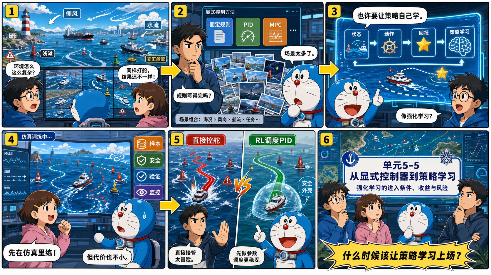
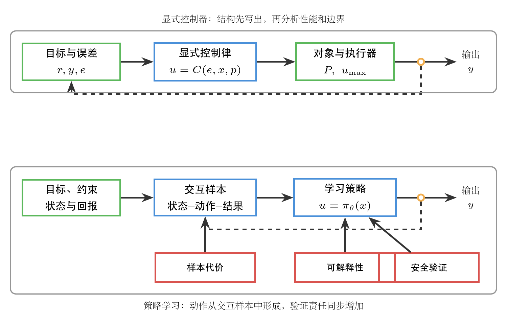
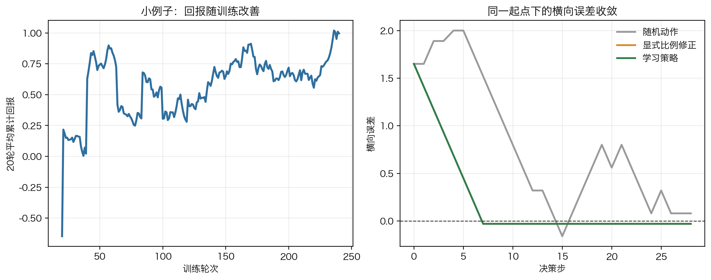
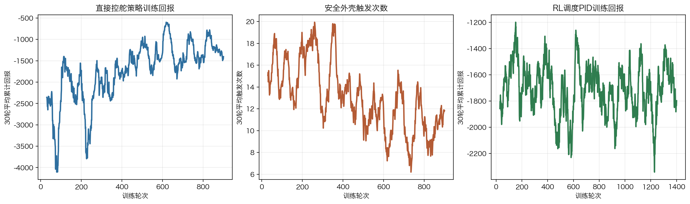
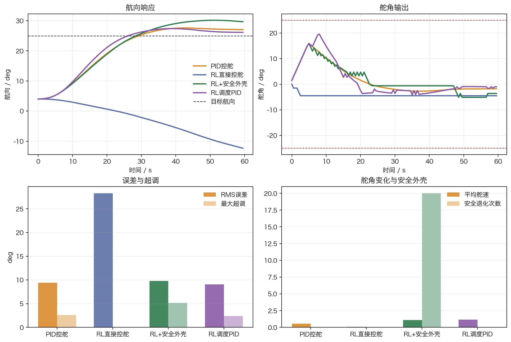
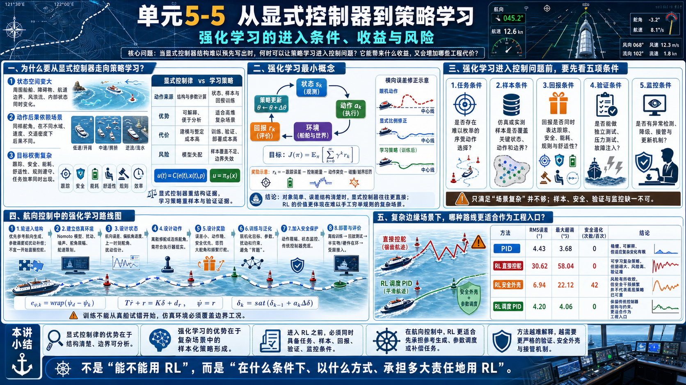

# 单元 5-5 | 从显式控制器到策略学习：强化学习的进入条件、收益与风险

**课程**：自动控制原理
**课型**：理论
**学时**：90分钟
**知识类型**：[X] 跨域型
**前置**：已能说明复杂自主系统中的感知、估计、规划与控制链路，理解模型驱动、MPC 与数据驱动控制的基本迁移逻辑。
**核心问题**：当显式控制器结构难以预先写出时，如何判断策略学习是否有进入控制问题的依据，以及这种进入会带来哪些新的工程代价。

## 本次课程目标

完成学习后，我们应能够：

1. 解释显式控制律与学习策略在信息来源、动作生成和验证方式上的差异。
2. 判断强化学习进入控制问题前需要满足的任务复杂度、样本、安全和可解释性条件。
3. 用一个简化仿真说明策略如何由状态、动作和回报形成。
4. 按航向保持任务说明强化学习控制器的结构、环境、状态、动作、奖励、训练、泛化、安全保护和部署验证路线。
5. 比较 PID、直接输出舵角的学习策略、带安全外壳的学习策略与 RL 调度 PID 参数的混合策略在复杂边缘场景中的响应、舵角使用和部署边界差异。

## 一、显式控制器到策略学习的迁移压力

### 1.1 显式控制器的价值来自结构清楚

在经典控制设计中，控制器通常先被写成一个可说明的结构。比例、积分、微分、超前、滞后、状态反馈、MPC 等方法虽然形式不同，但共同点很清楚：先明确控制目标、反馈变量、控制器结构和约束，再分析稳定性、性能和边界。

以航向保持为例，若对象近似为一阶惯性加延迟，控制器可以从误差 $e(t)=r(t)-y(t)$ 出发，写出

$$
u(t)=C(e(t),x(t),p),
$$

其中 $u(t)$ 是舵角或推进指令，$x(t)$ 是状态，$p$ 是对象参数。这个表达式的价值不只在于能算出控制量，更在于能说明控制量为什么这样产生：误差如何进入控制器，参数如何影响动作，执行器约束如何限制输出，稳定性和性能怎样被验证。

### 1.2 复杂自主系统会放大动作选择空间

自主船舶在近岸航道中避碰时，控制层收到的参考不再是一个平滑的阶跃或斜坡，而是规划层在规则、障碍物、船舶动力学和环境风险之间权衡后的行动意图。环境状态可能高维、部分可观测、带有不确定性；同一个动作在不同水流、交通密度和传感器置信度下产生的后果也会不同。此时，控制器结构仍然可以写出一部分，但很难把所有状态、动作选择和场景条件都提前枚举成固定规则。

表 1. 显式控制器结构面临的三类压力

| 压力来源 | 典型表现 | 对控制设计的影响 |
| --- | --- | --- |
| 状态空间变大 | 周围船舶、障碍物、航道边界、环境扰动和内部状态同时变化 | 控制输入不再只由少量误差量决定 |
| 动作后果依赖场景 | 同样的舵角在不同水域、速度和交通密度下产生不同风险 | 固定规则难以覆盖所有组合 |
| 目标权衡复杂 | 跟踪、安全、能耗、舒适性、规则遵守和任务效率同时出现 | 单一性能指标难以表达完整任务 |

这些压力并不意味着显式控制器失去价值。航向稳定、舵角限制、执行器保护、故障降级和安全监控仍然需要可解释的控制结构。真正需要判断的是：在某些决策或动作选择环节中，人工预先写出完整规则的成本是否已经过高，样本和反馈是否能够提供更有效的策略形成依据。

### 1.3 显式控制律与学习策略承担不同证明责任

显式控制律把动作生成过程写成可读的数学或逻辑结构。学习策略则把动作生成过程交给一个可训练的函数，例如

$$
u=\pi_\theta(x),
$$

其中 $\pi_\theta$ 表示由参数 $\theta$ 描述的策略，$x$ 表示状态或观测。策略的参数不由人工逐项设定，而通过样本、回报信号和优化过程形成。强化学习就是这一路线中的典型方法：智能体在环境中观察状态，选择动作，得到回报，再根据长期回报调整策略。

{width=100%}

图中最重要的差别在证据来源。显式控制器的核心证据来自结构：控制律写得越清楚，稳定性、性能和边界越容易被分析。学习策略的核心证据来自交互样本和验证：策略可能在复杂环境中形成有效动作，但样本代价、可解释性和安全验证会同步成为必须回答的问题。

表 2. 显式控制律与学习策略的比较

| 比较维度 | 显式控制律 | 学习策略 |
| --- | --- | --- |
| 动作来源 | 由控制结构、参数和反馈关系直接计算 | 由状态、样本和回报训练得到 |
| 优势 | 可解释性较强，便于稳定性和边界分析 | 能处理难以逐项写规则的高维场景 |
| 主要代价 | 建模、结构选择和参数整定成本较高 | 样本、训练、验证和部署监控成本较高 |
| 典型风险 | 模型失配、结构选择错误、约束处理不足 | 样本覆盖不足、动作不可解释、边界工况失效 |
| 工程责任 | 证明结构和参数在目标范围内可靠 | 证明样本、策略、验证和监控足以支撑部署 |

学习策略不能被理解为“没有控制器”。策略本身仍然是动作生成机制，只是它的结构和参数来自训练过程。控制目标、约束、安全边界、异常降级和责任说明仍然存在。若这些内容没有被写清，策略学习只会把显式控制器中的困难转移到样本和验证环节。

## 二、强化学习的最小概念与仿真演示

### 2.1 序贯决策、策略与回报

强化学习关注的是序贯决策问题。系统在每个时刻处于某个状态 $s_k$，选择动作 $a_k$，环境转移到新状态 $s_{k+1}$，并给出回报 $r_k$。策略 $\pi$ 决定在状态下采取什么动作。学习的目标通常可以写成最大化长期累计回报：

$$
J(\pi)=\mathbb{E}_{\pi}\left[\sum_{k=0}^{\infty}\gamma^k r_k\right],
$$

其中 $\gamma$ 是折扣因子，用于衡量未来回报在当前目标中的权重。这个式子只提供概念框架，不要求在本单元推导具体算法。对控制问题更关键的是回报函数如何表达工程目标。

若把自主航行中的策略学习写成控制问题，状态可能包含本船位置、航向、速度、目标船相对状态、障碍物距离、风浪流估计和执行器状态；动作可能是参考航向修正、速度指令或局部避碰动作；回报可能奖励安全距离、航迹保持、能耗降低和动作平滑，同时惩罚碰撞风险、规则违反、舵角饱和和大幅振荡。

一个简化的回报可以写成

$$
r_k
=
-w_e e_k^2
-w_u u_k^2
-w_{\Delta u}(u_k-u_{k-1})^2
-w_c I_{\mathrm{collision}}
-w_b I_{\mathrm{boundary}},
$$

其中 $e_k$ 是跟踪误差，$u_k$ 是控制动作，$I_{\mathrm{collision}}$ 表示碰撞或近碰风险事件，$I_{\mathrm{boundary}}$ 表示越界、违反规则或触碰安全边界。这个表达式说明，强化学习进入控制问题时，最先需要被工程化的是目标和代价，而不是算法名称。

### 2.2 一个横向误差修正的小仿真

为了避免把强化学习理解成抽象名词，我们先看一个很小的仿真。假设某移动体存在横向误差 $y_k$，每一步只能选择三个动作：向左修正、保持、向右修正。仿真回报奖励误差减小，同时惩罚过大的动作和越界风险。策略并不知道“正误差应向左修正”这条规则，而是在反复试错中根据回报调整状态-动作值。

{width=100%}

仿真使用固定随机种子 `5505`。左图显示 20 轮平均累计回报从负值逐渐升高，说明策略在状态和动作之间形成了更有利的对应关系。右图从同一起点比较三种行为：随机动作会在误差区域来回游走；显式比例修正直接按照误差方向修正；学习策略经过训练后也能把横向误差压到接近零。该例子的作用不是证明强化学习优于经典控制，而是说明“状态、动作、回报、策略”如何在控制语境中落地。

表 3. 横向误差修正仿真结果

| 方法 | 末端绝对误差 | 累计回报 | 说明 |
| --- | ---: | ---: | --- |
| 随机动作 | 0.08 | -21.96 | 没有形成稳定状态-动作关系 |
| 显式比例修正 | 0.03 | -5.54 | 结构清楚，适合简单误差修正 |
| 学习策略 | 0.03 | -5.54 | 由试错形成近似修正规律 |

这个小例子也揭示了策略学习的边界：当对象简单、误差结构清楚时，显式比例修正已经足够；学习策略能够达到类似结果，但要付出训练和验证成本。策略学习的价值通常不在这种简单场景，而在动作选择空间难以手工写完的复杂场景。

## 三、策略学习进入控制问题的条件与代价

### 3.1 五项进入条件

策略学习适合进入的典型情形是：显式控制律很难覆盖动作选择空间，任务目标仍能明确表达，样本或仿真环境能够覆盖关键边界，安全验证和部署监控有办法落地。若缺少这些条件，引入强化学习会增加不确定性。

表 4. 强化学习进入控制任务前的五项条件

| 条件 | 需要回答的问题 | 不满足时的主要风险 |
| --- | --- | --- |
| 任务条件 | 问题是否包含难以枚举的序贯动作选择 | 用复杂方法解决简单问题 |
| 样本条件 | 仿真或实测样本是否覆盖关键状态、动作和边界 | 策略只学到常见场景，在边界处失效 |
| 回报条件 | 回报是否表达了跟踪、安全、能耗、规则和舒适性 | 策略优化了错误目标 |
| 验证条件 | 是否能进行独立测试、压力测试和故障注入 | 训练表现好，闭环部署证据不足 |
| 监控条件 | 是否有异常检测、降级、接管和更新机制 | 策略离开适用域后仍继续输出动作 |

这五项条件共同决定强化学习是否具备工程入口。只满足其中一项都不充分。场景复杂但没有可控样本，不能贸然训练；样本充足但回报函数没有表达安全，策略可能学到危险捷径；离线测试表现较好但没有部署监控，系统无法判断策略何时已经不可信。

### 3.2 进入条件与风险矩阵

表 5. 策略学习进入条件与风险矩阵

| 判断项 | 适合进入 | 需要补证据 | 暂不进入 |
| --- | --- | --- | --- |
| 显式控制律可写性 | 结构难以枚举但目标清楚 | 结构可写但参数漂移大 | 固定结构已可靠 |
| 样本条件 | 仿真或实测覆盖关键边界 | 只覆盖温和工况 | 缺少可控样本 |
| 安全要求 | 可先离线验证再受限部署 | 验证场景不足 | 失误代价不可接受 |
| 可解释性 | 能解释目标、约束和拒绝条件 | 只能解释性能结果 | 无法说明动作来源 |
| 部署监控 | 有降级、接管和异常检测 | 监控指标未闭合 | 无运行边界监控 |

判断顺序应从显式结构开始。若固定结构控制、MPC 或局部数据驱动补偿已经能够可靠解决问题，就没有必要把任务整体交给策略学习。其次检查样本条件，样本既要覆盖常规工况，也要覆盖执行器边界、传感器异常、环境扰动和近碰风险。再次检查安全要求和可解释性要求，动作不能只在平均性能上表现较好，还要能说明拒绝条件、降级条件和不可部署条件。最后检查部署监控，策略上线后必须能识别自己正在离开训练与验证覆盖范围。

### 3.3 收益与代价同时出现

强化学习的吸引力来自三类收益。第一，它能够在高维状态中形成动作选择规律，减少人工规则枚举。第二，它能够通过长期回报处理序贯决策，把当前动作对未来风险的影响纳入策略形成过程。第三，它可以在仿真环境中反复试错，探索人工难以穷举的场景组合。

表 6. 策略学习收益与工程代价

| 可能收益 | 对应代价 | 工程判断 |
| --- | --- | --- |
| 适应高维复杂场景 | 需要大量覆盖关键边界的样本 | 样本范围比样本数量更重要 |
| 学习长期动作后果 | 回报函数设计困难，可能诱发错误捷径 | 回报必须包含安全与约束惩罚 |
| 在仿真中探索策略 | 仿真与真实对象存在差距 | 必须进行模型校准和真实部署前验证 |
| 减少人工规则枚举 | 动作来源可解释性下降 | 需要策略解释、拒绝条件和审计记录 |
| 提升部分场景性能 | 部署风险和监控要求增加 | 必须保留降级、接管和运行边界监控 |

策略学习最容易造成的误判，是把训练阶段的高分当成工程可靠性。训练回报高，说明策略在训练环境和回报定义下表现较好；它不能自动证明策略在未知水域、传感器异常、执行器退化、通信延迟或规则冲突下仍然可靠。控制问题关心的是闭环行为，一次动作错误可能带来系统级后果。因此，强化学习进入控制系统后，验证门槛通常更高。

## 四、航向控制中的强化学习技术路线

### 4.1 第一步：确定控制结构

本节固定在航向保持任务上讨论强化学习。目标航向为 $\psi_d$，船舶当前航向为 $\psi_k$，控制器需要让航向尽快、平稳、少打舵地接近目标，并在风浪流扰动下保持稳定。航向误差写成

$$
e_{\psi,k}=\mathrm{wrap}(\psi_d-\psi_k),
$$

其中 $\mathrm{wrap}(\cdot)$ 表示把角度差折回到 $[-\pi,\pi]$，避免 $359^\circ$ 与 $1^\circ$ 被误读成很大的误差。

强化学习可以进入三类工程结构：

表 7. 航向控制中强化学习进入结构的三种方式

| 结构 | RL 输出 | 显式控制器职责 | 工程判断 |
| --- | --- | --- | --- |
| 直接控舵 | 舵角 $\delta_k$ | 只保留限幅、舵速和安全接管 | 验证难度最高，适合仿真或小尺度受限实验 |
| 参考航向生成 | 期望航向 $\psi_{d,k}^{\mathrm{ref}}$ | PID/MPC 负责控舵与约束处理 | 更容易保留稳定性解释，适合工程进入 |
| PID 参数调度或补偿调整 | PID 参数、扰动补偿量或前馈量 | 显式控制器仍是主控制器 | 工程接受度最高，适合作为传统自动舵升级入口 |

更合理的起步路线通常是后两类，而不是一开始让神经网络完全接管舵机。越靠近舵机，动作越需要可解释、可限制、可降级；越靠近复杂环境适应，策略学习才更容易体现价值。本讲义的复杂边缘场景因此额外比较一种混合路线：RL 不直接输出舵角，而是在“保守、常规、抗扰、快速”四组 PID 参数之间选择，实际控舵仍由带限幅和舵速约束的 PID 完成。

### 4.2 第二步：建立 Nomoto 航向仿真环境

训练不能直接从真船试错开始。一个最小训练环境可以采用一阶 Nomoto 航向模型：

$$
T\dot r+r=K\delta+d_r,\qquad \dot\psi=r,
$$

其中 $r$ 是偏航角速度，$\delta$ 是舵角，$T$ 是响应时间常数，$K$ 是舵效增益，$d_r$ 表示风浪流、模型误差或未建模扰动对偏航通道的等效影响。仿真环境还必须包含舵角限幅、舵速限制、测量噪声、初始航向偏差、目标航向变化和参数摄动。否则策略只是在理想模型中得分，不能说明它具备工程入口。

本讲义中的代码直出仿真使用固定随机种子 `5505`。训练场景随机化 $T$、$K$、$d_r$、初始航向和目标航向，评价场景再引入更强扰动、参数失配和舵效下降，用来观察策略是否只记住了单一场景。

### 4.3 第三步：设计状态

状态是智能体能看到的控制信息。对航向保持，状态不应只是当前航向，而应把误差、动态趋势和执行器历史放入同一个向量：

$$
s_k=
\begin{bmatrix}
e_{\psi,k} & r_k & \delta_{k-1} & \hat d_{r,k}
\end{bmatrix}^{\mathsf T}.
$$

其中 $\hat d_{r,k}$ 是扰动估计或扰动分档信息。若没有可靠估计，也可以用最近一段误差变化、积分误差或环境等级代替。状态设计的核心问题是：智能体必须知道“偏了多少、正在怎么转、上一次已经打了多少舵、环境是否在推船偏航”。缺少这些信息，策略很容易出现过度打舵、滞后修正或被扰动牵着走。

### 4.4 第四步：设计动作

动作可以设计为连续舵角，也可以设计为离散舵角调整。教学仿真采用离散动作集合：

$$
a_k\in\{-1,0,1\},\qquad
\delta_k=\mathrm{sat}_{\delta_{\max}}\left(\delta_{k-1}+a_k\Delta\delta\right),
$$

并加入舵速限制

$$
|\delta_k-\delta_{k-1}|\leq \dot\delta_{\max}\Delta t.
$$

这个写法比直接让策略每一步输出任意舵角更接近执行器现实。真实舵机不能从 $-35^\circ$ 瞬间跳到 $35^\circ$，控制动作也不能只追求误差最小而忽略舵机寿命、能耗和乘坐舒适性。

### 4.5 第五步：设计奖励

奖励函数把“好舵手”的标准写成可训练目标。航向保持的奖励可以写成

$$
r_k=
-w_e e_{\psi,k}^2
-w_r r_k^2
-w_\delta \delta_k^2
-w_{\Delta\delta}(\delta_k-\delta_{k-1})^2
-w_s I_{\mathrm{safety},k}
+r_{\mathrm{settle},k}.
$$

前四项分别惩罚航向误差、偏航角速度、大舵角和频繁打舵；$I_{\mathrm{safety},k}$ 表示越过安全边界、触发接管或进入不可信状态；$r_{\mathrm{settle},k}$ 奖励在误差小、角速度小、舵角平稳时保持稳定。这个奖励不能写成“误差越小越好”一种项。只奖励误差会诱导策略猛烈打舵；只惩罚舵角会诱导策略不愿转向；只看训练回报会掩盖边界工况中的风险。

若采用 Q-learning，离散状态和离散动作下的更新式为

$$
Q(s_k,a_k)\leftarrow Q(s_k,a_k)+\alpha\left[
r_k+\gamma\max_a Q(s_{k+1},a)-Q(s_k,a_k)
\right].
$$

若采用连续策略优化，可以仍用

$$
J(\pi)=\mathbb{E}_{\pi}\left[\sum_{k=0}^{\infty}\gamma^k r_k\right]
$$

表达长期目标，但本单元不展开 PPO、DDPG、TD3 或 SAC 的算法推导。

### 4.6 第六步：训练策略

训练过程可以理解为大量虚拟航向保持实验。每一轮随机给定目标航向、初始航向、船舶参数和扰动，智能体观察 $s_k$，输出动作 $a_k$，仿真器根据 Nomoto 模型计算 $\psi_{k+1}$ 和 $r_{k+1}$，奖励函数给出得分，再更新策略。早期策略可能乱打舵；随着训练增加，它应逐渐学会在误差较大时修正，在接近目标前回舵，并避免被高频扰动诱导出频繁舵角变化。

{width=100%}

左图显示训练回报的移动平均值从低位上升，说明策略在仿真环境中形成了更有效的状态-动作对应关系。右图把训练中安全外壳触发次数同步画出：回报改善不能单独作为成功证据，安全干预是否频繁、是否集中在边界状态，同样需要被记录。

### 4.7 第七步：做泛化训练

只在一个 $T$、一个 $K$、一个目标航向和一个扰动下训练，策略很容易背题。泛化训练需要随机化对象和环境：

表 8. 航向控制策略的泛化训练维度

| 随机化对象 | 训练中改变什么 | 目的 |
| --- | --- | --- |
| 目标与初始状态 | $\psi_d$、$\psi_0$、$r_0$ | 防止策略只会一种转向幅度 |
| 船体参数 | $T$、$K$、载荷等效变化 | 防止策略只适配单一模型 |
| 环境扰动 | $d_r$、噪声、缓慢偏置和脉冲扰动 | 防止策略把扰动当成确定模型 |
| 执行器约束 | $\delta_{\max}$、$\dot\delta_{\max}$、延迟 | 防止策略输出执行器做不到的动作 |

工程上还可以采用课程学习：先在静水、低噪声、小角度任务中训练，再加入强扰动、参数漂移、舵机延迟和传感器噪声。这样做不是为了让算法看起来更复杂，而是为了让训练覆盖逐渐接近真实闭环边界。

### 4.8 第八步：加入安全保护

航向控制中的安全保护不能只写成“动作限幅”。更完整的保护至少包括三层：第一，动作层限幅和舵速约束，保证舵机可执行；第二，状态层监控，当航向误差、偏航角速度或舵角接近边界时触发降级；第三，结构层兜底，保留 PID/MPC 或经过验证的传统自动舵作为接管控制器。

因此，本节推荐的工程路线是：RL 先输出参考航向、PID 参数修正或扰动补偿量；若要尝试直接输出舵角，也必须经过安全外壳。仿真中的安全外壳采用如下规则：当策略建议导致舵角越界、舵速越界、误差继续放大或角速度过高时，控制量退回到限幅 PID 输出，并记录一次安全退化。

### 4.9 第九步：从仿真走向实船

仿真到实船不应理解为“训练好后直接上船”。更稳妥的顺序是：

1. 在 Nomoto 或三自由度模型中完成离线训练和压力测试。
2. 用历史航行数据、不同载荷和不同海况做独立回放测试。
3. 在硬件在环或半实物平台中检查舵机延迟、采样周期和传感器噪声。
4. 在受限水域中以观察模式运行，让策略只给建议，不直接控舵。
5. 在小范围、低风险任务中受限接入，并保留人工接管和传统控制器降级。

这条路线的重点是证据链，而不是算法名称。强化学习策略越难解释，就越需要清楚记录训练覆盖、测试场景、拒绝条件、退化次数和接管逻辑。

### 4.10 第十步：评价控制效果

航向控制策略的评价不能只看最终误差。至少应同时报告 RMS 航向误差、最大超调、调节时间、舵角使用量、舵角变化率、扰动下误差恢复、安全退化次数和训练外工况表现。

{width=100%}

评价场景不再采用理想阶跃航向保持，而是把四种方法放到同一个复杂边缘场景中：初始航向误差约为 $21^\circ$；第 $12$ 到 $24$ 秒出现持续侧风或横流，第 $35$ 到 $46$ 秒出现反向扰动，第 $52$ 秒附近出现短时脉冲；同时船体等效时间常数逐渐增大，舵效增益逐渐下降。固定 PID 使用常规参数，不在评价过程中重新整定；RL 调度 PID 每一步只选择 PID 参数档位，不直接绕过舵角限幅和舵速约束。

表 9. 航向保持仿真评价指标

| 方法 | RMS误差 | 最大超调 | 调节时间 | 平均舵角 | 平均舵速 | 安全退化 |
| --- | ---: | ---: | ---: | ---: | ---: | ---: |
| PID | 9.40° | 2.61° | >59.5 s | 4.02° | 0.57°/s | 0 |
| RL直接 | 28.28° | 0.00° | >59.5 s | 4.38° | 0.08°/s | 0 |
| RL安全外壳 | 9.80° | 5.17° | >59.5 s | 4.09° | 1.10°/s | 20 |
| RL调度PID | 9.06° | 2.41° | 50.0 s | 4.69° | 1.16°/s | 0 |

这组复杂边缘场景说明三点。第一，直接控舵的 RL 仍然不是好入口：它没有明显超调，但主要原因是动作过于保守，航向误差长期不能压下去。第二，安全外壳能阻止部分危险动作，但若底层策略本身没有学会在扰动和舵效下降时主动恢复，安全退化会频繁出现，闭环效果仍不稳定。第三，RL 调度 PID 参数的混合路线开始体现前沿方法的合理位置：它保留 PID 的可解释结构和执行器约束，同时利用策略学习在扰动增强、舵效下降和恢复阶段切换参数档位，因此 RMS 误差、超调和调节时间均优于固定 PID。它的代价也同样清楚：平均舵角和舵速更高，说明收益来自更积极的动态适应，而不是“免费提升性能”。

这个结果不支持“用 RL 取代 PID”，而支持“用 RL 判断 PID 该如何随场景变化”。在真实工程中，策略学习更适合先进入参考生成、参数调度、扰动补偿和异常场景辅助，而不是直接接管舵机。前沿方法的必要性也不来自理想环境中的单指标胜出，而来自更真实边界中对多目标、多扰动和参数漂移的动态适应能力。

## 五、练习、常见误判与参考文献

### 5.1 分层练习

**练习 1：概念识别**

判断下列说法是否成立，并说明理由。

1. 只要控制器结构难写，就可以直接使用强化学习。
2. 策略学习输出动作后，底层控制器和安全监督仍然需要保留。
3. 训练回报高可以直接证明策略满足工程部署要求。
4. 样本覆盖关键边界比单纯增加样本数量更重要。

参考判断：第 2、4 条成立；第 1、3 条不成立。第 1 条忽略了样本、安全、解释和部署条件；第 3 条把训练环境中的表现误当成真实闭环可靠性。

**练习 2：条件判断**

某移动平台在固定仓库中运行，路径清晰、障碍物位置固定、传感器稳定，现有 MPC 已能满足速度、能耗和安全距离要求。团队希望引入强化学习替代整个控制器。请从五项进入条件判断这个方案是否合理。

参考要点：任务复杂度不足以支撑整体替代；显式控制律和 MPC 已经可靠；样本与验证成本会增加；若确需使用学习方法，可考虑局部路径代价估计或异常场景辅助，而不应替代整个控制器。

**练习 3：工程迁移**

一艘自主船的传统自动舵在静水中可以稳定保持目标航向，但在侧风和横流变化较大时需要频繁重整定 PID 参数。团队希望引入强化学习改善航向保持。请从状态、动作、奖励、安全外壳和部署验证五个方面，设计一个受限进入方案。

参考要点：状态应包含航向误差、偏航角速度、上一时刻舵角和扰动估计；动作不宜直接从完全控舵开始，可先输出 PID 参数修正、扰动补偿或参考航向；奖励函数同时惩罚航向误差、角速度、大舵角、舵角变化率和安全退化；策略输出必须经过舵角限幅、舵速限制、误差放大检查和传统自动舵降级；部署前先做参数随机化仿真、历史数据回放、硬件在环和受限水域观察模式验证。

### 5.2 常见误判

固定结构仍可靠时不必追求策略学习。若对象模型清楚、约束明确、环境变化有限，显式控制器和 MPC 往往更合适。它们可解释、可验证、调试成本低。策略学习在这种情况下可能只是增加系统复杂度。

回报函数错误会诱发危险捷径。若回报只奖励速度、只惩罚跟踪误差，策略可能通过贴近障碍物、频繁大动作或消耗执行器余量来获得高分。控制任务的回报必须把安全、规则、能耗、动作平滑和约束边界写入目标。

仿真表现不等同于真实部署。仿真环境可以大量试错，但仿真对象、传感器误差、执行器动态和环境扰动都可能与真实系统不同。策略从仿真迁移到真实对象前，需要校准、压力测试和受限验证。

策略学习需要显式安全外壳。策略输出应受到约束检查、异常检测和降级机制保护。尤其在船舶、车辆、机器人和工业系统中，策略不能绕过执行器边界和安全监督。

### 5.3 本节小结

1. 显式控制律的优势来自结构清楚、边界可分析；学习策略的优势来自复杂场景中的样本化动作形成。
2. 强化学习进入控制问题的前提是显式结构确实不足，同时样本、回报、安全验证、可解释性和部署监控证据能够成立。
3. 简化仿真说明，策略可以通过状态、动作和回报形成有效行为，但简单误差修正仍然可以由显式控制器更直接地完成。
4. 在航向控制任务中，策略学习更适合先作为参考航向生成、参数修正或扰动补偿模块，直接接管舵角输出需要更高验证门槛。
5. 前沿方法不会减少工程责任。方法越难解释，越需要更清楚的边界、验证和接管机制。

### 5.4 参考文献

1. Sutton, R. S., & Barto, A. G. (2018). *Reinforcement Learning: An Introduction* (2nd ed.). MIT Press. <https://mitpress.mit.edu/9780262039246/reinforcement-learning/>
2. Watkins, C. J. C. H., & Dayan, P. (1992). Q-learning. *Machine Learning*, 8, 279-292. <https://link.springer.com/article/10.1007/BF00992698>
3. Recht, B. (2019). A Tour of Reinforcement Learning: The View from Continuous Control. *Annual Review of Control, Robotics, and Autonomous Systems*, 2, 253-279. <https://www.annualreviews.org/content/journals/10.1146/annurev-control-053018-023825>
4. Kober, J., Bagnell, J. A., & Peters, J. (2013). Reinforcement Learning in Robotics: A Survey. *The International Journal of Robotics Research*, 32(11), 1238-1274. <https://doi.org/10.1177/0278364913495721>
5. Brunke, L., Greeff, M., Hall, A. W., Yuan, Z., Zhou, S., Panerati, J., & Schoellig, A. P. (2022). Safe Learning in Robotics: From Learning-Based Control to Safe Reinforcement Learning. *Annual Review of Control, Robotics, and Autonomous Systems*, 5, 411-444. <https://www.annualreviews.org/content/journals/10.1146/annurev-control-042920-020211>
6. Wang, C., Zhang, X., & Li, P. (2022). COLREGs-Compliant Collision Avoidance for Unmanned Surface Vehicles Based on Deep Reinforcement Learning. *Journal of Marine Science and Engineering*, 10(7), 944. <https://www.mdpi.com/2077-1312/10/7/944>
