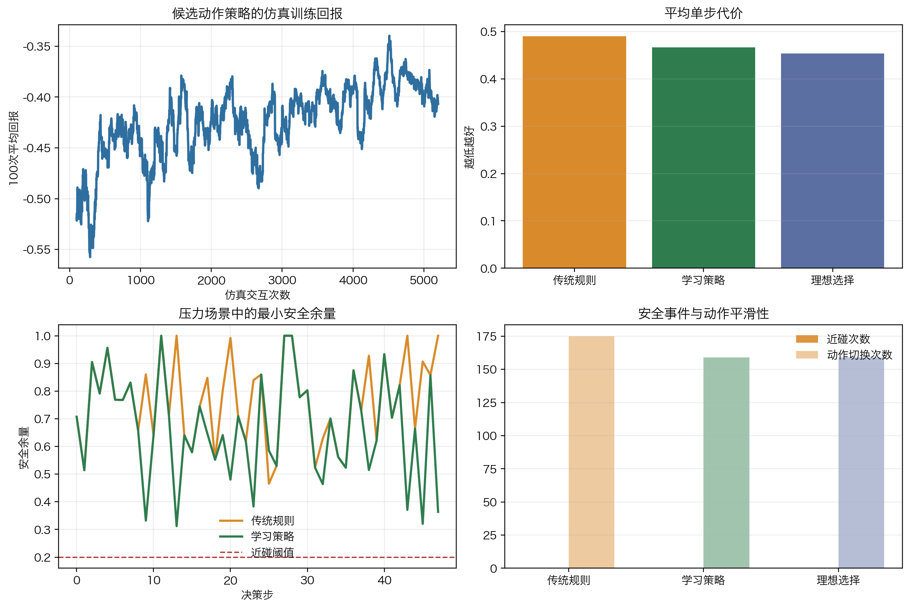

# 单元 5-5 | 从显式控制器到策略学习：强化学习的进入条件、收益与风险

**课程**：自动控制原理
**课型**：理论
**学时**：90分钟
**知识类型**：[X] 跨域型
**前置**：已能说明复杂自主系统中的感知、估计、规划与控制链路，理解模型驱动、MPC 与数据驱动控制的基本迁移逻辑。
**核心问题**：当显式控制器结构难以预先写出时，如何判断策略学习是否有进入控制问题的依据，以及这种进入会带来哪些新的工程代价。

## 本次课程目标

完成学习后，我们应能够：

1. 解释显式控制律与学习策略在信息来源、动作生成和验证方式上的差异。
2. 判断强化学习进入控制问题前需要满足的任务复杂度、样本、安全和可解释性条件。
3. 用一个简化仿真说明策略如何由状态、动作和回报形成。
4. 分析复杂自主航行任务中哪些职责仍应保留显式结构，哪些环节才可能考虑策略学习。
5. 比较传统规则与学习策略在仿真结果、验证责任和部署边界上的差异。

## 一、显式控制器到策略学习的迁移压力

### 1.1 显式控制器的价值来自结构清楚

在经典控制设计中，控制器通常先被写成一个可说明的结构。比例、积分、微分、超前、滞后、状态反馈、MPC 等方法虽然形式不同，但共同点很清楚：先明确控制目标、反馈变量、控制器结构和约束，再分析稳定性、性能和边界。

以航向保持为例，若对象近似为一阶惯性加延迟，控制器可以从误差 $e(t)=r(t)-y(t)$ 出发，写出

$$
u(t)=C(e(t),x(t),p),
$$

其中 $u(t)$ 是舵角或推进指令，$x(t)$ 是状态，$p$ 是对象参数。这个表达式的价值不只在于能算出控制量，更在于能说明控制量为什么这样产生：误差如何进入控制器，参数如何影响动作，执行器约束如何限制输出，稳定性和性能怎样被验证。

### 1.2 复杂自主系统会放大动作选择空间

自主船舶在近岸航道中避碰时，控制层收到的参考不再是一个平滑的阶跃或斜坡，而是规划层在规则、障碍物、船舶动力学和环境风险之间权衡后的行动意图。环境状态可能高维、部分可观测、带有不确定性；同一个动作在不同水流、交通密度和传感器置信度下产生的后果也会不同。此时，控制器结构仍然可以写出一部分，但很难把所有状态、动作选择和场景条件都提前枚举成固定规则。

表 1. 显式控制器结构面临的三类压力

| 压力来源 | 典型表现 | 对控制设计的影响 |
| --- | --- | --- |
| 状态空间变大 | 周围船舶、障碍物、航道边界、环境扰动和内部状态同时变化 | 控制输入不再只由少量误差量决定 |
| 动作后果依赖场景 | 同样的舵角在不同水域、速度和交通密度下产生不同风险 | 固定规则难以覆盖所有组合 |
| 目标权衡复杂 | 跟踪、安全、能耗、舒适性、规则遵守和任务效率同时出现 | 单一性能指标难以表达完整任务 |

这些压力并不意味着显式控制器失去价值。航向稳定、舵角限制、执行器保护、故障降级和安全监控仍然需要可解释的控制结构。真正需要判断的是：在某些决策或动作选择环节中，人工预先写出完整规则的成本是否已经过高，样本和反馈是否能够提供更有效的策略形成依据。

### 1.3 显式控制律与学习策略承担不同证明责任

显式控制律把动作生成过程写成可读的数学或逻辑结构。学习策略则把动作生成过程交给一个可训练的函数，例如

$$
u=\pi_\theta(x),
$$

其中 $\pi_\theta$ 表示由参数 $\theta$ 描述的策略，$x$ 表示状态或观测。策略的参数不由人工逐项设定，而通过样本、回报信号和优化过程形成。强化学习就是这一路线中的典型方法：智能体在环境中观察状态，选择动作，得到回报，再根据长期回报调整策略。

{width=100%}

图中最重要的差别在证据来源。显式控制器的核心证据来自结构：控制律写得越清楚，稳定性、性能和边界越容易被分析。学习策略的核心证据来自交互样本和验证：策略可能在复杂环境中形成有效动作，但样本代价、可解释性和安全验证会同步成为必须回答的问题。

表 2. 显式控制律与学习策略的比较

| 比较维度 | 显式控制律 | 学习策略 |
| --- | --- | --- |
| 动作来源 | 由控制结构、参数和反馈关系直接计算 | 由状态、样本和回报训练得到 |
| 优势 | 可解释性较强，便于稳定性和边界分析 | 能处理难以逐项写规则的高维场景 |
| 主要代价 | 建模、结构选择和参数整定成本较高 | 样本、训练、验证和部署监控成本较高 |
| 典型风险 | 模型失配、结构选择错误、约束处理不足 | 样本覆盖不足、动作不可解释、边界工况失效 |
| 工程责任 | 证明结构和参数在目标范围内可靠 | 证明样本、策略、验证和监控足以支撑部署 |

学习策略不能被理解为“没有控制器”。策略本身仍然是动作生成机制，只是它的结构和参数来自训练过程。控制目标、约束、安全边界、异常降级和责任说明仍然存在。若这些内容没有被写清，策略学习只会把显式控制器中的困难转移到样本和验证环节。

## 二、强化学习的最小概念与仿真演示

### 2.1 序贯决策、策略与回报

强化学习关注的是序贯决策问题。系统在每个时刻处于某个状态 $s_k$，选择动作 $a_k$，环境转移到新状态 $s_{k+1}$，并给出回报 $r_k$。策略 $\pi$ 决定在状态下采取什么动作。学习的目标通常可以写成最大化长期累计回报：

$$
J(\pi)=\mathbb{E}_{\pi}\left[\sum_{k=0}^{\infty}\gamma^k r_k\right],
$$

其中 $\gamma$ 是折扣因子，用于衡量未来回报在当前目标中的权重。这个式子只提供概念框架，不要求在本单元推导具体算法。对控制问题更关键的是回报函数如何表达工程目标。

若把自主航行中的策略学习写成控制问题，状态可能包含本船位置、航向、速度、目标船相对状态、障碍物距离、风浪流估计和执行器状态；动作可能是参考航向修正、速度指令或局部避碰动作；回报可能奖励安全距离、航迹保持、能耗降低和动作平滑，同时惩罚碰撞风险、规则违反、舵角饱和和大幅振荡。

一个简化的回报可以写成

$$
r_k
=
-w_e e_k^2
-w_u u_k^2
-w_{\Delta u}(u_k-u_{k-1})^2
-w_c I_{\mathrm{collision}}
-w_b I_{\mathrm{boundary}},
$$

其中 $e_k$ 是跟踪误差，$u_k$ 是控制动作，$I_{\mathrm{collision}}$ 表示碰撞或近碰风险事件，$I_{\mathrm{boundary}}$ 表示越界、违反规则或触碰安全边界。这个表达式说明，强化学习进入控制问题时，最先需要被工程化的是目标和代价，而不是算法名称。

### 2.2 一个横向误差修正的小仿真

为了避免把强化学习理解成抽象名词，我们先看一个很小的仿真。假设某移动体存在横向误差 $y_k$，每一步只能选择三个动作：向左修正、保持、向右修正。仿真回报奖励误差减小，同时惩罚过大的动作和越界风险。策略并不知道“正误差应向左修正”这条规则，而是在反复试错中根据回报调整状态-动作值。

{width=100%}

仿真使用固定随机种子 `5505`。左图显示 20 轮平均累计回报从负值逐渐升高，说明策略在状态和动作之间形成了更有利的对应关系。右图从同一起点比较三种行为：随机动作会在误差区域来回游走；显式比例修正直接按照误差方向修正；学习策略经过训练后也能把横向误差压到接近零。该例子的作用不是证明强化学习优于经典控制，而是说明“状态、动作、回报、策略”如何在控制语境中落地。

表 3. 横向误差修正仿真结果

| 方法 | 末端绝对误差 | 累计回报 | 说明 |
| --- | ---: | ---: | --- |
| 随机动作 | 0.08 | -21.96 | 没有形成稳定状态-动作关系 |
| 显式比例修正 | 0.03 | -5.54 | 结构清楚，适合简单误差修正 |
| 学习策略 | 0.03 | -5.54 | 由试错形成近似修正规律 |

这个小例子也揭示了策略学习的边界：当对象简单、误差结构清楚时，显式比例修正已经足够；学习策略能够达到类似结果，但要付出训练和验证成本。策略学习的价值通常不在这种简单场景，而在动作选择空间难以手工写完的复杂场景。

## 三、策略学习进入控制问题的条件与代价

### 3.1 五项进入条件

策略学习适合进入的典型情形是：显式控制律很难覆盖动作选择空间，任务目标仍能明确表达，样本或仿真环境能够覆盖关键边界，安全验证和部署监控有办法落地。若缺少这些条件，引入强化学习会增加不确定性。

表 4. 强化学习进入控制任务前的五项条件

| 条件 | 需要回答的问题 | 不满足时的主要风险 |
| --- | --- | --- |
| 任务条件 | 问题是否包含难以枚举的序贯动作选择 | 用复杂方法解决简单问题 |
| 样本条件 | 仿真或实测样本是否覆盖关键状态、动作和边界 | 策略只学到常见场景，在边界处失效 |
| 回报条件 | 回报是否表达了跟踪、安全、能耗、规则和舒适性 | 策略优化了错误目标 |
| 验证条件 | 是否能进行独立测试、压力测试和故障注入 | 训练表现好，闭环部署证据不足 |
| 监控条件 | 是否有异常检测、降级、接管和更新机制 | 策略离开适用域后仍继续输出动作 |

这五项条件共同决定强化学习是否具备工程入口。只满足其中一项都不充分。场景复杂但没有可控样本，不能贸然训练；样本充足但回报函数没有表达安全，策略可能学到危险捷径；离线测试表现较好但没有部署监控，系统无法判断策略何时已经不可信。

### 3.2 进入条件与风险矩阵

表 5. 策略学习进入条件与风险矩阵

| 判断项 | 适合进入 | 需要补证据 | 暂不进入 |
| --- | --- | --- | --- |
| 显式控制律可写性 | 结构难以枚举但目标清楚 | 结构可写但参数漂移大 | 固定结构已可靠 |
| 样本条件 | 仿真或实测覆盖关键边界 | 只覆盖温和工况 | 缺少可控样本 |
| 安全要求 | 可先离线验证再受限部署 | 验证场景不足 | 失误代价不可接受 |
| 可解释性 | 能解释目标、约束和拒绝条件 | 只能解释性能结果 | 无法说明动作来源 |
| 部署监控 | 有降级、接管和异常检测 | 监控指标未闭合 | 无运行边界监控 |

判断顺序应从显式结构开始。若固定结构控制、MPC 或局部数据驱动补偿已经能够可靠解决问题，就没有必要把任务整体交给策略学习。其次检查样本条件，样本既要覆盖常规工况，也要覆盖执行器边界、传感器异常、环境扰动和近碰风险。再次检查安全要求和可解释性要求，动作不能只在平均性能上表现较好，还要能说明拒绝条件、降级条件和不可部署条件。最后检查部署监控，策略上线后必须能识别自己正在离开训练与验证覆盖范围。

### 3.3 收益与代价同时出现

强化学习的吸引力来自三类收益。第一，它能够在高维状态中形成动作选择规律，减少人工规则枚举。第二，它能够通过长期回报处理序贯决策，把当前动作对未来风险的影响纳入策略形成过程。第三，它可以在仿真环境中反复试错，探索人工难以穷举的场景组合。

表 6. 策略学习收益与工程代价

| 可能收益 | 对应代价 | 工程判断 |
| --- | --- | --- |
| 适应高维复杂场景 | 需要大量覆盖关键边界的样本 | 样本范围比样本数量更重要 |
| 学习长期动作后果 | 回报函数设计困难，可能诱发错误捷径 | 回报必须包含安全与约束惩罚 |
| 在仿真中探索策略 | 仿真与真实对象存在差距 | 必须进行模型校准和真实部署前验证 |
| 减少人工规则枚举 | 动作来源可解释性下降 | 需要策略解释、拒绝条件和审计记录 |
| 提升部分场景性能 | 部署风险和监控要求增加 | 必须保留降级、接管和运行边界监控 |

策略学习最容易造成的误判，是把训练阶段的高分当成工程可靠性。训练回报高，说明策略在训练环境和回报定义下表现较好；它不能自动证明策略在未知水域、传感器异常、执行器退化、通信延迟或规则冲突下仍然可靠。控制问题关心的是闭环行为，一次动作错误可能带来系统级后果。因此，强化学习进入控制系统后，验证门槛通常更高。

## 四、自主航行避碰案例：场景分析、策略求解与仿真证明

### 4.1 场景与分层责任

考虑一艘自主水面船在近岸航道执行航迹保持与避碰协同任务。系统已经具备规划层、控制层和执行层。经典控制或 MPC 可以承担底层航向跟踪、速度调节和执行器约束处理；数据驱动方法可以在扰动预测、参数更新或局部补偿中发挥作用。现在出现的新问题是：规划层在复杂交通环境中需要连续选择避碰动作，人工规则越来越难覆盖所有状态组合。

某自主船以 $4\ \mathrm{m/s}$ 在近岸航道中航行。规划层每隔 $2\ \mathrm{s}$ 给出三个候选动作：保持航向、向左绕行、向右绕行。底层控制器已经能够稳定跟踪参考航向，并且舵角限制、舵速限制和低级安全保护都已实现。当前困难集中在候选动作选择：目标船可能横穿，岸线约束随水域变化，感知置信度也会随遮挡短时下降。

表 7. 自主航行任务中的三类方法分工

| 层级 | 优先方法 | 主要职责 | 不宜承担的职责 |
| --- | --- | --- | --- |
| 底层运动控制 | 显式控制器 / MPC | 稳定跟踪、约束处理、执行器保护 | 直接处理所有交通语义 |
| 模型补偿 | 数据驱动预测或补偿 | 修正扰动、参数漂移和局部模型偏差 | 取消控制目标与安全边界 |
| 候选动作选择 | 策略学习 | 在复杂状态中选择避碰意图 | 直接越过安全监督输出舵角 |

这张分工表可以避免一个常见误判：看见策略学习后，就把底层控制器、模型验证和安全监督全部放到次要位置。真实工程系统通常需要层级化设计。越靠近执行器，动作越需要可解释、可限制、可降级；越靠近复杂任务决策，状态组合越复杂，策略学习才可能获得空间。

### 4.2 传统规则与策略学习方案

工程团队提出两个方案：

- 方案 A：继续使用人工规则。若碰撞风险超过阈值，则按最近安全方向绕行；若左右方向风险相近，则选择转角较小的一侧。
- 方案 B：训练一个策略 $\pi_\theta(s)$，输入本船状态、目标船相对状态、航道边界距离、感知置信度和当前候选动作代价，输出三个候选动作的选择建议。

方案 B 的合法入口来自“候选动作选择空间复杂”，而不是来自“强化学习名称新”。若航道简单、目标船数量少、感知稳定，方案 A 的规则能够覆盖主要情况。若场景中经常出现多目标交汇、左右绕行代价随时间变化、遮挡导致风险估计不稳定，人工阈值规则就可能变得脆弱。

策略学习的回报不能只奖励“更快到达终点”。它至少要惩罚碰撞风险、安全距离不足、舵角剧烈变化、规则违反和过度接近执行器边界。若回报只写成

$$
r_k=-\alpha e_k^2-\beta t_k,
$$

其中 $e_k$ 是航迹偏差，$t_k$ 是耗时，策略可能为了缩短时间而选择高风险绕行。更合理的回报需要加入安全项和动作平滑项：

$$
r_k
=
-\alpha e_k^2
-\beta t_k
-\lambda I_{\mathrm{near\ collision}}
-\mu \Delta u_k^2
-\eta I_{\mathrm{rule\ violation}}.
$$

### 4.3 可复现仿真设置

本讲义使用一个静态可复现的候选动作仿真器，而不是实现完整船舶动力学训练平台。仿真器每一步随机生成左右安全余量、交通密度、感知置信度、横流扰动、执行器余量和规则偏置。传统规则只根据当前安全余量和交通密度选择动作；学习策略通过 5200 次仿真交互更新离散状态下的动作价值，并在输出后通过显式安全外壳检查最低安全余量。

这个设置服务一个教学目的：比较“手写规则”和“从样本形成的候选动作策略”在同一类状态输入下的差异。它不能被外推为真实自主船部署结论，因为真实系统还需要更完整的动力学模型、传感器模型、交通规则模型和水域验证。

### 4.4 仿真结果与有效性判断

{width=100%}

图中左上角显示候选动作策略的平均回报逐步升高，说明策略通过仿真交互学到了更有利的动作选择。右上角比较平均单步代价，学习策略低于传统规则，并接近理想选择。左下角展示压力场景中的安全余量，学习策略并不总是选择最大余量的一侧，而是在安全外壳约束下综合考虑代价与动作平滑。右下角显示学习策略的动作切换次数少于传统规则，说明它减少了频繁左右切换。

表 8. 拥挤航道候选动作仿真对比

| 方法 | 平均单步代价 | 近碰次数 | 平均安全余量 | 动作切换次数 |
| --- | ---: | ---: | ---: | ---: |
| 传统规则 | 0.490 | 0 | 0.763 | 175 |
| 学习策略 | 0.467 | 0 | 0.648 | 159 |
| 理想选择 | 0.453 | 0 | 0.657 | 159 |

这组结果证明的是受限意义上的有效性：策略学习在仿真器定义的代价下，能够降低平均单步代价，并减少动作切换；显式安全外壳保证策略没有越过近碰阈值。它没有证明策略可以直接全自动部署。平均安全余量低于传统规则，说明学习策略更倾向于在可接受安全边界内节约动作代价和切换代价，这正是工程上需要继续验证的地方。

### 4.5 与传统方法的区别

传统规则的优势是解释简单、边界清楚、调试成本低。它在本仿真中保持了更大的平均安全余量，因此适合安全裕度优先且场景组合有限的任务。它的弱点是容易在相近风险之间频繁切换，也难以表达复杂长期代价。

学习策略的优势是可以从大量状态组合中形成动作偏好，在多因素权衡中降低综合代价。它的弱点是证据链更长：需要说明样本覆盖、回报设计、安全外壳、离线测试、压力测试和部署监控。若这些证据缺失，学习策略即使在仿真中降低了代价，也只能作为辅助建议或受限测试方案。

因此，本案例的结论不是“用强化学习替代传统控制”，而是：底层控制、执行器保护和安全监督继续保留显式结构；策略学习只进入候选动作选择层；仿真结果用于证明该局部模块在设定代价下有收益，同时也暴露出需要继续验证的安全余量和泛化边界。

## 五、练习、常见误判与参考文献

### 5.1 分层练习

**练习 1：概念识别**

判断下列说法是否成立，并说明理由。

1. 只要控制器结构难写，就可以直接使用强化学习。
2. 策略学习输出动作后，底层控制器和安全监督仍然需要保留。
3. 训练回报高可以直接证明策略满足工程部署要求。
4. 样本覆盖关键边界比单纯增加样本数量更重要。

参考判断：第 2、4 条成立；第 1、3 条不成立。第 1 条忽略了样本、安全、解释和部署条件；第 3 条把训练环境中的表现误当成真实闭环可靠性。

**练习 2：条件判断**

某移动平台在固定仓库中运行，路径清晰、障碍物位置固定、传感器稳定，现有 MPC 已能满足速度、能耗和安全距离要求。团队希望引入强化学习替代整个控制器。请从五项进入条件判断这个方案是否合理。

参考要点：任务复杂度不足以支撑整体替代；显式控制律和 MPC 已经可靠；样本与验证成本会增加；若确需使用学习方法，可考虑局部路径代价估计或异常场景辅助，而不应替代整个控制器。

**练习 3：工程迁移**

一艘自主船在拥挤水域中经常遇到多目标交汇。人工规则在左右绕行选择上出现冲突，仿真平台已经覆盖常规航道和部分近碰场景，但缺少传感器遮挡和执行器退化样本。请设计一个受限的策略学习进入方案。

参考要点：策略学习先作为候选动作排序模块；补充遮挡、退化和边界样本；回报函数加入安全距离、规则违反、动作平滑和接管代价；策略输出必须经过规划可行性检查、底层控制约束检查和安全监督；先离线测试，再受限水域部署。

### 5.2 常见误判

固定结构仍可靠时不必追求策略学习。若对象模型清楚、约束明确、环境变化有限，显式控制器和 MPC 往往更合适。它们可解释、可验证、调试成本低。策略学习在这种情况下可能只是增加系统复杂度。

回报函数错误会诱发危险捷径。若回报只奖励速度、只惩罚跟踪误差，策略可能通过贴近障碍物、频繁大动作或消耗执行器余量来获得高分。控制任务的回报必须把安全、规则、能耗、动作平滑和约束边界写入目标。

仿真表现不等同于真实部署。仿真环境可以大量试错，但仿真对象、传感器误差、执行器动态和环境扰动都可能与真实系统不同。策略从仿真迁移到真实对象前，需要校准、压力测试和受限验证。

策略学习需要显式安全外壳。策略输出应受到约束检查、异常检测和降级机制保护。尤其在船舶、车辆、机器人和工业系统中，策略不能绕过执行器边界和安全监督。

### 5.3 本节小结

1. 显式控制律的优势来自结构清楚、边界可分析；学习策略的优势来自复杂场景中的样本化动作形成。
2. 强化学习进入控制问题的前提是显式结构确实不足，同时样本、回报、安全验证、可解释性和部署监控证据能够成立。
3. 简化仿真说明，策略可以通过状态、动作和回报形成有效行为，但简单误差修正仍然可以由显式控制器更直接地完成。
4. 在复杂自主航行任务中，策略学习更适合作为候选动作选择或局部决策模块，底层稳定控制、执行器约束和安全监督仍需保留。
5. 前沿方法不会减少工程责任。方法越难解释，越需要更清楚的边界、验证和接管机制。

### 5.4 参考文献

1. Sutton, R. S., & Barto, A. G. (2018). *Reinforcement Learning: An Introduction* (2nd ed.). MIT Press. <https://mitpress.mit.edu/9780262039246/reinforcement-learning/>
2. Watkins, C. J. C. H., & Dayan, P. (1992). Q-learning. *Machine Learning*, 8, 279-292. <https://link.springer.com/article/10.1007/BF00992698>
3. Recht, B. (2019). A Tour of Reinforcement Learning: The View from Continuous Control. *Annual Review of Control, Robotics, and Autonomous Systems*, 2, 253-279. <https://www.annualreviews.org/content/journals/10.1146/annurev-control-053018-023825>
4. Kober, J., Bagnell, J. A., & Peters, J. (2013). Reinforcement Learning in Robotics: A Survey. *The International Journal of Robotics Research*, 32(11), 1238-1274. <https://doi.org/10.1177/0278364913495721>
5. Brunke, L., Greeff, M., Hall, A. W., Yuan, Z., Zhou, S., Panerati, J., & Schoellig, A. P. (2022). Safe Learning in Robotics: From Learning-Based Control to Safe Reinforcement Learning. *Annual Review of Control, Robotics, and Autonomous Systems*, 5, 411-444. <https://www.annualreviews.org/content/journals/10.1146/annurev-control-042920-020211>
6. Wang, C., Zhang, X., & Li, P. (2022). COLREGs-Compliant Collision Avoidance for Unmanned Surface Vehicles Based on Deep Reinforcement Learning. *Journal of Marine Science and Engineering*, 10(7), 944. <https://www.mdpi.com/2077-1312/10/7/944>
