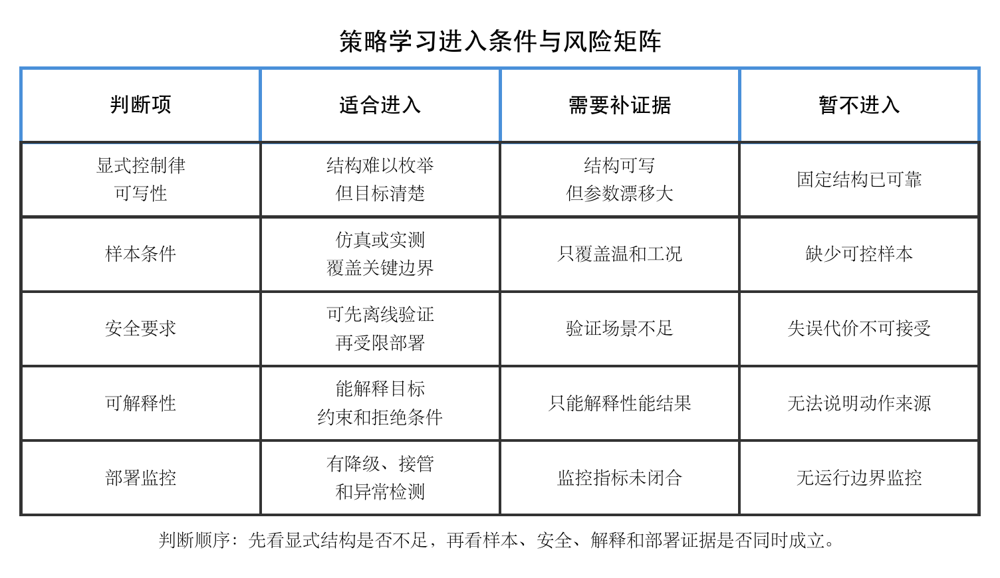

# 单元 5-5 | 从显式控制器到策略学习：强化学习的进入条件、收益与风险

**课程**：自动控制原理
**课型**：理论
**学时**：90分钟
**知识类型**：[X] 跨域型
**前置**：已能说明复杂自主系统中的感知、估计、规划与控制链路，理解模型驱动、MPC 与数据驱动控制的基本迁移逻辑。
**核心问题**：当显式控制器结构难以预先写出时，如何判断策略学习是否有进入控制问题的依据，以及这种进入会带来哪些新的工程代价。
**后续**：方法比较实践会把经典控制、数据驱动与策略学习放在同一个任务中进行取舍。

## 本次课程目标

完成学习后，我们应能够：

1. 解释显式控制律与学习策略在信息来源、动作生成和验证方式上的差异。
2. 判断强化学习进入控制问题前需要满足的任务复杂度、样本、安全和可解释性条件。
3. 比较策略学习带来的适应能力收益与样本代价、验证代价和部署风险。
4. 分析复杂自主航行任务中哪些控制职责仍应保留显式结构，哪些环节才可能考虑策略学习。
5. 评估“引入强化学习”这一决策是否给出了足够的工程证据。

## 一、显式控制器结构难以预先写出时的压力

在经典控制设计中，控制器通常先被写成一个可说明的结构。比例、积分、微分、超前、滞后、状态反馈、MPC 等方法虽然形式不同，但共同点很清楚：先明确控制目标、反馈变量、控制器结构和约束，再分析稳定性、性能和边界。

以航向保持为例，若对象近似为一阶惯性加延迟，控制器可以从误差 $e(t)=r(t)-y(t)$ 出发，写出

$$
u(t)=C(e(t),x(t),p),
$$

其中 $u(t)$ 是舵角或推进指令，$x(t)$ 是状态，$p$ 是对象参数。这个表达式的价值不只在于能算出控制量，更在于能说明控制量为什么这样产生：误差如何进入控制器，参数如何影响动作，执行器约束如何限制输出，稳定性和性能怎样被验证。

复杂自主系统会逐渐削弱这种“先写结构、再分析”的确定性。自主船舶在近岸航道中避碰时，控制层收到的参考不再是一个平滑的阶跃或斜坡，而是规划层在规则、障碍物、船舶动力学和环境风险之间权衡后的行动意图。环境状态可能高维、部分可观测、带有不确定性；同一个动作在不同水流、交通密度和传感器置信度下产生的后果也会不同。此时，控制器结构仍然可以写出一部分，但很难把所有状态、动作选择和场景条件都提前枚举成固定规则。

这个压力可以分成三类。

表 1. 显式控制器结构面临的三类压力

| 压力来源 | 典型表现 | 对控制设计的影响 |
| --- | --- | --- |
| 状态空间变大 | 周围船舶、障碍物、航道边界、环境扰动和内部状态同时变化 | 控制输入不再只由少量误差量决定 |
| 动作后果依赖场景 | 同样的舵角在不同水域、速度和交通密度下产生不同风险 | 固定规则难以覆盖所有组合 |
| 目标权衡复杂 | 跟踪、安全、能耗、舒适性、规则遵守和任务效率同时出现 | 单一性能指标难以表达完整任务 |

这些压力并不意味着显式控制器失去价值。航向稳定、舵角限制、执行器保护、故障降级和安全监控仍然需要可解释的控制结构。真正需要判断的是：在某些决策或动作选择环节中，人工预先写出完整规则的成本是否已经过高，样本和反馈是否能够提供更有效的策略形成依据。

## 二、显式控制律与学习策略的责任差异

显式控制律把动作生成过程写成可读的数学或逻辑结构。学习策略则把动作生成过程交给一个可训练的函数，例如

$$
u=\pi_\theta(x),
$$

其中 $\pi_\theta$ 表示由参数 $\theta$ 描述的策略，$x$ 表示状态或观测。策略的参数不由人工逐项设定，而通过样本、回报信号和优化过程形成。强化学习就是这一路线中的典型方法：智能体在环境中观察状态，选择动作，得到回报，再根据长期回报调整策略。

{width=100%}

显式控制器与学习策略对照图说明了两个重要差别。第一，显式控制器的核心证据来自结构：控制律写得越清楚，稳定性、性能和边界越容易被分析。第二，学习策略的核心证据来自交互样本和验证：策略可能在复杂环境中形成有效动作，但样本代价、可解释性和安全验证会同步成为必须回答的问题。

表 2. 显式控制律与学习策略的比较

| 比较维度 | 显式控制律 | 学习策略 |
| --- | --- | --- |
| 动作来源 | 由控制结构、参数和反馈关系直接计算 | 由状态、样本和回报训练得到 |
| 优势 | 可解释性较强，便于稳定性和边界分析 | 能处理难以逐项写规则的高维场景 |
| 主要代价 | 建模、结构选择和参数整定成本较高 | 样本、训练、验证和部署监控成本较高 |
| 典型风险 | 模型失配、结构选择错误、约束处理不足 | 样本覆盖不足、动作不可解释、边界工况失效 |
| 工程责任 | 证明结构和参数在目标范围内可靠 | 证明样本、策略、验证和监控足以支撑部署 |

学习策略不能被理解为“没有控制器”。策略本身仍然是动作生成机制，只是它的结构和参数来自训练过程。控制目标、约束、安全边界、异常降级和责任说明仍然存在。若这些内容没有被写清，策略学习只会把显式控制器中的困难转移到样本和验证环节。

## 三、强化学习的最小概念框架

强化学习关注的是序贯决策问题。系统在每个时刻处于某个状态 $s_k$，选择动作 $a_k$，环境转移到新状态 $s_{k+1}$，并给出回报 $r_k$。策略 $\pi$ 决定在状态下采取什么动作。学习的目标通常可以写成最大化长期累计回报：

$$
J(\pi)=\mathbb{E}_{\pi}\left[\sum_{k=0}^{\infty}\gamma^k r_k\right],
$$

其中 $\gamma$ 是折扣因子，用于衡量未来回报在当前目标中的权重。这个式子只提供概念框架，不要求在本单元推导具体算法。对控制问题更关键的是回报函数如何表达工程目标。

若把自主航行中的策略学习写成控制问题，状态可能包含本船位置、航向、速度、目标船相对状态、障碍物距离、风浪流估计和执行器状态；动作可能是参考航向修正、速度指令或局部避碰动作；回报可能奖励安全距离、航迹保持、能耗降低和动作平滑，同时惩罚碰撞风险、规则违反、舵角饱和和大幅振荡。

一个简化的回报可以写成

$$
r_k
=
-w_e e_k^2
-w_u u_k^2
-w_{\Delta u}(u_k-u_{k-1})^2
-w_c I_{\mathrm{collision}}
-w_b I_{\mathrm{boundary}},
$$

其中 $e_k$ 是跟踪误差，$u_k$ 是控制动作，$I_{\mathrm{collision}}$ 表示碰撞或近碰风险事件，$I_{\mathrm{boundary}}$ 表示越界、违反规则或触碰安全边界。这个表达式说明，强化学习进入控制问题时，最先需要被工程化的是目标和代价，而不是算法名称。

## 四、策略学习进入控制问题的条件

策略学习适合进入的典型情形是：显式控制律很难覆盖动作选择空间，任务目标仍能明确表达，样本或仿真环境能够覆盖关键边界，安全验证和部署监控有办法落地。若缺少这些条件，引入强化学习会增加不确定性。

{width=100%}

策略学习进入条件与风险矩阵给出一个判断顺序。首先检查显式结构是否真的不足；若固定结构控制、MPC 或局部数据驱动补偿已经能够可靠解决问题，就没有必要把任务整体交给策略学习。其次检查样本条件，样本既要覆盖常规工况，也要覆盖执行器边界、传感器异常、环境扰动和近碰风险。再次检查安全要求和可解释性要求，动作不能只在平均性能上表现较好，还要能说明拒绝条件、降级条件和不可部署条件。最后检查部署监控，策略上线后必须能识别自己正在离开训练与验证覆盖范围。

表 3. 强化学习进入控制任务前的五项条件

| 条件 | 需要回答的问题 | 不满足时的主要风险 |
| --- | --- | --- |
| 任务条件 | 问题是否包含难以枚举的序贯动作选择 | 用复杂方法解决简单问题 |
| 样本条件 | 仿真或实测样本是否覆盖关键状态、动作和边界 | 策略只学到常见场景，在边界处失效 |
| 回报条件 | 回报是否表达了跟踪、安全、能耗、规则和舒适性 | 策略优化了错误目标 |
| 验证条件 | 是否能进行独立测试、压力测试和故障注入 | 训练表现好，闭环部署证据不足 |
| 监控条件 | 是否有异常检测、降级、接管和更新机制 | 策略离开适用域后仍继续输出动作 |

这五项条件共同决定强化学习是否具备工程入口。只满足其中一项都不充分。场景复杂但没有可控样本，不能贸然训练；样本充足但回报函数没有表达安全，策略可能学到危险捷径；离线测试表现较好但没有部署监控，系统无法判断策略何时已经不可信。

## 五、强化学习的收益与风险同时出现

强化学习的吸引力来自三类收益。第一，它能够在高维状态中形成动作选择规律，减少人工规则枚举。第二，它能够通过长期回报处理序贯决策，把当前动作对未来风险的影响纳入策略形成过程。第三，它可以在仿真环境中反复试错，探索人工难以穷举的场景组合。

这些收益都有对应代价。

表 4. 策略学习收益与工程代价

| 可能收益 | 对应代价 | 工程判断 |
| --- | --- | --- |
| 适应高维复杂场景 | 需要大量覆盖关键边界的样本 | 样本范围比样本数量更重要 |
| 学习长期动作后果 | 回报函数设计困难，可能诱发错误捷径 | 回报必须包含安全与约束惩罚 |
| 在仿真中探索策略 | 仿真与真实对象存在差距 | 必须进行模型校准和真实部署前验证 |
| 减少人工规则枚举 | 动作来源可解释性下降 | 需要策略解释、拒绝条件和审计记录 |
| 提升部分场景性能 | 部署风险和监控要求增加 | 必须保留降级、接管和运行边界监控 |

策略学习最容易造成的误判，是把训练阶段的高分当成工程可靠性。训练回报高，说明策略在训练环境和回报定义下表现较好；它不能自动证明策略在未知水域、传感器异常、执行器退化、通信延迟或规则冲突下仍然可靠。控制问题关心的是闭环行为，一次动作错误可能带来系统级后果。因此，强化学习进入控制系统后，验证门槛通常更高。

## 六、自主航行任务中的策略学习案例头部

考虑一艘自主水面船在近岸航道执行航迹保持与避碰协同任务。系统已经具备规划层、控制层和执行层。经典控制或 MPC 可以承担底层航向跟踪、速度调节和执行器约束处理；数据驱动方法可以在扰动预测、参数更新或局部补偿中发挥作用。现在出现的新问题是：规划层在复杂交通环境中需要连续选择避碰动作，人工规则越来越难覆盖所有状态组合。

该任务的控制目标可以分为四类：

1. 保持与规划航线的可接受偏差。
2. 与其他船舶、岸线和障碍物保持安全距离。
3. 遵守舵角、舵速、推进器功率和舒适性约束。
4. 在异常状态下及时降级或请求接管。

若直接把整个闭环控制器替换为策略学习，风险很高。底层稳定、执行器限幅和安全监督仍应保留显式结构。更合理的候选入口是局部决策层：在规划层给出的候选动作之间进行选择，或在多个避碰意图之间选择风险较小、代价较低的一项。策略输出不直接越过安全监督，而要经过约束检查、可解释记录和降级机制。

案例的判断问题由此形成：面对一个拥挤航道避碰场景，策略学习可以承担“动作选择建议”，但不能取消底层控制稳定性、执行器边界和安全验证。后续分析将围绕这个场景比较显式规则、数据驱动补偿和策略学习的责任边界。

## 七、拥挤航道避碰中的策略学习进入判断示例

### 7.1 任务描述

某自主船以 $4\ \mathrm{m/s}$ 在近岸航道中航行。规划层每隔 $2\ \mathrm{s}$ 给出三个候选动作：保持航向、向左绕行、向右绕行。底层控制器已经能够稳定跟踪参考航向，并且舵角限制、舵速限制和低级安全保护都已实现。当前困难集中在候选动作选择：目标船可能横穿，岸线约束随水域变化，感知置信度也会随遮挡短时下降。

工程团队提出两个方案：

- 方案 A：继续使用人工规则。若碰撞风险超过阈值，则按最近安全方向绕行；若左右方向风险相近，则选择转角较小的一侧。
- 方案 B：训练一个策略 $\pi_\theta(s)$，输入本船状态、目标船相对状态、航道边界距离、感知置信度和当前候选动作代价，输出三个候选动作的选择建议。

问题是：方案 B 是否具备进入控制链路的条件？

### 7.2 判断步骤

**第一步：检查显式规则是否已经足够。**

若航道简单、目标船数量少、感知稳定，方案 A 的规则能够覆盖主要情况。此时引入策略学习的收益有限，反而会增加训练和验证成本。若场景中经常出现多目标交汇、左右绕行代价随时间变化、遮挡导致风险估计不稳定，人工阈值规则就可能变得脆弱。方案 B 的合法入口来自“候选动作选择空间复杂”，而不是来自“强化学习名称新”。

**第二步：检查样本是否覆盖关键边界。**

训练数据至少要覆盖以下状态：单目标横穿、多目标交汇、岸线接近、障碍物短时遮挡、感知置信度下降、舵角接近边界、规划候选动作频繁变化。若样本只来自晴天、低密度、无遮挡航道，策略可能学到过于激进的绕行偏好。

**第三步：检查回报函数是否表达工程目标。**

一个可用的回报不能只奖励“更快到达终点”。它至少要惩罚碰撞风险、安全距离不足、舵角剧烈变化、规则违反和过度接近执行器边界。若回报只写成

$$
r_k=-\alpha e_k^2-\beta t_k,
$$

其中 $e_k$ 是航迹偏差，$t_k$ 是耗时，策略可能为了缩短时间而选择高风险绕行。更合理的回报需要加入安全项和动作平滑项：

$$
r_k
=
-\alpha e_k^2
-\beta t_k
-\lambda I_{\mathrm{near\ collision}}
-\mu \Delta u_k^2
-\eta I_{\mathrm{rule\ violation}}.
$$

**第四步：检查策略输出是否经过显式约束层。**

方案 B 只应输出候选动作建议，不应绕开底层控制器和安全监督。策略给出“向左绕行”后，还需要规划层生成可执行参考，控制层验证舵角与舵速，监督层检查安全距离和规则约束。若策略输出会直接变成舵角指令，部署风险会显著上升。

**第五步：给出结论。**

在这个任务中，策略学习可以作为候选动作选择模块进入，但前提是：样本覆盖关键边界，回报函数包含安全与规则，策略输出受显式约束层限制，部署时具备异常检测、降级和接管机制。若这些证据缺失，方案 B 只能停留在离线研究或辅助分析位置。

### 7.3 示例结论表

表 5. 避碰任务中策略学习进入条件判定

| 判断项 | 证据 | 结论 |
| --- | --- | --- |
| 显式规则可写性 | 多目标交汇和遮挡使阈值规则频繁冲突 | 可考虑局部策略学习 |
| 样本覆盖 | 已覆盖多目标、岸线、遮挡和执行器边界 | 具备训练基础 |
| 回报表达 | 已包含安全距离、规则、能耗和动作平滑 | 目标表达基本成立 |
| 安全验证 | 已完成离线压力测试，但真实水域验证不足 | 需要受限部署 |
| 部署监控 | 有接管机制，但策略适用域监控尚不完整 | 暂不适合全自动放行 |

这个结论保留了策略学习的入口，也保留了工程限制。它承认策略学习能够帮助复杂动作选择，但不把它扩张为整个控制系统的替代品。

## 八、自主航行策略学习案例完整分析

### 8.1 责任分层

案例中，经典控制、数据驱动和策略学习并不处在同一层级。底层控制器负责跟踪规划参考，数据驱动模块可以补偿扰动或更新局部预测模型，策略学习模块可以参与候选动作选择。三者的关系应写成分层协作，而不是互相淘汰。

表 6. 自主航行任务中的三类方法分工

| 层级 | 优先方法 | 主要职责 | 不宜承担的职责 |
| --- | --- | --- | --- |
| 底层运动控制 | 显式控制器 / MPC | 稳定跟踪、约束处理、执行器保护 | 直接处理所有交通语义 |
| 模型补偿 | 数据驱动预测或补偿 | 修正扰动、参数漂移和局部模型偏差 | 取消控制目标与安全边界 |
| 候选动作选择 | 策略学习 | 在复杂状态中选择避碰意图 | 直接越过安全监督输出舵角 |

这张分工表可以避免一个常见误判：看见策略学习后，就把底层控制器、模型验证和安全监督全部放到次要位置。真实工程系统通常需要层级化设计。越靠近执行器，动作越需要可解释、可限制、可降级；越靠近复杂任务决策，状态组合越复杂，策略学习才可能获得空间。

### 8.2 样本代价

策略学习需要大量交互样本。若样本来自真实船舶，试错成本和安全风险很高；若样本来自仿真环境，仿真模型与真实水域的差异会影响策略可靠性。较合理的路径是先在仿真中覆盖大量边界，再用真实数据校准仿真模型，最后进行受限水域验证。

样本评估不能只看总量。一个包含百万条晴天直航样本的数据集，可能不如一个覆盖遮挡、横流、目标船突变和执行器限幅的较小数据集。控制问题中的关键样本通常出现在边界附近：舵角快到上限、安全距离接近下限、感知置信度下降、规划候选动作发生冲突。这些样本决定策略能否在危险区域保持保守。

### 8.3 可解释性与审计

策略学习的动作来源较难直接解释，因此需要额外审计信息。工程上至少要记录三类内容：策略输入状态、候选动作评分或选择依据、安全监督是否修改了策略建议。若策略建议被监督层拒绝，系统应记录拒绝原因，例如安全距离不足、舵角边界不足、规则冲突或适用域外状态。

可解释性不要求把神经网络每个参数逐项解释清楚，但要求系统能够说明动作的工程含义。若策略建议“向右绕行”，日志应能回答：右侧风险为什么低，左侧方案为何被排除，舵角和舵速是否可实现，安全距离是否保留余量。缺少这些信息，策略即使在测试中表现较好，也难以承担工程责任。

### 8.4 安全验证与部署边界

策略上线前需要至少经历三类验证。第一类是离线回放，用历史场景检查策略是否做出合理选择。第二类是仿真压力测试，主动构造遮挡、目标船突变、强横流、感知噪声和执行器退化等边界场景。第三类是受限部署，在限定水域、限定速度、限定接管条件下观察策略行为。

部署边界应明确写出。策略可以在哪些水域工作，最大交通密度是多少，感知置信度低于多少时停止使用，舵角或舵速接近边界时是否切回显式控制，远程接管条件是什么。这些边界决定策略学习从离线研究进入工程系统的资格。

## 九、分层练习

### 练习 1：概念识别

判断下列说法是否成立，并说明理由。

1. 只要控制器结构难写，就可以直接使用强化学习。
2. 策略学习输出动作后，底层控制器和安全监督仍然需要保留。
3. 训练回报高可以直接证明策略满足工程部署要求。
4. 样本覆盖关键边界比单纯增加样本数量更重要。

参考判断：第 2、4 条成立；第 1、3 条不成立。第 1 条忽略了样本、安全、解释和部署条件；第 3 条把训练环境中的表现误当成真实闭环可靠性。

### 练习 2：条件判断

某移动平台在固定仓库中运行，路径清晰、障碍物位置固定、传感器稳定，现有 MPC 已能满足速度、能耗和安全距离要求。团队希望引入强化学习替代整个控制器。请从五项进入条件判断这个方案是否合理。

参考要点：任务复杂度不足以支撑整体替代；显式控制律和 MPC 已经可靠；样本与验证成本会增加；若确需使用学习方法，可考虑局部路径代价估计或异常场景辅助，而不应替代整个控制器。

### 练习 3：工程迁移

一艘自主船在拥挤水域中经常遇到多目标交汇。人工规则在左右绕行选择上出现冲突，仿真平台已经覆盖常规航道和部分近碰场景，但缺少传感器遮挡和执行器退化样本。请设计一个受限的策略学习进入方案。

参考要点：策略学习先作为候选动作排序模块；补充遮挡、退化和边界样本；回报函数加入安全距离、规则违反、动作平滑和接管代价；策略输出必须经过规划可行性检查、底层控制约束检查和安全监督；先离线测试，再受限水域部署。

## 十、边界情况与常见误判

### 10.1 固定结构仍可靠时不必追求策略学习

若对象模型清楚、约束明确、环境变化有限，显式控制器和 MPC 往往更合适。它们可解释、可验证、调试成本低。策略学习在这种情况下可能只是增加系统复杂度。

### 10.2 回报函数错误会诱发危险捷径

若回报只奖励速度、只惩罚跟踪误差，策略可能通过贴近障碍物、频繁大动作或消耗执行器余量来获得高分。控制任务的回报必须把安全、规则、能耗、动作平滑和约束边界写入目标。

### 10.3 仿真表现不等同于真实部署

仿真环境可以大量试错，但仿真对象、传感器误差、执行器动态和环境扰动都可能与真实系统不同。策略从仿真迁移到真实对象前，需要校准、压力测试和受限验证。

### 10.4 策略学习需要显式安全外壳

策略输出应受到约束检查、异常检测和降级机制保护。尤其在船舶、车辆、机器人和工业系统中，策略不能绕过执行器边界和安全监督。

## 本节小结

1. 显式控制律的优势来自结构清楚、边界可分析；学习策略的优势来自复杂场景中的样本化动作形成。
2. 强化学习进入控制问题的前提是显式结构确实不足，同时样本、回报、安全验证、可解释性和部署监控证据能够成立。
3. 策略学习带来高维适应能力和长期决策能力，也同步带来样本代价、仿真偏差、动作解释和部署风险。
4. 在复杂自主航行任务中，策略学习更适合作为候选动作选择或局部决策模块，底层稳定控制、执行器约束和安全监督仍需保留。
5. 前沿方法不会减少工程责任。方法越难解释，越需要更清楚的边界、验证和接管机制。

## 扩展思考

面对一个新的复杂控制任务，可以按以下顺序形成方法判断：

1. 显式模型和显式控制器是否已经足够可靠。
2. 若模型依赖过重，数据能否补足预测、补偿或参数更新。
3. 若动作选择空间难以枚举，策略学习是否只承担局部决策职责。
4. 样本、回报、安全、解释和部署监控证据是否同时成立。
5. 若证据不足，方法应停留在离线分析、辅助建议或受限测试阶段。

这个顺序能够把“使用更前沿的方法”转化为“承担更清楚的工程证明”。方法迁移的价值体现在控制系统面对更复杂任务时，仍然保持目标明确、边界可检验、责任可追溯。
